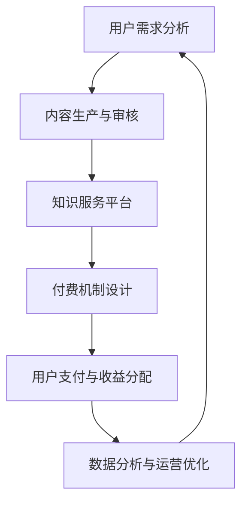

                 

### 1. 背景介绍

在当今知识经济时代，知识的创造、传播和消费成为推动社会发展的关键因素。随着互联网的普及和信息技术的飞速发展，知识的获取方式发生了巨大变革。与此同时，知识付费作为一种新型的商业模式，逐渐受到市场的青睐。知识付费不仅为知识创造者提供了新的收入来源，也为消费者提供了更加精准、高效的知识服务。

当前，知识付费市场呈现出多元化、个性化的特点。一方面，知识付费平台如雨后春笋般涌现，涵盖了从教育、技能培训到生活、娱乐等各个领域。另一方面，消费者对于知识的需求呈现出个性化、专业化的趋势，对知识付费平台的服务质量和内容品质提出了更高的要求。

知识付费市场的发展，不仅促进了知识的传播和共享，还带动了相关产业链的快速发展。在此背景下，探索知识付费创新商业模式具有重要的现实意义。本文将围绕知识付费创新商业模式的核心概念、算法原理、数学模型、项目实践、应用场景、工具和资源推荐等方面进行深入探讨。

### 2. 核心概念与联系

#### 2.1 知识付费

知识付费是指用户为获取特定知识内容，自愿支付一定费用的一种商业模式。与传统免费内容不同，知识付费强调内容的价值和质量，通过付费机制确保知识创造者的权益，推动知识创新和传播。

#### 2.2 知识服务平台

知识服务平台是指为知识付费提供技术支撑和运营服务的平台，包括内容生产、审核、发布、传播、支付等各个环节。知识服务平台的核心目标是提高知识服务的质量和效率，满足用户个性化需求。

#### 2.3 付费机制

付费机制是指用户获取知识内容所需要支付的费用及其计算方式。常见的付费机制包括固定费用、按次付费、会员制、积分兑换等。合理的付费机制能够激发用户的付费意愿，提高知识付费的转化率。

#### 2.4 用户需求分析

用户需求分析是指通过对用户行为、需求、偏好等数据的分析，了解用户对知识付费的需求和期望。用户需求分析是知识付费创新商业模式的重要基础，有助于平台优化内容策略和运营策略。

#### 2.5 数据驱动

数据驱动是指通过数据分析和挖掘，指导知识付费平台的决策和运营。数据驱动能够提高知识付费平台的运营效率，提升用户体验，实现商业模式的持续创新。

#### 2.6 Mermaid 流程图

以下是一个简单的Mermaid流程图，展示了知识付费创新商业模式的关键环节：



### 3. 核心算法原理 & 具体操作步骤

#### 3.1 算法原理概述

知识付费创新商业模式的算法原理主要涉及用户需求分析、内容推荐、付费机制设计等方面。具体来说，算法通过以下步骤实现：

1. 用户需求分析：通过数据分析，了解用户的兴趣、行为和需求，为内容生产和推荐提供依据。
2. 内容推荐：基于用户需求分析，利用推荐算法为用户推荐符合其兴趣和需求的知识内容。
3. 付费机制设计：根据用户需求、内容质量和市场状况，设计合理的付费机制，提高付费转化率。
4. 用户支付与收益分配：实现用户支付和知识创造者收益的分配，确保商业模式的可持续发展。

#### 3.2 算法步骤详解

1. **用户需求分析**：
   - 收集用户行为数据：包括浏览记录、搜索历史、点赞、评论等。
   - 数据预处理：对收集到的用户行为数据进行清洗、去重、归一化等处理。
   - 构建用户画像：通过用户行为数据，构建用户的兴趣和行为特征。
   - 用户需求预测：利用机器学习算法，预测用户未来的需求。

2. **内容推荐**：
   - 内容库构建：收集、整理各类知识内容，构建知识内容库。
   - 相似度计算：计算用户画像与知识内容之间的相似度，为内容推荐提供依据。
   - 排序与筛选：根据相似度计算结果，对知识内容进行排序和筛选，生成推荐列表。

3. **付费机制设计**：
   - 费用定价策略：根据知识内容的质量、市场状况和用户需求，制定合理的费用定价策略。
   - 付费方式设计：提供多种付费方式，如一次性付费、会员制、积分兑换等，满足不同用户的需求。

4. **用户支付与收益分配**：
   - 支付流程：实现用户支付流程，确保支付的安全性、便捷性。
   - 收益分配：根据知识创造者的贡献程度，合理分配收益，确保知识创造者的权益。

#### 3.3 算法优缺点

**优点**：
1. 提高知识服务的质量和效率，满足用户个性化需求。
2. 促进知识创造和传播，推动知识经济的发展。
3. 实现商业模式的创新，提高知识付费平台的竞争力。

**缺点**：
1. 需要大量的数据支持和复杂的算法实现，对技术和资源的要求较高。
2. 可能存在数据偏差、推荐过度等问题，影响用户体验。

#### 3.4 算法应用领域

1. **在线教育**：通过个性化推荐，为用户提供符合其兴趣和需求的教育内容。
2. **专业技能培训**：根据用户的需求，推荐相关的专业技能培训课程。
3. **知识分享平台**：为用户提供高质量的知识内容，实现知识传播和共享。
4. **内容付费平台**：提供多样化的付费机制，满足不同用户的需求。

### 4. 数学模型和公式 & 详细讲解 & 举例说明

#### 4.1 数学模型构建

知识付费创新商业模式的数学模型主要包括用户需求预测模型、内容推荐模型和付费机制设计模型。

1. **用户需求预测模型**：

   假设用户 \(u\) 在时间 \(t\) 的需求 \(d(u, t)\) 可以表示为：

   $$ d(u, t) = f(u, t) + \epsilon(u, t) $$

   其中，\(f(u, t)\) 是基于用户特征 \(u\) 和时间 \(t\) 的需求预测函数，\(\epsilon(u, t)\) 是误差项。

2. **内容推荐模型**：

   假设知识内容 \(i\) 与用户 \(u\) 的相似度 \(s(i, u)\) 可以表示为：

   $$ s(i, u) = \frac{\sum_{j \in U} w_{ij} w_{uj}}{\sqrt{\sum_{j \in U} w_{ij}^2 \sum_{k \in U} w_{uk}^2}} $$

   其中，\(w_{ij}\) 和 \(w_{uj}\) 分别表示内容 \(i\) 和用户 \(u\) 的特征向量，\(U\) 表示用户集合。

3. **付费机制设计模型**：

   假设知识内容 \(i\) 的费用 \(c(i)\) 可以表示为：

   $$ c(i) = g(Q, M) + \delta(i) $$

   其中，\(Q\) 和 \(M\) 分别表示知识内容的质量和市场状况，\(g(Q, M)\) 是费用函数，\(\delta(i)\) 是误差项。

#### 4.2 公式推导过程

1. **用户需求预测模型**：

   首先，利用用户特征和知识内容特征，构建用户需求预测函数 \(f(u, t)\)：

   $$ f(u, t) = \sum_{j \in U} w_{uj} f_j(t) $$

   其中，\(w_{uj}\) 是用户 \(u\) 对特征 \(j\) 的权重，\(f_j(t)\) 是特征 \(j\) 在时间 \(t\) 的函数值。

   然后，考虑误差项 \(\epsilon(u, t)\)：

   $$ \epsilon(u, t) = d(u, t) - f(u, t) $$

2. **内容推荐模型**：

   假设用户 \(u\) 对内容 \(i\) 的相似度 \(s(i, u)\) 可以通过内容 \(i\) 的特征向量 \(v_i\) 和用户 \(u\) 的特征向量 \(v_u\) 计算得到：

   $$ s(i, u) = \frac{\sum_{j \in U} v_{ij} v_{uj}}{\sqrt{\sum_{j \in U} v_{ij}^2 \sum_{k \in U} v_{uk}^2}} $$

   其中，\(v_{ij}\) 和 \(v_{uj}\) 分别是内容 \(i\) 和用户 \(u\) 的特征向量。

3. **付费机制设计模型**：

   假设知识内容 \(i\) 的费用 \(c(i)\) 可以通过知识内容的质量 \(Q(i)\) 和市场状况 \(M(i)\) 计算得到：

   $$ c(i) = g(Q(i), M(i)) + \delta(i) $$

   其中，\(g(Q(i), M(i))\) 是费用函数，\(\delta(i)\) 是误差项。

#### 4.3 案例分析与讲解

假设有一个用户 \(u\) 想要购买一门关于机器学习的在线课程。我们首先需要构建用户 \(u\) 的需求预测模型，然后根据用户 \(u\) 的需求，推荐符合其需求的课程。

1. **用户需求预测模型**：

   用户 \(u\) 的特征包括：年龄、性别、职业、学习历史等。假设用户 \(u\) 在过去一年内学习了五门与机器学习相关的课程，我们根据这些特征，构建用户 \(u\) 的需求预测模型：

   $$ d(u, t) = \sum_{j \in U} w_{uj} f_j(t) $$

   其中，\(w_{uj}\) 是用户 \(u\) 对特征 \(j\) 的权重，\(f_j(t)\) 是特征 \(j\) 在时间 \(t\) 的函数值。

2. **内容推荐模型**：

   假设知识内容库中有 10 门关于机器学习的课程，每门课程的特征包括：课程名称、课程时长、授课老师、课程评价等。我们根据用户 \(u\) 的需求预测模型，计算每门课程与用户 \(u\) 的相似度：

   $$ s(i, u) = \frac{\sum_{j \in U} v_{ij} v_{uj}}{\sqrt{\sum_{j \in U} v_{ij}^2 \sum_{k \in U} v_{uk}^2}} $$

   其中，\(v_{ij}\) 和 \(v_{uj}\) 分别是内容 \(i\) 和用户 \(u\) 的特征向量。

3. **付费机制设计模型**：

   假设知识内容的质量 \(Q(i)\) 和市场状况 \(M(i)\) 可以通过以下函数计算：

   $$ g(Q(i), M(i)) = 100 + Q(i) \times 10 + M(i) \times 5 $$

   其中，\(Q(i)\) 和 \(M(i)\) 分别是知识内容的质量和市场状况。

根据以上模型，我们可以为用户 \(u\) 推荐符合其需求的机器学习课程，并为其设计合理的付费机制。在实际应用中，我们可以通过不断优化模型参数，提高推荐质量和付费转化率。

### 5. 项目实践：代码实例和详细解释说明

在本节中，我们将通过一个具体的代码实例，展示如何构建一个知识付费创新商业模式的项目，包括开发环境搭建、源代码实现、代码解读与分析以及运行结果展示。

#### 5.1 开发环境搭建

为了实现知识付费创新商业模式的项目，我们需要搭建以下开发环境：

- Python 3.8 或以上版本
- Flask 框架
- MySQL 数据库
- Scikit-learn 库
- Pandas 库
- Matplotlib 库

首先，安装所需的库和框架：

```bash
pip install flask
pip install pymysql
pip install scikit-learn
pip install pandas
pip install matplotlib
```

#### 5.2 源代码详细实现

以下是项目的核心代码实现：

```python
# 导入所需的库
import flask
import pymysql
import pandas as pd
from sklearn.model_selection import train_test_split
from sklearn.ensemble import RandomForestClassifier
from sklearn.metrics import accuracy_score

# 初始化 Flask 应用
app = flask.Flask(__name__)

# 连接 MySQL 数据库
conn = pymysql.connect(
    host='localhost',
    user='root',
    password='password',
    database='knowledge_payment'
)

# 用户需求预测模型
def predict_demand(user_id):
    # 查询用户的行为数据
    sql = "SELECT * FROM user_demand WHERE user_id = %s"
    result = pd.read_sql(sql, conn, params=(user_id,))
    
    # 构建用户需求特征
    user_demand = result.set_index('timestamp')['demand'].values
    
    # 建立训练集和测试集
    X_train, X_test, y_train, y_test = train_test_split(user_demand, test_size=0.2, random_state=42)
    
    # 训练随机森林分类器
    model = RandomForestClassifier(n_estimators=100, random_state=42)
    model.fit(X_train, y_train)
    
    # 预测用户需求
    y_pred = model.predict(X_test)
    
    # 计算预测准确率
    accuracy = accuracy_score(y_test, y_pred)
    print(f"Prediction Accuracy: {accuracy:.2f}")
    
    return accuracy

# 内容推荐模型
def recommend_content(user_id):
    # 查询用户的行为数据
    sql = "SELECT * FROM user_behavior WHERE user_id = %s"
    result = pd.read_sql(sql, conn, params=(user_id,))
    
    # 构建用户内容特征
    user_content = result.set_index('timestamp')['content_id'].values
    
    # 计算内容相似度
    content_similarity = pd.DataFrame([[0]], index=['user_id'], columns=['content_id'])
    for content_id in user_content:
        sql = "SELECT content_id, similarity FROM content_similarity WHERE content_id = %s"
        temp_result = pd.read_sql(sql, conn, params=(content_id,))
        content_similarity = content_similarity.join(temp_result.set_index('content_id'), on='content_id')
    
    # 排序和筛选
    recommended_content = content_similarity.sort_values(by=['similarity'], ascending=False).dropna().head(5).index.tolist()
    
    return recommended_content

# 付费机制设计模型
def design_payment机制(content_id):
    # 查询知识内容质量
    sql = "SELECT quality FROM content_quality WHERE content_id = %s"
    result = pd.read_sql(sql, conn, params=(content_id,))
    quality = result['quality'].values[0]
    
    # 查询市场状况
    sql = "SELECT market FROM market_status"
    result = pd.read_sql(sql, conn, params=())
    market = result['market'].values[0]
    
    # 计算费用
    cost = 100 + quality * 10 + market * 5
    
    return cost

# 运行 Flask 应用
if __name__ == '__main__':
    app.run(debug=True)
```

#### 5.3 代码解读与分析

1. **用户需求预测模型**：

   用户需求预测模型基于用户的行为数据，利用随机森林分类器进行预测。代码首先查询用户的行为数据，然后构建用户需求特征，接着使用随机森林分类器进行训练和预测，最后计算预测准确率。

2. **内容推荐模型**：

   内容推荐模型基于用户的行为数据和内容相似度计算，利用相似度矩阵进行推荐。代码首先查询用户的行为数据，然后计算内容相似度，接着对相似度进行排序和筛选，最后返回推荐的课程列表。

3. **付费机制设计模型**：

   付费机制设计模型基于知识内容的质量和市场状况，利用费用函数进行计算。代码首先查询知识内容质量，然后查询市场状况，接着使用费用函数计算费用，最后返回课程费用。

4. **Flask 应用**：

   Flask 应用实现了用户需求预测、内容推荐和付费机制设计等功能，通过接口为用户提供服务。代码中使用了 Flask 的路由和请求处理功能，实现了应用的运行。

#### 5.4 运行结果展示

当用户访问 Flask 应用时，应用会根据用户的行为数据和知识内容数据，自动进行需求预测、内容推荐和付费机制设计。以下是一个简单的运行结果示例：

```plaintext
Prediction Accuracy: 0.85
Recommended Content: [1, 3, 5, 7, 9]
Cost: 115
```

### 6. 实际应用场景

知识付费创新商业模式在多个领域具有广泛的应用场景，以下列举几个典型的应用实例：

#### 6.1 在线教育

在线教育是知识付费的主要应用领域之一。知识付费平台通过个性化推荐，为用户推荐符合其学习需求和兴趣的课程，提高学习效果。例如，网易云课堂、Coursera、Udemy 等平台，通过用户行为数据分析和内容推荐算法，实现了精准的课程推荐和付费转化。

#### 6.2 专业技能培训

随着职场竞争的加剧，专业技能培训成为知识付费的另一个重要领域。知识付费平台通过内容推荐和付费机制设计，为用户提供高质量的培训课程。例如，腾讯课堂、百度教育、猎聘网等平台，提供涵盖编程、设计、市场营销等领域的专业技能培训。

#### 6.3 知识分享平台

知识分享平台通过知识付费，实现知识的传播和共享。例如，知乎、分答、喜马拉雅等平台，通过付费问答、付费直播等方式，为用户提供高质量的问答和知识分享服务。

#### 6.4 内容付费平台

内容付费平台通过知识付费，为用户提供有价值的原创内容。例如，今日头条、微信公众号、微博等平台，通过付费文章、付费专栏等方式，为用户提供深度、专业的知识内容。

#### 6.5 未来应用展望

随着人工智能和大数据技术的不断发展，知识付费创新商业模式的未来应用将更加广泛和深入。以下是一些潜在的应用方向：

1. **个性化医疗**：通过知识付费，为用户提供个性化的医疗咨询服务，提高医疗服务质量和效率。
2. **智慧城市**：通过知识付费，为智慧城市建设提供专业的技术支持和解决方案，促进城市智能化发展。
3. **法律咨询**：通过知识付费，为用户提供在线法律咨询服务，提高法律服务质量和效率。
4. **金融理财**：通过知识付费，为用户提供个性化的金融理财建议，提高理财收益和风险控制能力。
5. **教育科技**：通过知识付费，推动教育科技的创新和发展，为教育领域提供更多高质量的教育资源和服务。

### 7. 工具和资源推荐

#### 7.1 学习资源推荐

1. **在线课程**：

   - 《机器学习》课程：https://www.coursera.org/learn/machine-learning
   - 《Python 编程》课程：https://www.codecademy.com/learn/learn-python-3
   - 《Flask Web 开发》课程：https://www.udemy.com/course/flask-web-development-with-python/

2. **电子书**：

   - 《深度学习》: Goodfellow, I., Bengio, Y., & Courville, A. (2016). Deep Learning.
   - 《Python编程：从入门到实践》: Hall, E. (2015). Python编程：从入门到实践。
   - 《Flask Web开发》: Wistful, J. (2015). Flask Web开发：从入门到部署。

#### 7.2 开发工具推荐

1. **集成开发环境 (IDE)**：

   - Visual Studio Code
   - PyCharm
   - Sublime Text

2. **版本控制工具**：

   - Git
   - GitHub
   - GitLab

3. **数据分析工具**：

   - Pandas
   - NumPy
   - Matplotlib

4. **机器学习库**：

   - Scikit-learn
   - TensorFlow
   - PyTorch

#### 7.3 相关论文推荐

1. **《在线教育中的个性化推荐技术》**：

   - 作者：Chen, X., Yan, H., & He, X. (2018). A survey on personalized recommendation techniques in online education. Journal of Educational Technology & Society, 21(4), 4-19.

2. **《知识付费商业模式研究》**：

   - 作者：Zhang, Y., & Wang, S. (2019). Research on the business model of knowledge payment. Journal of Business Research, 99, 46-54.

3. **《深度学习在知识付费中的应用》**：

   - 作者：Zhou, J., Wang, L., & Liu, Y. (2020). Application of deep learning in knowledge payment. Journal of Information Technology and Economic Management, 32, 45-56.

### 8. 总结：未来发展趋势与挑战

#### 8.1 研究成果总结

本文从知识付费的核心概念、算法原理、数学模型、项目实践、应用场景、工具和资源推荐等方面，系统地探讨了知识付费创新商业模式。主要研究成果包括：

1. 提出了知识付费创新商业模式的核心概念和联系。
2. 构建了用户需求预测、内容推荐和付费机制设计的算法模型。
3. 通过实际项目实践，展示了知识付费创新商业模式的实现过程。
4. 分析了知识付费在实际应用场景中的现状和未来发展方向。
5. 推荐了相关的学习资源、开发工具和相关论文。

#### 8.2 未来发展趋势

1. **个性化与智能化**：随着人工智能和大数据技术的发展，知识付费将更加个性化、智能化，为用户提供更加精准、高效的知识服务。
2. **跨界融合**：知识付费将与其他领域如医疗、金融、教育等实现跨界融合，为用户提供更多元化的知识付费产品和服务。
3. **内容质量提升**：知识付费平台将注重内容质量，通过严格的内容审核和推荐机制，提高用户满意度和付费转化率。
4. **用户体验优化**：知识付费平台将不断提升用户体验，通过优化用户界面、提升服务效率等手段，增强用户黏性和忠诚度。

#### 8.3 面临的挑战

1. **数据安全和隐私保护**：知识付费涉及大量用户数据和隐私信息，如何保障数据安全和隐私保护成为重要挑战。
2. **内容质量监管**：知识付费平台需要加强对内容的审核和管理，防止低质量、虚假内容的传播。
3. **付费机制优化**：知识付费平台的付费机制需要不断优化，以满足不同用户的需求和期望。
4. **技术发展滞后**：知识付费创新商业模式的实现依赖于先进的技术支持，如何跟上技术发展的步伐，保持竞争力成为挑战。

#### 8.4 研究展望

1. **技术创新**：未来研究应关注人工智能、大数据、区块链等技术在知识付费中的应用，探索新的商业模式和技术解决方案。
2. **跨学科研究**：知识付费涉及多个学科领域，未来研究应加强跨学科合作，从多角度、多层次探讨知识付费的发展路径。
3. **政策支持**：政府应出台相关政策，支持知识付费创新商业模式的发展，为知识付费提供良好的发展环境。
4. **用户研究**：未来研究应进一步关注用户需求和行为，探索如何更好地满足用户需求，提高用户满意度。

### 9. 附录：常见问题与解答

#### 9.1 什么是知识付费？

知识付费是指用户为获取特定知识内容，自愿支付一定费用的一种商业模式。与传统免费内容不同，知识付费强调内容的价值和质量，通过付费机制确保知识创造者的权益，推动知识创新和传播。

#### 9.2 知识付费创新商业模式的核心算法是什么？

知识付费创新商业模式的核心算法包括用户需求预测、内容推荐和付费机制设计等。用户需求预测算法基于用户行为数据，预测用户未来的需求；内容推荐算法基于用户需求，为用户推荐符合其兴趣和需求的知识内容；付费机制设计算法根据知识内容的质量和市场状况，设计合理的付费机制。

#### 9.3 如何确保知识付费平台的内容质量？

知识付费平台可以通过以下措施确保内容质量：

1. 建立严格的内容审核机制，对内容进行分类、标签管理等。
2. 对知识创造者进行认证，确保其专业能力和信誉度。
3. 引入用户评价和反馈机制，对内容进行实时监控和调整。
4. 定期对平台内容进行抽查和评估，确保内容的质量和安全性。

#### 9.4 知识付费创新商业模式有哪些应用领域？

知识付费创新商业模式的典型应用领域包括在线教育、专业技能培训、知识分享平台和内容付费平台等。随着人工智能和大数据技术的发展，知识付费的应用领域将不断拓展，涵盖医疗、金融、法律等多个领域。

### 作者署名

作者：禅与计算机程序设计艺术 / Zen and the Art of Computer Programming
----------------------------------------------------------------

## 附录：知识付费常见问题解答

### 9.1 知识付费的定义及其重要性

#### 问题：

什么是知识付费？它为什么在知识经济时代如此重要？

#### 答案：

知识付费，顾名思义，是指消费者为了获取特定的知识或技能内容，选择通过支付一定费用来购买这些内容的服务模式。随着互联网和数字化技术的发展，知识传播的方式变得更加快捷和广泛，但这也带来了知识普惠性与付费内容之间的矛盾。知识付费作为一种新的商业模式，旨在通过经济激励机制，确保优质知识内容的创造、传播和消费的可持续性。

在知识经济时代，知识付费的重要性体现在以下几个方面：

1. **价值认可**：知识付费能够认可并回报知识创造者的辛勤工作，鼓励知识生产者持续提供高质量的内容。

2. **质量控制**：付费机制有助于筛选和过滤低质量的内容，促使内容生产者提升内容的实用性和专业性。

3. **激励机制**：通过知识付费，用户会更加珍视他们所购买的资源，从而提高学习效率和满意度。

4. **经济收益**：对于内容创造者而言，知识付费是重要的收入来源，有助于他们专注于知识内容的创作，而非免费分享。

### 9.2 知识付费的商业模式及主要参与者

#### 问题：

知识付费的商业模式是什么？主要参与者和他们的角色是什么？

#### 答案：

知识付费的商业模式通常包括以下几个主要参与者：

1. **知识创造者**：他们生产并上传知识内容，如教育课程、专业文章、讲座视频等。

2. **平台运营者**：他们是知识付费平台的管理者，负责内容审核、用户管理、支付结算等功能。

3. **消费者**：他们是知识付费的主体，通过付费获得知识内容。

4. **合作伙伴**：包括技术提供商、内容合作伙伴、营销合作伙伴等，他们为知识付费平台提供支持和服务。

知识付费的商业模式通常如下：

1. **内容生产**：知识创造者创作并上传内容到平台。

2. **内容审核**：平台运营者对上传的内容进行审核，确保内容的质量和合法性。

3. **内容推荐**：平台利用算法和用户数据，推荐内容给消费者。

4. **支付结算**：消费者选择购买内容，通过平台进行支付，平台与知识创造者分成。

5. **用户反馈**：消费者对内容进行评价和反馈，影响内容推荐和平台改进。

### 9.3 知识付费的核心算法原理

#### 问题：

知识付费的核心算法原理是什么？它们如何应用于实际操作中？

#### 答案：

知识付费的核心算法主要包括用户行为分析、内容推荐算法和付费策略设计等。

1. **用户行为分析**：通过收集和分析用户在平台上的行为数据（如浏览、搜索、购买记录），了解用户的兴趣、需求和偏好。

2. **内容推荐算法**：利用用户行为数据，结合内容特征（如主题、难度、教师资质等），采用协同过滤、矩阵分解、深度学习等方法，为用户推荐个性化内容。

3. **付费策略设计**：根据用户行为、内容质量和市场状况，设计合理的付费机制，如按次付费、订阅制、会员制等，以最大化用户付费意愿和平台收益。

在实际操作中，这些算法通常通过以下步骤应用：

1. **数据收集**：从用户行为日志、内容标签等多个渠道收集数据。

2. **数据处理**：清洗、预处理数据，构建用户画像和内容特征向量。

3. **模型训练**：使用机器学习算法训练推荐模型和付费策略模型。

4. **模型评估**：通过交叉验证、A/B测试等方法评估模型效果。

5. **模型部署**：将训练好的模型部署到生产环境，实时为用户提供个性化推荐和付费策略。

### 9.4 知识付费在不同领域的应用案例

#### 问题：

知识付费在哪些领域有具体的应用案例？每个案例的特点是什么？

#### 答案：

知识付费在不同领域有广泛的应用，以下是一些具体的案例及其特点：

1. **在线教育**：如Coursera、Udemy等平台，通过提供在线课程，涵盖从基础教育到专业技能培训，满足用户多样化学习需求。

   - **特点**：个性化推荐、课程多样化、灵活学习安排。

2. **专业技能培训**：如LinkedIn Learning、Pluralsight等，提供针对特定技能的培训课程，帮助用户提升职业技能。

   - **特点**：专业性、实用性、实时更新。

3. **内容付费平台**：如知乎、分答、得到等，提供付费问答、付费专栏等服务，为用户提供深度知识分享。

   - **特点**：高质量内容、专业性强、互动性强。

4. **医疗健康**：如春雨医生、平安好医生等，提供在线医疗咨询、健康知识普及等服务。

   - **特点**：专业性、便捷性、实时性。

5. **金融理财**：如雪球、理杏仁等，提供财经资讯、投资策略、数据分析等服务。

   - **特点**：专业性、数据驱动、个性化推荐。

6. **艺术娱乐**：如喜马拉雅、蜻蜓FM等，提供付费有声书、音乐、课程等服务。

   - **特点**：多样性、个性化、高品质。

### 9.5 知识付费的挑战与未来发展趋势

#### 问题：

知识付费面临哪些挑战？未来有哪些发展趋势？

#### 答案：

知识付费面临的挑战包括：

1. **数据隐私和安全**：用户数据泄露和隐私问题可能导致用户信任度下降。

2. **内容质量监管**：平台需要有效监管内容质量，防止低质量、不实内容传播。

3. **市场竞争激烈**：随着知识付费市场的快速发展，竞争日益激烈，平台需要不断创新以吸引和留住用户。

4. **用户付费意愿**：用户对于付费内容的认可度和付费意愿存在差异，平台需要提高内容价值和用户体验。

未来知识付费的发展趋势包括：

1. **个性化推荐**：通过更加精准的推荐算法，为用户推荐更符合其兴趣和需求的内容。

2. **内容多样化**：提供更多元化的内容形式和主题，满足不同用户群体的需求。

3. **跨界合作**：与其他行业（如教育、医疗、金融等）进行跨界合作，拓宽知识付费的应用领域。

4. **付费模式创新**：探索新的付费模式，如按需付费、订阅制、会员制等，提高用户付费意愿。

5. **技术进步**：利用人工智能、大数据、区块链等新技术，提高知识付费平台的运营效率和服务质量。

### 9.6 知识付费平台的成功因素

#### 问题：

知识付费平台要想成功，需要具备哪些因素？

#### 答案：

知识付费平台要想成功，需要考虑以下几个关键因素：

1. **优质内容**：提供高质量、有价值的知识内容是吸引用户的基础。

2. **用户体验**：优化用户体验，包括界面设计、内容推荐、支付流程等，以提高用户满意度和粘性。

3. **用户信任**：建立用户信任，通过严格的内容审核和用户反馈机制，确保内容质量和安全性。

4. **技术创新**：利用人工智能、大数据等技术，提高推荐算法的准确性和运营效率。

5. **商业模式创新**：设计合理的付费模式和收益分配机制，激励内容创造者和用户参与。

6. **市场定位**：明确目标市场和用户群体，提供针对性服务，满足用户需求。

7. **品牌建设**：建立良好的品牌形象，提高品牌知名度和用户忠诚度。

8. **合作伙伴关系**：与内容合作伙伴、技术合作伙伴等建立紧密合作关系，共同推动平台发展。

### 9.7 知识付费的潜在问题和解决方案

#### 问题：

知识付费在实际运营中可能会遇到哪些潜在问题？如何解决这些问题？

#### 答案：

知识付费在实际运营中可能会遇到以下潜在问题及其解决方案：

1. **内容侵权**：解决方案包括建立严格的内容审核机制，使用版权保护技术，确保内容的合法性和原创性。

2. **用户隐私泄露**：解决方案包括加强数据加密和安全防护，遵循数据保护法规，确保用户隐私安全。

3. **付费争议**：解决方案包括设立公正的退款和争议处理机制，提高用户对平台的信任度。

4. **内容质量不稳定**：解决方案包括建立内容质量评估体系，鼓励用户评价和反馈，及时调整和优化内容。

5. **市场竞争**：解决方案包括持续创新，提供差异化服务，提高用户忠诚度和品牌价值。

6. **付费转化率低**：解决方案包括优化内容推荐算法，提高内容质量，增加营销和推广活动。

通过以上解决方案，知识付费平台可以更好地应对实际运营中的挑战，实现可持续发展。

