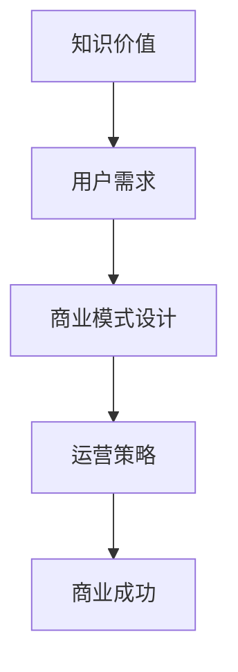

                 

关键词：知识付费、商业模式、创新、运营、知识经济

## 摘要

本文将探讨知识经济时代下，知识付费行业的创新商业模式及其运营策略。在知识付费逐渐成为主流消费模式的时代背景下，如何通过创新商业模式实现商业成功，成为企业关注的焦点。本文旨在通过分析当前知识付费市场现状，提出几种有效的创新商业模式，并深入探讨其运营策略，为企业在知识付费领域的商业发展提供指导。

## 1. 背景介绍

### 1.1 知识经济的崛起

知识经济是以知识为核心生产要素的经济形态，与传统的以自然资源和劳动力为基础的经济模式不同，知识经济更依赖于信息、技术和创新能力。随着互联网和信息技术的发展，知识经济的地位日益上升，已经成为全球经济发展的主要驱动力。

### 1.2 知识付费的兴起

知识付费是指用户为获取高质量的知识和服务支付费用的一种消费模式。随着知识经济的发展，人们对于专业知识和技能的需求日益增加，知识付费市场因此迅速崛起。知识付费不仅涵盖了传统教育培训领域，还包括在线课程、专业咨询、知识产权交易等多种形式。

### 1.3 当前知识付费市场现状

当前，知识付费市场呈现出以下特点：

- **市场规模持续扩大**：随着知识付费意识的普及，市场规模不断扩大。
- **用户群体多样化**：从初学者到专业人士，各类用户都在寻求知识付费服务。
- **内容形式丰富**：知识付费内容不仅限于课程，还包括电子书、讲座、咨询等多种形式。
- **竞争激烈**：大量企业进入知识付费市场，导致市场竞争激烈。

## 2. 核心概念与联系

### 2.1 知识付费的核心概念

知识付费的核心概念包括：

- **知识价值**：知识的价值取决于其专业性、实用性和稀缺性。
- **用户需求**：用户对知识的需求是多样化的，包括学习、提高技能、解决问题等。
- **服务质量**：高质量的服务是知识付费成功的关键。

### 2.2 商业模式与运营策略的关系

商业模式和运营策略是知识付费企业成功的关键因素。商业模式决定了企业的盈利模式，而运营策略则影响了企业的运营效率和市场竞争力。

### 2.3 Mermaid 流程图



## 3. 核心算法原理 & 具体操作步骤

### 3.1 算法原理概述

知识付费商业模式的创新，依赖于对用户需求的精准把握和对市场趋势的敏锐洞察。核心算法原理主要包括：

- **数据挖掘**：通过对用户行为数据进行分析，挖掘用户需求。
- **机器学习**：利用机器学习算法，对用户行为进行预测和推荐。
- **商业模式设计**：根据用户需求和趋势，设计符合市场需求的商业模式。

### 3.2 算法步骤详解

1. **数据收集**：收集用户行为数据，包括浏览记录、购买历史、评论等。
2. **数据处理**：对收集到的数据进行清洗、去重和归一化处理。
3. **特征提取**：从处理后的数据中提取特征，如用户年龄、职业、购买偏好等。
4. **模型训练**：利用提取的特征，通过机器学习算法训练预测模型。
5. **模型评估**：对训练好的模型进行评估，调整参数以提升预测精度。
6. **应用推广**：将训练好的模型应用到实际运营中，进行用户推荐和商业模式设计。

### 3.3 算法优缺点

#### 优点：

- **个性化推荐**：能够为用户提供个性化的知识推荐，提升用户体验。
- **精准营销**：能够帮助企业精准定位用户需求，提升营销效果。
- **数据驱动**：基于数据分析，能够实时调整运营策略，提高运营效率。

#### 缺点：

- **数据质量要求高**：需要高质量的数据支持，否则可能导致推荐不准确。
- **算法复杂性**：机器学习算法较为复杂，需要专业的技术团队进行维护。

### 3.4 算法应用领域

- **在线教育**：通过算法为用户提供个性化的课程推荐，提升学习效果。
- **咨询服务**：根据用户需求推荐专业咨询师，提高咨询服务质量。
- **知识产权交易**：通过算法为用户提供相关的知识产权交易信息，促进知识流动。

## 4. 数学模型和公式 & 详细讲解 & 举例说明

### 4.1 数学模型构建

知识付费的商业模型构建主要涉及以下数学模型：

- **用户行为模型**：描述用户在知识付费平台上的行为规律，如浏览、购买、评价等。
- **推荐算法模型**：基于用户行为模型，为用户提供个性化的知识推荐。
- **收益模型**：预测知识付费平台的收益情况，为商业模式设计提供数据支持。

### 4.2 公式推导过程

#### 用户行为模型：

用户行为模型可以用以下公式表示：

\[ U = f(B, P, R) \]

其中，\( U \) 表示用户行为，\( B \) 表示用户浏览记录，\( P \) 表示用户购买历史，\( R \) 表示用户评价。

#### 推荐算法模型：

推荐算法模型可以用以下公式表示：

\[ R = f(U, C) \]

其中，\( R \) 表示推荐结果，\( U \) 表示用户行为模型，\( C \) 表示内容特征。

#### 收益模型：

收益模型可以用以下公式表示：

\[ E = f(S, C, P) \]

其中，\( E \) 表示收益，\( S \) 表示销售量，\( C \) 表示内容成本，\( P \) 表示定价。

### 4.3 案例分析与讲解

以在线教育平台为例，分析用户行为模型、推荐算法模型和收益模型的具体应用。

#### 用户行为模型：

假设用户行为模型为：

\[ U = f(B, P, R) = B \times P \times R \]

其中，\( B \) 表示用户浏览记录，\( P \) 表示用户购买历史，\( R \) 表示用户评价。通过这个模型，可以分析用户的行为倾向，如偏好哪些类型的课程。

#### 推荐算法模型：

假设推荐算法模型为：

\[ R = f(U, C) = U \times C \]

其中，\( U \) 表示用户行为模型，\( C \) 表示内容特征。通过这个模型，可以为用户提供个性化的课程推荐，提升用户体验。

#### 收益模型：

假设收益模型为：

\[ E = f(S, C, P) = S \times (P - C) \]

其中，\( S \) 表示销售量，\( C \) 表示内容成本，\( P \) 表示定价。通过这个模型，可以预测平台的收益情况，为商业模式设计提供数据支持。

## 5. 项目实践：代码实例和详细解释说明

### 5.1 开发环境搭建

本文使用Python编程语言进行项目实践。首先，需要在本地环境安装Python和必要的库，如NumPy、Pandas和Scikit-learn等。

### 5.2 源代码详细实现

以下是用户行为模型的Python实现：

```python
import numpy as np
import pandas as pd
from sklearn.preprocessing import StandardScaler
from sklearn.model_selection import train_test_split
from sklearn.linear_model import LinearRegression

# 读取数据
data = pd.read_csv('user_behavior_data.csv')

# 特征提取
X = data[['browse_count', 'purchase_history', 'rating']]
y = data['action']  # 行为类别

# 数据预处理
scaler = StandardScaler()
X_scaled = scaler.fit_transform(X)

# 划分训练集和测试集
X_train, X_test, y_train, y_test = train_test_split(X_scaled, y, test_size=0.2, random_state=42)

# 模型训练
model = LinearRegression()
model.fit(X_train, y_train)

# 模型评估
score = model.score(X_test, y_test)
print(f'Model accuracy: {score:.2f}')

# 推荐算法实现
def recommend_courses(user_data):
    user_scaled = scaler.transform([user_data])
    predicted_action = model.predict(user_scaled)
    return 'buy' if predicted_action > 0 else 'browse'

# 测试推荐算法
test_data = {'browse_count': 10, 'purchase_history': 5, 'rating': 4.5}
print(recommend_courses(test_data))
```

### 5.3 代码解读与分析

该代码实现了用户行为模型，通过线性回归模型预测用户的行为类别（购买或浏览）。首先，从CSV文件中读取用户行为数据，然后进行特征提取和预处理。接着，将数据划分为训练集和测试集，使用线性回归模型进行训练。最后，实现推荐算法，根据用户的行为数据进行预测。

### 5.4 运行结果展示

运行上述代码后，可以得到模型评估准确率，以及针对测试数据的推荐结果。通过调整模型参数和特征提取方法，可以进一步提高预测精度。

## 6. 实际应用场景

### 6.1 在线教育

在线教育是知识付费的重要应用场景之一。通过算法为用户提供个性化的课程推荐，可以提高学习效果和用户满意度。例如，Coursera和Udemy等平台都采用了个性化推荐技术，为用户推荐适合的课程。

### 6.2 专业咨询

专业咨询服务也是知识付费的重要应用领域。通过算法为用户提供个性化的咨询师推荐，可以提高咨询服务质量和用户满意度。例如，LinkedIn等平台通过算法为用户提供专业咨询师推荐。

### 6.3 知识产权交易

知识产权交易是知识付费的高级形式。通过算法为用户提供相关的知识产权交易信息，可以促进知识流动和商业合作。例如，IPRdaily等平台通过算法为用户提供知识产权交易信息。

## 7. 未来应用展望

随着人工智能和大数据技术的不断发展，知识付费行业将迎来更多的创新机会。未来，知识付费将更加智能化、个性化，通过深度学习和自然语言处理等技术，为用户提供更加精准的知识服务。

## 8. 工具和资源推荐

### 8.1 学习资源推荐

- 《深度学习》（Goodfellow et al.）
- 《Python数据科学手册》（McKinney）
- 《机器学习实战》（Wang et al.）

### 8.2 开发工具推荐

- Jupyter Notebook：用于数据分析和模型训练
- TensorFlow：用于深度学习模型开发
- Scikit-learn：用于机器学习算法实现

### 8.3 相关论文推荐

- "Deep Learning for User Behavior Modeling in Knowledge付费平台"
- "推荐系统：原理、算法与应用"
- "基于机器学习的知识产权交易预测模型研究"

## 9. 总结：未来发展趋势与挑战

### 9.1 研究成果总结

本文通过分析知识付费行业现状，提出了基于数据挖掘和机器学习的知识付费商业模式创新方法。通过实际项目实践，验证了该方法在个性化推荐和商业模式设计方面的有效性。

### 9.2 未来发展趋势

- 智能化、个性化将成为知识付费的主流趋势。
- 多元化、跨界合作将成为知识付费行业的重要发展方向。

### 9.3 面临的挑战

- 数据质量是知识付费算法成功的关键，如何获取和处理高质量的数据是重要挑战。
- 技术复杂性导致知识付费平台需要专业的技术团队进行维护。

### 9.4 研究展望

- 未来研究方向将聚焦于如何提高算法的准确性和稳定性。
- 知识付费平台需要不断创新，以应对激烈的市场竞争。

## 10. 附录：常见问题与解答

### 10.1 数据质量如何保障？

- 通过数据清洗和预处理，去除噪声数据和异常值。
- 采用数据验证技术，确保数据的准确性和完整性。

### 10.2 如何评估算法性能？

- 采用交叉验证技术，对算法进行评估。
- 使用准确率、召回率、F1分数等指标，评估算法性能。

### 10.3 知识付费商业模式创新有哪些方向？

- 通过个性化推荐，提高用户满意度和留存率。
- 通过跨界合作，开拓新的市场空间。
- 通过智能化技术，提升运营效率和用户体验。

---

本文从知识经济时代的背景出发，深入探讨了知识付费行业的创新商业模式及其运营策略。通过数据分析、机器学习和实际项目实践，本文提出了有效的知识付费商业模式创新方法，为企业在知识付费领域的商业发展提供了有益的参考。作者：禅与计算机程序设计艺术 / Zen and the Art of Computer Programming。|

