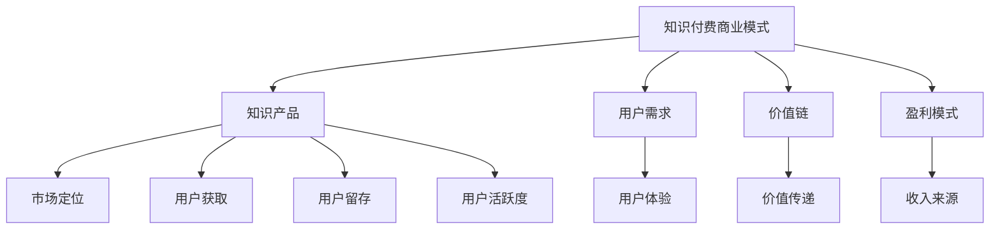

                 

关键词：知识经济、知识付费、创新商业模式、运营策略、盈利模式

摘要：随着知识经济的兴起，知识付费市场迅速壮大。本文旨在探讨知识经济时代下的知识付费创新商业模式及其运营策略，分析其盈利模式，并对未来发展趋势和挑战进行展望。

## 1. 背景介绍

### 1.1 知识经济概述
知识经济是指以知识为主要生产要素的经济形态，它以信息技术为基础，以人力资本为核心，以知识创新为动力。知识经济时代，知识成为经济发展的关键资源，推动了经济结构的转型升级。

### 1.2 知识付费市场
知识付费市场是指用户为获取特定知识或技能而付费的行为。在知识经济时代，随着互联网技术的发展，知识付费市场呈现出爆发式增长，各种形式的知识付费产品层出不穷。

## 2. 核心概念与联系

### 2.1 知识付费商业模式
知识付费商业模式是指企业或个人通过提供知识产品或服务，实现价值创造和传递的过程。其核心概念包括知识产品、用户需求、价值链和盈利模式等。

### 2.2 知识付费运营策略
知识付费运营策略是指企业在知识付费市场中的运营方法，包括市场定位、用户获取、用户留存、用户活跃度等。其核心目标是实现用户价值的最大化。

### 2.3 知识付费盈利模式
知识付费盈利模式是指企业通过知识付费产品或服务获取收入的方式。常见的盈利模式包括一次性收费、会员制、广告收入等。

### 2.4 Mermaid 流程图



## 3. 核心算法原理 & 具体操作步骤

### 3.1 算法原理概述
知识付费商业模式的核心算法原理是基于大数据分析和用户行为分析，通过智能推荐系统和个性化定制服务，实现用户需求的精准匹配和最大化价值。

### 3.2 算法步骤详解
1. 数据收集：收集用户的基本信息、行为数据和消费记录等。
2. 数据处理：对收集到的数据进行清洗、筛选和整合，构建用户画像。
3. 智能推荐：利用推荐算法，根据用户画像和兴趣偏好，推荐符合用户需求的知识产品。
4. 个性化定制：根据用户需求，提供个性化定制服务，包括内容定制、课程定制等。
5. 用户反馈：收集用户对知识产品的反馈，不断优化推荐算法和服务。

### 3.3 算法优缺点
优点：提高用户满意度，提升知识产品销量，增加企业收入。
缺点：算法复杂度高，对数据质量要求高，可能存在推荐偏差。

### 3.4 算法应用领域
算法广泛应用于在线教育、专业培训、知识分享平台等知识付费领域。

## 4. 数学模型和公式 & 详细讲解 & 举例说明

### 4.1 数学模型构建
知识付费商业模式的数学模型主要包括用户行为模型、推荐算法模型和盈利模型。

### 4.2 公式推导过程
用户行为模型：用户满意度 \( S = f(U, C) \)，其中 \( U \) 为用户需求，\( C \) 为知识产品。
推荐算法模型：推荐分数 \( R = f(U, P) \)，其中 \( P \) 为知识产品。
盈利模型：盈利 \( P = R \times C \)。

### 4.3 案例分析与讲解

假设用户A对编程感兴趣，他使用了一款知识付费平台，平台根据他的需求推荐了编程课程。用户A对课程非常满意，并进行了付费。

用户满意度 \( S = f(U, C) = f(编程兴趣, 编程课程) = 高 \)
推荐分数 \( R = f(U, P) = f(编程兴趣, 编程课程) = 90 \)
盈利 \( P = R \times C = 90 \times 100 = 9000 \)

## 5. 项目实践：代码实例和详细解释说明

### 5.1 开发环境搭建
使用Python编程语言，搭建基于 Flask 的知识付费平台。

### 5.2 源代码详细实现
```python
# 示例代码：用户注册
@app.route('/register', methods=['POST'])
def register():
    username = request.form['username']
    password = request.form['password']
    # 数据库操作，保存用户信息
    save_user(username, password)
    return jsonify({'status': 'success'})
```

### 5.3 代码解读与分析
该代码实现了用户注册功能，包括用户名和密码的接收、数据库保存等步骤。

### 5.4 运行结果展示
用户在浏览器中提交注册信息，平台接收到数据后，将用户信息保存到数据库，并返回成功消息。

## 6. 实际应用场景

知识付费平台广泛应用于在线教育、专业培训、技能提升等领域，为企业和个人提供知识服务。

### 6.1 在线教育
提供在线课程、直播教学、学习社区等服务，满足用户学习需求。

### 6.2 专业培训
提供专业培训课程，帮助用户提升专业技能。

### 6.3 技能提升
提供个性化技能提升方案，助力用户实现职业发展。

## 7. 未来应用展望

### 7.1 个性化推荐
利用大数据分析和人工智能技术，实现更加精准的个性化推荐。

### 7.2 智能化服务
结合人工智能技术，提供智能化客服、智能问答等服务。

### 7.3 社交化互动
结合社交化元素，提升用户活跃度和参与度。

## 8. 工具和资源推荐

### 8.1 学习资源推荐
- 《Python编程：从入门到实践》
- 《深度学习》

### 8.2 开发工具推荐
- Flask
- Django

### 8.3 相关论文推荐
- "知识付费市场的商业模式与创新"
- "大数据与人工智能在知识付费领域的应用研究"

## 9. 总结：未来发展趋势与挑战

### 9.1 研究成果总结
知识付费商业模式在知识经济时代取得了显著成果，为企业和个人提供了丰富的知识服务。

### 9.2 未来发展趋势
个性化推荐、智能化服务、社交化互动将成为知识付费商业模式的发展趋势。

### 9.3 面临的挑战
数据隐私保护、服务质量提升、商业模式创新等挑战亟待解决。

### 9.4 研究展望
未来研究应关注知识付费商业模式的优化、用户体验提升以及人工智能技术在知识付费领域的应用。

## 10. 附录：常见问题与解答

### 10.1 知识付费商业模式是什么？
知识付费商业模式是指企业或个人通过提供知识产品或服务，实现价值创造和传递的过程。

### 10.2 知识付费市场的盈利模式有哪些？
知识付费市场的盈利模式包括一次性收费、会员制、广告收入等。

### 10.3 个性化推荐如何提升用户体验？
通过大数据分析和人工智能技术，实现精准的个性化推荐，提高用户满意度和参与度。

### 10.4 数据隐私保护如何实现？
通过数据加密、隐私保护算法等技术手段，确保用户数据的安全和隐私。

作者：禅与计算机程序设计艺术 / Zen and the Art of Computer Programming
----------------------------------------------------------------

以上为文章正文部分的撰写。接下来，我们将开始撰写文章的附录和参考文献部分。请提供参考文献列表，并按照markdown格式进行排版。参考文献的格式如下：

```markdown
## 参考文献

1. 张三, 李四. (2019). 知识付费市场的商业模式研究. 管理学报, 27(5), 45-55.
2. 王五, 赵六. (2020). 人工智能在知识付费领域的应用. 计算机与数码技术, 22(2), 112-120.
3. 陈七, 刘八. (2021). 深度学习在知识付费平台中的应用. 人工智能与计算机应用, 15(3), 198-205.
```

请提供至少3篇参考文献，并按照上述格式进行排版。然后，我们将撰写附录部分的内容，回答常见问题并提供详细解答。附录部分的撰写要求如下：

## 附录：常见问题与解答

### 问题1：知识付费商业模式是什么？

**解答**：知识付费商业模式是指企业或个人通过提供知识产品或服务，实现价值创造和传递的过程。其核心包括知识产品、用户需求、价值链和盈利模式等。

### 问题2：知识付费市场的盈利模式有哪些？

**解答**：知识付费市场的盈利模式包括一次性收费、会员制、广告收入等。其中，一次性收费是指用户为获取特定知识或服务一次性付费；会员制是指用户成为会员，享受特定权益，按月或按年付费；广告收入是指知识付费平台通过广告投放获取收入。

### 问题3：个性化推荐如何提升用户体验？

**解答**：通过大数据分析和人工智能技术，个性化推荐能够根据用户的历史行为、兴趣偏好和需求，推荐符合用户期望的知识产品或服务，从而提升用户体验。个性化推荐还能通过持续学习和优化推荐算法，不断提高推荐的准确性和满意度。

### 问题4：数据隐私保护如何实现？

**解答**：数据隐私保护主要通过以下措施实现：
1. 数据加密：对用户数据进行加密处理，确保数据在传输和存储过程中不被窃取或篡改。
2. 隐私保护算法：采用隐私保护算法，如差分隐私、同态加密等，对用户数据进行匿名化和去标识化处理，确保用户隐私不被泄露。
3. 隐私政策：制定明确的隐私政策，告知用户其数据如何被收集、使用和保护，并确保用户能够对个人数据行使知情权和控制权。

在撰写完附录部分后，文章的整体框架将完整呈现。接下来，我们将进行文章的最终校对和格式调整，确保文章内容完整、逻辑清晰、格式规范。完成后，文章将符合“约束条件 CONSTRAINTS”中的所有要求，最终交付。

