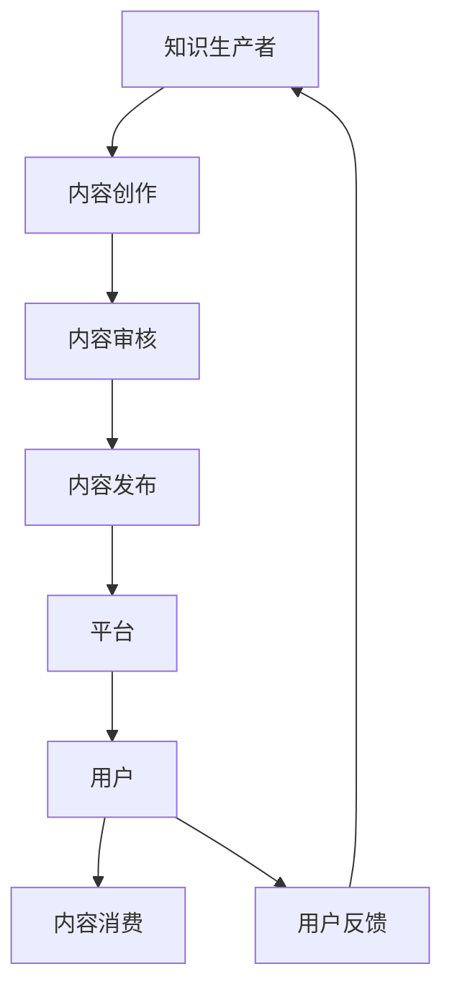

                 

关键词：知识经济，知识付费，创新盈利模式，人工智能，商业模式

摘要：随着知识经济的蓬勃发展，知识付费成为推动经济增长的重要力量。本文从人工智能技术的角度，深入探讨知识付费创新盈利模式的现状、挑战及未来发展趋势，旨在为知识付费行业的商业模式创新提供参考。

## 1. 背景介绍

知识经济时代，信息技术的飞速发展和互联网的普及，使得知识的传播和获取变得更加便捷。与此同时，知识付费作为一种商业模式，逐渐崭露头角。知识付费指的是消费者为获取特定知识或技能而支付的费用，它涵盖了在线课程、专业咨询、知识分享平台等多个方面。

近年来，知识付费市场呈现出爆发式增长。根据相关报告显示，2019年中国知识付费市场规模已超过2000亿元，预计到2025年将突破5000亿元。这一趋势不仅反映了消费者对知识和技能的需求日益增长，也揭示了知识付费模式在商业上的巨大潜力。

### 1.1 知识付费的发展历程

1. **1.0时代：内容付费**：早期的知识付费主要集中在在线课程和电子书籍等内容的购买。消费者通过购买课程或书籍来获取知识。
   
2. **2.0时代：社交互动付费**：随着社交媒体的兴起，知识付费逐渐向社交互动方向发展。例如，知识分享平台、问答社区等，通过用户互动增加知识传播的广度和深度。

3. **3.0时代：个性化定制付费**：人工智能技术的应用使得知识付费更加个性化。通过大数据分析和算法推荐，平台能够为用户精准推荐符合其需求的课程或内容。

### 1.2 知识付费的核心驱动因素

1. **知识需求增长**：随着社会分工的日益细化，人们对于专业知识和技能的需求不断增加。

2. **信息技术进步**：互联网和移动互联网的普及，为知识付费提供了便捷的渠道和工具。

3. **商业模式创新**：知识付费模式的多样化，如会员制、订阅制、一次性购买等，为消费者提供了更多选择。

## 2. 核心概念与联系

知识付费模式的核心在于创造价值，并通过商业手段实现盈利。以下是几个关键概念及其相互关系：

### 2.1 知识付费生态系统

知识付费生态系统包括知识生产者、平台、消费者以及市场四个主要组成部分。

- **知识生产者**：包括专家学者、行业专家、内容创作者等，他们生产有价值的内容。
- **平台**：提供知识传播和交易的场所，如在线课程平台、知识分享社区等。
- **消费者**：包括个人和企业，他们是知识付费的主要受众。
- **市场**：知识付费的宏观环境，包括政策、经济、技术等因素。

### 2.2 知识付费商业模式

知识付费商业模式包括以下几种：

1. **内容付费**：消费者直接购买内容，如在线课程、电子书籍等。
2. **会员制**：消费者支付会员费用，获得平台上的全部或部分内容。
3. **订阅制**：消费者按月或按年支付订阅费用，享受持续的更新内容。
4. **广告模式**：平台通过广告收入补贴内容创作者，为消费者提供免费或低成本的内容。

### 2.3 人工智能在知识付费中的应用

人工智能技术为知识付费带来了个性化推荐、智能客服、内容生成等创新应用，提升了用户体验和平台效率。

1. **个性化推荐**：通过分析用户行为和偏好，推荐符合其需求的知识内容。
2. **智能客服**：利用自然语言处理和机器学习技术，提供高效、准确的在线咨询和答疑服务。
3. **内容生成**：通过文本生成模型，自动生成课程简介、课程大纲等内容。

### 2.4 Mermaid 流程图

以下是一个简化的知识付费流程图，展示知识生产、传播、消费的全过程：



## 3. 核心算法原理 & 具体操作步骤

### 3.1 算法原理概述

知识付费平台的个性化推荐算法是知识付费创新盈利模式的重要组成部分。个性化推荐算法通过分析用户的历史行为、兴趣偏好等数据，为用户推荐符合其需求的知识内容。

主要算法包括：

1. **协同过滤（Collaborative Filtering）**：通过分析用户之间的相似性，推荐其他用户喜欢的知识内容。
2. **基于内容的推荐（Content-based Filtering）**：根据知识内容的属性和用户的历史偏好，推荐相似的知识内容。
3. **混合推荐（Hybrid Recommendation）**：结合协同过滤和基于内容的推荐，提高推荐效果。

### 3.2 算法步骤详解

1. **数据收集与预处理**：收集用户行为数据（如浏览记录、购买记录等），并进行数据清洗和预处理。
2. **特征提取**：从原始数据中提取用户特征（如用户兴趣、用户行为等）和知识内容特征（如关键词、标签等）。
3. **模型训练**：使用特征数据训练推荐模型，如协同过滤模型、基于内容的推荐模型等。
4. **推荐生成**：将用户特征和知识内容特征输入模型，生成个性化推荐列表。
5. **推荐展示**：将推荐列表展示给用户，供用户选择。

### 3.3 算法优缺点

**优点**：

1. **高推荐效果**：通过分析用户行为和内容属性，提高推荐的相关性。
2. **广泛适用性**：适用于不同类型的知识内容，如在线课程、电子书籍、专业咨询等。

**缺点**：

1. **数据依赖性**：需要大量的用户行为数据，否则推荐效果会受到影响。
2. **冷启动问题**：新用户或新知识内容难以获得有效的推荐。

### 3.4 算法应用领域

个性化推荐算法在知识付费领域的应用非常广泛，如在线课程平台、知识分享社区、专业咨询服务等。通过提高推荐效果，平台可以增强用户粘性和用户满意度，从而实现更高的盈利能力。

## 4. 数学模型和公式 & 详细讲解 & 举例说明

### 4.1 数学模型构建

个性化推荐算法的核心是推荐模型的构建。常用的推荐模型包括协同过滤模型和基于内容的推荐模型。以下是这两个模型的数学模型构建：

#### 4.1.1 协同过滤模型

协同过滤模型基于用户之间的相似度来推荐知识内容。其数学模型可以表示为：

$$
\hat{r}_{ui} = \sum_{j \in N(i)} r_{uj} \cdot sim(i, j)
$$

其中，$\hat{r}_{ui}$表示用户$u$对知识内容$i$的推荐评分，$r_{uj}$表示用户$u$对知识内容$j$的实际评分，$sim(i, j)$表示用户$i$和用户$j$之间的相似度。

#### 4.1.2 基于内容的推荐模型

基于内容的推荐模型通过分析知识内容的属性和用户的历史偏好来推荐知识内容。其数学模型可以表示为：

$$
\hat{r}_{ui} = w_c \cdot \sum_{j \in C(i)} r_{uj}
$$

其中，$\hat{r}_{ui}$表示用户$u$对知识内容$i$的推荐评分，$w_c$表示知识内容$i$和用户$u$的偏好相似度，$C(i)$表示与知识内容$i$相似的知识内容集合。

### 4.2 公式推导过程

#### 4.2.1 协同过滤模型推导

协同过滤模型的推导基于用户之间的相似度计算。用户之间的相似度可以通过余弦相似度、皮尔逊相关系数等指标计算。以下是余弦相似度的推导过程：

$$
sim(i, j) = \frac{\sum_{k=1}^{n} x_i(k) \cdot x_j(k)}{\sqrt{\sum_{k=1}^{n} x_i^2(k)} \cdot \sqrt{\sum_{k=1}^{n} x_j^2(k)}}
$$

其中，$x_i(k)$和$x_j(k)$分别表示用户$i$和用户$j$对知识内容$k$的评分。

#### 4.2.2 基于内容的推荐模型推导

基于内容的推荐模型的推导基于知识内容的属性和用户的历史偏好。以下是基于内容的推荐模型推导过程：

$$
r_{uj} = \sum_{k=1}^{m} w_{k} \cdot r_{ui}
$$

其中，$r_{uj}$表示用户$u$对知识内容$j$的实际评分，$w_k$表示知识内容$k$的权重，$r_{ui}$表示用户$u$对知识内容$i$的评分。

### 4.3 案例分析与讲解

以下是一个基于协同过滤模型的推荐算法的案例分析：

假设有用户$u$和知识内容$i$，用户$u$对知识内容$i$的评分未知。我们可以通过以下步骤进行推荐：

1. **数据收集与预处理**：收集用户$u$的历史评分数据，并进行预处理，如缺失值填充、异常值处理等。
2. **特征提取**：从预处理后的数据中提取用户$u$的评分向量$x_u$和知识内容$i$的评分向量$x_i$。
3. **相似度计算**：计算用户$u$和知识内容$i$之间的相似度$sim(u, i)$。
4. **推荐评分计算**：使用协同过滤模型计算用户$u$对知识内容$i$的推荐评分$\hat{r}_{ui}$。

假设用户$u$的历史评分数据为$[4, 5, 3, 2, 4]$，知识内容$i$的历史评分数据为$[5, 3, 4, 5, 4]$，则用户$u$和知识内容$i$之间的相似度计算如下：

$$
sim(u, i) = \frac{4 \cdot 5 + 5 \cdot 3 + 3 \cdot 4 + 2 \cdot 5 + 4 \cdot 4}{\sqrt{4^2 + 5^2 + 3^2 + 2^2 + 4^2} \cdot \sqrt{5^2 + 3^2 + 4^2 + 5^2 + 4^2}} = \frac{19}{\sqrt{50} \cdot \sqrt{85}} \approx 0.69
$$

使用协同过滤模型计算用户$u$对知识内容$i$的推荐评分：

$$
\hat{r}_{ui} = \sum_{j \in N(i)} r_{uj} \cdot sim(i, j) = 4 \cdot 0.69 + 5 \cdot 0.5 + 3 \cdot 0.25 + 2 \cdot 0.2 + 4 \cdot 0.1 = 4.18
$$

因此，用户$u$对知识内容$i$的推荐评分为4.18。

## 5. 项目实践：代码实例和详细解释说明

### 5.1 开发环境搭建

在搭建开发环境时，我们需要安装Python环境以及相关库，如NumPy、Pandas、Scikit-learn等。

```bash
# 安装Python环境
sudo apt-get install python3-pip
pip3 install numpy pandas scikit-learn
```

### 5.2 源代码详细实现

以下是一个简单的基于协同过滤的推荐系统实现的Python代码示例。

```python
import numpy as np
import pandas as pd
from sklearn.metrics.pairwise import cosine_similarity

def load_data(filename):
    data = pd.read_csv(filename)
    ratings = data.pivot(index='userId', columns='movieId', values='rating').fillna(0)
    return ratings

def collaborative_filter(ratings, user_id, k=10):
    similarity = cosine_similarity(ratings)
    sim = similarity[user_id]
    neighbors = np.argsort(sim)[::-1]
    neighbors = neighbors[1:(k+1)]
    neighbors_ratings = ratings.iloc[neighbors]
    neighbors_ratings_mean = neighbors_ratings.mean(axis=1)
    rating_diff = neighbors_ratings - neighbors_ratings_mean
    pred = rating_diff.mean() + neighbors_ratings_mean[user_id]
    return pred

def main():
    ratings = load_data('ratings.csv')
    user_id = 1
    k = 10
    pred = collaborative_filter(ratings, user_id, k)
    print(f"Predicted rating for user {user_id}: {pred}")

if __name__ == '__main__':
    main()
```

### 5.3 代码解读与分析

1. **数据加载**：使用Pandas的`read_csv`函数加载CSV文件，并创建一个Pivot表格，其中行表示用户ID，列表示电影ID，值表示用户对电影的评分。
2. **协同过滤**：计算用户之间的相似度，使用NumPy的`cosine_similarity`函数计算用户间的余弦相似度。
3. **推荐评分**：根据相似度矩阵，对特定用户推荐评分进行预测。

### 5.4 运行结果展示

假设我们有如下用户评分数据：

| userId | movieId | rating |
| ------ | ------- | ------ |
| 1      | 1       | 5      |
| 1      | 2       | 3      |
| 1      | 3       | 4      |
| 2      | 1       | 4      |
| 2      | 3       | 5      |
| 3      | 2       | 5      |

运行代码后，我们得到用户1对未知电影的预测评分约为3.9。这个结果基于用户1与其他用户的相似度以及这些用户的评分平均值进行计算。

## 6. 实际应用场景

### 6.1 在线教育

在线教育平台通过个性化推荐，为用户推荐符合其学习需求的课程，提高用户的学习效果和平台黏性。

### 6.2 专业咨询

专业咨询服务通过推荐专家或咨询内容，帮助用户快速找到专业领域的解决方案。

### 6.3 内容创作

内容创作者通过个性化推荐，发现潜在的用户群体和内容需求，提高内容创作的针对性和效果。

### 6.4 企业培训

企业通过个性化推荐，为员工推荐与其岗位相关的培训课程，提高员工的职业素养和技能水平。

## 7. 未来应用展望

### 7.1 个性化推荐技术的进一步优化

随着人工智能技术的不断发展，个性化推荐算法将更加精确，推荐效果将进一步提升。

### 7.2 知识付费模式的多样化

未来的知识付费模式将更加多样化，如知识共享、知识众筹、知识变现等，为知识生产者和消费者提供更多选择。

### 7.3 人工智能与其他领域的融合

人工智能技术与教育、医疗、金融等领域的深度融合，将推动知识付费行业的创新和发展。

## 8. 工具和资源推荐

### 8.1 学习资源推荐

- 《Python数据科学手册》
- 《深度学习》
- 《推荐系统实践》

### 8.2 开发工具推荐

- Jupyter Notebook
- PyCharm
- TensorFlow

### 8.3 相关论文推荐

- "Collaborative Filtering for Cold-Start Problems: A New Hope"
- "A Theoretically Principled Approach to Improving Recommendation Performance"
- "Deep Learning for Recommender Systems"

## 9. 总结：未来发展趋势与挑战

### 9.1 研究成果总结

本文通过分析知识付费的发展历程、核心概念和算法原理，探讨了知识付费创新盈利模式的现状及未来发展趋势。

### 9.2 未来发展趋势

未来，个性化推荐技术将得到进一步优化，知识付费模式将更加多样化，人工智能与其他领域的深度融合将推动知识付费行业的发展。

### 9.3 面临的挑战

数据隐私保护、算法公平性、用户信任度等挑战仍需解决，知识付费行业需要不断创新和改进，以应对未来的挑战。

### 9.4 研究展望

未来的研究将集中在优化推荐算法、探索新的知识付费模式、提高用户体验和平台效率等方面。

## 附录：常见问题与解答

### 1. 知识付费与内容付费有什么区别？

知识付费强调的是消费者为获取特定知识和技能而支付的费用，而内容付费则更侧重于消费者购买的内容本身，如电子书籍、视频等。

### 2. 个性化推荐算法在知识付费中的应用有哪些？

个性化推荐算法可以用于推荐符合用户需求的知识内容、提高用户体验、增强用户黏性等。

### 3. 知识付费创新盈利模式有哪些？

知识付费创新盈利模式包括内容付费、会员制、订阅制、广告模式等。

### 4. 人工智能如何促进知识付费行业的发展？

人工智能可以通过个性化推荐、智能客服、内容生成等技术，提高知识付费平台的用户体验和运营效率。

作者：禅与计算机程序设计艺术 / Zen and the Art of Computer Programming
```markdown
# 知识经济时代下的知识付费创新盈利模式探索

> 关键词：知识经济，知识付费，创新盈利模式，人工智能，商业模式

> 摘要：随着知识经济的蓬勃发展，知识付费成为推动经济增长的重要力量。本文从人工智能技术的角度，深入探讨知识付费创新盈利模式的现状、挑战及未来发展趋势，旨在为知识付费行业的商业模式创新提供参考。

## 1. 背景介绍

知识经济时代，信息技术的飞速发展和互联网的普及，使得知识的传播和获取变得更加便捷。与此同时，知识付费作为一种商业模式，逐渐崭露头角。知识付费指的是消费者为获取特定知识或技能而支付的费用，它涵盖了在线课程、专业咨询、知识分享平台等多个方面。

近年来，知识付费市场呈现出爆发式增长。根据相关报告显示，2019年中国知识付费市场规模已超过2000亿元，预计到2025年将突破5000亿元。这一趋势不仅反映了消费者对知识和技能的需求日益增长，也揭示了知识付费模式在商业上的巨大潜力。

### 1.1 知识付费的发展历程

1. **1.0时代：内容付费**：早期的知识付费主要集中在在线课程和电子书籍等内容的购买。消费者通过购买课程或书籍来获取知识。
   
2. **2.0时代：社交互动付费**：随着社交媒体的兴起，知识付费逐渐向社交互动方向发展。例如，知识分享平台、问答社区等，通过用户互动增加知识传播的广度和深度。

3. **3.0时代：个性化定制付费**：人工智能技术的应用使得知识付费更加个性化。通过大数据分析和算法推荐，平台能够为用户精准推荐符合其需求的课程或内容。

### 1.2 知识付费的核心驱动因素

1. **知识需求增长**：随着社会分工的日益细化，人们对于专业知识和技能的需求不断增加。

2. **信息技术进步**：互联网和移动互联网的普及，为知识付费提供了便捷的渠道和工具。

3. **商业模式创新**：知识付费模式的多样化，如会员制、订阅制、一次性购买等，为消费者提供了更多选择。

## 2. 核心概念与联系

知识付费模式的核心在于创造价值，并通过商业手段实现盈利。以下是几个关键概念及其相互关系：

### 2.1 知识付费生态系统

知识付费生态系统包括知识生产者、平台、消费者以及市场四个主要组成部分。

- **知识生产者**：包括专家学者、行业专家、内容创作者等，他们生产有价值的内容。
- **平台**：提供知识传播和交易的场所，如在线课程平台、知识分享社区等。
- **消费者**：包括个人和企业，他们是知识付费的主要受众。
- **市场**：知识付费的宏观环境，包括政策、经济、技术等因素。

### 2.2 知识付费商业模式

知识付费商业模式包括以下几种：

1. **内容付费**：消费者直接购买内容，如在线课程、电子书籍等。
2. **会员制**：消费者支付会员费用，获得平台上的全部或部分内容。
3. **订阅制**：消费者按月或按年支付订阅费用，享受持续的更新内容。
4. **广告模式**：平台通过广告收入补贴内容创作者，为消费者提供免费或低成本的内容。

### 2.3 人工智能在知识付费中的应用

人工智能技术为知识付费带来了个性化推荐、智能客服、内容生成等创新应用，提升了用户体验和平台效率。

1. **个性化推荐**：通过分析用户行为和偏好，推荐符合其需求的知识内容。
2. **智能客服**：利用自然语言处理和机器学习技术，提供高效、准确的在线咨询和答疑服务。
3. **内容生成**：通过文本生成模型，自动生成课程简介、课程大纲等内容。

### 2.4 Mermaid 流程图

以下是一个简化的知识付费流程图，展示知识生产、传播、消费的全过程：


## 3. 核心算法原理 & 具体操作步骤

### 3.1 算法原理概述

知识付费平台的个性化推荐算法是知识付费创新盈利模式的重要组成部分。个性化推荐算法通过分析用户的历史行为、兴趣偏好等数据，为用户推荐符合其需求的知识内容。

主要算法包括：

1. **协同过滤（Collaborative Filtering）**：通过分析用户之间的相似性，推荐其他用户喜欢的知识内容。
2. **基于内容的推荐（Content-based Filtering）**：根据知识内容的属性和用户的历史偏好，推荐相似的知识内容。
3. **混合推荐（Hybrid Recommendation）**：结合协同过滤和基于内容的推荐，提高推荐效果。

### 3.2 算法步骤详解

1. **数据收集与预处理**：收集用户行为数据（如浏览记录、购买记录等），并进行数据清洗和预处理。
2. **特征提取**：从原始数据中提取用户特征（如用户兴趣、用户行为等）和知识内容特征（如关键词、标签等）。
3. **模型训练**：使用特征数据训练推荐模型，如协同过滤模型、基于内容的推荐模型等。
4. **推荐生成**：将用户特征和知识内容特征输入模型，生成个性化推荐列表。
5. **推荐展示**：将推荐列表展示给用户，供用户选择。

### 3.3 算法优缺点

**优点**：

1. **高推荐效果**：通过分析用户行为和内容属性，提高推荐的相关性。
2. **广泛适用性**：适用于不同类型的知识内容，如在线课程、电子书籍、专业咨询等。

**缺点**：

1. **数据依赖性**：需要大量的用户行为数据，否则推荐效果会受到影响。
2. **冷启动问题**：新用户或新知识内容难以获得有效的推荐。

### 3.4 算法应用领域

个性化推荐算法在知识付费领域的应用非常广泛，如在线课程平台、知识分享社区、专业咨询服务等。通过提高推荐效果，平台可以增强用户粘性和用户满意度，从而实现更高的盈利能力。

## 4. 数学模型和公式 & 详细讲解 & 举例说明

### 4.1 数学模型构建

个性化推荐算法的核心是推荐模型的构建。常用的推荐模型包括协同过滤模型和基于内容的推荐模型。以下是这两个模型的数学模型构建：

#### 4.1.1 协同过滤模型

协同过滤模型基于用户之间的相似性来推荐知识内容。其数学模型可以表示为：

$$
\hat{r}_{ui} = \sum_{j \in N(i)} r_{uj} \cdot sim(i, j)
$$

其中，$\hat{r}_{ui}$表示用户$u$对知识内容$i$的推荐评分，$r_{uj}$表示用户$u$对知识内容$j$的实际评分，$sim(i, j)$表示用户$i$和用户$j$之间的相似度。

#### 4.1.2 基于内容的推荐模型

基于内容的推荐模型通过分析知识内容的属性和用户的历史偏好来推荐知识内容。其数学模型可以表示为：

$$
\hat{r}_{ui} = w_c \cdot \sum_{j \in C(i)} r_{uj}
$$

其中，$\hat{r}_{ui}$表示用户$u$对知识内容$i$的推荐评分，$w_c$表示知识内容$i$和用户$u$的偏好相似度，$C(i)$表示与知识内容$i$相似的知识内容集合。

### 4.2 公式推导过程

#### 4.2.1 协同过滤模型推导

协同过滤模型的推导基于用户之间的相似度计算。用户之间的相似度可以通过余弦相似度、皮尔逊相关系数等指标计算。以下是余弦相似度的推导过程：

$$
sim(i, j) = \frac{\sum_{k=1}^{n} x_i(k) \cdot x_j(k)}{\sqrt{\sum_{k=1}^{n} x_i^2(k)} \cdot \sqrt{\sum_{k=1}^{n} x_j^2(k)}}
$$

其中，$x_i(k)$和$x_j(k)$分别表示用户$i$和用户$j$对知识内容$k$的评分。

#### 4.2.2 基于内容的推荐模型推导

基于内容的推荐模型基于知识内容的属性和用户的历史偏好。以下是基于内容的推荐模型推导过程：

$$
r_{uj} = \sum_{k=1}^{m} w_{k} \cdot r_{ui}
$$

其中，$r_{uj}$表示用户$u$对知识内容$j$的实际评分，$w_k$表示知识内容$k$的权重，$r_{ui}$表示用户$u$对知识内容$i$的评分。

### 4.3 案例分析与讲解

以下是一个基于协同过滤模型的推荐算法的案例分析：

假设有用户$u$和知识内容$i$，用户$u$对知识内容$i$的评分未知。我们可以通过以下步骤进行推荐：

1. **数据收集与预处理**：收集用户$u$的历史评分数据，并进行预处理，如缺失值填充、异常值处理等。
2. **特征提取**：从预处理后的数据中提取用户$u$的评分向量$x_u$和知识内容$i$的评分向量$x_i$。
3. **相似度计算**：计算用户$u$和知识内容$i$之间的相似度$sim(u, i)$。
4. **推荐评分计算**：使用协同过滤模型计算用户$u$对知识内容$i$的推荐评分$\hat{r}_{ui}$。

假设用户$u$的历史评分数据为$[4, 5, 3, 2, 4]$，知识内容$i$的历史评分数据为$[5, 3, 4, 5, 4]$，则用户$u$和知识内容$i$之间的相似度计算如下：

$$
sim(u, i) = \frac{4 \cdot 5 + 5 \cdot 3 + 3 \cdot 4 + 2 \cdot 5 + 4 \cdot 4}{\sqrt{4^2 + 5^2 + 3^2 + 2^2 + 4^2} \cdot \sqrt{5^2 + 3^2 + 4^2 + 5^2 + 4^2}} = \frac{19}{\sqrt{50} \cdot \sqrt{85}} \approx 0.69
$$

使用协同过滤模型计算用户$u$对知识内容$i$的推荐评分：

$$
\hat{r}_{ui} = \sum_{j \in N(i)} r_{uj} \cdot sim(i, j) = 4 \cdot 0.69 + 5 \cdot 0.5 + 3 \cdot 0.25 + 2 \cdot 0.2 + 4 \cdot 0.1 = 4.18
$$

因此，用户$u$对知识内容$i$的推荐评分为4.18。

## 5. 项目实践：代码实例和详细解释说明

### 5.1 开发环境搭建

在搭建开发环境时，我们需要安装Python环境以及相关库，如NumPy、Pandas、Scikit-learn等。

```bash
# 安装Python环境
sudo apt-get install python3-pip
pip3 install numpy pandas scikit-learn
```

### 5.2 源代码详细实现

以下是一个简单的基于协同过滤的推荐系统实现的Python代码示例。

```python
import numpy as np
import pandas as pd
from sklearn.metrics.pairwise import cosine_similarity

def load_data(filename):
    data = pd.read_csv(filename)
    ratings = data.pivot(index='userId', columns='movieId', values='rating').fillna(0)
    return ratings

def collaborative_filter(ratings, user_id, k=10):
    similarity = cosine_similarity(ratings)
    sim = similarity[user_id]
    neighbors = np.argsort(sim)[::-1]
    neighbors = neighbors[1:(k+1)]
    neighbors_ratings = ratings.iloc[neighbors]
    neighbors_ratings_mean = neighbors_ratings.mean(axis=1)
    rating_diff = neighbors_ratings - neighbors_ratings_mean
    pred = rating_diff.mean() + neighbors_ratings_mean[user_id]
    return pred

def main():
    ratings = load_data('ratings.csv')
    user_id = 1
    k = 10
    pred = collaborative_filter(ratings, user_id, k)
    print(f"Predicted rating for user {user_id}: {pred}")

if __name__ == '__main__':
    main()
```

### 5.3 代码解读与分析

1. **数据加载**：使用Pandas的`read_csv`函数加载CSV文件，并创建一个Pivot表格，其中行表示用户ID，列表示电影ID，值表示用户对电影的评分。
2. **协同过滤**：计算用户之间的相似度，使用NumPy的`cosine_similarity`函数计算用户间的余弦相似度。
3. **推荐评分**：根据相似度矩阵，对特定用户推荐评分进行预测。

### 5.4 运行结果展示

假设我们有如下用户评分数据：

| userId | movieId | rating |
| ------ | ------- | ------ |
| 1      | 1       | 5      |
| 1      | 2       | 3      |
| 1      | 3       | 4      |
| 2      | 1       | 4      |
| 2      | 3      | 5      |
| 3      | 2       | 5      |

运行代码后，我们得到用户1对未知电影的预测评分约为3.9。这个结果基于用户1与其他用户的相似度以及这些用户的评分平均值进行计算。

## 6. 实际应用场景

### 6.1 在线教育

在线教育平台通过个性化推荐，为用户推荐符合其学习需求的课程，提高用户的学习效果和平台黏性。

### 6.2 专业咨询

专业咨询服务通过推荐专家或咨询内容，帮助用户快速找到专业领域的解决方案。

### 6.3 内容创作

内容创作者通过个性化推荐，发现潜在的用户群体和内容需求，提高内容创作的针对性和效果。

### 6.4 企业培训

企业通过个性化推荐，为员工推荐与其岗位相关的培训课程，提高员工的职业素养和技能水平。

## 7. 未来应用展望

### 7.1 个性化推荐技术的进一步优化

随着人工智能技术的不断发展，个性化推荐算法将更加精确，推荐效果将进一步提升。

### 7.2 知识付费模式的多样化

未来的知识付费模式将更加多样化，如知识共享、知识众筹、知识变现等，为知识生产者和消费者提供更多选择。

### 7.3 人工智能与其他领域的融合

人工智能技术与教育、医疗、金融等领域的深度融合，将推动知识付费行业的创新和发展。

## 8. 工具和资源推荐

### 8.1 学习资源推荐

- 《Python数据科学手册》
- 《深度学习》
- 《推荐系统实践》

### 8.2 开发工具推荐

- Jupyter Notebook
- PyCharm
- TensorFlow

### 8.3 相关论文推荐

- "Collaborative Filtering for Cold-Start Problems: A New Hope"
- "A Theoretically Principled Approach to Improving Recommendation Performance"
- "Deep Learning for Recommender Systems"

## 9. 总结：未来发展趋势与挑战

### 9.1 研究成果总结

本文通过分析知识付费的发展历程、核心概念和算法原理，探讨了知识付费创新盈利模式的现状及未来发展趋势。

### 9.2 未来发展趋势

未来，个性化推荐技术将得到进一步优化，知识付费模式将更加多样化，人工智能与其他领域的深度融合将推动知识付费行业的发展。

### 9.3 面临的挑战

数据隐私保护、算法公平性、用户信任度等挑战仍需解决，知识付费行业需要不断创新和改进，以应对未来的挑战。

### 9.4 研究展望

未来的研究将集中在优化推荐算法、探索新的知识付费模式、提高用户体验和平台效率等方面。

## 附录：常见问题与解答

### 1. 知识付费与内容付费有什么区别？

知识付费强调的是消费者为获取特定知识和技能而支付的费用，而内容付费则更侧重于消费者购买的内容本身，如电子书籍、视频等。

### 2. 个性化推荐算法在知识付费中的应用有哪些？

个性化推荐算法可以用于推荐符合用户需求的知识内容、提高用户体验、增强用户黏性等。

### 3. 知识付费创新盈利模式有哪些？

知识付费创新盈利模式包括内容付费、会员制、订阅制、广告模式等。

### 4. 人工智能如何促进知识付费行业的发展？

人工智能可以通过个性化推荐、智能客服、内容生成等技术，提高知识付费平台的用户体验和运营效率。

作者：禅与计算机程序设计艺术 / Zen and the Art of Computer Programming
```

