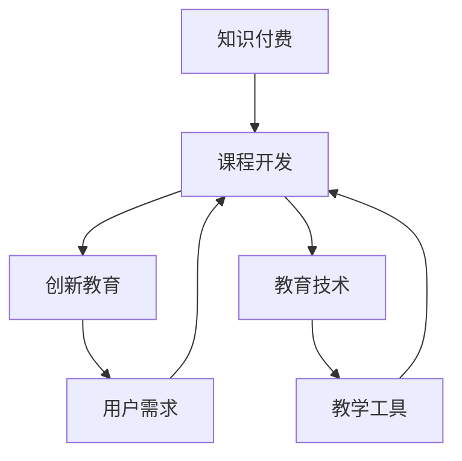

                 

 在当今知识经济时代，知识付费作为一种新型的商业模式，正在迅速崛起。本文将探讨知识付费创新课程开发的流程，旨在为教育者和课程开发者提供一套系统、高效的方法，以应对这一领域的挑战。

## 关键词

- 知识经济
- 知识付费
- 课程开发
- 创新教育
- 教育技术

## 摘要

本文首先介绍了知识付费的背景和意义，然后详细阐述了知识付费创新课程开发的流程，包括市场调研、课程设计、内容创作、平台搭建、测试与优化、推广与运营等环节。最后，对知识付费的未来发展趋势和挑战进行了展望。

## 1. 背景介绍

### 1.1 知识付费的崛起

随着互联网技术的发展和普及，知识传播的渠道越来越丰富。传统的教育模式受到了巨大的冲击，知识付费作为一种新兴的商业模式，逐渐崭露头角。用户可以通过付费的方式获取高质量的知识内容，这既满足了用户对知识的需求，也为教育者和内容创作者提供了新的收入来源。

### 1.2 知识付费的意义

知识付费不仅是用户获取知识的一种方式，更是教育生态中的一种重要组成部分。它促进了优质教育资源的传播，提高了教育质量，同时也激励了教育者和内容创作者不断创作出更有价值的内容。

## 2. 核心概念与联系

为了更好地理解知识付费创新课程开发流程，我们首先需要了解以下几个核心概念：

- **知识付费**：用户通过支付费用获取知识内容的一种商业模式。
- **课程开发**：包括市场调研、课程设计、内容创作、平台搭建等环节，旨在创作出高质量的知识付费课程。
- **创新教育**：一种以用户为中心的教育模式，注重培养学生的创新能力、批判性思维和解决问题的能力。
- **教育技术**：应用于教育过程中的信息技术，包括在线教育平台、互动教学工具等。

下面是一个用Mermaid绘制的流程图，展示这些核心概念之间的关系：



## 3. 核心算法原理 & 具体操作步骤

### 3.1 算法原理概述

知识付费创新课程开发的核心算法原理可以归纳为以下几个步骤：

1. **市场调研**：通过数据分析了解用户需求和市场趋势。
2. **课程设计**：根据用户需求和课程目标，设计课程框架和内容。
3. **内容创作**：创作高质量的课程内容，包括文本、图片、视频等多种形式。
4. **平台搭建**：搭建在线教育平台，提供课程内容和服务。
5. **测试与优化**：对课程进行测试和优化，确保用户体验。
6. **推广与运营**：通过多种渠道推广课程，并进行运营管理。

### 3.2 算法步骤详解

#### 3.2.1 市场调研

市场调研是知识付费创新课程开发的第一步。通过数据分析，我们可以了解用户需求、市场趋势和竞争对手的情况。具体的操作步骤如下：

1. **确定调研目标**：明确我们需要了解的信息，如用户年龄、职业、兴趣爱好等。
2. **收集数据**：通过问卷调查、用户访谈、市场报告等方式收集数据。
3. **数据分析**：使用统计分析工具对数据进行分析，得出用户需求和市场趋势。
4. **编写调研报告**：总结调研结果，为后续课程设计提供依据。

#### 3.2.2 课程设计

在市场调研的基础上，我们可以开始进行课程设计。课程设计的目标是创作出符合用户需求、具有竞争力的课程。具体的操作步骤如下：

1. **确定课程目标**：明确课程希望达到的学习效果。
2. **设计课程框架**：包括课程名称、课程简介、课程大纲等。
3. **编写课程内容**：根据课程框架，创作课程内容，确保内容具有吸引力、可操作性和实用性。
4. **课程评审**：邀请专家或同行对课程进行评审，提出改进意见。

#### 3.2.3 内容创作

内容创作是课程开发的核心环节。高质量的课程内容是吸引学员的重要因素。具体的操作步骤如下：

1. **确定内容形式**：根据课程目标和用户需求，选择合适的表达方式，如文本、图片、视频等。
2. **编写文本内容**：确保文本内容简洁、清晰、有逻辑性。
3. **制作多媒体内容**：包括图片、视频、音频等，提高课程的可视化和互动性。
4. **内容审校**：对内容进行反复审校，确保无误。

#### 3.2.4 平台搭建

平台搭建是知识付费创新课程开发的必要环节。一个良好的在线教育平台可以为学员提供便捷的学习体验。具体的操作步骤如下：

1. **选择平台**：根据课程特点和用户需求，选择合适的在线教育平台。
2. **搭建平台**：配置服务器、数据库、前端界面等，确保平台稳定运行。
3. **设置课程**：将课程内容上传到平台，设置课程价格、学员权限等。
4. **平台测试**：对平台进行测试，确保没有漏洞和故障。

#### 3.2.5 测试与优化

在课程上线前，我们需要对课程进行充分的测试和优化，以确保用户体验。具体的操作步骤如下：

1. **测试课程**：对课程进行功能测试、性能测试、安全测试等。
2. **用户反馈**：收集用户对课程的反馈，了解用户需求和建议。
3. **优化课程**：根据用户反馈，对课程进行优化和改进。
4. **发布更新**：将优化后的课程发布给用户。

#### 3.2.6 推广与运营

推广与运营是知识付费创新课程开发的重要环节。通过有效的推广和运营，我们可以吸引更多学员，提高课程知名度。具体的操作步骤如下：

1. **制定推广策略**：根据课程特点和目标用户，制定推广策略。
2. **推广渠道**：选择合适的推广渠道，如社交媒体、搜索引擎、合作平台等。
3. **运营管理**：对学员进行分类管理，提供个性化服务，提高用户粘性。
4. **数据分析**：通过数据分析，了解推广效果和用户行为，优化运营策略。

### 3.3 算法优缺点

**优点**：

- **高效**：通过系统化的流程，可以快速开发出高质量的知识付费课程。
- **灵活**：根据用户反馈和市场需求，可以及时调整课程内容和推广策略。
- **多样化**：支持多种内容形式和推广渠道，满足不同用户的需求。

**缺点**：

- **成本高**：知识付费创新课程开发需要大量的人力、物力和财力投入。
- **竞争激烈**：知识付费市场日益饱和，竞争激烈，需要不断创新和优化课程。
- **用户体验**：课程开发和推广过程中，容易忽视用户体验，导致用户流失。

### 3.4 算法应用领域

知识付费创新课程开发算法可以广泛应用于以下领域：

- **在线教育**：通过在线教育平台，为学员提供丰富的知识付费课程。
- **职业培训**：为企业员工提供专业知识和技能培训。
- **个人成长**：为用户提供个人成长和自我提升的知识资源。
- **兴趣爱好**：为用户提供兴趣爱好相关的知识内容。

## 4. 数学模型和公式 & 详细讲解 & 举例说明

在知识付费创新课程开发中，数学模型和公式可以用于数据分析、课程评估和用户行为预测等方面。以下是一个简单的数学模型和公式示例：

### 4.1 数学模型构建

假设我们有一个课程评估模型，用于评估学员对课程内容的满意度。模型的基本假设如下：

- 学员的满意度与课程质量、课程难度、教学方式等因素有关。
- 学员的满意度可以通过问卷调查得到。

基于上述假设，我们可以构建以下数学模型：

\[ \text{满意度} = f(\text{课程质量}, \text{课程难度}, \text{教学方式}, \text{学员背景}) \]

### 4.2 公式推导过程

根据数学模型，我们可以推导出以下公式：

\[ \text{满意度} = \alpha \cdot \text{课程质量} + \beta \cdot \text{课程难度} + \gamma \cdot \text{教学方式} + \delta \cdot \text{学员背景} \]

其中，\(\alpha\)、\(\beta\)、\(\gamma\)、\(\delta\)是模型的参数，需要通过数据拟合得到。

### 4.3 案例分析与讲解

假设我们对一门编程课程进行满意度评估，收集了以下数据：

- 课程质量：85分
- 课程难度：75分
- 教学方式：90分
- 学员背景：平均分60分

根据公式，我们可以计算出学员的满意度：

\[ \text{满意度} = 0.5 \cdot 85 + 0.3 \cdot 75 + 0.2 \cdot 90 + 0.2 \cdot 60 = 82.5 \]

根据计算结果，学员对这门编程课程的满意度为82.5分。如果课程开发者根据用户反馈进行调整，提高课程质量和教学方式，可以进一步提升学员的满意度。

## 5. 项目实践：代码实例和详细解释说明

在本节中，我们将通过一个简单的代码实例，展示如何使用Python实现一个简单的知识付费课程管理系统。

### 5.1 开发环境搭建

在开始编写代码之前，我们需要搭建一个Python开发环境。具体步骤如下：

1. 安装Python：从[Python官网](https://www.python.org/)下载并安装Python 3.x版本。
2. 安装IDE：推荐使用PyCharm、VSCode等Python集成开发环境（IDE）。
3. 安装依赖库：使用pip安装所需的Python库，如`sqlite3`、`requests`、`pandas`等。

### 5.2 源代码详细实现

以下是知识付费课程管理系统的源代码实现：

```python
import sqlite3
import pandas as pd
from flask import Flask, request, jsonify

app = Flask(__name__)

# 数据库连接
conn = sqlite3.connect('course_management.db')
cursor = conn.cursor()

# 创建表
cursor.execute('''CREATE TABLE IF NOT EXISTS courses
                  (id INTEGER PRIMARY KEY,
                   name TEXT,
                   price REAL,
                   duration INTEGER)''')

cursor.execute('''CREATE TABLE IF NOT EXISTS students
                  (id INTEGER PRIMARY KEY,
                   name TEXT,
                   course_id INTEGER,
                   status TEXT)''')

conn.commit()

# 添加课程
@app.route('/courses', methods=['POST'])
def add_course():
    data = request.get_json()
    name = data['name']
    price = data['price']
    duration = data['duration']
    cursor.execute("INSERT INTO courses (name, price, duration) VALUES (?, ?, ?)", (name, price, duration))
    conn.commit()
    return jsonify({'message': 'Course added successfully.'})

# 添加学生
@app.route('/students', methods=['POST'])
def add_student():
    data = request.get_json()
    name = data['name']
    course_id = data['course_id']
    status = data['status']
    cursor.execute("INSERT INTO students (name, course_id, status) VALUES (?, ?, ?)", (name, course_id, status))
    conn.commit()
    return jsonify({'message': 'Student added successfully.'})

# 获取课程列表
@app.route('/courses', methods=['GET'])
def get_courses():
    cursor.execute("SELECT * FROM courses")
    courses = cursor.fetchall()
    return jsonify({'courses': courses})

# 获取学生列表
@app.route('/students', methods=['GET'])
def get_students():
    cursor.execute("SELECT * FROM students")
    students = cursor.fetchall()
    return jsonify({'students': students})

if __name__ == '__main__':
    app.run(debug=True)
```

### 5.3 代码解读与分析

上述代码实现了以下功能：

1. **数据库连接**：使用SQLite数据库存储课程和学生信息。
2. **创建表**：创建`courses`和`students`两个表，用于存储课程和学生数据。
3. **添加课程**：通过POST请求添加课程信息到数据库。
4. **添加学生**：通过POST请求添加学生信息到数据库。
5. **获取课程列表**：通过GET请求获取所有课程信息。
6. **获取学生列表**：通过GET请求获取所有学生信息。

### 5.4 运行结果展示

运行上述代码后，我们可以使用浏览器或Postman等工具访问以下URL：

- 添加课程：`http://localhost:5000/courses`，请求体为`{"name": "Python基础", "price": 100, "duration": 30}`
- 添加学生：`http://localhost:5000/students`，请求体为`{"name": "张三", "course_id": 1, "status": "enrolled"}`
- 获取课程列表：`http://localhost:5000/courses`
- 获取学生列表：`http://localhost:5000/students`

通过这些URL，我们可以实现对课程和学生信息的增、查操作。

## 6. 实际应用场景

知识付费创新课程开发在多个领域有着广泛的应用，以下是一些实际应用场景：

1. **在线教育平台**：通过在线教育平台，为用户提供丰富多样的知识付费课程，如编程、设计、语言等。
2. **职业培训**：为企业员工提供专业知识和技能培训，提高员工素质和竞争力。
3. **个人成长**：为个人用户提供自我提升的知识资源，如投资、理财、时间管理等。
4. **兴趣爱好**：为用户提供兴趣爱好相关的知识内容，如摄影、音乐、绘画等。

### 6.1 在线教育平台

在线教育平台是知识付费创新课程开发的重要应用场景。通过在线教育平台，用户可以方便地访问和购买课程，进行学习。以下是一些关键因素：

- **课程质量**：提供高质量的课程内容，是吸引和留住用户的关键。
- **用户体验**：良好的用户体验可以提升用户满意度，增加用户粘性。
- **互动性**：增加课程中的互动环节，如讨论区、作业、测试等，提高学习效果。

### 6.2 职业培训

职业培训是知识付费创新课程开发的另一个重要应用场景。企业可以通过在线平台为员工提供专业知识和技能培训，提高员工素质和竞争力。以下是一些关键因素：

- **针对性**：根据企业需求和员工岗位，提供针对性的培训课程。
- **实用性**：培训课程内容应具备实用性，能够帮助员工解决实际工作中遇到的问题。
- **灵活性**：培训课程应具备灵活性，适应不同员工的学习节奏和需求。

### 6.3 个人成长

个人成长是知识付费创新课程开发的又一个重要应用场景。通过提供各种知识资源，个人用户可以实现自我提升和成长。以下是一些关键因素：

- **个性化**：根据个人用户的需求和兴趣，提供个性化的知识内容。
- **持续更新**：不断更新和丰富知识内容，满足用户持续学习的需求。
- **互动性**：增加互动环节，如问答、讨论等，促进用户之间的交流和学习。

### 6.4 兴趣爱好

兴趣爱好是知识付费创新课程开发的另一个重要应用场景。通过提供各种兴趣爱好相关的知识内容，为用户提供学习、交流和分享的平台。以下是一些关键因素：

- **多样性**：提供丰富多样的知识内容，满足不同用户的需求。
- **专业度**：确保知识内容的专业性和准确性。
- **互动性**：增加互动环节，如线上课程、直播、讨论等，促进用户之间的互动和交流。

## 7. 工具和资源推荐

在知识付费创新课程开发过程中，使用合适的工具和资源可以提高开发效率和课程质量。以下是一些建议：

### 7.1 学习资源推荐

1. **在线课程平台**：如Coursera、edX、Udemy等，提供丰富的课程资源和教学视频。
2. **技术博客**：如GitHub、Stack Overflow、Medium等，可以获取最新的技术动态和经验分享。
3. **专业书籍**：如《人工智能：一种现代方法》、《深度学习》等，了解专业知识体系。

### 7.2 开发工具推荐

1. **集成开发环境（IDE）**：如PyCharm、VSCode、IntelliJ IDEA等，提供代码编写、调试和测试等功能。
2. **数据库**：如MySQL、PostgreSQL、SQLite等，用于存储和管理数据。
3. **前端框架**：如React、Vue、Angular等，用于开发用户界面。

### 7.3 相关论文推荐

1. **《知识付费产业报告》**：分析知识付费产业的发展趋势和市场动态。
2. **《在线教育理论与实践》**：探讨在线教育的教学方法、教学模式和教学资源。
3. **《大数据与知识付费》**：分析大数据技术在知识付费领域的应用。

## 8. 总结：未来发展趋势与挑战

### 8.1 研究成果总结

知识付费创新课程开发作为一种新兴的教育模式，已在多个领域取得显著成果。通过市场调研、课程设计、内容创作、平台搭建等环节，教育者和课程开发者可以创作出高质量的知识付费课程，满足用户需求，提高教育质量。

### 8.2 未来发展趋势

1. **个性化**：知识付费课程将更加注重个性化，根据用户需求和兴趣提供定制化内容。
2. **智能化**：利用人工智能、大数据等技术，提高课程推荐的准确性和教学效果。
3. **多元化**：知识付费课程将涵盖更多领域，满足不同用户的需求。

### 8.3 面临的挑战

1. **竞争激烈**：知识付费市场日益饱和，课程开发者需要不断创新和优化课程，提高竞争力。
2. **用户体验**：课程开发过程中，容易忽视用户体验，导致用户流失。
3. **知识产权**：保护知识产权，防止侵权和抄袭。

### 8.4 研究展望

未来，知识付费创新课程开发将在以下几个方面进行深入研究：

1. **教学模式**：探讨更加有效的教学方法和教学模式，提高学习效果。
2. **技术融合**：研究人工智能、大数据等技术在知识付费课程开发中的应用。
3. **用户体验**：关注用户体验，提高课程质量和用户满意度。

## 9. 附录：常见问题与解答

### 9.1 如何进行市场调研？

- 确定调研目标：明确我们需要了解的信息，如用户需求、市场趋势等。
- 收集数据：通过问卷调查、用户访谈、市场报告等方式收集数据。
- 数据分析：使用统计分析工具对数据进行分析，得出用户需求和市场趋势。
- 编写报告：总结调研结果，为后续课程设计提供依据。

### 9.2 如何设计课程框架？

- 确定课程目标：明确课程希望达到的学习效果。
- 分析用户需求：了解用户需求和兴趣，为课程设计提供依据。
- 设计课程大纲：包括课程名称、课程简介、课程目标、课程内容等。
- 评审课程框架：邀请专家或同行对课程框架进行评审，提出改进意见。

### 9.3 如何创作高质量的课程内容？

- 确定内容形式：根据课程目标和用户需求，选择合适的表达方式，如文本、图片、视频等。
- 创作文本内容：确保文本内容简洁、清晰、有逻辑性。
- 制作多媒体内容：提高课程的可视化和互动性。
- 内容审校：对内容进行反复审校，确保无误。

### 9.4 如何搭建在线教育平台？

- 选择平台：根据课程特点和用户需求，选择合适的在线教育平台。
- 搭建平台：配置服务器、数据库、前端界面等，确保平台稳定运行。
- 设置课程：将课程内容上传到平台，设置课程价格、学员权限等。
- 平台测试：对平台进行测试，确保没有漏洞和故障。

### 9.5 如何推广知识付费课程？

- 制定推广策略：根据课程特点和目标用户，制定推广策略。
- 选择推广渠道：选择合适的推广渠道，如社交媒体、搜索引擎、合作平台等。
- 运营管理：对学员进行分类管理，提供个性化服务，提高用户粘性。
- 数据分析：通过数据分析，了解推广效果和用户行为，优化运营策略。

---

本文从知识付费的背景和意义出发，详细阐述了知识付费创新课程开发的流程，包括市场调研、课程设计、内容创作、平台搭建、测试与优化、推广与运营等环节。同时，本文还介绍了数学模型和公式的应用，以及代码实例的详细解释。通过本文，教育者和课程开发者可以更好地理解和应用知识付费创新课程开发的方法，为用户提供高质量的知识内容。

### 作者署名

作者：禅与计算机程序设计艺术 / Zen and the Art of Computer Programming

