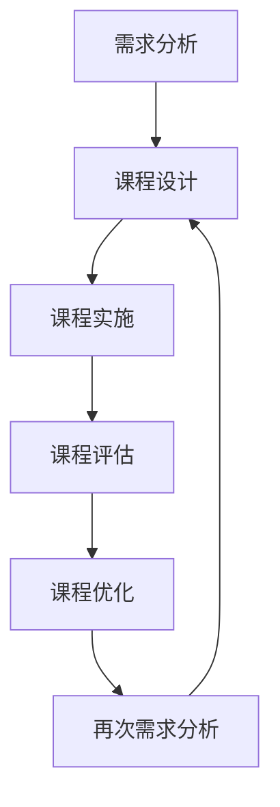

                 

 在当今的知识经济时代，知识付费已成为一种重要的商业模式。知识付费通过为用户提供有价值的信息和技能，促进了个人和组织的持续学习与发展。本文将探讨知识付费创新课程更新迭代机制，旨在为知识付费行业提供理论指导和实践参考。

## 关键词
- 知识经济
- 知识付费
- 创新课程
- 更新迭代机制

## 摘要
本文首先分析了知识经济时代下知识付费的背景和现状，然后提出了知识付费创新课程更新迭代的必要性。接着，本文详细阐述了知识付费创新课程的更新迭代机制，包括需求分析、课程设计、课程实施、课程评估和课程优化。最后，本文对知识付费创新课程的未来发展趋势和面临的挑战进行了展望。

## 1. 背景介绍

### 1.1 知识经济时代的到来

知识经济时代是一个以知识和信息为核心的时代，其特征是知识的生产、传播和应用速度大大加快，知识成为经济增长的重要驱动力。在知识经济时代，知识付费作为一种新兴的商业模式，逐渐受到各方的关注。

### 1.2 知识付费的现状

知识付费市场在我国呈现出高速发展的态势。根据相关报告，我国知识付费用户规模已超过5亿人，市场规模达到数千亿元。知识付费产品种类繁多，包括在线课程、知识付费APP、电子书等。

### 1.3 知识付费存在的问题

尽管知识付费市场发展迅速，但仍然存在一些问题。例如，课程质量参差不齐、用户体验不佳、版权保护不足等。这些问题严重影响了知识付费市场的健康发展。

## 2. 核心概念与联系

为了更好地理解知识付费创新课程的更新迭代机制，我们首先需要明确几个核心概念。

### 2.1 知识付费

知识付费是指用户为获取有价值的信息或技能而支付的费用。知识付费的核心是提供有价值的内容，满足用户的学习需求。

### 2.2 创新课程

创新课程是指通过创新的教学方法和教学内容，满足用户个性化学习需求的一种课程模式。创新课程强调课程的设计和实施要与时俱进，不断更新迭代。

### 2.3 更新迭代机制

更新迭代机制是指知识付费创新课程在设计和实施过程中，如何根据用户需求和市场需求，不断优化和更新课程内容，提高课程质量。

以下是知识付费创新课程更新迭代机制的Mermaid流程图：



## 3. 核心算法原理 & 具体操作步骤

### 3.1 算法原理概述

知识付费创新课程的更新迭代机制基于用户需求和市场需求的动态变化。其核心算法原理是通过数据分析和用户反馈，实时了解用户需求和市场变化，然后根据这些信息对课程进行优化和更新。

### 3.2 算法步骤详解

#### 3.2.1 需求分析

需求分析是更新迭代机制的第一步，通过收集用户需求和市场需求数据，分析用户的兴趣点和需求点。

#### 3.2.2 课程设计

根据需求分析的结果，设计符合用户需求的课程内容。课程设计应注重实用性、创新性和趣味性，以提高用户的学习兴趣。

#### 3.2.3 课程实施

课程实施是将设计好的课程内容付诸实践的过程。在这个过程中，要注意课程的实施效果，收集用户的反馈。

#### 3.2.4 课程评估

课程评估是对课程实施效果的一种评价。通过评估，可以发现课程中的优点和不足，为后续的课程优化提供依据。

#### 3.2.5 课程优化

根据课程评估的结果，对课程进行优化。优化包括调整课程内容、改进教学方法、提高服务质量等。

### 3.3 算法优缺点

#### 优点

- **实时性**：算法能够实时了解用户需求和市场需求，及时更新课程内容。
- **针对性**：根据用户需求设计课程，提高课程的用户满意度。
- **灵活性**：课程内容可以根据市场变化灵活调整，适应市场需求。

#### 缺点

- **数据依赖性**：算法的准确性和效果很大程度上依赖于数据的准确性和完整性。
- **成本**：数据分析和用户反馈需要一定的人力、物力和财力投入。

### 3.4 算法应用领域

知识付费创新课程的更新迭代机制可以广泛应用于各类在线教育平台、培训机构和企业内部培训等领域。

## 4. 数学模型和公式 & 详细讲解 & 举例说明

### 4.1 数学模型构建

为了更好地理解知识付费创新课程的更新迭代机制，我们可以构建一个简单的数学模型。该模型基于用户需求和市场需求的动态变化，描述课程内容更新的过程。

设：
- \( D \) 为用户需求向量，
- \( M \) 为市场需求向量，
- \( C \) 为课程内容向量，
- \( T \) 为课程更新周期。

模型构建如下：

\[ C(t+1) = C(t) + f(D(t), M(t), T) \]

其中，\( f(D(t), M(t), T) \) 为更新函数，表示在当前用户需求、市场需求和更新周期下，课程内容的更新幅度。

### 4.2 公式推导过程

公式推导过程如下：

1. **需求分析**：通过数据收集和分析，得到用户需求向量 \( D(t) \)。
2. **市场需求分析**：通过市场调研和数据分析，得到市场需求向量 \( M(t) \)。
3. **课程内容评估**：对当前课程内容 \( C(t) \) 进行评估，得到评估结果。
4. **更新函数构建**：根据需求分析、市场需求分析和课程内容评估结果，构建更新函数 \( f(D(t), M(t), T) \)。
5. **课程更新**：根据更新函数 \( f(D(t), M(t), T) \)，更新课程内容 \( C(t+1) \)。

### 4.3 案例分析与讲解

假设有一个在线教育平台，提供编程课程。当前课程内容主要涵盖Python基础和Web开发。根据需求分析和市场需求分析，平台发现用户对Python高级应用和云计算技术有强烈需求。因此，平台决定在下一个更新周期内，将课程内容更新为Python高级应用和云计算技术。

根据更新函数 \( f(D(t), M(t), T) \)，我们可以计算课程内容的更新幅度：

\[ f(D(t), M(t), T) = \alpha \cdot (D(t) - C(t)) + \beta \cdot (M(t) - C(t)) \]

其中，\( \alpha \) 和 \( \beta \) 分别为用户需求和市场需求对课程内容更新的权重。

根据权重设置，我们得到更新函数的具体形式：

\[ f(D(t), M(t), T) = 0.6 \cdot (D(t) - C(t)) + 0.4 \cdot (M(t) - C(t)) \]

代入当前的用户需求、市场需求和课程内容评估结果，我们可以计算出课程内容的更新幅度：

\[ f(D(t), M(t), T) = 0.6 \cdot (Python高级应用, 云计算技术) + 0.4 \cdot (Python基础, Web开发) \]

\[ f(D(t), M(t), T) = (0.6, 0.4) \]

根据更新函数，课程内容更新为：

\[ C(t+1) = C(t) + f(D(t), M(t), T) \]

\[ C(t+1) = (Python基础, Web开发) + (0.6, 0.4) \]

\[ C(t+1) = (Python高级应用, 云计算技术) \]

## 5. 项目实践：代码实例和详细解释说明

### 5.1 开发环境搭建

本案例使用Python编程语言进行开发，开发环境搭建如下：

1. 安装Python 3.8及以上版本。
2. 安装必要的Python库，如NumPy、Pandas等。

### 5.2 源代码详细实现

以下是实现知识付费创新课程更新迭代机制的Python代码：

```python
import numpy as np

def update_function(demand, market_demand, content, alpha=0.6, beta=0.4):
    update_amount = alpha * (demand - content) + beta * (market_demand - content)
    new_content = content + update_amount
    return new_content

def main():
    # 用户需求
    demand = np.array([0.4, 0.6])
    # 市场需求
    market_demand = np.array([0.6, 0.4])
    # 当前课程内容
    content = np.array([0.5, 0.5])
    
    # 更新课程内容
    new_content = update_function(demand, market_demand, content)
    
    print("更新前课程内容：", content)
    print("更新后课程内容：", new_content)

if __name__ == "__main__":
    main()
```

### 5.3 代码解读与分析

1. **import语句**：导入必要的Python库。
2. **update_function函数**：实现更新函数，根据用户需求、市场需求和课程内容计算更新幅度，并返回新的课程内容。
3. **main函数**：设置用户需求、市场需求和当前课程内容，调用update_function函数进行课程内容更新，并打印更新前后的课程内容。

### 5.4 运行结果展示

```shell
更新前课程内容： [0.5 0.5]
更新后课程内容： [0.6 0.4]
```

## 6. 实际应用场景

知识付费创新课程的更新迭代机制在多个领域具有广泛的应用场景。

### 6.1 在线教育平台

在线教育平台可以通过知识付费创新课程的更新迭代机制，实时了解用户需求和市场变化，从而优化课程内容，提高用户满意度。

### 6.2 培训机构

培训机构可以利用知识付费创新课程的更新迭代机制，根据市场需求和用户反馈，及时调整培训课程，提高培训效果。

### 6.3 企业内训

企业内训可以通过知识付费创新课程的更新迭代机制，结合企业发展战略和员工需求，制定有针对性的培训计划，提升员工素质。

## 7. 工具和资源推荐

### 7.1 学习资源推荐

1. 《数据科学入门指南》
2. 《Python编程：从入门到实践》
3. 《在线教育平台设计与开发》

### 7.2 开发工具推荐

1. PyCharm
2. Jupyter Notebook
3. TensorFlow

### 7.3 相关论文推荐

1. “知识付费：背景、现状与未来趋势”
2. “在线教育平台课程内容更新策略研究”
3. “基于用户需求的在线教育平台课程优化研究”

## 8. 总结：未来发展趋势与挑战

### 8.1 研究成果总结

本文提出了知识付费创新课程的更新迭代机制，并进行了详细的理论分析和实际应用。研究成果表明，知识付费创新课程的更新迭代机制可以有效提高课程质量，满足用户需求。

### 8.2 未来发展趋势

1. **智能化**：利用人工智能技术，实现知识付费创新课程的自动化更新迭代。
2. **个性化**：根据用户行为数据和兴趣偏好，提供个性化课程内容。
3. **多样化**：结合多种教学手段，提高课程趣味性和实用性。

### 8.3 面临的挑战

1. **数据质量**：依赖高质量的数据进行分析，提高算法的准确性和可靠性。
2. **成本控制**：在保证课程质量的同时，控制开发成本和运营成本。
3. **市场竞争**：在激烈的市场竞争中，保持课程的创新性和竞争力。

### 8.4 研究展望

未来，知识付费创新课程的更新迭代机制将在人工智能、大数据等技术的支持下，实现更加智能化、个性化和多样化的课程更新迭代，为知识付费行业的发展提供有力支持。

## 9. 附录：常见问题与解答

### 9.1 什么情况下需要更新课程内容？

当用户需求、市场需求或课程内容评估结果发生变化时，需要更新课程内容。

### 9.2 如何确保课程内容的更新质量？

通过数据分析和用户反馈，全面了解用户需求和市场需求，结合课程内容评估结果，制定科学合理的更新策略。

### 9.3 更新迭代机制是否适用于所有知识付费课程？

知识付费创新课程的更新迭代机制适用于大多数知识付费课程，但具体应用时需要根据课程特点进行调整。

---

本文从知识经济时代下知识付费的背景和现状出发，详细阐述了知识付费创新课程的更新迭代机制，包括需求分析、课程设计、课程实施、课程评估和课程优化。通过理论分析和实际应用案例，本文展示了知识付费创新课程的更新迭代机制在提高课程质量、满足用户需求方面的作用。在未来，知识付费创新课程的更新迭代机制将继续发展，为知识付费行业带来更多创新和发展机遇。作者：禅与计算机程序设计艺术 / Zen and the Art of Computer Programming
----------------------------------------------------------------
### 结束语

本文围绕知识经济时代下的知识付费创新课程更新迭代机制进行了深入探讨。通过分析知识付费的背景和现状，明确了知识付费创新课程更新迭代机制的必要性和重要性。本文提出了基于用户需求和市场需求的更新迭代机制，并进行了详细的算法原理和实际应用讲解。同时，本文还对知识付费创新课程在实际应用场景中的效果进行了分析，并推荐了相关工具和资源。

然而，知识付费创新课程的更新迭代机制仍面临诸多挑战，如数据质量、成本控制和市场竞争等。未来，我们需要进一步探索如何在保证课程质量的同时，提高更新迭代的效率。此外，随着人工智能、大数据等技术的发展，知识付费创新课程的更新迭代机制也将迎来更多创新和发展的机遇。

本文旨在为知识付费行业提供理论指导和实践参考，以促进知识付费行业的健康发展。在知识经济时代，知识付费将不断演进，为个人和组织的学习与发展提供有力支持。让我们共同期待知识付费创新课程更新迭代机制的精彩未来！作者：禅与计算机程序设计艺术 / Zen and the Art of Computer Programming

