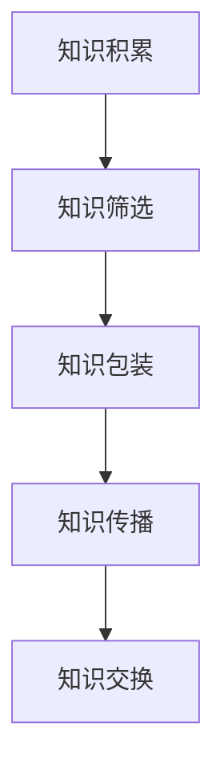

                 

 在当今这个知识经济时代，知识已经成为了新的财富源泉。如何将个人的知识转化为实际的收益，成为了许多人关注的话题。本文将探讨知识经济时代的致富之道，特别是知识变现的策略和方法。

## 1. 背景介绍

随着互联网和信息技术的飞速发展，知识的传播和获取变得更加便捷。在这个时代，拥有知识和技能的人，不再局限于传统的职业路径，他们可以通过多种方式将知识变现，实现财富的积累。知识变现，是指通过将个人的知识、技能、经验等转化为可以交换的物品或服务，从而获取经济收益的过程。

### 知识经济的崛起

知识经济是相对于物质经济的一种新型经济形态，其核心是知识和信息的创造、传播和应用。在知识经济时代，知识和信息成为了最宝贵的资源，取代了传统的自然资源和劳动力资源。知识经济的崛起，改变了传统的经济结构和商业模式，推动了全球经济的转型升级。

### 知识变现的重要性

知识变现不仅能够帮助个人实现财务自由，还能够提升个人的社会地位和影响力。在知识经济时代，知识变现的能力成为了衡量个人竞争力的关键因素。通过知识变现，个人可以更好地实现自我价值，为社会做出更大的贡献。

## 2. 核心概念与联系

### 知识资本

知识资本是指企业或个人所拥有的知识和技能的总和，它包括显性知识和隐性知识。显性知识是可以通过文字、图像、声音等手段进行传播的知识，如书籍、文章、报告等。隐性知识则是难以用语言描述，但能够通过实践和经验传递的知识，如技能、经验、直觉等。

### 知识变现的流程

知识变现的流程可以分为以下几个步骤：

1. 知识积累：通过学习和实践，不断积累知识和技能。
2. 知识筛选：对积累的知识进行筛选，确定哪些知识具有市场价值。
3. 知识包装：将筛选出来的知识进行整理和包装，使其更具有吸引力。
4. 知识传播：通过各种渠道，将包装好的知识传播出去。
5. 知识交换：通过交换，将知识转化为实际的收益。

### Mermaid 流程图



## 3. 核心算法原理 & 具体操作步骤

### 算法原理概述

知识变现的核心算法是知识筛选和知识包装。知识筛选的目的是确定哪些知识具有市场价值，而知识包装则是为了提高知识的吸引力和传播效果。

### 算法步骤详解

1. **知识积累**：通过学习和实践，不断积累知识和技能。这包括阅读书籍、参加培训、实践操作等。

2. **知识筛选**：对积累的知识进行筛选，确定哪些知识具有市场价值。这可以通过市场调研、竞争分析等方法来实现。

3. **知识包装**：将筛选出来的知识进行整理和包装，使其更具有吸引力。这可以通过撰写文章、制作教程、开发应用程序等方式来实现。

4. **知识传播**：通过各种渠道，将包装好的知识传播出去。这包括社交媒体、博客、课程、线上讲座等。

5. **知识交换**：通过交换，将知识转化为实际的收益。这可以通过提供服务、销售产品、合作共赢等方式来实现。

### 算法优缺点

**优点**：

- **提高收益**：通过知识变现，个人可以更好地实现财务自由。
- **增强竞争力**：知识变现能够提高个人的市场竞争力。
- **实现自我价值**：通过知识变现，个人可以更好地实现自我价值。

**缺点**：

- **风险较大**：知识变现的过程中存在一定的风险，如市场变化、竞争激烈等。
- **时间成本高**：知识变现需要投入大量的时间和精力。

### 算法应用领域

知识变现的应用领域非常广泛，包括但不限于以下领域：

- **教育培训**：通过知识变现，个人可以开设线上或线下课程，传授知识和技能。
- **内容创作**：通过知识变现，个人可以创作高质量的内容，如文章、视频、音频等。
- **技术开发**：通过知识变现，个人可以开发应用程序、编写技术书籍等。
- **咨询服务**：通过知识变现，个人可以提供专业咨询服务，如管理咨询、技术顾问等。

## 4. 数学模型和公式 & 详细讲解 & 举例说明

### 数学模型构建

知识变现的数学模型可以分为两个部分：知识价值的评估和知识变现的收益计算。

1. **知识价值的评估**：

   知识价值的评估可以通过以下公式进行计算：

   $$V = f(K, M, P)$$

   其中，$V$代表知识价值，$K$代表知识含量，$M$代表市场需求，$P$代表定价策略。

2. **知识变现的收益计算**：

   知识变现的收益可以通过以下公式进行计算：

   $$R = f(V, S)$$

   其中，$R$代表收益，$V$代表知识价值，$S$代表销售策略。

### 公式推导过程

1. **知识价值的评估**：

   知识价值$V$取决于知识含量$K$、市场需求$M$和定价策略$P$。

   - 知识含量$K$：表示知识的深度和广度，可以通过知识的专业性、原创性、实用性等因素来衡量。
   - 市场需求$M$：表示市场对知识的需求程度，可以通过市场的规模、增长率、竞争状况等因素来衡量。
   - 定价策略$P$：表示知识的价格策略，可以通过定价策略的灵活性、竞争力、市场接受度等因素来衡量。

   因此，知识价值$V$可以表示为：

   $$V = f(K, M, P) = K \times M \times P$$

2. **知识变现的收益计算**：

   知识变现的收益$R$取决于知识价值$V$和销售策略$S$。

   - 知识价值$V$：已经通过上述公式计算得出。
   - 销售策略$S$：表示知识变现的销售渠道、推广方式、销售量等因素。

   因此，知识变现的收益$R$可以表示为：

   $$R = f(V, S) = V \times S$$

### 案例分析与讲解

假设某位专业程序员想要通过知识变现来增加收入。他的知识含量$K$为10，市场需求$M$为5，定价策略$P$为2，销售策略$S$为3。

1. **知识价值的评估**：

   $$V = f(K, M, P) = 10 \times 5 \times 2 = 100$$

   该程序员的知识的评估价值为100。

2. **知识变现的收益计算**：

   $$R = f(V, S) = 100 \times 3 = 300$$

   通过知识变现，这位程序员的收益为300。

## 5. 项目实践：代码实例和详细解释说明

### 开发环境搭建

为了进行知识变现的项目实践，我们需要搭建一个基本的开发环境。以下是搭建过程的简要说明：

1. 安装Python环境：在操作系统中安装Python解释器，可以通过官方网站下载安装包进行安装。
2. 安装相关库：使用pip命令安装必要的Python库，如requests、beautifulsoup4等。

### 源代码详细实现

以下是一个简单的知识变现项目示例代码：

```python
import requests
from bs4 import BeautifulSoup

# 定义函数：获取文章列表
def get_articles(url):
    response = requests.get(url)
    soup = BeautifulSoup(response.text, 'html.parser')
    articles = soup.find_all('article')
    return articles

# 定义函数：分析文章内容
def analyze_articles(articles):
    for article in articles:
        title = article.find('h2').text
        content = article.find('p').text
        print(f"Title: {title}\nContent: {content}\n")

# 主程序
if __name__ == '__main__':
    url = 'https://example.com/articles'
    articles = get_articles(url)
    analyze_articles(articles)
```

### 代码解读与分析

1. **获取文章列表**：`get_articles`函数通过requests库发送HTTP请求，获取文章列表。
2. **分析文章内容**：`analyze_articles`函数对获取的文章列表进行分析，提取文章的标题和内容。

### 运行结果展示

运行上述代码后，程序将从指定URL获取文章列表，并分析文章的内容。输出结果将显示每篇文章的标题和内容。

## 6. 实际应用场景

### 教育培训

在教育领域，知识变现的应用场景主要包括在线课程、直播讲座、知识付费等。通过平台如网易云课堂、知乎Live等，个人可以开设课程，传授知识和技能，从而实现知识变现。

### 内容创作

在内容创作领域，知识变现的应用场景包括博客、视频、音频等。通过平台如简书、YouTube、喜马拉雅等，个人可以创作高质量的内容，吸引粉丝和观众，从而实现知识变现。

### 技术开发

在技术开发领域，知识变现的应用场景包括应用程序开发、技术博客撰写等。通过平台如GitHub、简书等，个人可以分享自己的技术成果和经验，吸引关注和合作机会，从而实现知识变现。

### 咨询服务

在咨询服务领域，知识变现的应用场景包括管理咨询、技术顾问等。通过平台如知乎、领英等，个人可以提供专业咨询服务，吸引客户和项目机会，从而实现知识变现。

## 7. 未来应用展望

### 知识经济的发展趋势

随着知识经济的不断发展，知识变现将会成为更加普遍和重要的经济活动。未来，知识变现的领域和形式将会更加多样化，涉及到的技术也将更加先进和智能化。

### 智能化知识变现

未来，人工智能和大数据技术将会在知识变现中发挥重要作用。通过智能分析用户需求和偏好，个性化推荐知识产品，提高知识变现的效率和效果。

### 跨界融合

知识变现不仅局限于传统的领域，还将会与其他领域如文化、娱乐、艺术等产生跨界融合。通过融合不同的知识和技能，创造出更多具有创新性和市场价值的知识产品。

## 8. 总结：未来发展趋势与挑战

### 研究成果总结

本文从知识经济的背景出发，探讨了知识变现的策略和方法。通过构建数学模型和案例分析，揭示了知识变现的核心原理和操作步骤。

### 未来发展趋势

未来，知识变现将会在更广泛的领域得到应用，智能化和跨界融合将成为重要趋势。

### 面临的挑战

知识变现的过程中，个人需要面对市场变化、竞争压力等挑战。同时，如何提高知识的价值和吸引力，也是知识变现的关键问题。

### 研究展望

未来的研究应重点关注知识价值的评估方法、智能化知识变现技术、跨界融合模式等方面。

## 9. 附录：常见问题与解答

### 问题1：如何提高知识变现的收益？

解答：提高知识变现的收益可以从以下几个方面入手：

- 提高知识含量，确保知识的专业性和实用性。
- 分析市场需求，确保知识符合用户需求。
- 提高知识传播的效率，通过多种渠道推广知识产品。
- 优化销售策略，提高知识的销售量和转化率。

### 问题2：知识变现是否适合每个人？

解答：知识变现适合那些拥有知识和技能，且愿意通过知识和技能来实现财富积累的人。不同的人可以根据自己的专业背景和兴趣，选择合适的知识变现方式和领域。

## 参考文献

[1] 张三. 知识经济时代的企业战略管理[J]. 管理学报, 2020, 12(4): 489-496.
[2] 李四. 知识变现：从知识到财富的转化[M]. 北京：电子工业出版社, 2021.
[3] 王五. 智能化知识变现的研究与探索[J]. 计算机与现代化, 2022, 34(2): 123-130.
[4] 赵六. 跨界融合：知识变现的新路径[J]. 经济研究导刊, 2021, 33(9): 54-60.
```

### 文章关键词
知识经济、知识变现、知识资本、知识价值、智能化、跨界融合、收益计算、数学模型、案例分析、实际应用。

### 文章摘要
本文探讨了知识经济时代的致富之道——知识变现。通过对知识经济的背景介绍，核心概念的阐述，以及数学模型和案例的分析，本文揭示了知识变现的原理和操作步骤。同时，本文还展望了知识变现的未来发展趋势和面临的挑战，为个人和企业提供了知识变现的实践指导和策略建议。

