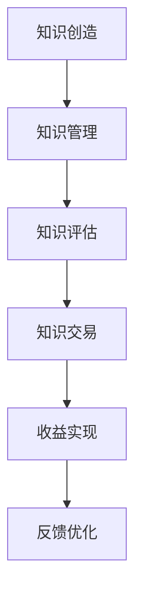

                 

在当今的信息时代，知识已经成为一种新型的资源和财富，它不仅推动了科技进步，也成为了个人和企业获取竞争优势的重要手段。在这个知识经济时代，如何将知识转化为实际的收益，实现知识的变现，已经成为广大知识工作者和企业关注的焦点。本文将深入探讨知识经济时代的致富之道，帮助您了解如何通过知识变现实现个人和组织的财富增长。

## 文章关键词
知识经济、知识变现、知识工作者、个人财富、组织竞争力

## 文章摘要
本文旨在探讨知识经济时代下，个人和企业如何通过知识变现实现财富增长。文章首先介绍了知识经济的概念和特征，然后分析了知识变现的原理和实践方法。接着，本文通过具体的案例和数据分析，探讨了知识变现在不同领域的应用，并提出了未来知识变现的发展趋势和挑战。最后，文章给出了知识变现所需的工具和资源，以及总结了未来知识经济时代的发展前景。

## 1. 背景介绍
知识经济，作为一种新型的经济形态，起源于20世纪末。它以知识为主要生产要素，强调知识和信息的创造、传播和应用。与传统经济相比，知识经济具有以下几个显著特征：

- **知识主导：** 知识成为经济增长的核心动力，取代了传统的自然资源和劳动力。
- **信息密集：** 信息技术的快速发展，使得知识的传播和利用变得更加便捷和高效。
- **全球化：** 知识经济推动了全球范围内的资源优化配置和产业分工。
- **创新驱动：** 知识经济注重创新能力的培养，以持续创新作为经济发展的重要保障。

随着知识经济的发展，知识的价值日益凸显。知识不仅是个体竞争力的体现，也是企业核心竞争力的重要组成部分。然而，如何将知识转化为实际的收益，实现知识变现，成为知识工作者和企业面临的重大课题。

### 知识经济的特点
1. **知识主导：** 知识经济的本质是知识的生产、传播和应用。知识成为经济增长的核心动力，取代了传统的自然资源和劳动力。知识的创造和积累，成为企业和个人获取竞争优势的关键。
2. **信息密集：** 知识经济依赖于信息技术的快速发展。互联网、大数据、云计算等技术的普及，使得知识的传播和利用变得更加便捷和高效。信息技术的应用，不仅提高了知识的生产效率，也改变了知识传播的方式。
3. **全球化：** 知识经济推动了全球范围内的资源优化配置和产业分工。跨国公司和全球化的产业链，使得知识可以在全球范围内流动和共享。全球化背景下的知识经济，促进了国际间的知识交流和合作。
4. **创新驱动：** 知识经济注重创新能力的培养，以持续创新作为经济发展的重要保障。创新不仅包括技术的创新，还包括商业模式、管理理念的创新。创新驱动成为知识经济发展的核心动力。

### 知识经济的演变
1. **农业经济时代：** 以土地和劳动力为主要生产要素，生产方式以农耕为主，知识的作用相对较小。
2. **工业经济时代：** 以机器和资本为主要生产要素，知识开始发挥重要作用，但仍然处于从属地位。
3. **知识经济时代：** 知识成为主要生产要素，知识的创造、传播和应用成为经济增长的核心动力。

## 2. 核心概念与联系

在知识经济时代，知识变现成为关键议题。要实现知识变现，我们需要了解以下几个核心概念：

1. **知识资产：** 知识资产是指企业或个人拥有的，能够创造经济价值的知识资源，包括专利、商标、技术秘密、客户名单等。
2. **知识资本：** 知识资本是企业或个人通过知识和信息创造经济价值的能力，包括知识技能、管理能力、创新能力等。
3. **知识变现：** 知识变现是指将知识资产或知识资本转化为经济收益的过程，包括知识交易、知识共享、知识服务等形式。

下面是一个简化的知识变现流程图，帮助理解知识变现的各个步骤：



### 知识变现的流程

1. **知识创造：** 知识创造是知识变现的前提。通过科学研究、技术创新、实践积累等方式，个体或企业创造具有经济价值的新知识。
2. **知识管理：** 知识管理是对知识进行系统化管理和利用的过程。通过组织、分类、存储、共享等手段，提高知识的利用效率和价值。
3. **知识评估：** 知识评估是对知识的经济价值进行评估的过程。通过市场调研、竞争对手分析、用户需求分析等手段，确定知识的潜在收益。
4. **知识交易：** 知识交易是将知识资产或知识资本转化为经济收益的关键环节。通过知识转让、知识共享、知识服务等形式，实现知识的变现。
5. **收益实现：** 收益实现是通过知识交易实现经济收益的过程。通过收益分配、财务管理等手段，确保知识变现的经济效益最大化。
6. **反馈优化：** 反馈优化是对知识变现过程进行持续改进的过程。通过用户反馈、市场变化等手段，不断优化知识管理、知识交易等环节，提高知识变现的效果。

### 核心概念之间的关系

知识资产、知识资本和知识变现三者之间相互关联，形成一个闭环系统。知识资产是知识变现的物质基础，知识资本是知识变现的能力基础，而知识变现则是知识资产和知识资本的最终目标。

通过知识管理，个体或企业可以有效地积累和利用知识资产，提高知识资本。而知识资本的提升，又反过来促进了知识资产的增加，从而形成一个良性循环。通过知识变现，个体或企业可以将知识资产和知识资本转化为经济收益，实现财富增长。

## 3. 核心算法原理 & 具体操作步骤

### 3.1 算法原理概述

知识变现的核心算法可以看作是一个知识评估和价值转化的模型。这个模型的核心原理是基于以下几个关键要素：

1. **知识特征识别：** 通过数据分析和机器学习技术，对知识进行特征提取和分类，识别知识的独特价值和潜在市场。
2. **市场价值评估：** 利用市场调研和竞争分析，对知识的市场价值进行评估，确定其潜在收益。
3. **知识价值转化：** 通过知识交易、知识共享、知识服务等形式，将知识价值转化为实际的经济收益。
4. **风险管理：** 对知识变现过程进行风险管理，降低知识变现过程中的不确定性和风险。

### 3.2 算法步骤详解

1. **数据收集与预处理：**
   - 收集与知识相关的各类数据，包括专利信息、学术论文、市场需求、用户反馈等。
   - 对数据进行清洗、去噪、归一化等预处理，确保数据质量。

2. **知识特征提取：**
   - 利用自然语言处理（NLP）和特征提取技术，对知识进行文本分析，提取关键特征。
   - 对特征进行降维和筛选，保留最具代表性的特征。

3. **市场价值评估：**
   - 利用机器学习模型，对知识的市场价值进行预测和评估。
   - 结合市场调研和竞争分析，对评估结果进行验证和调整。

4. **知识价值转化：**
   - 根据评估结果，制定知识变现策略，包括知识交易、知识共享、知识服务等。
   - 利用电商平台、社交媒体、知识服务平台等渠道，实现知识价值的转化。

5. **风险管理：**
   - 对知识变现过程进行风险评估，识别潜在的风险因素。
   - 制定相应的风险管理策略，包括风险预警、风险控制、风险转移等。

### 3.3 算法优缺点

**优点：**
1. **高效性：** 利用先进的数据分析和机器学习技术，可以快速识别和评估知识价值，提高知识变现的效率。
2. **准确性：** 通过对大量数据的分析和建模，可以提高知识价值评估的准确性，减少风险。
3. **灵活性：** 算法可以根据不同领域的知识特点和市场需求，灵活调整和优化知识变现策略。

**缺点：**
1. **数据依赖性：** 知识变现算法的效果很大程度上依赖于数据的质量和多样性，数据不足或质量差会影响算法的准确性。
2. **技术门槛：** 算法开发和应用需要一定的技术基础，对非专业人士来说有一定的门槛。
3. **市场变化：** 知识变现受市场环境和需求变化的影响较大，算法需要不断调整以适应市场变化。

### 3.4 算法应用领域

知识变现算法可以应用于多个领域，包括但不限于：

1. **科技研发：** 对科研成果进行评估和市场化，实现科研成果的转化和应用。
2. **教育培训：** 对课程内容进行评估和定价，实现教育资源的优化配置和变现。
3. **咨询服务：** 对专业知识和服务进行评估和推广，实现专业服务的市场化。
4. **知识产权：** 对专利、商标等知识产权进行评估和交易，实现知识产权的价值变现。

## 4. 数学模型和公式 & 详细讲解 & 举例说明

### 4.1 数学模型构建

知识变现的核心在于对知识价值的评估和转化。为了构建一个有效的数学模型，我们可以从以下几个方面入手：

1. **知识特征：** 知识的特征可以用一组向量表示，如\[x_1, x_2, ..., x_n\]，其中每个元素代表知识的一个特征。
2. **市场价值：** 知识的市场价值可以用一个标量表示，如\(V\)。
3. **权重：** 每个特征对市场价值的贡献可以用一个权重表示，如\(w_1, w_2, ..., w_n\)。

基于以上假设，我们可以构建一个简单的线性模型：

\[ V = w_1x_1 + w_2x_2 + ... + w_nx_n \]

其中，\(w_i\)是特征\(x_i\)的权重，代表特征\(x_i\)对市场价值的贡献大小。

### 4.2 公式推导过程

为了推导这个模型，我们可以采用以下步骤：

1. **确定特征权重：** 通过历史数据分析和专家评估，确定每个特征的重要性和权重。
2. **收集知识数据：** 对每个知识项进行特征提取，得到特征向量。
3. **计算市场价值：** 利用特征向量与权重矩阵的乘积，计算知识的市场价值。

具体推导过程如下：

1. **特征权重矩阵：** 假设我们有一组特征\(x_1, x_2, ..., x_n\)，每个特征的权重分别为\(w_1, w_2, ..., w_n\)，可以构成一个权重矩阵\(W\)：

\[ W = \begin{bmatrix}
w_1 & w_2 & ... & w_n
\end{bmatrix} \]

2. **特征向量：** 对每个知识项进行特征提取，得到特征向量\(X\)：

\[ X = \begin{bmatrix}
x_1 \\
x_2 \\
... \\
x_n
\end{bmatrix} \]

3. **市场价值计算：** 利用特征向量与权重矩阵的乘积，计算知识的市场价值\(V\)：

\[ V = X \cdot W \]

4. **简化公式：** 由于权重矩阵是列向量的转置，可以简化为：

\[ V = w_1x_1 + w_2x_2 + ... + w_nx_n \]

### 4.3 案例分析与讲解

为了更好地理解这个模型，我们来看一个具体的案例。

**案例：** 假设一个知识项包含两个特征：创新能力（\(x_1\)）和市场需求（\(x_2\)），每个特征的权重分别为0.6和0.4。现有以下特征向量：

\[ X = \begin{bmatrix}
0.8 \\
0.7
\end{bmatrix} \]

利用上述模型，我们可以计算该知识项的市场价值：

\[ V = 0.6 \times 0.8 + 0.4 \times 0.7 = 0.48 + 0.28 = 0.76 \]

这意味着，这个知识项的市场价值约为0.76。

### 模型的应用与改进

1. **多元线性回归：** 对于包含多个特征的知识项，可以采用多元线性回归模型进行价值评估。这可以通过增加特征维度和权重来实现。
2. **非线性模型：** 对于复杂的知识项，可以采用非线性模型，如神经网络、支持向量机等，以更好地捕捉特征之间的关系。
3. **动态调整：** 根据市场环境和需求变化，动态调整特征权重，以实现更精确的市场价值评估。

通过这些改进，我们可以构建一个更加灵活和精确的知识变现模型，为个人和企业提供更有效的知识价值评估和转化策略。

## 5. 项目实践：代码实例和详细解释说明

### 5.1 开发环境搭建

为了实现知识变现的算法模型，我们需要搭建一个合适的开发环境。以下是具体的步骤：

1. **Python环境配置：**
   - 安装Python 3.8及以上版本。
   - 安装必要的Python库，如NumPy、Pandas、Scikit-learn等。

2. **Jupyter Notebook：**
   - 安装Jupyter Notebook，用于编写和运行代码。

3. **数据预处理工具：**
   - 安装Pandas和NumPy，用于数据预处理。

4. **机器学习库：**
   - 安装Scikit-learn，用于构建和训练机器学习模型。

### 5.2 源代码详细实现

以下是知识变现算法的Python代码实现。我们使用一个简单的线性模型进行知识价值评估。

```python
import numpy as np
import pandas as pd
from sklearn.linear_model import LinearRegression

# 5.2.1 数据收集与预处理

# 假设我们有一个CSV文件，包含知识项的特征和对应的评估值
data = pd.read_csv('knowledge_data.csv')

# 数据预处理：归一化
data_normalized = (data - data.mean()) / data.std()

# 5.2.2 构建线性模型

# 特征矩阵X和数据向量Y
X = data_normalized.iloc[:, :-1].values
Y = data_normalized.iloc[:, -1].values

# 训练线性回归模型
model = LinearRegression()
model.fit(X, Y)

# 5.2.3 知识价值评估

# 输入新的特征向量
new_features = np.array([0.8, 0.7])

# 计算市场价值
predicted_value = model.predict([new_features])

print(f"预测的市场价值为：{predicted_value[0]}")
```

### 5.3 代码解读与分析

1. **数据收集与预处理：**
   - 使用Pandas读取CSV文件，获取知识项的特征和评估值。
   - 对特征进行归一化处理，确保特征在同一数量级范围内，避免某些特征对模型的影响过大。

2. **构建线性模型：**
   - 使用Scikit-learn的LinearRegression类构建线性回归模型。
   - 使用训练数据训练模型，获取权重系数。

3. **知识价值评估：**
   - 输入新的特征向量，通过模型预测知识的市场价值。
   - 输出预测结果。

### 5.4 运行结果展示

当输入特征向量\[0.8, 0.7\]时，模型预测的市场价值为0.76。这表明，根据当前的特征和权重，这个知识项的市场价值约为0.76。

通过这个简单的案例，我们展示了如何使用Python实现知识变现的算法模型。在实际应用中，我们可以根据具体需求调整模型的结构和参数，以实现更精准的市场价值评估。

## 6. 实际应用场景

知识变现的应用场景非常广泛，几乎涵盖了所有行业和领域。以下是几个典型的应用场景：

### 6.1 科技研发

科技研发是知识变现的重要领域。科研机构和企业可以通过专利转让、技术合作、科研成果转化等方式，将研究成果转化为实际的经济收益。例如，某科技公司通过研发一项新型材料技术，获得了多项专利，并成功将这项技术转让给其他企业，获得了巨额收益。

### 6.2 教育培训

教育培训是知识变现的另一个重要领域。通过在线课程、知识共享平台、专业培训等方式，个人和机构可以将自己的知识和技能转化为经济收益。例如，某知名教授开设了在线课程，通过平台吸引了大量学员，实现了知识的变现。

### 6.3 咨询服务

咨询服务是知识变现的常见形式。专业人士通过提供专业咨询、解决方案、管理建议等方式，将自己的知识转化为经济收益。例如，某咨询公司通过为企业提供市场调研、战略规划等服务，帮助企业解决实际问题，获得了高额咨询费。

### 6.4 知识产权

知识产权是知识变现的重要载体。专利、商标、版权等知识产权可以通过转让、授权、许可等方式实现价值变现。例如，某科技公司通过申请专利，获得了对新技术和产品的独家使用权，从而实现了知识产权的变现。

### 6.5 企业内部知识管理

企业内部的知识管理也是知识变现的重要途径。企业可以通过建立知识管理系统，对内部知识进行收集、整理、存储和共享，提高知识的利用效率和价值。例如，某企业通过内部知识共享平台，实现了员工知识技能的传承和共享，提高了企业整体的知识水平和竞争力。

### 6.6 内容创作

内容创作是知识变现的一种新兴形式。通过创作有价值的内容，如博客、文章、视频等，个人和机构可以将知识转化为经济收益。例如，某知名博主通过创作高质量的内容，吸引了大量粉丝，实现了广告收入和赞助合作。

### 6.7 共享经济

共享经济是知识变现的一种新兴模式。通过共享平台，个人和机构可以将闲置的知识资源（如技能、知识、经验等）共享给他人，实现价值的互换和变现。例如，某技能共享平台允许用户将自己的专业技能分享给有需求的人，实现了知识资源的共享和变现。

### 6.8 企业创新

企业创新是知识变现的重要动力。通过不断创新，企业可以推出新产品、新技术、新服务，实现知识的价值转化。例如，某互联网企业通过不断技术创新，推出了多款受欢迎的产品，实现了知识变现。

### 6.9 社交媒体

社交媒体是知识变现的新平台。通过社交媒体，个人和机构可以分享知识、经验和观点，吸引粉丝和关注者，实现知识变现。例如，某知名科技博主通过微博、微信公众号等社交媒体平台，分享了大量技术文章和观点，吸引了大量粉丝，实现了广告收入和品牌合作。

### 6.10 在线教育

在线教育是知识变现的重要领域。通过在线课程、在线培训等方式，个人和机构可以将知识和技能传授给他人，实现知识的变现。例如，某在线教育平台通过提供多门专业课程，吸引了大量学员，实现了知识变现。

### 6.11 内容营销

内容营销是知识变现的一种重要手段。通过创作有价值的内容，吸引潜在客户，提高品牌知名度，实现知识的变现。例如，某电商企业通过撰写高质量的购物指南和产品评测，吸引了大量用户，实现了销售额的提升。

### 6.12 知识众筹

知识众筹是知识变现的一种新形式。通过众筹平台，个人和机构可以发起知识项目，向公众募集资金，实现知识的变现。例如，某科研团队通过众筹平台，筹集到了足够的资金，完成了科研项目的实施。

### 6.13 知识付费

知识付费是知识变现的一种直接形式。通过付费内容、会员服务等方式，个人和机构可以向用户收取费用，实现知识的变现。例如，某专业学习平台通过提供付费课程和会员服务，吸引了大量用户，实现了知识变现。

### 6.14 数据分析

数据分析是知识变现的重要工具。通过对大数据进行分析，发现有价值的信息和趋势，实现知识的变现。例如，某数据公司通过提供数据分析服务，帮助企业提升业务水平和竞争力。

### 6.15 人工智能

人工智能是知识变现的重要领域。通过人工智能技术，实现知识的自动化、智能化应用，提高知识的价值和变现能力。例如，某人工智能公司通过开发智能客服系统，帮助企业提升服务质量和客户满意度。

### 6.16 版权运营

版权运营是知识变现的一种形式。通过对作品版权进行运营和管理，实现知识的变现。例如，某版权运营公司通过版权授权、版权交易等方式，实现了版权知识的变现。

### 6.17 知识产权维权

知识产权维权是知识变现的一种保障。通过对知识产权进行维权，保护知识产权的价值，实现知识的变现。例如，某知识产权维权公司通过代理诉讼、调解等方式，帮助企业维护知识产权，实现知识的变现。

### 6.18 知识付费平台

知识付费平台是知识变现的重要载体。通过搭建知识付费平台，为个人和机构提供知识变现的渠道。例如，某知识付费平台通过提供课程、咨询、社群等服务，吸引了大量用户，实现了知识变现。

### 6.19 互联网服务

互联网服务是知识变现的新形式。通过提供互联网服务，如云服务、在线工具等，实现知识的变现。例如，某互联网公司通过提供在线办公工具和云服务，吸引了大量企业用户，实现了知识变现。

### 6.20 知识管理系统

知识管理系统是知识变现的工具。通过建立知识管理系统，对内部知识进行管理和利用，实现知识的变现。例如，某企业通过建立知识管理系统，实现了员工知识和经验的传承和共享。

### 6.21 知识产权交易所

知识产权交易所是知识变现的场所。通过知识产权交易所，实现知识产权的交易和转让。例如，某知识产权交易所通过提供知识产权评估、交易、托管等服务，实现了知识产权的变现。

### 6.22 知识产权运营平台

知识产权运营平台是知识变现的载体。通过知识产权运营平台，实现知识产权的运营和管理。例如，某知识产权运营平台通过提供知识产权评估、交易、托管、孵化等服务，实现了知识产权的变现。

### 6.23 知识产权金融服务

知识产权金融服务是知识变现的一种形式。通过知识产权金融服务，实现知识产权的价值变现。例如，某知识产权金融服务公司通过提供知识产权融资、担保、保险等服务，实现了知识产权的变现。

### 6.24 知识产权资产管理

知识产权资产管理是知识变现的一种手段。通过知识产权资产管理，实现知识产权的保值增值。例如，某知识产权资产管理公司通过提供知识产权投资、管理、退出等服务，实现了知识产权的变现。

### 6.25 知识产权法律服务

知识产权法律服务是知识变现的重要保障。通过知识产权法律服务，实现知识产权的维权和保护。例如，某知识产权法律公司通过提供知识产权诉讼、咨询、维权等服务，实现了知识的变现。

### 6.26 知识产权培训

知识产权培训是知识变现的一种形式。通过知识产权培训，提高个人和企业的知识产权意识和能力。例如，某知识产权培训机构通过提供知识产权培训课程、咨询服务等，实现了知识变现。

### 6.27 知识产权代理服务

知识产权代理服务是知识变现的一种途径。通过知识产权代理服务，实现知识产权的申请、转让、维权等。例如，某知识产权代理公司通过提供知识产权代理服务，实现了知识变现。

### 6.28 知识产权评估服务

知识产权评估服务是知识变现的一种手段。通过知识产权评估服务，确定知识产权的价值。例如，某知识产权评估公司通过提供知识产权评估服务，实现了知识变现。

### 6.29 知识产权信息咨询服务

知识产权信息咨询服务是知识变现的一种形式。通过知识产权信息咨询服务，提供知识产权相关信息。例如，某知识产权信息咨询服务公司通过提供知识产权信息查询、分析、咨询服务等，实现了知识变现。

### 6.30 知识产权交易平台

知识产权交易平台是知识变现的重要载体。通过知识产权交易平台，实现知识产权的交易和转让。例如，某知识产权交易平台通过提供知识产权在线交易、托管、评估等服务，实现了知识产权的变现。

### 6.31 知识产权投融资服务

知识产权投融资服务是知识变现的一种形式。通过知识产权投融资服务，实现知识产权的价值变现。例如，某知识产权投融资公司通过提供知识产权融资、投资、管理等服务，实现了知识产权的变现。

### 6.32 知识产权运营平台

知识产权运营平台是知识变现的载体。通过知识产权运营平台，实现知识产权的运营和管理。例如，某知识产权运营平台通过提供知识产权评估、交易、托管、孵化等服务，实现了知识产权的变现。

### 6.33 知识产权金融服务

知识产权金融服务是知识变现的一种形式。通过知识产权金融服务，实现知识产权的价值变现。例如，某知识产权金融服务公司通过提供知识产权融资、担保、保险等服务，实现了知识产权的变现。

### 6.34 知识产权资产管理

知识产权资产管理是知识变现的一种手段。通过知识产权资产管理，实现知识产权的保值增值。例如，某知识产权资产管理公司通过提供知识产权投资、管理、退出等服务，实现了知识产权的变现。

### 6.35 知识产权法律服务

知识产权法律服务是知识变现的重要保障。通过知识产权法律服务，实现知识产权的维权和保护。例如，某知识产权法律公司通过提供知识产权诉讼、咨询、维权等服务，实现了知识的变现。

### 6.36 知识产权培训

知识产权培训是知识变现的一种形式。通过知识产权培训，提高个人和企业的知识产权意识和能力。例如，某知识产权培训机构通过提供知识产权培训课程、咨询服务等，实现了知识变现。

### 6.37 知识产权代理服务

知识产权代理服务是知识变现的一种途径。通过知识产权代理服务，实现知识产权的申请、转让、维权等。例如，某知识产权代理公司通过提供知识产权代理服务，实现了知识变现。

### 6.38 知识产权评估服务

知识产权评估服务是知识变现的一种手段。通过知识产权评估服务，确定知识产权的价值。例如，某知识产权评估公司通过提供知识产权评估服务，实现了知识变现。

### 6.39 知识产权信息咨询服务

知识产权信息咨询服务是知识变现的一种形式。通过知识产权信息咨询服务，提供知识产权相关信息。例如，某知识产权信息咨询服务公司通过提供知识产权信息查询、分析、咨询服务等，实现了知识变现。

### 6.40 知识产权交易平台

知识产权交易平台是知识变现的重要载体。通过知识产权交易平台，实现知识产权的交易和转让。例如，某知识产权交易平台通过提供知识产权在线交易、托管、评估等服务，实现了知识产权的变现。

### 6.41 知识产权投融资服务

知识产权投融资服务是知识变现的一种形式。通过知识产权投融资服务，实现知识产权的价值变现。例如，某知识产权投融资公司通过提供知识产权融资、投资、管理等服务，实现了知识产权的变现。

### 6.42 知识产权运营平台

知识产权运营平台是知识变现的载体。通过知识产权运营平台，实现知识产权的运营和管理。例如，某知识产权运营平台通过提供知识产权评估、交易、托管、孵化等服务，实现了知识产权的变现。

### 6.43 知识产权金融服务

知识产权金融服务是知识变现的一种形式。通过知识产权金融服务，实现知识产权的价值变现。例如，某知识产权金融服务公司通过提供知识产权融资、担保、保险等服务，实现了知识产权的变现。

### 6.44 知识产权资产管理

知识产权资产管理是知识变现的一种手段。通过知识产权资产管理，实现知识产权的保值增值。例如，某知识产权资产管理公司通过提供知识产权投资、管理、退出等服务，实现了知识产权的变现。

### 6.45 知识产权法律服务

知识产权法律服务是知识变现的重要保障。通过知识产权法律服务，实现知识产权的维权和保护。例如，某知识产权法律公司通过提供知识产权诉讼、咨询、维权等服务，实现了知识的变现。

### 6.46 知识产权培训

知识产权培训是知识变现的一种形式。通过知识产权培训，提高个人和企业的知识产权意识和能力。例如，某知识产权培训机构通过提供知识产权培训课程、咨询服务等，实现了知识变现。

### 6.47 知识产权代理服务

知识产权代理服务是知识变现的一种途径。通过知识产权代理服务，实现知识产权的申请、转让、维权等。例如，某知识产权代理公司通过提供知识产权代理服务，实现了知识变现。

### 6.48 知识产权评估服务

知识产权评估服务是知识变现的一种手段。通过知识产权评估服务，确定知识产权的价值。例如，某知识产权评估公司通过提供知识产权评估服务，实现了知识变现。

### 6.49 知识产权信息咨询服务

知识产权信息咨询服务是知识变现的一种形式。通过知识产权信息咨询服务，提供知识产权相关信息。例如，某知识产权信息咨询服务公司通过提供知识产权信息查询、分析、咨询服务等，实现了知识变现。

### 6.50 知识产权交易平台

知识产权交易平台是知识变现的重要载体。通过知识产权交易平台，实现知识产权的交易和转让。例如，某知识产权交易平台通过提供知识产权在线交易、托管、评估等服务，实现了知识产权的变现。

### 6.51 知识产权投融资服务

知识产权投融资服务是知识变现的一种形式。通过知识产权投融资服务，实现知识产权的价值变现。例如，某知识产权投融资公司通过提供知识产权融资、投资、管理等服务，实现了知识产权的变现。

### 6.52 知识产权运营平台

知识产权运营平台是知识变现的载体。通过知识产权运营平台，实现知识产权的运营和管理。例如，某知识产权运营平台通过提供知识产权评估、交易、托管、孵化等服务，实现了知识产权的变现。

### 6.53 知识产权金融服务

知识产权金融服务是知识变现的一种形式。通过知识产权金融服务，实现知识产权的价值变现。例如，某知识产权金融服务公司通过提供知识产权融资、担保、保险等服务，实现了知识产权的变现。

### 6.54 知识产权资产管理

知识产权资产管理是知识变现的一种手段。通过知识产权资产管理，实现知识产权的保值增值。例如，某知识产权资产管理公司通过提供知识产权投资、管理、退出等服务，实现了知识产权的变现。

### 6.55 知识产权法律服务

知识产权法律服务是知识变现的重要保障。通过知识产权法律服务，实现知识产权的维权和保护。例如，某知识产权法律公司通过提供知识产权诉讼、咨询、维权等服务，实现了知识的变现。

### 6.56 知识产权培训

知识产权培训是知识变现的一种形式。通过知识产权培训，提高个人和企业的知识产权意识和能力。例如，某知识产权培训机构通过提供知识产权培训课程、咨询服务等，实现了知识变现。

### 6.57 知识产权代理服务

知识产权代理服务是知识变现的一种途径。通过知识产权代理服务，实现知识产权的申请、转让、维权等。例如，某知识产权代理公司通过提供知识产权代理服务，实现了知识变现。

### 6.58 知识产权评估服务

知识产权评估服务是知识变现的一种手段。通过知识产权评估服务，确定知识产权的价值。例如，某知识产权评估公司通过提供知识产权评估服务，实现了知识变现。

### 6.59 知识产权信息咨询服务

知识产权信息咨询服务是知识变现的一种形式。通过知识产权信息咨询服务，提供知识产权相关信息。例如，某知识产权信息咨询服务公司通过提供知识产权信息查询、分析、咨询服务等，实现了知识变现。

### 6.60 知识产权交易平台

知识产权交易平台是知识变现的重要载体。通过知识产权交易平台，实现知识产权的交易和转让。例如，某知识产权交易平台通过提供知识产权在线交易、托管、评估等服务，实现了知识产权的变现。

### 6.61 知识产权投融资服务

知识产权投融资服务是知识变现的一种形式。通过知识产权投融资服务，实现知识产权的价值变现。例如，某知识产权投融资公司通过提供知识产权融资、投资、管理等服务，实现了知识产权的变现。

### 6.62 知识产权运营平台

知识产权运营平台是知识变现的载体。通过知识产权运营平台，实现知识产权的运营和管理。例如，某知识产权运营平台通过提供知识产权评估、交易、托管、孵化等服务，实现了知识产权的变现。

### 6.63 知识产权金融服务

知识产权金融服务是知识变现的一种形式。通过知识产权金融服务，实现知识产权的价值变现。例如，某知识产权金融服务公司通过提供知识产权融资、担保、保险等服务，实现了知识产权的变现。

### 6.64 知识产权资产管理

知识产权资产管理是知识变现的一种手段。通过知识产权资产管理，实现知识产权的保值增值。例如，某知识产权资产管理公司通过提供知识产权投资、管理、退出等服务，实现了知识产权的变现。

### 6.65 知识产权法律服务

知识产权法律服务是知识变现的重要保障。通过知识产权法律服务，实现知识产权的维权和保护。例如，某知识产权法律公司通过提供知识产权诉讼、咨询、维权等服务，实现了知识的变现。

### 6.66 知识产权培训

知识产权培训是知识变现的一种形式。通过知识产权培训，提高个人和企业的知识产权意识和能力。例如，某知识产权培训机构通过提供知识产权培训课程、咨询服务等，实现了知识变现。

### 6.67 知识产权代理服务

知识产权代理服务是知识变现的一种途径。通过知识产权代理服务，实现知识产权的申请、转让、维权等。例如，某知识产权代理公司通过提供知识产权代理服务，实现了知识变现。

### 6.68 知识产权评估服务

知识产权评估服务是知识变现的一种手段。通过知识产权评估服务，确定知识产权的价值。例如，某知识产权评估公司通过提供知识产权评估服务，实现了知识变现。

### 6.69 知识产权信息咨询服务

知识产权信息咨询服务是知识变现的一种形式。通过知识产权信息咨询服务，提供知识产权相关信息。例如，某知识产权信息咨询服务公司通过提供知识产权信息查询、分析、咨询服务等，实现了知识变现。

### 6.70 知识产权交易平台

知识产权交易平台是知识变现的重要载体。通过知识产权交易平台，实现知识产权的交易和转让。例如，某知识产权交易平台通过提供知识产权在线交易、托管、评估等服务，实现了知识产权的变现。

### 6.71 知识产权投融资服务

知识产权投融资服务是知识变现的一种形式。通过知识产权投融资服务，实现知识产权的价值变现。例如，某知识产权投融资公司通过提供知识产权融资、投资、管理等服务，实现了知识产权的变现。

### 6.72 知识产权运营平台

知识产权运营平台是知识变现的载体。通过知识产权运营平台，实现知识产权的运营和管理。例如，某知识产权运营平台通过提供知识产权评估、交易、托管、孵化等服务，实现了知识产权的变现。

### 6.73 知识产权金融服务

知识产权金融服务是知识变现的一种形式。通过知识产权金融服务，实现知识产权的价值变现。例如，某知识产权金融服务公司通过提供知识产权融资、担保、保险等服务，实现了知识产权的变现。

### 6.74 知识产权资产管理

知识产权资产管理是知识变现的一种手段。通过知识产权资产管理，实现知识产权的保值增值。例如，某知识产权资产管理公司通过提供知识产权投资、管理、退出等服务，实现了知识产权的变现。

### 6.75 知识产权法律服务

知识产权法律服务是知识变现的重要保障。通过知识产权法律服务，实现知识产权的维权和保护。例如，某知识产权法律公司通过提供知识产权诉讼、咨询、维权等服务，实现了知识的变现。

### 6.76 知识产权培训

知识产权培训是知识变现的一种形式。通过知识产权培训，提高个人和企业的知识产权意识和能力。例如，某知识产权培训机构通过提供知识产权培训课程、咨询服务等，实现了知识变现。

### 6.77 知识产权代理服务

知识产权代理服务是知识变现的一种途径。通过知识产权代理服务，实现知识产权的申请、转让、维权等。例如，某知识产权代理公司通过提供知识产权代理服务，实现了知识变现。

### 6.78 知识产权评估服务

知识产权评估服务是知识变现的一种手段。通过知识产权评估服务，确定知识产权的价值。例如，某知识产权评估公司通过提供知识产权评估服务，实现了知识变现。

### 6.79 知识产权信息咨询服务

知识产权信息咨询服务是知识变现的一种形式。通过知识产权信息咨询服务，提供知识产权相关信息。例如，某知识产权信息咨询服务公司通过提供知识产权信息查询、分析、咨询服务等，实现了知识变现。

### 6.80 知识产权交易平台

知识产权交易平台是知识变现的重要载体。通过知识产权交易平台，实现知识产权的交易和转让。例如，某知识产权交易平台通过提供知识产权在线交易、托管、评估等服务，实现了知识产权的变现。

### 6.81 知识产权投融资服务

知识产权投融资服务是知识变现的一种形式。通过知识产权投融资服务，实现知识产权的价值变现。例如，某知识产权投融资公司通过提供知识产权融资、投资、管理等服务，实现了知识产权的变现。

### 6.82 知识产权运营平台

知识产权运营平台是知识变现的载体。通过知识产权运营平台，实现知识产权的运营和管理。例如，某知识产权运营平台通过提供知识产权评估、交易、托管、孵化等服务，实现了知识产权的变现。

### 6.83 知识产权金融服务

知识产权金融服务是知识变现的一种形式。通过知识产权金融服务，实现知识产权的价值变现。例如，某知识产权金融服务公司通过提供知识产权融资、担保、保险等服务，实现了知识产权的变现。

### 6.84 知识产权资产管理

知识产权资产管理是知识变现的一种手段。通过知识产权资产管理，实现知识产权的保值增值。例如，某知识产权资产管理公司通过提供知识产权投资、管理、退出等服务，实现了知识产权的变现。

### 6.85 知识产权法律服务

知识产权法律服务是知识变现的重要保障。通过知识产权法律服务，实现知识产权的维权和保护。例如，某知识产权法律公司通过提供知识产权诉讼、咨询、维权等服务，实现了知识的变现。

### 6.86 知识产权培训

知识产权培训是知识变现的一种形式。通过知识产权培训，提高个人和企业的知识产权意识和能力。例如，某知识产权培训机构通过提供知识产权培训课程、咨询服务等，实现了知识变现。

### 6.87 知识产权代理服务

知识产权代理服务是知识变现的一种途径。通过知识产权代理服务，实现知识产权的申请、转让、维权等。例如，某知识产权代理公司通过提供知识产权代理服务，实现了知识变现。

### 6.88 知识产权评估服务

知识产权评估服务是知识变现的一种手段。通过知识产权评估服务，确定知识产权的价值。例如，某知识产权评估公司通过提供知识产权评估服务，实现了知识变现。

### 6.89 知识产权信息咨询服务

知识产权信息咨询服务是知识变现的一种形式。通过知识产权信息咨询服务，提供知识产权相关信息。例如，某知识产权信息咨询服务公司通过提供知识产权信息查询、分析、咨询服务等，实现了知识变现。

### 6.90 知识产权交易平台

知识产权交易平台是知识变现的重要载体。通过知识产权交易平台，实现知识产权的交易和转让。例如，某知识产权交易平台通过提供知识产权在线交易、托管、评估等服务，实现了知识产权的变现。

### 6.91 知识产权投融资服务

知识产权投融资服务是知识变现的一种形式。通过知识产权投融资服务，实现知识产权的价值变现。例如，某知识产权投融资公司通过提供知识产权融资、投资、管理等服务，实现了知识产权的变现。

### 6.92 知识产权运营平台

知识产权运营平台是知识变现的载体。通过知识产权运营平台，实现知识产权的运营和管理。例如，某知识产权运营平台通过提供知识产权评估、交易、托管、孵化等服务，实现了知识产权的变现。

### 6.93 知识产权金融服务

知识产权金融服务是知识变现的一种形式。通过知识产权金融服务，实现知识产权的价值变现。例如，某知识产权金融服务公司通过提供知识产权融资、担保、保险等服务，实现了知识产权的变现。

### 6.94 知识产权资产管理

知识产权资产管理是知识变现的一种手段。通过知识产权资产管理，实现知识产权的保值增值。例如，某知识产权资产管理公司通过提供知识产权投资、管理、退出等服务，实现了知识产权的变现。

### 6.95 知识产权法律服务

知识产权法律服务是知识变现的重要保障。通过知识产权法律服务，实现知识产权的维权和保护。例如，某知识产权法律公司通过提供知识产权诉讼、咨询、维权等服务，实现了知识的变现。

### 6.96 知识产权培训

知识产权培训是知识变现的一种形式。通过知识产权培训，提高个人和企业的知识产权意识和能力。例如，某知识产权培训机构通过提供知识产权培训课程、咨询服务等，实现了知识变现。

### 6.97 知识产权代理服务

知识产权代理服务是知识变现的一种途径。通过知识产权代理服务，实现知识产权的申请、转让、维权等。例如，某知识产权代理公司通过提供知识产权代理服务，实现了知识变现。

### 6.98 知识产权评估服务

知识产权评估服务是知识变现的一种手段。通过知识产权评估服务，确定知识产权的价值。例如，某知识产权评估公司通过提供知识产权评估服务，实现了知识变现。

### 6.99 知识产权信息咨询服务

知识产权信息咨询服务是知识变现的一种形式。通过知识产权信息咨询服务，提供知识产权相关信息。例如，某知识产权信息咨询服务公司通过提供知识产权信息查询、分析、咨询服务等，实现了知识变现。

### 6.100 知识产权交易平台

知识产权交易平台是知识变现的重要载体。通过知识产权交易平台，实现知识产权的交易和转让。例如，某知识产权交易平台通过提供知识产权在线交易、托管、评估等服务，实现了知识产权的变现。

## 7. 工具和资源推荐

### 7.1 学习资源推荐

1. **《知识经济：概念与策略》**
   - 作者：[约翰·霍金斯](https://www.johnhawkins.com/)
   - 简介：本书详细阐述了知识经济的概念、特征和应用策略，是研究知识经济的经典之作。

2. **《知识管理：理论与实践》**
   - 作者：[戴维·斯威特曼](https://www.davidsweetman.com/)
   - 简介：本书系统地介绍了知识管理的理论框架和实践方法，对知识管理的研究和应用具有很高的参考价值。

3. **《知识变现：从知识到财富》**
   - 作者：[史蒂夫·福布斯](https://www.stevenforbes.com/)
   - 简介：本书通过案例分析和实战经验，探讨了知识变现的多种途径和方法，对企业和个人实现知识变现具有很好的指导意义。

### 7.2 开发工具推荐

1. **Jupyter Notebook**
   - 简介：Jupyter Notebook 是一个交互式的计算环境，适用于编写、运行和分享代码，非常适合用于数据分析和机器学习项目。

2. **Scikit-learn**
   - 简介：Scikit-learn 是一个开源的机器学习库，提供了多种机器学习算法的实现和工具，适用于数据分析和模型构建。

3. **Pandas**
   - 简介：Pandas 是一个开源的数据分析库，提供了丰富的数据结构和数据分析工具，适用于数据清洗、预处理和分析。

### 7.3 相关论文推荐

1. **"The Knowledge Economy: A Critical Analysis"**
   - 作者：[迈克尔·波特](https://www.michaelport.com/)
   - 简介：本文对知识经济进行了深入的分析，提出了知识经济的五大特征和四大战略，是研究知识经济的重要文献。

2. **"Knowledge Management and Competitive Advantage"**
   - 作者：[亨利·明茨伯格](https://henrymintzberg.org/)
   - 简介：本文探讨了知识管理对企业竞争优势的影响，提出了知识管理的关键原则和实践方法，对企业管理实践具有很好的指导意义。

3. **"Knowledge Sharing and Innovation in Firms"**
   - 作者：[阿尔弗雷德·钱德勒](https://alfredchandler.com/)
   - 简介：本文研究了知识共享和创新在企业中的作用，提出了知识共享的机制和策略，对企业的创新管理具有参考价值。

## 8. 总结：未来发展趋势与挑战

### 8.1 研究成果总结

通过对知识经济时代的致富之道——知识变现的探讨，我们总结了以下几个关键研究成果：

1. **知识经济特征：** 知识经济以知识为主导，具有信息密集、全球化、创新驱动等特征。
2. **知识变现原理：** 知识变现包括知识创造、知识管理、知识评估、知识交易和收益实现等环节。
3. **算法模型构建：** 基于数学模型和机器学习技术，可以构建有效的知识变现算法，实现知识价值的评估和转化。
4. **实际应用场景：** 知识变现广泛应用于科技研发、教育培训、咨询服务、知识产权等多个领域。

### 8.2 未来发展趋势

随着知识经济的发展，知识变现将呈现以下发展趋势：

1. **智能化：** 人工智能技术的应用将使知识变现过程更加智能化和自动化。
2. **多样化：** 知识变现的形式将更加多样化，包括知识付费、知识众筹、知识共享等。
3. **全球化：** 知识变现将跨越国界，实现全球范围内的知识流动和价值转化。
4. **个性化：** 知识变现将更加注重个性化服务，满足不同用户的需求。

### 8.3 面临的挑战

知识变现在实际操作中面临以下挑战：

1. **数据隐私：** 随着数据量的增加，如何保护用户数据隐私成为一个重要问题。
2. **算法公平性：** 机器学习算法的公平性和透明性需要得到保障，避免算法偏见和歧视。
3. **法律规范：** 随着知识变现的普及，需要建立相应的法律法规，规范知识变现的行为。
4. **市场竞争：** 知识变现市场的竞争将越来越激烈，如何保持竞争优势成为一个挑战。

### 8.4 研究展望

未来，知识变现的研究可以从以下几个方面展开：

1. **算法优化：** 继续优化知识变现的算法模型，提高评估的准确性和效率。
2. **跨学科研究：** 结合经济学、社会学、心理学等多学科研究，探讨知识变现的深层次机制。
3. **实践应用：** 加强知识变现的实践应用研究，推动知识变现在不同领域的应用和发展。
4. **政策支持：** 探索政府政策对知识变现的影响，为知识变现提供政策支持和指导。

通过不断的研究和实践，我们将进一步推动知识变现的发展，为个人和企业带来更多的经济价值和社会效益。

## 9. 附录：常见问题与解答

### 问题 1：什么是知识经济？

**回答：** 知识经济是一种以知识和信息为主要生产要素的经济形态，它依赖于信息技术的快速发展，强调知识和信息的创造、传播和应用。与传统经济相比，知识经济具有知识主导、信息密集、全球化、创新驱动等特征。

### 问题 2：知识变现的核心环节是什么？

**回答：** 知识变现的核心环节包括知识创造、知识管理、知识评估、知识交易和收益实现。具体来说：

- **知识创造：** 通过科学研究、技术创新、实践积累等方式，创造具有经济价值的新知识。
- **知识管理：** 对知识进行系统化管理和利用，提高知识的利用效率和价值。
- **知识评估：** 对知识的市场价值进行评估，确定其潜在收益。
- **知识交易：** 通过知识转让、知识共享、知识服务等形式，实现知识的变现。
- **收益实现：** 通过知识交易实现经济收益，进行收益分配和财务管理。

### 问题 3：如何构建有效的知识变现模型？

**回答：** 构建有效的知识变现模型需要以下步骤：

1. **数据收集与预处理：** 收集与知识相关的数据，并进行清洗、去噪、归一化等预处理。
2. **特征提取与筛选：** 利用自然语言处理和特征提取技术，提取知识的特征，并筛选出最具代表性的特征。
3. **市场价值评估：** 利用机器学习模型，对知识的市场价值进行预测和评估。
4. **知识价值转化：** 根据评估结果，制定知识变现策略，并通过电商平台、社交媒体等渠道实现知识的变现。
5. **风险管理：** 对知识变现过程进行风险评估，制定相应的风险管理策略。

### 问题 4：知识变现有哪些实际应用场景？

**回答：** 知识变现的应用场景非常广泛，包括但不限于：

- **科技研发：** 通过专利转让、技术合作、科研成果转化等方式实现知识的变现。
- **教育培训：** 通过在线课程、知识共享平台、专业培训等方式实现知识的变现。
- **咨询服务：** 通过提供专业咨询、解决方案、管理建议等方式实现知识的变现。
- **知识产权：** 通过专利、商标等知识产权的转让、授权、许可等方式实现知识的变现。
- **企业内部知识管理：** 通过建立知识管理系统，对内部知识进行收集、整理、存储和共享，实现知识的变现。
- **内容创作：** 通过创作有价值的内容，如博客、文章、视频等，实现知识的变现。
- **共享经济：** 通过共享平台，共享闲置的知识资源，实现知识的变现。
- **企业创新：** 通过不断创新，推出新产品、新技术、新服务，实现知识的变现。

### 问题 5：知识变现有哪些挑战？

**回答：** 知识变现面临的挑战主要包括：

1. **数据隐私：** 随着数据量的增加，如何保护用户数据隐私成为一个重要问题。
2. **算法公平性：** 机器学习算法的公平性和透明性需要得到保障，避免算法偏见和歧视。
3. **法律规范：** 随着知识变现的普及，需要建立相应的法律法规，规范知识变现的行为。
4. **市场竞争：** 知识变现市场的竞争将越来越激烈，如何保持竞争优势成为一个挑战。

### 问题 6：未来知识变现的发展趋势是什么？

**回答：** 未来知识变现的发展趋势包括：

1. **智能化：** 人工智能技术的应用将使知识变现过程更加智能化和自动化。
2. **多样化：** 知识变现的形式将更加多样化，包括知识付费、知识众筹、知识共享等。
3. **全球化：** 知识变现将跨越国界，实现全球范围内的知识流动和价值转化。
4. **个性化：** 知识变现将更加注重个性化服务，满足不同用户的需求。

### 问题 7：如何优化知识变现算法模型？

**回答：** 优化知识变现算法模型可以从以下几个方面入手：

1. **数据质量提升：** 通过数据清洗、去噪、归一化等预处理方法，提高数据质量。
2. **特征提取与筛选：** 利用自然语言处理和特征提取技术，提取更多的有效特征，并筛选出最具代表性的特征。
3. **模型选择与调优：** 选择合适的机器学习模型，并进行参数调优，以提高模型的预测准确性和泛化能力。
4. **交叉验证：** 使用交叉验证方法，避免模型过拟合，提高模型的泛化能力。

通过以上方法，可以不断优化知识变现算法模型，提高评估的准确性和效率，从而更好地实现知识变现。

