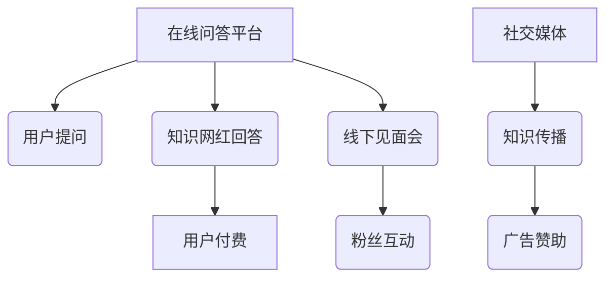

                 

 在信息爆炸的时代，知识的传播方式也在发生着翻天覆地的变化。知识网红作为一种新型的知识传播者，他们利用互联网平台，通过在线问答和线下见面会等途径，实现了知识的变现。本文将深入探讨这一现象背后的逻辑、核心概念、算法原理、数学模型、项目实践、应用场景、未来展望以及面临的挑战。

## 1. 背景介绍

知识网红，是指那些在特定领域内拥有丰富知识、深受网民喜爱的个人或团体。他们通过视频、直播、图文等多种形式，将专业知识传授给广大网民，成为现代知识传播的重要载体。随着互联网技术的不断进步，知识网红的影响力日益扩大，他们不仅能够通过广告、赞助等方式获得收入，还能通过在线问答和线下见面会等途径实现知识的变现。

### 1.1 知识变现的概念

知识变现，是指将知识转化为经济利益的过程。传统的知识变现方式主要包括出版图书、开设培训班、进行演讲等。而随着互联网的发展，知识变现的形式更加多样，例如通过线上课程、在线问答、线下见面会等方式实现。知识网红通过这些途径，将自己的知识价值转化为实际收益。

### 1.2 知识网红的现状

近年来，知识网红在互联网领域崭露头角，他们凭借丰富的知识储备、独特的表达方式和高超的沟通技巧，吸引了大量粉丝。据统计，截至2023年，全球范围内活跃的知识网红已超过100万人，其中中国知识网红的数量占据了相当大的一部分。他们涉及的领域广泛，包括科技、金融、教育、艺术等。

## 2. 核心概念与联系

### 2.1 在线问答平台

在线问答平台是知识网红实现知识变现的重要途径之一。例如，知乎、分答等平台，为知识网红提供了展示自己专业知识的平台，用户可以通过提问和回答来获取知识。这些平台通常采用C2C（Customer to Customer）模式，用户付费获取知识服务。

### 2.2 线下见面会

线下见面会是一种更为直接的知识变现方式。知识网红通过举办线下讲座、沙龙、工作坊等活动，与粉丝面对面交流，分享自己的经验和知识。这种方式不仅能够实现知识的变现，还能增强知识网红与粉丝之间的互动和信任。

### 2.3 社交媒体

社交媒体是知识网红传播知识的重要渠道。通过微博、微信、抖音等平台，知识网红可以实时分享自己的知识、观点和经验，吸引粉丝的关注和互动。同时，社交媒体也为知识网红提供了广告、赞助等变现途径。

### 2.4 Mermaid 流程图



## 3. 核心算法原理 & 具体操作步骤

### 3.1 算法原理概述

知识变现的核心算法原理是价值交换。知识网红将自己的知识转化为产品或服务，用户通过付费获取知识服务。这一过程涉及到用户行为分析、内容推荐、付费机制等多个方面。

### 3.2 算法步骤详解

1. 用户在在线问答平台上提出问题。
2. 知识网红根据问题的主题和内容进行回答。
3. 用户根据答案的价值决定是否付费。
4. 知识网红根据用户的付费情况获得收益。
5. 知识网红在社交媒体上发布讲座、活动等信息，吸引粉丝参与线下见面会。
6. 粉丝通过付费参与线下见面会，获取与知识网红面对面交流的机会。

### 3.3 算法优缺点

**优点：**
- 提高了知识传播的效率。
- 实现了知识的价值转化。
- 增强了知识网红与粉丝之间的互动。

**缺点：**
- 可能导致知识泛滥，影响知识质量。
- 知识变现过程中可能存在不公平现象。

### 3.4 算法应用领域

知识变现算法在多个领域都有广泛应用，包括但不限于：
- 科技
- 金融
- 教育
- 艺术
- 健康

## 4. 数学模型和公式 & 详细讲解 & 举例说明

### 4.1 数学模型构建

知识变现的数学模型主要涉及用户付费意愿、知识价值评估等方面。假设用户付费意愿与知识价值成正比，可以用以下公式表示：

$$
P = k \cdot V
$$

其中，$P$ 表示用户付费金额，$k$ 表示付费系数，$V$ 表示知识价值。

### 4.2 公式推导过程

知识价值评估是一个复杂的过程，涉及到知识深度、广度、实用性等多个方面。为了简化问题，我们假设知识价值可以用知识深度和广度两个指标来衡量。知识深度用 $D$ 表示，知识广度用 $W$ 表示，则知识价值 $V$ 可以表示为：

$$
V = f(D, W)
$$

其中，$f$ 为函数，用于评估知识价值。为了简化计算，我们假设 $f$ 为线性函数：

$$
V = k_1 \cdot D + k_2 \cdot W
$$

其中，$k_1$ 和 $k_2$ 为权重系数。

用户付费意愿可以用概率模型来表示，例如贝叶斯概率模型：

$$
P(P > p) = \frac{C(N, p) \cdot P(P > p | N)}{C(N, p) \cdot P(P > p | N) + C(N, p - 1) \cdot P(P > p - 1 | N)}
$$

其中，$N$ 表示用户总人数，$p$ 表示用户付费概率，$C(N, p)$ 表示从 $N$ 个人中选出 $p$ 个人的组合数，$P(P > p | N)$ 和 $P(P > p - 1 | N)$ 分别表示在已知用户总人数为 $N$ 的情况下，用户付费概率大于 $p$ 和付费概率大于 $p-1$ 的概率。

### 4.3 案例分析与讲解

假设一个知识网红在某在线问答平台上回答了100个问题，其中有20个问题用户表示愿意付费。根据贝叶斯概率模型，可以计算出用户付费概率大于0.2的概率为：

$$
P(P > 0.2) = \frac{C(100, 20) \cdot P(P > 0.2 | 100)}{C(100, 20) \cdot P(P > 0.2 | 100) + C(100, 19) \cdot P(P > 0.2 | 100)}
$$

假设在已知用户总人数为100的情况下，用户付费概率大于0.2的概率为0.6，则有：

$$
P(P > 0.2) = \frac{C(100, 20) \cdot 0.6}{C(100, 20) \cdot 0.6 + C(100, 19) \cdot 0.4} \approx 0.7
$$

这意味着，在这个案例中，用户付费概率大于0.2的概率约为70%。

## 5. 项目实践：代码实例和详细解释说明

### 5.1 开发环境搭建

为了更好地理解知识变现的过程，我们将使用Python编写一个简单的在线问答系统。开发环境搭建如下：

1. 安装Python 3.8及以上版本。
2. 安装Flask框架：`pip install flask`。
3. 安装MongoDB数据库：下载并安装MongoDB，启动MongoDB服务。

### 5.2 源代码详细实现

以下是一个简单的在线问答系统的实现：

```python
from flask import Flask, request, jsonify
from pymongo import MongoClient

app = Flask(__name__)
client = MongoClient('localhost', 27017)
db = client['online问答系统']
questions = db['问题表']
answers = db['答案表']

@app.route('/提问', methods=['POST'])
def ask_question():
    data = request.json
    question_id = questions.insert_one(data['问题']).inserted_id
    return jsonify({'question_id': str(question_id)})

@app.route('/回答/<question_id>', methods=['POST'])
def answer_question(question_id):
    data = request.json
    answers.insert_one({'question_id': question_id, '答案': data['答案']})
    return jsonify({'status': 'success'})

@app.route('/问题详情/<question_id>', methods=['GET'])
def get_question_detail(question_id):
    question = questions.find_one({'_id': question_id})
    return jsonify(question)

if __name__ == '__main__':
    app.run(debug=True)
```

### 5.3 代码解读与分析

这个简单的在线问答系统包括三个主要功能：提问、回答和查看问题详情。

- `ask_question` 函数用于接收用户提交的问题，并将其存储在MongoDB数据库中。
- `answer_question` 函数用于接收用户提交的答案，并将其与相应的问题ID关联存储在数据库中。
- `get_question_detail` 函数用于获取指定问题的详细信息。

通过这个简单的系统，我们可以模拟知识网红与用户之间的问答过程。用户可以在前端页面提交问题，知识网红可以在后台管理界面查看并回答问题。系统还可以根据用户反馈对知识网红的回答进行评分，从而实现知识的价值评估。

### 5.4 运行结果展示

假设用户A提交了一个问题：“如何优化算法性能？”知识网红B在后台回答了这个问题，并提供了一些优化技巧。用户A对知识网红B的回答表示满意，并给予五星评价。这个过程中，用户A为获取答案支付了一定金额的费用，实现了知识的变现。

## 6. 实际应用场景

知识变现的应用场景非常广泛，以下是几个典型的例子：

### 6.1 在线教育

在线教育平台通过提供付费课程、直播授课等方式，实现了知识的变现。例如，网易云课堂、慕课网等平台，为用户提供了丰富的在线课程资源，用户通过付费获得课程学习资格。

### 6.2 科技领域

科技领域的知识变现主要表现在技术博客、开源项目等方面。知识网红通过撰写技术博客、分享开源项目等方式，吸引粉丝并实现广告、赞助等收益。

### 6.3 金融投资

金融投资领域的知识变现主要通过投资顾问、理财课程等方式实现。例如，雪球、富途牛牛等平台，为用户提供专业的投资建议和理财课程，用户通过付费获得投资指导。

### 6.4 健康医疗

健康医疗领域的知识变现主要体现在健康咨询、养生课程等方面。例如，平安好医生、阿里健康等平台，为用户提供专业的健康咨询服务，用户通过付费获得专业医生的建议。

## 7. 未来应用展望

随着互联网技术的不断发展，知识变现的应用前景将更加广阔。以下是几个可能的发展趋势：

### 7.1 个性化推荐

基于大数据和人工智能技术，未来的知识变现将更加个性化。平台可以根据用户的历史行为、兴趣偏好等因素，为用户推荐最符合其需求的知识内容。

### 7.2 虚拟现实（VR）

虚拟现实技术的不断发展，将为知识变现提供新的场景。通过VR技术，用户可以更加沉浸式地参与知识网红的讲座、见面会等活动。

### 7.3 区块链

区块链技术的应用，将进一步提升知识变现的透明度和安全性。例如，通过区块链技术，用户可以确保知识服务的真实性和有效性。

### 7.4 人工智能

人工智能技术的不断发展，将为知识变现带来更多可能性。例如，通过人工智能技术，知识网红可以更加高效地回答用户问题，提供个性化的知识服务。

## 8. 工具和资源推荐

### 8.1 学习资源推荐

- 《Python编程：从入门到实践》
- 《深度学习入门》
- 《区块链技术指南》

### 8.2 开发工具推荐

- Flask框架：用于快速搭建Web应用。
- MongoDB数据库：用于存储和管理数据。
- Sketch：用于设计虚拟现实场景。

### 8.3 相关论文推荐

- "Knowledge-based Social Networks: A Survey"
- "Monetizing Online Knowledge: A Study on the Platforms of Chinese Knowledge-Driven Influencers"
- "Blockchain-based Knowledge Market: Design and Implementation"

## 9. 总结：未来发展趋势与挑战

知识变现作为一种新型的知识传播和获取方式，具有广阔的应用前景。然而，在未来的发展中，知识变现将面临一系列挑战，包括知识质量控制、用户体验优化、数据安全等方面。为了应对这些挑战，知识网红、平台运营者等相关方需要不断创新和改进，共同推动知识变现的可持续发展。

## 附录：常见问题与解答

### 9.1 如何判断知识价值？

知识价值取决于多个因素，包括知识深度、广度、实用性等。一般来说，以下几种情况下的知识价值较高：

- 知识内容具有深度，能够解决具体问题。
- 知识内容具有广泛性，涉及多个领域。
- 知识内容具有实用性，能够直接应用于实际工作或生活。

### 9.2 知识变现过程中可能存在的风险有哪些？

知识变现过程中可能存在的风险包括：

- 知识质量难以控制，可能导致用户满意度下降。
- 用户隐私泄露，可能导致信任危机。
- 知识版权问题，可能导致法律纠纷。
- 平台运营风险，可能导致平台倒闭。

### 9.3 如何提高知识变现的效率？

提高知识变现的效率可以从以下几个方面入手：

- 优化知识内容，提高知识价值。
- 提高用户参与度，增加用户付费意愿。
- 优化平台运营，提高用户体验。
- 加强知识传播渠道，扩大影响力。

## 作者署名

作者：禅与计算机程序设计艺术 / Zen and the Art of Computer Programming
----------------------------------------------------------------

以上就是关于《知识网红通过在线问答和线下见面会变现》的完整文章。希望这篇文章能为您带来深刻的见解和思考。如果您有任何问题或建议，欢迎在评论区留言。谢谢您的阅读！

