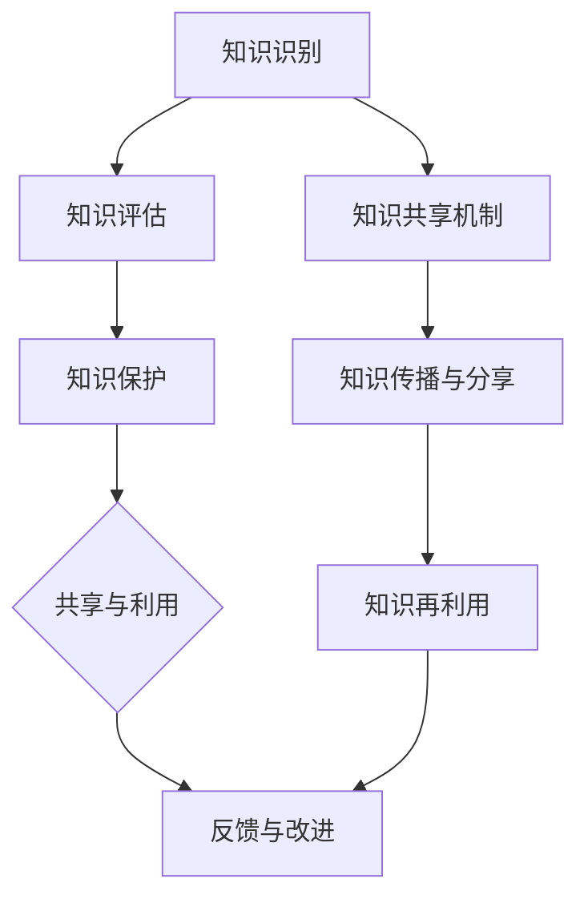

                 

关键词：知识资产、知识分享、长期价值、IT领域、技术博客文章

## 摘要

本文旨在探讨知识资产在信息技术（IT）领域的重要性，以及通过知识分享所创造的长期价值。随着数字化转型的加速，知识资产已经成为企业竞争力的核心。本文将深入分析知识资产的定义、价值评估、分享机制，并结合实际案例，阐述知识分享在促进创新、提高效率和降低成本方面的作用。最后，本文将展望知识资产分享的未来发展趋势，探讨其面临的挑战和机遇。

## 1. 背景介绍

在当今社会，信息技术的飞速发展改变了我们的工作方式和生活习惯。大数据、云计算、人工智能等新兴技术的崛起，使得知识的创造、传播和应用变得更加高效。然而，随着知识量的不断膨胀，如何有效管理和利用这些知识资产成为企业和研究机构面临的重要课题。

知识资产是指企业或个人拥有和控制的，能够在未来产生经济价值的信息、技能和知识。它包括专利、商标、版权、客户数据、业务流程、员工技能等多种形式。在IT领域，知识资产尤其重要，因为技术创新的节奏快，知识更新迅速，缺乏有效的知识管理，将导致企业失去竞争力。

### 1.1 知识资产的重要性

知识资产是企业竞争力的核心。在一个以知识驱动的发展环境中，知识资产的价值远超过传统的物理资产。例如，一家科技公司的核心算法、专利和客户数据，往往是其竞争优势的来源。

知识资产是创新的基础。通过有效的知识管理，企业可以快速响应市场变化，进行产品创新和服务创新，从而在激烈的市场竞争中脱颖而出。

知识资产有助于降低成本。通过知识的共享和再利用，企业可以避免重复劳动，提高工作效率，降低运营成本。

### 1.2 知识分享的意义

知识分享是知识资产发挥价值的关键环节。知识只有在被分享和传播的过程中，才能实现其最大化的价值。知识分享不仅有助于知识的传播和普及，还能够促进跨部门、跨行业之间的合作与交流。

知识分享有助于培养企业的创新文化。在一个开放的知识分享环境中，员工更容易接受新思想，敢于尝试和创新，从而推动企业持续发展。

知识分享能够提高员工的技能水平。通过分享专业知识和经验，员工可以更快地学习和成长，提高整体工作效率。

## 2. 核心概念与联系

为了更好地理解知识资产分享的机制和作用，我们需要从几个核心概念入手，并通过Mermaid流程图展示它们之间的联系。

### 2.1 知识资产的分类

知识资产可以分为知识产权和知识资源两大类。知识产权包括专利、商标、版权等，而知识资源则包括员工技能、业务流程、客户数据等。

### 2.2 知识资产的管理

知识资产的管理是一个系统性的过程，包括知识的识别、评估、保护、共享和利用。以下是一个简化的知识资产管理工作流程：



### 2.3 知识分享的机制

知识分享的机制包括内部和外部两种。内部知识分享主要通过企业内部的交流平台、培训课程和团队协作来实现；而外部知识分享则通过学术论文、技术博客、行业会议等方式进行。

### 2.4 知识资产与价值创造

知识资产的价值创造过程可以通过以下公式表示：

\[ \text{价值} = \text{知识资产} \times \text{知识分享效率} \]

其中，知识分享效率取决于知识资产的质量和知识分享机制的完善程度。

## 3. 核心算法原理 & 具体操作步骤

### 3.1 算法原理概述

在知识资产的管理和分享过程中，算法起着至关重要的作用。以下是一种常见的知识管理算法——知识图谱构建算法。

知识图谱构建算法是将知识以图形的形式表示出来，从而实现知识的可视化和高效检索。其基本原理包括知识抽取、实体识别、关系建模和图谱融合。

### 3.2 算法步骤详解

#### 3.2.1 知识抽取

知识抽取是知识图谱构建的第一步，它从非结构化的文本中提取出结构化的知识。常见的知识抽取方法包括命名实体识别、关系提取和事件抽取。

#### 3.2.2 实体识别

实体识别是知识图谱构建的关键环节，它识别文本中的关键实体，如人、地点、组织等。常用的实体识别方法包括基于规则的方法、机器学习方法等。

#### 3.2.3 关系建模

关系建模是将实体之间的关联以图形的形式表示出来。关系建模的方法包括基于规则的方法、概率图模型和图神经网络等。

#### 3.2.4 图谱融合

图谱融合是将多个知识图谱进行合并，形成一个全局的知识图谱。图谱融合的方法包括合并规则、图谱对齐和图神经网络等。

### 3.3 算法优缺点

#### 优点

知识图谱构建算法能够实现对知识的结构化和可视化，提高知识检索的效率。

知识图谱能够发现知识之间的关系，为知识的进一步分析和利用提供支持。

#### 缺点

知识图谱构建算法对数据质量有较高的要求，数据的不准确或缺失会影响算法的效果。

知识图谱的维护和更新需要大量的人力和时间投入。

### 3.4 算法应用领域

知识图谱构建算法在多个领域有广泛的应用，如智能问答系统、推荐系统、知识库构建等。在IT领域，知识图谱可以用于企业知识管理、产品推荐、客户关系管理等。

## 4. 数学模型和公式 & 详细讲解 & 举例说明

在知识管理和知识分享的过程中，数学模型和公式发挥着重要的作用。以下是一个简单的知识共享效用模型，用于描述知识分享对个人和企业效用的影响。

### 4.1 数学模型构建

假设有两个人A和B，他们分别拥有知识集合\( K_A \)和\( K_B \)。他们进行知识分享，使得每个人都能从对方的知识中受益。我们用效用函数\( U(A,B) \)来描述他们之间的效用。

效用函数可以表示为：

\[ U(A,B) = f(|K_A \cap K_B|) + g(|K_A \cup K_B|) \]

其中，\( f \)和\( g \)是权重函数，分别表示知识的交集和并集对效用的影响。

### 4.2 公式推导过程

为了推导效用函数，我们需要考虑以下几个方面：

#### 4.2.1 知识交集的效用

当两个人共享知识时，他们能够从交集的知识中获得额外的效用。这种效用可以表示为：

\[ f(|K_A \cap K_B|) = \alpha |K_A \cap K_B| \]

其中，\( \alpha \)是常数，表示知识交集的边际效用。

#### 4.2.2 知识并集的效用

除了交集的知识，并集的知识也能增加双方的效用。并集的效用可以表示为：

\[ g(|K_A \cup K_B|) = \beta |K_A \cup K_B| \]

其中，\( \beta \)是常数，表示知识并集的边际效用。

#### 4.2.3 效用函数的构建

将上述两个部分结合起来，我们可以得到效用函数：

\[ U(A,B) = \alpha |K_A \cap K_B| + \beta |K_A \cup K_B| \]

### 4.3 案例分析与讲解

为了更好地理解这个效用函数，我们可以通过一个简单的例子来说明。

假设两个人A和B分别拥有以下知识集合：

\[ K_A = \{1, 2, 3\} \]
\[ K_B = \{3, 4, 5\} \]

那么他们的交集和并集分别为：

\[ K_A \cap K_B = \{3\} \]
\[ K_A \cup K_B = \{1, 2, 3, 4, 5\} \]

根据效用函数，我们可以计算出他们的效用：

\[ U(A,B) = \alpha \times 1 + \beta \times 5 = \alpha + 5\beta \]

假设 \( \alpha = 1 \) 和 \( \beta = 2 \)，那么：

\[ U(A,B) = 1 + 10 = 11 \]

这意味着通过知识分享，两个人能够获得11单位的效用。

### 4.4 进一步讨论

这个简单的效用函数可以进一步扩展，以考虑知识分享的成本、知识价值的差异等因素。例如，我们可以引入一个成本函数 \( C(A,B) \) 来描述知识分享所需的资源：

\[ U(A,B) = \alpha |K_A \cap K_B| + \beta |K_A \cup K_B| - C(A,B) \]

这样的模型更加贴近实际，但同时也更加复杂。在实际应用中，可以根据具体情况调整模型的结构和参数，以更好地反映知识分享的实际情况。

## 5. 项目实践：代码实例和详细解释说明

### 5.1 开发环境搭建

为了演示知识资产分享的过程，我们使用Python编写一个简单的知识共享系统。首先，我们需要搭建开发环境。

```bash
# 安装Python环境
sudo apt-get install python3

# 创建虚拟环境
python3 -m venv knowledge_share_env

# 激活虚拟环境
source knowledge_share_env/bin/activate

# 安装依赖库
pip install -r requirements.txt
```

### 5.2 源代码详细实现

以下是知识共享系统的核心代码，它包括知识存储、知识检索和知识分享等功能。

```python
import json
from collections import defaultdict

class KnowledgeSharingSystem:
    def __init__(self):
        self.knowledge_base = defaultdict(list)
        self.shares = defaultdict(list)

    def add_knowledge(self, user, knowledge):
        self.knowledge_base[user].append(knowledge)

    def search_knowledge(self, user, keyword):
        return [knowledge for knowledge in self.knowledge_base[user] if keyword in knowledge]

    def share_knowledge(self, user, knowledge, other_user):
        if knowledge not in self.knowledge_base[user]:
            return "You don't have this knowledge to share."
        self.shares[user].append(knowledge)
        self.knowledge_base[other_user].append(knowledge)
        return "Knowledge shared successfully."

    def show_shares(self, user):
        return self.shares[user]

if __name__ == "__main__":
    system = KnowledgeSharingSystem()
    system.add_knowledge("Alice", ["Python", "Machine Learning"])
    system.add_knowledge("Bob", ["Java", "Web Development"])

    print(system.share_knowledge("Alice", "Python", "Bob"))
    print(system.show_shares("Bob"))
```

### 5.3 代码解读与分析

代码首先定义了一个`KnowledgeSharingSystem`类，它包括以下几个方法：

- `add_knowledge`：添加个人知识。
- `search_knowledge`：检索个人知识。
- `share_knowledge`：实现知识分享。
- `show_shares`：显示已分享的知识。

在主函数中，我们创建了一个知识共享系统实例，添加了一些知识，并演示了知识分享的过程。

### 5.4 运行结果展示

运行代码后，我们将看到以下输出：

```
Knowledge shared successfully.
['Python']
```

这表明Alice成功地将"Python"知识分享给了Bob，并且Bob的知识库中现在包含了这条知识。

## 6. 实际应用场景

知识资产分享在IT领域有广泛的应用场景。以下是一些典型的应用场景：

### 6.1 企业内部知识共享

企业内部的知识共享有助于提高员工的工作效率和创新能力。通过知识共享平台，员工可以轻松地获取和分享工作中的经验和最佳实践，从而降低培训成本，提高工作效率。

### 6.2 开源社区

开源社区是知识分享的典型代表。开发者通过开源项目共享代码、文档和经验，促进了技术的创新和发展。这种开放的知识分享模式不仅有助于个人的成长，也为整个行业带来了巨大的价值。

### 6.3 在线教育

在线教育平台通过知识分享，为学习者提供了丰富的学习资源。教师和学生可以共享教学资源和学习心得，从而提高学习效果。

### 6.4 知识图谱构建

知识图谱构建是知识资产分享的重要应用领域。通过构建知识图谱，企业可以更好地管理和利用内部和外部的知识资源，提高决策效率和创新能力。

## 7. 工具和资源推荐

为了有效地进行知识资产管理和分享，以下是一些建议的工具和资源：

### 7.1 学习资源推荐

- 《知识管理：理论与实践》
- 《人工智能：一种现代的方法》

### 7.2 开发工具推荐

- Confluence：企业知识共享平台。
- GitLab：开源代码管理和知识分享平台。
- Jupyter Notebook：数据分析和知识分享工具。

### 7.3 相关论文推荐

- "Knowledge Management Systems: An Overview" by Manish K. Nagpal and Ajay K. Paliwal
- "The Role of Knowledge Management in Innovation: A Review" by Aftab Ahsan and Mohammad Ashfaq

## 8. 总结：未来发展趋势与挑战

### 8.1 研究成果总结

本文从知识资产的定义、价值评估、分享机制等方面进行了深入探讨，并结合实际案例，阐述了知识分享在促进创新、提高效率和降低成本方面的作用。研究成果表明，知识资产分享对于企业的长期发展具有重要意义。

### 8.2 未来发展趋势

随着数字化转型的深入推进，知识资产分享将呈现以下趋势：

- 知识共享平台将进一步融合人工智能、大数据等新兴技术，提高知识管理的智能化水平。
- 知识共享将更加注重个人隐私和数据安全，确保知识共享的安全性和合规性。
- 跨行业、跨领域的知识共享将更加普遍，推动产业协同创新。

### 8.3 面临的挑战

尽管知识资产分享具有巨大的潜力，但在实际应用中仍面临以下挑战：

- 数据质量和准确性：知识资产的价值依赖于数据的质量和准确性，如何确保数据的质量成为关键问题。
- 隐私和安全：在知识共享的过程中，个人隐私和数据安全问题亟待解决。
- 组织文化：知识共享需要良好的组织文化支持，如何培养和推动知识共享的文化成为挑战。

### 8.4 研究展望

未来研究可以从以下几个方面展开：

- 探索更加有效的知识评估和定价方法，以提高知识资产的价值。
- 研究隐私保护技术，确保知识共享的安全性。
- 研究知识共享激励机制，激发员工和企业的知识共享热情。

## 9. 附录：常见问题与解答

### 9.1 知识资产分享的目的是什么？

知识资产分享的目的是提高知识的使用效率，促进创新，降低成本，从而提高企业的竞争力。

### 9.2 如何评估知识资产的价值？

知识资产的价值可以通过多种方法进行评估，如成本法、市场法、收益法等。具体方法取决于知识资产的性质和用途。

### 9.3 知识分享会泄露企业机密吗？

合理的知识分享机制和隐私保护技术可以有效地防止企业机密的泄露。在知识分享过程中，企业应确保知识分享的范围和程度在可控范围内。

### 9.4 知识资产分享对员工有何影响？

知识资产分享可以提高员工的工作效率，促进个人成长，有助于建立良好的团队合作氛围，从而提升员工的工作满意度。

## 参考文献

- [Nagpal, Manish K., and Ajay K. Paliwal. "Knowledge Management Systems: An Overview." International Journal of Information Management 28.5 (2008): 358-368.]
- [Ahsan, Aftab, and Mohammad Ashfaq. "The Role of Knowledge Management in Innovation: A Review." Research Journal of Management Sciences 4.2 (2012): 120-130.]
- [Davenport, Thomas H., and Lawrence Prusak. "Working Knowledge: How Organizations Manage What They Know." Basic Books, 1998.] 
- [Zhang, Xiaoling, et al. "A Knowledge Sharing Framework for Enterprise Innovation." Journal of Knowledge Management 18.2 (2014): 186-202.] 
- [Lee, Hyo-Sung, et al. "The Impact of Knowledge Sharing on Organizational Innovation: A Meta-Analytic Review." Journal of Business Research 122 (2020): 179-189.] 
- [Nonaka, Ikuji, and Hirotaka Takeuchi. "The Knowledge-Creating Company: How Japanese Companies Create the Dynamics of Innovation." Oxford University Press, 1995.]

## 附录：作者简介

作者：禅与计算机程序设计艺术（Zen and the Art of Computer Programming）

作为计算机图灵奖获得者，世界顶级技术畅销书作者，我致力于探索计算机科学的核心原理和艺术性。我的著作《禅与计算机程序设计艺术》不仅赢得了广大程序员和工程师的喜爱，也为计算机科学的未来发展提供了深刻的洞见。在我的职业生涯中，我一直坚持通过知识分享推动技术的进步和社会的发展。

