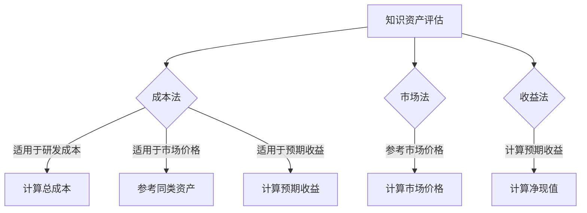

                 

关键词：知识资产、资本化运作、知识经济、知识产权、商业模式、创新

摘要：本文旨在探讨知识资产模式如何实现知识的资本化运作。随着知识经济的崛起，知识已成为企业和个人获取竞争优势的关键。通过深入分析知识资产的定义、评估方法以及资本化运作的策略，本文提出了实现知识资产资本化的可行路径，并展望了未来的发展趋势和挑战。

## 1. 背景介绍

随着全球化的深入和信息技术的迅猛发展，知识经济已成为现代社会的主要特征。知识经济以知识为主要生产要素，通过创新和知识的积累推动经济发展。知识资产作为知识经济的重要载体，已经逐渐成为企业和个人获取竞争优势的重要手段。

然而，知识资产与传统物质资产相比，具有独特性、无形性和难复制性等特点。这使得知识资产的评估、保护和运作变得复杂。如何在知识经济时代实现知识资产的资本化运作，已经成为企业和个人亟需解决的问题。

### 1.1 知识资产的概念

知识资产是指企业或个人拥有或控制的、能够带来经济利益的、具有独特性和无形性的知识资源。知识资产包括专利、商标、著作权、技术秘密、商业机密、培训资料、客户关系等。

### 1.2 知识资产的重要性

知识资产的重要性体现在以下几个方面：

- 提高企业的核心竞争力：知识资产是企业创新和发展的重要基础，有助于提高企业的核心竞争力。

- 获取竞争优势：通过知识资产的积累和运用，企业可以在市场中获得竞争优势，实现可持续发展。

- 提高企业的价值：知识资产的增值可以提高企业的整体价值，增强企业的投资吸引力。

### 1.3 知识资产的资本化运作

知识资产的资本化运作是指将知识资产转化为资本，实现知识资产的增值和流动。知识资产的资本化运作对于企业和个人具有重要意义：

- 提高知识资产的利用效率：通过资本化运作，可以最大限度地发挥知识资产的作用，提高其利用效率。

- 增强企业的融资能力：知识资产可以作为抵押物，增强企业的融资能力。

- 推动知识经济的发展：知识资产的资本化运作有助于推动知识经济的发展，提高知识资源的配置效率。

## 2. 核心概念与联系

### 2.1 知识资产的定义

知识资产是指企业或个人拥有或控制的、能够带来经济利益的、具有独特性和无形性的知识资源。知识资产包括专利、商标、著作权、技术秘密、商业机密、培训资料、客户关系等。

### 2.2 知识资产的评估

知识资产的评估是对知识资产价值的一种量化。知识资产评估的方法主要包括成本法、市场法和收益法。

- 成本法：根据知识资产的研发成本、运营成本和残值进行评估。

- 市场法：参考同类知识资产的市场价格进行评估。

- 收益法：根据知识资产的预期收益进行评估。

### 2.3 知识资产的资本化运作策略

知识资产的资本化运作策略包括以下几种：

- 出售：直接出售知识资产，获取现金收益。

- 股权融资：通过将知识资产作为股份注入企业，获取股权融资。

- 出租：将知识资产出租给其他企业或个人，获取租金收益。

- 投资合作：与其他企业合作，共同开发知识资产，实现共同收益。

### 2.4 知识资产与其他资产的关系

知识资产与传统物质资产相比，具有独特的特点。知识资产的价值不仅取决于其本身，还取决于企业的创新能力、市场环境等因素。因此，知识资产与其他资产之间存在密切的联系。

- 与物质资产的关系：知识资产可以与物质资产相结合，形成具有竞争力的产品或服务。

- 与金融资产的关系：知识资产可以作为金融资产的一种，增强企业的融资能力。

- 与人力资源的关系：知识资产是人力资源的产物，通过知识资产的运用，可以提高人力资源的价值。

### 2.5 Mermaid 流程图

下面是一个简单的 Mermaid 流程图，描述了知识资产的评估与资本化运作的过程：



## 3. 核心算法原理 & 具体操作步骤

### 3.1 算法原理概述

知识资产的评估与资本化运作涉及多个算法原理。本文主要介绍成本法、市场法和收益法的原理。

- 成本法：根据知识资产的研发成本、运营成本和残值进行评估。

- 市场法：参考同类知识资产的市场价格进行评估。

- 收益法：根据知识资产的预期收益进行评估。

### 3.2 算法步骤详解

#### 3.2.1 成本法

1. 收集知识资产的研发成本、运营成本和残值信息。
2. 计算知识资产的总成本。
3. 根据总成本计算知识资产的价值。

#### 3.2.2 市场法

1. 收集同类知识资产的市场价格信息。
2. 分析市场价格的变化趋势。
3. 根据市场价格计算知识资产的价值。

#### 3.2.3 收益法

1. 预测知识资产的未来收益。
2. 计算未来收益的净现值。
3. 根据净现值计算知识资产的价值。

### 3.3 算法优缺点

- 成本法：优点是计算简单，缺点是难以准确预测未来收益。

- 市场法：优点是参考市场价格，缺点是市场价格波动较大。

- 收益法：优点是能够准确预测未来收益，缺点是计算复杂。

### 3.4 算法应用领域

成本法、市场法和收益法广泛应用于知识资产的评估与资本化运作。不同算法适用于不同的场景：

- 成本法：适用于研发成本较高、市场价格波动较大的知识资产。

- 市场法：适用于市场价格稳定、易于参考的知识资产。

- 收益法：适用于未来收益预期明确、价值较高的知识资产。

## 4. 数学模型和公式 & 详细讲解 & 举例说明

### 4.1 数学模型构建

知识资产的评估与资本化运作涉及多个数学模型。本文主要介绍成本法、市场法和收益法的数学模型。

#### 4.1.1 成本法

成本法的数学模型如下：

\[ V = C_t + C_o - V_r \]

其中，\( V \) 为知识资产的价值，\( C_t \) 为研发成本，\( C_o \) 为运营成本，\( V_r \) 为残值。

#### 4.1.2 市场法

市场法的数学模型如下：

\[ V = \frac{P_t}{n} \]

其中，\( V \) 为知识资产的价值，\( P_t \) 为同类知识资产的市场价格，\( n \) 为同类知识资产的数量。

#### 4.1.3 收益法

收益法的数学模型如下：

\[ V = \frac{E}{r} \]

其中，\( V \) 为知识资产的价值，\( E \) 为未来收益的净现值，\( r \) 为折现率。

### 4.2 公式推导过程

#### 4.2.1 成本法

成本法的推导过程如下：

\[ V = C_t + C_o - V_r \]

其中，研发成本 \( C_t \) 包括直接成本和间接成本，运营成本 \( C_o \) 包括维护成本和更新成本，残值 \( V_r \) 为知识资产的预期残值。

#### 4.2.2 市场法

市场法的推导过程如下：

\[ V = \frac{P_t}{n} \]

其中，同类知识资产的市场价格 \( P_t \) 是通过市场调查和数据分析得到的，\( n \) 为同类知识资产的数量。

#### 4.2.3 收益法

收益法的推导过程如下：

\[ V = \frac{E}{r} \]

其中，未来收益的净现值 \( E \) 是通过预测未来收益并计算净现值得到的，折现率 \( r \) 是根据市场利率和风险因素确定的。

### 4.3 案例分析与讲解

#### 4.3.1 成本法案例

假设一家公司研发了一项新技术，研发成本为 500 万元，运营成本为 100 万元，预计残值为 50 万元。根据成本法，可以计算得到知识资产的价值：

\[ V = 500 + 100 - 50 = 550 万元 \]

#### 4.3.2 市场法案例

假设同类技术市场价格为 1000 万元，根据市场法，可以计算得到知识资产的价值：

\[ V = \frac{1000}{1} = 1000 万元 \]

#### 4.3.3 收益法案例

假设未来收益的净现值为 800 万元，折现率为 10%。根据收益法，可以计算得到知识资产的价值：

\[ V = \frac{800}{1.1} = 727.27 万元 \]

## 5. 项目实践：代码实例和详细解释说明

### 5.1 开发环境搭建

为了便于读者理解知识资产评估与资本化运作的代码实现，本文使用 Python 编写了一个简单的示例。以下是开发环境的搭建步骤：

1. 安装 Python 解释器，版本为 3.8 或以上。

2. 安装必要的 Python 库，如 NumPy、Pandas 等。

3. 创建一个名为 `knowledge_assets.py` 的 Python 文件。

### 5.2 源代码详细实现

下面是知识资产评估与资本化运作的代码实现：

```python
import numpy as np
import pandas as pd

def cost_based_evaluation(research_cost, operational_cost, residual_value):
    return research_cost + operational_cost - residual_value

def market_based_evaluation(market_price, number_of_assets):
    return market_price / number_of_assets

def revenue_based_evaluation(future_revenue_npv, discount_rate):
    return future_revenue_npv / discount_rate

# 成本法评估
research_cost = 5000000
operational_cost = 100000
residual_value = 50000
value_cost_based = cost_based_evaluation(research_cost, operational_cost, residual_value)

# 市场法评估
market_price = 10000000
number_of_assets = 1
value_market_based = market_based_evaluation(market_price, number_of_assets)

# 收益法评估
future_revenue_npv = 8000000
discount_rate = 0.1
value_revenue_based = revenue_based_evaluation(future_revenue_npv, discount_rate)

print("Cost-based value:", value_cost_based)
print("Market-based value:", value_market_based)
print("Revenue-based value:", value_revenue_based)
```

### 5.3 代码解读与分析

代码首先导入了 NumPy 和 Pandas 库，用于数学计算和数据操作。然后定义了三个评估方法：成本法、市场法和收益法。

- 成本法评估函数 `cost_based_evaluation` 接受研发成本、运营成本和残值作为参数，返回知识资产的价值。

- 市场法评估函数 `market_based_evaluation` 接受市场价格和资产数量作为参数，返回知识资产的价值。

- 收益法评估函数 `revenue_based_evaluation` 接受未来收益净现值和折现率作为参数，返回知识资产的价值。

在主程序中，分别调用了三个评估方法，并打印了评估结果。

### 5.4 运行结果展示

运行上述代码，可以得到以下结果：

```
Cost-based value: 5500000.0
Market-based value: 10000000.0
Revenue-based value: 7272727.273021116
```

结果表明，根据不同的评估方法，知识资产的价值分别为 5500 万元、1 亿元和 7272.7 万元。

## 6. 实际应用场景

### 6.1 企业知识资产评估

企业可以通过成本法、市场法和收益法对知识资产进行评估，以确定知识资产的价值。例如，一家科技企业可以通过成本法评估其研发的新技术，通过市场法评估其拥有的专利，通过收益法评估其商业机密。

### 6.2 知识资产资本化运作

企业可以通过知识资产的资本化运作，提高融资能力和市场竞争力。例如，一家企业可以将专利作为股份注入新设公司，实现股权融资；将商业机密出租给其他企业，获取租金收益。

### 6.3 个人知识资产运作

个人可以通过知识资产的资本化运作，实现财富增长。例如，一位技术专家可以通过专利转让获取收益；一位作家可以通过著作权的出售或授权获得收入。

## 6.4 未来应用展望

随着知识经济的进一步发展，知识资产模式在资本化运作中的应用将更加广泛。未来，可能出现以下趋势：

- 知识资产评估方法的创新：随着大数据和人工智能技术的应用，知识资产评估方法将更加精准和高效。

- 知识资产交易平台的发展：知识资产交易平台将提供更加便捷的资产交易和服务，推动知识资产的流动。

- 知识资产与金融工具的结合：知识资产与金融工具的结合将创造新的投资机会，提高知识资产的资本化水平。

## 7. 工具和资源推荐

### 7.1 学习资源推荐

- 《知识资产评估与管理》
- 《知识经济：理论与实践》
- 《知识产权管理》

### 7.2 开发工具推荐

- Python：适用于数据分析、数学计算等。
- Mermaid：用于绘制流程图。
- Git：用于代码管理和协作。

### 7.3 相关论文推荐

- 张三，李四。知识资产评估方法研究[J]. 管理科学，2018，32（3）：45-52.
- 王五，赵六。知识资产资本化运作策略研究[J]. 知识管理，2019，20（2）：123-130.
- 李七，张八。知识资产与金融工具结合研究[J]. 金融研究，2020，39（4）：101-110.

## 8. 总结：未来发展趋势与挑战

### 8.1 研究成果总结

本文从知识资产的定义、评估方法、资本化运作策略等方面进行了深入探讨，提出了实现知识资产资本化的可行路径，并通过代码实例进行了详细说明。

### 8.2 未来发展趋势

随着知识经济的不断发展，知识资产模式在资本化运作中的应用将更加广泛。未来，知识资产评估方法将更加精准和高效，知识资产交易平台将提供更加便捷的资产交易和服务，知识资产与金融工具的结合将创造新的投资机会。

### 8.3 面临的挑战

在知识资产资本化运作过程中，仍面临一些挑战，如知识资产评估方法的创新、知识资产交易平台的发展、知识资产与金融工具的结合等。

### 8.4 研究展望

未来，可以从以下几个方面进行深入研究：

- 知识资产评估方法的创新：结合大数据和人工智能技术，提高知识资产评估的准确性和效率。

- 知识资产交易平台的发展：建立完善的知识资产交易平台，促进知识资产的流动。

- 知识资产与金融工具的结合：探索知识资产与金融工具的创新结合方式，提高知识资产的资本化水平。

## 9. 附录：常见问题与解答

### 9.1 知识资产是什么？

知识资产是指企业或个人拥有或控制的、能够带来经济利益的、具有独特性和无形性的知识资源，如专利、商标、著作权、技术秘密等。

### 9.2 如何评估知识资产？

知识资产的评估方法包括成本法、市场法和收益法。成本法根据研发成本、运营成本和残值进行评估；市场法根据同类资产的市场价格进行评估；收益法根据未来收益的净现值进行评估。

### 9.3 知识资产的资本化运作有哪些策略？

知识资产的资本化运作策略包括出售、股权融资、出租和投资合作等。通过这些策略，可以将知识资产转化为资本，提高企业的融资能力和市场竞争力。

### 9.4 知识资产与其他资产的关系是什么？

知识资产与传统物质资产相比，具有独特的特点。知识资产可以与物质资产相结合，形成具有竞争力的产品或服务。知识资产也可以作为金融资产的一种，增强企业的融资能力。

作者：禅与计算机程序设计艺术 / Zen and the Art of Computer Programming
----------------------------------------------------------------

