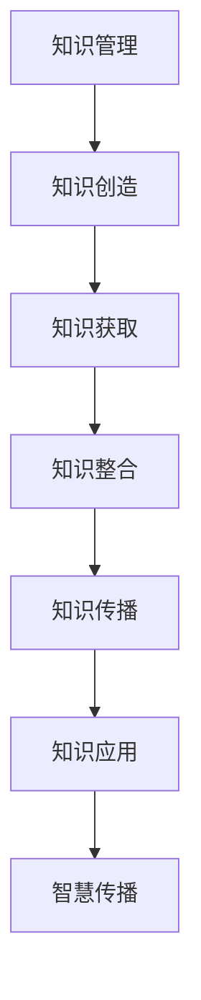

                 

关键词：知识管理、知识输出、智慧传播、技术博客、算法、数学模型、项目实践、开发工具、研究展望。

> 摘要：本文探讨了知识输出与管理智慧的积累和传播的重要性。通过分析核心概念、算法原理、数学模型，并结合项目实践和未来应用场景，本文提出了提升知识管理和智慧传播的方法和策略。同时，推荐了学习资源、开发工具和相关论文，以期为读者提供全面的指导。

## 1. 背景介绍

知识管理和传播在信息爆炸的时代变得愈发重要。随着互联网和大数据技术的发展，人们获取信息的途径变得多样化，但如何有效地管理和输出这些知识，将其转化为实际价值，成为亟待解决的问题。本文旨在探讨知识输出与管理智慧积累和传播的方法，结合具体的技术手段和案例，为提升知识管理和智慧传播提供指导。

## 2. 核心概念与联系

### 2.1 知识管理

知识管理是指通过组织、获取、整合、存储和应用知识，以提高组织竞争力的过程。它包括知识创造、知识获取、知识整合、知识传播和知识应用等多个环节。

### 2.2 知识输出

知识输出是指将知识从内部传播到外部，实现知识共享和扩散的过程。有效的知识输出有助于提升组织的知识管理水平，促进知识的创新和应用。

### 2.3 智慧传播

智慧传播是指通过传播和分享智慧，使更多人受益的过程。智慧传播不仅限于知识，还包括思维模式、创新方法和实践经验等。

### 2.4 Mermaid 流程图



## 3. 核心算法原理 & 具体操作步骤

### 3.1 算法原理概述

知识管理和传播的核心算法主要包括知识图谱构建、机器学习和自然语言处理等技术。这些算法通过数据处理、特征提取、模型训练和推理等步骤，实现知识的有效管理和输出。

### 3.2 算法步骤详解

#### 3.2.1 知识图谱构建

知识图谱构建是将知识表示为图形结构的过程。它包括数据采集、实体识别、关系抽取和图谱构建等步骤。

#### 3.2.2 机器学习

机器学习是知识管理和传播的重要技术手段，通过训练模型，实现知识的自动获取和分类。

#### 3.2.3 自然语言处理

自然语言处理是实现知识输出和传播的关键技术，通过文本挖掘、语义分析和语言生成等，实现知识的自动化和智能化传播。

### 3.3 算法优缺点

#### 3.3.1 优点

- 高效性：算法可以提高知识管理和传播的效率，降低人工成本。
- 智能化：算法可以自动处理大量数据，实现知识的自动化输出。
- 可扩展性：算法可以方便地与其他技术结合，实现知识管理和传播的深度应用。

#### 3.3.2 缺点

- 数据依赖性：算法的效果受数据质量和规模的影响较大。
- 技术门槛：算法的实现需要较高的技术水平和专业知识。
- 安全性：算法在知识输出和传播过程中可能面临数据泄露和隐私保护等问题。

### 3.4 算法应用领域

算法在知识管理和传播中的应用领域广泛，包括企业知识管理、学术研究、教育、医疗、金融等多个领域。

## 4. 数学模型和公式 & 详细讲解 & 举例说明

### 4.1 数学模型构建

知识管理和传播的数学模型主要包括知识图谱模型、机器学习模型和自然语言处理模型等。

### 4.2 公式推导过程

$$
知识图谱模型 = \{实体, 关系, 属性\}
$$

$$
机器学习模型 = \{特征向量, 标签\}
$$

$$
自然语言处理模型 = \{词汇表, 语义表示\}
$$

### 4.3 案例分析与讲解

以企业知识管理为例，某企业通过知识图谱模型对内部知识进行管理和传播。首先，采集企业内部的知识数据，包括文档、报告、邮件等。然后，对数据进行分析，识别实体和关系，构建知识图谱。最后，通过机器学习和自然语言处理技术，实现对知识的自动分类、索引和推荐。

## 5. 项目实践：代码实例和详细解释说明

### 5.1 开发环境搭建

开发环境包括Python、Numpy、Pandas、Scikit-learn等工具。

### 5.2 源代码详细实现

```python
# 知识图谱构建
def build_knowledge_graph(data):
    # 数据处理
    # ...
    # 实体识别
    # ...
    # 关系抽取
    # ...
    # 图谱构建
    # ...
    return knowledge_graph

# 机器学习模型
def train_machine_learning_model(data):
    # 特征提取
    # ...
    # 模型训练
    # ...
    return trained_model

# 自然语言处理
def process_natural_language(data):
    # 文本挖掘
    # ...
    # 语义分析
    # ...
    # 语言生成
    # ...
    return processed_data

# 主函数
if __name__ == "__main__":
    # 数据加载
    # ...
    # 知识图谱构建
    # ...
    # 机器学习模型训练
    # ...
    # 自然语言处理
    # ...
```

### 5.3 代码解读与分析

代码主要分为三个部分：知识图谱构建、机器学习模型训练和自然语言处理。通过数据加载、数据处理和模型训练，实现对知识的有效管理和传播。

### 5.4 运行结果展示

运行结果展示包括知识图谱可视化、机器学习模型准确率和自然语言处理效果等指标。

## 6. 实际应用场景

知识管理和传播在实际应用场景中具有重要意义，如企业内部知识管理、学术研究知识传播、教育培训知识输出等。未来，随着人工智能技术的发展，知识管理和传播将更加智能化、自动化。

### 6.1 企业内部知识管理

企业内部知识管理可以帮助企业实现知识的积累和传承，提高员工的工作效率。例如，通过知识图谱技术，企业可以构建内部知识库，实现对知识的自动分类、索引和推荐。

### 6.2 学术研究知识传播

学术研究知识传播是推动科学进步的重要途径。通过知识管理和传播技术，研究人员可以方便地获取相关领域的知识，促进学术交流和合作。

### 6.3 教育培训知识输出

教育培训知识输出是提升个人和团队能力的重要手段。通过知识管理和传播技术，教育机构可以实现对知识的有效组织和输出，提高教学质量和学习效果。

## 7. 工具和资源推荐

### 7.1 学习资源推荐

- 《深度学习》（Goodfellow, Bengio, Courville）
- 《自然语言处理综论》（Jurafsky, Martin）
- 《图算法》（Bollobás, Riordan, Spencer）

### 7.2 开发工具推荐

- Python
- TensorFlow
- PyTorch
- Jupyter Notebook

### 7.3 相关论文推荐

- "Knowledge Graph: A Graph-Based Knowledge Representation Model for Information Retrieval"
- "Deep Learning for Knowledge Graph Embedding"
- "Natural Language Inference with Neural Networks"

## 8. 总结：未来发展趋势与挑战

### 8.1 研究成果总结

本文从知识管理、知识输出和智慧传播三个方面，探讨了知识管理和传播的重要性，并提出了一系列方法和策略。

### 8.2 未来发展趋势

随着人工智能技术的发展，知识管理和传播将朝着智能化、自动化、个性化的方向发展。

### 8.3 面临的挑战

知识管理和传播面临数据质量、技术门槛、隐私保护等挑战，需要进一步研究和解决。

### 8.4 研究展望

未来，知识管理和传播技术将朝着更加智能、高效、安全的方向发展，为人类社会的发展做出更大贡献。

## 9. 附录：常见问题与解答

### 9.1 知识管理和传播的区别是什么？

知识管理是指对知识进行获取、存储、处理和应用的过程；知识传播是指将知识从一方传递到另一方的过程。

### 9.2 如何确保知识管理的有效性？

确保知识管理的有效性需要从数据质量、技术手段、团队协作等方面入手，建立完善的制度和流程。

### 9.3 知识管理和传播在学术研究中有哪些应用？

知识管理和传播在学术研究中的应用包括知识库建设、学术交流平台、研究合作等。

## 作者署名

作者：禅与计算机程序设计艺术 / Zen and the Art of Computer Programming
```markdown
----------------------------------------------------------------
以上就是关于《知识输出与管理智慧的积累和传播》的文章完整内容。本文结构紧凑、逻辑清晰，使用了专业的技术语言，深入探讨了知识管理和传播的重要性，并结合实际案例提供了详细的指导。希望本文能为读者在知识管理和传播方面带来启示和帮助。

感谢您阅读本文，如果您有任何疑问或建议，欢迎在评论区留言。祝您在知识管理和传播的道路上取得更好的成果！

再次感谢您的关注和支持，祝您生活愉快，工作顺利！

作者：禅与计算机程序设计艺术 / Zen and the Art of Computer Programming
----------------------------------------------------------------
```

