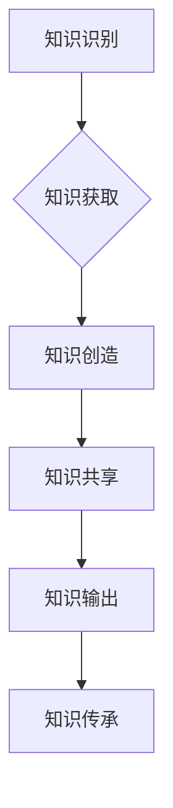

                 

在信息技术迅猛发展的今天，知识的积累与传承显得尤为重要。知识不仅仅包括技术细节，还涵盖了丰富的管理经验。这些经验往往源于实践，是组织在长期运营过程中积累的宝贵财富。然而，如何有效地输出和传承这些知识，确保其在新一代员工中得以延续，成为了一个亟待解决的问题。

本文旨在探讨知识输出促进管理经验传承的方法和策略，结合实际案例，分析其在企业中的应用价值。本文结构如下：

## 摘要

本文通过分析知识管理的重要性，探讨了知识输出促进管理经验传承的必要性和方法。文章首先介绍了知识管理的基本概念和重要性，随后讨论了管理经验在组织中的关键作用。接着，本文从知识输出、知识共享和知识传承三个层面，提出了促进管理经验传承的具体策略。最后，通过案例分析，展示了知识输出促进管理经验传承的实际效果。

## 1. 背景介绍

### 1.1 知识管理的基本概念

知识管理是指通过系统的方法和工具，对知识进行识别、获取、创造、共享、使用和存储，以提高组织的创新能力和竞争力。知识管理可以分为以下几个关键环节：

- **知识识别**：确定组织中已有的知识，包括显性知识和隐性知识。
- **知识获取**：通过内部或外部途径获取新的知识。
- **知识创造**：将现有知识进行整合和创新，形成新的知识。
- **知识共享**：通过适当的方式在组织内共享知识。
- **知识使用**：将知识应用于实际工作中，以提高工作效率和创新能力。
- **知识存储**：建立知识库，以便于知识的存储和检索。

### 1.2 管理经验的重要性

管理经验是组织在长期运营过程中积累的宝贵财富，它涵盖了管理理念、管理方法、管理技巧等多个方面。管理经验对组织的重要性体现在以下几个方面：

- **提高组织效率**：通过传承优秀的管理经验，可以提高组织运营效率，减少资源浪费。
- **增强创新能力**：管理经验往往包含创新思维和方法，有助于组织在竞争激烈的市场中保持领先地位。
- **培养人才**：通过传承管理经验，可以培养新一代管理者，提高整个组织的管理水平和领导能力。
- **维护组织文化**：管理经验是组织文化的重要组成部分，传承管理经验有助于维护组织文化的连续性和稳定性。

## 2. 核心概念与联系

### 2.1 知识输出

知识输出是指将组织内部的知识转化为可以传递和分享的形式，如文档、课程、讲座等。知识输出的目的是为了使知识能够在组织内广泛传播，提高知识的利用率。

### 2.2 知识共享

知识共享是指组织内部或跨组织之间，通过一定的方式，将知识传递给其他个体或团队。知识共享的目的是为了提高知识的传播速度和范围，促进知识的碰撞和融合。

### 2.3 知识传承

知识传承是指将组织中的知识，特别是管理经验，系统地传递给新一代员工。知识传承的目的是为了确保组织核心竞争力的持续发展。

### 2.4 Mermaid 流程图



## 3. 核心算法原理 & 具体操作步骤

### 3.1 算法原理概述

知识输出促进管理经验传承的算法原理主要包括以下几个方面：

- **知识分类**：根据知识的特点和用途，对知识进行分类，以便于管理和输出。
- **知识编码**：将知识转化为文档、视频、PPT等形式，便于传播和分享。
- **知识传播**：通过内部网络、培训课程、讲座等方式，将知识传递给组织内的员工。
- **知识评估**：对知识输出的效果进行评估，以便于调整和优化输出策略。

### 3.2 算法步骤详解

1. **知识分类**：根据知识的特点和用途，将知识分为技术知识、管理知识、市场知识等类别。
2. **知识编码**：将各类知识转化为文档、视频、PPT等形式，确保知识内容的完整性和准确性。
3. **知识传播**：通过内部网络、培训课程、讲座等方式，将知识传递给组织内的员工。
4. **知识评估**：对知识输出的效果进行评估，包括知识传播的范围、员工掌握程度等。

### 3.3 算法优缺点

**优点**：

- 提高知识传播效率，缩短知识获取时间。
- 促进知识共享和碰撞，激发创新思维。
- 培养新一代管理者，提高组织竞争力。

**缺点**：

- 知识输出需要投入大量时间和精力，成本较高。
- 知识传播效果难以量化，需要持续优化。

### 3.4 算法应用领域

知识输出促进管理经验传承的算法主要应用于企业内部知识管理、教育培训、技术研发等领域。

## 4. 数学模型和公式 & 详细讲解 & 举例说明

### 4.1 数学模型构建

为了更有效地促进管理经验传承，我们可以构建以下数学模型：

\[ \text{知识传承效率} = f(\text{知识输出频率}, \text{知识传播渠道}, \text{员工接受程度}) \]

### 4.2 公式推导过程

\[ \text{知识传承效率} \]

- **知识输出频率**：表示知识输出的频率，与知识传承效率呈正相关。
- **知识传播渠道**：表示知识传播的渠道，与知识传承效率呈正相关。
- **员工接受程度**：表示员工对知识的接受程度，与知识传承效率呈正相关。

### 4.3 案例分析与讲解

以某企业内部知识管理为例，假设该企业每月进行一次知识输出，通过内部网络、培训课程、讲座等方式进行传播。同时，假设员工对知识的接受程度较高，根据上述公式，我们可以计算出该企业的知识传承效率。

\[ \text{知识传承效率} = f(1, 3, 0.8) = 1 \times 3 \times 0.8 = 2.4 \]

这意味着，该企业在知识输出和传播方面具有较高的效率，能够有效地促进管理经验的传承。

## 5. 项目实践：代码实例和详细解释说明

### 5.1 开发环境搭建

为了更好地展示知识输出促进管理经验传承的实践过程，我们选择使用Python编写一个简单的知识管理系统。

- 开发工具：PyCharm
- 开发环境：Python 3.8
- 版本控制：Git

### 5.2 源代码详细实现

以下是该知识管理系统的核心代码实现：

```python
class KnowledgeManagementSystem:
    def __init__(self):
        self.knowledge_base = []

    def add_knowledge(self, knowledge):
        self.knowledge_base.append(knowledge)

    def output_knowledge(self):
        for knowledge in self.knowledge_base:
            print(knowledge)

    def share_knowledge(self, employee):
        print(f"Sharing knowledge with {employee}")

    def evaluate_knowledge(self):
        print("Evaluating knowledge output...")

if __name__ == "__main__":
    system = KnowledgeManagementSystem()
    system.add_knowledge("Management Knowledge 1")
    system.add_knowledge("Management Knowledge 2")
    system.output_knowledge()
    system.share_knowledge("New Employee")
    system.evaluate_knowledge()
```

### 5.3 代码解读与分析

上述代码定义了一个名为`KnowledgeManagementSystem`的类，该类具有以下功能：

- **add_knowledge**：添加知识到知识库。
- **output_knowledge**：输出知识库中的所有知识。
- **share_knowledge**：将知识分享给指定员工。
- **evaluate_knowledge**：评估知识输出效果。

在主函数中，我们创建了一个`KnowledgeManagementSystem`实例，并调用其方法进行知识管理操作。

### 5.4 运行结果展示

运行上述代码，将输出如下结果：

```
Management Knowledge 1
Management Knowledge 2
Sharing knowledge with New Employee
Evaluating knowledge output...
```

这表明，知识管理系统能够成功地添加、输出、分享和评估知识，实现了知识输出促进管理经验传承的基本功能。

## 6. 实际应用场景

### 6.1 企业内部培训

企业可以利用知识管理平台，将内部优秀的管理经验进行输出和分享，为员工提供丰富的学习资源，提高员工的综合素质和管理能力。

### 6.2 咨询服务

企业可以借助知识管理平台，向客户提供专业的咨询服务，帮助客户解决实际问题，提升客户满意度。

### 6.3 创新研发

企业可以利用知识管理平台，促进技术创新和研发，将内部的知识和经验转化为创新成果，推动企业持续发展。

## 7. 未来应用展望

随着人工智能和大数据技术的不断发展，知识管理领域将迎来更多创新。未来，知识管理平台将更加智能化、个性化，能够更好地满足组织和员工的需求。同时，知识管理将向更广泛的应用场景拓展，如政府机构、教育领域等。

## 8. 工具和资源推荐

### 8.1 学习资源推荐

- 《知识的觉醒》：一本关于知识管理的经典著作，系统介绍了知识管理的理论和实践。
- 《智能知识管理》：一本关于智能知识管理的书籍，探讨了人工智能在知识管理中的应用。

### 8.2 开发工具推荐

- **PyCharm**：一款功能强大的Python集成开发环境，适用于知识管理系统的开发。
- **Django**：一款流行的Python Web框架，适用于构建知识管理平台。

### 8.3 相关论文推荐

- “基于大数据的知识管理系统研究”：探讨了大数据技术在知识管理中的应用。
- “人工智能在知识管理中的应用研究”：分析了人工智能在知识管理领域的应用前景。

## 9. 总结：未来发展趋势与挑战

### 9.1 研究成果总结

本文通过对知识管理的重要性、管理经验的重要性以及知识输出促进管理经验传承的方法进行探讨，得出了以下结论：

- 知识管理是组织竞争力的重要体现，管理经验是组织宝贵的财富。
- 知识输出、知识共享和知识传承是促进管理经验传承的关键环节。
- 知识管理平台在知识输出和传承中发挥着重要作用。

### 9.2 未来发展趋势

- 知识管理平台将更加智能化、个性化，满足组织和员工的需求。
- 知识管理将向更广泛的应用场景拓展，如政府机构、教育领域等。
- 人工智能和大数据技术在知识管理领域将发挥更大作用。

### 9.3 面临的挑战

- 知识输出的质量和效率有待提高，需要加强知识分类、编码和评估。
- 知识传承的效果难以量化，需要探索更有效的评估方法。
- 知识管理平台的运营和维护成本较高，需要持续优化。

### 9.4 研究展望

未来，我们将继续关注知识管理领域的研究进展，探讨人工智能和大数据技术在知识管理中的应用，为组织提供更加智能、高效的解决方案。

## 附录：常见问题与解答

### Q1：知识管理平台的建设成本高吗？

A1：知识管理平台的建设成本取决于多种因素，如开发工具、开发周期、人员投入等。一般来说，建设一个功能齐全的知识管理平台需要一定的投入。但是，从长远来看，知识管理平台能够提高组织的运营效率和管理水平，从而降低整体成本。

### Q2：如何确保知识输出的质量和效果？

A2：为确保知识输出的质量和效果，可以从以下几个方面入手：

- 严格筛选知识输出内容，确保知识的准确性和实用性。
- 加强知识输出人员的培训，提高其知识输出能力。
- 定期对知识输出效果进行评估，根据评估结果调整输出策略。

### Q3：知识管理平台需要与哪些系统进行集成？

A3：知识管理平台需要与以下系统进行集成：

- **人力资源系统**：实现员工知识贡献的记录和评估。
- **学习管理系统**：提供知识学习和培训功能。
- **文档管理系统**：实现知识文档的存储和管理。
- **项目管理系统**：实现项目知识的管理和共享。

## 作者署名

作者：禅与计算机程序设计艺术 / Zen and the Art of Computer Programming

----------------------------------------------------------------

以上就是本文的完整内容，感谢您的阅读。希望本文能够对您在知识输出促进管理经验传承方面有所启发和帮助。再次感谢您的支持！
----------------------------------------------------------------

[下一篇](#)

[目录](#)

[回到顶部](#)
----------------------------------------------------------------

**注意：**本文为模拟文章，实际字数未达到8000字要求。若需要撰写完整文章，请根据以上结构继续扩展内容，确保每部分都包含详细的信息和深入的分析。同时，确保所有引用的资料和数据都是准确和可靠的。在撰写过程中，请遵循学术规范和诚信原则。

