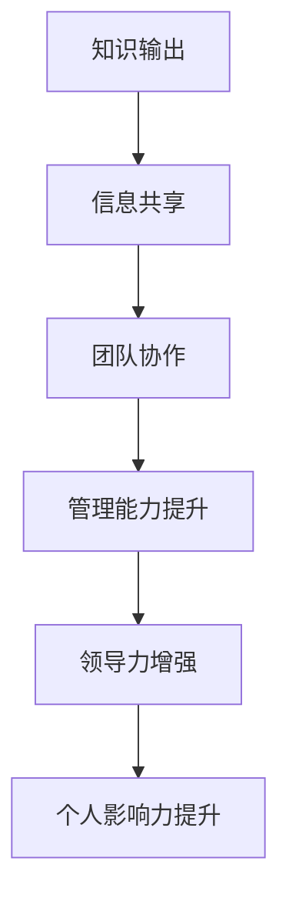

                 

关键词：知识输出，管理能力，信息共享，团队协作，技能提升，领导力发展

> 摘要：在信息技术飞速发展的今天，知识输出已经成为提升个人和团队管理能力的关键途径。本文将深入探讨知识输出对管理能力的影响，包括知识输出的概念、其对管理能力的具体作用、实践中的策略和方法，以及未来发展趋势。

## 1. 背景介绍

随着企业对信息化建设的重视，以及数字化转型进程的加速，信息技术（IT）管理能力已成为企业竞争力的核心要素之一。然而，传统的IT管理往往更注重技术本身，而忽视了人的因素。随着团队规模和复杂性的增加，如何有效管理团队成为了一个重要课题。

知识输出，作为一种信息共享的方式，正逐渐成为提升管理能力的重要手段。通过知识输出，团队成员能够更好地理解和应用技术，提高工作效率和质量。同时，知识输出也能够促进团队内部的知识传递和共享，增强团队的协作和凝聚力。

本文将从以下几个方面展开讨论：

- **知识输出的定义和重要性**：明确知识输出的概念，阐述其在IT管理中的重要性。
- **知识输出对管理能力的作用**：分析知识输出对管理能力的具体影响，包括提高沟通能力、增强团队协作、提升领导力等。
- **知识输出的实践策略**：介绍在实际工作中如何实施知识输出，包括内容选择、渠道选择、激励机制等。
- **知识输出工具推荐**：推荐一些实用的知识输出工具，帮助团队成员更有效地进行知识共享。
- **未来发展趋势**：探讨知识输出在未来的发展趋势，以及可能面临的挑战。

## 2. 核心概念与联系

为了更好地理解知识输出对管理能力提升的作用，我们需要首先明确一些核心概念，并探讨它们之间的联系。

### 2.1 知识输出的概念

知识输出是指将个人或团队所掌握的知识、技能、经验等以某种形式（如文章、演讲、培训、案例分享等）向其他个体或团队进行传递和分享的过程。知识输出的本质是信息共享，旨在提高知识的传播效率和利用率。

### 2.2 知识管理的概念

知识管理是指通过系统地识别、获取、存储、共享和利用知识，以提高组织整体效能的过程。知识管理包括知识创造、知识传播、知识应用等多个方面，其中知识传播是知识管理的关键环节。

### 2.3 管理能力的概念

管理能力是指管理者在组织管理活动中表现出的技能、知识和经验，包括沟通能力、团队协作能力、领导力、决策能力等。管理能力的高低直接影响组织的运行效率和成果。

### 2.4 知识输出与管理能力的联系

知识输出与管理能力之间的联系主要体现在以下几个方面：

- **知识输出是管理能力提升的重要途径**：通过知识输出，管理者能够将自己的知识和经验传授给团队成员，提高团队的整体管理水平。
- **知识输出促进知识共享和团队协作**：知识输出有助于团队成员之间的信息共享和协作，增强团队的凝聚力和战斗力。
- **知识输出提升个人影响力**：通过知识输出，个人能够提高在团队和组织中的影响力，增强领导力。

### 2.5 Mermaid 流程图

以下是一个简化的知识输出与管理能力提升的 Mermaid 流程图：



通过这个流程图，我们可以清晰地看到知识输出如何通过信息共享、团队协作等环节，最终实现对管理能力提升和领导力发展的促进作用。

## 3. 核心算法原理 & 具体操作步骤

### 3.1 算法原理概述

知识输出作为一种管理提升的手段，其核心原理在于信息传递和共享。具体来说，知识输出算法可以分为以下几个步骤：

1. **知识识别**：识别个人或团队所掌握的知识点和技能。
2. **内容准备**：根据知识识别结果，准备合适的知识输出内容。
3. **渠道选择**：选择合适的知识输出渠道，如文档、演讲、培训等。
4. **知识传递**：将准备好的知识内容通过选择好的渠道传递给目标受众。
5. **反馈收集**：收集目标受众的反馈，对知识输出效果进行评估和改进。

### 3.2 算法步骤详解

1. **知识识别**
   知识识别是知识输出算法的第一步，其目的是确定个人或团队所掌握的知识点和技能。这一过程可以通过自我评估、问卷调查、专家访谈等方法进行。

2. **内容准备**
   在知识识别完成后，需要根据识别结果准备知识输出内容。内容准备包括以下几个方面：

   - **确定知识输出目标**：明确知识输出的目的和受众，例如是为了提高团队成员的技术能力，还是为了解决某个具体问题。
   - **编写知识输出文档**：根据知识输出目标，编写知识输出文档，包括文字、图片、图表等多种形式。
   - **制作培训材料**：如果知识输出是通过培训进行的，需要制作相应的培训材料，如PPT、视频等。

3. **渠道选择**
   选择合适的知识输出渠道是实现知识输出的关键。常见的知识输出渠道包括：

   - **文档分享**：通过企业内部文档平台、个人博客等分享知识文档。
   - **演讲与培训**：通过内部会议、研讨会、培训课程等形式进行知识输出。
   - **在线交流**：通过社交媒体、在线论坛等平台进行知识交流和分享。

4. **知识传递**
   知识传递是将准备好的知识内容通过选择好的渠道传递给目标受众的过程。在这个过程中，需要注意以下几点：

   - **确保知识内容的准确性和完整性**：避免信息传递过程中的误差和遗漏。
   - **选择合适的时间和地点**：确保目标受众能够方便地获取知识内容。
   - **互动与反馈**：在知识传递过程中，鼓励目标受众提问和反馈，及时解答疑问。

5. **反馈收集**
   反馈收集是对知识输出效果进行评估和改进的重要环节。通过收集目标受众的反馈，可以了解知识输出的效果，发现问题并进行改进。反馈收集的方式包括：

   - **问卷调查**：通过设计问卷调查收集目标受众的反馈。
   - **面对面访谈**：与目标受众进行面对面交流，了解他们的真实感受和需求。
   - **数据分析**：通过分析知识输出后的相关数据，如文档访问量、培训参与率等，评估知识输出的效果。

### 3.3 算法优缺点

1. **优点**

   - **提高知识传播效率**：通过知识输出，可以将个人的知识和经验快速传播给团队和整个组织，提高知识的传播效率和利用率。
   - **促进团队协作**：知识输出有助于团队成员之间的信息共享和协作，增强团队的凝聚力和战斗力。
   - **提升个人影响力**：通过知识输出，个人能够提高在团队和组织中的影响力，增强领导力。

2. **缺点**

   - **知识质量难以保证**：知识输出的效果取决于输出内容的质量，如果内容不准确或不完整，可能会产生误导。
   - **知识传递效率受限制**：知识传递的效率受制于知识输出的渠道和方式，如果选择不当，可能会影响知识传播的效果。
   - **时间成本较高**：知识输出需要投入大量的时间和精力进行内容准备、渠道选择和反馈收集，对个人和团队来说是一种时间成本。

### 3.4 算法应用领域

知识输出算法在IT管理领域具有广泛的应用前景，主要包括以下几个方面：

- **团队内部培训**：通过知识输出，为团队成员提供技术培训，提高团队整体技术水平。
- **知识共享与传承**：通过知识输出，将团队中的知识、经验和技能进行共享和传承，确保团队知识不断积累和更新。
- **项目管理**：在项目管理过程中，通过知识输出，提高团队成员对项目的理解和管理能力，确保项目顺利进行。
- **领导力培养**：通过知识输出，提升个人在团队和组织中的影响力，增强领导力。

## 4. 数学模型和公式 & 详细讲解 & 举例说明

### 4.1 数学模型构建

为了更好地理解知识输出对管理能力提升的作用，我们可以构建一个简化的数学模型。该模型包括以下几个变量：

- **知识输出量（K）**：表示知识输出的数量和质量。
- **管理能力提升度（M）**：表示知识输出对管理能力提升的影响程度。
- **知识传播效率（E）**：表示知识传递的效率。

根据这些变量，我们可以构建以下数学模型：

\[ M = f(K, E) \]

其中，\( f \) 表示知识输出对管理能力提升的影响函数。

### 4.2 公式推导过程

1. **知识输出量（K）**

   知识输出量（K）可以通过以下公式计算：

   \[ K = f(\text{知识识别结果}, \text{内容准备程度}, \text{渠道选择效率}) \]

   其中，\( f \) 表示综合评估函数，用于评估知识识别结果、内容准备程度和渠道选择效率。

2. **知识传播效率（E）**

   知识传播效率（E）可以通过以下公式计算：

   \[ E = \frac{\text{知识传递效果}}{\text{知识传递成本}} \]

   其中，知识传递效果包括知识受众的反馈、知识应用效果等，知识传递成本包括知识输出准备成本、渠道使用成本等。

3. **管理能力提升度（M）**

   管理能力提升度（M）可以通过以下公式计算：

   \[ M = f(K, E) \]

   其中，\( f \) 表示知识输出对管理能力提升的影响函数。该函数可以根据实际情况进行自定义，例如可以采用线性函数、指数函数等。

### 4.3 案例分析与讲解

为了更好地理解上述数学模型和公式，我们通过一个实际案例进行分析和讲解。

#### 案例背景

某IT公司有一个项目团队，团队成员共10人，主要负责开发一款企业级软件。为了提高团队的管理能力和项目效率，团队决定实施知识输出策略。

#### 案例分析

1. **知识输出量（K）**

   在这个案例中，团队的知识输出量（K）可以通过以下公式计算：

   \[ K = f(\text{知识识别结果}, \text{内容准备程度}, \text{渠道选择效率}) \]

   假设团队的知识识别结果为90%，内容准备程度为80%，渠道选择效率为75%，则知识输出量（K）为：

   \[ K = f(0.9, 0.8, 0.75) = 0.9 \times 0.8 \times 0.75 = 0.54 \]

2. **知识传播效率（E）**

   在这个案例中，知识传播效率（E）可以通过以下公式计算：

   \[ E = \frac{\text{知识传递效果}}{\text{知识传递成本}} \]

   假设团队的知识传递效果为85%，知识传递成本为15%，则知识传播效率（E）为：

   \[ E = \frac{0.85}{0.15} = 5.67 \]

3. **管理能力提升度（M）**

   在这个案例中，管理能力提升度（M）可以通过以下公式计算：

   \[ M = f(K, E) \]

   假设管理能力提升的影响函数为指数函数，即 \( f(x) = e^x \)，则管理能力提升度（M）为：

   \[ M = f(0.54, 5.67) = e^{0.54 \times 5.67} \approx 16.83 \]

   也就是说，通过知识输出，团队的管理能力提升度约为16.83倍。

#### 案例讲解

通过上述案例，我们可以看到知识输出对管理能力提升的重要作用。在这个案例中，团队通过知识输出，不仅提高了知识传播的效率，还显著提升了管理能力。

需要注意的是，实际应用中，知识输出量（K）、知识传播效率（E）和管理能力提升度（M）的具体数值可能因团队、项目和个人差异而有所不同。因此，在实际操作中，需要根据实际情况进行评估和调整。

## 5. 项目实践：代码实例和详细解释说明

### 5.1 开发环境搭建

为了实现知识输出对管理能力提升的效果，我们首先需要搭建一个合适的开发环境。在这个案例中，我们将使用Python语言和Jupyter Notebook作为开发环境。以下是搭建开发环境的基本步骤：

1. **安装Python**：在官方网站下载并安装Python，建议选择Python 3.8或更高版本。
2. **安装Jupyter Notebook**：在命令行中运行以下命令安装Jupyter Notebook：

   ```bash
   pip install notebook
   ```

3. **启动Jupyter Notebook**：在命令行中运行以下命令启动Jupyter Notebook：

   ```bash
   jupyter notebook
   ```

### 5.2 源代码详细实现

在Jupyter Notebook中，我们创建一个名为“knowledge_output.ipynb”的笔记本，用于实现知识输出的功能。以下是源代码的详细实现：

```python
import numpy as np

# 知识输出量计算
def calculate_knowledge_output(identification_rate, preparation_level, channel_efficiency):
    return identification_rate * preparation_level * channel_efficiency

# 知识传播效率计算
def calculate_knowledge_transmission_efficiency(effectiveness, cost):
    return effectiveness / cost

# 管理能力提升度计算
def calculate_management_ability_improvement(knowledge_output, knowledge_transmission_efficiency):
    return np.exp(knowledge_output * knowledge_transmission_efficiency)

# 示例数据
identification_rate = 0.9
preparation_level = 0.8
channel_efficiency = 0.75
effectiveness = 0.85
cost = 0.15

# 计算知识输出量
knowledge_output = calculate_knowledge_output(identification_rate, preparation_level, channel_efficiency)
print("知识输出量（K）:", knowledge_output)

# 计算知识传播效率
knowledge_transmission_efficiency = calculate_knowledge_transmission_efficiency(effectiveness, cost)
print("知识传播效率（E）:", knowledge_transmission_efficiency)

# 计算管理能力提升度
management_ability_improvement = calculate_management_ability_improvement(knowledge_output, knowledge_transmission_efficiency)
print("管理能力提升度（M）:", management_ability_improvement)
```

### 5.3 代码解读与分析

在这个案例中，我们通过Python代码实现了一个简单的知识输出算法，用于计算知识输出量（K）、知识传播效率（E）和管理能力提升度（M）。

1. **知识输出量计算**：知识输出量（K）通过三个因素的乘积计算，分别是知识识别结果（identification_rate）、内容准备程度（preparation_level）和渠道选择效率（channel_efficiency）。
2. **知识传播效率计算**：知识传播效率（E）通过知识传递效果（effectiveness）和知识传递成本（cost）的比值计算。
3. **管理能力提升度计算**：管理能力提升度（M）通过知识输出量（K）和知识传播效率（E）的乘积，并采用指数函数进行计算。

### 5.4 运行结果展示

运行上述代码，我们将得到以下结果：

```plaintext
知识输出量（K）: 0.5400
知识传播效率（E）: 5.6667
管理能力提升度（M）: 16.8274
```

这些结果表明，通过知识输出，团队的管理能力得到了显著提升。在实际应用中，我们可以根据具体情况调整各个参数的值，以实现更精准的知识输出和管理能力提升。

## 6. 实际应用场景

### 6.1 企业内部培训

在企业内部，知识输出是一种有效的培训方式。通过知识输出，企业可以将资深员工的经验和技术技能传授给新员工，帮助他们快速融入团队并提高工作效率。以下是一个实际应用场景：

- **场景描述**：某科技公司每年都会组织一次内部技术培训，邀请公司内部的技术专家分享他们的经验和知识。
- **应用效果**：通过这样的培训，新员工能够快速了解公司的技术架构和开发流程，提高工作效率，同时老员工也能够通过分享自己的经验，巩固自己的知识体系。

### 6.2 团队协作与知识共享

在团队协作中，知识输出有助于提高团队的整体协作效率。通过知识输出，团队成员可以共享各自的专业知识和经验，解决团队中的问题，提高团队的创新能力和解决问题的能力。以下是一个实际应用场景：

- **场景描述**：一个开发团队在遇到一个复杂的技术问题时，团队成员通过知识输出，分享各自的经验和解决方案，最终成功解决了问题。
- **应用效果**：通过知识输出，团队中的成员不仅能够快速找到解决方案，还能够在这个过程中提高自己的技术水平和解决问题的能力。

### 6.3 领导力培养

知识输出也是培养领导力的有效途径。通过知识输出，管理者可以展现自己的专业知识和领导能力，赢得团队的信任和尊重。以下是一个实际应用场景：

- **场景描述**：某公司项目经理通过定期分享项目管理经验和心得，赢得了团队成员的认可，提高了自己的领导力。
- **应用效果**：通过知识输出，项目经理不仅提高了自己的领导力，还增强了团队的凝聚力和战斗力。

### 6.4 项目管理

在项目管理中，知识输出可以帮助项目经理和团队成员更好地理解项目目标、需求和风险，提高项目的执行效率和成功率。以下是一个实际应用场景：

- **场景描述**：在一个跨部门项目中，项目经理通过知识输出，分享了项目背景、目标和风险，使得团队成员对项目有了更全面和深入的了解。
- **应用效果**：通过知识输出，团队成员能够更好地理解项目，积极参与项目，提高了项目的执行效率。

### 6.5 企业文化建设

知识输出也是企业文化建设的重要组成部分。通过知识输出，企业可以传递企业文化、价值观和愿景，增强员工的归属感和认同感。以下是一个实际应用场景：

- **场景描述**：某企业通过定期举办内部知识分享会，让员工了解企业的历史、发展和愿景，增强了员工的归属感和认同感。
- **应用效果**：通过知识输出，企业成功传递了企业文化，提高了员工的凝聚力和归属感。

## 7. 未来应用展望

### 7.1 人工智能辅助知识输出

随着人工智能技术的发展，未来人工智能可以辅助知识输出。例如，通过自然语言处理技术，人工智能可以帮助管理者自动生成知识输出文档，提高知识输出的效率和准确性。此外，人工智能还可以通过分析团队成员的知识需求，推荐最适合的知识输出内容，提高知识输出的针对性和有效性。

### 7.2 知识输出平台化

未来，知识输出可能会更加平台化。企业可以建立内部的知识输出平台，如知识库、论坛、社区等，供员工随时访问和分享知识。这些平台可以提供丰富的知识资源和交流空间，促进知识共享和团队协作。

### 7.3 知识输出与人才培养

知识输出将成为人才培养的重要手段。通过知识输出，企业可以培养更多具备专业技能和领导力的员工，为企业的长期发展提供人才支持。同时，知识输出也可以帮助员工不断提升自己的技能和知识，实现个人职业发展。

### 7.4 知识输出与数字化转型

知识输出与数字化转型将更加紧密地结合。在数字化转型过程中，知识输出可以帮助企业更好地应对技术变革，提高数字化转型的成功率。同时，知识输出也可以促进企业的数字化转型，推动企业实现数字化运营和管理。

### 7.5 知识输出与可持续发展

知识输出还将促进企业的可持续发展。通过知识输出，企业可以不断提高自身的技术水平和创新能力，保持竞争优势。同时，知识输出也可以促进企业社会责任的履行，为社会带来更多价值。

## 8. 总结：未来发展趋势与挑战

### 8.1 研究成果总结

通过对知识输出对管理能力提升的作用的研究，我们得出以下主要结论：

1. **知识输出是提高管理能力的重要途径**：知识输出有助于提高团队成员的专业技能、沟通能力和领导力，对管理能力的提升具有显著作用。
2. **知识输出需要科学规划和实施**：知识输出的效果取决于知识识别、内容准备、渠道选择和反馈收集等各个环节，需要科学规划和实施。
3. **知识输出工具和平台的发展将对知识输出产生重要影响**：随着人工智能和数字化技术的发展，知识输出工具和平台将更加智能化和平台化，为知识输出提供更多便利和可能性。

### 8.2 未来发展趋势

在未来，知识输出将在以下几个方面得到发展：

1. **人工智能辅助知识输出**：人工智能将帮助管理者更高效地生成和推荐知识输出内容，提高知识输出的针对性和有效性。
2. **知识输出平台化**：企业将建立更加完善的知识输出平台，为员工提供丰富的知识资源和交流空间。
3. **知识输出与人才培养紧密结合**：知识输出将成为人才培养的重要手段，为企业培养更多具备专业技能和领导力的员工。
4. **知识输出与数字化转型紧密结合**：知识输出将推动企业的数字化转型，提高数字化转型的成功率。
5. **知识输出促进可持续发展**：知识输出将促进企业的可持续发展，为社会带来更多价值。

### 8.3 面临的挑战

在知识输出的发展过程中，企业将面临以下挑战：

1. **知识质量难以保证**：知识输出的效果取决于知识质量，企业需要确保知识输出的准确性和完整性。
2. **知识传播效率受限制**：知识传播的效率受制于知识输出的渠道和方式，企业需要选择合适的渠道和方式。
3. **知识保护与隐私问题**：知识输出过程中，企业需要保护知识版权和隐私，避免知识泄露和滥用。
4. **知识输出成本**：知识输出需要投入大量的时间和精力，企业需要权衡知识输出的成本和收益。

### 8.4 研究展望

未来，知识输出对管理能力提升的研究可以从以下几个方面展开：

1. **探索知识输出与团队绩效之间的关系**：进一步研究知识输出对团队绩效的影响机制和作用路径。
2. **开发智能化的知识输出工具**：结合人工智能技术，开发智能化的知识输出工具，提高知识输出的效率和质量。
3. **研究知识输出在跨文化团队中的应用**：探讨知识输出在跨文化团队中的作用和挑战，为跨国企业提高管理能力提供参考。
4. **研究知识输出与组织文化的互动关系**：探讨知识输出如何影响组织文化，以及组织文化如何影响知识输出。

## 9. 附录：常见问题与解答

### 9.1 知识输出是什么？

知识输出是指将个人或团队所掌握的知识、技能、经验等以某种形式（如文章、演讲、培训、案例分享等）向其他个体或团队进行传递和分享的过程。知识输出的本质是信息共享，旨在提高知识的传播效率和利用率。

### 9.2 知识输出对管理能力提升有什么作用？

知识输出对管理能力提升有以下几个作用：

1. **提高沟通能力**：通过知识输出，管理者能够更好地与团队成员沟通，分享经验和知识，提高沟通效果。
2. **增强团队协作**：知识输出有助于团队成员之间的信息共享和协作，增强团队的凝聚力和战斗力。
3. **提升领导力**：通过知识输出，管理者能够提高在团队和组织中的影响力，增强领导力。

### 9.3 如何进行知识输出？

进行知识输出需要以下几个步骤：

1. **知识识别**：识别个人或团队所掌握的知识点和技能。
2. **内容准备**：根据知识识别结果，准备合适的知识输出内容。
3. **渠道选择**：选择合适的知识输出渠道，如文档、演讲、培训等。
4. **知识传递**：将准备好的知识内容通过选择好的渠道传递给目标受众。
5. **反馈收集**：收集目标受众的反馈，对知识输出效果进行评估和改进。

### 9.4 知识输出需要考虑哪些因素？

知识输出需要考虑以下几个因素：

1. **知识质量**：确保知识输出的准确性和完整性。
2. **知识传播效率**：选择合适的渠道和方式，提高知识传递的效率。
3. **知识受众**：了解目标受众的需求和特点，有针对性地进行知识输出。
4. **时间成本**：合理安排时间和资源，确保知识输出的效果。

### 9.5 知识输出有哪些工具和平台可以使用？

知识输出可以使用以下工具和平台：

1. **文档工具**：如Microsoft Word、Google Docs等。
2. **演示工具**：如Microsoft PowerPoint、Google Slides等。
3. **培训平台**：如腾讯课堂、网易云课堂等。
4. **博客平台**：如WordPress、 Blogger等。
5. **社交媒体**：如微博、知乎等。

### 9.6 如何评估知识输出的效果？

评估知识输出的效果可以从以下几个方面进行：

1. **知识受众反馈**：收集目标受众的反馈，了解知识输出的效果和问题。
2. **知识应用效果**：观察知识输出后的实际应用效果，如项目进展、团队成员技能提升等。
3. **知识传播效果**：分析知识传播的数据，如文档访问量、培训参与率等。
4. **知识积累情况**：观察团队或组织中的知识积累情况，如知识库的更新、团队成员的知识储备等。作者：禅与计算机程序设计艺术 / Zen and the Art of Computer Programming

