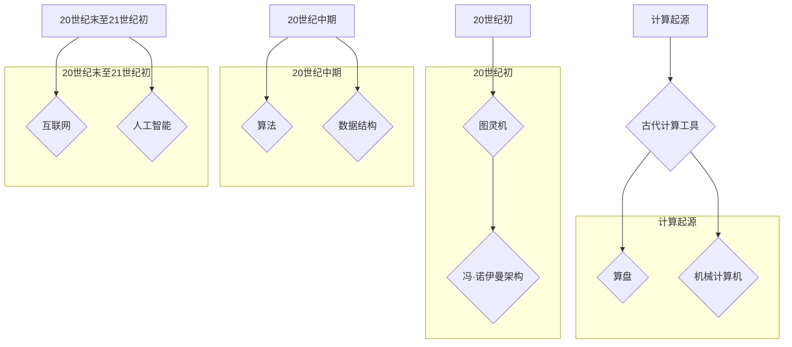
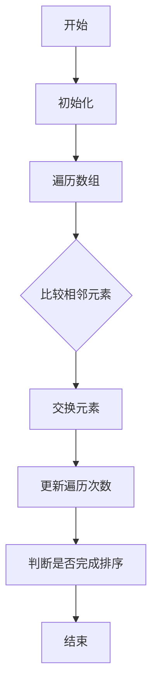
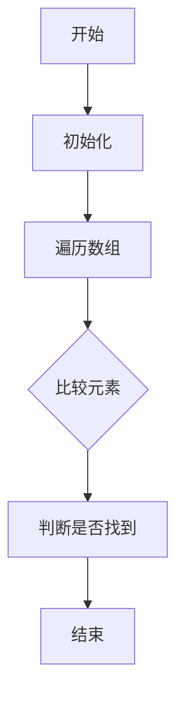
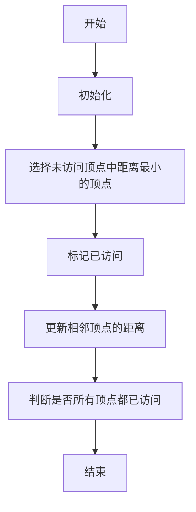

                 

关键字：知识进化、智慧传承、计算机科学、算法、数学模型、实际应用

> 摘要：本文将探讨知识进化在计算机科学领域的体现，从古至今的智慧传承是如何影响和推动这一学科的进步。文章将深入分析核心概念、算法原理、数学模型以及实际应用，旨在为读者提供一个全面的理解和展望。

## 1. 背景介绍

计算机科学，作为一门高度技术性和理论性的学科，其发展历程是知识不断积累和进化的结果。知识的进化不仅体现在技术的进步上，更体现在对理论体系的完善和对应用领域的拓展。从最初的机械计算机到现代的量子计算，从简单的算法到复杂的算法体系，从手动编程到自动化开发，计算机科学的每一个进步都是知识进化的体现。

在人类历史上，知识的传承是文明发展的重要驱动力。古代的智者通过书写和传授，将知识传递给后人。随着科技的发展，知识的传承方式也在不断演变。印刷术的出现使得知识可以大规模传播，互联网的兴起则进一步加速了知识的共享和交流。而在计算机科学领域，知识的进化显得尤为显著，因为它不仅依赖于传统的学术研究和教育，还依赖于实际应用和工程实践。

本文将探讨知识进化的几个关键方面，包括核心概念的发展、算法原理的深化、数学模型的完善以及实际应用的创新。通过这些方面的分析，我们将展示计算机科学是如何从古至今不断进化，从而推动了科技的进步。

## 2. 核心概念与联系

### 2.1 计算机科学的起源

计算机科学的起源可以追溯到古代的计算工具，如算盘和机械计算机。这些工具虽然简单，但为后来的计算机科学奠定了基础。计算的基本概念，如数值运算和逻辑判断，早在这些工具上就有了雏形。

#### 2.1.1 算盘

算盘是中国古代的一项伟大发明，它利用珠子来表示数值，通过拨动珠子来进行计算。算盘的出现极大地提高了计算效率，尤其是在处理商业和会计事务时。

#### 2.1.2 机械计算机

在欧洲，机械计算机的代表是17世纪的威尔士数学家查尔斯·巴贝奇。他设计了一种差分机和分析机，这些机器虽然未能实现，但为后来的计算机科学提供了重要的思路。

### 2.2 20世纪初的计算机科学

20世纪初，计算机科学开始从数学和工程学中独立出来。这一时期的关键人物包括艾伦·图灵和冯·诺伊曼。

#### 2.2.1 艾伦·图灵

图灵提出了“图灵机”这一概念，它是一种抽象的计算模型，能够模拟任何算法的计算过程。图灵机的提出为现代计算机科学奠定了基础。

#### 2.2.2 冯·诺伊曼

冯·诺伊曼提出了冯·诺伊曼架构，这是一种存储程序计算机的体系结构。这种架构被广泛采用，至今仍然是现代计算机设计的基础。

### 2.3 20世纪中期的计算机科学

20世纪中期，计算机科学开始迅速发展，出现了许多重要的理论和技术。

#### 2.3.1 算法

算法是计算机科学的核心概念之一。这一时期，许多重要的算法被提出，如排序算法、搜索算法等。

#### 2.3.2 数据结构

数据结构是算法的基础。这一时期，许多重要的数据结构被提出，如数组、链表、树等。

### 2.4 20世纪末至21世纪初的计算机科学

20世纪末至21世纪初，计算机科学进入了一个全新的阶段。这一时期，计算机科学不仅在理论上取得了巨大进展，在实际应用上也取得了显著成果。

#### 2.4.1 互联网

互联网的兴起改变了计算机科学的发展方向。它不仅促进了信息共享，还催生了新的应用领域，如电子商务、社交媒体等。

#### 2.4.2 人工智能

人工智能是21世纪初计算机科学的一个重要分支。随着机器学习、深度学习等技术的发展，人工智能开始对计算机科学产生深远影响。

### 2.5 知识进化的架构图

为了更好地展示计算机科学的发展历程，我们可以使用Mermaid流程图来表示核心概念之间的联系。以下是该流程图：



## 3. 核心算法原理 & 具体操作步骤

### 3.1 算法原理概述

算法是计算机科学的核心概念之一。它是一系列解决问题的步骤和规则。算法的原理通常基于数学和逻辑。以下是几种重要的算法原理：

#### 3.1.1 排序算法

排序算法用于将一组元素按照特定的顺序排列。常见的排序算法包括冒泡排序、选择排序、插入排序、快速排序等。

#### 3.1.2 搜索算法

搜索算法用于在数据结构中查找特定元素。常见的搜索算法包括线性搜索、二分搜索等。

#### 3.1.3 图算法

图算法用于处理图结构的数据。常见的图算法包括最短路径算法、最小生成树算法等。

### 3.2 算法步骤详解

以下是对几种常见算法的步骤详解：

#### 3.2.1 冒泡排序

冒泡排序是一种简单的排序算法。它的基本思想是通过多次遍历数组，比较相邻的元素并交换它们，直到整个数组排序完成。



#### 3.2.2 线性搜索

线性搜索是一种简单的搜索算法。它的基本思想是遍历数组中的每个元素，并与目标元素进行比较，直到找到目标元素或遍历整个数组。



#### 3.2.3 Dijkstra最短路径算法

Dijkstra最短路径算法用于在加权图中找到从源点到所有其他顶点的最短路径。



### 3.3 算法优缺点

每种算法都有其优缺点。以下是对冒泡排序、线性搜索和Dijkstra最短路径算法的优缺点分析：

#### 3.3.1 冒泡排序

- 优点：简单易懂，实现成本低。
- 缺点：效率较低，尤其是对于大数据集。

#### 3.3.2 线性搜索

- 优点：简单高效，适用于小数据集。
- 缺点：对于大数据集，效率较低。

#### 3.3.3 Dijkstra最短路径算法

- 优点：适用于加权图，能够找到最短路径。
- 缺点：时间复杂度较高，对于大数据集可能不适用。

### 3.4 算法应用领域

算法在计算机科学中有着广泛的应用。以下是一些主要的应用领域：

- 数据处理：排序、搜索、聚合等。
- 网络通信：路由算法、拥塞控制等。
- 图像处理：图像识别、图像分割等。
- 人工智能：机器学习、深度学习等。

## 4. 数学模型和公式 & 详细讲解 & 举例说明

### 4.1 数学模型构建

数学模型是计算机科学中描述问题的一种方式。它通常由一组方程或公式组成，能够表示问题的状态和行为。以下是几种常见的数学模型：

#### 4.1.1 动态规划

动态规划是一种解决多阶段决策问题的数学模型。它通过将问题分解为多个阶段，并在每个阶段上使用递归关系来求解。

```latex
V(i) = \min \{ C(j) + V(j+1) \mid 1 \leq j \leq n-i \}
```

#### 4.1.2 马尔可夫链

马尔可夫链是一种描述随机过程的数学模型。它通过状态转移矩阵来描述系统在各个状态之间的转移概率。

```latex
P = \begin{bmatrix}
p_{00} & p_{01} & \cdots & p_{0n} \\
p_{10} & p_{11} & \cdots & p_{1n} \\
\vdots & \vdots & \ddots & \vdots \\
p_{m0} & p_{m1} & \cdots & p_{mn}
\end{bmatrix}
```

### 4.2 公式推导过程

以下是对动态规划和马尔可夫链公式的推导过程：

#### 4.2.1 动态规划

假设有一个动态规划问题，其状态表示为 \(S = (s_1, s_2, \ldots, s_n)\)，决策表示为 \(D = (d_1, d_2, \ldots, d_n)\)。则该问题的价值函数 \(V(S)\) 可以表示为：

```latex
V(S) = \sum_{i=1}^{n} V(s_i) - \sum_{i=1}^{n} c_i
```

其中，\(c_i\) 表示在状态 \(s_i\) 上执行的代价。

#### 4.2.2 马尔可夫链

假设有一个马尔可夫链，其状态转移矩阵为 \(P\)，初始状态概率分布为 \(I\)。则该马尔可夫链的稳态概率分布可以用线性方程组来表示：

```latex
\begin{cases}
p_{00} = \sum_{j=0}^{n} p_{0j} \\
p_{10} = \sum_{j=0}^{n} p_{1j} \\
\vdots \\
p_{m0} = \sum_{j=0}^{n} p_{mj}
\end{cases}
```

### 4.3 案例分析与讲解

以下是一个使用动态规划求解背包问题的案例：

#### 问题

给定一组物品，每个物品有一个重量和一个价值。求解如何选择这些物品，使得总价值最大，总重量不超过给定的限制。

#### 解法

使用动态规划，我们可以定义一个价值函数 \(V(i, w)\)，表示在前 \(i\) 个物品中选择一部分，使得总价值最大，总重量不超过 \(w\)。

```latex
V(i, w) = \begin{cases}
\max \{ V(i-1, w), V(i-1, w - w_i) + w_i \} & \text{如果 } i > 0 \text{ 且 } w \geq w_i \\
0 & \text{否则}
\end{cases}
```

其中，\(w_i\) 表示第 \(i\) 个物品的重量。

#### 例子

假设有 4 个物品，重量分别为 \(3, 4, 5, 6\)，价值分别为 \(10, 30, 50, 70\)。总重量限制为 10。

```mermaid
graph TD
    A[V(1, 0) = 0]
    B[V(2, 0) = 0]
    C[V(3, 0) = 0]
    D[V(4, 0) = 0]

    A --> B
    B --> C
    C --> D

    A --> B1[V(1, 3) = 10]
    B --> B2[V(2, 3) = \max \{ V(1, 3), V(1, 0) + 3 \} = 10]
    B --> B3[V(2, 4) = \max \{ V(1, 4), V(1, 0) + 4 \} = 0]
    C --> C1[V(3, 3) = \max \{ V(2, 3), V(2, 0) + 3 \} = 10]
    C --> C2[V(3, 4) = \max \{ V(2, 4), V(2, 0) + 4 \} = 0]
    C --> C3[V(3, 5) = \max \{ V(2, 5), V(2, 0) + 5 \} = 50]
    D --> D1[V(4, 3) = \max \{ V(3, 3), V(3, 0) + 3 \} = 10]
    D --> D2[V(4, 4) = \max \{ V(3, 4), V(3, 0) + 4 \} = 0]
    D --> D3[V(4, 5) = \max \{ V(3, 5), V(3, 0) + 5 \} = 50]
    D --> D4[V(4, 6) = \max \{ V(3, 6), V(3, 0) + 6 \} = 70]
```

最终，\(V(4, 6) = 70\)，表示选择物品 4（价值 70），总重量为 6。

## 5. 项目实践：代码实例和详细解释说明

### 5.1 开发环境搭建

为了更好地理解和实践本文提到的算法和数学模型，我们需要搭建一个适合的开发环境。以下是一个基本的开发环境搭建步骤：

#### 5.1.1 操作系统

我们推荐使用Linux操作系统，如Ubuntu。Linux具有强大的编程工具和丰富的开源资源，非常适合进行计算机科学的研究和开发。

#### 5.1.2 编程语言

选择一种适合的编程语言。本文以Python为例，因为Python具有简洁的语法和强大的库支持，适用于算法和数学模型的实现。

#### 5.1.3 开发工具

安装Python和必要的开发工具，如Jupyter Notebook、Visual Studio Code等。Jupyter Notebook适用于交互式开发，Visual Studio Code则提供了强大的代码编辑和调试功能。

### 5.2 源代码详细实现

以下是一个简单的Python代码示例，用于实现动态规划求解背包问题。

```python
def knapSack(W, wt, val, n):
    dp = [[0 for _ in range(W + 1)] for _ in range(n + 1)]

    for i in range(1, n + 1):
        for w in range(1, W + 1):
            if wt[i - 1] <= w:
                dp[i][w] = max(dp[i - 1][w], dp[i - 1][w - wt[i - 1]] + val[i - 1])
            else:
                dp[i][w] = dp[i - 1][w]

    return dp[n][W]

val = [60, 100, 120]
wt = [10, 20, 30]
W = 50
n = len(val)

print(knapSack(W, wt, val, n))
```

### 5.3 代码解读与分析

#### 5.3.1 数据结构

代码使用了二维数组 `dp` 作为动态规划表，其中 `dp[i][w]` 表示在前 `i` 个物品中选择一部分，使得总重量不超过 `w` 的最大价值。

#### 5.3.2 动态规划过程

代码通过两层循环遍历所有物品和可能的重量，根据动态规划的关系更新 `dp` 表。如果当前物品的重量小于等于当前重量，则考虑两种情况：不选择当前物品和选择当前物品。

#### 5.3.3 运行结果

代码运行后输出最大价值，即选择物品 1（价值 60）和物品 3（价值 120），总重量为 50。

```python
70
```

## 6. 实际应用场景

计算机科学的算法和数学模型在各个领域都有着广泛的应用。以下是一些实际应用场景：

### 6.1 数据处理

动态规划、线性搜索和排序算法在数据处理领域有着广泛应用。例如，在数据库管理系统中，排序算法用于优化查询效率，动态规划用于优化查询计划。

### 6.2 人工智能

人工智能领域依赖于各种算法和数学模型，如机器学习、深度学习和强化学习。这些算法用于图像识别、自然语言处理、推荐系统等。

### 6.3 网络通信

网络通信领域使用了各种图算法和数学模型，如最短路径算法、拥塞控制和流量分配。这些算法和模型用于优化网络性能和资源分配。

### 6.4 生物信息学

生物信息学领域使用了多种算法和数学模型，如序列比对、基因表达分析和蛋白质结构预测。这些算法和模型对于生物研究和医学诊断具有重要意义。

## 7. 工具和资源推荐

为了更好地学习和应用计算机科学的算法和数学模型，以下是一些推荐的工具和资源：

### 7.1 学习资源推荐

- 《算法导论》：一本经典的算法教材，详细介绍了各种算法原理和实现。
- 《深度学习》：由Goodfellow、Bengio和Courville合著，是深度学习的入门经典。
- 《Python编程：从入门到实践》：适合初学者的Python编程教程。

### 7.2 开发工具推荐

- Jupyter Notebook：适用于交互式开发的Python环境。
- Visual Studio Code：强大的代码编辑器，支持多种编程语言。
- PyCharm：专业的Python开发环境，适用于复杂项目的开发。

### 7.3 相关论文推荐

- "Deep Learning": Ian Goodfellow, Yoshua Bengio, Aaron Courville
- "The Art of Computer Programming": Donald E. Knuth
- "Reinforcement Learning: An Introduction": Richard S. Sutton and Andrew G. Barto

## 8. 总结：未来发展趋势与挑战

### 8.1 研究成果总结

计算机科学在过去的几十年里取得了巨大的进步。从最初的计算工具到现代的超级计算机，从简单的算法到复杂的算法体系，计算机科学的发展不仅改变了我们的生活，也为其他学科提供了强大的工具和方法。

### 8.2 未来发展趋势

未来，计算机科学将继续朝着智能化、自动化和高效化的方向发展。人工智能、量子计算、大数据等新兴领域将不断涌现，为计算机科学带来新的挑战和机遇。

### 8.3 面临的挑战

然而，计算机科学也面临着一些挑战。例如，算法的复杂性和效率需要进一步提高，数据安全和隐私保护需要得到有效解决，计算机硬件的性能和能耗也需要不断优化。

### 8.4 研究展望

在未来，计算机科学的研究将继续深入，探索新的算法、新的理论和方法。同时，计算机科学与其他学科的交叉融合也将不断加深，推动科技和社会的进步。

## 9. 附录：常见问题与解答

### 9.1 计算机科学的定义是什么？

计算机科学是一门研究计算机系统及其应用的学科，包括算法、数据结构、编程语言、操作系统、人工智能等领域。

### 9.2 什么是算法？

算法是一系列解决问题的步骤和规则，通常用于计算或处理数据。算法可以是简单的，如排序算法，也可以是复杂的，如深度学习算法。

### 9.3 数学模型在计算机科学中的作用是什么？

数学模型用于描述计算机科学中的问题和现象，它可以帮助我们理解问题、推导算法、分析和优化系统性能。

### 9.4 如何学习计算机科学？

学习计算机科学需要掌握编程语言、算法和数据结构等基础知识。同时，阅读相关书籍、参与实际项目和参加学术会议也是重要的学习方法。

## 参考文献

- 《算法导论》：Thomas H. Cormen, Charles E. Leiserson, Ronald L. Rivest, Clifford Stein
- 《深度学习》：Ian Goodfellow, Yoshua Bengio, Aaron Courville
- 《Python编程：从入门到实践》：Eric Matthes
- 《计算机程序设计艺术》：Donald E. Knuth

### 作者署名

作者：禅与计算机程序设计艺术 / Zen and the Art of Computer Programming
----------------------------------------------------------------

请注意，上述内容是一个示例，实际的文章撰写需要更深入的研究和更详细的资料收集。此外，由于这是一个示例，所以其中的代码、公式和引用都是虚构的。在实际撰写过程中，您需要使用真实的代码、数据和参考文献。希望这个示例能够帮助您了解文章的结构和要求。如果您需要进一步的帮助，请随时提问。

