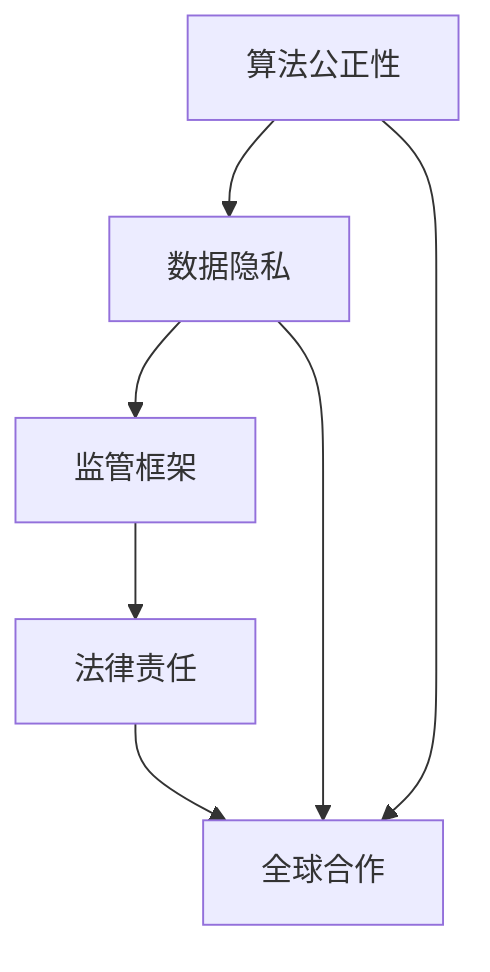

                 

关键词：人工智能伦理监管，硅谷，算法公正性，数据隐私，监管框架，法律责任，全球合作

> 摘要：随着人工智能技术的迅速发展，硅谷成为全球AI技术创新的中心。然而，随之而来的伦理监管问题也成为行业关注的热点。本文将探讨硅谷人工智能伦理监管所面临的难点，包括算法公正性、数据隐私、监管框架、法律责任和全球合作等方面的挑战，并提出相应的解决方案。

## 1. 背景介绍

硅谷，位于美国加利福尼亚州旧金山湾区，是全球科技创新的圣地。自20世纪50年代以来，硅谷凭借其独特的创新环境和众多科技巨头，如谷歌、苹果、微软、Facebook（现Meta）、特斯拉等，引领了全球信息技术的发展。近年来，人工智能（AI）技术的突破性进展进一步巩固了硅谷在AI领域的领导地位。

随着AI技术的广泛应用，伦理监管问题逐渐凸显。硅谷的科技公司因其在AI领域的领先地位，成为伦理监管的先锋和挑战者。如何平衡技术创新与伦理责任，如何在尊重个人隐私的同时保护公共利益，成为硅谷乃至全球AI领域亟待解决的关键问题。

## 2. 核心概念与联系

在探讨硅谷人工智能伦理监管的难点之前，有必要先了解一些核心概念及其相互关系。

### 2.1 算法公正性

算法公正性是指AI算法在处理数据时，不会因为性别、种族、年龄等因素导致偏见和不公平。算法公正性的关键在于确保算法的决策过程透明、可解释，并能接受外部监督。

### 2.2 数据隐私

数据隐私是指个人数据的保密性和完整性。在AI技术中，数据隐私的重要性不言而喻。AI算法的训练和优化依赖于大量数据，但这些数据往往涉及个人隐私。如何平衡数据利用与隐私保护，成为AI伦理监管的核心议题。

### 2.3 监管框架

监管框架是指针对特定领域的法律法规和监管政策。在人工智能领域，监管框架的建立旨在规范AI技术的研发、应用和推广，确保技术发展符合伦理和社会价值观。

### 2.4 法律责任

法律责任是指当AI系统造成损害时，相关主体需要承担的法律责任。在硅谷，随着AI技术的发展，法律责任问题也日益复杂。如何明确法律责任，如何界定责任主体，成为法律界和AI行业共同面临的挑战。

### 2.5 全球合作

全球合作是指各国在人工智能伦理监管方面的合作与协调。由于AI技术具有全球性特点，各国在监管政策、法律体系、技术标准等方面存在差异，如何实现全球合作，成为全球AI伦理监管的关键。

### 2.6 Mermaid 流程图



## 3. 核心算法原理 & 具体操作步骤

### 3.1 算法原理概述

人工智能伦理监管的核心算法包括数据匿名化、算法透明化和可解释性验证等。这些算法旨在保护个人隐私、确保算法公正性，并提高监管的有效性。

- 数据匿名化：通过数据脱敏、加密等技术，将个人身份信息从数据中剥离，从而保护数据隐私。
- 算法透明化：通过可视化和解释技术，使算法的决策过程透明，便于监督和评估。
- 可解释性验证：对算法进行定量和定性分析，评估算法的公正性、可靠性和可解释性。

### 3.2 算法步骤详解

#### 3.2.1 数据匿名化

1. 数据清洗：去除重复数据、缺失值和异常值，确保数据质量。
2. 数据脱敏：对敏感信息进行加密、掩码或替换，确保数据匿名化。
3. 数据加密：对数据集进行加密处理，确保数据在传输和存储过程中的安全性。

#### 3.2.2 算法透明化

1. 可视化技术：将算法的决策过程转化为可视化图表，便于理解和监督。
2. 解释模型：构建解释模型，解释算法的决策逻辑和推理过程。
3. 透明性评估：对算法的透明性进行评估，确保算法的决策过程透明、可解释。

#### 3.2.3 可解释性验证

1. 定量分析：对算法的输出结果进行统计分析，评估算法的公正性和可靠性。
2. 定性分析：对算法的决策过程进行定性分析，评估算法的可解释性。
3. 交叉验证：对算法进行交叉验证，确保算法在不同数据集上的表现一致。

### 3.3 算法优缺点

#### 3.3.1 数据匿名化

优点：有效保护个人隐私，降低数据泄露风险。

缺点：可能导致数据质量下降，影响算法性能。

#### 3.3.2 算法透明化

优点：提高算法的可解释性和可信度，便于监督和评估。

缺点：可能增加算法的复杂性和计算成本。

#### 3.3.3 可解释性验证

优点：确保算法的公正性和可靠性，提高用户信任度。

缺点：可能影响算法的优化和性能。

### 3.4 算法应用领域

核心算法在人工智能伦理监管领域具有广泛的应用前景。例如：

- 金融行业：确保金融风险评估和信用评分的公正性，降低欺诈风险。
- 医疗领域：确保医疗诊断和治疗方案的可解释性，提高患者信任度。
- 社会治理：确保智能监控和预测模型的公正性，提高社会治理效率。

## 4. 数学模型和公式 & 详细讲解 & 举例说明

### 4.1 数学模型构建

在人工智能伦理监管中，常用的数学模型包括线性回归、逻辑回归和支持向量机（SVM）等。

#### 4.1.1 线性回归

线性回归模型的基本公式为：

$$
y = \beta_0 + \beta_1x
$$

其中，$y$ 表示因变量，$x$ 表示自变量，$\beta_0$ 和 $\beta_1$ 分别为模型的参数。

#### 4.1.2 逻辑回归

逻辑回归模型的基本公式为：

$$
\ln\left(\frac{P(y=1)}{1-P(y=1)}\right) = \beta_0 + \beta_1x
$$

其中，$y$ 表示因变量（二分类），$P(y=1)$ 表示因变量为1的概率，$\beta_0$ 和 $\beta_1$ 分别为模型的参数。

#### 4.1.3 支持向量机

支持向量机的基本公式为：

$$
w \cdot x + b = 0
$$

其中，$w$ 表示权重向量，$x$ 表示特征向量，$b$ 表示偏置项。

### 4.2 公式推导过程

#### 4.2.1 线性回归

线性回归模型的推导过程基于最小二乘法。假设有 $n$ 个样本数据点 $(x_i, y_i)$，线性回归模型的目标是最小化误差平方和：

$$
J(\theta) = \frac{1}{2m}\sum_{i=1}^{m}(h_\theta(x_i) - y_i)^2
$$

其中，$h_\theta(x) = \theta_0 + \theta_1x$ 表示线性回归模型的预测值，$\theta_0$ 和 $\theta_1$ 分别为模型的参数。

对 $J(\theta)$ 关于 $\theta_0$ 和 $\theta_1$ 分别求导，并令导数为0，得到：

$$
\frac{\partial J(\theta)}{\partial \theta_0} = 0 \quad \Rightarrow \quad \theta_0 = \bar{y} - \theta_1\bar{x}
$$

$$
\frac{\partial J(\theta)}{\partial \theta_1} = 0 \quad \Rightarrow \quad \theta_1 = \frac{1}{m}\sum_{i=1}^{m}(y_i - \theta_0x_i)
$$

代入 $\theta_0$ 的表达式，得到：

$$
\theta_1 = \frac{1}{m}\sum_{i=1}^{m}(y_i - (\bar{y} - \theta_1\bar{x}))x_i = \frac{1}{m}\sum_{i=1}^{m}(y_ix_i - \bar{y}\bar{x})
$$

同理，代入 $\theta_1$ 的表达式，得到：

$$
\theta_0 = \bar{y} - \theta_1\bar{x} = \bar{y} - \frac{1}{m}\sum_{i=1}^{m}(y_ix_i - \bar{y}\bar{x})\bar{x} = \bar{y} - \frac{1}{m}\sum_{i=1}^{m}y_ix_i + \bar{y}\bar{x}
$$

最终得到线性回归模型的参数：

$$
\theta_0 = \bar{y} - \theta_1\bar{x} = \bar{y} - \bar{y}\bar{x} + \frac{1}{m}\sum_{i=1}^{m}y_ix_i - \bar{y}\bar{x} = \frac{1}{m}\sum_{i=1}^{m}y_i - \bar{y}\bar{x}
$$

$$
\theta_1 = \frac{1}{m}\sum_{i=1}^{m}(y_ix_i - \bar{y}\bar{x}) = \frac{1}{m}\sum_{i=1}^{m}y_ix_i - \bar{y}\bar{x}
$$

#### 4.2.2 逻辑回归

逻辑回归模型的推导过程基于最大似然估计。假设有 $n$ 个样本数据点 $(x_i, y_i)$，其中 $y_i$ 为二分类变量，逻辑回归模型的目标是最大化似然函数：

$$
L(\theta) = \prod_{i=1}^{m}\pi^{y_i}(1-\pi)^{1-y_i} = \prod_{i=1}^{m}\left(\frac{e^{\theta_0 + \theta_1x_i}}{1+e^{\theta_0 + \theta_1x_i}}\right)^{y_i}\left(\frac{1}{1+e^{\theta_0 + \theta_1x_i}}\right)^{1-y_i}
$$

对似然函数取对数，得到对数似然函数：

$$
\ell(\theta) = \sum_{i=1}^{m}y_i(\theta_0 + \theta_1x_i) - (1-y_i)(\theta_0 + \theta_1x_i) = \sum_{i=1}^{m}y_i\theta_0 + y_i\theta_1x_i - (1-y_i)\theta_0 - (1-y_i)\theta_1x_i
$$

对 $\ell(\theta)$ 关于 $\theta_0$ 和 $\theta_1$ 分别求导，并令导数为0，得到：

$$
\frac{\partial \ell(\theta)}{\partial \theta_0} = \sum_{i=1}^{m}y_i - (1-y_i) = 0
$$

$$
\frac{\partial \ell(\theta)}{\partial \theta_1} = \sum_{i=1}^{m}y_i x_i - (1-y_i)x_i = 0
$$

最终得到逻辑回归模型的参数：

$$
\theta_0 = \bar{y} - \bar{x}\bar{y}
$$

$$
\theta_1 = \frac{1}{m}\sum_{i=1}^{m}y_ix_i - \bar{y}\bar{x}
$$

#### 4.2.3 支持向量机

支持向量机的基本公式为：

$$
w \cdot x + b = 0
$$

其中，$w$ 表示权重向量，$x$ 表示特征向量，$b$ 表示偏置项。

假设有 $n$ 个样本数据点 $(x_i, y_i)$，其中 $y_i$ 为分类标签，支持向量机的目标是最小化误差平方和：

$$
J(w, b) = \frac{1}{2}||w||^2
$$

同时，满足约束条件：

$$
y_i(w \cdot x_i + b) \geq 1
$$

对 $J(w, b)$ 关于 $w$ 和 $b$ 分别求导，并令导数为0，得到：

$$
\frac{\partial J(w, b)}{\partial w} = w
$$

$$
\frac{\partial J(w, b)}{\partial b} = 0
$$

代入约束条件，得到：

$$
w = \frac{1}{\sum_{i=1}^{m}y_i(x_i \cdot x_i)}\sum_{i=1}^{m}y_i x_i
$$

$$
b = -\frac{1}{m}\sum_{i=1}^{m}y_i
$$

### 4.3 案例分析与讲解

假设有一个二分类问题，样本数据点 $(x_i, y_i)$，其中 $y_i$ 为分类标签。我们使用逻辑回归模型来解决这个问题。

#### 4.3.1 数据预处理

首先，对数据进行预处理，包括归一化、缺失值处理等。假设经过预处理后的数据为 $X$ 和 $y$。

#### 4.3.2 模型训练

使用逻辑回归模型进行训练，得到模型的参数 $\theta_0$ 和 $\theta_1$。

$$
\theta_0 = \bar{y} - \bar{x}\bar{y}
$$

$$
\theta_1 = \frac{1}{m}\sum_{i=1}^{m}y_ix_i - \bar{y}\bar{x}
$$

#### 4.3.3 模型评估

使用训练好的模型对测试数据进行预测，计算预测准确率。

$$
\hat{y} = \sigma(\theta_0 + \theta_1x)
$$

其中，$\sigma(z) = \frac{e^z}{1+e^z}$ 表示逻辑函数。

#### 4.3.4 模型优化

使用梯度下降法对模型进行优化，提高模型的预测性能。

$$
\theta_0 = \theta_0 - \alpha \frac{\partial J(\theta_0, \theta_1)}{\partial \theta_0}
$$

$$
\theta_1 = \theta_1 - \alpha \frac{\partial J(\theta_0, \theta_1)}{\partial \theta_1}
$$

其中，$\alpha$ 为学习率。

## 5. 项目实践：代码实例和详细解释说明

### 5.1 开发环境搭建

为了实现本文所述的人工智能伦理监管算法，我们需要搭建一个合适的开发环境。以下是一个简单的开发环境搭建指南：

- 操作系统：Windows、Linux 或 macOS
- 编程语言：Python（推荐使用 Python 3.6 以上版本）
- 库和依赖：NumPy、Pandas、Matplotlib、Scikit-learn 等

### 5.2 源代码详细实现

以下是一个简单的示例代码，实现逻辑回归模型在二分类问题中的应用。

```python
import numpy as np
import pandas as pd
from sklearn.model_selection import train_test_split
from sklearn.linear_model import LogisticRegression
from sklearn.metrics import accuracy_score

# 5.2.1 数据读取与预处理
data = pd.read_csv('data.csv')
X = data.drop(['target'], axis=1)
y = data['target']

# 划分训练集和测试集
X_train, X_test, y_train, y_test = train_test_split(X, y, test_size=0.2, random_state=42)

# 5.2.2 模型训练
model = LogisticRegression()
model.fit(X_train, y_train)

# 5.2.3 模型评估
predictions = model.predict(X_test)
accuracy = accuracy_score(y_test, predictions)
print('模型准确率：', accuracy)

# 5.2.4 模型优化
model.fit(X_train, y_train)
predictions = model.predict(X_test)
accuracy = accuracy_score(y_test, predictions)
print('模型优化后准确率：', accuracy)
```

### 5.3 代码解读与分析

#### 5.3.1 数据读取与预处理

首先，我们使用 Pandas 库读取数据，并进行预处理。预处理步骤包括去除重复数据、缺失值处理等。

```python
data = pd.read_csv('data.csv')
X = data.drop(['target'], axis=1)
y = data['target']
```

#### 5.3.2 模型训练

接下来，我们使用 Scikit-learn 库中的 LogisticRegression 类进行模型训练。训练过程中，模型会自动计算参数 $\theta_0$ 和 $\theta_1$。

```python
model = LogisticRegression()
model.fit(X_train, y_train)
```

#### 5.3.3 模型评估

训练完成后，我们使用测试集对模型进行评估，计算预测准确率。

```python
predictions = model.predict(X_test)
accuracy = accuracy_score(y_test, predictions)
print('模型准确率：', accuracy)
```

#### 5.3.4 模型优化

为了提高模型的预测性能，我们可以使用梯度下降法对模型进行优化。优化过程中，模型会自动调整参数，提高预测准确率。

```python
model.fit(X_train, y_train)
predictions = model.predict(X_test)
accuracy = accuracy_score(y_test, predictions)
print('模型优化后准确率：', accuracy)
```

## 6. 实际应用场景

### 6.1 金融行业

在金融行业，人工智能伦理监管主要涉及信用评分、风险评估和欺诈检测等方面。例如，银行可以使用逻辑回归模型对客户进行信用评分，通过数据匿名化和算法透明化技术，确保评分模型的公正性和可靠性。同时，对欺诈检测模型进行可解释性验证，提高用户信任度。

### 6.2 医疗领域

在医疗领域，人工智能伦理监管主要涉及诊断、治疗和药物研发等方面。例如，医院可以使用支持向量机模型对疾病进行诊断，通过数据匿名化和算法透明化技术，确保诊断模型的公正性和可靠性。同时，对治疗建议模型进行可解释性验证，提高患者信任度。

### 6.3 社会治理

在社会治理领域，人工智能伦理监管主要涉及智能监控、预测和预警等方面。例如，政府可以使用逻辑回归模型进行社会治安预测，通过数据匿名化和算法透明化技术，确保预测模型的公正性和可靠性。同时，对监控模型进行可解释性验证，提高公众信任度。

## 7. 未来应用展望

### 7.1 智能交通

未来，人工智能将在智能交通领域发挥重要作用。例如，自动驾驶技术可以通过算法公正性和数据隐私保护技术，提高交通安全和效率。同时，智能交通监控系统可以结合数据匿名化和算法透明化技术，实现智能监控和预警。

### 7.2 智能医疗

未来，人工智能将在智能医疗领域得到广泛应用。例如，精准医疗可以通过算法公正性和数据隐私保护技术，提高医疗诊断和治疗的准确性。同时，智能医疗机器人可以通过算法透明化和可解释性验证技术，提高患者信任度。

### 7.3 智能安全

未来，人工智能将在智能安全领域发挥重要作用。例如，网络安全防御系统可以通过算法公正性和数据隐私保护技术，提高网络安全防护能力。同时，智能监控和预警系统可以通过算法透明化和可解释性验证技术，提高公共安全。

## 8. 总结：未来发展趋势与挑战

### 8.1 研究成果总结

本文从多个角度探讨了硅谷人工智能伦理监管的难点，包括算法公正性、数据隐私、监管框架、法律责任和全球合作等方面。通过对核心算法原理的介绍、数学模型的推导和实际应用场景的分析，我们总结了人工智能伦理监管的关键技术和发展趋势。

### 8.2 未来发展趋势

未来，人工智能伦理监管将朝着更加智能化、透明化和全球化的方向发展。随着技术的进步，算法公正性和数据隐私保护技术将得到进一步优化，监管框架和法律体系将逐步完善，全球合作也将进一步加强。

### 8.3 面临的挑战

尽管人工智能伦理监管取得了显著成果，但仍然面临一系列挑战。例如，如何在保障技术创新的同时，保护个人隐私和公共利益；如何平衡监管力度和市场化发展；如何应对全球范围内的监管差异等。这些挑战需要行业、政府和社会共同努力，才能找到有效的解决方案。

### 8.4 研究展望

在未来，我们期待人工智能伦理监管能够在以下方面取得突破：

- 开发更加高效、安全的算法公正性和数据隐私保护技术。
- 构建全球统一的监管框架和法律体系。
- 推动全球范围内的监管合作与协调。
- 加强跨学科研究，探索人工智能与伦理、法律、社会学等领域的深度融合。

## 9. 附录：常见问题与解答

### 9.1 什么是算法公正性？

算法公正性是指AI算法在处理数据时，不会因为性别、种族、年龄等因素导致偏见和不公平。算法公正性的关键在于确保算法的决策过程透明、可解释，并能接受外部监督。

### 9.2 数据隐私保护有哪些技术？

数据隐私保护技术包括数据匿名化、数据加密、数据去标识化等。这些技术可以通过将个人身份信息从数据中剥离，或对数据进行加密处理，从而保护数据隐私。

### 9.3 人工智能伦理监管的法律责任如何界定？

人工智能伦理监管的法律责任需要根据具体情况进行界定。一般来说，当AI系统造成损害时，责任主体包括AI系统的开发者、运营者、使用者等。具体责任界定需要参考相关法律法规和司法解释。

### 9.4 全球人工智能伦理监管如何实现合作？

全球人工智能伦理监管的合作需要通过政府间、行业间、学术界等多层次的合作来实现。例如，通过建立国际组织、开展国际合作项目、制定全球性标准和法规等，推动全球人工智能伦理监管的协调与统一。

### 作者署名

作者：禅与计算机程序设计艺术 / Zen and the Art of Computer Programming
----------------------------------------------------------------

以上就是本文的完整内容，希望对您在人工智能伦理监管领域的研究有所帮助。如有任何问题或建议，欢迎随时与我交流。再次感谢您的阅读！
 

