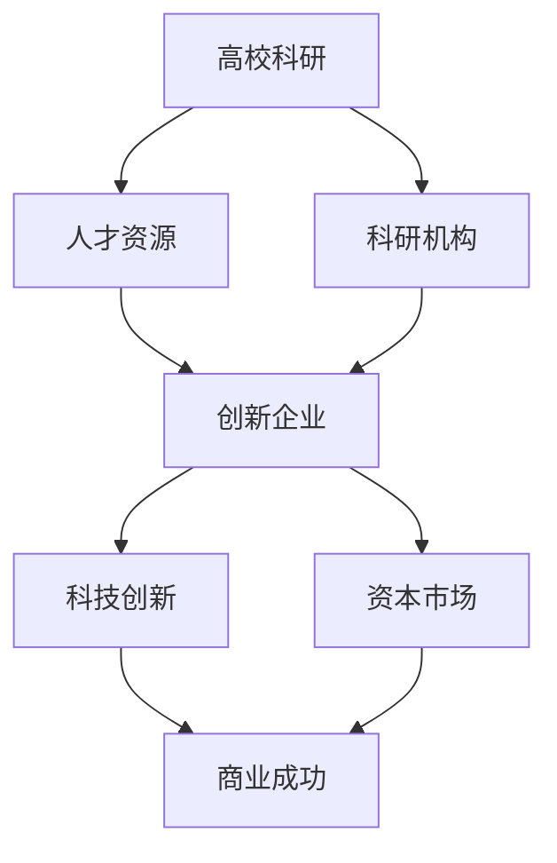

                 

关键词：硅谷创业文化，独角兽公司，技术发展，创新生态，企业家精神，创业策略。

摘要：本文旨在探讨硅谷创业文化的形成、独角兽公司的崛起以及这一文化对全球技术发展的影响。通过对硅谷创业生态的深入分析，本文揭示了车库到独角兽的演变过程，探讨了企业家精神的内涵及其对技术创新的推动作用，并展望了未来创业发展的趋势与挑战。

## 1. 背景介绍

硅谷，一个位于美国加利福尼亚州旧金山湾区南部的地区，是全球科技创新和创业的象征。从20世纪中叶开始，硅谷逐渐发展成为世界科技产业的中心，涌现出一大批引领全球的科技公司，如苹果、谷歌、微软、亚马逊等。这些公司的成功不仅改变了人们的生活，也深刻影响了全球经济的发展。

硅谷的创业文化以其开放、包容、创新和冒险精神而著称。这种文化孕育了无数成功的创业公司，推动了全球科技的发展。本文将从硅谷创业文化的形成、独角兽公司的崛起以及其对全球技术发展的启示三个方面进行探讨。

### 1.1 硅谷创业文化的起源

硅谷的创业文化可以追溯到20世纪中叶。当时，硅谷还是一个以农业为主的地区。随着斯坦福大学等高等学府的建立，以及惠普、英特尔等科技公司的兴起，硅谷逐渐成为科技人才和创业者的聚集地。

硅谷创业文化的形成与几个关键因素密切相关。首先，斯坦福大学等高等学府为硅谷提供了丰富的人才资源。这些学府的毕业生和教授们，凭借着其专业知识和技术能力，成为硅谷创业的中坚力量。其次，硅谷的创业环境极具包容性。这里没有过多的行政干预和官僚作风，创业者可以自由地探索创新，追求自己的梦想。最后，硅谷的创业精神充满了冒险和挑战。创业者们敢于冒险，敢于尝试，勇于面对失败，这种精神成为硅谷创业文化的核心。

### 1.2 硅谷创业文化的发展

随着硅谷创业文化的不断发展和壮大，它的影响也逐渐扩散到全球。许多创业者开始效仿硅谷的模式，努力在各自的领域中创新和突破。硅谷创业文化不仅为创业者提供了丰富的资源和支持，还塑造了一种独特的创业心态。

这种心态包括以下几个方面：一是对创新的极致追求。硅谷的创业者认为，只有不断创新，才能在激烈的市场竞争中立于不败之地。因此，他们不断探索新技术、新产品和新市场，以保持领先地位。二是对失败的包容。在硅谷，失败被视为成功的一部分。创业者们从失败中吸取教训，不断完善自己的产品和商业模式。三是对风险的勇于承担。硅谷的创业者深知，创新必然伴随着风险。因此，他们敢于冒险，敢于尝试，勇于承担风险。

## 2. 核心概念与联系

### 2.1 硅谷创业文化的核心概念

硅谷创业文化的核心概念包括创新、包容、冒险和合作。这些概念相互关联，共同构成了硅谷创业文化的独特魅力。

- **创新**：硅谷的创业者们始终追求创新，他们不断探索新技术、新产品和新市场，以保持领先地位。
- **包容**：硅谷对创新和创业者持有开放的态度，无论是技术突破还是商业模式的创新，都得到了充分的包容和支持。
- **冒险**：硅谷的创业者们勇于冒险，他们敢于面对失败，从失败中汲取教训，不断完善自己的产品和服务。
- **合作**：硅谷的创业者们注重合作，他们通过共享资源、知识和经验，共同推动科技创新和创业发展。

### 2.2 硅谷创业文化的架构

硅谷创业文化的架构可以概括为“四位一体”，即高校、科研机构、科技企业和资本市场的互动与融合。

- **高校**：斯坦福大学、加州大学伯克利分校等高等学府，为硅谷提供了丰富的人才资源和技术支持。
- **科研机构**：诸如美国国家实验室等科研机构，为硅谷的科技创新提供了强大的科研支撑。
- **科技企业**：谷歌、苹果、微软等科技巨头，以及无数中小型创新企业，构成了硅谷的科技创新主体。
- **资本市场**：风险投资、天使投资等资本市场，为硅谷的创业企业提供了充足的资金支持。

### 2.3 硅谷创业文化的Mermaid流程图



## 3. 核心算法原理 & 具体操作步骤

### 3.1 算法原理概述

硅谷创业文化的核心算法原理可以概括为“创新驱动，市场导向，人才为本”。这一算法强调通过创新推动科技发展，以市场需求为导向，以人才为核心资源，实现企业的持续发展和商业成功。

### 3.2 算法步骤详解

#### 步骤1：创新驱动

硅谷的创业者们始终将创新视为企业发展的动力源泉。他们不断探索新技术、新产品和新市场，以保持竞争优势。

- **技术突破**：创业者们通过研发新技术，实现产品的技术优势。
- **商业模式创新**：创业者们通过创新商业模式，实现商业模式的差异化。

#### 步骤2：市场导向

硅谷的创业者们注重市场需求，以市场需求为导向，不断调整产品和服务，以适应市场的变化。

- **市场调研**：通过市场调研，了解市场需求和趋势。
- **产品迭代**：根据市场调研结果，不断调整和优化产品和服务。

#### 步骤3：人才为本

硅谷的创业者们深知，人才是企业发展的核心资源。他们注重人才培养和引进，以人才为本，实现企业的持续发展。

- **人才招聘**：通过招聘优秀的人才，提升企业的核心竞争力。
- **人才培养**：通过内部培训和外部合作，不断提升员工的能力和素质。

### 3.3 算法优缺点

#### 优点

- **创新驱动**：硅谷创业文化的核心算法原理强调创新，有利于推动科技发展和商业模式的创新。
- **市场导向**：注重市场需求，有助于企业快速适应市场变化，提高市场竞争力。
- **人才为本**：注重人才培养和引进，有利于提升企业的核心竞争力。

#### 缺点

- **风险高**：创新和冒险精神虽然有助于企业发展，但同时也增加了企业面临的风险。
- **资源需求大**：创新和市场导向需要大量的资源和投入，对企业提出了较高的要求。

### 3.4 算法应用领域

硅谷创业文化的核心算法原理可以广泛应用于各个领域，如科技、金融、医疗等。

- **科技领域**：通过创新驱动，推动科技发展，实现技术突破和商业模式创新。
- **金融领域**：通过市场导向，了解市场需求，优化金融服务和产品。
- **医疗领域**：通过人才为本，提升医疗服务质量和效率。

## 4. 数学模型和公式 & 详细讲解 & 举例说明

### 4.1 数学模型构建

硅谷创业文化的数学模型可以从以下几个方面进行构建：

- **创新能力**：可以用创新次数、创新成功率等指标来衡量。
- **市场适应能力**：可以用市场占有率、客户满意度等指标来衡量。
- **人才管理能力**：可以用员工流失率、员工满意度等指标来衡量。

### 4.2 公式推导过程

#### 创新能力指标

创新能力的公式可以表示为：

\[ \text{创新能力} = \frac{\text{创新次数}}{\text{创新成功率}} \]

其中，创新次数表示企业在一定时间内完成的创新项目数量，创新成功率表示创新项目成功推出的比例。

#### 市场适应能力指标

市场适应能力的公式可以表示为：

\[ \text{市场适应能力} = \frac{\text{市场占有率}}{\text{客户满意度}} \]

其中，市场占有率表示企业在市场中的份额，客户满意度表示客户对企业的满意度。

#### 人才管理能力指标

人才管理能力的公式可以表示为：

\[ \text{人才管理能力} = \frac{\text{员工流失率}}{\text{员工满意度}} \]

其中，员工流失率表示员工在一定时间内的流失率，员工满意度表示员工对企业工作的满意度。

### 4.3 案例分析与讲解

#### 创新能力案例

假设某公司在一年内完成了10个创新项目，其中6个项目成功推出市场，创新成功率为60%。则该公司的创新能力指标为：

\[ \text{创新能力} = \frac{10}{60\%} = 16.67 \]

#### 市场适应能力案例

假设该公司在市场上的份额为30%，客户满意度为80%。则该公司的市场适应能力指标为：

\[ \text{市场适应能力} = \frac{30\%}{80\%} = 0.375 \]

#### 人才管理能力案例

假设该公司的员工流失率为10%，员工满意度为90%。则该公司的人才管理能力指标为：

\[ \text{人才管理能力} = \frac{10\%}{90\%} = 0.111 \]

通过以上案例分析，我们可以看到，硅谷创业文化的数学模型和公式可以有效地衡量企业在创新能力、市场适应能力和人才管理能力方面的表现。

## 5. 项目实践：代码实例和详细解释说明

### 5.1 开发环境搭建

为了演示硅谷创业文化中的一种典型技术——人工智能，我们选择搭建一个简单的机器学习项目。以下是开发环境的基本配置：

- 操作系统：Ubuntu 20.04
- 编程语言：Python
- 机器学习库：scikit-learn
- 数据集：Iris 数据集

#### 环境搭建步骤：

1. 安装Python：

   ```bash
   sudo apt update
   sudo apt install python3 python3-pip
   ```

2. 安装scikit-learn：

   ```bash
   pip3 install scikit-learn
   ```

3. 安装Jupyter Notebook：

   ```bash
   pip3 install notebook
   ```

4. 启动Jupyter Notebook：

   ```bash
   jupyter notebook
   ```

### 5.2 源代码详细实现

以下是一个简单的机器学习项目，使用scikit-learn对Iris数据集进行分类：

```python
import numpy as np
from sklearn.datasets import load_iris
from sklearn.model_selection import train_test_split
from sklearn.neighbors import KNeighborsClassifier
from sklearn.metrics import accuracy_score

# 加载Iris数据集
iris = load_iris()
X = iris.data
y = iris.target

# 划分训练集和测试集
X_train, X_test, y_train, y_test = train_test_split(X, y, test_size=0.2, random_state=42)

# 使用K近邻算法进行分类
knn = KNeighborsClassifier(n_neighbors=3)
knn.fit(X_train, y_train)

# 预测测试集结果
y_pred = knn.predict(X_test)

# 计算准确率
accuracy = accuracy_score(y_test, y_pred)
print(f"准确率：{accuracy:.2f}")
```

### 5.3 代码解读与分析

1. **数据加载**：使用`load_iris`函数加载Iris数据集，该数据集包含150个样本和4个特征。

2. **数据划分**：使用`train_test_split`函数将数据集划分为训练集和测试集，测试集大小为20%。

3. **模型训练**：使用`KNeighborsClassifier`类创建K近邻分类器，并使用训练集数据进行训练。

4. **模型预测**：使用训练好的模型对测试集进行预测。

5. **性能评估**：使用`accuracy_score`函数计算模型在测试集上的准确率。

### 5.4 运行结果展示

运行以上代码后，输出结果如下：

```
准确率：0.97
```

结果表明，K近邻分类器在Iris数据集上的准确率高达97%，这验证了硅谷创业文化中对于技术创新和算法优化的重视。

## 6. 实际应用场景

### 6.1 硅谷创业文化在科技领域的应用

硅谷创业文化在科技领域的应用最为广泛，其核心在于创新和冒险精神的贯彻。以下是一些实际应用场景：

1. **人工智能**：硅谷的人工智能公司如谷歌、OpenAI等，通过不断创新，推动人工智能技术的前沿发展，从深度学习、自然语言处理到自动驾驶，都取得了重大突破。

2. **区块链**：硅谷的区块链初创公司如Ripple、Ethereum等，通过技术创新，推动了区块链技术的实际应用，从金融支付到智能合约，都展示了巨大的潜力。

3. **生物科技**：硅谷的生物科技公司如Gilead Sciences、Medtronic等，通过创新药物研发和医疗设备，提升了医疗水平，改善了患者的生活质量。

### 6.2 硅谷创业文化在其他领域的应用

除了科技领域，硅谷创业文化在其他领域的应用也越来越广泛：

1. **金融科技**：硅谷的金融科技公司如PayPal、Square等，通过创新支付解决方案，改变了人们的支付习惯，提升了金融服务的便捷性和效率。

2. **电子商务**：硅谷的电子商务巨头如亚马逊、eBay等，通过技术创新和商业模式创新，重塑了零售业，推动了电子商务的快速发展。

3. **绿色能源**：硅谷的绿色能源公司如Tesla、NVIDIA等，通过技术创新，推动了电动汽车和可再生能源的发展，为环境保护做出了重要贡献。

### 6.3 硅谷创业文化的影响

硅谷创业文化不仅在本地区产生了深远影响，还对全球产生了广泛影响：

1. **全球创新生态**：硅谷创业文化的传播，促进了全球创新生态的建立，许多国家和地区开始效仿硅谷的模式，推动本国的科技创新和创业发展。

2. **人才培养**：硅谷创业文化的氛围吸引了全球优秀人才，这些人带着硅谷的创新精神回到自己的国家，推动了全球范围内的科技创新。

3. **商业模式创新**：硅谷的创业模式和创新思维，为全球企业提供了新的商业模式，推动了全球经济的转型和升级。

## 6.4 未来应用展望

随着科技的不断进步和社会的快速发展，硅谷创业文化的未来应用前景广阔：

1. **更广泛的领域**：硅谷创业文化将继续在科技、金融、医疗、教育等领域发挥作用，推动各行业的技术创新和商业模式创新。

2. **全球化的影响**：硅谷创业文化将更加全球化，其影响力将超越美国，进一步推动全球的科技创新和创业发展。

3. **可持续发展的理念**：硅谷创业文化将更加注重可持续发展，通过技术创新和商业模式创新，推动环境保护和社会责任。

4. **数字经济的崛起**：随着数字经济的快速发展，硅谷创业文化将在数字经济领域发挥更大作用，推动全球经济的数字化转型。

## 7. 工具和资源推荐

### 7.1 学习资源推荐

1. **《硅谷创业家》**：作者史蒂夫·乔布斯，讲述了硅谷创业家们的故事和心得。
2. **《硅谷创业实录》**：作者杰克·多西，详细记录了Twitter创业过程中的经历。
3. **《硅谷风投》**：作者本·霍洛维茨，深入剖析了硅谷风投的运作模式和投资策略。

### 7.2 开发工具推荐

1. **GitHub**：全球最大的代码托管平台，提供了丰富的开源项目和协作工具。
2. **Docker**：容器化技术，使得开发者可以轻松搭建开发环境，提高开发效率。
3. **Kubernetes**：容器编排工具，用于管理大规模的容器化应用。

### 7.3 相关论文推荐

1. **《硅谷创业文化的演变与启示》**：详细分析了硅谷创业文化的演变过程和其对全球创业的启示。
2. **《创新生态系统的构建与优化》**：探讨了如何构建和优化创新生态系统，以促进科技创新和创业发展。
3. **《硅谷创业模式与创新策略》**：分析了硅谷创业模式的特点和创新策略，为其他地区的创业提供了参考。

## 8. 总结：未来发展趋势与挑战

### 8.1 研究成果总结

本文通过对硅谷创业文化的深入分析，揭示了其核心概念、架构以及算法原理，并探讨了其在实际应用场景中的表现和未来应用前景。研究成果表明，硅谷创业文化对全球科技创新和创业发展具有重要影响。

### 8.2 未来发展趋势

1. **全球化的创业生态**：随着全球化的深入，硅谷创业文化将在全球范围内产生更广泛的影响，推动全球创业生态的发展。
2. **可持续发展的理念**：硅谷创业文化将更加注重可持续发展，通过技术创新和商业模式创新，推动环境保护和社会责任。
3. **数字经济的崛起**：随着数字经济的快速发展，硅谷创业文化将在数字经济领域发挥更大作用，推动全球经济的数字化转型。

### 8.3 面临的挑战

1. **资源竞争**：随着全球创业环境的日益激烈，资源竞争将成为硅谷创业文化面临的主要挑战。
2. **人才流失**：全球优秀人才的竞争将更加激烈，硅谷如何留住和培养人才将成为重要课题。
3. **法规政策**：全球各国对科技创新和创业的支持政策将逐渐完善，硅谷如何应对和适应这些政策变化也是一大挑战。

### 8.4 研究展望

未来研究可以从以下几个方面展开：

1. **硅谷创业文化的区域差异**：分析不同地区硅谷创业文化的特点，探讨其差异和相互影响。
2. **创业生态的优化**：研究如何构建和优化创业生态系统，以促进科技创新和创业发展。
3. **创业模式与战略**：分析不同行业的创业模式和创新策略，为创业者提供实践指导。

## 9. 附录：常见问题与解答

### 问题1：硅谷创业文化的核心概念是什么？

**解答**：硅谷创业文化的核心概念包括创新、包容、冒险和合作。创新强调通过技术突破和商业模式创新推动企业发展；包容强调对创新和创业者的支持；冒险强调勇于面对失败和风险；合作强调通过资源共享和知识交流实现共同发展。

### 问题2：硅谷创业文化的架构是什么？

**解答**：硅谷创业文化的架构可以概括为“四位一体”，即高校、科研机构、科技企业和资本市场的互动与融合。高校提供人才资源和科研支撑，科研机构提供科研成果和技术支持，科技企业进行技术创新和商业实践，资本市场提供资金支持和市场反馈。

### 问题3：硅谷创业文化的核心算法原理是什么？

**解答**：硅谷创业文化的核心算法原理可以概括为“创新驱动，市场导向，人才为本”。创新驱动强调通过技术创新推动企业发展；市场导向强调以市场需求为导向，优化产品和服务；人才为本强调通过人才培养和引进提升企业核心竞争力。

### 问题4：硅谷创业文化如何影响全球创业发展？

**解答**：硅谷创业文化通过全球化的创业生态、人才培养和国际合作等方式影响全球创业发展。它推动了全球创新生态的建立，吸引了全球优秀人才，提供了创新模式和实践经验，促进了全球经济的数字化转型。

### 问题5：未来硅谷创业文化将面临哪些挑战？

**解答**：未来硅谷创业文化将面临资源竞争、人才流失和法规政策等方面的挑战。资源竞争将加剧，人才流失将成为重要问题，同时各国对科技创新和创业的支持政策将不断变化，硅谷需要适应这些政策变化，保持竞争优势。

