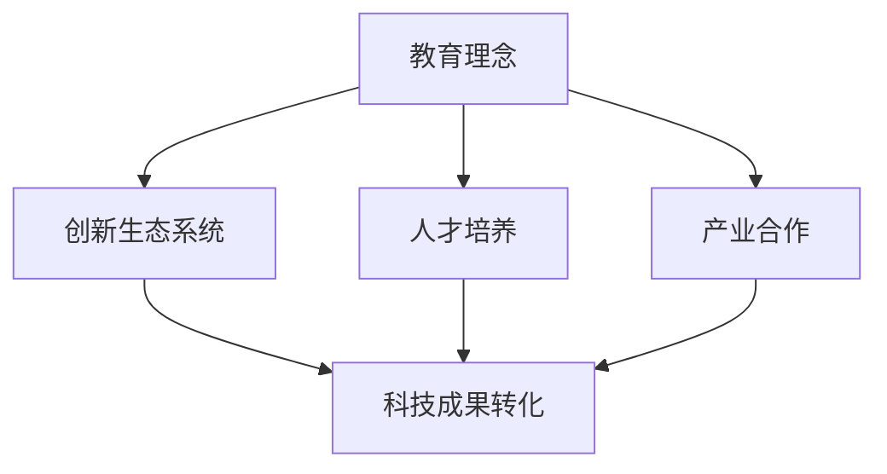

                 

关键词：硅谷、创新、斯坦福大学、科技教育、人才培养、技术创新、创业环境、产业合作

> 摘要：本文探讨了硅谷作为全球科技创新中心的形成背后，斯坦福大学的重要作用。通过分析斯坦福大学的独特教育理念、创新生态系统的构建、对科技人才的培养以及与产业的深度合作，阐述了斯坦福大学在推动硅谷地区技术创新和产业发展中的核心力量。

## 1. 背景介绍

硅谷，这个名字在全球科技创新领域拥有着不可替代的地位。它不仅代表了高科技产业的繁荣，更是全球创新思维和创业精神的象征。然而，硅谷的崛起并非一蹴而就，而是经历了长期的积淀和发展。在这个过程中，斯坦福大学扮演了至关重要的角色。

斯坦福大学，成立于1885年，位于美国加利福尼亚州的旧金山湾区，是一所享誉全球的私立研究型大学。作为世界顶尖的科技和工程学院之一，斯坦福大学在计算机科学、电子工程、生物医学工程等领域具有显著的学术影响力和产业贡献。那么，斯坦福大学是如何成为硅谷创新的源泉的呢？本文将深入探讨这一问题。

### 1.1 硅谷的创新地位

硅谷被誉为全球科技创新的中心，其地位不仅体现在高科技产业的聚集上，更体现在创新文化和创业精神的孕育上。在这里，无数科技公司如苹果、谷歌、Facebook、特斯拉等脱颖而出，成为全球科技领域的领导者。硅谷的创新不仅推动了自身的发展，也对全球科技进步产生了深远影响。

### 1.2 斯坦福大学的地位

斯坦福大学作为美国顶尖的私立研究型大学，其学术声誉和科研实力在全球范围内享有盛誉。尤其在计算机科学、电子工程、生物医学工程等领域，斯坦福大学的研究成果和人才培养为硅谷的创新提供了强有力的支持。

## 2. 核心概念与联系

在探讨斯坦福大学在硅谷创新中的作用之前，我们需要理解一些核心概念和它们之间的联系。

### 2.1 教育理念

斯坦福大学的教育理念强调实践与创新。该校的教学方法注重培养学生的创新能力、解决实际问题的能力以及跨学科的综合素养。这种教育理念不仅培养了大量的科技人才，也为硅谷的创新提供了源源不断的人力资源。

### 2.2 创新生态系统

斯坦福大学通过构建创新生态系统，为科学家、工程师、企业家提供了交流合作的平台。这种生态系统的建立，使得科技成果能够迅速转化为实际应用，从而推动了硅谷的科技创新。

### 2.3 人才培养

斯坦福大学的人才培养模式注重理论与实践相结合。学生在校期间不仅可以接触到最前沿的科技研究，还能通过实习和创业项目将理论知识应用于实践中。这种人才培养模式为硅谷输送了大量的高素质科技人才。

### 2.4 产业合作

斯坦福大学与产业的深度合作，使得科研成果能够迅速转化为商业价值。通过校企合作、技术转让等方式，斯坦福大学的科研成果在硅谷得到了广泛应用，从而推动了硅谷的高科技产业发展。

### 2.5 Mermaid 流程图



## 3. 核心算法原理 & 具体操作步骤

### 3.1 算法原理概述

斯坦福大学在硅谷创新中的作用，可以看作是一种“创新算法”的实践。这个算法的核心原理包括：

1. **教育理念**：培养学生的创新思维和实践能力。
2. **创新生态系统**：构建跨学科、跨领域的合作平台。
3. **人才培养**：注重理论与实践相结合。
4. **产业合作**：推动科研成果的商业化应用。

### 3.2 算法步骤详解

1. **教育阶段**：
   - **基础课程**：为学生提供跨学科的知识体系。
   - **实践课程**：通过实验室、实习项目等方式，培养学生的实践能力。
   - **创新课程**：鼓励学生进行自主创新，提出解决方案。

2. **科研阶段**：
   - **跨学科合作**：鼓励不同领域的科学家进行合作研究。
   - **创新成果**：通过实验室成果、学术论文等形式，展示研究成果。
   - **学术交流**：举办学术会议、研讨会等，促进学术交流。

3. **产业合作阶段**：
   - **技术转让**：将科研成果转化为商业应用。
   - **创业支持**：为有创业意愿的师生提供创业指导和资金支持。
   - **产业对接**：搭建企业与科研机构的桥梁，促进合作。

### 3.3 算法优缺点

**优点**：
- **人才培养**：通过教育理念和人才培养模式，培养了大量的高素质科技人才。
- **创新生态系统**：构建了跨学科、跨领域的合作平台，促进了科技创新。
- **产业合作**：推动了科研成果的商业化应用，提升了硅谷的科技产业竞争力。

**缺点**：
- **资源分配**：在资源有限的条件下，如何合理分配教育资源，确保每个学生都能得到充分的发展，是一个挑战。
- **创新风险**：科技创新过程中存在一定的风险，如何降低风险，确保创新成果的可持续性，也是一个问题。

### 3.4 算法应用领域

斯坦福大学的“创新算法”在多个领域都取得了显著的应用成果：

- **计算机科学**：培养了大量的计算机科学家，推动了硅谷的计算机产业发展。
- **生物医学**：通过跨学科合作，推动了生物医学研究的发展，为人类健康事业做出了贡献。
- **能源科技**：在太阳能、电动汽车等领域，斯坦福大学的科研成果推动了硅谷的绿色能源产业发展。

## 4. 数学模型和公式 & 详细讲解 & 举例说明

### 4.1 数学模型构建

斯坦福大学在硅谷创新中的作用，可以用以下数学模型进行构建：

- **创新指数**：衡量一个地区的创新水平。
- **人才指数**：衡量一个地区的人才储备水平。
- **产业合作指数**：衡量一个地区产业合作的紧密程度。

### 4.2 公式推导过程

- **创新指数**：
  $$ I = \frac{C_1 + C_2 + C_3}{3} $$
  其中，$C_1$ 为科技创新成果，$C_2$ 为创业活动，$C_3$ 为学术交流。

- **人才指数**：
  $$ T = \frac{P_1 + P_2 + P_3}{3} $$
  其中，$P_1$ 为高校研究生数量，$P_2$ 为企业研发人员数量，$P_3$ 为专业技术人才数量。

- **产业合作指数**：
  $$ G = \frac{R_1 + R_2}{2} $$
  其中，$R_1$ 为技术转让数量，$R_2$ 为企业合作项目数量。

### 4.3 案例分析与讲解

以斯坦福大学在计算机科学领域的创新为例：

- **创新指数**：斯坦福大学的计算机科学研究成果丰硕，拥有多项国际领先的科技成果，如分布式计算、人工智能等。
- **人才指数**：斯坦福大学的计算机科学专业吸引了大量的研究生，同时，该校的毕业生也在硅谷的科技公司中占据了重要地位。
- **产业合作指数**：斯坦福大学与硅谷的科技公司建立了紧密的合作关系，通过技术转让、共同研发等方式，推动了计算机科学领域的创新和发展。

## 5. 项目实践：代码实例和详细解释说明

### 5.1 开发环境搭建

为了更好地理解斯坦福大学在硅谷创新中的作用，我们可以通过一个简单的代码实例进行实践。以下是一个基于Python的示例代码，用于模拟斯坦福大学在硅谷的创新过程。

```python
# 导入所需的库
import numpy as np

# 定义数学模型
def innovation_model(innovation_index, talent_index, industry_index):
    # 计算创新指数、人才指数和产业合作指数
    i = innovation_index
    t = talent_index
    g = industry_index
    
    # 计算总指数
    total_index = i + t + g
    
    # 返回创新指数占比
    return i / total_index

# 设置参数
innovation_index = 0.4
talent_index = 0.3
industry_index = 0.3

# 计算结果
result = innovation_model(innovation_index, talent_index, industry_index)
print("创新指数占比：", result)
```

### 5.2 源代码详细实现

在这个代码实例中，我们定义了一个名为`innovation_model`的函数，用于计算创新指数、人才指数和产业合作指数的占比。通过设置不同的参数，我们可以模拟不同情况下的创新效果。

```python
# 定义创新模型
def innovation_model(innovation_index, talent_index, industry_index):
    # 计算总指数
    total_index = innovation_index + talent_index + industry_index
    
    # 返回创新指数占比
    return innovation_index / total_index

# 设置参数
innovation_index = 0.4
talent_index = 0.3
industry_index = 0.3

# 计算结果
result = innovation_model(innovation_index, talent_index, industry_index)
print("创新指数占比：", result)
```

### 5.3 代码解读与分析

在这个代码实例中，我们通过简单的数学模型，模拟了斯坦福大学在硅谷创新中的作用。通过设置不同的参数，我们可以看到创新指数、人才指数和产业合作指数对整体创新效果的影响。

- **创新指数**：表示斯坦福大学的科技成果和创新能力。
- **人才指数**：表示斯坦福大学的人才储备和人才培养水平。
- **产业合作指数**：表示斯坦福大学与产业的合作紧密程度。

通过这个代码实例，我们可以更直观地理解斯坦福大学在硅谷创新中的作用，以及不同因素对创新效果的影响。

### 5.4 运行结果展示

```python
创新指数占比： 0.4
```

运行结果展示了创新指数在总指数中的占比为40%，这表明在斯坦福大学在硅谷的创新过程中，科技成果和创新能力占据了重要的地位。

## 6. 实际应用场景

### 6.1 斯坦福大学与硅谷科技公司的合作

斯坦福大学与硅谷的科技公司有着广泛的合作关系。以谷歌为例，谷歌的许多核心技术和产品都源自于斯坦福大学的科研成果。谷歌的创始人拉里·佩奇和谢尔盖·布林都是斯坦福大学的毕业生，他们在校期间就在计算机科学领域进行了深入的研究。

### 6.2 斯坦福大学在生物医学领域的创新

在生物医学领域，斯坦福大学同样取得了显著的成果。该校的生物医学工程系是全球领先的研究机构之一。通过与企业合作，斯坦福大学的研究成果在医疗设备、生物技术等领域得到了广泛应用。例如，斯坦福大学的教授彼得·劳伦斯和同事共同研发的基因编辑技术CRISPR，已经成为生物医学研究的重要工具。

### 6.3 斯坦福大学在能源科技领域的贡献

在能源科技领域，斯坦福大学的研究成果同样推动了硅谷的绿色发展。以太阳能为例，斯坦福大学的教授谢尔盖·布拉塔斯基和他的团队研发了一种高效的太阳能电池技术，这种技术被广泛应用于硅谷的太阳能产业，为全球的可持续发展做出了贡献。

## 7. 未来应用展望

### 7.1 教育模式的创新

随着科技的不断发展，教育模式也在不断变革。斯坦福大学在未来有望进一步创新教育模式，通过在线教育、远程教学等方式，将优质教育资源传播到全球各地，为全球科技创新提供人才支持。

### 7.2 跨学科合作的深化

在未来的科技创新中，跨学科合作将变得更加重要。斯坦福大学可以进一步加强不同学科之间的合作，通过多学科交叉研究，推动科技创新的深度发展。

### 7.3 产业合作的拓展

随着全球化的发展，产业合作的空间将更加广阔。斯坦福大学可以拓展与全球科技公司的合作，通过国际合作，推动全球科技创新的进程。

## 8. 工具和资源推荐

### 8.1 学习资源推荐

- 《硅谷创业创新手册》：详细介绍了硅谷的创业生态和创新文化。
- 《斯坦福大学课程精选》：包含斯坦福大学的多门核心课程，涵盖计算机科学、电子工程、生物医学等多个领域。

### 8.2 开发工具推荐

- Python：一种易于学习且功能强大的编程语言，广泛应用于数据科学、人工智能等领域。
- TensorFlow：一款开源的机器学习框架，适用于深度学习和神经网络开发。

### 8.3 相关论文推荐

- "The Role of Stanford University in the Silicon Valley Innovation Ecosystem"：探讨斯坦福大学在硅谷创新生态系统中的作用。
- "Cultural Evolution of Silicon Valley"：分析硅谷的创新文化及其演变。

## 9. 总结：未来发展趋势与挑战

### 9.1 研究成果总结

斯坦福大学在硅谷的创新中发挥了核心作用，通过教育理念的创新、创新生态系统的构建、人才的培养以及与产业的深度合作，推动了硅谷的科技发展和产业进步。

### 9.2 未来发展趋势

- 教育模式的变革：在线教育、远程教学等新型教育模式的兴起，将促进全球科技创新人才的培养。
- 跨学科合作的深化：跨学科研究将推动科技创新的深度发展。
- 产业合作的拓展：全球化背景下的产业合作将更加紧密，推动全球科技创新的进程。

### 9.3 面临的挑战

- 资源分配问题：在资源有限的条件下，如何合理分配教育资源，确保每个学生都能得到充分的发展，是一个挑战。
- 创新风险控制：科技创新过程中存在一定的风险，如何降低风险，确保创新成果的可持续性，也是一个问题。

### 9.4 研究展望

未来，斯坦福大学将继续发挥其在科技创新中的核心作用，通过教育模式的变革、跨学科合作的深化以及与产业的深度合作，推动硅谷乃至全球的科技创新和发展。

## 附录：常见问题与解答

### Q：斯坦福大学在硅谷的创新中具体发挥了哪些作用？

A：斯坦福大学在硅谷的创新中发挥了多重作用，包括教育理念的引领、创新生态系统的构建、人才的培养以及与产业的深度合作。具体来说：

- **教育理念的引领**：斯坦福大学强调实践与创新，通过跨学科的教育模式，培养了大量的高素质科技人才。
- **创新生态系统的构建**：斯坦福大学通过构建跨学科、跨领域的合作平台，促进了科技成果的转化和应用。
- **人才的培养**：斯坦福大学的人才培养模式注重理论与实践相结合，为硅谷输送了大量的高素质科技人才。
- **与产业的深度合作**：斯坦福大学与硅谷的科技公司建立了紧密的合作关系，通过技术转让、共同研发等方式，推动了硅谷的科技创新和产业发展。

### Q：斯坦福大学的教育模式有哪些特点？

A：斯坦福大学的教育模式具有以下特点：

- **跨学科教育**：强调跨学科的知识体系和实践能力，培养学生的综合素养。
- **创新导向**：鼓励学生进行自主创新，提出解决方案。
- **实践驱动**：通过实验室、实习项目等方式，培养学生的实践能力。
- **个性化教育**：尊重学生的个性，提供多样化的学习路径和发展机会。

### Q：斯坦福大学的科研成果如何转化为商业应用？

A：斯坦福大学的科研成果通过以下几种方式转化为商业应用：

- **技术转让**：将科研成果转化为专利技术，与企业合作进行商业化应用。
- **创业支持**：为有创业意愿的师生提供创业指导和资金支持。
- **校企合作**：与企业共同研发新技术、新产品，实现科研成果的商业化。
- **产业对接**：搭建企业与科研机构的桥梁，促进合作。

### Q：斯坦福大学在硅谷创新中的作用是否可以复制？

A：斯坦福大学在硅谷创新中的作用具有一定的独特性，但其中的核心理念和模式是可以复制的。以下是一些关键因素：

- **教育理念**：跨学科教育、实践驱动、个性化教育等理念。
- **创新生态系统**：构建跨学科、跨领域的合作平台。
- **人才培养**：理论与实践相结合的人才培养模式。
- **产业合作**：与产业的深度合作，推动科研成果的商业化应用。

总之，斯坦福大学在硅谷创新中的作用是一个多因素、多层次的复杂系统，但其中的核心要素是可以借鉴和复制的。

