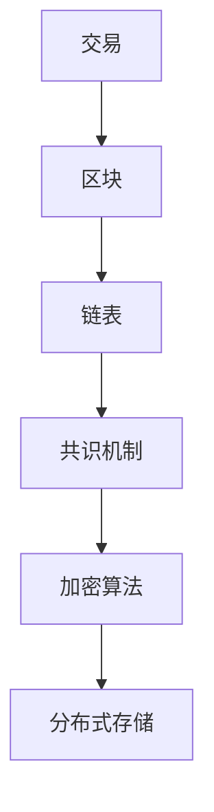

                 

关键词：区块链，去中心化，金融，创新，硅谷，加密货币，智能合约

> 摘要：本文深入探讨了硅谷区块链金融领域的去中心化创新，分析了区块链技术的核心概念、原理及其在金融行业的应用。通过对加密货币、智能合约的详细解读，本文旨在为读者提供对区块链金融的全面认识，并展望其未来的发展前景。

## 1. 背景介绍

自2008年比特币的诞生以来，区块链技术以其去中心化的特性在全球范围内引发了广泛关注。作为硅谷科技创新的前沿领域，区块链金融在短短几年内取得了飞速发展。本文旨在探讨硅谷区块链金融的去中心化创新，分析其核心概念、技术原理及其在金融行业的应用。

## 2. 核心概念与联系

### 2.1 区块链

区块链是一种分布式账本技术，其核心特点是去中心化、安全性高、不可篡改。区块链通过加密算法和共识机制实现数据的分布式存储和验证。以下是一个简化的区块链架构图：



### 2.2 加密货币

加密货币是一种基于区块链技术的数字货币，具有匿名性、安全性、稀缺性等特点。比特币是第一个成功的加密货币，此后出现了许多其他加密货币，如以太坊、莱特币等。

### 2.3 智能合约

智能合约是一种基于区块链的自动化合约，通过编写代码实现合同条款的执行。智能合约在去中心化的区块链环境中执行，无需中介机构，从而降低了交易成本。

## 3. 核心算法原理 & 具体操作步骤

### 3.1 算法原理概述

区块链的核心算法主要包括加密算法和共识机制。加密算法用于保证区块链数据的安全性和不可篡改性；共识机制则确保分布式节点之间的协作和一致性。

### 3.2 算法步骤详解

1. **交易生成**：用户发起交易，交易信息包括发送者、接收者、金额等。

2. **区块生成**：多个交易信息被打包成区块，并添加到区块链中。

3. **共识机制**：分布式节点通过共识机制（如工作量证明、权益证明等）达成一致，确保区块的添加顺序和安全性。

4. **加密算法**：区块链数据使用加密算法进行加密，确保数据的安全性和隐私性。

### 3.3 算法优缺点

**优点**：
- 去中心化：无需中介机构，降低了交易成本。
- 安全性高：加密算法和共识机制确保数据的安全性和不可篡改性。
- 透明性：区块链数据公开透明，易于审计。

**缺点**：
- 性能瓶颈：区块链容量有限，处理能力较低。
- 能耗问题：部分共识机制（如工作量证明）能耗较高。

### 3.4 算法应用领域

区块链技术在金融、供应链管理、数字身份认证等领域具有广泛的应用。在金融领域，区块链主要用于支付、跨境结算、资产管理等方面。

## 4. 数学模型和公式 & 详细讲解 & 举例说明

### 4.1 数学模型构建

区块链的核心数学模型主要包括密码学算法和共识算法。密码学算法用于实现数据的加密和解密，共识算法则用于确保分布式节点之间的协作。

### 4.2 公式推导过程

- **哈希函数**：哈希函数是将任意长度的输入映射为固定长度的输出。常见的哈希函数有MD5、SHA-256等。
- **加密算法**：加密算法用于保证区块链数据的安全性。常见的加密算法有AES、RSA等。
- **共识算法**：共识算法用于确保分布式节点之间的协作。常见共识算法有工作量证明（PoW）、权益证明（PoS）等。

### 4.3 案例分析与讲解

以比特币的工作量证明（PoW）共识算法为例，其基本原理如下：

1. **挖矿**：矿工通过计算特定哈希值来寻找新区块的证明。
2. **竞争**：矿工在分布式网络中竞争，谁先找到满足条件的哈希值，谁就获得挖矿奖励。
3. **验证**：其他节点验证矿工找到的哈希值是否满足条件，如果验证通过，新区块就被添加到区块链中。

## 5. 项目实践：代码实例和详细解释说明

### 5.1 开发环境搭建

1. 安装Node.js和npm。
2. 安装区块链开发框架，如Ethereum或Hyperledger Fabric。

### 5.2 源代码详细实现

以下是一个简单的以太坊智能合约示例，实现了一个简单的去中心化交易平台：

```solidity
pragma solidity ^0.8.0;

contract DEX {
    mapping(address => uint256) public balances;

    function deposit() public payable {
        balances[msg.sender()] += msg.value;
    }

    function withdraw(uint256 amount) public {
        require(amount <= balances[msg.sender()], "Insufficient balance");
        balances[msg.sender()] -= amount;
        payable(msg.sender()).transfer(amount);
    }

    function trade(address recipient, uint256 amount) public {
        require(amount <= balances[msg.sender()], "Insufficient balance");
        balances[msg.sender()] -= amount;
        balances[recipient] += amount;
    }
}
```

### 5.3 代码解读与分析

1. **合约结构**：DEX合约包含一个映射（mapping）和一个三个函数（deposit、withdraw、trade）。
2. **存款与提现**：存款函数（deposit）将ETH存入合约，提现函数（withdraw）将ETH从合约转出到用户地址。
3. **交易**：交易函数（trade）实现合约内的转账，用户可以将其余额转移到其他用户地址。

### 5.4 运行结果展示

1. 用户A通过deposit函数存入1 ETH。
2. 用户B通过deposit函数存入2 ETH。
3. 用户A调用trade函数，将1 ETH转移到用户B。
4. 用户B的余额变为3 ETH，用户A的余额变为0 ETH。

## 6. 实际应用场景

### 6.1 支付与跨境结算

区块链技术可以应用于支付和跨境结算领域，提高交易速度和降低成本。

### 6.2 资产管理

区块链技术可以用于资产管理，提高资产透明度和降低风险。

### 6.3 供应链管理

区块链技术可以用于供应链管理，确保供应链的透明度和可靠性。

## 7. 工具和资源推荐

### 7.1 学习资源推荐

- 《区块链技术指南》
- 《智能合约开发：以太坊与Solidity》

### 7.2 开发工具推荐

- Ethereum Wallet
- Truffle

### 7.3 相关论文推荐

- "Bitcoin: A Peer-to-Peer Electronic Cash System"
- "The Bitcoin Approach to Decentralized Value Transfer"

## 8. 总结：未来发展趋势与挑战

### 8.1 研究成果总结

区块链技术在金融领域取得了显著成果，为去中心化金融提供了新的解决方案。

### 8.2 未来发展趋势

区块链技术将在金融、供应链管理、数字身份认证等领域继续发展，推动产业变革。

### 8.3 面临的挑战

区块链技术在性能、安全性、监管等方面仍面临挑战。

### 8.4 研究展望

未来研究将集中在提高区块链性能、安全性，以及推动区块链与其他技术的融合。

## 9. 附录：常见问题与解答

### 9.1 区块链与比特币的关系是什么？

区块链是比特币的底层技术，比特币是第一个成功的加密货币。

### 9.2 区块链是否可以完全替代传统金融体系？

区块链技术为金融行业提供了新的解决方案，但不可能完全替代传统金融体系。

### 9.3 区块链是否具有法律效力？

区块链上的数据具有法律效力，但具体效力取决于相关法律法规。

----------------------------------------------------------------

作者：禅与计算机程序设计艺术 / Zen and the Art of Computer Programming

以上便是本文的完整内容，希望对您在区块链金融领域的探索有所助益。在接下来的时间里，我们将继续深入探讨区块链技术在其他领域的应用，敬请期待。

