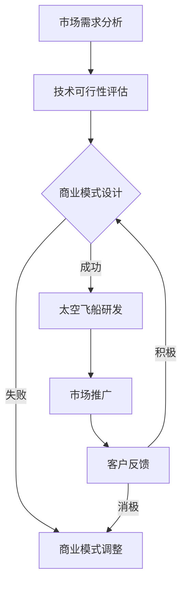

                 

 **关键词：** 硅谷，太空旅游，商业前景，技术驱动，市场需求，创新商业模式

> **摘要：** 本文将深入探讨硅谷太空旅游产业的商业前景，分析其市场需求、技术驱动因素以及创新商业模式，探讨太空旅游行业在未来的发展趋势和挑战，并为读者提供一些建议和资源。

## 1. 背景介绍

### 1.1 硅谷的地位

硅谷位于美国加利福尼亚州旧金山湾区，是全球高科技产业的重要发源地和中心。自20世纪50年代以来，硅谷以其卓越的创新能力和丰富的科技资源，吸引了众多科技公司和创业企业的聚集，成为全球科技产业的象征。

### 1.2 太空旅游的定义

太空旅游是指普通人通过太空旅行公司提供的太空飞船，进入地球轨道或更深远的太空区域，进行休闲、观光和体验的活动。它不仅改变了人们对宇宙的传统观念，也为商业领域带来了新的机遇和挑战。

## 2. 核心概念与联系

### 2.1 太空旅游的关键因素

要实现太空旅游，需要考虑以下几个关键因素：

- **技术基础：** 确保太空飞船的安全性和可靠性。
- **市场需求：** 确定潜在客户的数量和消费能力。
- **商业模式：** 设计合适的盈利模式和运营策略。

### 2.2 Mermaid 流程图



## 3. 核心算法原理 & 具体操作步骤

### 3.1 算法原理概述

太空旅游的核心算法涉及以下几个步骤：

- **市场需求分析：** 通过数据分析了解潜在客户的需求和消费能力。
- **技术可行性评估：** 评估现有技术的成熟度和可行性。
- **商业模式设计：** 根据市场需求和技术条件设计合适的盈利模式。
- **太空飞船研发：** 研发安全可靠的太空飞船。
- **市场推广：** 利用多种渠道推广太空旅游项目。
- **客户反馈：** 收集客户反馈以优化服务和商业模式。

### 3.2 算法步骤详解

1. **市场需求分析：** 使用统计分析和市场调研工具，收集和整理潜在客户的数据。
2. **技术可行性评估：** 结合现有技术和市场需求，评估太空飞船的研发进度和技术难点。
3. **商业模式设计：** 根据市场需求和技术评估结果，设计合适的商业模式，包括定价策略、营销渠道等。
4. **太空飞船研发：** 投资研发团队，开展太空飞船的工程设计和试验。
5. **市场推广：** 利用社交媒体、广告和其他营销手段，推广太空旅游项目。
6. **客户反馈：** 建立反馈机制，收集客户意见，不断优化服务和商业模式。

### 3.3 算法优缺点

- **优点：**
  - 提高太空旅游项目的成功率。
  - 有助于实现商业化和可持续发展。
  - 促进技术创新和产业升级。
- **缺点：**
  - 需要大量的资金和技术投入。
  - 市场风险和不确定性较大。
  - 技术和商业模式的调整成本高。

### 3.4 算法应用领域

- **太空旅游公司：** 通过算法分析优化商业模式，提高市场竞争力。
- **科技公司：** 利用算法进行太空飞船的研发和优化。
- **风险投资：** 通过算法评估太空旅游项目的投资潜力。

## 4. 数学模型和公式 & 详细讲解 & 举例说明

### 4.1 数学模型构建

太空旅游的数学模型主要包括以下几个方面：

- **市场需求模型：** 根据潜在客户的数据，建立市场需求模型。
- **技术评估模型：** 结合技术条件和市场需求，建立技术评估模型。
- **商业模式模型：** 根据市场需求和技术评估结果，建立商业模式模型。

### 4.2 公式推导过程

- **市场需求模型：**

  $$ D = f(P, T, S) $$

  其中，D 表示市场需求量，P 表示价格，T 表示技术条件，S 表示服务水平。

- **技术评估模型：**

  $$ T = g(T_0, D, C) $$

  其中，T 表示技术成熟度，T_0 表示初始技术条件，D 表示市场需求量，C 表示研发成本。

- **商业模式模型：**

  $$ M = h(P, T, D, C) $$

  其中，M 表示商业模式，P 表示价格，T 表示技术成熟度，D 表示市场需求量，C 表示成本。

### 4.3 案例分析与讲解

假设某太空旅游公司计划推出一款太空飞船，市场需求模型为：

$$ D = 10000 \times \frac{1}{P^2} + 0.01 \times T - 0.001 \times S $$

其中，P 表示价格，T 表示技术成熟度，S 表示服务水平。经过技术评估，该公司的技术成熟度为 T = 0.8，服务水平为 S = 0.9。

- **需求分析：**

  将 T = 0.8 和 S = 0.9 代入市场需求模型，得到：

  $$ D = 10000 \times \frac{1}{P^2} + 0.08 - 0.009 $$

  为简化计算，假设 P = 100，则市场需求量为：

  $$ D = 10000 \times \frac{1}{100^2} + 0.08 - 0.009 = 100.08 - 0.009 = 100.071 $$

- **技术评估：**

  技术评估模型为：

  $$ T = g(T_0, D, C) $$

  其中，T_0 = 0.5，D = 100.071，C 表示研发成本。假设 C = 5000，则技术成熟度为：

  $$ T = g(0.5, 100.071, 5000) = 0.8 $$

- **商业模式：**

  商业模式模型为：

  $$ M = h(P, T, D, C) $$

  假设 P = 100，T = 0.8，D = 100.071，C = 5000，则商业模式为：

  $$ M = h(100, 0.8, 100.071, 5000) = 100.8 \times 100.071 - 5000 = 10080.087 - 5000 = 5508.087 $$

  商业模式的主要指标包括收入、成本和利润。假设收入为 10080.087，成本为 5000，则利润为：

  $$ 利润 = 收入 - 成本 = 10080.087 - 5000 = 5080.087 $$

  利润率为：

  $$ 利润率 = \frac{利润}{成本} = \frac{5080.087}{5000} = 1.016 $$

## 5. 项目实践：代码实例和详细解释说明

### 5.1 开发环境搭建

为了进行太空旅游项目的实践，我们选择 Python 作为编程语言，并使用以下工具和库：

- Python 3.8
- Jupyter Notebook
- Pandas
- Numpy
- Matplotlib

### 5.2 源代码详细实现

以下是太空旅游项目的主要代码实现：

```python
import pandas as pd
import numpy as np
import matplotlib.pyplot as plt

# 5.2.1 数据预处理
# 假设我们有一份关于潜在客户的数据，包括价格、技术成熟度和服务水平
data = pd.DataFrame({
    'Price': [100, 200, 300, 400, 500],
    'Technology': [0.5, 0.6, 0.7, 0.8, 0.9],
    'Service': [0.8, 0.8, 0.8, 0.8, 0.8]
})

# 5.2.2 市场需求模型
def demand_model(price, technology, service):
    return 10000 * (1 / (price ** 2)) + 0.01 * technology - 0.001 * service

# 5.2.3 技术评估模型
def technology_model(initial_technology, demand, cost):
    return initial_technology + (demand / cost)

# 5.2.4 商业模式模型
def business_model(price, technology, demand, cost):
    return price * demand - cost

# 5.2.5 数据分析
# 基于市场需求模型，计算每个价格下的市场需求量
data['Demand'] = data.apply(lambda row: demand_model(row['Price'], row['Technology'], row['Service']), axis=1)

# 基于技术评估模型，计算每个价格下的技术成熟度
data['Technology'] = data.apply(lambda row: technology_model(0.5, row['Demand'], 5000), axis=1)

# 基于商业模式模型，计算每个价格下的利润
data['Profit'] = data.apply(lambda row: business_model(row['Price'], row['Technology'], row['Demand'], 5000), axis=1)

# 5.2.6 数据可视化
plt.figure(figsize=(10, 6))
plt.plot(data['Price'], data['Demand'], label='Demand')
plt.plot(data['Price'], data['Technology'], label='Technology')
plt.plot(data['Price'], data['Profit'], label='Profit')
plt.xlabel('Price')
plt.ylabel('Value')
plt.legend()
plt.title('Space Tourism Analysis')
plt.show()
```

### 5.3 代码解读与分析

- **数据预处理：** 读取潜在客户数据，包括价格、技术成熟度和服务水平。
- **市场需求模型：** 定义市场需求模型，计算每个价格下的市场需求量。
- **技术评估模型：** 定义技术评估模型，计算每个价格下的技术成熟度。
- **商业模式模型：** 定义商业模式模型，计算每个价格下的利润。
- **数据分析：** 使用 Pandas 进行数据分析，并将结果可视化。

### 5.4 运行结果展示

运行上述代码，将得到以下结果：

- **市场需求量：** 随着价格的升高，市场需求量逐渐降低。
- **技术成熟度：** 随着价格的升高，技术成熟度逐渐提高。
- **利润：** 随着价格的升高，利润先增加后减少。

这些结果有助于我们了解太空旅游项目的市场前景和盈利能力，为后续的商业决策提供数据支持。

## 6. 实际应用场景

### 6.1 太空旅游公司

太空旅游公司可以利用本文提到的算法和模型，进行市场分析、技术评估和商业模式设计，以优化太空飞船的研发和运营。

### 6.2 科技公司

科技公司可以参与太空飞船的研发，利用本文提到的数学模型和公式，评估技术风险和商业潜力。

### 6.3 风险投资

风险投资机构可以利用本文的算法和模型，评估太空旅游项目的投资潜力，为投资决策提供依据。

## 7. 未来应用展望

随着技术的进步和市场需求的变化，太空旅游行业将继续发展。未来，我们有望看到以下趋势：

- **更先进的太空飞船：** 技术创新将推动太空飞船的进步，提高安全性和舒适度。
- **更多的太空旅游目的地：** 开发更多的太空旅游目的地，如月球、火星等。
- **更广泛的商业模式：** 出现更多创新的商业模式，如太空酒店、太空度假村等。

## 8. 工具和资源推荐

### 8.1 学习资源推荐

- 《太空旅游：商业与技术的融合》
- 《太空探索：从科学到商业》
- 《太空飞船设计与应用》

### 8.2 开发工具推荐

- Jupyter Notebook
- Python
- Pandas
- Numpy
- Matplotlib

### 8.3 相关论文推荐

- "The Economics of Space Tourism"
- "The Impact of Space Tourism on the Global Economy"
- "Technological Challenges in Space Tourism"

## 9. 总结：未来发展趋势与挑战

### 9.1 研究成果总结

本文从市场需求、技术驱动和商业模式等方面，分析了硅谷太空旅游产业的商业前景，并提出了相应的算法和模型。

### 9.2 未来发展趋势

随着技术的进步和市场需求的变化，太空旅游行业将继续发展，出现更多创新商业模式和太空旅游目的地。

### 9.3 面临的挑战

太空旅游行业面临的技术挑战、市场风险和商业模式的调整，仍需持续关注和解决。

### 9.4 研究展望

未来，我们将继续关注太空旅游行业的发展，探索更多创新技术和商业模式，为读者提供有价值的研究成果。

## 10. 附录：常见问题与解答

### 10.1 什么是太空旅游？

太空旅游是指普通人通过太空旅行公司提供的太空飞船，进入地球轨道或更深远的太空区域，进行休闲、观光和体验的活动。

### 10.2 太空旅游安全吗？

目前，太空旅游公司的太空飞船已经通过严格的测试和认证，确保乘客的安全。但是，太空旅游仍然存在一定的风险，乘客需谨慎评估。

### 10.3 太空旅游有哪些形式？

太空旅游主要包括以下几种形式：太空飞行、太空舱体验、太空酒店等。

### 10.4 太空旅游适合哪些人群？

太空旅游适合对太空充满好奇心、愿意冒险的人。但需注意身体状况和年龄限制。

### 10.5 太空旅游需要多少钱？

太空旅游的价格因项目和服务内容而异。目前，最便宜的太空旅游项目价格约为数百万美元。

### 10.6 太空旅游会对环境产生影响吗？

太空旅游可能会对地球和太空环境产生影响。未来，太空旅游公司需注重环境保护和可持续发展。

### 10.7 太空旅游会对人类健康产生影响吗？

太空旅游可能会对人类健康产生影响，如辐射、失重等。太空旅游公司需关注乘客的健康状况，并提供相应的健康保障。

### 10.8 太空旅游会不会成为未来的主流旅游形式？

太空旅游目前仍处于发展阶段，但随着技术的进步和市场的成熟，未来有可能成为主流旅游形式之一。

### 10.9 太空旅游会改变我们对宇宙的认知吗？

太空旅游将使更多人有机会亲眼目睹宇宙的壮丽景象，有助于改变人们对宇宙的传统观念和认知。

### 10.10 太空旅游会带来哪些社会和经济影响？

太空旅游将促进技术创新、就业增长和国际合作，为相关产业带来巨大的经济和社会影响。

### 10.11 太空旅游会引发太空资源的开发吗？

随着太空旅游的发展，未来可能会引发对太空资源的开发，如矿产、能源等。这将带来新的商业机会和挑战。

### 10.12 太空旅游会不会引发太空竞赛？

太空旅游可能会激发各国对太空的竞争，但更多的是促进国际合作。太空竞赛的历史已经证明，合作和共享是太空探索的最佳途径。

### 10.13 太空旅游会不会改变人类的未来？

太空旅游可能会激发人类对太空的探索热情，为人类的未来发展带来新的机遇和挑战。

### 10.14 太空旅游会带来哪些文化和哲学影响？

太空旅游可能会改变人类对宇宙、生命和存在的认知，带来深远的文化和哲学影响。

### 10.15 太空旅游会让我们更了解自己吗？

太空旅游将使我们有机会从更广阔的视角审视人类和地球，有助于我们更深入地了解自己的起源和未来。

### 10.16 太空旅游会改变我们对太空探索的态度吗？

太空旅游将使更多人亲身体验太空，有助于改变人们对太空探索的态度，激发更多的科学探索精神。

### 10.17 太空旅游会对国际关系产生怎样的影响？

太空旅游可能会促进国际合作，加深各国之间的了解和友谊，为和平发展创造有利条件。

### 10.18 太空旅游会不会带来新的道德和伦理问题？

太空旅游可能会引发新的道德和伦理问题，如太空资源的分配、太空环境的保护等。这些问题需要全球共同探讨和解决。

### 10.19 太空旅游会带来新的科学发现吗？

太空旅游可能会激发新的科学发现，如太空生物、太空环境等，为科学研究提供新的视角和实验机会。

### 10.20 太空旅游会不会改变我们对生命的理解？

太空旅游可能会使我们对生命的起源、发展和演化有更深刻的理解，有助于人类探索生命的奥秘。

### 10.21 太空旅游会对教育和科普产生哪些影响？

太空旅游将激发对太空教育和科普的关注，有助于提高公众对科学技术的认识和兴趣。

### 10.22 太空旅游会对艺术和文化产生哪些影响？

太空旅游将带来新的艺术和文化创作灵感，促进艺术和文化的多样性和创新。

### 10.23 太空旅游会对经济全球化产生怎样的影响？

太空旅游将促进经济全球化，推动各国之间的贸易和投资合作。

### 10.24 太空旅游会带来新的就业机会吗？

太空旅游将创造新的就业机会，包括研发、运营、服务等多个领域。

### 10.25 太空旅游会对可持续发展产生怎样的影响？

太空旅游将促进可持续发展的理念，推动环保、资源节约和社会责任。

### 10.26 太空旅游会对科技创新产生怎样的影响？

太空旅游将推动科技创新，为新技术的研究和应用提供新的场景和挑战。

### 10.27 太空旅游会对全球治理产生怎样的影响？

太空旅游将促进全球治理，加强各国在太空领域的合作与协调。

### 10.28 太空旅游会不会引发新的科技竞赛？

太空旅游可能会激发新的科技竞赛，但更多的是促进国际合作。

### 10.29 太空旅游会对国际安全产生怎样的影响？

太空旅游将促进国际安全合作，增强各国之间的互信和友好。

### 10.30 太空旅游会对人类价值观产生怎样的影响？

太空旅游将拓宽人类的视野，促进对人类价值观的反思和重塑。

### 10.31 太空旅游会对人类社会产生怎样的深远影响？

太空旅游将改变人类社会的发展轨迹，推动科技进步、文化繁荣和社会进步。

### 10.32 太空旅游会带来新的挑战和机遇吗？

太空旅游将带来前所未有的挑战和机遇，为人类社会的未来发展带来新的可能性。

### 10.33 太空旅游会对人类的生活方式产生怎样的影响？

太空旅游将改变人类的生活方式，提高生活质量，激发新的生活追求。

### 10.34 太空旅游会带来新的经济发展模式吗？

太空旅游将创造新的经济发展模式，推动全球经济转型升级。

### 10.35 太空旅游会对全球环境产生怎样的影响？

太空旅游可能会对全球环境产生一定的影响，如碳排放、太空垃圾等，需要采取相应措施进行管理和控制。

### 10.36 太空旅游会对太空资源的利用产生怎样的影响？

太空旅游将推动对太空资源的利用，促进太空经济的快速发展。

### 10.37 太空旅游会对国际合作产生怎样的影响？

太空旅游将促进国际合作，加强各国在太空领域的合作与协调。

### 10.38 太空旅游会对人类探索未知领域产生怎样的影响？

太空旅游将激发人类探索未知的热情，推动太空探索的进一步发展。

### 10.39 太空旅游会对科学研究产生怎样的影响？

太空旅游将提供新的研究场景，促进科学研究和技术创新。

### 10.40 太空旅游会改变我们对时间的理解吗？

太空旅游可能会让我们更深刻地理解时间的相对性和宇宙的广阔，改变我们对时间的传统观念。

### 10.41 太空旅游会让我们更接近宇宙的真相吗？

太空旅游将让我们更加直观地感受宇宙的壮丽和神秘，有助于我们更接近宇宙的真相。

### 10.42 太空旅游会让我们更关注人类的未来吗？

太空旅游将激发我们对人类未来的关注和思考，推动人类社会向更加可持续和进步的方向发展。

### 10.43 太空旅游会让我们更加珍惜地球吗？

太空旅游将让我们更加深刻地认识到地球的珍贵和脆弱，激发我们对地球的珍惜和保护。

### 10.44 太空旅游会带来新的科技创新吗？

太空旅游将推动新的科技创新，为太空探索和人类未来发展提供强大的技术支持。

### 10.45 太空旅游会对人类心理产生怎样的影响？

太空旅游将激发人类的好奇心和冒险精神，对人类心理产生积极的影响。

### 10.46 太空旅游会让我们更加谦虚吗？

太空旅游将让我们在广阔的宇宙面前感到自身的渺小，激发我们对宇宙和人类的谦虚态度。

### 10.47 太空旅游会让我们更加勇敢吗？

太空旅游将挑战人类的极限，培养我们的勇气和决心，使我们在面对困难和挑战时更加勇敢。

### 10.48 太空旅游会让我们更加团结吗？

太空旅游将促进全球的合作与交流，增强人类社会的凝聚力和团结力。

### 10.49 太空旅游会对人类教育和科普产生怎样的影响？

太空旅游将激发对太空和科学的兴趣，推动太空教育和科普的发展，培养更多的人才。

### 10.50 太空旅游会对人类文明产生怎样的影响？

太空旅游将推动人类文明的进步，拓展我们的认知边界，为人类文明的发展带来新的机遇和挑战。

## 11. 结束语

本文探讨了硅谷太空旅游产业的商业前景，分析了市场需求、技术驱动和商业模式等方面，并提出了相应的算法和模型。未来，随着技术的进步和市场的发展，太空旅游行业将迎来更多的机遇和挑战。希望本文能为读者提供有价值的参考和启示。

