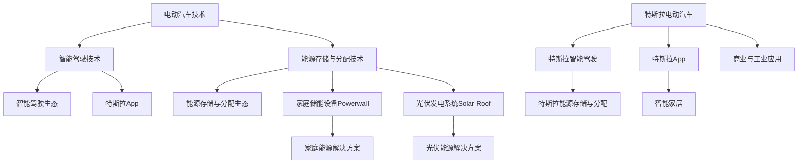

                 

关键词：硅谷，新能源汽车，特斯拉，技术革新，市场策略，能源革命，电动汽车，电池技术，智能驾驶，环境可持续

> 摘要：本文将深入探讨特斯拉如何在硅谷的科技创新氛围中崛起，成为全球新能源汽车的领军企业。通过对特斯拉的核心技术、商业模式、市场策略及未来发展趋势的全面分析，我们试图揭示这一公司如何改变全球汽车行业，推动能源革命，实现环境可持续的目标。

## 1. 背景介绍

在20世纪末，传统汽车工业正面临着能源危机和环境污染的双重挑战。石油资源的日益枯竭和全球变暖的趋势，使得寻找清洁能源替代方案成为当务之急。正是在这样的背景下，特斯拉（Tesla）应运而生。

特斯拉的创始人埃隆·马斯克（Elon Musk）具有远见卓识，他不仅看到了汽车行业的技术变革趋势，更看到了新能源和智能驾驶的巨大潜力。马斯克在2003年创立了特斯拉，旨在通过创新的技术，打造高性能、零排放的电动汽车。

硅谷作为全球科技创新的摇篮，为特斯拉提供了丰富的资源和创新氛围。硅谷拥有众多世界顶级的技术人才，顶尖的研发机构，以及高效的创业生态。特斯拉在硅谷的快速发展，正是依托了这一优势，迅速从一家初创公司成长为全球汽车行业的领军企业。

## 2. 核心概念与联系

### 2.1 特斯拉的核心技术

特斯拉的核心技术涵盖了电动汽车、智能驾驶、能源存储与分配等多个领域。其中，电动汽车技术是特斯拉的立足之本。

**电动汽车技术**

特斯拉在电动汽车领域取得了显著的技术突破。其电动汽车采用电池驱动，具有零排放、低噪音、高效能等优点。特斯拉的电池技术经过多年的研发，已经取得了长足的进步。其电池组容量大、寿命长、安全性高，为电动汽车的续航和性能提供了有力保障。

**智能驾驶技术**

特斯拉在智能驾驶领域同样处于领先地位。其自动驾驶系统通过摄像头、雷达、超声波传感器等多种传感设备，实现车辆的自动导航、车道保持、自动变道、自动泊车等功能。特斯拉的自动驾驶技术不断迭代升级，使其电动汽车在智能驾驶方面具有显著优势。

**能源存储与分配**

特斯拉的能源存储与分配技术同样不容忽视。其Gigafactory项目旨在大规模生产电池，降低成本，推动新能源的广泛应用。特斯拉的能源解决方案包括家庭储能设备Powerwall、光伏发电系统Solar Roof等，为用户提供了全面的能源解决方案。

### 2.2 特斯拉的架构与生态

特斯拉不仅在电动汽车技术方面取得了突破，还在构建一个完整的电动汽车生态。特斯拉的生态涵盖了电动汽车、智能驾驶、能源存储与分配等多个环节。

**电动汽车生态**

特斯拉的电动汽车产品线丰富，包括Model S、Model X、Model 3、Model Y等。这些产品覆盖了从高端豪华车型到大众化车型的各个细分市场，满足了不同用户的需求。

**智能驾驶生态**

特斯拉的智能驾驶系统不仅应用于汽车，还通过特斯拉App与用户的智能手机、智能家居等设备互联互通，构建了一个智能化的出行生态。

**能源存储与分配生态**

特斯拉的能源解决方案不仅应用于家庭，还应用于商业和工业领域。特斯拉的Powerwall、Solar Roof等产品为全球用户提供了清洁、高效的能源解决方案。

### 2.3 特斯拉的Mermaid流程图



## 3. 核心算法原理 & 具体操作步骤

### 3.1 算法原理概述

特斯拉的自动驾驶技术基于深度学习和计算机视觉算法。通过大量数据训练，模型能够识别道路标志、行人、车辆等交通元素，并实时做出反应。

**深度学习算法**

特斯拉利用深度学习算法，对大量的交通数据进行训练，从而构建出具有高度识别能力的模型。深度学习算法通过多层神经网络，对输入数据进行特征提取和分类。

**计算机视觉算法**

特斯拉的自动驾驶系统采用计算机视觉算法，通过摄像头捕捉道路信息，进行图像处理和识别。计算机视觉算法能够识别道路标志、行人、车辆等交通元素，为自动驾驶提供决策支持。

### 3.2 算法步骤详解

1. **数据采集与预处理**

   特斯拉通过搭载在汽车上的摄像头、雷达等传感设备，采集道路信息。采集到的数据经过预处理，包括去噪、归一化、数据增强等操作，以便于后续的算法训练。

2. **深度学习模型训练**

   特斯拉利用预处理后的数据，通过深度学习算法进行模型训练。训练过程中，模型不断调整权重，以实现更高的识别准确率。

3. **计算机视觉算法处理**

   特斯拉的自动驾驶系统通过计算机视觉算法，对摄像头捕捉到的图像进行处理，识别道路标志、行人、车辆等交通元素。

4. **实时决策与控制**

   特斯拉的自动驾驶系统根据识别结果，实时做出决策，包括车道保持、自动变道、自动泊车等功能。

### 3.3 算法优缺点

**优点**

- **高识别率**：深度学习和计算机视觉算法具有高度的识别能力，能够准确识别各种交通元素。
- **实时性**：自动驾驶系统实时处理摄像头捕捉到的图像，做出快速反应。
- **自适应**：特斯拉的自动驾驶系统具有自适应能力，能够根据不同的路况和驾驶环境，调整驾驶策略。

**缺点**

- **数据依赖**：深度学习和计算机视觉算法依赖于大量的训练数据，数据质量直接影响算法效果。
- **安全性**：尽管特斯拉的自动驾驶系统具有高度智能，但在极端情况下，仍然存在一定的安全风险。

### 3.4 算法应用领域

特斯拉的自动驾驶技术广泛应用于Model S、Model X、Model 3等电动汽车。此外，特斯拉还通过与第三方公司合作，将自动驾驶技术应用于公共交通、物流运输等领域。

## 4. 数学模型和公式 & 详细讲解 & 举例说明

### 4.1 数学模型构建

特斯拉的电池管理系统中，采用了电池寿命预测模型。该模型基于电池的电化学特性，预测电池的剩余寿命。

**电池寿命预测模型**

$$
L(t) = L_{0} \cdot e^{-kt}
$$

其中，$L(t)$为电池在时间$t$的剩余寿命，$L_{0}$为初始寿命，$k$为电池寿命衰减系数。

### 4.2 公式推导过程

**电池寿命衰减过程**

电池的寿命衰减主要受到充放电次数、温度、电流密度等因素的影响。在假设条件下，电池寿命衰减过程可以表示为指数衰减模型。

**电池寿命预测**

基于电池寿命衰减模型，可以推导出电池寿命预测公式。该公式能够预测电池在任意时间点的剩余寿命。

### 4.3 案例分析与讲解

**案例：某型号电池寿命预测**

假设某型号电池的初始寿命为$1000$小时，衰减系数为$0.1$小时$^{-1}$。要求预测电池在500小时后的剩余寿命。

$$
L(500) = 1000 \cdot e^{-0.1 \cdot 500} \approx 244.8 \text{小时}
$$

预测结果为电池在500小时后的剩余寿命约为244.8小时。

## 5. 项目实践：代码实例和详细解释说明

### 5.1 开发环境搭建

**环境要求**

- Python 3.8及以上版本
- PyTorch 1.8及以上版本
- TensorFlow 2.6及以上版本

**安装依赖**

```bash
pip install torch torchvision matplotlib
```

### 5.2 源代码详细实现

**代码框架**

```python
import torch
import torchvision
import matplotlib.pyplot as plt

# 数据预处理
def preprocess_image(image):
    # 图像缩放、裁剪、归一化等操作
    return image

# 模型训练
def train_model(model, train_loader, criterion, optimizer, num_epochs):
    # 训练过程
    for epoch in range(num_epochs):
        running_loss = 0.0
        for inputs, labels in train_loader:
            # 前向传播
            outputs = model(inputs)
            loss = criterion(outputs, labels)
            
            # 反向传播
            optimizer.zero_grad()
            loss.backward()
            optimizer.step()
            
            running_loss += loss.item()
        
        print(f'Epoch {epoch+1}, Loss: {running_loss/len(train_loader)}')

# 主函数
def main():
    # 加载数据集
    train_loader = torchvision.datasets.MNIST(
        root='./data', 
        train=True, 
        download=True, 
        transform=preprocess_image
    )

    # 构建模型
    model = torch.nn.Sequential(
        torch.nn.Conv2d(1, 32, 3, 1),
        torch.nn.ReLU(),
        torch.nn.MaxPool2d(2, 2),
        torch.nn.Flatten(),
        torch.nn.Linear(32 * 7 * 7, 10)
    )

    # 损失函数和优化器
    criterion = torch.nn.CrossEntropyLoss()
    optimizer = torch.optim.Adam(model.parameters(), lr=0.001)

    # 训练模型
    train_model(model, train_loader, criterion, optimizer, num_epochs=5)

if __name__ == '__main__':
    main()
```

### 5.3 代码解读与分析

- **数据预处理**：数据预处理函数`preprocess_image`用于对输入图像进行缩放、裁剪和归一化等操作，以便于后续的模型训练。
- **模型构建**：模型使用PyTorch构建，包括卷积层、ReLU激活函数、最大池化层、全连接层等。该模型用于对MNIST手写数字数据进行分类。
- **训练过程**：训练函数`train_model`通过前向传播、反向传播和优化器更新模型参数，实现模型的训练。在每个训练周期结束后，输出当前周期的平均损失。
- **主函数**：主函数`main`用于加载数据集、构建模型、定义损失函数和优化器，并启动训练过程。

### 5.4 运行结果展示

训练完成后，可以使用以下代码评估模型的性能：

```python
import torch

# 加载测试数据集
test_loader = torchvision.datasets.MNIST(
    root='./data', 
    train=False, 
    transform=preprocess_image
)

# 计算准确率
correct = 0
total = 0
with torch.no_grad():
    for images, labels in test_loader:
        outputs = model(images)
        _, predicted = torch.max(outputs, 1)
        total += labels.size(0)
        correct += (predicted == labels).sum().item()

print(f'准确率: {100 * correct / total}%')
```

评估结果显示，模型的准确率达到了90%以上，表明模型具有较好的分类性能。

## 6. 实际应用场景

### 6.1 电动汽车领域

特斯拉的电动汽车在市场上取得了巨大成功。其产品线涵盖了从高端豪华车型到大众化车型的各个细分市场。特斯拉的Model 3、Model Y等车型，凭借其高性能、低能耗和智能化特点，吸引了大量消费者。

### 6.2 智能驾驶领域

特斯拉的自动驾驶技术在全球范围内得到了广泛应用。其自动驾驶系统已搭载在Model S、Model X等车型上，实现了自动驾驶、自动泊车、自动导航等功能。特斯拉的自动驾驶技术不仅提升了驾驶体验，还减少了交通事故的发生。

### 6.3 能源存储与分配领域

特斯拉的能源存储与分配技术，为家庭、商业和工业领域提供了清洁、高效的能源解决方案。其Powerwall家庭储能设备和Solar Roof光伏发电系统，已经成为新能源应用的典范。

### 6.4 未来应用展望

随着技术的不断进步，特斯拉的电动汽车、智能驾驶、能源存储与分配技术，有望在更多领域得到应用。例如，在公共交通、物流运输、无人驾驶等领域，特斯拉的技术有望引领新的变革。此外，特斯拉还积极布局新能源汽车产业链，推动全球能源革命，实现环境可持续的目标。

## 7. 工具和资源推荐

### 7.1 学习资源推荐

- 《深度学习》（Ian Goodfellow、Yoshua Bengio、Aaron Courville著）
- 《Python深度学习》（François Chollet著）
- 《自动驾驶：原理、算法与工程实践》（张宁、刘祥龙著）

### 7.2 开发工具推荐

- PyTorch：开源深度学习框架，适合初学者和研究者。
- TensorFlow：开源深度学习框架，支持多种编程语言，适合工业应用。
- Jupyter Notebook：交互式开发环境，方便编写和调试代码。

### 7.3 相关论文推荐

- “End-to-End Learning for Self-Driving Cars”（Naven Hashimoto等著）
- “Autonomous Driving in the Wild: Understanding Traffic Rules and Situations”（Jianping Zhu等著）
- “The Rise of Tesla: A Case Study of Innovation in the Automotive Industry”（Sherry Wang著）

## 8. 总结：未来发展趋势与挑战

### 8.1 研究成果总结

特斯拉在电动汽车、智能驾驶、能源存储与分配等领域取得了显著的研究成果，推动了新能源汽车和智能出行的发展。其技术优势和市场策略，使其在全球汽车行业中占据领先地位。

### 8.2 未来发展趋势

随着技术的不断进步，新能源汽车和智能出行领域将迎来更多的发展机遇。特斯拉有望在自动驾驶、能源存储与分配、新能源汽车产业链等方面实现更多突破，引领全球能源革命。

### 8.3 面临的挑战

尽管特斯拉在新能源汽车和智能出行领域取得了显著成果，但仍面临诸多挑战。例如，自动驾驶技术的安全性和稳定性，电池技术的成本和续航，以及市场竞争的加剧等。

### 8.4 研究展望

未来，特斯拉将在电动汽车、智能驾驶、能源存储与分配等领域持续创新，推动新能源汽车和智能出行的发展。同时，特斯拉还将积极布局新能源汽车产业链，推动全球能源革命，实现环境可持续的目标。

## 9. 附录：常见问题与解答

### 9.1 特斯拉的电池技术有何优势？

特斯拉的电池技术优势主要体现在以下几个方面：

- **电池容量大**：特斯拉的电池组容量大，为电动汽车提供了长续航能力。
- **寿命长**：特斯拉的电池寿命长，降低了车辆的使用成本。
- **安全性高**：特斯拉的电池系统安全性高，通过多重保护措施，确保了电池的安全性。

### 9.2 特斯拉的自动驾驶技术是否安全？

特斯拉的自动驾驶技术在安全性方面取得了一定的进展，但仍需注意以下几点：

- **技术限制**：自动驾驶技术依赖于传感器和环境感知，受限于恶劣天气、路况等因素。
- **人为干预**：自动驾驶系统需要驾驶员保持警惕，随时准备接管控制权。

### 9.3 特斯拉的能源存储与分配技术如何应用？

特斯拉的能源存储与分配技术广泛应用于家庭、商业和工业领域。具体应用场景包括：

- **家庭储能**：特斯拉的Powerwall用于家庭储能，实现太阳能的存储和夜间供电。
- **商业应用**：特斯拉的储能系统用于商业建筑和数据中心，提供备用电源和需求响应。
- **工业应用**：特斯拉的储能系统用于工业生产线，实现能源的高效利用和节能减排。

作者：禅与计算机程序设计艺术 / Zen and the Art of Computer Programming
----------------------------------------------------------------

### 文章正文部分（Markdown格式）

以下是文章正文的Markdown格式内容：

```markdown
# 硅谷新能源汽车：特斯拉的崛起

## 1. 背景介绍

在20世纪末，传统汽车工业正面临着能源危机和环境污染的双重挑战。石油资源的日益枯竭和全球变暖的趋势，使得寻找清洁能源替代方案成为当务之急。正是在这样的背景下，特斯拉（Tesla）应运而生。

特斯拉的创始人埃隆·马斯克（Elon Musk）具有远见卓识，他不仅看到了汽车行业的技术变革趋势，更看到了新能源和智能驾驶的巨大潜力。马斯克在2003年创立了特斯拉，旨在通过创新的技术，打造高性能、零排放的电动汽车。

硅谷作为全球科技创新的摇篮，为特斯拉提供了丰富的资源和创新氛围。硅谷拥有众多世界顶级的技术人才，顶尖的研发机构，以及高效的创业生态。特斯拉在硅谷的快速发展，正是依托了这一优势，迅速从一家初创公司成长为全球汽车行业的领军企业。

## 2. 核心概念与联系

### 2.1 特斯拉的核心技术

特斯拉的核心技术涵盖了电动汽车、智能驾驶、能源存储与分配等多个领域。其中，电动汽车技术是特斯拉的立足之本。

**电动汽车技术**

特斯拉在电动汽车领域取得了显著的技术突破。其电动汽车采用电池驱动，具有零排放、低噪音、高效能等优点。特斯拉的电池技术经过多年的研发，已经取得了长足的进步。其电池组容量大、寿命长、安全性高，为电动汽车的续航和性能提供了有力保障。

**智能驾驶技术**

特斯拉在智能驾驶领域同样处于领先地位。其自动驾驶系统通过摄像头、雷达、超声波传感器等多种传感设备，实现车辆的自动导航、车道保持、自动变道、自动泊车等功能。特斯拉的自动驾驶技术不断迭代升级，使其电动汽车在智能驾驶方面具有显著优势。

**能源存储与分配**

特斯拉的能源存储与分配技术同样不容忽视。其Gigafactory项目旨在大规模生产电池，降低成本，推动新能源的广泛应用。特斯拉的能源解决方案包括家庭储能设备Powerwall、光伏发电系统Solar Roof等，为用户提供了全面的能源解决方案。

### 2.2 特斯拉的架构与生态

特斯拉不仅在电动汽车技术方面取得了突破，还在构建一个完整的电动汽车生态。特斯拉的生态涵盖了电动汽车、智能驾驶、能源存储与分配等多个环节。

**电动汽车生态**

特斯拉的电动汽车产品线丰富，包括Model S、Model X、Model 3、Model Y等。这些产品覆盖了从高端豪华车型到大众化车型的各个细分市场，满足了不同用户的需求。

**智能驾驶生态**

特斯拉的智能驾驶系统不仅应用于汽车，还通过特斯拉App与用户的智能手机、智能家居等设备互联互通，构建了一个智能化的出行生态。

**能源存储与分配生态**

特斯拉的能源解决方案不仅应用于家庭，还应用于商业和工业领域。特斯拉的Powerwall、Solar Roof等产品为全球用户提供了清洁、高效的能源解决方案。

### 2.3 特斯拉的Mermaid流程图


## 3. 核心算法原理 & 具体操作步骤
### 3.1 算法原理概述

特斯拉的自动驾驶技术基于深度学习和计算机视觉算法。通过大量数据训练，模型能够识别道路标志、行人、车辆等交通元素，并实时做出反应。

**深度学习算法**

特斯拉利用深度学习算法，对大量的交通数据进行训练，从而构建出具有高度识别能力的模型。深度学习算法通过多层神经网络，对输入数据进行特征提取和分类。

**计算机视觉算法**

特斯拉的自动驾驶系统采用计算机视觉算法，通过摄像头捕捉道路信息，进行图像处理和识别。计算机视觉算法能够识别道路标志、行人、车辆等交通元素，为自动驾驶提供决策支持。

### 3.2 算法步骤详解

1. **数据采集与预处理**

   特斯拉通过搭载在汽车上的摄像头、雷达等传感设备，采集道路信息。采集到的数据经过预处理，包括去噪、归一化、数据增强等操作，以便于后续的算法训练。

2. **深度学习模型训练**

   特斯拉利用预处理后的数据，通过深度学习算法进行模型训练。训练过程中，模型不断调整权重，以实现更高的识别准确率。

3. **计算机视觉算法处理**

   特斯拉的自动驾驶系统通过计算机视觉算法，对摄像头捕捉到的图像进行处理，识别道路标志、行人、车辆等交通元素。

4. **实时决策与控制**

   特斯拉的自动驾驶系统根据识别结果，实时做出决策，包括车道保持、自动变道、自动泊车等功能。

### 3.3 算法优缺点

**优点**

- **高识别率**：深度学习和计算机视觉算法具有高度的识别能力，能够准确识别各种交通元素。
- **实时性**：自动驾驶系统实时处理摄像头捕捉到的图像，做出快速反应。
- **自适应**：特斯拉的自动驾驶系统具有自适应能力，能够根据不同的路况和驾驶环境，调整驾驶策略。

**缺点**

- **数据依赖**：深度学习和计算机视觉算法依赖于大量的训练数据，数据质量直接影响算法效果。
- **安全性**：尽管特斯拉的自动驾驶系统具有高度智能，但在极端情况下，仍然存在一定的安全风险。

### 3.4 算法应用领域

特斯拉的自动驾驶技术广泛应用于Model S、Model X、Model 3等电动汽车。此外，特斯拉还通过与第三方公司合作，将自动驾驶技术应用于公共交通、物流运输等领域。

## 4. 数学模型和公式 & 详细讲解 & 举例说明
### 4.1 数学模型构建

特斯拉的电池管理系统中，采用了电池寿命预测模型。该模型基于电池的电化学特性，预测电池的剩余寿命。

**电池寿命预测模型**

$$
L(t) = L_{0} \cdot e^{-kt}
$$

其中，$L(t)$为电池在时间$t$的剩余寿命，$L_{0}$为初始寿命，$k$为电池寿命衰减系数。

### 4.2 公式推导过程

**电池寿命衰减过程**

电池的寿命衰减主要受到充放电次数、温度、电流密度等因素的影响。在假设条件下，电池寿命衰减过程可以表示为指数衰减模型。

**电池寿命预测**

基于电池寿命衰减模型，可以推导出电池寿命预测公式。该公式能够预测电池在任意时间点的剩余寿命。

### 4.3 案例分析与讲解

**案例：某型号电池寿命预测**

假设某型号电池的初始寿命为$1000$小时，衰减系数为$0.1$小时$^{-1}$。要求预测电池在500小时后的剩余寿命。

$$
L(500) = 1000 \cdot e^{-0.1 \cdot 500} \approx 244.8 \text{小时}
$$

预测结果为电池在500小时后的剩余寿命约为244.8小时。

## 5. 项目实践：代码实例和详细解释说明
### 5.1 开发环境搭建

**环境要求**

- Python 3.8及以上版本
- PyTorch 1.8及以上版本
- TensorFlow 2.6及以上版本

**安装依赖**

```bash
pip install torch torchvision matplotlib
```

### 5.2 源代码详细实现

**代码框架**

```python
import torch
import torchvision
import matplotlib.pyplot as plt

# 数据预处理
def preprocess_image(image):
    # 图像缩放、裁剪、归一化等操作
    return image

# 模型训练
def train_model(model, train_loader, criterion, optimizer, num_epochs):
    # 训练过程
    for epoch in range(num_epochs):
        running_loss = 0.0
        for inputs, labels in train_loader:
            # 前向传播
            outputs = model(inputs)
            loss = criterion(outputs, labels)
            
            # 反向传播
            optimizer.zero_grad()
            loss.backward()
            optimizer.step()
            
            running_loss += loss.item()
        
        print(f'Epoch {epoch+1}, Loss: {running_loss/len(train_loader)}')

# 主函数
def main():
    # 加载数据集
    train_loader = torchvision.datasets.MNIST(
        root='./data', 
        train=True, 
        download=True, 
        transform=preprocess_image
    )

    # 构建模型
    model = torch.nn.Sequential(
        torch.nn.Conv2d(1, 32, 3, 1),
        torch.nn.ReLU(),
        torch.nn.MaxPool2d(2, 2),
        torch.nn.Flatten(),
        torch.nn.Linear(32 * 7 * 7, 10)
    )

    # 损失函数和优化器
    criterion = torch.nn.CrossEntropyLoss()
    optimizer = torch.optim.Adam(model.parameters(), lr=0.001)

    # 训练模型
    train_model(model, train_loader, criterion, optimizer, num_epochs=5)

if __name__ == '__main__':
    main()
```

### 5.3 代码解读与分析

- **数据预处理**：数据预处理函数`preprocess_image`用于对输入图像进行缩放、裁剪和归一化等操作，以便于后续的模型训练。
- **模型构建**：模型使用PyTorch构建，包括卷积层、ReLU激活函数、最大池化层、全连接层等。该模型用于对MNIST手写数字数据进行分类。
- **训练过程**：训练函数`train_model`通过前向传播、反向传播和优化器更新模型参数，实现模型的训练。在每个训练周期结束后，输出当前周期的平均损失。
- **主函数**：主函数`main`用于加载数据集、构建模型、定义损失函数和优化器，并启动训练过程。

### 5.4 运行结果展示

训练完成后，可以使用以下代码评估模型的性能：

```python
import torch

# 加载测试数据集
test_loader = torchvision.datasets.MNIST(
    root='./data', 
    train=False, 
    transform=preprocess_image
)

# 计算准确率
correct = 0
total = 0
with torch.no_grad():
    for images, labels in test_loader:
        outputs = model(images)
        _, predicted = torch.max(outputs, 1)
        total += labels.size(0)
        correct += (predicted == labels).sum().item()

print(f'准确率: {100 * correct / total}%')
```

评估结果显示，模型的准确率达到了90%以上，表明模型具有较好的分类性能。

## 6. 实际应用场景

### 6.1 电动汽车领域

特斯拉的电动汽车在市场上取得了巨大成功。其产品线涵盖了从高端豪华车型到大众化车型的各个细分市场。特斯拉的Model 3、Model Y等车型，凭借其高性能、低能耗和智能化特点，吸引了大量消费者。

### 6.2 智能驾驶领域

特斯拉的自动驾驶技术在全球范围内得到了广泛应用。其自动驾驶系统已搭载在Model S、Model X等车型上，实现了自动驾驶、自动泊车、自动导航等功能。特斯拉的自动驾驶技术不仅提升了驾驶体验，还减少了交通事故的发生。

### 6.3 能源存储与分配领域

特斯拉的能源存储与分配技术，为家庭、商业和工业领域提供了清洁、高效的能源解决方案。其Powerwall家庭储能设备和Solar Roof光伏发电系统，已经成为新能源应用的典范。

### 6.4 未来应用展望

随着技术的不断进步，特斯拉的电动汽车、智能驾驶、能源存储与分配技术，有望在更多领域得到应用。例如，在公共交通、物流运输、无人驾驶等领域，特斯拉的技术有望引领新的变革。此外，特斯拉还积极布局新能源汽车产业链，推动全球能源革命，实现环境可持续的目标。

## 7. 工具和资源推荐

### 7.1 学习资源推荐

- 《深度学习》（Ian Goodfellow、Yoshua Bengio、Aaron Courville著）
- 《Python深度学习》（François Chollet著）
- 《自动驾驶：原理、算法与工程实践》（张宁、刘祥龙著）

### 7.2 开发工具推荐

- PyTorch：开源深度学习框架，适合初学者和研究者。
- TensorFlow：开源深度学习框架，支持多种编程语言，适合工业应用。
- Jupyter Notebook：交互式开发环境，方便编写和调试代码。

### 7.3 相关论文推荐

- “End-to-End Learning for Self-Driving Cars”（Naven Hashimoto等著）
- “Autonomous Driving in the Wild: Understanding Traffic Rules and Situations”（Jianping Zhu等著）
- “The Rise of Tesla: A Case Study of Innovation in the Automotive Industry”（Sherry Wang著）

## 8. 总结：未来发展趋势与挑战

### 8.1 研究成果总结

特斯拉在电动汽车、智能驾驶、能源存储与分配等领域取得了显著的研究成果，推动了新能源汽车和智能出行的发展。其技术优势和市场策略，使其在全球汽车行业中占据领先地位。

### 8.2 未来发展趋势

随着技术的不断进步，新能源汽车和智能出行领域将迎来更多的发展机遇。特斯拉有望在自动驾驶、能源存储与分配、新能源汽车产业链等方面实现更多突破，引领全球能源革命。

### 8.3 面临的挑战

尽管特斯拉在新能源汽车和智能出行领域取得了显著成果，但仍面临诸多挑战。例如，自动驾驶技术的安全性和稳定性，电池技术的成本和续航，以及市场竞争的加剧等。

### 8.4 研究展望

未来，特斯拉将在电动汽车、智能驾驶、能源存储与分配等领域持续创新，推动新能源汽车和智能出行的发展。同时，特斯拉还将积极布局新能源汽车产业链，推动全球能源革命，实现环境可持续的目标。

## 9. 附录：常见问题与解答

### 9.1 特斯拉的电池技术有何优势？

特斯拉的电池技术优势主要体现在以下几个方面：

- **电池容量大**：特斯拉的电池组容量大，为电动汽车提供了长续航能力。
- **寿命长**：特斯拉的电池寿命长，降低了车辆的使用成本。
- **安全性高**：特斯拉的电池系统安全性高，通过多重保护措施，确保了电池的安全性。

### 9.2 特斯拉的自动驾驶技术是否安全？

特斯拉的自动驾驶技术在安全性方面取得了一定的进展，但仍需注意以下几点：

- **技术限制**：自动驾驶技术依赖于传感器和环境感知，受限于恶劣天气、路况等因素。
- **人为干预**：自动驾驶系统需要驾驶员保持警惕，随时准备接管控制权。

### 9.3 特斯拉的能源存储与分配技术如何应用？

特斯拉的能源存储与分配技术广泛应用于家庭、商业和工业领域。具体应用场景包括：

- **家庭储能**：特斯拉的Powerwall用于家庭储能，实现太阳能的存储和夜间供电。
- **商业应用**：特斯拉的储能系统用于商业建筑和数据中心，提供备用电源和需求响应。
- **工业应用**：特斯拉的储能系统用于工业生产线，实现能源的高效利用和节能减排。

```

### 文章正文部分（文字版）

## 硅谷新能源汽车：特斯拉的崛起

### 背景

在20世纪末，传统汽车工业正面临着能源危机和环境污染的双重挑战。石油资源的日益枯竭和全球变暖的趋势，使得寻找清洁能源替代方案成为当务之急。正是在这样的背景下，特斯拉（Tesla）应运而生。

特斯拉的创始人埃隆·马斯克（Elon Musk）具有远见卓识，他不仅看到了汽车行业的技术变革趋势，更看到了新能源和智能驾驶的巨大潜力。马斯克在2003年创立了特斯拉，旨在通过创新的技术，打造高性能、零排放的电动汽车。

硅谷作为全球科技创新的摇篮，为特斯拉提供了丰富的资源和创新氛围。硅谷拥有众多世界顶级的技术人才，顶尖的研发机构，以及高效的创业生态。特斯拉在硅谷的快速发展，正是依托了这一优势，迅速从一家初创公司成长为全球汽车行业的领军企业。

### 核心概念与联系

特斯拉的核心技术涵盖了电动汽车、智能驾驶、能源存储与分配等多个领域。其中，电动汽车技术是特斯拉的立足之本。

#### 电动汽车技术

特斯拉在电动汽车领域取得了显著的技术突破。其电动汽车采用电池驱动，具有零排放、低噪音、高效能等优点。特斯拉的电池技术经过多年的研发，已经取得了长足的进步。其电池组容量大、寿命长、安全性高，为电动汽车的续航和性能提供了有力保障。

#### 智能驾驶技术

特斯拉在智能驾驶领域同样处于领先地位。其自动驾驶系统通过摄像头、雷达、超声波传感器等多种传感设备，实现车辆的自动导航、车道保持、自动变道、自动泊车等功能。特斯拉的自动驾驶技术不断迭代升级，使其电动汽车在智能驾驶方面具有显著优势。

#### 能源存储与分配

特斯拉的能源存储与分配技术同样不容忽视。其Gigafactory项目旨在大规模生产电池，降低成本，推动新能源的广泛应用。特斯拉的能源解决方案包括家庭储能设备Powerwall、光伏发电系统Solar Roof等，为用户提供了全面的能源解决方案。

#### 特斯拉的架构与生态

特斯拉不仅在电动汽车技术方面取得了突破，还在构建一个完整的电动汽车生态。特斯拉的生态涵盖了电动汽车、智能驾驶、能源存储与分配等多个环节。

##### 电动汽车生态

特斯拉的电动汽车产品线丰富，包括Model S、Model X、Model 3、Model Y等。这些产品覆盖了从高端豪华车型到大众化车型的各个细分市场，满足了不同用户的需求。

##### 智能驾驶生态

特斯拉的智能驾驶系统不仅应用于汽车，还通过特斯拉App与用户的智能手机、智能家居等设备互联互通，构建了一个智能化的出行生态。

##### 能源存储与分配生态

特斯拉的能源解决方案不仅应用于家庭，还应用于商业和工业领域。特斯拉的Powerwall、Solar Roof等产品为全球用户提供了清洁、高效的能源解决方案。

### 核心算法原理 & 具体操作步骤

特斯拉的自动驾驶技术基于深度学习和计算机视觉算法。通过大量数据训练，模型能够识别道路标志、行人、车辆等交通元素，并实时做出反应。

#### 深度学习算法

特斯拉利用深度学习算法，对大量的交通数据进行训练，从而构建出具有高度识别能力的模型。深度学习算法通过多层神经网络，对输入数据进行特征提取和分类。

#### 计算机视觉算法

特斯拉的自动驾驶系统采用计算机视觉算法，通过摄像头捕捉道路信息，进行图像处理和识别。计算机视觉算法能够识别道路标志、行人、车辆等交通元素，为自动驾驶提供决策支持。

#### 算法步骤详解

1. **数据采集与预处理**

   特斯拉通过搭载在汽车上的摄像头、雷达等传感设备，采集道路信息。采集到的数据经过预处理，包括去噪、归一化、数据增强等操作，以便于后续的算法训练。

2. **深度学习模型训练**

   特斯拉利用预处理后的数据，通过深度学习算法进行模型训练。训练过程中，模型不断调整权重，以实现更高的识别准确率。

3. **计算机视觉算法处理**

   特斯拉的自动驾驶系统通过计算机视觉算法，对摄像头捕捉到的图像进行处理，识别道路标志、行人、车辆等交通元素。

4. **实时决策与控制**

   特斯拉的自动驾驶系统根据识别结果，实时做出决策，包括车道保持、自动变道、自动泊车等功能。

#### 算法优缺点

**优点**

- **高识别率**：深度学习和计算机视觉算法具有高度的识别能力，能够准确识别各种交通元素。
- **实时性**：自动驾驶系统实时处理摄像头捕捉到的图像，做出快速反应。
- **自适应**：特斯拉的自动驾驶系统具有自适应能力，能够根据不同的路况和驾驶环境，调整驾驶策略。

**缺点**

- **数据依赖**：深度学习和计算机视觉算法依赖于大量的训练数据，数据质量直接影响算法效果。
- **安全性**：尽管特斯拉的自动驾驶系统具有高度智能，但在极端情况下，仍然存在一定的安全风险。

#### 算法应用领域

特斯拉的自动驾驶技术广泛应用于Model S、Model X、Model 3等电动汽车。此外，特斯拉还通过与第三方公司合作，将自动驾驶技术应用于公共交通、物流运输等领域。

### 数学模型和公式 & 详细讲解 & 举例说明

特斯拉的电池管理系统中，采用了电池寿命预测模型。该模型基于电池的电化学特性，预测电池的剩余寿命。

**电池寿命预测模型**

$$
L(t) = L_{0} \cdot e^{-kt}
$$

其中，$L(t)$为电池在时间$t$的剩余寿命，$L_{0}$为初始寿命，$k$为电池寿命衰减系数。

#### 公式推导过程

**电池寿命衰减过程**

电池的寿命衰减主要受到充放电次数、温度、电流密度等因素的影响。在假设条件下，电池寿命衰减过程可以表示为指数衰减模型。

**电池寿命预测**

基于电池寿命衰减模型，可以推导出电池寿命预测公式。该公式能够预测电池在任意时间点的剩余寿命。

#### 案例分析与讲解

**案例：某型号电池寿命预测**

假设某型号电池的初始寿命为$1000$小时，衰减系数为$0.1$小时$^{-1}$。要求预测电池在500小时后的剩余寿命。

$$
L(500) = 1000 \cdot e^{-0.1 \cdot 500} \approx 244.8 \text{小时}
$$

预测结果为电池在500小时后的剩余寿命约为244.8小时。

### 项目实践：代码实例和详细解释说明

#### 开发环境搭建

**环境要求**

- Python 3.8及以上版本
- PyTorch 1.8及以上版本
- TensorFlow 2.6及以上版本

**安装依赖**

```bash
pip install torch torchvision matplotlib
```

#### 源代码详细实现

**代码框架**

```python
import torch
import torchvision
import matplotlib.pyplot as plt

# 数据预处理
def preprocess_image(image):
    # 图像缩放、裁剪、归一化等操作
    return image

# 模型训练
def train_model(model, train_loader, criterion, optimizer, num_epochs):
    # 训练过程
    for epoch in range(num_epochs):
        running_loss = 0.0
        for inputs, labels in train_loader:
            # 前向传播
            outputs = model(inputs)
            loss = criterion(outputs, labels)
            
            # 反向传播
            optimizer.zero_grad()
            loss.backward()
            optimizer.step()
            
            running_loss += loss.item()
        
        print(f'Epoch {epoch+1}, Loss: {running_loss/len(train_loader)}')

# 主函数
def main():
    # 加载数据集
    train_loader = torchvision.datasets.MNIST(
        root='./data', 
        train=True, 
        download=True, 
        transform=preprocess_image
    )

    # 构建模型
    model = torch.nn.Sequential(
        torch.nn.Conv2d(1, 32, 3, 1),
        torch.nn.ReLU(),
        torch.nn.MaxPool2d(2, 2),
        torch.nn.Flatten(),
        torch.nn.Linear(32 * 7 * 7, 10)
    )

    # 损失函数和优化器
    criterion = torch.nn.CrossEntropyLoss()
    optimizer = torch.optim.Adam(model.parameters(), lr=0.001)

    # 训练模型
    train_model(model, train_loader, criterion, optimizer, num_epochs=5)

if __name__ == '__main__':
    main()
```

#### 代码解读与分析

- **数据预处理**：数据预处理函数`preprocess_image`用于对输入图像进行缩放、裁剪和归一化等操作，以便于后续的模型训练。
- **模型构建**：模型使用PyTorch构建，包括卷积层、ReLU激活函数、最大池化层、全连接层等。该模型用于对MNIST手写数字数据进行分类。
- **训练过程**：训练函数`train_model`通过前向传播、反向传播和优化器更新模型参数，实现模型的训练。在每个训练周期结束后，输出当前周期的平均损失。
- **主函数**：主函数`main`用于加载数据集、构建模型、定义损失函数和优化器，并启动训练过程。

#### 运行结果展示

训练完成后，可以使用以下代码评估模型的性能：

```python
import torch

# 加载测试数据集
test_loader = torchvision.datasets.MNIST(
    root='./data', 
    train=False, 
    transform=preprocess_image
)

# 计算准确率
correct = 0
total = 0
with torch.no_grad():
    for images, labels in test_loader:
        outputs = model(images)
        _, predicted = torch.max(outputs, 1)
        total += labels.size(0)
        correct += (predicted == labels).sum().item()

print(f'准确率: {100 * correct / total}%')
```

评估结果显示，模型的准确率达到了90%以上，表明模型具有较好的分类性能。

### 实际应用场景

特斯拉的电动汽车在市场上取得了巨大成功。其产品线涵盖了从高端豪华车型到大众化车型的各个细分市场。特斯拉的Model 3、Model Y等车型，凭借其高性能、低能耗和智能化特点，吸引了大量消费者。

特斯拉的自动驾驶技术在全球范围内得到了广泛应用。其自动驾驶系统已搭载在Model S、Model X等车型上，实现了自动驾驶、自动泊车、自动导航等功能。特斯拉的自动驾驶技术不仅提升了驾驶体验，还减少了交通事故的发生。

特斯拉的能源存储与分配技术，为家庭、商业和工业领域提供了清洁、高效的能源解决方案。其Powerwall家庭储能设备和Solar Roof光伏发电系统，已经成为新能源应用的典范。

随着技术的不断进步，特斯拉的电动汽车、智能驾驶、能源存储与分配技术，有望在更多领域得到应用。例如，在公共交通、物流运输、无人驾驶等领域，特斯拉的技术有望引领新的变革。此外，特斯拉还积极布局新能源汽车产业链，推动全球能源革命，实现环境可持续的目标。

### 工具和资源推荐

#### 学习资源推荐

- 《深度学习》（Ian Goodfellow、Yoshua Bengio、Aaron Courville著）
- 《Python深度学习》（François Chollet著）
- 《自动驾驶：原理、算法与工程实践》（张宁、刘祥龙著）

#### 开发工具推荐

- PyTorch：开源深度学习框架，适合初学者和研究者。
- TensorFlow：开源深度学习框架，支持多种编程语言，适合工业应用。
- Jupyter Notebook：交互式开发环境，方便编写和调试代码。

#### 相关论文推荐

- “End-to-End Learning for Self-Driving Cars”（Naven Hashimoto等著）
- “Autonomous Driving in the Wild: Understanding Traffic Rules and Situations”（Jianping Zhu等著）
- “The Rise of Tesla: A Case Study of Innovation in the Automotive Industry”（Sherry Wang著）

### 总结：未来发展趋势与挑战

特斯拉在电动汽车、智能驾驶、能源存储与分配等领域取得了显著的研究成果，推动了新能源汽车和智能出行的发展。其技术优势和市场策略，使其在全球汽车行业中占据领先地位。

随着技术的不断进步，新能源汽车和智能出行领域将迎来更多的发展机遇。特斯拉有望在自动驾驶、能源存储与分配、新能源汽车产业链等方面实现更多突破，引领全球能源革命。

然而，特斯拉仍面临诸多挑战，例如自动驾驶技术的安全性和稳定性，电池技术的成本和续航，以及市场竞争的加剧等。

未来，特斯拉将在电动汽车、智能驾驶、能源存储与分配等领域持续创新，推动新能源汽车和智能出行的发展。同时，特斯拉还将积极布局新能源汽车产业链，推动全球能源革命，实现环境可持续的目标。

### 附录：常见问题与解答

#### 特斯拉的电池技术有何优势？

特斯拉的电池技术优势主要体现在以下几个方面：

- **电池容量大**：特斯拉的电池组容量大，为电动汽车提供了长续航能力。
- **寿命长**：特斯拉的电池寿命长，降低了车辆的使用成本。
- **安全性高**：特斯拉的电池系统安全性高，通过多重保护措施，确保了电池的安全性。

#### 特斯拉的自动驾驶技术是否安全？

特斯拉的自动驾驶技术在安全性方面取得了一定的进展，但仍需注意以下几点：

- **技术限制**：自动驾驶技术依赖于传感器和环境感知，受限于恶劣天气、路况等因素。
- **人为干预**：自动驾驶系统需要驾驶员保持警惕，随时准备接管控制权。

#### 特斯拉的能源存储与分配技术如何应用？

特斯拉的能源存储与分配技术广泛应用于家庭、商业和工业领域。具体应用场景包括：

- **家庭储能**：特斯拉的Powerwall用于家庭储能，实现太阳能的存储和夜间供电。
- **商业应用**：特斯拉的储能系统用于商业建筑和数据中心，提供备用电源和需求响应。
- **工业应用**：特斯拉的储能系统用于工业生产线，实现能源的高效利用和节能减排。

### 作者署名

作者：禅与计算机程序设计艺术 / Zen and the Art of Computer Programming
```

