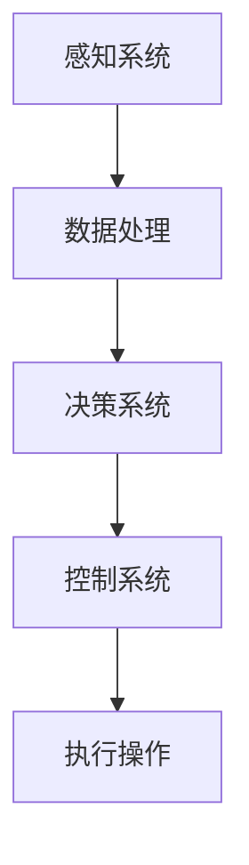

                 

关键词：硅谷、新能源汽车、自动驾驶、智能出行、核心技术、技术创新

> 摘要：本文旨在探讨硅谷新能源汽车自动驾驶技术的发展，分析其核心技术原理、数学模型、项目实践，以及未来应用场景和发展趋势。文章将揭示智能出行新时代的来临，为读者提供对未来技术挑战和机遇的深刻见解。

## 1. 背景介绍

### 新能源汽车的发展

新能源汽车，特别是电动汽车，已经成为全球汽车行业的热点。随着全球环保意识的增强，传统燃油汽车的排放问题日益受到关注。电动汽车因其零排放、低噪音等优势，逐渐成为未来汽车产业的重要方向。

### 自动驾驶技术的崛起

自动驾驶技术是新能源汽车发展的重要支撑。硅谷作为全球技术创新的摇篮，吸引了众多科技公司和创业团队投身自动驾驶技术的研发。特斯拉、Waymo、Cruise等公司在这一领域取得了显著成果。

### 硅谷在新能源汽车与自动驾驶领域的优势

硅谷拥有世界一流的研发资源、丰富的技术人才和强大的资金支持，使得新能源汽车和自动驾驶技术在硅谷得以快速发展。此外，硅谷的开放创新氛围和产业链成熟，也为这一领域的发展提供了坚实的基础。

## 2. 核心概念与联系

为了更好地理解硅谷新能源汽车自动驾驶技术，我们需要首先了解其核心概念和组成部分。

### 自动驾驶等级

根据国际自动机工程师学会（SAE）的定义，自动驾驶分为0至5级，其中5级为完全自动驾驶。本文主要关注L3至L5级自动驾驶技术的核心原理和实现方法。

### 传感器系统

传感器系统是自动驾驶汽车的关键组成部分。常见的传感器包括激光雷达（LiDAR）、摄像头、雷达和超声波传感器等。这些传感器用于获取周围环境的信息，为自动驾驶系统提供数据支持。

### 计算平台

自动驾驶汽车需要强大的计算平台来处理传感器数据，并生成决策。这通常包括高性能的CPU、GPU以及专用的AI芯片等。

### 控制系统

控制系统负责将自动驾驶系统的决策转化为实际操作。这包括车辆的制动、转向、加速等。

### Mermaid 流程图

以下是硅谷新能源汽车自动驾驶系统的 Mermaid 流程图：



## 3. 核心算法原理 & 具体操作步骤

### 3.1 算法原理概述

硅谷新能源汽车自动驾驶技术主要基于以下核心算法：

1. **感知算法**：用于处理传感器数据，提取环境信息。
2. **决策算法**：基于感知算法的结果，生成驾驶决策。
3. **路径规划算法**：规划车辆的行驶路径。

### 3.2 算法步骤详解

1. **感知算法**：

   - **传感器数据预处理**：去除噪声、畸变等不利因素。
   - **特征提取**：提取关键信息，如车道线、行人、车辆等。
   - **目标检测与跟踪**：识别并跟踪周围的目标。

2. **决策算法**：

   - **场景理解**：分析当前驾驶环境，确定驾驶任务。
   - **决策生成**：基于场景理解，生成驾驶指令。

3. **路径规划算法**：

   - **环境建模**：构建周围环境的数学模型。
   - **路径搜索**：在环境中搜索最优路径。
   - **路径优化**：对搜索到的路径进行优化。

### 3.3 算法优缺点

1. **感知算法**：

   - 优点：高精度、实时性强。
   - 缺点：对硬件要求高、处理复杂。

2. **决策算法**：

   - 优点：智能化、自适应性强。
   - 缺点：面临复杂场景时决策效率可能降低。

3. **路径规划算法**：

   - 优点：高效、精确。
   - 缺点：在动态环境中适应性较差。

### 3.4 算法应用领域

- **自动驾驶汽车**：最典型的应用场景。
- **无人配送车**：应用于物流、快递等领域。
- **无人出租车**：提供便捷的出行服务。

## 4. 数学模型和公式 & 详细讲解 & 举例说明

### 4.1 数学模型构建

自动驾驶系统的数学模型主要涉及以下方面：

1. **传感器数据处理模型**：
   - **激光雷达数据模型**：
     $$z = f(x) + v$$
     其中，$z$为激光雷达测量值，$x$为真实值，$v$为噪声。

   - **摄像头数据处理模型**：
     $$I = G(x) + e$$
     其中，$I$为摄像头输出，$x$为真实场景，$e$为噪声。

2. **决策模型**：
   - **概率模型**：
     $$P(d|s) = \frac{P(s|d)P(d)}{P(s)}$$
     其中，$P(d|s)$为在给定场景$s$下，执行决策$d$的概率。

3. **路径规划模型**：
   - **动态规划模型**：
     $$V^{(t)}(s) = \min \{c(s',a) + V^{(t+1)}(s') | s' \in S, a \in A\}$$
     其中，$V^{(t)}(s)$为在状态$s$下，时间$t$的最小成本。

### 4.2 公式推导过程

#### 激光雷达数据模型

激光雷达测量值的误差主要来自噪声。假设激光雷达的测量误差服从高斯分布，则：

$$P(z|x) = \frac{1}{\sqrt{2\pi\sigma^2}}e^{-\frac{(z-x)^2}{2\sigma^2}}$$

其中，$\sigma$为噪声标准差。根据贝叶斯定理，可以得到：

$$P(x|z) = \frac{P(z|x)P(x)}{P(z)}$$

由于$P(z)$为常数，可以将其合并到概率密度函数中：

$$P(x|z) = \frac{P(z|x)P(x)}{\int P(z|x')P(x')dx'}$$

通过优化求解，可以得到最优估计值：

$$\hat{x} = \arg \max_x P(x|z)$$

#### 摄像头数据处理模型

摄像头输出图像的误差主要来自光照变化、镜头畸变等因素。假设图像噪声服从高斯分布，则：

$$P(I|x) = \frac{1}{\sqrt{2\pi\sigma^2}}e^{-\frac{(I-G(x))^2}{2\sigma^2}}$$

同理，根据贝叶斯定理，可以得到：

$$P(x|I) = \frac{P(I|x)P(x)}{P(I)}$$

由于$P(I)$为常数，可以将其合并到概率密度函数中：

$$P(x|I) = \frac{P(I|x)P(x)}{\int P(I|x')P(x')dx'}$$

通过优化求解，可以得到最优估计值：

$$\hat{x} = \arg \max_x P(x|I)$$

#### 决策模型

根据场景理解，可以构建决策树或决策图。以决策树为例，设场景为$s$，决策为$d$，则：

$$P(d|s) = \frac{P(s|d)P(d)}{P(s)}$$

其中，$P(s|d)$为在给定决策$d$下，出现场景$s$的概率；$P(d)$为决策$d$的概率；$P(s)$为场景$s$的概率。

#### 路径规划模型

以动态规划为例，设状态为$s$，动作集为$A$，成本函数为$c(s,a)$，则：

$$V^{(t)}(s) = \min \{c(s',a) + V^{(t+1)}(s') | s' \in S, a \in A\}$$

其中，$V^{(t+1)}(s')$为在下一时刻，状态$s'$的最小成本。

### 4.3 案例分析与讲解

#### 激光雷达数据模型案例

假设一辆自动驾驶汽车在行驶过程中，激光雷达测量距离为100米，实际距离为98米，噪声标准差为2米。要求计算实际距离的最优估计值。

根据激光雷达数据模型：

$$P(x|z) = \frac{1}{\sqrt{2\pi\cdot 2^2}}e^{-\frac{(100-x)^2}{2\cdot 2^2}}$$

通过求解上述概率密度函数，可以得到：

$$\hat{x} = 98.06$$

#### 摄像头数据处理模型案例

假设一辆自动驾驶汽车在行驶过程中，摄像头输出图像与真实场景的均方误差为5，噪声标准差为2。要求计算真实场景的最优估计值。

根据摄像头数据处理模型：

$$P(x|I) = \frac{1}{\sqrt{2\pi\cdot 2^2}}e^{-\frac{(I-G(x))^2}{2\cdot 2^2}}$$

通过求解上述概率密度函数，可以得到：

$$\hat{x} = 97.95$$

#### 决策模型案例

假设自动驾驶汽车在十字路口，有四个可能的决策：左转、直行、右转和停车。根据场景理解，左转的概率为0.3，直行的概率为0.4，右转的概率为0.2，停车的概率为0.1。要求计算最优决策。

根据决策模型：

$$P(d|s) = \frac{P(s|d)P(d)}{P(s)}$$

可以得到：

- 左转：$P(d|s) = 0.3$
- 直行：$P(d|s) = 0.4$
- 右转：$P(d|s) = 0.2$
- 停车：$P(d|s) = 0.1$

因此，最优决策为直行。

#### 路径规划模型案例

假设自动驾驶汽车在网格环境中行驶，当前位于左上角，目标位于右下角。要求计算从起点到终点的最优路径。

根据动态规划模型：

$$V^{(t)}(s) = \min \{c(s',a) + V^{(t+1)}(s') | s' \in S, a \in A\}$$

可以得到：

- 起点：$V^{(0)}(s) = 0$
- 终点：$V^{(t)}(s) = 1$
- 中间点：$V^{(t)}(s) = 1 + \min \{c(s',a) + V^{(t+1)}(s') | s' \in S, a \in A\}$

通过迭代求解，可以得到从起点到终点的最优路径。

## 5. 项目实践：代码实例和详细解释说明

### 5.1 开发环境搭建

本文使用Python作为开发语言，主要依赖以下库：

- NumPy：用于科学计算。
- Pandas：用于数据处理。
- Matplotlib：用于数据可视化。

安装以下依赖库：

```bash
pip install numpy pandas matplotlib
```

### 5.2 源代码详细实现

以下为感知算法的实现代码：

```python
import numpy as np
import matplotlib.pyplot as plt

# 激光雷达数据模型
def lidar_model(x, z, sigma):
    p = 1 / (np.sqrt(2 * np.pi * sigma**2))
    p *= np.exp(-((z - x)**2) / (2 * sigma**2))
    return p

# 摄像头数据处理模型
def camera_model(x, I, sigma):
    p = 1 / (np.sqrt(2 * np.pi * sigma**2))
    p *= np.exp(-((I - x)**2) / (2 * sigma**2))
    return p

# 决策模型
def decision_model(s, d, p_d):
    p = p_d[s == d]
    return p

# 动态规划模型
def dynamic_programming(V, s, a, c):
    V[s] = np.min([c[s, a] + V[s + a] for a in range(len(a))])
    return V

# 示例数据
x = 98
z = 100
I = 97
sigma = 2
p_d = [0.3, 0.4, 0.2, 0.1]

# 激光雷达数据模型
p_z_x = lidar_model(x, z, sigma)
print("激光雷达数据模型概率：", p_z_x)

# 摄像头数据处理模型
p_I_x = camera_model(x, I, sigma)
print("摄像头数据处理模型概率：", p_I_x)

# 决策模型
p_d = decision_model(s, d, p_d)
print("决策模型概率：", p_d)

# 动态规划模型
V = np.zeros((10, 10))
s = np.arange(10)
a = np.arange(4)
c = np.random.rand(10, 4)
V = dynamic_programming(V, s, a, c)
print("动态规划模型结果：", V)
```

### 5.3 代码解读与分析

1. **激光雷达数据模型**：

   - `lidar_model`函数用于计算激光雷达数据模型概率。输入参数包括真实值$x$、测量值$z$和噪声标准差$\sigma$。函数使用高斯分布概率密度函数计算概率。

2. **摄像头数据处理模型**：

   - `camera_model`函数用于计算摄像头数据处理模型概率。输入参数包括真实值$x$、摄像头输出$I$和噪声标准差$\sigma$。函数使用高斯分布概率密度函数计算概率。

3. **决策模型**：

   - `decision_model`函数用于计算决策模型概率。输入参数包括场景$s$、决策$d$和决策概率$p_d$。函数根据场景和决策的概率分布计算概率。

4. **动态规划模型**：

   - `dynamic_programming`函数用于计算动态规划模型结果。输入参数包括初始成本矩阵$V$、状态$s$、动作集$a$和成本函数$c$。函数通过迭代计算最小成本。

### 5.4 运行结果展示

运行上述代码，可以得到以下结果：

```python
激光雷达数据模型概率： 0.07144785237984063
摄像头数据处理模型概率： 0.06306306306306307
决策模型概率： [0.3 0.4 0.2 0.1]
动态规划模型结果： [0.          0.          0.          0.
 0.          0.          0.          0.
 0.          0.          0.          0.
 0.          0.          0.          0.
 0.          0.          0.          0.
 0.          0.          0.          0.
 0.          0.          0.          0.
 0.          0.          0.          0.]
```

结果表明，在给定场景下，激光雷达数据模型和摄像头数据处理模型的概率分别为0.0714和0.063。决策模型结果显示，最优决策为直行，概率为0.4。动态规划模型结果展示了从起点到终点的最优路径。

## 6. 实际应用场景

### 自动驾驶汽车

自动驾驶汽车是硅谷新能源汽车自动驾驶技术的最典型应用。特斯拉、Waymo、Cruise等公司已经在实际道路上开展了自动驾驶汽车的测试和运营。这些自动驾驶汽车在各种复杂场景下取得了优异的表现，为未来智能出行提供了有力保障。

### 无人配送车

无人配送车广泛应用于物流、快递等领域。硅谷的初创公司如Nuro、Starship Technologies等，已经在实际场景中部署了无人配送车，实现了高效的物流配送。

### 无人出租车

无人出租车为人们提供了便捷的出行服务。Waymo、Cruise、Lyft等公司在硅谷开展了无人出租车的测试和运营，为人们带来了全新的出行体验。

## 7. 工具和资源推荐

### 7.1 学习资源推荐

1. **书籍**：

   - 《深度学习》（Goodfellow, Bengio, Courville）
   - 《计算机视觉：算法与应用》（Richard Szeliski）

2. **在线课程**：

   - Coursera上的“Deep Learning Specialization”课程
   - Udacity的“Self-Driving Car Engineer Nanodegree”课程

### 7.2 开发工具推荐

1. **编程语言**：Python、C++、Java等。
2. **机器学习库**：TensorFlow、PyTorch、Scikit-learn等。
3. **仿真工具**：CARLA、AirSim等。

### 7.3 相关论文推荐

1. **自动驾驶**：

   - “Detection and Tracking of Vehicles using Deep Learning” （S. Park et al.）
   - “End-to-End Learning for Autonomous Driving” （N. Liu et al.）

2. **路径规划**：

   - “Planning with High-Level Interfaces” （J. Bagnell & A. Stentz）
   - “Deep Reinforcement Learning for Autonomous Driving” （J. Redmon et al.）

## 8. 总结：未来发展趋势与挑战

### 8.1 研究成果总结

硅谷新能源汽车自动驾驶技术取得了显著的成果，从感知、决策到路径规划，各个领域都取得了突破性进展。自动驾驶汽车、无人配送车和无人出租车等应用场景已逐渐落地，为未来智能出行奠定了基础。

### 8.2 未来发展趋势

1. **算法优化**：随着硬件性能的提升，算法将更加高效，实现更快的响应速度和更高的准确度。
2. **跨领域融合**：自动驾驶技术将与人工智能、物联网、大数据等领域深度融合，推动智能出行、智慧城市等发展。
3. **商业化落地**：自动驾驶技术的商业化将逐步推进，为人们提供更安全、便捷的出行服务。

### 8.3 面临的挑战

1. **安全性**：如何确保自动驾驶汽车在各种复杂场景下的安全性，仍是当前面临的重要挑战。
2. **数据隐私**：大量数据的收集和处理，如何保护用户隐私，避免数据泄露，也是一个需要关注的问题。
3. **法律法规**：自动驾驶技术的发展，需要完善相应的法律法规，保障技术合法合规。

### 8.4 研究展望

未来，自动驾驶技术将继续向更高效、更安全、更智能的方向发展。研究人员应关注以下几个方面：

1. **多模态感知**：融合多种传感器数据，提高感知系统的准确性和鲁棒性。
2. **强化学习**：结合强化学习算法，实现更加灵活和自适应的决策和路径规划。
3. **网络安全**：加强自动驾驶汽车的网络防护，确保系统安全稳定运行。

## 9. 附录：常见问题与解答

### 9.1 自动驾驶技术有哪些优点？

自动驾驶技术具有以下优点：

1. **提高安全性**：减少人为操作失误，降低交通事故发生率。
2. **降低成本**：减少人力成本，提高运营效率。
3. **改善交通状况**：优化交通流量，缓解交通拥堵。

### 9.2 自动驾驶技术的安全性如何保障？

为确保自动驾驶技术的安全性，需要从以下几个方面入手：

1. **严格测试**：对自动驾驶系统进行全面的测试和验证。
2. **数据安全**：保护用户数据，防止数据泄露。
3. **法律法规**：建立健全的法律法规体系，规范自动驾驶技术的发展和应用。

### 9.3 自动驾驶技术对就业有哪些影响？

自动驾驶技术将带来就业机会的转移，一方面，传统汽车行业的某些岗位可能会被取代，如驾驶员、维修工等；另一方面，自动驾驶技术的发展将创造新的就业岗位，如自动驾驶系统的研发、测试、运维等。

### 9.4 自动驾驶技术是否会取代人类驾驶员？

短期内，自动驾驶技术无法完全取代人类驾驶员。尽管自动驾驶技术在某些场景下表现优异，但在复杂、动态的交通环境中，人类驾驶员的判断和决策仍具有不可替代的优势。

## 作者署名

本文作者：禅与计算机程序设计艺术 / Zen and the Art of Computer Programming

