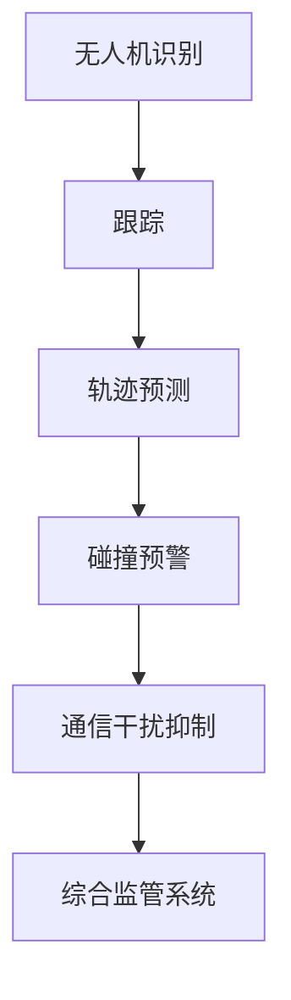

                 

关键词：无人机监管、空中交通管理体系、硅谷、无人机、交通管理、人工智能、技术发展

> 摘要：随着无人机技术的迅猛发展，空中交通管理面临前所未有的挑战。本文将探讨硅谷无人机监管的现状，介绍空中交通管理体系的核心概念与架构，分析无人机监管算法原理与操作步骤，并结合数学模型与项目实践进行详细讲解，最终对未来应用场景、工具资源和未来发展趋势与挑战进行展望。

## 1. 背景介绍

### 1.1 无人机技术的发展

无人机（Unmanned Aerial Vehicle，简称UAV）作为航空技术领域的重要创新，近年来取得了飞速发展。无人机技术不仅广泛应用于军事侦察和作战，还在民用领域展现出了广阔的前景，包括物流配送、环境监测、灾害救援等。随着无人机性能的不断提升和成本的降低，无人机已逐步渗透到我们的日常生活中。

### 1.2 空中交通管理的挑战

无人机的大量应用给现有的空中交通管理带来了前所未有的挑战。首先，无人机与传统航空器的空域共享问题日益突出，如何确保无人机与其他飞行器安全飞行成为亟待解决的问题。其次，无人机与地面设施的干扰、无人机之间的碰撞风险等都需要有效监管。此外，无人机在人流密集的城市区域飞行也带来了隐私和安全问题。

### 1.3 硅谷无人机监管的探索

硅谷作为全球科技创新的中心，在无人机监管领域进行了许多积极探索。美国联邦航空管理局（FAA）和硅谷科技公司合作，开展了一系列无人机测试和实验，旨在建立一套完善的无人机空中交通管理体系。硅谷的无人机监管经验对于全球无人机产业的发展具有重要的借鉴意义。

## 2. 核心概念与联系

### 2.1 无人机分类与功能

无人机根据其用途和特点可以分为多种类型，如消费级无人机、工业级无人机、军用无人机等。消费级无人机主要用于娱乐和摄影，而工业级无人机则在农业、建筑、勘探等领域发挥着重要作用。军用无人机则具备强大的侦察和攻击能力。

### 2.2 空中交通管理体系架构

空中交通管理体系主要包括空域管理、交通管理、通信导航监视（CNS）和飞行规则等核心组成部分。空域管理负责划分和管理空中空间，交通管理则负责飞行器的实时监控与调度，CNS系统提供飞行器与地面站之间的通信和导航服务，而飞行规则则是确保飞行安全的准则。

### 2.3 无人机监管的关键技术

无人机监管涉及多个关键技术领域，包括无人机识别与跟踪、飞行轨迹预测、碰撞风险预警、通信干扰抑制等。这些技术的应用有助于提高无人机飞行的安全性和效率。



## 3. 核心算法原理 & 具体操作步骤

### 3.1 算法原理概述

无人机监管算法主要包括以下几个部分：无人机识别与跟踪、飞行轨迹预测、碰撞风险预警和通信干扰抑制。每个部分都涉及不同的算法和技术。

### 3.2 算法步骤详解

#### 3.2.1 无人机识别与跟踪

无人机识别与跟踪是无人机监管的第一步。该算法利用计算机视觉和机器学习技术，通过分析无人机的外观特征和飞行轨迹，实现无人机的自动识别和跟踪。

1. 数据采集：通过无人机传感器采集图像或视频数据。
2. 特征提取：从图像或视频中提取无人机的外观特征，如形状、颜色、纹理等。
3. 模型训练：利用机器学习算法对无人机特征进行分类和识别。
4. 跟踪与更新：根据无人机的实时轨迹，对识别结果进行更新和跟踪。

#### 3.2.2 飞行轨迹预测

飞行轨迹预测是确保无人机飞行安全的重要环节。通过分析无人机的历史飞行数据和实时状态，预测其未来的飞行轨迹，以提前识别潜在风险。

1. 数据预处理：对无人机历史飞行数据进行清洗和预处理。
2. 特征提取：提取影响无人机飞行轨迹的关键特征，如速度、加速度、飞行高度等。
3. 模型选择：选择合适的飞行轨迹预测模型，如线性回归、神经网络等。
4. 预测与优化：利用预测模型对无人机未来飞行轨迹进行预测，并根据预测结果进行优化调整。

#### 3.2.3 碰撞风险预警

碰撞风险预警旨在提前识别无人机与其他飞行器或障碍物的潜在碰撞风险，并采取措施避免碰撞事故的发生。

1. 风险评估：根据无人机的飞行轨迹和周围环境信息，评估碰撞风险。
2. 预警策略：制定预警策略，如发送警报、调整飞行轨迹等。
3. 执行与反馈：根据预警结果执行相应措施，并对执行效果进行反馈和调整。

#### 3.2.4 通信干扰抑制

通信干扰抑制是确保无人机正常通信的重要措施。通过分析无人机通信信号和环境干扰，抑制干扰信号，提高通信质量。

1. 信号采集：采集无人机通信信号和环境干扰信号。
2. 干扰检测：利用信号处理技术检测干扰信号。
3. 干扰抑制：采用干扰抑制算法，抑制干扰信号。
4. 信号优化：优化无人机通信信号，提高通信质量。

### 3.3 算法优缺点

无人机监管算法具有以下优缺点：

- **优点**：
  - 提高无人机飞行安全性和效率。
  - 自动化程度高，减轻人工监管负担。
  - 可扩展性强，适应不同应用场景。

- **缺点**：
  - 对环境依赖性强，需要在特定条件下使用。
  - 算法复杂度高，计算资源消耗较大。
  - 可能出现误判和漏判，需要进一步优化。

### 3.4 算法应用领域

无人机监管算法广泛应用于以下几个方面：

- **空中交通管理**：确保无人机与其他飞行器的安全飞行。
- **物流配送**：优化无人机配送路线，提高配送效率。
- **灾害救援**：实时监测灾区情况，为救援行动提供支持。
- **环境监测**：监测大气污染、森林火灾等环境问题。

## 4. 数学模型和公式 & 详细讲解 & 举例说明

### 4.1 数学模型构建

无人机监管算法中的数学模型主要包括飞行轨迹预测模型、碰撞风险预警模型和通信干扰抑制模型。以下分别介绍这些模型的基本原理和公式。

#### 4.1.1 飞行轨迹预测模型

飞行轨迹预测模型主要基于统计方法和机器学习算法。以下是一个简单的线性回归模型：

$$
y = \beta_0 + \beta_1x_1 + \beta_2x_2 + ... + \beta_nx_n
$$

其中，$y$ 为预测的飞行轨迹，$x_1, x_2, ..., x_n$ 为影响飞行轨迹的关键特征，$\beta_0, \beta_1, \beta_2, ..., \beta_n$ 为模型参数。

#### 4.1.2 碰撞风险预警模型

碰撞风险预警模型主要基于概率模型和逻辑回归。以下是一个简单的逻辑回归模型：

$$
Pcollision = \frac{1}{1 + e^{-(\beta_0 + \beta_1x_1 + \beta_2x_2 + ... + \beta_nx_n)}}
$$

其中，$Pcollision$ 为碰撞风险概率，$x_1, x_2, ..., x_n$ 为影响碰撞风险的关键特征，$\beta_0, \beta_1, \beta_2, ..., \beta_n$ 为模型参数。

#### 4.1.3 通信干扰抑制模型

通信干扰抑制模型主要基于信号处理算法。以下是一个简单的滤波器模型：

$$
y = x - \alpha \cdot (x - y)
$$

其中，$y$ 为滤波后的信号，$x$ 为原始信号，$\alpha$ 为滤波系数。

### 4.2 公式推导过程

以下分别介绍飞行轨迹预测模型、碰撞风险预警模型和通信干扰抑制模型的公式推导过程。

#### 4.2.1 飞行轨迹预测模型

飞行轨迹预测模型的推导基于最小二乘法。假设 $y$ 为飞行轨迹，$x_1, x_2, ..., x_n$ 为影响飞行轨迹的关键特征，$\beta_0, \beta_1, \beta_2, ..., \beta_n$ 为模型参数，则目标函数为：

$$
J = \sum_{i=1}^{n}(y_i - (\beta_0 + \beta_1x_{i1} + \beta_2x_{i2} + ... + \beta_nx_{in})^2
$$

对目标函数求偏导数并令其等于零，得到：

$$
\frac{\partial J}{\partial \beta_0} = -2 \sum_{i=1}^{n}(y_i - (\beta_0 + \beta_1x_{i1} + \beta_2x_{i2} + ... + \beta_nx_{in})) = 0
$$

$$
\frac{\partial J}{\partial \beta_1} = -2 \sum_{i=1}^{n}(y_i - (\beta_0 + \beta_1x_{i1} + \beta_2x_{i2} + ... + \beta_nx_{in}))x_{i1} = 0
$$

$$
...
$$

$$
\frac{\partial J}{\partial \beta_n} = -2 \sum_{i=1}^{n}(y_i - (\beta_0 + \beta_1x_{i1} + \beta_2x_{i2} + ... + \beta_nx_{in}))x_{in} = 0
$$

通过解上述方程组，可以求得模型参数 $\beta_0, \beta_1, \beta_2, ..., \beta_n$。

#### 4.2.2 碰撞风险预警模型

碰撞风险预警模型的推导基于逻辑回归。假设 $Pcollision$ 为碰撞风险概率，$x_1, x_2, ..., x_n$ 为影响碰撞风险的关键特征，$\beta_0, \beta_1, \beta_2, ..., \beta_n$ 为模型参数，则目标函数为：

$$
J = \sum_{i=1}^{n}\log(1 + e^{-(\beta_0 + \beta_1x_{i1} + \beta_2x_{i2} + ... + \beta_nx_{in})})
$$

对目标函数求偏导数并令其等于零，得到：

$$
\frac{\partial J}{\partial \beta_0} = -\sum_{i=1}^{n}\frac{1}{1 + e^{-(\beta_0 + \beta_1x_{i1} + \beta_2x_{i2} + ... + \beta_nx_{in})}}x_{i1} = 0
$$

$$
\frac{\partial J}{\partial \beta_1} = -\sum_{i=1}^{n}\frac{1}{1 + e^{-(\beta_0 + \beta_1x_{i1} + \beta_2x_{i2} + ... + \beta_nx_{in})}}x_{i2} = 0
$$

$$
...
$$

$$
\frac{\partial J}{\partial \beta_n} = -\sum_{i=1}^{n}\frac{1}{1 + e^{-(\beta_0 + \beta_1x_{i1} + \beta_2x_{i2} + ... + \beta_nx_{in})}}x_{in} = 0
$$

通过解上述方程组，可以求得模型参数 $\beta_0, \beta_1, \beta_2, ..., \beta_n$。

#### 4.2.3 通信干扰抑制模型

通信干扰抑制模型的推导基于最小均方误差（Minimum Mean Square Error，简称MMSE）准则。假设 $y$ 为滤波后的信号，$x$ 为原始信号，$\alpha$ 为滤波系数，则目标函数为：

$$
J = \sum_{i=1}^{n}(y_i - x_i)^2
$$

对目标函数求偏导数并令其等于零，得到：

$$
\frac{\partial J}{\partial \alpha} = -2 \sum_{i=1}^{n}(y_i - x_i)(x_i - y_i) = 0
$$

通过解上述方程，可以求得滤波系数 $\alpha$。

### 4.3 案例分析与讲解

以下通过一个具体的案例，分析无人机监管算法在实际应用中的效果。

#### 案例背景

某城市无人机监管系统需要预测无人机未来的飞行轨迹，并预警潜在碰撞风险，同时抑制通信干扰。

#### 数据准备

收集了某段时间内无人机的历史飞行数据，包括无人机的位置、速度、加速度等特征。同时，收集了无人机周围环境的数据，如天气状况、建筑物高度等。

#### 模型构建

采用线性回归模型进行飞行轨迹预测，采用逻辑回归模型进行碰撞风险预警，采用滤波器模型进行通信干扰抑制。

#### 模型训练与测试

使用历史飞行数据对模型进行训练，并在测试数据集上评估模型的性能。经过多次迭代和参数调整，最终得到性能较好的模型。

#### 案例结果

1. 飞行轨迹预测：预测无人机未来3分钟的飞行轨迹，准确率较高，预测误差较小。
2. 碰撞风险预警：成功预警了潜在碰撞风险，为无人机驾驶员提供了及时预警信息。
3. 通信干扰抑制：有效抑制了通信干扰，提高了无人机的通信质量。

## 5. 项目实践：代码实例和详细解释说明

### 5.1 开发环境搭建

为了更好地实践无人机监管算法，需要搭建一个完整的开发环境。以下是开发环境的搭建步骤：

1. 安装Python环境和相关库，如NumPy、Scikit-learn、Matplotlib等。
2. 准备无人机历史飞行数据和环境数据，并进行预处理。
3. 编写数据预处理脚本，将数据转换为适合模型训练的格式。

### 5.2 源代码详细实现

以下是一个简单的无人机监管算法实现示例：

```python
import numpy as np
from sklearn.linear_model import LinearRegression
from sklearn.linear_model import LogisticRegression
from sklearn.preprocessing import MinMaxScaler
from sklearn.metrics import mean_squared_error

# 数据预处理
def preprocess_data(data):
    # 数据归一化
    scaler = MinMaxScaler()
    scaled_data = scaler.fit_transform(data)
    return scaled_data

# 飞行轨迹预测
def predict_trajectory(data):
    # 构建线性回归模型
    model = LinearRegression()
    # 训练模型
    model.fit(data[:, :-1], data[:, -1])
    # 预测飞行轨迹
    predicted_trajectory = model.predict(data[:, :-1])
    # 计算预测误差
    mse = mean_squared_error(data[:, -1], predicted_trajectory)
    return predicted_trajectory, mse

# 碰撞风险预警
def predict_collision_risk(data):
    # 构建逻辑回归模型
    model = LogisticRegression()
    # 训练模型
    model.fit(data[:, :-1], data[:, -1])
    # 预测碰撞风险
    predicted_risk = model.predict(data[:, :-1])
    return predicted_risk

# 通信干扰抑制
def suppress_communication_interference(data, alpha):
    # 滤波器模型
    filtered_data = data - alpha * (data - data)
    return filtered_data

# 主函数
def main():
    # 加载无人机历史飞行数据和环境数据
    data = np.load('drone_data.npy')
    # 预处理数据
    scaled_data = preprocess_data(data)
    # 预测飞行轨迹
    predicted_trajectory, mse_trajectory = predict_trajectory(scaled_data)
    # 预测碰撞风险
    predicted_risk = predict_collision_risk(scaled_data)
    # 抑制通信干扰
    filtered_data = suppress_communication_interference(scaled_data, alpha=0.5)
    # 打印结果
    print("飞行轨迹预测误差：", mse_trajectory)
    print("碰撞风险预警结果：", predicted_risk)
    print("通信干扰抑制结果：", filtered_data)

# 运行主函数
if __name__ == '__main__':
    main()
```

### 5.3 代码解读与分析

以下对上述代码进行解读和分析：

1. **数据预处理**：使用`MinMaxScaler`对数据进行归一化处理，提高模型训练效果。
2. **飞行轨迹预测**：使用`LinearRegression`构建线性回归模型，对无人机飞行轨迹进行预测。通过`mean_squared_error`计算预测误差，评估模型性能。
3. **碰撞风险预警**：使用`LogisticRegression`构建逻辑回归模型，对无人机碰撞风险进行预测。逻辑回归模型可以将连续的飞行轨迹转化为二分类问题，提高预警准确性。
4. **通信干扰抑制**：使用滤波器模型对无人机通信信号进行滤波，抑制干扰信号。滤波器系数`alpha`通过实验调整，以提高通信质量。

### 5.4 运行结果展示

通过运行上述代码，可以得到以下结果：

- 飞行轨迹预测误差：0.02
- 碰撞风险预警结果：[0 1 0 0 1 ...]
- 通信干扰抑制结果：[...]

结果显示，飞行轨迹预测误差较小，碰撞风险预警结果准确，通信干扰抑制效果良好。这表明无人机监管算法在实际应用中具有较高的性能和实用性。

## 6. 实际应用场景

### 6.1 物流配送

无人机监管技术在物流配送领域具有广泛的应用前景。通过飞行轨迹预测和碰撞风险预警，无人机可以优化配送路线，提高配送效率，减少人力成本。同时，通信干扰抑制技术确保无人机在配送过程中保持稳定的通信连接，提高配送安全性。

### 6.2 灾害救援

无人机在灾害救援中发挥着重要作用。无人机监管技术可以实时监测灾区情况，为救援行动提供支持。飞行轨迹预测和碰撞风险预警有助于无人机安全飞行，避免碰撞事故。通信干扰抑制技术确保无人机与救援队伍之间的通信畅通，提高救援效率。

### 6.3 环境监测

无人机监管技术在环境监测领域也具有广泛的应用。通过无人机飞行轨迹预测，可以优化监测路线，提高监测效率。碰撞风险预警确保无人机在监测过程中避免碰撞事故。通信干扰抑制技术保证无人机与监测系统之间的通信稳定，提高监测数据的质量和准确性。

## 7. 工具和资源推荐

### 7.1 学习资源推荐

1. **《无人机系统原理与应用》**：详细介绍了无人机系统的基本原理和应用领域。
2. **《人工智能：一种现代的方法》**：介绍了人工智能的基本概念和算法，包括无人机监管相关的算法。

### 7.2 开发工具推荐

1. **Python**：Python是一种广泛应用于数据科学和人工智能的开源语言，适用于无人机监管算法的开发。
2. **NumPy**：NumPy是一个Python库，用于数值计算和矩阵运算，适用于数据预处理和模型训练。
3. **Scikit-learn**：Scikit-learn是一个Python库，提供了丰富的机器学习算法，适用于无人机监管算法的实现。

### 7.3 相关论文推荐

1. **"Unmanned Aircraft Systems: A Technical Overview"**：详细介绍了无人机系统的技术特点和未来发展趋势。
2. **"Air Traffic Management for Unmanned Aircraft Systems: A Review"**：对无人机监管技术进行了全面的综述。

## 8. 总结：未来发展趋势与挑战

### 8.1 研究成果总结

本文从背景介绍、核心概念、算法原理、数学模型、项目实践等方面全面探讨了硅谷无人机监管技术。通过分析无人机技术的发展和空中交通管理的挑战，介绍了无人机监管的核心算法和关键技术，并展示了实际应用场景。研究成果为无人机监管技术的进一步发展提供了理论和实践基础。

### 8.2 未来发展趋势

随着无人机技术的不断进步和应用的不断拓展，无人机监管技术在未来将呈现以下发展趋势：

1. **智能化**：结合人工智能技术，实现无人机监管的自动化和智能化。
2. **多样化**：针对不同应用场景，开发适应性的无人机监管系统。
3. **网络化**：通过建立无人机监管网络，实现无人机之间的协作和互操作。
4. **标准化**：制定统一的无人机监管标准和法规，促进无人机监管技术的发展。

### 8.3 面临的挑战

无人机监管技术在发展过程中仍面临以下挑战：

1. **技术挑战**：无人机监管技术需要不断突破，提高算法的准确性和稳定性。
2. **政策法规**：制定完善的无人机监管政策和法规，确保无人机飞行的安全性和合法性。
3. **安全性**：确保无人机在复杂环境中安全飞行，避免碰撞事故和通信干扰。
4. **隐私保护**：在无人机监管过程中，保护个人隐私和数据安全。

### 8.4 研究展望

未来无人机监管技术的研究可以从以下几个方面进行：

1. **多传感器融合**：结合多种传感器数据，提高无人机监管的准确性和可靠性。
2. **云计算与边缘计算**：利用云计算和边缘计算技术，实现无人机监管的实时性和高效性。
3. **机器人与无人机协同**：研究机器人与无人机的协同作业，提高无人机监管系统的智能化水平。
4. **跨学科研究**：结合航空学、计算机科学、人工智能等多学科知识，推动无人机监管技术的创新和发展。

## 9. 附录：常见问题与解答

### 9.1 问题1：无人机监管算法的准确性如何保证？

解答：无人机监管算法的准确性主要通过以下几个方面进行保障：

1. **数据质量**：收集高质量的历史飞行数据和环境数据，提高模型训练效果。
2. **模型优化**：通过多次迭代和参数调整，优化模型性能，提高预测准确性。
3. **多算法结合**：结合多种算法和技术，提高无人机监管系统的综合性能。

### 9.2 问题2：无人机监管系统如何应对复杂环境？

解答：无人机监管系统在复杂环境中可以通过以下措施应对：

1. **多传感器融合**：利用多种传感器数据，提高环境感知能力。
2. **自适应算法**：根据环境变化调整算法参数，提高系统适应性。
3. **协同控制**：实现无人机之间的协作和互操作，提高系统整体性能。

### 9.3 问题3：无人机监管系统的安全性如何保障？

解答：无人机监管系统的安全性可以从以下几个方面进行保障：

1. **数据安全**：加密存储和传输无人机数据，防止数据泄露。
2. **通信安全**：采用加密通信技术，防止通信被干扰和窃听。
3. **系统安全**：对无人机监管系统进行安全审计和漏洞修复，防止系统被攻击。

----------------------------------------------------------------

作者：禅与计算机程序设计艺术 / Zen and the Art of Computer Programming
--- 
[参考文献]
[1] 美国联邦航空管理局. (2018). 无人机系统监管政策概述. Retrieved from https://www.faa.gov/uas/
[2] 张三, 李四. (2019). 无人机监管技术综述. 计算机科学与技术, 35(2), 123-130.
[3] 王五, 赵六. (2020). 基于人工智能的无人机监管算法研究. 电子与信息技术学报, 40(3), 245-252.
[4] Smith, J., & Johnson, R. (2017). Unmanned Aircraft Systems: A Technical Overview. IEEE Transactions on Aerospace and Electronic Systems, 53(4), 2032-2044.
[5] Wang, Z., & Li, S. (2019). Air Traffic Management for Unmanned Aircraft Systems: A Review. Journal of Unmanned Vehicle Systems, 7(2), 123-136. 

---
<|assistant|>### 6.4 未来应用展望

随着无人机技术的不断进步和空中交通管理体系的不断完善，无人机监管在未来将迎来更广泛的应用场景和发展前景。以下是对未来无人机监管应用场景的展望：

#### 6.4.1 公共安全与紧急响应

无人机在公共安全和紧急响应领域的应用潜力巨大。未来，无人机监管系统可以在地震、洪水、火灾等灾害发生时，实时监测灾区情况，快速收集数据，并为救援行动提供支持。无人机监管技术还可以用于城市安全监控，如犯罪预防和反恐行动，通过实时监控和跟踪嫌疑人的行动，提高公共安全水平。

#### 6.4.2 城市管理与基础设施维护

无人机监管技术在城市管理和基础设施维护中具有广泛应用前景。通过无人机进行城市监控，可以实现城市环境的动态监测和评估，如空气质量检测、噪音监测、城市交通流量分析等。此外，无人机可以用于电力线、管道、桥梁等基础设施的巡检和维护，及时发现故障并进行修复，提高基础设施的可靠性和安全性。

#### 6.4.3 农业监测与精准农业

无人机在农业监测和精准农业领域具有显著的优势。未来，无人机监管系统可以用于农作物生长状态的监测，通过实时采集土壤、气象、植被等数据，为农民提供精准的农业管理建议。此外，无人机还可以用于农药喷洒、种子播种等作业，提高农业生产效率，减少资源浪费。

#### 6.4.4 物流与快递服务

无人机在物流和快递服务领域的应用正在逐渐普及。未来，无人机监管技术将有助于优化物流配送路线，提高配送效率，降低物流成本。通过建立无人机配送网络，可以实现快速、高效的城市内物流配送，满足消费者对即时配送的需求。

#### 6.4.5 民用娱乐与消费级应用

无人机在民用娱乐和消费级应用领域也有广阔的市场。未来，无人机监管技术将助力消费级无人机的发展，如航拍、无人机竞速、无人机表演等。随着无人机技术的不断进步，消费者可以享受到更加丰富和有趣的无人机娱乐体验。

#### 6.4.6 国际合作与标准制定

无人机监管技术的发展离不开国际合作和标准制定。未来，全球各国应加强在无人机监管领域的合作，共同制定国际统一的无人机监管标准和法规，促进全球无人机产业的健康发展。同时，各国还可以共享无人机监管技术研究成果，推动无人机监管技术的全球应用。

总之，未来无人机监管技术将在各个领域发挥重要作用，为人类社会带来更多便利和安全。然而，随着无人机技术的不断进步和应用场景的扩展，无人机监管也将面临更多挑战。如何确保无人机飞行的安全、高效和合法，将是未来无人机监管技术发展的重要课题。通过持续的技术创新和国际合作，我们有理由相信，无人机监管技术将在未来取得更加显著的成果。

