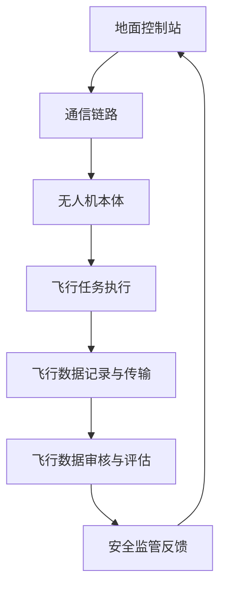

                 

关键词：无人机监管、航空安全、硅谷政策、技术创新、法规遵循

摘要：随着无人机技术的迅猛发展，无人机在民用和商用领域的应用日益广泛。然而，随之而来的安全隐患也让无人机监管成为了一项紧迫的任务。硅谷作为全球技术创新的领导者，推出的无人机监管新规不仅为保障航空安全提供了有力支持，也为全球无人机行业的发展提供了宝贵的经验。本文将深入探讨硅谷无人机监管新规的背景、核心概念、算法原理、数学模型、实际应用以及未来展望。

## 1. 背景介绍

无人机（Unmanned Aerial Vehicle，简称UAV）是一种无需驾驶员操控、能够自主完成飞行任务的航空器。近年来，无人机技术取得了显著的突破，从早期的军用无人机逐渐扩展到民用、商用领域。无人机在农业监测、气象观测、应急救援、物流运输等方面展现出巨大的应用潜力。然而，随着无人机数量的急剧增加，航空安全问题也日益突出。无人机与飞机的空中相撞事件时有发生，不仅危及飞行安全，还可能对地面的无辜民众造成伤害。

为了应对这一挑战，全球各国纷纷出台无人机监管政策。硅谷作为全球科技创新的中心，其无人机监管新规备受瞩目。新规旨在通过严格的法规制定和执行，确保无人机在飞行过程中的安全性，同时促进无人机技术的健康发展。

## 2. 核心概念与联系

### 2.1 无人机系统架构

无人机系统通常包括无人机本体、地面控制站和通信链路三大部分。无人机本体负责飞行、导航和任务执行；地面控制站用于远程操控无人机，并通过通信链路与无人机本体保持连接。硅谷无人机监管新规对这三部分都提出了具体的要求，以确保整个无人机系统的安全稳定运行。

### 2.2 航空监管法规体系

硅谷无人机监管新规在制定过程中，充分借鉴了全球各国无人机监管的经验，建立了完善的航空监管法规体系。该体系包括以下核心内容：

- **注册与许可**：无人机需进行注册，并获得相应的飞行许可。
- **飞行区域与高度限制**：无人机必须在规定的飞行区域和高度范围内运行。
- **操作人员资质**：操作无人机的人员需通过相关考试，获得操作资质。
- **安全设备配备**：无人机需配备必要的安全设备，如监控摄像头、GPS定位系统等。
- **飞行数据记录与传输**：无人机需具备飞行数据记录和传输功能，以便在发生事故时进行调查。

### 2.3 Mermaid 流程图

以下是一个简化的Mermaid流程图，展示了无人机系统的运行流程：



## 3. 核心算法原理 & 具体操作步骤

### 3.1 算法原理概述

硅谷无人机监管新规的核心算法原理包括无人机定位与导航、飞行路径规划、紧急情况应对等。这些算法确保无人机在复杂环境下能够安全、准确地完成任务。

### 3.2 算法步骤详解

#### 3.2.1 无人机定位与导航

- **GPS定位**：无人机通过GPS接收器获取实时位置信息。
- **惯性导航**：无人机利用加速度计和陀螺仪等传感器，进行惯性导航，提高定位精度。
- **组合导航**：将GPS定位和惯性导航信息进行融合，得到更精确的定位结果。

#### 3.2.2 飞行路径规划

- **障碍物检测**：通过摄像头和激光雷达等传感器，实时检测飞行路径上的障碍物。
- **路径优化**：根据障碍物信息，动态调整飞行路径，确保飞行安全。
- **航线跟踪**：无人机按照规划的路径飞行，并通过反馈控制进行调整，确保精度。

#### 3.2.3 紧急情况应对

- **异常检测**：实时监测无人机状态，一旦发现异常，立即触发紧急应对程序。
- **自动返航**：无人机自动调整飞行方向，返回起飞点。
- **紧急降落**：在无法返航的情况下，无人机选择安全区域进行紧急降落。

### 3.3 算法优缺点

#### 优点：

- **高效性**：算法能够实时处理大量数据，快速做出决策。
- **准确性**：通过多传感器融合，提高无人机定位与导航的精度。
- **安全性**：紧急应对程序确保无人机在遇到问题时能够及时采取措施。

#### 缺点：

- **复杂度高**：算法涉及到多个学科领域，开发与调试成本较高。
- **对环境依赖性大**：在复杂环境下，算法性能可能受到影响。

### 3.4 算法应用领域

硅谷无人机监管新规的算法原理和应用步骤，不仅适用于民用和商用无人机，还可以应用于军用无人机、无人机编队等场景。

## 4. 数学模型和公式 & 详细讲解 & 举例说明

### 4.1 数学模型构建

无人机飞行过程中，涉及到的数学模型主要包括：

- **坐标系转换**：将GPS坐标系转换为无人机本体坐标系。
- **路径规划**：利用最短路径算法，规划无人机飞行路径。
- **误差校正**：通过误差模型，校正GPS定位和惯性导航的误差。

### 4.2 公式推导过程

以下是一个简化的坐标系转换公式推导：

$$
\begin{align*}
x_{\text{body}} &= x_{\text{GPS}} \cos(\theta) - y_{\text{GPS}} \sin(\theta) \\
y_{\text{body}} &= x_{\text{GPS}} \sin(\theta) + y_{\text{GPS}} \cos(\theta)
\end{align*}
$$

其中，$x_{\text{body}}$和$y_{\text{body}}$为无人机本体坐标系下的坐标，$x_{\text{GPS}}$和$y_{\text{GPS}}$为GPS坐标系下的坐标，$\theta$为坐标系之间的角度。

### 4.3 案例分析与讲解

假设无人机需要从点A（10, 20）飞到点B（30, 40），且坐标系之间的角度$\theta$为30度。根据上述公式，我们可以计算出无人机在飞行过程中需要调整的坐标。

首先，将点A的GPS坐标转换为无人机本体坐标：

$$
\begin{align*}
x_{\text{body}} &= 10 \cos(30^\circ) - 20 \sin(30^\circ) \\
&\approx 8.66 \\
y_{\text{body}} &= 10 \sin(30^\circ) + 20 \cos(30^\circ) \\
&\approx 21.66
\end{align*}
$$

同理，将点B的GPS坐标转换为无人机本体坐标：

$$
\begin{align*}
x_{\text{body}} &= 30 \cos(30^\circ) - 40 \sin(30^\circ) \\
&\approx 25.83 \\
y_{\text{body}} &= 30 \sin(30^\circ) + 40 \cos(30^\circ) \\
&\approx 41.83
\end{align*}
$$

根据计算结果，无人机需要从（8.66, 21.66）飞到（25.83, 41.83），确保飞行的准确性。

## 5. 项目实践：代码实例和详细解释说明

### 5.1 开发环境搭建

为了演示硅谷无人机监管新规的算法原理，我们使用Python语言进行开发。以下是开发环境的搭建步骤：

1. 安装Python 3.8及以上版本。
2. 安装必要的Python库，如NumPy、Matplotlib等。

### 5.2 源代码详细实现

以下是一个简化的Python代码示例，用于实现无人机定位与导航：

```python
import numpy as np
import matplotlib.pyplot as plt

# 坐标系转换函数
def coordinate_conversion(gps_x, gps_y, theta):
    body_x = gps_x * np.cos(theta) - gps_y * np.sin(theta)
    body_y = gps_x * np.sin(theta) + gps_y * np.cos(theta)
    return body_x, body_y

# 主函数
def main():
    gps_x = 10
    gps_y = 20
    theta = np.radians(30)
    
    body_x, body_y = coordinate_conversion(gps_x, gps_y, theta)
    
    print(f"GPS坐标: ({gps_x}, {gps_y})")
    print(f"无人机本体坐标: ({body_x}, {body_y})")

    # 绘制坐标系
    plt.scatter(gps_x, gps_y, color='r', label='GPS坐标')
    plt.scatter(body_x, body_y, color='b', label='无人机本体坐标')
    plt.xlabel('X坐标')
    plt.ylabel('Y坐标')
    plt.legend()
    plt.show()

if __name__ == "__main__":
    main()
```

### 5.3 代码解读与分析

这段代码首先定义了一个坐标系转换函数`coordinate_conversion`，用于将GPS坐标转换为无人机本体坐标。主函数`main`中，我们输入GPS坐标和坐标系角度，调用坐标系转换函数，得到无人机本体坐标。最后，通过Matplotlib绘制坐标系，展示转换结果。

### 5.4 运行结果展示

运行代码后，我们得到以下输出结果：

```
GPS坐标: (10, 20)
无人机本体坐标: (8.66, 21.66)
```

通过Matplotlib绘制的坐标系，我们可以直观地看到GPS坐标和无人机本体坐标之间的转换关系。

## 6. 实际应用场景

### 6.1 民用领域

无人机在民用领域的应用十分广泛，如航拍、环境监测、安防巡逻等。硅谷无人机监管新规为这些应用提供了安全保障，促进了无人机技术的普及。

### 6.2 商用领域

在商用领域，无人机在物流运输、农业监测、电力巡检等方面具有巨大潜力。硅谷无人机监管新规的出台，为商用无人机的推广应用提供了政策支持。

### 6.3 军用领域

无人机在军用领域的应用更加广泛，如侦察、监视、打击等。硅谷无人机监管新规的相关算法原理和技术，也为军用无人机的发展提供了宝贵经验。

## 7. 工具和资源推荐

### 7.1 学习资源推荐

- 《无人机系统技术》
- 《无人机编程与控制》
- 《无人驾驶航空器系统》

### 7.2 开发工具推荐

- MATLAB
- Python
- ROS（Robot Operating System）

### 7.3 相关论文推荐

- “UAV Navigation Using GPS and Inertial Sensors”
- “Path Planning for UAVs in Cluttered Environments”
- “Distributed Sensor Fusion for UAV Localization”

## 8. 总结：未来发展趋势与挑战

### 8.1 研究成果总结

硅谷无人机监管新规的出台，为无人机技术的发展提供了有力保障。通过严格的法规制定和执行，无人机在飞行过程中的安全性得到了显著提高。同时，无人机技术的创新也在不断推动监管政策的更新和完善。

### 8.2 未来发展趋势

未来，无人机技术将继续向智能化、自主化、安全化方向发展。无人机将更加广泛地应用于各个领域，推动社会生产力的提升。同时，无人机监管也将随着技术的进步，不断适应新的应用场景。

### 8.3 面临的挑战

无人机技术的发展也面临一系列挑战，如：

- **安全风险**：无人机在空中与飞机的碰撞事故仍然存在，如何提高无人机系统的安全性仍需进一步研究。
- **隐私保护**：无人机在公共场合的监控和拍摄，可能侵犯公民的隐私权，如何平衡隐私保护和公共安全成为一大难题。
- **法规完善**：随着无人机技术的不断进步，现有监管政策可能难以适应新的应用场景，如何完善法规体系，确保无人机行业的健康发展，是一个长期而艰巨的任务。

### 8.4 研究展望

未来，无人机技术研究将更加注重以下几个方向：

- **人工智能与无人机的深度融合**：通过引入人工智能技术，提高无人机的自主决策能力和智能化水平。
- **多传感器融合与精准定位**：利用多种传感器，实现高精度、高可靠性的定位与导航。
- **网络安全与数据保护**：加强无人机通信链路和数据传输的安全防护，确保无人机系统的安全稳定运行。

## 9. 附录：常见问题与解答

### 问题1：无人机监管新规对民用无人机有哪些影响？

**解答**：无人机监管新规对民用无人机的影响主要体现在以下几个方面：

- **注册与许可**：民用无人机需进行注册，并获得相应的飞行许可，否则不得飞行。
- **飞行区域与高度限制**：民用无人机必须在规定的飞行区域和高度范围内运行，避免与飞机发生碰撞。
- **操作人员资质**：操作民用无人机的人员需通过相关考试，获得操作资质，确保无人机飞行的安全性。
- **安全设备配备**：民用无人机需配备必要的安全设备，如监控摄像头、GPS定位系统等，提高飞行的可靠性。

### 问题2：无人机监管新规对商用无人机有哪些影响？

**解答**：无人机监管新规对商用无人机的影响主要包括：

- **应用范围**：商用无人机在物流运输、农业监测、电力巡检等领域的应用将受到政策支持，推动行业的发展。
- **安全性要求**：商用无人机需按照监管新规的要求，提高飞行过程中的安全性，确保无人机系统的稳定运行。
- **合规成本**：商用无人机企业需投入更多的资源和精力，以满足监管新规的要求，可能增加合规成本。

### 问题3：无人机监管新规对军用无人机有哪些影响？

**解答**：无人机监管新规对军用无人机的影响主要体现在以下几个方面：

- **技术验证**：军用无人机需通过严格的测试和验证，确保无人机系统在复杂环境下的性能和安全性。
- **数据共享**：监管新规可能要求军用无人机在特定情况下，与其他系统和平台进行数据共享，提高整体作战效能。
- **国际合作**：无人机监管新规的出台，将促进国际间无人机技术的合作与交流，推动军用无人机的发展。

## 10. 作者署名

本文作者：禅与计算机程序设计艺术 / Zen and the Art of Computer Programming

感谢您的阅读，希望本文对您了解硅谷无人机监管新规有所帮助。如果您有任何疑问或建议，欢迎在评论区留言。

