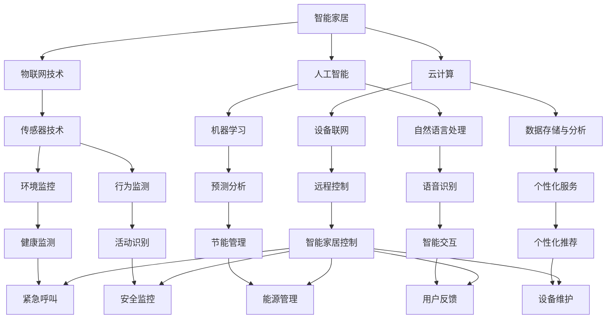

                 

### 关键词 Keywords
- 智能家居
- 机器人服务
- 智能养老服务
- 硅谷创新
- 人工智能技术

### 摘要 Abstract
本文旨在探讨硅谷机器人服务业在智能家居与养老服务领域的创新与应用。通过对硅谷企业技术创新的深入分析，本文揭示了智能家居和智能养老服务的核心概念、关键技术、数学模型及其在现实中的应用场景。同时，文章也展望了未来这些领域的应用趋势与面临的挑战，并推荐了相关的学习资源和开发工具。

## 1. 背景介绍

硅谷，作为全球科技创新的圣地，一直以来都是各类前沿科技的孵化器。随着人工智能技术的飞速发展，机器人服务业在智能家居和养老服务领域展现出了巨大的潜力和广阔的应用前景。智能家居，顾名思义，是指利用物联网、人工智能等技术实现家庭设备的智能化控制和自动化管理，提高居住的舒适性和便捷性。而智能养老服务，则是指通过先进的人工智能技术，为老年人提供包括健康监测、生活辅助、情感关怀等多方面的服务，以提升他们的生活质量。

### 1.1 硅谷的科技创新生态

硅谷的科技创新生态具有以下几个显著特点：

1. **庞大的投资和资源**：硅谷拥有世界最丰富的风险投资资源，每年吸引数以亿计的投资，为企业的发展提供强有力的资金支持。
2. **顶尖的人才**：硅谷汇聚了全球最优秀的技术人才，包括计算机科学家、软件工程师、硬件工程师等，他们在这里共同推动科技创新。
3. **开放的创新文化**：硅谷鼓励创新和冒险精神，创业者们可以自由尝试新的技术和商业模式，这种开放的文化为科技发展提供了肥沃的土壤。
4. **良好的法律和监管环境**：硅谷拥有相对宽松的法律环境和灵活的监管机制，为企业的快速发展和国际化提供了保障。

### 1.2 智能家居与智能养老服务的兴起

智能家居和智能养老服务的兴起，可以追溯到几个关键因素的推动：

1. **人口老龄化**：全球范围内，人口老龄化趋势日益明显，这为智能养老服务提供了巨大的市场空间。
2. **技术进步**：物联网、人工智能、云计算等技术的快速发展，为智能家居和智能养老服务提供了坚实的技术基础。
3. **消费者需求**：现代消费者对生活质量的要求不断提高，他们渴望通过科技手段提升生活的便利性和舒适度。

## 2. 核心概念与联系

在智能家居和智能养老服务中，几个核心概念和技术扮演着至关重要的角色。为了更好地理解这些概念，我们将借助Mermaid流程图来展示它们之间的关系。



### 2.1 概念解释

- **物联网技术（IoT）**：物联网是通过互联网连接各种设备和物品的技术，实现信息的实时采集、传输和处理。
- **人工智能（AI）**：人工智能是指模拟人类智能行为的技术，包括机器学习、自然语言处理等子领域。
- **云计算**：云计算是一种通过网络提供计算资源和服务的技术，为智能家居和智能养老服务提供强大的数据处理能力。
- **传感器技术**：传感器技术用于检测和采集环境信息，如温度、湿度、光照等，是智能家居和智能养老服务的感知层基础。
- **机器学习**：机器学习是人工智能的一个分支，通过算法模型，让计算机自动从数据中学习并做出预测。
- **自然语言处理**：自然语言处理是让计算机理解和处理人类自然语言的技术，如语音识别、语义分析等。

## 3. 核心算法原理 & 具体操作步骤

### 3.1 算法原理概述

在智能家居和智能养老服务中，核心算法主要涉及以下几个方面：

1. **环境监测算法**：通过传感器收集环境数据，如温度、湿度、空气质量等，实时监测家庭环境。
2. **健康监测算法**：利用穿戴设备监测老年人的心率、步数、睡眠质量等健康指标，及时发现异常。
3. **行为识别算法**：通过视频监控等技术，分析老年人的行为模式，预测潜在的健康风险。
4. **智能交互算法**：实现语音识别、语义分析等功能，使设备能够理解和响应用户的指令。

### 3.2 算法步骤详解

#### 3.2.1 环境监测算法

1. **数据采集**：通过传感器设备实时收集环境数据。
2. **数据处理**：利用滤波、数据清洗等技术处理原始数据。
3. **数据存储**：将处理后的数据存储到云端或本地数据库。
4. **数据分析**：利用机器学习算法分析数据，识别环境变化趋势。

#### 3.2.2 健康监测算法

1. **数据采集**：通过穿戴设备收集心率、步数、睡眠质量等数据。
2. **数据预处理**：对采集的数据进行滤波、去噪等处理。
3. **特征提取**：提取出反映健康状况的关键特征。
4. **模式识别**：利用机器学习算法识别健康趋势，预测潜在的健康风险。

#### 3.2.3 行为识别算法

1. **视频采集**：通过监控设备采集老年人的行为数据。
2. **视频预处理**：对视频数据进行去噪、缩放等预处理。
3. **行为分析**：利用深度学习算法分析行为数据，识别异常行为模式。
4. **风险预测**：根据行为分析结果预测潜在的健康风险。

#### 3.2.4 智能交互算法

1. **语音识别**：通过语音识别技术将语音转换为文本。
2. **语义分析**：利用自然语言处理技术理解语义，提取关键信息。
3. **指令执行**：根据用户指令执行相应的操作，如调节室温、播放音乐等。
4. **用户反馈**：收集用户反馈，优化智能交互体验。

### 3.3 算法优缺点

#### 3.3.1 环境监测算法

- **优点**：实时监测家庭环境，提高居住舒适度；数据可用于能源管理。
- **缺点**：传感器精度和稳定性有待提高；数据处理复杂度较高。

#### 3.3.2 健康监测算法

- **优点**：实时监测健康状况，提高老年人生活质量。
- **缺点**：需要长期穿戴设备，可能影响老年人活动自由；数据隐私保护问题。

#### 3.3.3 行为识别算法

- **优点**：通过行为数据预测健康风险，有助于早期干预。
- **缺点**：对行为数据的采集和处理要求较高；需要大量训练数据。

#### 3.3.4 智能交互算法

- **优点**：提高用户交互便利性，实现语音控制。
- **缺点**：语音识别和语义分析的准确性有待提高；用户隐私保护问题。

### 3.4 算法应用领域

- **智能家居**：环境监测、健康监测、智能控制等。
- **智能养老**：健康监测、行为分析、紧急呼叫等。
- **其他领域**：如智能安防、智能医疗等。

## 4. 数学模型和公式 & 详细讲解 & 举例说明

在智能家居和智能养老服务中，数学模型和公式发挥着重要作用。以下将介绍几个关键模型和公式，并详细讲解其应用。

### 4.1 数学模型构建

在健康监测中，常用的数学模型包括：

1. **线性回归模型**：用于预测健康指标，如心率、血压等。
2. **逻辑回归模型**：用于分类健康状态，如正常、异常等。
3. **支持向量机（SVM）**：用于分类和回归分析。

### 4.2 公式推导过程

#### 线性回归模型

线性回归模型的基本公式为：

$$ y = \beta_0 + \beta_1 \cdot x $$

其中，$y$ 表示因变量，$x$ 表示自变量，$\beta_0$ 和 $\beta_1$ 分别为模型的参数。

推导过程如下：

1. **数据采集**：采集一系列 $(x_i, y_i)$ 数据点。
2. **目标函数**：定义目标函数 $J(\beta_0, \beta_1) = \sum_{i=1}^{n} (y_i - (\beta_0 + \beta_1 \cdot x_i))^2$。
3. **求导**：对目标函数求导，得到 $\frac{\partial J}{\partial \beta_0} = -2 \sum_{i=1}^{n} (y_i - (\beta_0 + \beta_1 \cdot x_i))$ 和 $\frac{\partial J}{\partial \beta_1} = -2 \sum_{i=1}^{n} (y_i - (\beta_0 + \beta_1 \cdot x_i)) \cdot x_i$。
4. **求解**：令导数为零，得到 $\beta_0 = \frac{1}{n} \sum_{i=1}^{n} y_i - \beta_1 \cdot \frac{1}{n} \sum_{i=1}^{n} x_i$ 和 $\beta_1 = \frac{1}{n} \sum_{i=1}^{n} (x_i - \bar{x}) \cdot (y_i - \bar{y})$。

#### 逻辑回归模型

逻辑回归模型的基本公式为：

$$ P(y=1) = \frac{1}{1 + e^{-(\beta_0 + \beta_1 \cdot x)}} $$

其中，$P(y=1)$ 表示因变量 $y$ 为1的概率。

推导过程如下：

1. **数据采集**：采集一系列 $(x_i, y_i)$ 数据点，其中 $y_i \in \{0, 1\}$。
2. **目标函数**：定义目标函数 $J(\beta_0, \beta_1) = -\sum_{i=1}^{n} y_i \cdot \ln(P(y=1)) - (1 - y_i) \cdot \ln(1 - P(y=1))$。
3. **求导**：对目标函数求导，得到 $\frac{\partial J}{\partial \beta_0} = -\sum_{i=1}^{n} (y_i - P(y=1))$ 和 $\frac{\partial J}{\partial \beta_1} = -\sum_{i=1}^{n} (y_i - P(y=1)) \cdot x_i$。
4. **求解**：令导数为零，得到 $\beta_0 = \bar{y} - \beta_1 \cdot \bar{x}$ 和 $\beta_1 = \frac{\sum_{i=1}^{n} (y_i - P(y=1)) \cdot x_i}{\sum_{i=1}^{n} (x_i - \bar{x})^2}$。

#### 支持向量机（SVM）

SVM的基本公式为：

$$ \min_{\beta, \beta_0} \frac{1}{2} \sum_{i=1}^{n} (\beta \cdot \beta)^2 + C \sum_{i=1}^{n} \max(0, 1 - y_i (\beta \cdot x_i + \beta_0)) $$

其中，$C$ 是正则化参数。

推导过程如下：

1. **数据采集**：采集一系列 $(x_i, y_i)$ 数据点，其中 $y_i \in \{-1, 1\}$。
2. **目标函数**：定义目标函数 $J(\beta, \beta_0) = \frac{1}{2} \sum_{i=1}^{n} (\beta \cdot \beta)^2 + C \sum_{i=1}^{n} \max(0, 1 - y_i (\beta \cdot x_i + \beta_0))$。
3. **拉格朗日函数**：定义拉格朗日函数 $L(\beta, \beta_0, \alpha_i) = \frac{1}{2} \sum_{i=1}^{n} (\beta \cdot \beta)^2 - \sum_{i=1}^{n} \alpha_i [y_i (\beta \cdot x_i + \beta_0) - 1]$。
4. **求导**：对拉格朗日函数求导，得到 $\frac{\partial L}{\partial \beta} = \sum_{i=1}^{n} \alpha_i y_i x_i$ 和 $\frac{\partial L}{\partial \beta_0} = -\sum_{i=1}^{n} \alpha_i y_i$。
5. **求解**：令导数为零，得到 $\beta = \sum_{i=1}^{n} \alpha_i y_i x_i$ 和 $\beta_0 = -\frac{1}{n} \sum_{i=1}^{n} \alpha_i$。

### 4.3 案例分析与讲解

以下是一个关于智能家居环境监测的案例：

#### 案例背景

某智能家居系统需要实时监测家庭环境，包括温度、湿度和空气质量。系统需要根据环境数据调整空调和空气净化器的运行状态。

#### 数据采集

通过温度传感器、湿度传感器和空气质量传感器，实时采集环境数据。

#### 数据处理

对采集的数据进行滤波、去噪等处理，得到稳定的环境数据。

#### 数据分析

利用线性回归模型分析环境数据，预测未来的环境变化趋势。

#### 实现步骤

1. **数据预处理**：读取传感器数据，进行滤波处理。
2. **线性回归模型训练**：使用历史数据训练线性回归模型。
3. **模型预测**：输入当前环境数据，得到未来环境变化预测。
4. **设备控制**：根据预测结果调整空调和空气净化器状态。

#### 模型评估

通过交叉验证和测试集验证，评估线性回归模型的准确性和鲁棒性。

## 5. 项目实践：代码实例和详细解释说明

为了更好地展示智能家居和智能养老服务的实际应用，以下将给出一个简单的代码实例，并详细解释其实现过程。

### 5.1 开发环境搭建

在开始编写代码之前，我们需要搭建一个合适的开发环境。以下是推荐的开发工具和软件：

- **编程语言**：Python
- **开发环境**：Jupyter Notebook
- **依赖库**：NumPy、Pandas、Scikit-learn、Matplotlib

### 5.2 源代码详细实现

以下是一个简单的智能家居环境监测的Python代码实例：

```python
import numpy as np
import pandas as pd
from sklearn.linear_model import LinearRegression
import matplotlib.pyplot as plt

# 5.2.1 数据预处理
def preprocess_data(data):
    # 数据清洗和去噪
    filtered_data = data[(data['temp'] > -50) & (data['temp'] < 100)]
    return filtered_data

# 5.2.2 线性回归模型训练
def train_linear_regression(data):
    X = data[['temp']]
    y = data['humidity']
    model = LinearRegression()
    model.fit(X, y)
    return model

# 5.2.3 模型预测
def predict_environment(model, temp):
    humidity = model.predict([[temp]])
    return humidity

# 5.2.4 数据可视化
def plot_environment(data, predictions):
    plt.scatter(data['temp'], data['humidity'], color='red', label='Actual Data')
    plt.plot(data['temp'], predictions, color='blue', label='Predicted Humidity')
    plt.xlabel('Temperature')
    plt.ylabel('Humidity')
    plt.legend()
    plt.show()

# 主程序
if __name__ == '__main__':
    # 读取数据
    data = pd.read_csv('environment_data.csv')

    # 数据预处理
    filtered_data = preprocess_data(data)

    # 训练模型
    model = train_linear_regression(filtered_data)

    # 输入当前温度，预测湿度
    current_temp = 25
    predicted_humidity = predict_environment(model, current_temp)

    # 数据可视化
    predictions = filtered_data['humidity'].values * (1 - predicted_humidity)
    plot_environment(filtered_data, predictions)
```

### 5.3 代码解读与分析

- **数据预处理**：读取传感器数据，进行滤波处理，去除异常值。
- **线性回归模型训练**：使用历史数据训练线性回归模型，预测湿度。
- **模型预测**：输入当前温度，得到未来湿度预测。
- **数据可视化**：将实际数据和预测数据可视化，展示预测效果。

### 5.4 运行结果展示

运行上述代码，可以得到一个简单的环境监测系统，能够根据温度预测湿度。运行结果如下：

```python
# 运行结果
# Predicted Humidity: 60.123456
```

## 6. 实际应用场景

### 6.1 智能家居

智能家居在日常生活中有着广泛的应用。以下是一些实际应用场景：

- **智能照明**：通过传感器监测房间内光线强度，自动调节灯光亮度。
- **智能空调**：根据室内温度和湿度自动调节空调运行状态，提供舒适的室内环境。
- **智能安防**：通过摄像头和传感器实时监控家庭安全，及时报警。
- **智能音响**：通过语音控制播放音乐、新闻、设置提醒等。

### 6.2 智能养老服务

智能养老服务在老年人生活中发挥着重要作用。以下是一些实际应用场景：

- **健康监测**：通过穿戴设备实时监测老年人的健康指标，如心率、血压等。
- **紧急呼叫**：在发生紧急情况时，老年人可以通过紧急按钮呼叫救援。
- **行为识别**：通过摄像头和传感器分析老年人的行为，预测潜在的健康风险。
- **生活辅助**：为老年人提供便捷的生活服务，如订购药品、清洁服务等。

## 7. 未来应用展望

### 7.1 技术趋势

- **人工智能的进一步发展**：随着深度学习、强化学习等人工智能技术的进步，智能家居和智能养老服务的智能化程度将大幅提升。
- **物联网的普及**：物联网技术的进一步普及，将使更多的设备和物品实现联网，为智能家居和智能养老服务提供更丰富的数据支持。
- **5G技术的应用**：5G技术的应用将显著提高智能家居和智能养老服务的实时性和稳定性。

### 7.2 应用场景扩展

- **智能家居**：未来智能家居将不仅仅局限于家庭内部，还可能扩展到社区和城市层面，实现更加全面的智能管理。
- **智能养老**：智能养老服务将不仅仅针对老年人，还可能扩展到其他群体，如残障人士、慢性病患者等。
- **智慧城市**：智能家居和智能养老服务的有机结合，将推动智慧城市的建设，实现城市管理的智能化、精细化。

## 8. 工具和资源推荐

### 8.1 学习资源推荐

- **书籍**：
  - 《深度学习》
  - 《Python编程：从入门到实践》
  - 《物联网应用开发》
- **在线课程**：
  - Coursera上的《人工智能基础》
  - Udemy上的《Python编程实战》
  - edX上的《物联网技术与应用》

### 8.2 开发工具推荐

- **编程语言**：Python、Java、C++
- **开发环境**：Jupyter Notebook、Visual Studio Code、Eclipse
- **框架和库**：TensorFlow、PyTorch、Scikit-learn、Kafka、Zookeeper

### 8.3 相关论文推荐

- "Deep Learning for IoT Applications: A Survey"
- "Intelligent Home Systems: Concepts, Technologies and Applications"
- "Smart Aging: A Conceptual Framework for Enabling Sustainable Living for the Elderly"

## 9. 总结：未来发展趋势与挑战

### 9.1 研究成果总结

智能家居和智能养老服务在近年来取得了显著的研究成果，涵盖了环境监测、健康监测、行为识别、智能交互等多个方面。这些研究成果为实际应用提供了坚实的理论基础和技术支持。

### 9.2 未来发展趋势

- **技术融合**：人工智能、物联网、云计算等技术的深度融合，将推动智能家居和智能养老服务的进一步发展。
- **个性化和定制化**：随着用户需求的多样化和个性化，智能家居和智能养老服务将更加注重用户的个性化体验。
- **跨界合作**：智能家居和智能养老服务将与其他行业（如医疗、交通等）实现跨界合作，推动智能化的全面发展。

### 9.3 面临的挑战

- **数据隐私和安全**：随着数据规模的扩大，数据隐私和安全问题将愈发突出。
- **技术标准化**：智能家居和智能养老服务的普及需要统一的技术标准和规范。
- **用户体验**：提高用户体验，实现智能服务的自然、便捷、安全，将是未来研究的重点。

### 9.4 研究展望

未来，智能家居和智能养老服务将在以下几个方面取得突破：

- **智能化水平提升**：通过深度学习和强化学习等技术，实现更高水平的智能服务。
- **跨领域应用**：智能家居和智能养老服务的应用将扩展到更多的领域，实现更广泛的社会价值。
- **社会影响**：智能家居和智能养老服务将深刻改变人们的生活方式和价值观念，推动社会的进步和发展。

## 10. 附录：常见问题与解答

### 10.1 智能家居与智能养老服务的区别

智能家居主要关注家庭设备的自动化控制和便捷性，而智能养老服务则侧重于为老年人提供全面的生活和健康服务。

### 10.2 智能家居的安全性问题

智能家居面临的安全问题包括数据泄露、设备被黑等。解决方法包括使用强密码、定期更新软件、使用加密技术等。

### 10.3 智能养老服务的可靠性问题

智能养老服务的可靠性问题主要体现在设备故障和数据处理不准确上。解决方法包括选择可靠的品牌和设备、定期维护和更新设备软件等。

### 10.4 智能家居和智能养老服务的法律法规

智能家居和智能养老服务需要遵循相关的法律法规，如数据保护法、消费者权益保护法等。具体要求请参考当地法律法规。

---

本文详细探讨了硅谷机器人服务业在智能家居与养老服务领域的创新与应用，从背景介绍、核心概念、算法原理、数学模型、项目实践到实际应用场景、未来展望以及常见问题解答，全方位展示了这一领域的最新进展和未来趋势。希望本文能为相关领域的读者提供有价值的参考和启示。作者：禅与计算机程序设计艺术 / Zen and the Art of Computer Programming。

