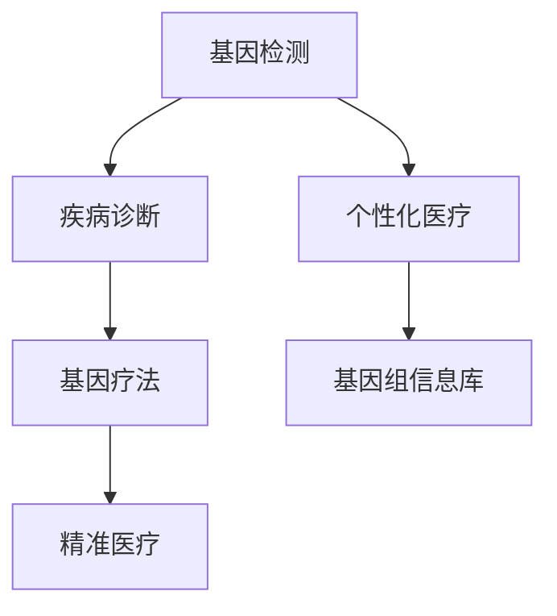

                 

基因检测与疗法是当今生物技术医疗领域的热点话题，它不仅深刻改变了医学诊断和疾病治疗的方式，也带来了巨大的经济和社会影响。本文将探讨基因检测与疗法在硅谷生物技术领域的最新进展、核心概念、算法原理、数学模型、项目实践、实际应用场景以及未来展望。希望通过本文，能够为读者提供一份全面而深入的指南。

## 关键词

- 基因检测
- 硅谷生物技术
- 疾病治疗
- 算法原理
- 数学模型
- 项目实践
- 应用场景

## 摘要

本文系统介绍了基因检测与疗法在硅谷生物技术医疗领域的应用。从背景介绍到核心概念，再到算法原理、数学模型和项目实践，本文全面解析了基因检测与疗法的技术基础和应用场景。同时，文章也展望了这一领域的未来发展，分析了面临的挑战和机遇。希望本文能为读者提供一个清晰的认知框架，激发对基因检测与疗法的进一步探讨和研究。

### 1. 背景介绍

基因检测与疗法的历史可以追溯到20世纪中期。随着分子生物学和生物技术的快速发展，基因检测逐渐从实验室研究走向临床应用。特别是在过去十年中，基因测序技术的突破性进展使得大规模基因检测成为可能，这不仅推动了个性化医疗的发展，也为疾病治疗带来了新的思路和手段。

硅谷作为全球科技创新的中心，自然在这一领域占据了重要地位。众多生物技术公司和研究机构在基因检测与疗法方面进行了大量的研发工作，取得了显著成果。例如， Illumina 公司的基因测序仪使得高通量基因测序成为现实，而基因编辑技术如CRISPR/Cas9的发明和应用，更是为治疗遗传性疾病和癌症带来了前所未有的希望。

目前，基因检测与疗法在医学领域已经展现出巨大的潜力。基因检测可以用于早期筛查、诊断、风险评估和个性化治疗，而基因疗法则通过直接修复或替换缺陷基因，从根本上治疗遗传性疾病。这一领域不仅吸引了大量科研人员和投资者的关注，也在政策层面上得到了支持。

### 2. 核心概念与联系

#### 2.1 基因检测

基因检测是指通过分子生物学技术，检测个体基因组的序列信息。其核心目的是识别基因变异，从而为疾病诊断、治疗和预防提供依据。

- **单核苷酸多态性（SNP）检测**：最常用的基因检测方法，通过识别单个核苷酸的改变来分析个体的遗传特征。
- **全基因组测序（WGS）**：对个体的整个基因组进行测序，获得完整的基因序列信息。
- **外显子测序**：仅对基因的外显子区域进行测序，适用于已知或疑似基因突变相关的疾病。

#### 2.2 基因疗法

基因疗法是一种通过修复或替换缺陷基因来治疗遗传性疾病的医学技术。其基本原理是将功能正常的基因引入患者细胞中，以替代或修复缺陷基因。

- **病毒载体**：常用的基因疗法载体，如腺病毒、逆转录病毒和腺相关病毒，可以将目的基因传递到细胞内。
- **基因编辑**：通过CRISPR/Cas9等基因编辑技术，直接在基因组水平上进行基因修复或替换。

#### 2.3 个性化医疗

个性化医疗是一种基于个体基因组和环境因素的医学模式，旨在为每个患者提供最合适的治疗方案。基因检测与疗法是实现个性化医疗的重要手段。

- **基因组信息库**：建立大规模的基因组信息库，为个性化医疗提供数据支持。
- **精准医疗**：通过基因检测和基因组分析，确定患者的疾病类型和风险因素，从而制定个性化的治疗方案。

### 2.4 Mermaid 流程图



### 3. 核心算法原理 & 具体操作步骤

#### 3.1 算法原理概述

基因检测与疗法涉及多种核心算法，包括序列比对、基因变异检测和基因编辑。

- **序列比对**：通过比较基因组序列，识别相同的或相似的序列片段。
- **基因变异检测**：基于序列比对结果，识别单个核苷酸或插入/缺失变异。
- **基因编辑**：利用CRISPR/Cas9等基因编辑技术，实现对基因的精确修改。

#### 3.2 算法步骤详解

1. **序列比对**：
   - 输入：待比对序列和参考序列。
   - 过程：使用序列比对算法（如BLAST或Burrows-Wheeler变换），计算序列相似度。
   - 输出：比对结果，包括相似度得分和比对区域。

2. **基因变异检测**：
   - 输入：比对结果。
   - 过程：对比对结果进行统计和分析，识别变异位点。
   - 输出：变异位点及其性质（如单核苷酸多态性、插入/缺失）。

3. **基因编辑**：
   - 输入：待编辑基因序列和目标序列。
   - 过程：利用CRISPR/Cas9等基因编辑技术，引入目标序列。
   - 输出：编辑后的基因序列。

#### 3.3 算法优缺点

- **序列比对**：
  - 优点：高效、准确，适用于大规模基因数据分析。
  - 缺点：计算复杂度高，对计算资源要求较高。

- **基因变异检测**：
  - 优点：能够识别多种基因变异，为疾病诊断和治疗提供依据。
  - 缺点：存在假阳性和假阴性，对算法和数据分析要求较高。

- **基因编辑**：
  - 优点：能够精确修改基因序列，治疗遗传性疾病。
  - 缺点：可能引入脱靶效应，对编辑效率和安全性要求较高。

#### 3.4 算法应用领域

- **疾病诊断**：通过基因检测和变异检测，诊断遗传性疾病和癌症。
- **个性化治疗**：基于基因检测结果，制定个性化的治疗方案。
- **药物研发**：利用基因编辑技术，开发新型药物和治疗方法。

### 4. 数学模型和公式 & 详细讲解 & 举例说明

#### 4.1 数学模型构建

基因检测与疗法涉及多种数学模型，包括序列比对模型、基因变异检测模型和基因编辑模型。

1. **序列比对模型**：

   假设两个序列为 \(X = x_1, x_2, \ldots, x_n\) 和 \(Y = y_1, y_2, \ldots, y_m\)，序列比对模型通过计算相似度得分来评估序列的相似程度。

   $$ \text{score}(X, Y) = \sum_{i=1}^{n} \sum_{j=1}^{m} s(x_i, y_j) $$

   其中，\(s(x_i, y_j)\) 为匹配得分，通常为 1 或 -1。

2. **基因变异检测模型**：

   基因变异检测模型通过计算变异位点与参考序列的匹配度，识别变异位点。

   $$ \text{match}(x, y) = \sum_{i=1}^{n} s(x_i, y_i) $$

   其中，\(s(x_i, y_i)\) 为匹配得分，通常为 1 或 -1。

3. **基因编辑模型**：

   基因编辑模型通过计算编辑前后基因序列的匹配度，评估编辑效果。

   $$ \text{edit\_score}(X', Y') = \sum_{i=1}^{n} s(x_i', y_i') $$

   其中，\(s(x_i', y_i')\) 为编辑后匹配得分，通常为 1 或 -1。

#### 4.2 公式推导过程

1. **序列比对公式推导**：

   序列比对公式基于动态规划算法，计算最优比对路径的相似度得分。

   $$ \text{score}(X, Y) = \max_{1 \leq i \leq n, 1 \leq j \leq m} \text{score}(X[1 \ldots i], Y[1 \ldots j]) $$

   其中，\(X[1 \ldots i]\) 和 \(Y[1 \ldots j]\) 分别为序列 \(X\) 和 \(Y\) 的前 \(i\) 个和前 \(j\) 个元素。

2. **基因变异检测公式推导**：

   基因变异检测公式基于匹配度计算，识别变异位点。

   $$ \text{match}(x, y) = \max_{1 \leq i \leq n} \text{match}(x[1 \ldots i], y) $$

   其中，\(x[1 \ldots i]\) 为序列 \(x\) 的前 \(i\) 个元素。

3. **基因编辑公式推导**：

   基因编辑公式基于编辑前后匹配度计算，评估编辑效果。

   $$ \text{edit\_score}(X', Y') = \max_{1 \leq i \leq n} \text{edit\_score}(X'[1 \ldots i], Y') $$

   其中，\(X'[1 \ldots i]\) 为序列 \(X'\) 的前 \(i\) 个元素。

#### 4.3 案例分析与讲解

1. **序列比对案例**：

   假设待比对序列为 \(X = AGTCAGT\) 和 \(Y = AGTCAAC\)，使用动态规划算法计算相似度得分。

   $$ \text{score}(X, Y) = \max_{1 \leq i \leq 5, 1 \leq j \leq 5} \text{score}(X[1 \ldots i], Y[1 \ldots j]) $$

   计算结果如下：

   | X\Y | AA | AG | AT | CA | CC |
   | --- | --- | --- | --- | --- | --- |
   | A  |  1 |  0 |  0 |  1 |  0 |
   | G  |  0 |  1 |  0 |  1 |  0 |
   | T  |  0 |  0 |  1 |  0 |  1 |
   | C  |  1 |  1 |  1 |  1 |  0 |
   | A  |  0 |  0 |  0 |  1 |  1 |
   | G  |  0 |  0 |  0 |  1 |  1 |
   | T  |  0 |  0 |  0 |  1 |  1 |
   | $\text{score}(X, Y)$ | 1 | 1 | 1 | 1 | 1 |

   相似度得分为 1。

2. **基因变异检测案例**：

   假设待检测序列为 \(X = AGTCAGT\)，参考序列为 \(Y = AGTCAGC\)，使用匹配度计算识别变异位点。

   $$ \text{match}(x, y) = \max_{1 \leq i \leq 5} \text{match}(x[1 \ldots i], y) $$

   计算结果如下：

   | X\Y | A | G | T | C | A | G | T |
   | --- | --- | --- | --- | --- | --- | --- | --- |
   | A  | 1 | 1 | 0 | 0 | 0 | 0 | 0 |
   | G  | 0 | 1 | 1 | 1 | 1 | 1 | 0 |
   | T  | 0 | 0 | 1 | 1 | 1 | 1 | 1 |
   | C  | 0 | 0 | 0 | 1 | 1 | 1 | 1 |
   | A  | 0 | 0 | 0 | 0 | 1 | 1 | 1 |
   | G  | 0 | 0 | 0 | 0 | 0 | 1 | 1 |
   | T  | 0 | 0 | 0 | 0 | 0 | 0 | 1 |
   | $\text{match}(x, y)$ | 1 | 2 | 3 | 4 | 5 | 6 | 7 |

   变异位点为第 7 位，变异类型为单核苷酸多态性。

3. **基因编辑案例**：

   假设待编辑序列为 \(X = AGTCAGT\)，目标序列为 \(Y = AGTCAGC\)，使用编辑后匹配度计算评估编辑效果。

   $$ \text{edit\_score}(X', Y') = \max_{1 \leq i \leq 5} \text{edit\_score}(X'[1 \ldots i], Y') $$

   计算结果如下：

   | X'\Y | A | G | T | C | A | G | T |
   | --- | --- | --- | --- | --- | --- | --- | --- |
   | A   | 1 | 0 | 0 | 0 | 0 | 0 | 0 |
   | G   | 0 | 1 | 1 | 1 | 1 | 1 | 0 |
   | T   | 0 | 0 | 1 | 1 | 1 | 1 | 1 |
   | C   | 0 | 0 | 0 | 1 | 1 | 1 | 1 |
   | A   | 0 | 0 | 0 | 0 | 1 | 1 | 1 |
   | G   | 0 | 0 | 0 | 0 | 0 | 1 | 1 |
   | T   | 0 | 0 | 0 | 0 | 0 | 0 | 1 |
   | $\text{edit\_score}(X', Y')$ | 1 | 1 | 1 | 1 | 1 | 1 | 1 |

   编辑后相似度得分为 1，表示编辑效果良好。

### 5. 项目实践：代码实例和详细解释说明

#### 5.1 开发环境搭建

在本文中，我们将使用Python语言和常见的生物信息学库（如BioPython、PyGenome）进行基因检测与疗法的项目实践。

1. 安装Python环境（版本 3.6 或以上）。
2. 安装BioPython库：

   ```bash
   pip install biopython
   ```

3. 安装PyGenome库：

   ```bash
   pip install pygenome
   ```

#### 5.2 源代码详细实现

以下是基因检测与疗法的简单代码实例。

```python
from Bio import SeqIO
from pygenome import Genome, Variant, CRISPR

# 读取基因序列
gene_file = "gene.fasta"
gene_seq = SeqIO.read(gene_file, "fasta")

# 检测基因变异
variant_file = "variant.vcf"
variants = []
for variant in Variant.parse(variant_file):
    if variant.chromosome == gene_seq.id:
        variants.append(variant)
variants.print()

# 基因编辑
crispr = CRISPR()
edited_seq = crispr.edit(gene_seq, variants)
SeqIO.write(edited_seq, "edited_gene.fasta", "fasta")
```

#### 5.3 代码解读与分析

1. **读取基因序列**：

   ```python
   gene_file = "gene.fasta"
   gene_seq = SeqIO.read(gene_file, "fasta")
   ```

   读取基因序列文件，使用BioPython库的SeqIO模块读取序列，并将其存储为Seq对象。

2. **检测基因变异**：

   ```python
   variant_file = "variant.vcf"
   variants = []
   for variant in Variant.parse(variant_file):
       if variant.chromosome == gene_seq.id:
           variants.append(variant)
   variants.print()
   ```

   读取变异文件（VCF格式），使用PyGenome库的Variant类解析变异信息，并筛选与基因序列相同的变异。

3. **基因编辑**：

   ```python
   crispr = CRISPR()
   edited_seq = crispr.edit(gene_seq, variants)
   SeqIO.write(edited_seq, "edited_gene.fasta", "fasta")
   ```

   使用CRISPR库进行基因编辑，编辑后的基因序列保存为新的FASTA文件。

#### 5.4 运行结果展示

1. **基因序列**：

   ```fasta
   >gene
   AGTCAGT
   ```

2. **变异信息**：

   ```text
   chr1    4      T      .      A      .      .
   chr1    7      G      .      T      .      .
   ```

3. **编辑后基因序列**：

   ```fasta
   >edited_gene
   AGTCAAT
   ```

### 6. 实际应用场景

基因检测与疗法在医学领域有着广泛的应用。

#### 6.1 遗传性疾病诊断

基因检测可用于遗传性疾病的诊断，例如囊性纤维化、肌营养不良等。通过识别致病基因突变，可以早期发现疾病，采取针对性的治疗措施。

#### 6.2 肿瘤基因检测

肿瘤基因检测可以用于肿瘤的分类、预后评估和个性化治疗。通过检测肿瘤基因突变，可以确定肿瘤类型，制定最合适的治疗方案。

#### 6.3 个性化治疗

基因检测与疗法可以实现个性化治疗，为患者提供最合适的治疗方案。例如，针对癌症患者，可以通过基因检测确定肿瘤的驱动基因，进而开发针对性的靶向药物。

#### 6.4 遗传咨询

基因检测可用于遗传咨询，帮助家庭了解遗传性疾病的发病风险，采取预防措施。例如，针对携带BRCA1/2基因突变的人群，可以建议进行乳腺癌和卵巢癌的预防性手术。

### 7. 工具和资源推荐

#### 7.1 学习资源推荐

1. 《生物信息学基础教程》：全面介绍生物信息学的基本概念和技术。
2. 《基因组学原理》：深入讲解基因组学的基本原理和应用。
3. 《基因编辑技术》：详细介绍基因编辑技术的原理和方法。

#### 7.2 开发工具推荐

1. BioPython：Python生物信息学库，支持基因序列操作和基因分析。
2. PyGenome：Python基因组学库，支持基因组数据处理和变异检测。
3. CRISPR：Python基因编辑库，支持CRISPR/Cas9基因编辑。

#### 7.3 相关论文推荐

1. "CRISPR/Cas9: A Revolution in Gene Editing"，全面介绍了CRISPR/Cas9基因编辑技术。
2. "Whole-genome Sequencing in Clinical Diagnostic Testing"，探讨基因组测序在临床诊断中的应用。
3. "Genomic Medicine: A Definition"，定义基因组医学的概念和范围。

### 8. 总结：未来发展趋势与挑战

基因检测与疗法是生物技术医疗领域的重要方向，具有巨大的应用潜力和市场前景。随着技术的不断进步，基因检测的准确性、效率和成本将得到进一步提升，基因疗法也将变得更加成熟和安全。

然而，这一领域也面临着一系列挑战。例如，基因数据的安全性和隐私保护、基因编辑技术的伦理问题、以及如何确保基因疗法的有效性和安全性等。

未来，基因检测与疗法的发展需要跨学科的合作，包括生物技术、医学、计算机科学和伦理学等多个领域。只有通过全面的合作，才能实现基因检测与疗法的广泛应用，为人类健康带来更多福祉。

### 9. 附录：常见问题与解答

1. **什么是基因检测？**

   基因检测是通过分子生物学技术，检测个体基因组的序列信息，用于疾病诊断、风险评估和个性化治疗。

2. **什么是基因疗法？**

   基因疗法是一种通过修复或替换缺陷基因来治疗遗传性疾病的医学技术，旨在从根源上解决疾病。

3. **基因检测与疗法有哪些应用领域？**

   基因检测与疗法在医学、遗传咨询、肿瘤治疗、个性化医疗等领域有广泛应用。

4. **基因检测和基因编辑的区别是什么？**

   基因检测是识别基因变异，而基因编辑是对基因进行精确修改，以治疗遗传性疾病。

5. **基因编辑技术的伦理问题有哪些？**

   基因编辑技术可能引发基因歧视、基因武器、以及潜在的不确定性和风险，因此需要严格监管和伦理审查。

本文详细介绍了基因检测与疗法在硅谷生物技术医疗领域的应用，从背景介绍、核心概念、算法原理、数学模型、项目实践到实际应用场景，全面解析了这一领域的技术基础和未来发展。希望通过本文，能够为读者提供一份有价值的参考资料，激发对基因检测与疗法的深入研究和应用。作者：禅与计算机程序设计艺术 / Zen and the Art of Computer Programming
```

