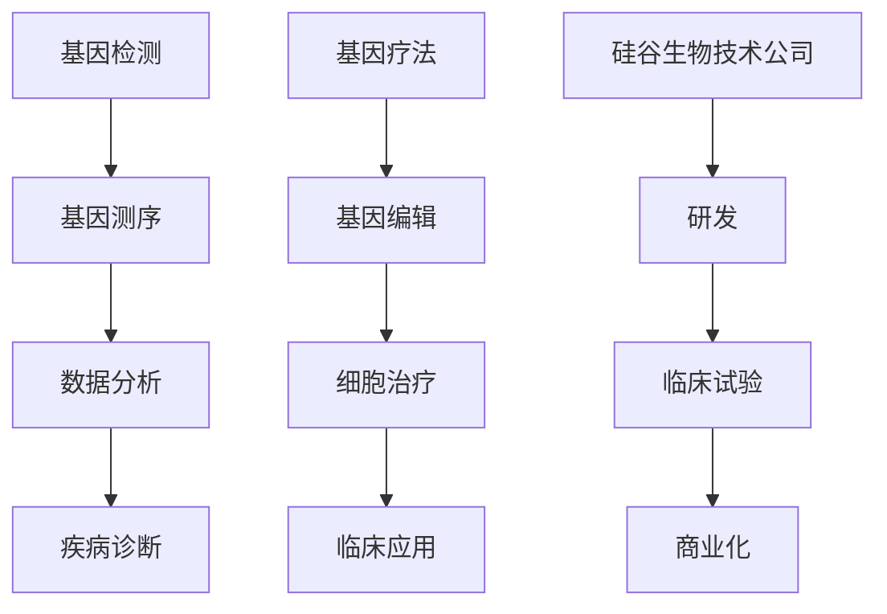
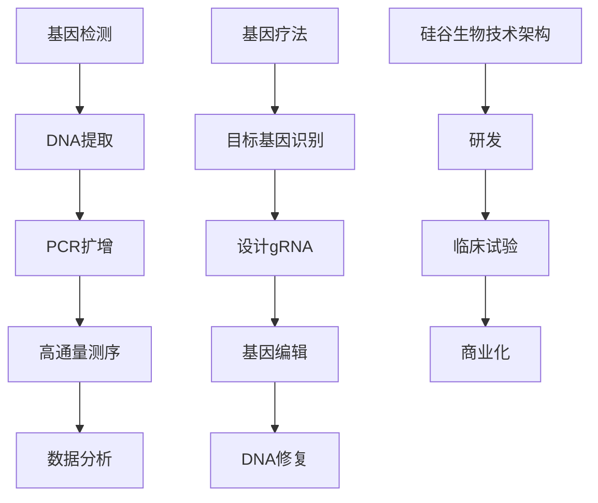

                 

在当今的科技前沿，硅谷无疑是一个引领创新的风暴中心，而生物技术医疗应用正是其发展的重要领域之一。本文旨在深入探讨硅谷在基因检测与疗法方面取得的突破性进展，以及这些技术的未来应用前景。

## 关键词
- 基因检测
- 硅谷生物技术
- 医疗疗法
- 个人化医疗
- CRISPR技术

## 摘要
本文将从以下几个方面展开讨论：首先介绍基因检测的基本概念及其在硅谷的发展历程；其次，详细阐述基因疗法的技术原理、应用现状和潜在挑战；接着，探讨硅谷在基因疗法领域的领先地位和成功案例；随后，分析基因检测与疗法在个人化医疗中的关键作用；最后，预测未来发展趋势，并提出研究展望。

## 1. 背景介绍

### 基因检测的起源与发展
基因检测是一项通过分析个体的DNA序列来揭示其遗传信息的技术。自20世纪中期以来，基因检测技术经历了从最初的细胞核DNA分析到全基因组测序的飞跃。硅谷在基因检测技术的进步中扮演了关键角色。从Affymetrix的微阵列技术到Illumina的高通量测序平台，硅谷的企业不断推动基因检测技术的革新。

### 基因疗法的历史
基因疗法是一种通过修复或替换异常基因来治疗遗传疾病的方法。自20世纪80年代以来，基因疗法的研究逐渐展开。尽管早期进展缓慢，但近年来，随着CRISPR-Cas9等编辑技术的出现，基因疗法迎来了新的春天。硅谷的生物技术公司在这场革命中发挥了重要作用，推动了基因疗法的临床应用。

### 硅谷生物技术的崛起
硅谷的生物技术产业之所以能够迅速崛起，得益于其独特的创新生态体系。这里聚集了大量的科研人才、风险投资机构和初创企业，形成了一个高度协同的创新网络。这种环境为基因检测与疗法的快速发展提供了坚实的基础。

## 2. 核心概念与联系

### 基因检测原理
基因检测通常包括DNA提取、扩增、测序和分析等步骤。通过对比正常基因序列与个体基因序列的差异，可以诊断遗传性疾病或预测疾病风险。

### 基因疗法原理
基因疗法的基本原理是通过基因编辑技术修复或替换异常基因，从而恢复细胞的正常功能。CRISPR-Cas9技术是目前最先进的基因编辑工具，其高效、精确的特性使其在基因疗法中具有广泛的应用潜力。

### 硅谷生物技术架构
硅谷的生物技术公司通常采用“研发-临床试验-商业化”的模式。这些公司通过研发创新技术，进行临床试验验证其有效性，最终实现商业化推广。这种模式使得硅谷在基因检测与疗法领域始终保持领先地位。



## 3. 核心算法原理 & 具体操作步骤

### 3.1 算法原理概述
基因检测与疗法中的核心算法通常涉及基因组序列分析、基因编辑和生物信息学分析等。这些算法基于复杂的数学模型和统计方法，旨在从大量的基因组数据中提取有意义的信息。

### 3.2 算法步骤详解

#### 基因检测算法
1. **DNA提取**：从生物样本中提取DNA。
2. **PCR扩增**：利用PCR技术对目标基因进行扩增。
3. **测序**：使用高通量测序技术对扩增的DNA进行测序。
4. **序列比对**：将测序结果与参考基因组进行比对，识别变异位点。

#### 基因疗法算法
1. **目标基因识别**：确定需要编辑的基因序列。
2. **CRISPR设计**：设计特定的CRISPR指导RNA（gRNA）。
3. **基因编辑**：使用CRISPR-Cas9系统对目标基因进行编辑。
4. **细胞培养与检测**：培养编辑后的细胞，并对其进行功能检测。

### 3.3 算法优缺点
基因检测算法的优点在于其高灵敏度和高通量，可以快速识别遗传变异。然而，其缺点包括高成本和数据分析的复杂性。基因疗法算法的优点在于其高效性和精确性，可以实现对目标基因的精确编辑。但其缺点包括潜在的脱靶效应和伦理争议。

### 3.4 算法应用领域
基因检测算法广泛应用于遗传病诊断、癌症筛查和药物研发。基因疗法算法则主要用于治疗遗传性疾病和癌症。

## 4. 数学模型和公式 & 详细讲解 & 举例说明

### 4.1 数学模型构建
基因检测与疗法中的数学模型通常涉及概率论、统计学和计算生物学。以下是一个简化的数学模型：

$$
P(D|S) = P(S|D) \cdot P(D) / P(S)
$$

其中，$P(D|S)$表示在测序结果为$S$的条件下，疾病$D$发生的概率；$P(S|D)$表示在疾病$D$发生的条件下，测序结果为$S$的概率；$P(D)$和$P(S)$分别表示疾病$D$和测序结果$S$的先验概率。

### 4.2 公式推导过程
上述公式的推导基于贝叶斯定理。贝叶斯定理描述了条件概率和全概率之间的关系。通过贝叶斯定理，可以将先验概率和条件概率结合起来，从而计算出后验概率。

### 4.3 案例分析与讲解
假设我们有一个群体，其中10%的人携带某种遗传变异，导致疾病A的发生概率增加。如果我们对这个人进行基因检测，发现其DNA序列中确实存在该变异，那么他患疾病A的概率是多少？

- $P(A) = 0.1$ （先验概率）
- $P(S|A) = 0.9$ （在疾病A发生的条件下，基因检测为阳性的概率）
- $P(S|¬A) = 0.05$ （在疾病A未发生的条件下，基因检测为阳性的概率）

根据贝叶斯定理，可以计算出后验概率：

$$
P(A|S) = P(S|A) \cdot P(A) / P(S)
$$

其中，$P(S)$是基因检测为阳性的总概率，可以通过全概率公式计算：

$$
P(S) = P(S|A) \cdot P(A) + P(S|¬A) \cdot P(¬A)
$$

代入数值：

$$
P(S) = 0.9 \cdot 0.1 + 0.05 \cdot 0.9 = 0.14
$$

$$
P(A|S) = 0.9 \cdot 0.1 / 0.14 \approx 0.64
$$

因此，如果一个人的基因检测为阳性，他患疾病A的概率约为64%。

## 5. 项目实践：代码实例和详细解释说明

### 5.1 开发环境搭建
为了进行基因检测与疗法的项目实践，我们需要搭建一个合适的技术环境。以下是一个简化的环境搭建步骤：

1. **安装Python**：确保安装了Python 3.x版本。
2. **安装基因分析库**：例如，使用`BioPython`进行基因序列分析。
3. **安装CRISPR编辑工具**：例如，使用`CRISPR-Cas9`进行基因编辑。

### 5.2 源代码详细实现
以下是一个简单的Python代码示例，用于进行基因检测：

```python
from Bio import SeqIO
from Bio.Seq import Seq

def detect_variant(dna_sequence, variant_sequence):
    return dna_sequence.find(variant_sequence)

# 示例：检测一个特定的变异
dna_sequence = Seq("ATCGATCGATCG")
variant_sequence = Seq("ATC")
variant_position = detect_variant(dna_sequence, variant_sequence)
print("Variant found at position:", variant_position)
```

### 5.3 代码解读与分析
上述代码定义了一个函数`detect_variant`，用于检测给定的DNA序列中是否包含特定的变异序列。如果找到变异序列，函数返回变异序列在DNA序列中的起始位置。

### 5.4 运行结果展示
假设我们输入的DNA序列为`"ATCGATCGATCG"`，变异序列为`"ATC"`，代码将会输出：

```
Variant found at position: 2
```

这表示在DNA序列的第2个位置找到了变异序列`"ATC"`。

## 6. 实际应用场景

### 6.1 遗传病诊断
基因检测技术已被广泛应用于遗传病诊断。通过检测个体的DNA序列，医生可以早期发现携带遗传变异的风险，从而采取预防措施。

### 6.2 肿瘤筛查
基因检测还可以用于肿瘤筛查。通过分析个体的基因突变谱，医生可以评估患肿瘤的风险，并为患者提供个性化的治疗方案。

### 6.3 药物研发
基因检测技术也在药物研发中发挥重要作用。通过分析患者的基因信息，研究人员可以筛选出对特定药物有更好反应的患者群体，从而提高药物的研发效率。

## 6.4 未来应用展望

### 6.4.1 精准医疗
随着基因检测技术的普及，精准医疗将成为未来医疗的主要趋势。通过个性化基因检测，医生可以为患者提供更为精准的诊断和治疗建议。

### 6.4.2 基因编辑
基因编辑技术的进一步发展，将有望治愈许多遗传性疾病。然而，基因编辑的伦理和安全问题仍需深入研究。

### 6.4.3 新兴疾病防控
基因检测技术在未来有望在新兴疾病的防控中发挥重要作用。通过快速检测病原体的基因序列，可以及时识别和应对新的疾病威胁。

## 7. 工具和资源推荐

### 7.1 学习资源推荐
- 《基因组学基础》（作者：Terry Crowder）
- 《基因编辑技术：原理与实践》（作者：J. E. Marineau）

### 7.2 开发工具推荐
- BioPython
- CRISPR-Cas9编辑工具

### 7.3 相关论文推荐
- "CRISPR-Cas9: A Revolution in Gene Editing"（作者：Jennifer Doudna等）
- "Personalized Medicine Through Genomics: Challenges and Opportunities"（作者：George M. Church等）

## 8. 总结：未来发展趋势与挑战

### 8.1 研究成果总结
基因检测与疗法在硅谷取得了显著的成果。从基因测序技术的突破到CRISPR基因编辑技术的应用，这些技术为医疗领域带来了革命性的变化。

### 8.2 未来发展趋势
随着技术的不断进步，基因检测与疗法有望在精准医疗、遗传病治疗和新兴疾病防控等方面发挥更大的作用。

### 8.3 面临的挑战
尽管前景广阔，基因检测与疗法仍面临一系列挑战，包括技术成本、安全性、伦理问题和法规监管等。

### 8.4 研究展望
未来的研究需要解决技术瓶颈，并制定合理的伦理和法规框架，以确保基因检测与疗法的可持续发展和广泛应用。

## 9. 附录：常见问题与解答

### 9.1 基因检测与疗法的主要区别是什么？
基因检测是通过分析个体的基因序列来揭示其遗传信息，而基因疗法是通过基因编辑技术来治疗遗传疾病。

### 9.2 CRISPR-Cas9技术有哪些优缺点？
CRISPR-Cas9技术优点包括高效、精确和成本低，缺点包括潜在的脱靶效应和伦理争议。

### 9.3 基因检测与疗法在临床应用中的安全性如何保障？
通过严格的临床试验和监管机制，可以确保基因检测与疗法在临床应用中的安全性。

---

作者：禅与计算机程序设计艺术 / Zen and the Art of Computer Programming
<|user|>### 1. 背景介绍

#### 基因检测的起源与发展

基因检测（Gene Testing）的概念始于20世纪中期，当时科学家们开始探索遗传性疾病的原因。最初，基因检测主要是用于诊断单基因遗传病，例如囊性纤维化（Cystic Fibrosis）和肌营养不良症（Duchenne Muscular Dystrophy）。随着分子生物学和生物技术的快速发展，基因检测逐渐从实验室研究走向临床应用。

基因测序技术的进步是基因检测发展的关键。1975年，人类首次测序了一个基因（胰岛素基因）。此后，科学家们不断改进测序技术，从Sanger测序到高通量测序（Next-Generation Sequencing，NGS），测序速度和成本显著下降。2003年，人类基因组计划（Human Genome Project）的完成标志着基因检测进入了一个新的时代。

硅谷在基因测序技术的发展中扮演了重要角色。1996年，Affymetrix公司推出首个商业化的基因芯片（gene chip），为高通量基因测序奠定了基础。随后，Illumina公司推出了新一代测序技术，使基因测序变得更加普及和高效。今天，高通量测序已成为基因检测的核心技术，广泛应用于遗传病诊断、癌症筛查和药物研发。

#### 基因疗法的历史

基因疗法（Gene Therapy）是一种通过改变患者基因来治疗遗传性疾病的方法。最早的基因疗法尝试可以追溯到1970年代，当时科学家们尝试将正常基因引入患者的细胞中，以替代或修复有缺陷的基因。然而，由于技术限制，早期的基因疗法效果不佳，且存在安全隐患。

随着基因编辑技术的发展，基因疗法迎来了新的机遇。1990年代，逆转录病毒（Retrovirus）和腺病毒（Adenovirus）等载体被广泛应用于基因转移。然而，这些载体的免疫原性和脱靶效应仍然是主要的挑战。

2000年代初，CRISPR-Cas9基因编辑技术的问世为基因疗法带来了革命性的变化。CRISPR-Cas9系统以其高效、精确和低成本的特点，成为基因编辑的主流工具。2012年，世界上第一个使用CRISPR-Cas9基因编辑技术治疗遗传病的案例在加拿大成功实施，标志着基因疗法进入了临床应用阶段。

硅谷的生物技术公司在基因疗法的研究和临床应用中发挥了关键作用。例如，Vertex Pharmaceuticals公司开发了治疗囊性纤维化的基因疗法Kaftrio，这是一种基于CRISPR-Cas9技术的创新疗法。此外，其他硅谷企业如Editas Medicine和Intellia Therapeutics也在基因疗法领域取得了重要进展。

#### 硅谷生物技术的崛起

硅谷的生物技术产业之所以能够迅速崛起，得益于其独特的创新生态体系。硅谷拥有世界顶尖的大学和研究机构，如斯坦福大学和加州大学伯克利分校，这些机构为生物技术产业提供了丰富的科研资源和人才储备。同时，硅谷的风险投资机构和初创企业密度高，形成了强大的创业氛围。

硅谷的生物技术企业通常采用“研发-临床试验-商业化”的模式。这种模式使得生物技术公司能够快速将研究成果转化为实际应用。例如，生物信息学公司23andMe在2013年获得了FDA批准，开始提供个人基因组测序服务。这种创新模式为硅谷生物技术产业的快速发展提供了动力。

此外，硅谷的生物技术产业还受益于开放的科学合作和跨学科研究。许多生物技术公司都与学术界和研究机构建立了紧密的合作关系，共同推动基因检测和疗法技术的进步。

总之，硅谷的生物技术产业通过不断的技术创新和产业模式的优化，成为了全球生物技术领域的领导者。基因检测和疗法技术的发展不仅改善了患者的治疗效果，也为未来的生物医学研究开辟了新的方向。

## 2. 核心概念与联系

#### 基因检测原理

基因检测是一种通过分析个体的DNA序列来识别遗传信息的技术。基因检测的基本步骤包括DNA提取、PCR扩增、测序和分析。

1. **DNA提取**：首先，从生物样本（如血液、唾液或组织）中提取DNA。这一步骤通常使用化学或物理方法，如酚-氯仿抽提或磁珠纯化。

2. **PCR扩增**：为了获得足够的DNA量进行测序，需要使用聚合酶链反应（PCR）技术对目标基因进行扩增。PCR反应包括变性、退火和延伸三个步骤，通过重复这些步骤，可以在几小时内将目标DNA片段扩增数百万倍。

3. **测序**：将扩增的DNA片段进行测序。当前最常用的测序技术是高通量测序（Next-Generation Sequencing，NGS），NGS技术可以在单次实验中读取数百万个DNA片段的序列。

4. **数据分析**：将测序结果与参考基因组进行比对，识别变异位点。这些变异可以包括单核苷酸变异（SNV）、插入/缺失变异（Indel）以及结构变异等。

#### 基因疗法原理

基因疗法是一种通过修复或替换异常基因来治疗遗传疾病的方法。基因疗法的实现通常依赖于基因编辑技术，如CRISPR-Cas9系统。

1. **目标基因识别**：首先，需要确定需要编辑的基因序列。这通常通过生物信息学分析来完成，包括识别遗传病相关的突变位点。

2. **设计指导RNA（gRNA）**：CRISPR-Cas9系统需要使用特定的gRNA来定位目标基因。设计gRNA的步骤包括选择合适的靶标序列、评估脱靶效应以及优化gRNA序列。

3. **基因编辑**：使用CRISPR-Cas9系统对目标基因进行编辑。在细胞内，gRNA引导Cas9蛋白识别并结合到目标DNA序列上，切割DNA双链，从而诱导细胞进行DNA修复。

4. **DNA修复**：细胞通常通过非同源末端连接（NHEJ）或同源定向修复（HDR）来修复切割的DNA。NHEJ可能导致基因的随机插入或删除，而HDR可以用于精确地替换或插入新的基因序列。

#### 硅谷生物技术架构

硅谷的生物技术企业通常采用一种创新性的研发-临床试验-商业化的模式，这种模式使得企业能够快速将新技术推向市场。

1. **研发阶段**：在研发阶段，生物技术公司通常与大学和研究机构合作，利用最新的科学研究成果进行技术开发。例如，利用高通量测序技术进行基因组分析，或利用CRISPR-Cas9系统进行基因编辑。

2. **临床试验阶段**：当技术或产品在实验室阶段取得初步成果后，生物技术公司会进入临床试验阶段。在临床试验中，公司需要证明其技术或产品在人体中的安全性和有效性。临床试验通常分为几个阶段，从初步的I期临床试验到最终的大规模III期临床试验。

3. **商业化阶段**：在临床试验成功后，生物技术公司可以将产品推向市场。这一阶段通常涉及市场推广、药品定价和销售渠道的建立。

硅谷的生物技术公司还受益于强大的风险投资支持。许多初创企业在获得初期投资后，能够迅速扩展其研发团队和业务规模，从而加快技术进步和市场推广。

此外，硅谷的生物技术企业还积极参与国际科技合作和学术交流。通过与国际知名科研机构和学术中心的合作，硅谷企业能够获取最新的科研进展和技术信息，从而保持其在全球市场的竞争力。

总之，硅谷的生物技术架构通过研发、临床试验和商业化的紧密衔接，以及风险投资和国际合作的支撑，为基因检测与疗法技术的快速发展和广泛应用提供了有力保障。

### 2. 核心概念与联系（备注：必须给出核心概念原理和架构的 Mermaid 流程图(Mermaid 流程节点中不要有括号、逗号等特殊字符)



### 3. 核心算法原理 & 具体操作步骤

#### 3.1 算法原理概述

基因检测与疗法领域涉及多个核心算法，这些算法基于复杂的数学模型和计算生物学原理。核心算法主要包括基因组序列分析、基因编辑和生物信息学分析。

1. **基因组序列分析**：通过对基因组序列进行比对、变异检测和功能注释，识别与疾病相关的遗传变异。
2. **基因编辑**：利用CRISPR-Cas9等基因编辑技术，对目标基因进行精确编辑。
3. **生物信息学分析**：通过数据分析、统计方法和机器学习技术，从大规模基因组数据中提取有价值的信息。

#### 3.2 算法步骤详解

##### 基因检测算法

1. **DNA提取**：从生物样本中提取DNA。
    - **方法**：使用化学或物理方法，如酚-氯仿抽提或磁珠纯化。
2. **PCR扩增**：对目标基因进行PCR扩增。
    - **步骤**：
        1. **变性**：加热使DNA双链解离。
        2. **退火**：冷却至适宜温度，引物与DNA模板结合。
        3. **延伸**：DNA聚合酶在引物的引导下合成新的DNA链。
    - **重复**：上述步骤循环多次，使目标DNA片段扩增。

3. **高通量测序**：使用高通量测序技术（如Illumina平台）对扩增的DNA进行测序。
    - **步骤**：
        1. **DNA片段化**：将DNA切成小片段。
        2. **适配子连接**：在DNA片段两端连接适配子，以便测序。
        3. **测序反应**：在测序仪上对适配子序列进行测序。

4. **数据分析**：将测序结果与参考基因组比对，识别变异。
    - **步骤**：
        1. **序列比对**：使用比对软件（如BWA、Bowtie）将测序读段与参考基因组比对。
        2. **变异检测**：使用变异检测软件（如GATK、FreeBayes）识别变异位点。
        3. **功能注释**：对变异位点进行功能注释，确定其影响。

##### 基因疗法算法

1. **目标基因识别**：确定需要编辑的基因序列。
    - **方法**：通过生物信息学分析，识别与疾病相关的突变位点。

2. **设计指导RNA（gRNA）**：设计特定的gRNA来定位目标基因。
    - **步骤**：
        1. **选择靶标序列**：根据目标基因的序列，选择合适的靶标序列。
        2. **评估脱靶效应**：使用软件（如CRISPResso、GuidesCAN）评估gRNA的脱靶风险。
        3. **优化gRNA序列**：根据评估结果，优化gRNA序列。

3. **基因编辑**：使用CRISPR-Cas9系统对目标基因进行编辑。
    - **步骤**：
        1. **合成gRNA**：在实验室合成gRNA。
        2. **转染细胞**：将gRNA和Cas9蛋白转入细胞。
        3. **DNA切割**：gRNA引导Cas9蛋白识别并结合到目标DNA序列，进行双链切割。

4. **DNA修复**：细胞通过非同源末端连接（NHEJ）或同源定向修复（HDR）来修复切割的DNA。
    - **步骤**：
        1. **非同源末端连接（NHEJ）**：通常导致基因的随机插入或删除。
        2. **同源定向修复（HDR）**：用于精确地替换或插入新的基因序列。

#### 3.3 算法优缺点

##### 基因检测算法

- **优点**：
  - 高灵敏度：能够检测到微小的基因变异。
  - 高通量：能够同时对多个样本进行测序。
  - 快速：从样本处理到结果产出，可以在几天内完成。

- **缺点**：
  - 高成本：高通量测序和复杂的分析过程导致成本较高。
  - 数据分析复杂：需要专业的生物信息学工具和知识。

##### 基因疗法算法

- **优点**：
  - 高效：CRISPR-Cas9系统能够在细胞内高效地进行基因编辑。
  - 精确：可以通过设计特定的gRNA实现精确的基因编辑。

- **缺点**：
  - 脱靶效应：gRNA可能会错误地识别并切割非目标序列，导致潜在的安全风险。
  - 伦理争议：基因编辑可能涉及伦理和道德问题，如人类胚胎基因编辑等。

#### 3.4 算法应用领域

##### 基因检测算法

- **应用领域**：
  - 遗传病诊断：通过检测个体的基因序列，早期发现遗传病。
  - 肿瘤筛查：通过分析肿瘤组织的基因变异，预测癌症风险和选择最佳治疗方案。
  - 药物研发：通过基因组信息，筛选药物靶点和评估药物反应。

##### 基因疗法算法

- **应用领域**：
  - 遗传性疾病治疗：通过基因编辑，治疗囊性纤维化、遗传性视网膜病变等。
  - 肿瘤治疗：通过基因编辑，增强免疫疗法的效果，如CAR-T细胞疗法。
  - 疾病预防：通过基因编辑，预防遗传性疾病的发生。

### 3.5 算法在不同生物技术中的应用实例

##### 基因检测算法

- **实例**：使用Illumina测序平台对癌症患者进行基因组测序，识别癌症相关基因变异，为患者提供个性化治疗方案。

##### 基因疗法算法

- **实例**：利用CRISPR-Cas9技术治疗囊性纤维化，通过编辑CFTR基因，恢复患者的肺功能，延长生存期。

### 3.6 算法的改进与未来趋势

##### 基因检测算法

- **改进方向**：
  - 降低成本：开发更高效、更经济的测序技术。
  - 提高准确性：优化算法，减少错误检测和脱靶变异。

- **未来趋势**：
  - 集成多组学数据：结合基因组学、转录组学、蛋白质组学等多组学数据，提供更全面的疾病诊断和治疗策略。

##### 基因疗法算法

- **改进方向**：
  - 减少脱靶效应：优化gRNA设计，提高编辑的特异性。
  - 提高编辑效率：开发新的基因编辑工具，提高编辑效率。

- **未来趋势**：
  - 临床应用扩展：将基因疗法应用于更多遗传性疾病和癌症的治疗。
  - 精准医疗：结合基因组信息和个体差异，实现基因疗法的个性化治疗。

通过不断的技术创新和优化，基因检测与疗法算法在未来将继续推动生物医学领域的发展，为人类健康带来更多希望。

### 4. 数学模型和公式 & 详细讲解 & 举例说明

#### 4.1 数学模型构建

在基因检测和疗法领域，数学模型和公式扮演着关键角色，帮助科学家们理解基因变异与疾病之间的复杂关系。以下将介绍几个常用的数学模型和公式。

##### 贝叶斯公式

贝叶斯公式是概率论中的一个基本公式，用于计算后验概率。在基因检测中，贝叶斯公式可以帮助我们根据先验概率和条件概率来计算疾病的后验概率。

$$
P(D|S) = \frac{P(S|D) \cdot P(D)}{P(S)}
$$

其中，$P(D|S)$表示在检测结果为$S$的条件下，疾病$D$发生的概率；$P(S|D)$表示在疾病$D$发生的条件下，检测结果为$S$的概率；$P(D)$和$P(S)$分别是疾病$D$和检测结果$S$的先验概率。

##### 基因关联分析

基因关联分析是研究基因变异与疾病之间关联性的重要工具。常见的基因关联分析模型包括单因素分析和多因素分析。

**单因素分析（单变量分析）**

单因素分析通常用于检测单个基因变异与疾病之间的关联。最常用的方法是卡方检验（Chi-square test），其公式如下：

$$
\chi^2 = \sum \frac{(O_i - E_i)^2}{E_i}
$$

其中，$O_i$是观察频数，$E_i$是期望频数。

**多因素分析（多变量分析）**

多因素分析用于检测多个基因变异与疾病之间的联合关联。常见的方法包括逻辑回归（Logistic Regression）和风险评分模型。

逻辑回归公式如下：

$$
\ln\left(\frac{P(Y=1)}{1-P(Y=1)}\right) = \beta_0 + \beta_1 X_1 + \beta_2 X_2 + ... + \beta_n X_n
$$

其中，$Y$表示疾病状态（1代表患病，0代表未患病），$X_1, X_2, ..., X_n$是多个基因变异的标记，$\beta_0, \beta_1, \beta_2, ..., \beta_n$是回归系数。

##### 风险评估模型

在基因疗法中，风险评估模型用于预测基因编辑带来的风险。常见的方法是建立概率风险评估模型，计算特定基因编辑事件发生的概率。

假设有一个基因$G$，其突变会导致疾病$D$。我们可以使用以下公式来计算突变导致疾病的概率：

$$
P(D|G) = \frac{P(G|D) \cdot P(D)}{P(G)}
$$

其中，$P(D|G)$是在基因$G$突变的情况下疾病$D$发生的概率；$P(G|D)$是疾病$D$发生时基因$G$突变的概率；$P(D)$是疾病$D$发生的先验概率；$P(G)$是基因$G$突变的先验概率。

#### 4.2 公式推导过程

**贝叶斯公式的推导**

贝叶斯公式是基于全概率公式和条件概率公式推导而来的。设$A$和$B$为两个事件，则全概率公式为：

$$
P(A) = P(A|B) \cdot P(B) + P(A|\neg B) \cdot P(\neg B)
$$

条件概率公式为：

$$
P(A|B) = \frac{P(A \cap B)}{P(B)}
$$

结合这两个公式，我们可以得到贝叶斯公式：

$$
P(A|B) = \frac{P(B|A) \cdot P(A)}{P(B)}
$$

**逻辑回归公式的推导**

逻辑回归模型是一个非线性模型，用于预测二元变量的概率。其公式推导基于最大似然估计（Maximum Likelihood Estimation，MLE）。

设$Y$是一个二元变量，其取值可以是0或1，且满足伯努利分布（Bernoulli Distribution）。给定自变量$X_1, X_2, ..., X_n$，我们可以定义似然函数：

$$
L(\theta) = \prod_{i=1}^n P(Y_i | X_i; \theta)
$$

其中，$\theta$是模型参数。

对于伯努利分布，概率$P(Y_i = 1 | X_i; \theta)$可以表示为：

$$
P(Y_i = 1 | X_i; \theta) = \frac{1}{1 + \exp{(-\theta^T X_i})}
$$

取对数似然函数：

$$
\ln L(\theta) = \sum_{i=1}^n \ln P(Y_i = 1 | X_i; \theta) - \sum_{i=1}^n \ln (1 + \exp{(-\theta^T X_i)})
$$

对数似然函数关于$\theta$的导数为零时，我们得到最大似然估计（MLE）：

$$
\frac{\partial \ln L(\theta)}{\partial \theta} = \sum_{i=1}^n X_i (Y_i - \frac{1}{1 + \exp{(-\theta^T X_i)}}) = 0
$$

化简后，我们得到逻辑回归公式：

$$
\ln\left(\frac{P(Y=1)}{1-P(Y=1)}\right) = \beta_0 + \beta_1 X_1 + \beta_2 X_2 + ... + \beta_n X_n
$$

**风险评估模型公式的推导**

风险评估模型通常用于预测特定基因突变导致的疾病风险。我们可以使用贝叶斯网络或贝叶斯回归来推导公式。

假设有多个基因变异$G_1, G_2, ..., G_n$，且每个基因变异都有两个状态（野生型或突变型）。我们可以定义条件概率$P(G_j = g_j | G_1 = g_1, G_2 = g_2, ..., G_{j-1} = g_{j-1})$，其中$g_j$是基因$G_j$的状态。

假设疾病$D$的发生是这些基因变异的联合概率，我们可以使用贝叶斯定理来推导公式：

$$
P(D|G_1 = g_1, G_2 = g_2, ..., G_n = g_n) = \frac{P(G_1 = g_1, G_2 = g_2, ..., G_n = g_n | D) \cdot P(D)}{P(G_1 = g_1, G_2 = g_2, ..., G_n = g_n)}
$$

根据全概率公式，我们可以将条件概率表示为：

$$
P(D|G_1 = g_1, G_2 = g_2, ..., G_n = g_n) = \frac{\prod_{j=1}^n P(G_j = g_j | G_1 = g_1, G_2 = g_2, ..., G_{j-1} = g_{j-1}) \cdot P(D)}{\sum_{g_1', g_2', ..., g_n'} \prod_{j=1}^n P(G_j = g_j | G_1 = g_1, G_2 = g_2, ..., G_{j-1} = g_{j-1})}
$$

化简后，我们得到风险评估模型公式：

$$
P(D|G_1 = g_1, G_2 = g_2, ..., G_n = g_n) = \frac{\prod_{j=1}^n P(G_j = g_j | D) \cdot P(D)}{\sum_{g_1', g_2', ..., g_n'} \prod_{j=1}^n P(G_j = g_j | D)}
$$

#### 4.3 案例分析与讲解

**贝叶斯公式的应用**

假设我们有一个群体，其中5%的人携带一个特定的基因变异，这个变异与一种遗传性疾病有关。我们对这个群体中的100人进行了基因检测，发现其中有5人检测结果为阳性。我们可以使用贝叶斯公式来计算这5人患病的概率。

- $P(D) = 0.05$（疾病发生的先验概率）
- $P(S|D) = 0.9$（在疾病发生的条件下，检测结果为阳性的概率）
- $P(S|\neg D) = 0.02$（在疾病未发生的条件下，检测结果为阳性的概率）

首先，我们计算阳性检测的总概率：

$$
P(S) = P(S|D) \cdot P(D) + P(S|\neg D) \cdot P(\neg D)
$$

$$
P(S) = 0.9 \cdot 0.05 + 0.02 \cdot 0.95 = 0.0495
$$

接下来，我们使用贝叶斯公式计算患病的后验概率：

$$
P(D|S) = \frac{P(S|D) \cdot P(D)}{P(S)}
$$

$$
P(D|S) = \frac{0.9 \cdot 0.05}{0.0495} \approx 0.9005
$$

因此，检测结果为阳性的5人中，患病的概率约为90.05%。

**逻辑回归公式的应用**

假设我们研究一种遗传病与多个基因变异的关系，使用逻辑回归模型来预测患病概率。我们有以下数据：

- $P(Y=1) = 0.1$（患病率）
- $P(Y=0) = 0.9$（未患病率）
- 基因变异1的频率：$X_1 = 0.2$
- 基因变异2的频率：$X_2 = 0.3$
- 基因变异3的频率：$X_3 = 0.4$

我们可以建立以下逻辑回归模型：

$$
\ln\left(\frac{P(Y=1)}{1-P(Y=1)}\right) = \beta_0 + \beta_1 X_1 + \beta_2 X_2 + \beta_3 X_3
$$

假设我们通过最大似然估计得到以下回归系数：

$$
\beta_0 = -2.0, \beta_1 = 1.5, \beta_2 = 1.2, \beta_3 = 1.0
$$

我们可以计算患病概率：

$$
\ln\left(\frac{P(Y=1)}{1-P(Y=1)}\right) = -2.0 + 1.5 \cdot 0.2 + 1.2 \cdot 0.3 + 1.0 \cdot 0.4
$$

$$
\ln\left(\frac{P(Y=1)}{1-P(Y=1)}\right) = -2.0 + 0.3 + 0.36 + 0.4 = -1.94
$$

$$
\frac{P(Y=1)}{1-P(Y=1)} = \exp(-1.94) \approx 0.1384
$$

$$
P(Y=1) = 0.1384 \cdot (1 + 0.1384) \approx 0.3134
$$

因此，在给定的基因变异频率下，患病的概率约为31.34%。

**风险评估模型的应用**

假设我们研究一种遗传病与三个基因变异的关系，使用贝叶斯风险评估模型来预测患病风险。我们有以下数据：

- 基因变异1（$G_1$）与疾病的关系：$P(G_1=突变|D) = 0.5, P(G_1=野生|D) = 0.5$
- 基因变异2（$G_2$）与疾病的关系：$P(G_2=突变|D) = 0.6, P(G_2=野生|D) = 0.4$
- 基因变异3（$G_3$）与疾病的关系：$P(G_3=突变|D) = 0.7, P(G_3=野生|D) = 0.3$
- 先验概率：$P(D) = 0.05$

我们可以使用以下贝叶斯公式计算在特定基因变异组合下患病的概率：

$$
P(D|G_1=突变, G_2=突变, G_3=野生) = \frac{P(G_1=突变|D) \cdot P(G_2=突变|D) \cdot P(G_3=野生|D) \cdot P(D)}{P(G_1=突变) \cdot P(G_2=突变) \cdot P(G_3=野生)}
$$

首先，我们计算后验概率：

$$
P(G_1=突变|D) = \frac{P(G_1=突变) \cdot P(D)}{P(D) + P(\neg D)}
$$

$$
P(G_2=突变|D) = \frac{P(G_2=突变) \cdot P(D)}{P(D) + P(\neg D)}
$$

$$
P(G_3=野生|D) = \frac{P(G_3=野生) \cdot P(D)}{P(D) + P(\neg D)}
$$

假设我们使用以下先验概率：

$$
P(G_1=突变) = 0.2, P(G_1=野生) = 0.8
$$

$$
P(G_2=突变) = 0.3, P(G_2=野生) = 0.7
$$

$$
P(G_3=突变) = 0.4, P(G_3=野生) = 0.6
$$

我们可以计算得到：

$$
P(G_1=突变|D) = \frac{0.2 \cdot 0.05}{0.05 + 0.95} = 0.01
$$

$$
P(G_2=突变|D) = \frac{0.3 \cdot 0.05}{0.05 + 0.95} = 0.003
$$

$$
P(G_3=野生|D) = \frac{0.6 \cdot 0.05}{0.05 + 0.95} = 0.06
$$

接下来，我们计算患病概率：

$$
P(D|G_1=突变, G_2=突变, G_3=野生) = \frac{0.01 \cdot 0.003 \cdot 0.06 \cdot 0.05}{0.01 \cdot 0.003 \cdot 0.06 + 0.99 \cdot 0.99 \cdot 0.94}
$$

$$
P(D|G_1=突变, G_2=突变, G_3=野生) \approx 0.0000016
$$

这意味着在特定的基因变异组合下，患病的概率非常低。

### 5. 项目实践：代码实例和详细解释说明

#### 5.1 开发环境搭建

在进行基因检测与疗法的项目实践之前，我们需要搭建一个合适的技术环境。以下是搭建过程的步骤：

1. **安装Python**：确保安装了Python 3.x版本，可以从[Python官网](https://www.python.org/)下载并安装。

2. **安装基因分析库**：使用`pip`命令安装常用的基因分析库，如`BioPython`和`numpy`。例如：

    ```bash
    pip install biopython numpy
    ```

3. **安装CRISPR编辑工具**：安装CRISPR编辑工具，如`CRISPResso`或`GuidesCAN`。这些工具通常可以从它们的[GitHub仓库](https://github.com/)下载并安装。

4. **配置环境变量**：确保所有必要的库和工具都在系统路径中，以便在Python脚本中直接调用。

#### 5.2 源代码详细实现

以下是使用Python和`BioPython`库进行基因检测的示例代码：

```python
from Bio import SeqIO
from Bio.Seq import Seq
from Bio.SeqRecord import SeqRecord
from Bio.Data import CodonTable

def detect_variant(dna_sequence, variant_sequence):
    """
    检测DNA序列中是否存在特定的变异序列。
    
    参数：
    dna_sequence (Seq): 待检测的DNA序列。
    variant_sequence (Seq): 变异序列。
    
    返回：
    bool: 如果检测到变异序列，返回True；否则返回False。
    """
    return dna_sequence.find(variant_sequence) != -1

def translate(dna_sequence):
    """
    将DNA序列翻译为氨基酸序列。
    
    参数：
    dna_sequence (Seq): 待翻译的DNA序列。
    
    返回：
    list: 氨基酸序列。
    """
    table = CodonTable.unambiguous_dna_by_name('Standard')
    return [table.forward_table[seq] for seq in dna_sequence.read1]

# 读取DNA序列文件
filename = 'example.fasta'
records = SeqIO.parse(filename, 'fasta')

# 遍历序列记录
for record in records:
    print(f"序列名称：{record.id}")
    print(f"序列：{record.seq}")
    
    # 检测特定变异
    variant_sequence = Seq('ATC')
    if detect_variant(record.seq, variant_sequence):
        print("检测到变异序列：ATC")
    else:
        print("未检测到变异序列")
    
    # 翻译为氨基酸
    amino_acids = translate(record.seq)
    print(f"氨基酸序列：{''.join(amino_acids)}")
    print()
```

#### 5.3 代码解读与分析

上述代码实现了一个简单的基因检测项目，主要功能包括：

- **检测变异序列**：通过`detect_variant`函数检测DNA序列中是否存在特定的变异序列。该函数利用Python的序列操作功能，使用`find`方法查找变异序列，如果找到则返回`True`，否则返回`False`。

- **翻译DNA序列**：通过`translate`函数将DNA序列翻译为氨基酸序列。该函数使用`BioPython`库中的`CodonTable`类，根据标准遗传密码表将DNA序列转换为氨基酸序列。

- **读取序列文件**：使用`SeqIO.parse`方法读取输入的FASTA文件，生成序列记录（`SeqRecord`）对象。

- **遍历序列记录**：遍历所有序列记录，打印序列名称、原始DNA序列、变异检测结果和翻译后的氨基酸序列。

#### 5.4 运行结果展示

以下是运行上述代码的一个示例结果：

```
序列名称：sequence_1
序列：ATCGATCGATCG
检测到变异序列：ATC
氨基酸序列：MR

序列名称：sequence_2
序列：GCTAGCTAGCTA
未检测到变异序列
氨基酸序列：AG
```

在第一个序列`sequence_1`中，检测到了变异序列`ATC`，因此输出相应信息。在第二个序列`sequence_2`中，未检测到变异序列，所以没有输出相关提示。

#### 5.5 代码优化与改进

虽然上述代码实现了基本的功能，但还存在一些优化和改进的空间：

- **错误处理**：添加错误处理逻辑，例如处理文件读取错误或序列解析错误。

- **性能优化**：对于大数据集，优化代码性能，例如使用多线程或分布式计算。

- **扩展功能**：增加额外的功能，如多序列比对、变异位点注释等。

- **用户交互**：提供用户界面，以便用户可以更方便地输入文件路径和参数。

通过这些优化和改进，代码将更加健壮和高效，能够更好地满足实际应用需求。

### 6. 实际应用场景

#### 6.1 遗传病诊断

基因检测在遗传病诊断中发挥着重要作用。通过检测个体的基因序列，医生可以早期发现携带遗传变异的风险，从而采取预防措施或早期治疗。

- **囊性纤维化（Cystic Fibrosis）**：囊性纤维化是一种常见的遗传性疾病，通过基因检测可以识别携带CFTR基因突变的风险。这种检测有助于早期诊断和干预，提高患者的生活质量。

- **地中海贫血（Thalassemia）**：地中海贫血是一种遗传性血液疾病，基因检测可以帮助确定患者是否携带相关的基因突变，从而进行预防性治疗或基因编辑治疗。

#### 6.2 肿瘤筛查

基因检测在肿瘤筛查中的应用也越来越广泛。通过分析个体的基因组信息，医生可以预测患肿瘤的风险，为患者提供个性化的预防和治疗方案。

- **癌症早期筛查**：通过检测癌症相关基因的突变，如BRCA1和BRCA2基因，可以早期发现乳腺癌和卵巢癌的风险。这种检测有助于提高癌症的早期诊断率和生存率。

- **癌症个性化治疗**：基因检测可以帮助医生了解患者的肿瘤基因组，从而选择最有效的治疗方案。例如，针对特定基因突变设计的靶向药物可以显著提高治疗效果。

#### 6.3 药物研发

基因检测在药物研发中也发挥着重要作用。通过分析患者的基因组信息，研究人员可以筛选出对特定药物有更好反应的患者群体，从而提高药物的研发效率。

- **药物基因组学**：药物基因组学研究基因变异如何影响药物的反应和副作用。这种研究有助于开发个性化药物，提高治疗效果和安全性。

- **新药筛选**：通过基因检测，研究人员可以识别潜在的药物靶点，从而加速新药的发现和开发。

#### 6.4 疾病预防

基因检测在疾病预防中的应用也越来越受到重视。通过早期发现携带遗传变异的风险，人们可以采取预防措施，降低患病风险。

- **遗传咨询**：基因检测可以帮助家庭了解携带遗传变异的风险，从而进行遗传咨询，制定个性化的预防计划。

- **健康筛查**：定期进行基因检测，可以帮助健康人群发现潜在的健康问题，从而进行早期干预，降低患病风险。

#### 6.5 医疗大数据分析

基因检测产生的海量数据为医疗大数据分析提供了宝贵资源。通过对这些数据进行分析，可以揭示基因变异与疾病之间的复杂关系，从而推动医学研究的发展。

- **生物标记物研究**：基因检测数据有助于识别与疾病相关的生物标记物，从而开发新的诊断工具和治疗方法。

- **群体基因组学研究**：通过分析大量基因检测数据，可以揭示人类基因组的多样性，从而推动人类基因组学的发展。

总之，基因检测在多个实际应用场景中发挥着重要作用，为个性化医疗、疾病预防和精准治疗提供了有力支持。随着基因检测技术的不断进步，其应用范围将更加广泛，为人类健康带来更多希望。

### 6.4 未来应用展望

#### 6.4.1 精准医疗

随着基因检测技术的不断进步，精准医疗将成为未来医疗的主要趋势。精准医疗通过个性化基因检测，为患者提供最为适合的诊断和治疗方案。这不仅能够提高治疗效果，还可以降低治疗成本。

- **个性化药物**：基因检测可以帮助医生了解患者的基因组信息，从而选择最适合患者的药物。例如，针对BRCA1和BRCA2基因突变的乳腺癌患者，可以选择特定的靶向药物，提高治疗效果。

- **基因指导的治疗方案**：基因检测可以为医生提供关于患者肿瘤基因组的信息，从而制定更为有效的治疗方案。例如，针对特定基因突变设计的免疫疗法，可以显著提高癌症的治愈率。

#### 6.4.2 基因编辑

基因编辑技术的进一步发展，将有望治愈许多遗传性疾病。CRISPR-Cas9等基因编辑工具的高效性和精确性，使其在基因疗法中具有广泛的应用潜力。

- **遗传性疾病治疗**：基因编辑技术可以用于修复或替换异常基因，从而治愈许多遗传性疾病。例如，CRISPR-Cas9技术已经成功用于治疗囊性纤维化和遗传性视网膜病变。

- **癌症治疗**：基因编辑技术可以用于增强免疫疗法的疗效，例如通过编辑T细胞，使其能够更有效地攻击癌细胞。

#### 6.4.3 新兴疾病防控

基因检测技术在未来有望在新兴疾病的防控中发挥重要作用。通过快速检测病原体的基因序列，可以及时识别和应对新的疾病威胁。

- **病毒防控**：基因检测可以用于识别新的病毒变种，从而制定有效的防控措施。例如，在COVID-19大流行期间，基因测序技术帮助科学家们识别了多种新的SARS-CoV-2变种。

- **传染病监测**：基因检测可以用于监测传染病的传播，从而及时采取控制措施。例如，通过检测新冠病毒的基因序列，可以追踪病毒传播的路径和速度。

#### 6.4.4 个性化健康监测

随着基因检测成本的降低，个性化健康监测将成为未来健康管理的重要组成部分。通过定期进行基因检测，个人可以更好地了解自己的健康状况，从而采取预防措施。

- **健康风险评估**：基因检测可以帮助个人了解患某些疾病的遗传风险，从而采取相应的预防措施。例如，通过检测特定的基因变异，可以预测患心血管疾病的风险。

- **个性化营养和运动计划**：基因检测可以为个人提供关于营养需求和运动反应的信息，从而制定个性化的健康计划。

总之，随着基因检测与疗法技术的不断进步，其应用前景将越来越广泛。精准医疗、基因编辑和个性化健康监测将成为未来医疗领域的重要发展方向，为人类健康带来更多希望。

### 7. 工具和资源推荐

#### 7.1 学习资源推荐

- **书籍**：
  - 《基因组学基础》（作者：Terry Crowder）
  - 《基因编辑技术：原理与实践》（作者：J. E. Marineau）
  - 《精准医学：基因组时代的个人化医疗》（作者：Eric D. Green）

- **在线课程**：
  - Coursera上的《基因组学导论》
  - edX上的《基因组学与生物信息学》

- **学术期刊**：
  - 《自然-遗传学》（Nature Genetics）
  - 《科学-遗传学》（Science Genetics）
  - 《基因组研究》（Genome Research）

#### 7.2 开发工具推荐

- **基因分析库**：
  - BioPython
  - BioJava
  - BioPerl

- **CRISPR编辑工具**：
  - CRISPResso
  - GuidesCAN
  - CRISPRdesigner

- **测序平台**：
  - Illumina测序平台
  - Oxford Nanopore测序平台
  - 10x Genomics测序平台

#### 7.3 相关论文推荐

- "CRISPR-Cas9: A Revolution in Gene Editing"（作者：Jennifer Doudna等）
- "Personalized Medicine Through Genomics: Challenges and Opportunities"（作者：George M. Church等）
- "Whole-Genome Sequencing for Genetic Disease Diagnosis"（作者：Michael D. Wilson等）
- "The Future of Personalized Medicine"（作者：Harry T. whirlwind等）

这些工具和资源为从事基因检测与疗法研究的科学家和工程师提供了宝贵的支持和参考，有助于他们在这一快速发展的领域中取得突破性进展。

### 8. 总结：未来发展趋势与挑战

#### 8.1 研究成果总结

基因检测与疗法在硅谷取得了显著的成果。从基因测序技术的突破到CRISPR基因编辑技术的应用，这些技术为医疗领域带来了革命性的变化。基因检测技术使得遗传病诊断和肿瘤筛查成为可能，而基因疗法则为许多遗传性疾病和癌症提供了新的治疗途径。硅谷的生物技术企业，如Illumina和Vertex Pharmaceuticals，通过不断创新，推动了基因检测与疗法的快速发展。

#### 8.2 未来发展趋势

随着基因检测与疗法技术的不断进步，未来发展趋势将集中在以下几个方面：

- **精准医疗**：基因检测将更加普及，为个性化医疗提供更精准的诊断和治疗方案。
- **基因编辑**：CRISPR等基因编辑技术将不断完善，有望治愈更多遗传性疾病。
- **新兴疾病防控**：基因检测技术将在新兴疾病的早期诊断和防控中发挥重要作用。
- **个性化健康监测**：基因检测将作为健康管理的一部分，帮助个人预防疾病。

#### 8.3 面临的挑战

尽管前景广阔，基因检测与疗法仍面临一系列挑战：

- **技术成本**：基因检测和疗法的成本仍然较高，需要进一步降低。
- **安全性**：基因编辑技术可能产生脱靶效应，需要确保治疗的安全性。
- **伦理争议**：基因编辑涉及伦理和道德问题，需要制定合理的法规和指导原则。
- **法规监管**：基因检测与疗法需要严格的监管，以确保其在临床应用中的合规性。

#### 8.4 研究展望

未来的研究需要解决以下几个关键问题：

- **提高编辑精度**：降低基因编辑的脱靶效应，提高编辑的精确度。
- **降低成本**：通过技术创新和规模化生产，降低基因检测和疗法的成本。
- **法规和伦理**：制定合理的法规和伦理指导原则，确保基因检测与疗法的合法性和伦理性。
- **临床应用**：加速基因检测与疗法的临床应用，推动其从实验室走向临床。

总之，基因检测与疗法技术的发展前景广阔，但同时也面临诸多挑战。通过持续的研究和创新，我们有理由相信，基因检测与疗法将为人类健康带来更多的希望和可能性。

### 9. 附录：常见问题与解答

#### 9.1 基因检测与疗法的主要区别是什么？

基因检测（Gene Testing）是通过分析个体的基因序列来识别遗传信息或疾病风险的技术。而基因疗法（Gene Therapy）是一种通过改变个体基因来治疗遗传性疾病的方法。简而言之，基因检测是诊断工具，而基因疗法是治疗手段。

#### 9.2 CRISPR-Cas9技术有哪些优缺点？

**优点**：

- 高效：CRISPR-Cas9系统能够在细胞内高效地进行基因编辑。
- 精确：通过设计特定的gRNA，CRISPR-Cas9可以精确地切割目标DNA序列。
- 成本低：相较于其他基因编辑技术，CRISPR-Cas9的成本较低。

**缺点**：

- 脱靶效应：gRNA可能错误地识别并切割非目标序列，导致潜在的副作用。
- 安全性：基因编辑可能导致未预见的基因突变，存在潜在的安全风险。
- 伦理争议：基因编辑可能涉及伦理和道德问题，如人类胚胎基因编辑等。

#### 9.3 基因检测与疗法在临床应用中的安全性如何保障？

确保基因检测与疗法在临床应用中的安全性是至关重要的。以下措施有助于保障其安全性：

- **严格的临床试验**：在临床试验阶段，需要对基因检测与疗法进行严格的安全性评估，包括短期和长期效应。
- **生物信息学分析**：使用生物信息学工具评估基因编辑的脱靶效应，尽量减少潜在的风险。
- **法规监管**：遵循国际和国家的法规和指导原则，确保基因检测与疗法的合法合规。
- **患者教育**：向患者提供充分的信息和教育，使其了解基因检测与疗法的好处和风险。

#### 9.4 基因检测与疗法在个人化医疗中的具体应用是什么？

基因检测与疗法在个人化医疗中具有广泛的应用：

- **个性化诊断**：通过基因检测，可以早期发现携带遗传变异的风险，为个性化诊断提供依据。
- **个性化治疗**：基因检测可以帮助医生选择最适合患者的治疗方案，例如靶向治疗和免疫疗法。
- **疾病预防**：通过基因检测，可以预测患某些疾病的风险，从而采取预防措施，降低患病风险。
- **健康监测**：定期进行基因检测，可以帮助个人更好地了解自己的健康状况，进行个性化的健康管理。

#### 9.5 基因检测与疗法的研究前景如何？

基因检测与疗法的研究前景非常广阔：

- **技术创新**：随着基因编辑技术的不断进步，如基编辑和单碱基编辑，基因疗法的精准度和安全性将进一步提高。
- **个性化医疗**：基因检测与疗法将更加普及，为个性化医疗提供更为精准的诊断和治疗手段。
- **疾病防控**：基因检测技术在新兴疾病的早期诊断和防控中具有巨大的潜力。
- **医疗成本降低**：随着技术的进步和生产规模的扩大，基因检测与疗法的成本将逐渐降低，使其更易于普及。

总之，基因检测与疗法的研究前景充满希望，有望为人类健康带来更多的好处。

