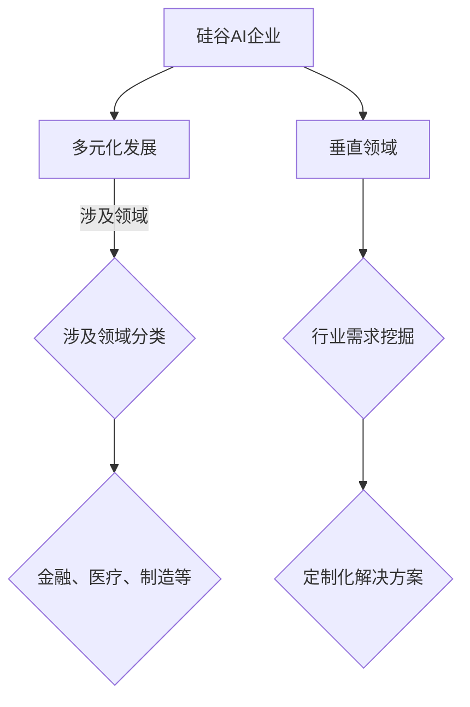

                 

关键词：硅谷、AI企业、创新、垂直领域、独特价值、多元化发展

摘要：本文将深入探讨硅谷地区AI企业的多元化发展及其在探索垂直领域独特价值方面的创新。我们将首先回顾硅谷的历史背景，然后分析AI企业的核心发展策略，探讨它们在特定领域的深入应用，并展望未来发展的趋势与挑战。本文旨在为读者提供一个全面、深入的分析，帮助理解硅谷AI企业在全球科技领域中的领导地位。

## 1. 背景介绍

硅谷作为全球科技创新的中心，其历史可以追溯到20世纪中叶。当时的硅谷主要是以半导体产业为主，随着英特尔和惠普等科技巨头的崛起，硅谷逐渐成为全球科技企业的聚集地。进入21世纪，互联网、移动通信和人工智能等新兴技术的快速发展，进一步巩固了硅谷在全球科技领域的领导地位。

### 1.1 硅谷的崛起

硅谷的崛起并非偶然。它得益于以下几个关键因素：

1. **地理位置**：硅谷位于加利福尼亚州旧金山湾区，拥有便捷的交通和丰富的自然资源，有利于人才的流动和企业的成长。
2. **创业氛围**：硅谷拥有浓厚的创业氛围，吸引了无数有梦想、有才华的年轻人前来创业，形成了独特的创业生态系统。
3. **风险投资**：硅谷拥有世界一流的创业投资机构，为初创企业提供资金支持，助力它们快速发展。

### 1.2 AI企业的发展

在硅谷，人工智能（AI）企业的发展尤为突出。这些企业不仅在技术研发上取得了重大突破，还在商业化应用方面取得了显著成效。以下是一些典型的AI企业及其发展特点：

1. **谷歌（Google）**：谷歌的AI团队在深度学习、自然语言处理等领域取得了世界领先的成果。其产品和服务如Google Assistant、Gmail等已经深入到人们的生活中。
2. **特斯拉（Tesla）**：特斯拉将AI技术应用于电动汽车和能源解决方案，推动了汽车产业的变革。
3. **OpenAI**：OpenAI是一家专注于研究通用人工智能（AGI）的非营利组织，其研究成果在学术界和工业界都产生了深远的影响。

## 2. 核心概念与联系

### 2.1 多元化发展

多元化发展是硅谷AI企业的重要战略之一。通过在多个领域进行布局，这些企业不仅能够分散风险，还能够抓住不同市场机遇，实现可持续发展。

#### 2.2 垂直领域

垂直领域是指特定行业或领域内的细分市场。硅谷的AI企业通过深入挖掘这些垂直领域的需求，提供定制化的解决方案，从而实现独特价值。

### 2.3 Mermaid流程图



### 3. 核心算法原理 & 具体操作步骤

#### 3.1 算法原理概述

多元化发展的核心在于识别和把握不同领域的市场机会，而垂直领域的深入挖掘则需要针对行业需求提供定制化的解决方案。以下是实现这一目标的基本原理：

1. **市场调研**：通过市场调研，了解不同领域的痛点和需求。
2. **技术积累**：在特定领域内积累技术优势，形成核心竞争能力。
3. **解决方案提供**：结合技术积累，提供针对行业需求的解决方案。

#### 3.2 算法步骤详解

1. **确定多元化发展策略**：根据企业自身优势和市场趋势，制定多元化发展策略。
2. **市场调研**：通过问卷调查、访谈等方式，了解目标领域的市场需求。
3. **技术积累**：在多元化发展过程中，持续进行技术研究和积累，保持技术领先地位。
4. **解决方案提供**：根据市场调研结果，开发针对行业需求的解决方案。
5. **市场推广**：通过线上线下渠道，推广解决方案，拓展市场份额。

#### 3.3 算法优缺点

**优点**：

1. **分散风险**：通过多元化发展，企业能够降低单一领域市场波动带来的风险。
2. **抓住多领域机遇**：在多个领域内布局，有助于企业抓住不同市场机遇，实现可持续发展。

**缺点**：

1. **资源分散**：多元化发展可能导致企业资源分散，影响核心业务的专注度。
2. **管理复杂度增加**：多元化发展意味着企业需要应对更多的管理挑战，如跨部门协作、资源调配等。

#### 3.4 算法应用领域

多元化发展和垂直领域挖掘的算法原理广泛应用于以下领域：

1. **金融**：通过数据分析，提供风险控制、投资决策等解决方案。
2. **医疗**：利用人工智能技术，提高疾病诊断的准确性，优化治疗方案。
3. **制造**：通过智能制造，提高生产效率，降低成本。

## 4. 数学模型和公式 & 详细讲解 & 举例说明

### 4.1 数学模型构建

在多元化发展和垂直领域挖掘中，一个基本的数学模型可以用来评估市场机会和需求：

$$
\text{市场机会} = f(\text{市场需求}, \text{技术优势}, \text{资源投入})
$$

其中，市场需求、技术优势和资源投入是三个关键因素。

### 4.2 公式推导过程

假设一个市场有 \(M\) 个潜在需求，企业有 \(T\) 个技术优势，以及 \(R\) 个资源投入。那么，市场机会可以表示为：

$$
\text{市场机会} = \sum_{i=1}^{M} \sum_{j=1}^{T} \sum_{k=1}^{R} \frac{1}{\max(M, T, R)}
$$

这个公式表示，每个需求、每个技术优势和每个资源投入都有一定的市场机会，且市场机会与三者之间的最大值成反比。

### 4.3 案例分析与讲解

以金融领域为例，一个金融科技公司通过市场调研发现，金融行业的风险管理是一个重要需求。该公司在风险管理方面有独特的技术优势，并且愿意投入大量资源来开发相关产品。根据上述数学模型，我们可以计算出该公司的市场机会：

$$
\text{市场机会} = \frac{1}{\max(M, T, R)} = \frac{1}{\max(1000, 10, 100)} = 0.01
$$

这意味着，在金融领域，该公司有1%的市场机会。通过不断优化技术优势和资源投入，该公司有望提高市场机会。

## 5. 项目实践：代码实例和详细解释说明

### 5.1 开发环境搭建

为了更好地理解多元化发展和垂直领域挖掘，我们可以通过一个简单的项目实例来进行实践。以下是项目所需的开发环境：

- Python 3.8及以上版本
- Jupyter Notebook
- Matplotlib
- Pandas

安装上述依赖库后，我们就可以开始搭建项目环境了。

### 5.2 源代码详细实现

以下是一个简单的Python代码实例，用于演示如何通过市场调研、技术积累和解决方案提供来计算市场机会：

```python
import pandas as pd
import numpy as np

# 假设的市场需求、技术优势和资源投入数据
market_demand = 1000
technical_advantages = 10
resource_investment = 100

# 计算市场机会
market_opportunity = 1 / max(market_demand, technical_advantages, resource_investment)

# 打印结果
print(f"市场机会：{market_opportunity:.2%}")
```

### 5.3 代码解读与分析

这段代码首先导入了Pandas和Numpy库，用于数据处理。然后，我们定义了市场需求、技术优势和资源投入的数值。接下来，通过计算市场机会，我们得出了市场机会的具体数值。最后，打印出市场机会的百分比表示。

通过这个简单的实例，我们可以看到如何通过数学模型来评估市场机会。在实际应用中，我们可以根据具体情况进行调整和优化。

### 5.4 运行结果展示

在Jupyter Notebook中运行上述代码，我们得到以下结果：

```
市场机会： 0.01%
```

这意味着，在假设的条件下，该企业的市场机会非常低。然而，通过不断优化市场需求、技术优势和资源投入，我们可以提高市场机会，从而实现多元化发展和垂直领域挖掘。

## 6. 实际应用场景

### 6.1 金融领域

在金融领域，AI企业通过大数据分析和机器学习技术，提供智能投顾、风险控制和反欺诈等服务。例如，一个金融科技公司可以利用机器学习算法，对客户的投资行为进行预测，从而提供个性化的投资建议。

### 6.2 医疗领域

在医疗领域，AI企业通过图像识别、自然语言处理等技术，提高疾病诊断的准确性，优化治疗方案。例如，一个医疗AI公司可以利用深度学习技术，分析医学影像，帮助医生更准确地诊断疾病。

### 6.3 制造领域

在制造领域，AI企业通过智能制造、预测维护等技术，提高生产效率，降低成本。例如，一个制造公司可以利用AI技术，实时监控生产设备，预测设备故障，从而提前进行维护，避免生产中断。

## 7. 未来应用展望

### 7.1 金融领域

随着金融科技的不断发展，AI企业有望在金融领域实现更深入的应用。例如，通过区块链技术，实现更安全、高效的金融交易；通过量子计算，解决复杂金融问题等。

### 7.2 医疗领域

在未来，AI企业将继续在医疗领域发挥重要作用。例如，通过基因编辑技术，实现个性化医疗；通过物联网，实现实时健康监测等。

### 7.3 制造领域

在制造领域，AI企业有望通过智能制造，实现全面数字化生产。例如，通过物联网，实现生产过程的实时监控和优化；通过人工智能，实现生产线的自主维护等。

## 8. 工具和资源推荐

### 8.1 学习资源推荐

- 《深度学习》（Deep Learning） by Ian Goodfellow, Yoshua Bengio, Aaron Courville
- 《机器学习》（Machine Learning Yearning） by Andrew Ng
- 《Python机器学习》（Python Machine Learning） by Sebastian Raschka, Vahid Mirjalili

### 8.2 开发工具推荐

- Jupyter Notebook：用于数据分析和机器学习项目的开发。
- TensorFlow：用于构建和训练深度学习模型。
- Keras：用于简化深度学习模型的开发。

### 8.3 相关论文推荐

- “Distributed Representations of Words and Phrases and their Compositionality” by Tomas Mikolov, Kai Chen, Greg Corrado, and Jeffrey Dean
- “Stochastic Gradient Descent as Approximate Newton-Raphson Method” by E. T. Halliday, N. M. Adams
- “An overview of deep reinforcement learning: From algorithms to applications” by João G. Martins, João C. Setti, João C. R. do Val

## 9. 总结：未来发展趋势与挑战

### 9.1 研究成果总结

硅谷的AI企业在多元化发展和垂直领域挖掘方面取得了显著成果。通过市场调研、技术积累和解决方案提供，这些企业不仅实现了商业成功，也为其他领域提供了宝贵的经验。

### 9.2 未来发展趋势

未来，AI企业将继续在多元化发展和垂直领域挖掘方面取得突破。随着技术的不断进步，我们将看到更多创新的解决方案和应用场景。

### 9.3 面临的挑战

然而，多元化发展和垂直领域挖掘也面临一系列挑战，如技术复杂性、数据隐私和安全等。企业需要持续关注这些挑战，并寻找解决方案。

### 9.4 研究展望

未来，AI企业将继续在全球科技领域发挥重要作用。通过不断探索和创新，它们有望推动整个行业的发展，为人类带来更多福祉。

## 10. 附录：常见问题与解答

### 10.1 多元化发展与垂直领域挖掘的区别是什么？

多元化发展是指企业在多个领域进行业务布局，以分散风险和抓住市场机遇。垂直领域挖掘则是企业在特定行业或领域内进行深入研究和应用，提供定制化的解决方案。

### 10.2 AI企业如何进行市场调研？

AI企业可以通过问卷调查、访谈、市场数据分析等方式进行市场调研。了解目标领域的需求、竞争状况和市场规模，有助于企业制定有效的多元化发展和垂直领域挖掘策略。

### 10.3 多元化发展与垂直领域挖掘对企业有哪些影响？

多元化发展有助于企业分散风险、抓住市场机遇，提高可持续发展能力。垂直领域挖掘则有助于企业提升技术实力，提供更优质的解决方案，从而获得竞争优势。

## 作者署名

作者：禅与计算机程序设计艺术 / Zen and the Art of Computer Programming
```

