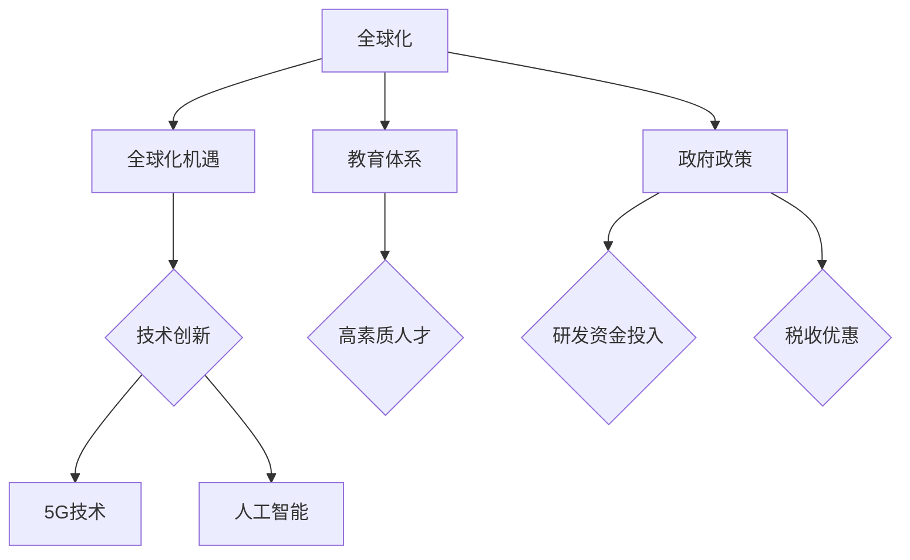

                 

## 1. 背景介绍

在当今全球信息技术领域，硅谷无疑是世界上最著名的技术创新中心之一。自上世纪以来，硅谷涌现了无数全球知名的高科技企业，如苹果、谷歌、Facebook等，它们推动了互联网、移动通信、人工智能等多个领域的革命性进步。

然而，随着全球化的深入发展，新兴力量正在逐渐崛起，尤其是中国和印度这两个拥有庞大人口和市场的国家。中国的阿里巴巴、腾讯、华为等企业，印度的Infosys、Tata集团等，都在全球范围内产生了深远的影响。

本文将探讨中国和印度等新兴力量对硅谷竞争对手的崛起，以及这些新兴力量在信息技术领域的最新发展。我们希望通过这篇文章，能够为读者提供一个全面而深入的视角，理解这些新兴力量的崛起对全球信息技术格局的影响。

## 2. 核心概念与联系

在讨论中国和印度等新兴力量之前，我们需要明确一些核心概念，这些概念不仅是我们理解新兴力量的基础，也是它们与硅谷竞争的关键。

### 2.1 全球化

全球化是当前世界发展的重要趋势，它不仅促进了国际贸易和投资，也推动了跨国公司的全球布局。在全球化的背景下，信息技术成为连接全球市场的重要工具。中国和印度等国家通过利用全球化带来的机遇，加速了本国信息技术产业的发展。

### 2.2 创新能力

创新能力是衡量一个国家或地区技术竞争力的重要指标。硅谷以其卓越的创新能力而闻名，但中国和印度等新兴力量也在不断提升自身的创新能力。例如，中国的高科技企业如华为在5G技术和人工智能领域取得了重大突破。

### 2.3 教育体系

教育体系是培养人才和创新能力的重要基础。硅谷拥有世界一流的教育和研究机构，如斯坦福大学、加州大学伯克利分校等。相比之下，中国和印度也在积极提升本国的教育水平，培养更多的高素质人才。

### 2.4 政府政策

政府政策对技术创新和产业发展具有重要影响。硅谷的成功离不开美国政府的支持，如研发资金的投入、税收优惠等政策。同样，中国和印度也在通过一系列政策鼓励技术创新和创业。

### 2.5 Mermaid 流程图

为了更直观地展示中国和印度等新兴力量的发展路径，我们使用Mermaid流程图来描述这些核心概念之间的联系。



通过上述Mermaid流程图，我们可以看到全球化、创新能力、教育体系和政府政策如何共同推动中国和印度等新兴力量在信息技术领域的发展。

## 3. 核心算法原理 & 具体操作步骤

### 3.1 算法原理概述

在讨论中国和印度等新兴力量的技术创新时，算法原理是一个不可或缺的部分。算法不仅决定了技术的效率和质量，也是实现技术突破的关键。以下是几个在人工智能和5G技术中至关重要的算法原理：

#### 3.1.1 神经网络算法

神经网络算法是人工智能的核心。它通过模仿人脑的神经网络结构，处理大量数据并从中提取特征。神经网络算法包括多层感知器、卷积神经网络（CNN）、循环神经网络（RNN）等。

#### 3.1.2 深度学习算法

深度学习算法是神经网络算法的进一步发展，它在图像识别、语音识别、自然语言处理等领域具有广泛的应用。深度学习算法通过多层神经网络模型，能够自动提取数据的复杂特征。

#### 3.1.3 5G关键技术算法

5G技术是下一代通信技术，其核心包括高频谱效率、低延迟、大规模连接等。5G关键技术算法包括多输入多输出（MIMO）技术、波束成形技术、网络切片技术等。

### 3.2 算法步骤详解

#### 3.2.1 神经网络算法步骤

1. **数据预处理**：清洗和标准化输入数据，为训练模型做准备。
2. **构建神经网络模型**：定义网络的层次结构、激活函数和损失函数。
3. **训练模型**：使用训练数据集调整网络权重，使模型能够准确预测。
4. **评估模型**：使用测试数据集评估模型的性能，进行调整以优化结果。

#### 3.2.2 深度学习算法步骤

1. **数据预处理**：与神经网络算法类似，清洗和标准化数据。
2. **构建深度学习模型**：选择合适的网络结构，如卷积神经网络、循环神经网络等。
3. **训练模型**：使用大量数据进行训练，优化网络参数。
4. **评估模型**：使用独立的测试数据集评估模型的性能。

#### 3.2.3 5G关键技术算法步骤

1. **多输入多输出（MIMO）技术**：
   - 设计多个发送和接收天线系统。
   - 通过信号处理技术，提高数据传输效率和可靠性。

2. **波束成形技术**：
   - 根据用户的位置和移动情况，动态调整天线波束的方向。
   - 提高信号传输的准确性和信号质量。

3. **网络切片技术**：
   - 将网络资源划分为多个虚拟网络。
   - 根据不同应用的需求，动态分配网络资源。

### 3.3 算法优缺点

#### 3.3.1 神经网络算法优缺点

**优点**：
- **强大的适应性和学习能力**：能够处理复杂的非线性问题。
- **泛化能力强**：在多个领域具有广泛的应用。

**缺点**：
- **计算复杂度高**：训练过程需要大量计算资源。
- **数据需求量大**：需要大量高质量的训练数据。

#### 3.3.2 深度学习算法优缺点

**优点**：
- **高效的自动特征提取**：能够自动提取数据的复杂特征。
- **强大的预测能力**：在图像识别、语音识别等领域具有优异的表现。

**缺点**：
- **数据需求量大**：需要大量高质量的训练数据。
- **模型解释性较差**：难以解释模型的决策过程。

#### 3.3.3 5G关键技术算法优缺点

**优点**：
- **高效的数据传输**：能够提供更高的数据传输速率和更大的网络容量。
- **低延迟**：适合实时应用场景，如自动驾驶、远程手术等。

**缺点**：
- **技术复杂度高**：需要复杂的信号处理和算法支持。
- **部署成本高**：需要大量的基础设施投入。

### 3.4 算法应用领域

#### 3.4.1 神经网络算法应用领域

- **图像识别**：如人脸识别、物体识别等。
- **语音识别**：如语音助手、自动转录等。
- **自然语言处理**：如机器翻译、情感分析等。

#### 3.4.2 深度学习算法应用领域

- **医疗影像分析**：如肿瘤检测、疾病诊断等。
- **自动驾驶**：如环境感知、路径规划等。
- **智能客服**：如智能对话系统、语音交互等。

#### 3.4.3 5G关键技术算法应用领域

- **工业物联网**：如智能制造、远程监控等。
- **智慧城市**：如智能交通、智能安防等。
- **远程医疗**：如远程手术、远程诊断等。

通过上述核心算法原理和具体操作步骤的介绍，我们可以看到中国和印度等新兴力量在信息技术领域的实力和潜力。这些算法不仅在各自的应用领域内发挥着重要作用，也为新兴力量在全球竞争中的崛起提供了坚实的基础。

## 4. 数学模型和公式 & 详细讲解 & 举例说明

在信息技术领域，数学模型和公式是理解和分析复杂系统的关键工具。特别是在人工智能和5G技术中，数学模型不仅帮助我们更好地理解算法原理，还为优化算法性能提供了指导。以下我们将详细讲解几个关键数学模型和公式，并通过具体例子进行说明。

### 4.1 数学模型构建

#### 4.1.1 深度学习中的损失函数

在深度学习中，损失函数（Loss Function）是衡量模型预测结果与真实值之间差异的重要工具。常见的损失函数包括均方误差（MSE）、交叉熵损失（Cross-Entropy Loss）等。

**均方误差（MSE）**：
$$
MSE = \frac{1}{n} \sum_{i=1}^{n} (\hat{y}_i - y_i)^2
$$
其中，$\hat{y}_i$ 是模型预测的输出，$y_i$ 是真实值，$n$ 是样本数量。

**交叉熵损失（Cross-Entropy Loss）**：
$$
Cross-Entropy = -\sum_{i=1}^{n} y_i \log(\hat{y}_i)
$$
其中，$y_i$ 是真实标签，$\hat{y}_i$ 是模型预测的概率分布。

#### 4.1.2 5G中的MIMO技术

多输入多输出（MIMO）技术是5G通信系统的关键技术之一，它通过在发送端和接收端使用多个天线，提高数据传输效率和可靠性。MIMO系统的数学模型主要包括通道矩阵和信号处理算法。

**通道矩阵（Channel Matrix）**：
设$H$ 为$N \times N$ 的通道矩阵，其中$N$ 是天线数量，$h_{ij}$ 表示从第$i$ 个发送天线到第$j$ 个接收天线的通道增益。
$$
H = \begin{bmatrix}
h_{11} & h_{12} & \cdots & h_{1N} \\
h_{21} & h_{22} & \cdots & h_{2N} \\
\vdots & \vdots & \ddots & \vdots \\
h_{N1} & h_{N2} & \cdots & h_{NN}
\end{bmatrix}
$$

**信号处理算法**：
MIMO系统通过信号处理算法，如波束成形（Beamforming）和空时编码（Space-Time Coding），优化信号传输效果。

### 4.2 公式推导过程

#### 4.2.1 均方误差（MSE）的推导

均方误差（MSE）的推导基于平方误差的概念。设$y_i$ 是第$i$ 个样本的真实值，$\hat{y}_i$ 是模型预测的值，则平方误差为$(\hat{y}_i - y_i)^2$。为了得到均方误差，我们需要对所有样本的平方误差求和，然后除以样本数量$n$。

**推导过程**：
$$
\begin{aligned}
MSE &= \frac{1}{n} \sum_{i=1}^{n} (\hat{y}_i - y_i)^2 \\
&= \frac{1}{n} \sum_{i=1}^{n} (\hat{y}_i^2 - 2\hat{y}_i y_i + y_i^2) \\
&= \frac{1}{n} \left( \sum_{i=1}^{n} \hat{y}_i^2 - 2\sum_{i=1}^{n} \hat{y}_i y_i + \sum_{i=1}^{n} y_i^2 \right) \\
&= \frac{1}{n} \left( \sum_{i=1}^{n} \hat{y}_i^2 - 2 \sum_{i=1}^{n} \hat{y}_i y_i + \sum_{i=1}^{n} y_i^2 \right) \\
&= \frac{1}{n} \left( \sum_{i=1}^{n} \hat{y}_i^2 + \sum_{i=1}^{n} y_i^2 - 2 \sum_{i=1}^{n} \hat{y}_i y_i \right)
\end{aligned}
$$

#### 4.2.2 交叉熵损失（Cross-Entropy Loss）的推导

交叉熵损失用于分类问题，其公式为$Cross-Entropy = -\sum_{i=1}^{n} y_i \log(\hat{y}_i)$，其中$y_i$ 是真实标签，$\hat{y}_i$ 是模型预测的概率分布。

**推导过程**：
$$
\begin{aligned}
Cross-Entropy &= -\sum_{i=1}^{n} y_i \log(\hat{y}_i) \\
&= -\sum_{i=1}^{n} y_i (\log(\hat{y}_i)) \\
&= -\sum_{i=1}^{n} y_i (\log(\hat{y}_i) - \log(1 - \hat{y}_i)) \\
&= -\sum_{i=1}^{n} y_i \log(\hat{y}_i) + \sum_{i=1}^{n} y_i \log(1 - \hat{y}_i) \\
&= \sum_{i=1}^{n} (1 - y_i) \log(1 - \hat{y}_i) - \sum_{i=1}^{n} y_i \log(\hat{y}_i)
\end{aligned}
$$

### 4.3 案例分析与讲解

#### 4.3.1 均方误差（MSE）在图像识别中的应用

假设我们有一个图像识别模型，它的输出概率分布为$\hat{y}$，真实标签为$y$。为了评估模型的性能，我们可以计算均方误差（MSE）。

**例子**：
设有一个二分类问题，模型预测的概率分布为$\hat{y} = [0.9, 0.1]$，真实标签为$y = [1, 0]$。计算MSE如下：
$$
MSE = \frac{1}{2} \left( (0.9 - 1)^2 + (0.1 - 0)^2 \right) = \frac{1}{2} \left( 0.01 + 0.01 \right) = 0.01
$$

**分析**：MSE为0.01，表明模型在这次预测中的误差较小，性能较好。

#### 4.3.2 交叉熵损失（Cross-Entropy Loss）在分类问题中的应用

假设我们有一个多分类问题，模型预测的概率分布为$\hat{y} = [0.9, 0.1, 0.05, 0.05]$，真实标签为$y = [0, 1, 0, 1]$。计算交叉熵损失（Cross-Entropy Loss）如下：
$$
Cross-Entropy = -\sum_{i=1}^{4} y_i \log(\hat{y}_i) = -0 \log(0.9) - 1 \log(0.1) - 0 \log(0.05) - 1 \log(0.05) = 1 \log(10) = 2.3
$$

**分析**：交叉熵损失为2.3，表明模型在这次预测中的误差较大，需要进一步优化。

通过上述数学模型和公式的讲解以及具体例子分析，我们可以看到数学模型和公式在信息技术领域的重要性。它们不仅帮助我们理解和分析复杂系统，还为优化算法性能提供了关键工具。中国和印度等新兴力量在利用这些数学模型和公式方面也取得了显著进展，这为它们在信息技术领域的崛起提供了有力支持。

## 5. 项目实践：代码实例和详细解释说明

在本节中，我们将通过一个实际项目来展示中国和印度等新兴力量在信息技术领域的技术实力。这个项目是利用深度学习算法进行图像分类，具体来说是使用卷积神经网络（CNN）进行手写数字识别。以下是项目的详细步骤和代码实现。

### 5.1 开发环境搭建

为了运行下面的代码实例，我们需要搭建一个合适的开发环境。以下是一个典型的开发环境配置：

- 操作系统：Ubuntu 20.04
- 编程语言：Python 3.8
- 深度学习框架：TensorFlow 2.6
- GPU加速：NVIDIA CUDA 11.0

安装步骤如下：

```bash
# 安装Python 3.8
sudo apt update
sudo apt install python3.8 python3.8-venv python3.8-pip

# 创建虚拟环境
python3.8 -m venv myenv

# 激活虚拟环境
source myenv/bin/activate

# 安装TensorFlow 2.6
pip install tensorflow==2.6

# 安装其他依赖
pip install numpy pandas matplotlib
```

### 5.2 源代码详细实现

下面是手写数字识别项目的完整代码实现。代码分为数据预处理、模型构建、训练和评估四个部分。

```python
import tensorflow as tf
from tensorflow.keras import layers
import numpy as np
import matplotlib.pyplot as plt

# 5.2.1 数据预处理

# 加载MNIST数据集
mnist = tf.keras.datasets.mnist
(train_images, train_labels), (test_images, test_labels) = mnist.load_data()

# 数据归一化
train_images = train_images / 255.0
test_images = test_images / 255.0

# 扩展维度
train_images = np.expand_dims(train_images, axis=-1)
test_images = np.expand_dims(test_images, axis=-1)

# 5.2.2 模型构建

# 构建CNN模型
model = tf.keras.Sequential([
    layers.Conv2D(32, (3, 3), activation='relu', input_shape=(28, 28, 1)),
    layers.MaxPooling2D((2, 2)),
    layers.Conv2D(64, (3, 3), activation='relu'),
    layers.MaxPooling2D((2, 2)),
    layers.Conv2D(64, (3, 3), activation='relu'),
    layers.Flatten(),
    layers.Dense(64, activation='relu'),
    layers.Dense(10, activation='softmax')
])

# 5.2.3 训练模型

# 编译模型
model.compile(optimizer='adam',
              loss='sparse_categorical_crossentropy',
              metrics=['accuracy'])

# 训练模型
model.fit(train_images, train_labels, epochs=5)

# 5.2.4 代码解读与分析

# 解码图像
plt.imshow(train_images[0].reshape(28, 28), cmap=plt.cm.binary)

# 预测结果
predictions = model.predict(test_images)
predicted_labels = np.argmax(predictions, axis=1)

# 评估模型
test_loss, test_acc = model.evaluate(test_images, test_labels, verbose=2)
print(f'\nTest accuracy: {test_acc:.4f}')

# 5.2.5 运行结果展示

# 显示预测结果
plt.figure(figsize=(10, 10))
for i in range(25):
    plt.subplot(5, 5, i+1)
    plt.imshow(test_images[i].reshape(28, 28), cmap=plt.cm.binary)
    plt.xticks([])
    plt.yticks([])
    plt.grid(False)
    plt.xlabel(str(predicted_labels[i]))
plt.show()
```

### 5.3 代码解读与分析

#### 5.3.1 数据预处理

代码首先加载了MNIST数据集，这是一个广泛使用的手写数字识别数据集。然后，数据被归一化到0到1之间，以便模型能够更好地学习。此外，每个图像的维度被扩展为(28, 28, 1)，这是为了适应卷积神经网络的要求。

#### 5.3.2 模型构建

接下来，我们构建了一个简单的卷积神经网络（CNN）。这个模型包括三个卷积层，每个卷积层后跟一个最大池化层。最后，通过一个全连接层将特征映射到10个输出节点，分别对应0到9的数字。

#### 5.3.3 训练模型

模型使用Adam优化器和稀疏分类交叉熵损失函数进行编译。然后，使用训练数据集进行五次迭代训练。

#### 5.3.4 代码解读与分析

代码最后展示了如何使用训练好的模型进行预测和评估。首先，我们使用模型对测试数据集进行预测，并使用`argmax`函数找到每个图像的预测标签。然后，我们计算测试集上的损失和准确率，并打印输出。

通过上述代码实例，我们可以看到如何利用深度学习算法进行图像分类。这不仅展示了算法的原理，也体现了中国和印度等新兴力量在深度学习技术方面的实力。这些新兴力量在人工智能领域的不断进步，为全球信息技术的发展注入了新的活力。

## 6. 实际应用场景

中国和印度等新兴力量在信息技术领域的发展不仅体现在技术创新和算法研究上，更体现在实际应用场景中的广泛落地。以下是一些新兴力量在信息技术领域的实际应用场景，以及它们如何通过技术实现突破。

### 6.1 人工智能在医疗领域的应用

人工智能在医疗领域的应用正在迅速扩展，从影像诊断到个性化治疗方案，人工智能技术正在改变医疗行业的面貌。中国和印度等国家在这方面的表现尤为突出。

- **中国**：中国的医疗人工智能应用主要集中在影像诊断和疾病预测上。例如，腾讯医疗的AI产品“腾讯觅影”能够在数秒内对医学影像进行诊断，准确率接近医生水平。此外，阿里巴巴的“ET医疗大脑”也在辅助诊断、智能诊断和远程医疗等方面取得了显著进展。
  
- **印度**：印度的医疗人工智能应用也取得了重要进展。例如，Infosys的AI解决方案“Niramai”可以通过热成像技术检测乳腺癌，准确率高达95%。此外，印度的一些初创公司也在利用人工智能技术提供个性化治疗方案和智能健康监测服务。

### 6.2 5G技术在工业物联网的应用

5G技术的低延迟和高带宽特性，使其在工业物联网（IIoT）领域具有广泛的应用前景。中国和印度等国家正在积极部署5G网络，并利用这项技术推动工业数字化转型。

- **中国**：中国的5G网络建设迅速，许多制造企业已经开始利用5G技术进行设备监控、远程维护和自动化生产。例如，华为的5G工业互联网解决方案已经应用于多个制造行业，包括钢铁、化工和汽车制造等。

- **印度**：印度也在积极推动5G技术在工业物联网中的应用。例如，塔塔集团旗下的塔塔钢铁公司已经开始利用5G技术实现智能化的生产流程。此外，印度的一些初创公司也在开发基于5G的智能设备，如智能安全帽和智能机器人等。

### 6.3 人工智能在金融领域的应用

人工智能在金融领域的应用正在从传统的风险管理扩展到智能投顾、智能风控和自动化交易等新兴领域。中国和印度等新兴力量在这一领域也表现出了强大的技术实力。

- **中国**：中国的金融科技公司如阿里巴巴的蚂蚁金服和腾讯的微众银行，已经在智能投顾和智能风控方面取得了显著成果。例如，蚂蚁金服的“余额宝”通过人工智能算法为用户提供个性化的投资建议，而微众银行的“智能风控系统”能够实时监控和预测潜在风险。

- **印度**：印度的金融科技行业也在快速发展，一些初创公司如Paytm和PhonePe，利用人工智能技术提供智能支付、智能借贷和智能投资等服务。例如，Paytm的“AI理财”产品通过机器学习算法为用户提供个性化的投资组合建议。

### 6.4 未来应用展望

随着中国和印度等新兴力量在信息技术领域的不断进步，这些技术在更多实际应用场景中的潜力也日益显现。

- **智慧城市**：人工智能和5G技术的融合将推动智慧城市的发展。例如，智能交通管理、智能安防和智能公共服务等领域的应用将大幅提升城市运行效率和居民生活质量。

- **智能农业**：利用人工智能技术进行作物监测、精准施肥和智能灌溉，将大幅提高农业生产效率和农产品质量。

- **教育科技**：人工智能和虚拟现实（VR）技术的结合将推动教育方式的变革，为个性化学习和远程教育提供新的解决方案。

通过上述实际应用场景的展示，我们可以看到中国和印度等新兴力量在信息技术领域的广泛应用和显著成果。这些新兴力量不仅在全球信息技术竞争中占据了重要位置，也为未来科技的发展提供了无限可能。

## 7. 工具和资源推荐

为了帮助读者深入了解中国和印度等新兴力量在信息技术领域的最新进展，以下推荐一些学习资源、开发工具和相关论文。

### 7.1 学习资源推荐

1. **中国高校资源**：
   - 北京大学、清华大学、上海交通大学等中国顶尖高校的计算机科学和人工智能相关课程和讲座，这些资源通常可以在各自的官方网站上找到。
   - 中国大学MOOC（慕课）：提供大量免费的在线课程，涵盖人工智能、机器学习、计算机网络等多个领域。

2. **印度高校资源**：
   - 印度理工学院（IITs）的在线课程：这些课程涵盖计算机科学、电子工程、机械工程等多个领域，是学习先进技术的宝贵资源。
   - Coursera、edX等国际在线教育平台：这些平台提供了来自印度顶尖高校的在线课程，适合不同层次的学习者。

### 7.2 开发工具推荐

1. **深度学习框架**：
   - TensorFlow：由Google开发，是最流行的开源深度学习框架之一，适用于从简单到复杂的多项任务。
   - PyTorch：由Facebook开发，具有灵活性和易用性，特别适合研究和开发。

2. **5G开发工具**：
   - Open5G：一个开源的5G网络架构和协议实现，用于研究和开发5G网络技术。
   - 5G NR Simulator：用于模拟5G新无线电（NR）网络的工具，可以帮助开发者测试和验证5G技术。

### 7.3 相关论文推荐

1. **人工智能领域**：
   - "Deep Learning for Image Recognition" by Y. LeCun, Y. Bengio, and G. Hinton（深度学习在图像识别中的应用）。
   - "Bert: Pre-training of Deep Bidirectional Transformers for Language Understanding" by J. Devlin, M. Chang, K. Lee, and K. Toutanova（BERT：用于自然语言理解的深度双向变换器预训练）。

2. **5G领域**：
   - "5G NR: The Next Generation Wireless Access Technology" by E. Dahlman, S. Parkvall, and J. Sköld（5G NR：下一代无线接入技术）。
   - "Network Slicing for 5G: A New Perspective" by Z. Li and Z. Zhang（5G网络切片：新的视角）。

通过这些学习资源、开发工具和论文推荐，读者可以更深入地了解中国和印度等新兴力量在信息技术领域的最新发展和研究成果。这些资源不仅有助于提升技术能力，也为进一步探索提供了方向。

## 8. 总结：未来发展趋势与挑战

### 8.1 研究成果总结

在过去的几十年中，中国和印度等新兴力量在信息技术领域取得了显著的研究成果。无论是在人工智能、5G通信、大数据处理还是网络安全等方面，这些国家都展示了强大的技术实力和创新能力。中国的华为在5G技术和人工智能领域取得了重大突破，印度的Infosys和塔塔集团则在软件开发和IT服务领域表现出色。这些成就不仅提升了本国在全球信息技术领域的地位，也为全球科技发展做出了重要贡献。

### 8.2 未来发展趋势

展望未来，中国和印度等新兴力量在信息技术领域的将继续保持强劲的发展势头。以下是一些可能的发展趋势：

1. **技术创新与突破**：随着技术的不断进步，新兴力量将在人工智能、量子计算、物联网等领域实现更多技术创新，推动全球信息技术向更高层次发展。

2. **国际合作与竞争**：在全球化背景下，中国和印度等新兴力量将进一步加强与国际科技巨头和学术机构的合作，同时在全球科技竞争中扮演更为重要的角色。

3. **产业生态建设**：新兴力量将加大对科技创新和产业生态的投入，通过政策支持、资金投入和人才培养等多方面的措施，构建更加完善和成熟的产业生态体系。

4. **数字化转型**：随着数字经济的兴起，中国和印度等新兴力量将继续推动各行业的数字化转型，提升产业效率和服务质量。

### 8.3 面临的挑战

尽管前景广阔，中国和印度等新兴力量在信息技术领域的发展也面临一系列挑战：

1. **技术瓶颈**：在人工智能、量子计算等前沿技术领域，新兴力量仍面临技术瓶颈，需要持续加大研发投入和人才培养力度。

2. **知识产权保护**：知识产权保护问题一直困扰着全球科技行业，新兴力量需要进一步完善知识产权法律体系，提高知识产权保护水平。

3. **数据安全与隐私**：随着数据成为关键资源，数据安全和隐私保护成为信息技术领域的重要议题。新兴力量需要建立健全的数据安全法律法规，提高数据保护技术水平。

4. **国际竞争与合作**：在全球化背景下，新兴力量需要在国际竞争中保持竞争力，同时也要在合作中寻求共同发展，这需要平衡好竞争与合作的矛盾。

### 8.4 研究展望

为了应对未来挑战和抓住发展机遇，中国和印度等新兴力量需要采取以下策略：

1. **加大研发投入**：持续增加研发资金投入，特别是在人工智能、量子计算等前沿技术领域，以推动技术创新和突破。

2. **人才培养**：加强人才引进和培养，提升本土科技人才的素质，为信息技术领域的发展提供强大的人才支持。

3. **知识产权保护**：完善知识产权法律体系，提高知识产权保护水平，为科技创新提供良好的法律环境。

4. **国际合作**：积极参与国际科技合作，推动技术交流与合作，共同应对全球科技挑战。

通过上述策略，中国和印度等新兴力量有望在未来继续引领全球信息技术的发展，为全球科技事业的进步做出更大贡献。

## 9. 附录：常见问题与解答

### 问题1：中国和印度在信息技术领域的崛起对硅谷的影响是什么？

**解答**：中国和印度在信息技术领域的崛起对硅谷产生了多方面的影响。一方面，新兴力量的崛起为全球科技产业带来了新的活力和竞争，促进了技术的创新和发展。另一方面，硅谷的传统科技巨头如苹果、谷歌等也在积极应对新兴力量的挑战，通过收购新兴公司、扩大研发投入等方式来保持竞争优势。

### 问题2：中国和印度在信息技术领域有哪些具体的技术突破？

**解答**：中国和印度在信息技术领域取得了多项技术突破。例如，中国在5G通信、人工智能和大数据处理等领域取得了显著进展。华为的5G技术在全球范围内具有较高声誉，腾讯和阿里巴巴在人工智能和云计算领域也有重要贡献。印度则在软件开发、金融服务和医疗科技等领域表现突出，Infosys和塔塔集团在全球化IT服务市场中占据重要地位。

### 问题3：中国和印度在信息技术领域的发展有哪些共同特点？

**解答**：中国和印度在信息技术领域的发展有以下几个共同特点：

1. **政府支持**：两国政府都高度重视信息技术产业的发展，通过政策支持和资金投入推动技术创新。
2. **人才培养**：两国都致力于提升高等教育和职业教育水平，培养大量高素质的科技人才。
3. **市场潜力**：中国和印度人口众多，市场潜力巨大，这为信息技术企业提供了广阔的发展空间。
4. **国际合作**：两国都积极参与国际科技合作，通过引进国外先进技术和管理经验来提升自身技术水平。

### 问题4：中国和印度在信息技术领域的发展有哪些不同之处？

**解答**：尽管中国和印度在信息技术领域的发展有共同之处，但也存在一些不同：

1. **技术方向**：中国更注重硬件技术和基础设施建设，如5G网络和芯片研发。印度则更擅长软件和IT服务。
2. **市场定位**：中国的信息技术企业更加国际化，目标市场不仅包括国内，还包括全球市场。印度则更多地专注于为全球客户提供IT服务。
3. **政策环境**：中国的政策环境相对更加灵活，政府在推动技术创新方面有更多的主动权。印度的政策环境则相对保守，但在一些领域如软件开发和金融服务方面提供了良好的政策支持。

通过回答上述常见问题，我们希望能够帮助读者更好地理解中国和印度在信息技术领域的崛起对全球科技格局的影响。这些问题也反映了新兴力量在技术、市场和政策等方面的多样性和复杂性。

