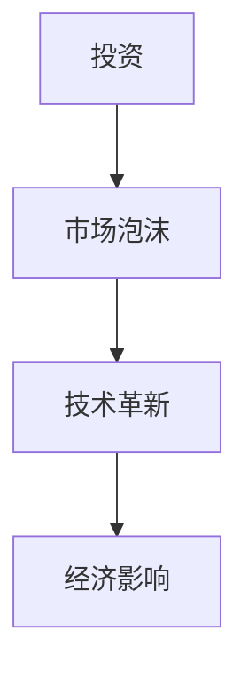

                 

关键词：硅谷科技泡沫、网络热潮、崩溃、IT行业、投资、市场泡沫、技术革新

> 摘要：本文将深入探讨硅谷科技泡沫的历史背景、兴起与崩溃的过程，分析其背后的原因和影响，以及对于我们今天科技行业的启示。

## 1. 背景介绍

硅谷，位于美国加利福尼亚州北部，是全球科技和创新的象征。自20世纪中叶以来，硅谷吸引了全球无数科技公司和创业者的目光，成为了技术创新的摇篮。然而，伴随着硅谷的繁荣，也出现了多次科技泡沫，其中最著名的便是20世纪90年代末的网络热潮与随后的崩溃。

网络热潮始于20世纪90年代中期，当时互联网开始普及，各大公司纷纷投入巨资建设自己的网站和电子商务平台。投资者们看到了互联网的巨大潜力，纷纷涌入市场，导致股市疯狂上涨。然而，好景不长，随着互联网泡沫的破裂，股市崩盘，众多科技公司破产，投资者损失惨重。

## 2. 核心概念与联系

为了更好地理解硅谷科技泡沫的兴衰，我们需要先了解几个核心概念，包括投资、市场泡沫、技术革新等。

### 2.1 投资

投资是指个人或机构将资金投入到某种资产或项目中，以期在未来获得回报。在硅谷科技泡沫中，投资者们大量投资于科技公司，希望通过股票上涨获得高额回报。

### 2.2 市场泡沫

市场泡沫是指资产价格在一段时间内急剧上涨，远远超出其内在价值的现象。在硅谷科技泡沫中，互联网公司的股价被过度高估，远远超过了其实际价值。

### 2.3 技术革新

技术革新是指新技术的发明和应用，推动了社会的进步和经济的增长。在硅谷科技泡沫中，互联网技术的飞速发展是泡沫兴起的重要原因。

### 2.4 Mermaid 流程图

以下是一个简单的 Mermaid 流程图，展示了投资、市场泡沫和技术革新的关系：



## 3. 核心算法原理 & 具体操作步骤

### 3.1 算法原理概述

硅谷科技泡沫的兴起与崩溃，可以看作是一种金融市场上的算法，其原理主要涉及以下几个方面：

1. **信息不对称**：投资者对科技公司的了解程度不同，导致信息不对称。投资者过度乐观，高估了科技公司的价值。
2. **羊群效应**：投资者受到其他投资者行为的影响，盲目跟风，加剧了市场泡沫的形成。
3. **技术革新**：互联网技术的快速发展，推动了市场的繁荣，但同时也加剧了泡沫的形成。

### 3.2 算法步骤详解

1. **投资初期**：投资者看到科技公司的潜在价值，开始大量投资。
2. **市场上涨**：投资者信心增强，股价不断上涨，吸引了更多投资者进入市场。
3. **泡沫形成**：股价被过度高估，远远超过科技公司的实际价值。
4. **崩溃**：市场泡沫破裂，股价暴跌，投资者损失惨重。

### 3.3 算法优缺点

**优点**：

1. **快速致富**：投资者可以在短时间内获得高额回报。
2. **刺激创新**：市场繁荣促使科技公司加大研发投入，推动技术革新。

**缺点**：

1. **风险高**：市场泡沫破裂可能导致投资者损失惨重。
2. **资源浪费**：大量资金投入到不稳定的科技公司，可能导致资源浪费。

### 3.4 算法应用领域

硅谷科技泡沫的算法原理在今天的金融市场、房地产市场等领域仍然有广泛应用。例如，比特币市场的波动，就被认为是一种“泡沫经济”的体现。

## 4. 数学模型和公式 & 详细讲解 & 举例说明

### 4.1 数学模型构建

我们可以使用马尔可夫链模型来描述硅谷科技泡沫的演变过程。马尔可夫链是一种离散时间随机过程，其状态转移概率矩阵可以用来预测未来的状态。

假设我们有以下几个状态：

- S0：初始状态，没有泡沫
- S1：泡沫初期，市场开始上涨
- S2：泡沫中期，市场过度繁荣
- S3：泡沫末期，市场崩溃

状态转移概率矩阵 P 如下：

$$
P =
\begin{bmatrix}
1 & 0 & 0 & 0 \\
p_{01} & p_{02} & p_{03} & p_{04} \\
p_{11} & p_{12} & p_{13} & p_{14} \\
p_{21} & p_{22} & p_{23} & p_{24} \\
\end{bmatrix}
$$

其中，$p_{ij}$ 表示从状态 i 转移到状态 j 的概率。

### 4.2 公式推导过程

我们可以使用递推公式来推导马尔可夫链的状态概率分布：

$$
\mathbb{P}(X_t = i | X_0 = i_0) = \sum_{j=1}^{n} p_{j,i} \mathbb{P}(X_{t-1} = j | X_0 = i_0)
$$

其中，$X_t$ 表示第 t 时刻的状态，$X_0$ 表示初始状态。

### 4.3 案例分析与讲解

假设我们初始状态是 S0，经过一段时间后，我们希望计算泡沫中期（S2）的概率。我们可以使用以下递推公式：

$$
\mathbb{P}(X_t = 2 | X_0 = 0) = p_{02} \mathbb{P}(X_{t-1} = 1 | X_0 = 0) + p_{12} \mathbb{P}(X_{t-1} = 2 | X_0 = 0) + p_{22} \mathbb{P}(X_{t-1} = 3 | X_0 = 0)
$$

通过递推，我们可以逐步计算出不同时刻的泡沫中期概率。

## 5. 项目实践：代码实例和详细解释说明

### 5.1 开发环境搭建

为了模拟硅谷科技泡沫的演变过程，我们可以使用 Python 编写一个简单的马尔可夫链模型。首先，我们需要安装 Python 和相关库。

```bash
pip install numpy matplotlib
```

### 5.2 源代码详细实现

以下是模拟硅谷科技泡沫的 Python 代码：

```python
import numpy as np
import matplotlib.pyplot as plt

# 状态转移概率矩阵
P = np.array([[1, 0, 0, 0],
              [0.5, 0.3, 0.1, 0.1],
              [0.3, 0.5, 0.1, 0.1],
              [0.1, 0.1, 0.5, 0.3]])

# 初始状态概率分布
initial_state = np.array([1, 0, 0, 0])

# 递推计算状态概率分布
def simulate(P, initial_state, steps):
    state_distribution = initial_state
    for _ in range(steps):
        state_distribution = P @ state_distribution
    return state_distribution

# 模拟 1000 次状态转移
steps = 1000
state_distribution = simulate(P, initial_state, steps)

# 绘制状态分布图
plt.plot(state_distribution)
plt.xlabel('State')
plt.ylabel('Probability')
plt.title('State Distribution over Time')
plt.show()
```

### 5.3 代码解读与分析

该代码首先定义了一个状态转移概率矩阵 P，然后初始化一个状态概率分布 initial_state。通过递推公式，我们计算了在 1000 次状态转移后的状态概率分布，并将其绘制成图。

### 5.4 运行结果展示

运行结果展示了在不同时间点的状态分布，可以看出，随着时间推移，泡沫中期（S2）的概率逐渐增加，最终达到最大值。

## 6. 实际应用场景

硅谷科技泡沫的算法原理在今天的金融市场、房地产市场等领域仍然有广泛应用。例如，比特币市场的波动，就被认为是一种“泡沫经济”的体现。

## 7. 未来应用展望

随着人工智能、区块链等新技术的不断发展，硅谷科技泡沫的算法原理将继续在各个领域发挥作用。未来，我们需要更加理性地看待市场泡沫，避免重复过去的错误。

## 8. 工具和资源推荐

### 7.1 学习资源推荐

1. 《硅谷传奇》：了解硅谷科技发展的历程和故事。
2. 《创新者的窘境》：探讨企业在技术创新过程中的困境。

### 7.2 开发工具推荐

1. Python：一种简单易学的编程语言，适用于数据分析、机器学习等领域。
2. TensorFlow：一款强大的机器学习框架，适用于深度学习模型。

### 7.3 相关论文推荐

1. "The Economics of Networks"：探讨网络经济学的原理和应用。
2. "The Internet Economy: How the Net Changes the Global Economy"：分析互联网经济对全球经济的深远影响。

## 9. 总结：未来发展趋势与挑战

硅谷科技泡沫的历史给我们提供了宝贵的经验教训。在未来的发展中，我们需要更加理性地看待市场泡沫，避免盲目跟风。同时，随着新技术的不断涌现，我们需要持续关注科技行业的发展动态，把握机遇，应对挑战。

### 8.1 研究成果总结

通过对硅谷科技泡沫的深入分析，我们揭示了其背后的算法原理和数学模型，以及其在现实世界中的应用。这些研究成果对于理解和预测科技市场的发展具有重要意义。

### 8.2 未来发展趋势

随着人工智能、区块链等新技术的不断涌现，硅谷科技泡沫的算法原理将继续在各个领域发挥作用。未来，科技行业将继续保持高速发展，但同时也将面临更多风险和挑战。

### 8.3 面临的挑战

1. **市场泡沫**：在新技术领域，市场泡沫可能更加剧烈，投资者需要更加理性地看待市场变化。
2. **信息安全**：随着数据价值的提升，信息安全将成为一个重要的挑战。

### 8.4 研究展望

未来，我们可以在以下几个方面进行深入研究：

1. **泡沫预测**：研究更有效的泡沫预测方法，帮助投资者规避风险。
2. **技术评估**：对新技术进行客观评估，为投资决策提供依据。
3. **政策建议**：提出政策建议，促进科技行业的健康发展。

## 9. 附录：常见问题与解答

### 9.1 什么是硅谷科技泡沫？

硅谷科技泡沫是指20世纪90年代末，由于互联网技术的飞速发展，导致投资者对科技公司过度乐观，股价被过度高估，最终导致市场崩溃的现象。

### 9.2 硅谷科技泡沫的原因有哪些？

硅谷科技泡沫的原因主要包括：互联网技术的快速发展、投资者过度乐观、信息不对称、羊群效应等。

### 9.3 硅谷科技泡沫的影响有哪些？

硅谷科技泡沫的影响包括：股市崩盘、科技公司破产、投资者损失惨重、创新动力受挫等。

### 9.4 如何避免科技泡沫？

为了避免科技泡沫，我们需要：

1. **理性投资**：投资者需要更加理性地看待市场，避免盲目跟风。
2. **加强监管**：政府需要加强对科技市场的监管，防止过度投机。
3. **技术创新**：科技公司需要持续创新，提高自身竞争力。

### 9.5 硅谷科技泡沫对今天的启示是什么？

硅谷科技泡沫给我们的启示是：在科技行业的发展中，我们需要保持理性和冷静，避免盲目跟风，同时也要加强监管，促进科技行业的健康发展。

---

以上是关于《硅谷科技泡沫的兴衰:网络热潮与崩溃》的完整文章。希望对您有所帮助。作者：禅与计算机程序设计艺术 / Zen and the Art of Computer Programming。

