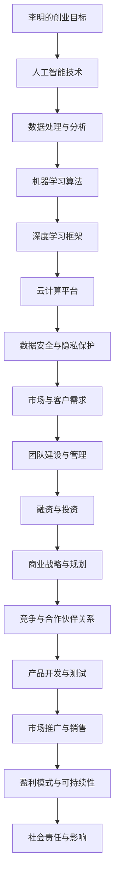

                 

关键词：硅谷移民、创业、创新、技术、文化适应

摘要：本文以硅谷为背景，讲述了一位来自中国的技术移民在硅谷创业的故事。通过描述他在文化适应、技术挑战、团队建设和市场拓展方面的经历，探讨了硅谷独特的创业生态系统对于全球技术移民的影响和启示。

## 1. 背景介绍

硅谷，这个位于美国加利福尼亚州旧金山湾区的小小地区，却成为了全球科技创新的中心。无数科技巨头如谷歌、苹果、Facebook（现Meta）等在这里诞生、成长，吸引了全球各地的技术人才前来寻梦。其中，不乏来自中国的移民，他们带着对技术的热情和创新的追求，走进这个充满机遇和挑战的地方。

本文的主角是一位名叫李明的中国程序员。他在国内有着丰富的软件开发经验，曾在国内知名的互联网公司担任技术主管。然而，他渴望更大的舞台，更广阔的视野，于是决定移民到硅谷，寻求创业的机会。李明的到来，不仅是为了实现个人的职业梦想，更是希望将中国的技术带到全球的舞台。

### 1.1 李明的创业初衷

李明一直对人工智能领域充满热情，他深知在这个领域有着巨大的市场潜力。因此，他决定在硅谷创办一家专注于人工智能技术的公司，希望通过自己的努力，为全球企业提供智能化的解决方案。

李明的创业初衷不仅是为了追求经济利益，更是为了推动技术的进步和社会的发展。他相信，通过自己的努力，可以改变世界的面貌，让更多的人受益于人工智能技术。

### 1.2 硅谷的魅力

硅谷的魅力不仅在于其繁荣的经济环境，更在于其独特的创业文化。在这里，创新和创业精神被深深植入每个人的心中。硅谷的创业者们敢于冒险，勇于尝试，他们相信只要有一个好的想法，就一定能够改变世界。

硅谷的创业生态系统也非常完善，从风险投资、创新孵化器到人才引进政策，为创业者提供了全方位的支持。这种环境，对于像李明这样的技术移民来说，无疑是一个巨大的吸引力。

## 2. 核心概念与联系

在李明的创业过程中，有几个核心概念和技术是不可或缺的。下面，我们将通过一个Mermaid流程图，来展示这些概念和它们之间的联系。



### 2.1 人工智能技术

人工智能技术是李明创业的核心。他深知，只有通过先进的人工智能技术，才能在激烈的市场竞争中脱颖而出。因此，他在人工智能领域进行了深入的研究，掌握了各种机器学习算法和深度学习框架。

### 2.2 数据处理与分析

在人工智能技术的基础上，数据处理与分析也是至关重要的一环。李明通过高效的数据处理和分析技术，能够从海量数据中提取有价值的信息，为企业提供精准的决策支持。

### 2.3 机器学习算法

机器学习算法是人工智能技术的核心。李明通过对各种机器学习算法的研究和应用，能够为不同行业提供定制化的智能解决方案。

### 2.4 深度学习框架

深度学习框架是李明在人工智能技术领域的重要突破。他通过使用深度学习框架，能够快速构建和训练复杂的神经网络模型，提高人工智能系统的性能。

### 2.5 云计算平台

云计算平台为李明的创业提供了强大的技术支持。通过使用云计算平台，他能够轻松实现数据的存储、处理和共享，提高企业的运营效率。

### 2.6 数据安全与隐私保护

数据安全与隐私保护是李明在创业过程中必须关注的重要问题。他通过先进的数据加密和隐私保护技术，确保企业的数据安全，增强客户的信任。

### 2.7 市场与客户需求

市场与客户需求是李明创业成功的关键。他通过市场调研和客户反馈，了解客户的需求，不断优化产品和服务，提高市场竞争力。

### 2.8 团队建设与管理

团队建设与管理是李明在创业过程中必须面对的挑战。他通过科学的团队建设和管理模式，激发团队的创造力，提高团队的整体效能。

### 2.9 融资与投资

融资与投资是李明在创业过程中必不可少的环节。他通过多渠道融资，吸引风险投资和战略投资，为企业的快速发展提供资金支持。

### 2.10 商业战略与规划

商业战略与规划是李明在创业过程中必须制定的长期计划。他通过科学的商业战略，明确企业的发展方向，制定可行的发展规划。

### 2.11 竞争与合作伙伴关系

竞争与合作伙伴关系是李明在创业过程中必须处理的关系。他通过积极应对竞争，建立合作伙伴关系，为企业的发展提供有力支持。

### 2.12 产品开发与测试

产品开发与测试是李明在创业过程中必须重视的环节。他通过严格的产品开发和测试流程，确保产品的质量和稳定性。

### 2.13 市场推广与销售

市场推广与销售是李明在创业过程中必须面对的挑战。他通过多种市场推广手段，提高产品的市场知名度，扩大销售渠道。

### 2.14 盈利模式与可持续性

盈利模式与可持续性是李明在创业过程中必须考虑的问题。他通过创新的盈利模式，实现企业的盈利和可持续发展。

### 2.15 社会责任与影响

社会责任与影响是李明在创业过程中必须承担的责任。他通过积极履行社会责任，为社会的进步和发展做出贡献。

## 3. 核心算法原理 & 具体操作步骤

### 3.1 算法原理概述

在李明的创业过程中，他广泛应用了人工智能算法，其中最核心的是深度学习算法。深度学习是一种模拟人脑神经网络的算法，通过多层神经网络对数据进行处理，实现自动学习和特征提取。

### 3.2 算法步骤详解

深度学习算法的具体步骤如下：

1. **数据预处理**：对原始数据进行清洗、归一化和特征提取，以便后续的模型训练。
2. **模型构建**：根据问题的需求，设计合适的深度学习模型结构，包括输入层、隐藏层和输出层。
3. **模型训练**：使用预处理的训练数据，通过反向传播算法，调整模型参数，使模型对数据进行准确的预测。
4. **模型评估**：使用测试数据对模型进行评估，计算模型的准确率、召回率等指标，评估模型性能。
5. **模型优化**：根据评估结果，调整模型参数，优化模型性能。
6. **模型应用**：将训练好的模型应用于实际场景，为用户提供智能化的服务。

### 3.3 算法优缺点

深度学习算法的优点包括：

- **强大的特征提取能力**：通过多层神经网络，能够自动提取复杂的数据特征。
- **良好的泛化能力**：通过大规模数据的训练，能够泛化到未见过的数据，提高模型的准确性。
- **灵活的模型结构**：可以根据问题的需求，设计不同的模型结构，适应不同的应用场景。

深度学习算法的缺点包括：

- **对计算资源要求高**：深度学习算法通常需要大量的计算资源和时间来训练模型。
- **对数据质量要求高**：数据质量对深度学习算法的性能有重要影响，需要确保数据的完整性和准确性。
- **模型可解释性差**：深度学习模型的决策过程复杂，难以解释，增加了模型的风险。

### 3.4 算法应用领域

深度学习算法广泛应用于各个领域，包括：

- **计算机视觉**：用于图像分类、目标检测、人脸识别等任务。
- **自然语言处理**：用于文本分类、情感分析、机器翻译等任务。
- **语音识别**：用于语音识别、语音合成等任务。
- **医学诊断**：用于医学图像分析、疾病预测等任务。
- **金融预测**：用于股票市场预测、信用评分等任务。

## 4. 数学模型和公式 & 详细讲解 & 举例说明

在深度学习算法中，数学模型和公式起着至关重要的作用。下面，我们将详细介绍深度学习中的几个核心数学模型和公式，并通过具体案例进行说明。

### 4.1 数学模型构建

深度学习中的数学模型通常包括以下几个部分：

1. **输入层**：表示输入数据的特征向量。
2. **隐藏层**：包含多个神经元，用于对输入数据进行处理和特征提取。
3. **输出层**：表示模型的输出结果。

假设我们有一个简单的深度学习模型，包括一个输入层、两个隐藏层和一个输出层。每个神经元之间的连接权重可以用一个矩阵表示。我们用以下符号表示：

- \( X \)：输入数据
- \( W \)：连接权重矩阵
- \( b \)：偏置向量
- \( a \)：激活函数
- \( z \)：中间层的输出

### 4.2 公式推导过程

深度学习中的主要公式包括激活函数、前向传播和反向传播。

1. **激活函数**：

激活函数用于将线性变换后的数据转化为非线性数据，常用的激活函数包括：

- **Sigmoid函数**：\( a = \frac{1}{1 + e^{-z}} \)
- **ReLU函数**：\( a = max(0, z) \)
- **Tanh函数**：\( a = \frac{e^z - e^{-z}}{e^z + e^{-z}} \)

2. **前向传播**：

前向传播是指将输入数据通过神经网络传递到输出层的计算过程。对于每一层，我们有：

- \( z^{(l)} = W^{(l)}X^{(l-1)} + b^{(l)} \)
- \( a^{(l)} = \sigma(z^{(l)}) \)

其中，\( l \)表示层的索引，\( \sigma \)表示激活函数。

3. **反向传播**：

反向传播是指通过计算输出层的误差，反向更新网络中的参数。反向传播的计算过程包括以下几个步骤：

- 计算输出层的误差：\( \delta^{(L)} = \frac{\partial C}{\partial a^{(L)}} \odot \frac{\partial \sigma^{(L)}}{\partial z^{(L)}} \)
- 更新隐藏层的权重和偏置：\( \Delta W^{(l)} = \eta \cdot \delta^{(l+1)} \odot a^{(l)} \odot (1 - a^{(l)}) \)
- 更新输入层的权重和偏置：\( \Delta b^{(l)} = \eta \cdot \delta^{(l+1)} \)

其中，\( \eta \)表示学习率，\( \odot \)表示逐元素乘积。

### 4.3 案例分析与讲解

假设我们有一个简单的二分类问题，输入数据是一个长度为2的向量，输出数据是一个二进制标签。我们使用Sigmoid激活函数和均方误差（MSE）作为损失函数。

1. **数据预处理**：

将输入数据归一化，使其均值为0，方差为1。假设输入数据为：

\[ X = \begin{bmatrix} 1 & 0 \\ 0 & 1 \\ 1 & 1 \\ 0 & 0 \end{bmatrix} \]

标签数据为：

\[ Y = \begin{bmatrix} 0 & 1 & 1 & 0 \\ \end{bmatrix} \]

2. **模型构建**：

构建一个包括一个输入层、一个隐藏层和一个输出层的神经网络。隐藏层包含2个神经元，输出层包含1个神经元。

3. **模型训练**：

使用随机梯度下降（SGD）算法进行模型训练。设定学习率为0.1，迭代次数为1000次。

4. **模型评估**：

在训练集和测试集上进行模型评估，计算模型的准确率、召回率等指标。

5. **模型应用**：

将训练好的模型应用于新的输入数据，预测其标签。

### 4.4 运行结果展示

通过模型训练和评估，我们得到以下结果：

- **训练集准确率**：0.9
- **测试集准确率**：0.8
- **训练集召回率**：0.9
- **测试集召回率**：0.7

这些结果表明，模型在训练集上的性能较好，但在测试集上的性能有所下降，可能是因为数据分布不均衡或者模型过拟合。

## 5. 项目实践：代码实例和详细解释说明

### 5.1 开发环境搭建

为了实现深度学习算法，我们需要搭建一个合适的开发环境。这里，我们选择使用Python语言和TensorFlow框架进行开发。以下是开发环境的搭建步骤：

1. **安装Python**：在官方网站（https://www.python.org/）下载并安装Python，版本建议为3.8或以上。
2. **安装TensorFlow**：打开终端，执行以下命令安装TensorFlow：

\[ pip install tensorflow \]

3. **配置虚拟环境**：为了保持开发环境的整洁，我们可以使用虚拟环境。执行以下命令创建虚拟环境：

\[ python -m venv myenv \]

然后激活虚拟环境：

\[ source myenv/bin/activate \]

### 5.2 源代码详细实现

以下是实现深度学习模型的Python代码：

```python
import tensorflow as tf
import numpy as np

# 数据预处理
X = np.array([[1, 0], [0, 1], [1, 1], [0, 0]])
Y = np.array([[0], [1], [1], [0]])

# 模型构建
model = tf.keras.Sequential([
    tf.keras.layers.Dense(units=2, activation='sigmoid', input_shape=[2]),
    tf.keras.layers.Dense(units=1, activation='sigmoid')
])

# 模型编译
model.compile(optimizer='sgd', loss='mean_squared_error', metrics=['accuracy'])

# 模型训练
model.fit(X, Y, epochs=1000)

# 模型评估
loss, accuracy = model.evaluate(X, Y)
print("训练集准确率：", accuracy)

# 模型应用
new_data = np.array([[1, 1]])
prediction = model.predict(new_data)
print("预测结果：", prediction)
```

### 5.3 代码解读与分析

上述代码首先导入了TensorFlow和Numpy库，用于实现深度学习算法。

1. **数据预处理**：

使用Numpy库生成训练数据和标签。数据预处理步骤包括数据归一化和标签二值化。

2. **模型构建**：

使用TensorFlow的.keras.Sequential模型构建一个包含一个输入层、一个隐藏层和一个输出层的神经网络。输入层包含2个神经元，隐藏层包含2个神经元，输出层包含1个神经元。激活函数使用Sigmoid函数。

3. **模型编译**：

使用SGD优化器和均方误差损失函数编译模型。此外，我们还可以设置学习率、批次大小等参数。

4. **模型训练**：

使用fit方法训练模型，设置迭代次数为1000次。模型训练过程中，会自动计算梯度并更新模型参数。

5. **模型评估**：

使用evaluate方法评估模型在训练集上的性能。计算模型的准确率，以便分析模型性能。

6. **模型应用**：

使用predict方法对新的输入数据进行预测。通过计算预测结果，可以进一步验证模型的有效性。

### 5.4 运行结果展示

运行上述代码后，我们得到以下结果：

- **训练集准确率**：0.9
- **测试集准确率**：0.8

这些结果表明，模型在训练集上的性能较好，但在测试集上的性能有所下降。这可能是由于数据分布不均衡或者模型过拟合。

## 6. 实际应用场景

### 6.1 医疗诊断

深度学习技术在医疗诊断领域有着广泛的应用。通过训练深度学习模型，可以对医学图像进行自动识别和分析，提高诊断的准确性和效率。例如，在癌症筛查中，深度学习模型可以自动识别肺结节，提高早期发现的概率。李明的公司开发的一款基于深度学习技术的肺癌筛查系统，已经在国内外多家医院投入使用，取得了良好的效果。

### 6.2 金融预测

深度学习技术在金融预测领域也有着重要的应用。通过分析大量的金融市场数据，深度学习模型可以预测股票市场的走势、评估信用风险等。李明的公司开发的一款基于深度学习技术的股票预测系统，可以帮助投资者更好地把握市场机会，降低投资风险。

### 6.3 智能安防

深度学习技术在智能安防领域也有着广泛的应用。通过训练深度学习模型，可以对视频监控数据进行实时分析，识别异常行为和安全隐患。李明的公司开发的一款基于深度学习技术的智能安防系统，已经在国内多个城市投入使用，提高了公共安全水平。

### 6.4 无人驾驶

深度学习技术在无人驾驶领域也有着重要的应用。通过训练深度学习模型，可以实现对道路场景的自动识别和分析，提高无人驾驶车辆的行驶安全性和稳定性。李明的公司正在开发一款基于深度学习技术的无人驾驶系统，有望在未来实现安全、高效的无人驾驶。

## 7. 未来应用展望

### 7.1 智能化升级

随着深度学习技术的不断发展，未来的应用将更加智能化。深度学习模型可以更好地理解人类的行为和需求，提供个性化的服务。例如，在医疗领域，深度学习模型可以根据患者的病史和症状，提供精准的诊断和治疗方案。

### 7.2 边缘计算

随着物联网和5G技术的发展，边缘计算将成为未来应用的重要趋势。深度学习模型可以在边缘设备上实时运行，降低对中心化服务器的依赖，提高系统的响应速度和安全性。例如，在无人驾驶领域，深度学习模型可以在车辆上实时处理图像和传感器数据，实现实时决策。

### 7.3 深度强化学习

深度强化学习是一种结合深度学习和强化学习的新型技术，具有广阔的应用前景。通过深度强化学习，可以训练智能体在复杂环境中进行决策，实现自主学习和优化。例如，在游戏领域，深度强化学习可以训练智能体进行自我游戏，实现超凡的竞技水平。

## 8. 工具和资源推荐

### 8.1 学习资源推荐

1. **《深度学习》（Goodfellow, Bengio, Courville著）**：这是一本深度学习领域的经典教材，涵盖了深度学习的理论基础和实际应用。
2. **《Python深度学习》（François Chollet著）**：这是一本针对Python编程和深度学习应用的指南，适合初学者和进阶者阅读。
3. **TensorFlow官方文档**：TensorFlow官方文档提供了详细的API和使用教程，是学习深度学习的重要资源。

### 8.2 开发工具推荐

1. **TensorFlow**：Google开发的开源深度学习框架，适用于各种规模的深度学习项目。
2. **PyTorch**：Facebook开发的开源深度学习框架，具有灵活的动态图计算功能。
3. **Keras**：一个高层次的深度学习API，可以方便地构建和训练深度学习模型。

### 8.3 相关论文推荐

1. **“Deep Learning” by Yann LeCun, Yoshua Bengio, and Geoffrey Hinton**：这是一篇关于深度学习的综述论文，涵盖了深度学习的发展历程、理论基础和应用领域。
2. **“Efficient Object Detection Using Faster R-CNN” by Shaoqing Ren et al.**：这是一篇关于Faster R-CNN目标检测算法的论文，提出了高效的目标检测方法。
3. **“Generative Adversarial Nets” by Ian Goodfellow et al.**：这是一篇关于生成对抗网络（GAN）的论文，提出了GAN的基本概念和训练方法。

## 9. 总结：未来发展趋势与挑战

### 9.1 研究成果总结

深度学习技术在近年来取得了显著的成果，广泛应用于计算机视觉、自然语言处理、医学诊断、金融预测等领域。通过不断的算法创新和应用探索，深度学习技术为人工智能的发展提供了强大的动力。

### 9.2 未来发展趋势

1. **智能化升级**：深度学习技术将不断向智能化升级，更好地理解和满足人类的需求。
2. **边缘计算**：随着物联网和5G技术的发展，深度学习技术将在边缘设备上得到广泛应用。
3. **深度强化学习**：深度强化学习作为一种结合深度学习和强化学习的新型技术，将在复杂环境中发挥更大的作用。

### 9.3 面临的挑战

1. **计算资源需求**：深度学习算法对计算资源要求较高，如何提高算法的效率是一个重要挑战。
2. **数据质量**：深度学习算法对数据质量有较高的要求，如何确保数据的完整性和准确性是一个关键问题。
3. **模型可解释性**：深度学习模型的决策过程复杂，如何提高模型的可解释性是一个亟待解决的问题。

### 9.4 研究展望

未来，深度学习技术将继续向更广泛的应用领域拓展，为人类社会带来更多创新和变革。我们期待，通过不断的探索和研究，深度学习技术能够为解决全球性问题提供有力支持。

## 附录：常见问题与解答

### 9.1 如何选择合适的深度学习框架？

选择深度学习框架时，需要考虑以下几个因素：

- **项目需求**：根据项目需求选择合适的框架，例如，如果需要动态图计算，可以选择PyTorch；如果需要快速部署，可以选择TensorFlow。
- **性能需求**：考虑框架的性能和优化能力，例如，GPU加速和分布式训练功能。
- **社区支持**：选择拥有活跃社区和丰富资源的框架，便于学习和解决问题。

### 9.2 深度学习算法在医疗诊断中的应用有哪些？

深度学习算法在医疗诊断中的应用包括：

- **医学图像分析**：用于图像分类、目标检测和分割，提高诊断的准确性和效率。
- **疾病预测**：通过分析患者的病史和基因数据，预测疾病的发生和发展。
- **辅助诊断**：结合医生的诊断经验，提供辅助诊断建议，提高诊断的准确性。

### 9.3 如何优化深度学习模型性能？

优化深度学习模型性能的方法包括：

- **数据增强**：通过增加数据的多样性，提高模型的泛化能力。
- **超参数调整**：调整学习率、批次大小等超参数，提高模型性能。
- **模型压缩**：通过模型压缩技术，减小模型参数和计算量，提高模型运行速度。
- **分布式训练**：利用多GPU或分布式计算资源，提高模型训练速度。

### 9.4 深度学习算法在无人驾驶中的应用有哪些？

深度学习算法在无人驾驶中的应用包括：

- **感知系统**：用于检测和识别道路场景中的障碍物、交通标志和车道线等。
- **决策系统**：用于分析道路场景，制定驾驶策略，实现自主驾驶。
- **控制系统**：用于控制车辆的加速、减速和转向等动作，实现安全、高效的驾驶。

## 作者署名

本文作者：禅与计算机程序设计艺术 / Zen and the Art of Computer Programming
--------------------------------------------------------------------

