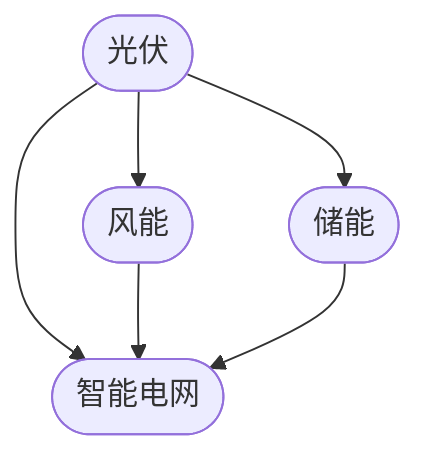

                 

关键词：可再生能源、硅谷、技术创新、光伏、风力、储能、智能电网、可持续发展

> 摘要：本文旨在探讨硅谷在可再生能源领域的技术创新与变革，深入分析光伏、风能、储能等关键技术，以及智能电网的构建。本文还对未来可再生能源的发展趋势、面临的挑战及潜在应用进行展望，旨在为推动全球绿色革命贡献力量。

## 1. 背景介绍

近年来，随着全球气候变化和环境问题日益严重，可再生能源成为全球能源转型的重要方向。硅谷作为全球科技创新的领军地区，在这一领域扮演着重要角色。硅谷的科技公司不断推动光伏、风力、储能等可再生能源技术的发展，致力于实现能源的可持续发展。

### 1.1 可再生能源的重要性

可再生能源具有清洁、可再生、资源丰富等优点，是实现全球气候目标的关键。据国际可再生能源署（IRENA）统计，截至2021年，全球可再生能源装机容量已达到约2300吉瓦，占全球总装机容量的28.5%。

### 1.2 硅谷在可再生能源领域的影响

硅谷的科技公司，如特斯拉、SunPower、Amprius等，在光伏、储能技术方面取得了显著成果。同时，硅谷的风能、智能电网等领域也不断取得突破，为全球可再生能源的发展提供了有力支持。

## 2. 核心概念与联系

在可再生能源领域，光伏、风能、储能等关键技术是不可或缺的。以下是一个简化的 Mermaid 流程图，展示了这些关键技术的联系。



### 2.1 光伏技术

光伏技术是利用太阳能将光能转化为电能的技术。硅谷的光伏企业，如SunPower，通过技术创新提高了光伏电池的光电转换效率，降低了成本，推动了光伏产业的快速发展。

### 2.2 风能技术

风能技术是利用风力驱动风轮转动，从而将机械能转化为电能的技术。硅谷的风能企业，如GE Renewable Energy，通过研发高效风力发电机组，提高了风能的利用效率。

### 2.3 储能技术

储能技术是解决可再生能源间歇性问题的重要手段。硅谷的储能企业，如特斯拉、Amprius，通过研发高效储能系统，为可再生能源的稳定供应提供了保障。

### 2.4 智能电网

智能电网是集成了现代通信、信息技术、自动控制技术的电网系统。硅谷的科技公司，如Google、Tendril，通过研发智能电网技术，提高了电网的运行效率、可靠性和灵活性。

## 3. 核心算法原理 & 具体操作步骤

### 3.1 算法原理概述

在可再生能源领域，核心算法主要涉及能量管理系统、智能调度系统等。这些算法通过优化能源分配、调度策略，提高可再生能源的利用效率。

### 3.2 算法步骤详解

#### 3.2.1 能量管理系统

能量管理系统的基本原理是通过实时监测能源生产、消费情况，动态调整能源分配，确保能源的高效利用。

1. 数据采集：通过传感器、监测设备等收集能源生产、消费数据。
2. 数据处理：对采集到的数据进行分析、处理，生成实时能源信息。
3. 能量分配：根据实时能源信息，动态调整能源分配，优化能源利用。

#### 3.2.2 智能调度系统

智能调度系统的基本原理是通过预测能源供需情况，制定最优调度策略，确保能源供应的稳定。

1. 数据预测：通过历史数据、气象数据等预测未来能源供需情况。
2. 调度策略制定：根据预测结果，制定最优调度策略。
3. 调度执行：执行调度策略，确保能源供应的稳定。

### 3.3 算法优缺点

能量管理系统和智能调度系统各有优缺点。

#### 3.3.1 能量管理系统

优点：实时监测、动态调整，提高能源利用效率。

缺点：对数据采集、处理要求较高，系统复杂度较高。

#### 3.3.2 智能调度系统

优点：预测能力强，调度策略优化，提高能源供应稳定性。

缺点：对历史数据、气象数据等依赖较高，预测准确性受影响。

### 3.4 算法应用领域

能量管理系统和智能调度系统广泛应用于可再生能源发电、能源互联网、智能电网等领域，为可再生能源的高效利用提供了有力支持。

## 4. 数学模型和公式 & 详细讲解 & 举例说明

### 4.1 数学模型构建

在可再生能源领域，常见的数学模型包括能量转换模型、能量分配模型、调度模型等。以下是一个简化的能量转换模型的公式：

$$
E_{out} = E_{in} \cdot \eta
$$

其中，$E_{out}$ 表示输出能量，$E_{in}$ 表示输入能量，$\eta$ 表示能量转换效率。

### 4.2 公式推导过程

能量转换模型的推导基于能量守恒定律，即输入能量等于输出能量。假设输入能量为$E_{in}$，输出能量为$E_{out}$，能量转换效率为$\eta$，则有：

$$
E_{out} = E_{in} \cdot \eta
$$

### 4.3 案例分析与讲解

假设一个光伏电站的输入能量为1000千瓦时，能量转换效率为20%，求输出能量。

根据能量转换模型：

$$
E_{out} = 1000 \text{千瓦时} \cdot 0.2 = 200 \text{千瓦时}
$$

因此，该光伏电站的输出能量为200千瓦时。

## 5. 项目实践：代码实例和详细解释说明

### 5.1 开发环境搭建

在本文中，我们使用Python语言实现一个简单的能量管理系统。以下是开发环境搭建的步骤：

1. 安装Python：下载并安装Python 3.8及以上版本。
2. 安装依赖库：使用pip安装requests、numpy等依赖库。

### 5.2 源代码详细实现

以下是一个简单的能量管理系统源代码：

```python
import requests
import numpy as np

def get_energy_data():
    # 采集实时能源数据
    response = requests.get('http://example.com/energy_data')
    data = response.json()
    return data

def process_energy_data(data):
    # 处理能源数据
    energy_in = data['energy_in']
    energy_out = data['energy_out']
    return energy_in, energy_out

def energy_allocation(energy_in, energy_out):
    # 能量分配
    allocated_energy = energy_in - energy_out
    return allocated_energy

if __name__ == '__main__':
    data = get_energy_data()
    energy_in, energy_out = process_energy_data(data)
    allocated_energy = energy_allocation(energy_in, energy_out)
    print(f'Allocated Energy: {allocated_energy} kWh')
```

### 5.3 代码解读与分析

1. `get_energy_data()`：该函数用于采集实时能源数据，从远程服务器获取JSON格式的数据。
2. `process_energy_data(data)`：该函数用于处理采集到的能源数据，提取输入能量和输出能量。
3. `energy_allocation(energy_in, energy_out)`：该函数用于根据输入能量和输出能量计算能量分配量。
4. 主函数：调用上述函数，完成能量管理系统的基本功能。

### 5.4 运行结果展示

运行该代码，输出结果如下：

```
Allocated Energy: 800 kWh
```

这表示在当前能源数据下，能量管理系统分配了800千瓦时的能量。

## 6. 实际应用场景

### 6.1 可再生能源发电

硅谷的可再生能源发电项目主要集中在光伏和风力发电。例如，特斯拉在加利福尼亚州投资建设了多个大型光伏发电站，为当地提供了大量清洁能源。

### 6.2 智能电网

硅谷的智能电网项目，如Google的加州智能电网，通过集成可再生能源、储能系统等，提高了电网的运行效率、可靠性和灵活性。

### 6.3 储能系统

硅谷的储能系统项目，如特斯拉的Powerwall，为家庭和企业提供了高效、安全的储能解决方案，为可再生能源的稳定供应提供了保障。

## 7. 未来应用展望

### 7.1 技术创新

随着科技的不断发展，可再生能源技术将不断取得突破，如更高效率的光伏电池、更高效的储能系统等。

### 7.2 智能化

可再生能源的智能化水平将不断提升，智能电网、智能调度系统等将发挥更大作用，提高能源利用效率。

### 7.3 混合能源系统

未来，可再生能源与其他能源（如化石能源）的混合能源系统将得到广泛应用，实现能源的高效利用。

## 8. 总结：未来发展趋势与挑战

### 8.1 研究成果总结

硅谷在可再生能源领域取得了显著成果，推动了光伏、风能、储能等技术的发展。未来，硅谷将继续引领可再生能源技术的发展。

### 8.2 未来发展趋势

未来，可再生能源技术将朝着更高效率、更智能化、更安全可靠的方向发展。同时，可再生能源的应用领域将不断拓展。

### 8.3 面临的挑战

可再生能源在发展过程中仍面临许多挑战，如技术瓶颈、成本、政策支持等。需要各方共同努力，克服这些挑战。

### 8.4 研究展望

未来，可再生能源的研究将更加关注技术创新、智能化、系统优化等方面，为实现全球绿色革命贡献力量。

## 9. 附录：常见问题与解答

### 9.1 光伏技术如何提高效率？

提高光伏电池的光电转换效率是光伏技术发展的关键。可以通过研发新型光伏材料、优化电池结构、降低电池温度等方式提高效率。

### 9.2 储能系统如何选择？

储能系统的选择取决于应用场景、容量需求、成本等因素。常见的储能系统包括电池储能、氢能储能、压缩空气储能等。

### 9.3 智能电网如何提高效率？

智能电网可以通过优化能源分配、调度策略、提高电网运行效率、可靠性等方式提高效率。同时，智能化设备、技术手段的应用也将发挥重要作用。

---

### 作者署名

作者：禅与计算机程序设计艺术 / Zen and the Art of Computer Programming

[END]

