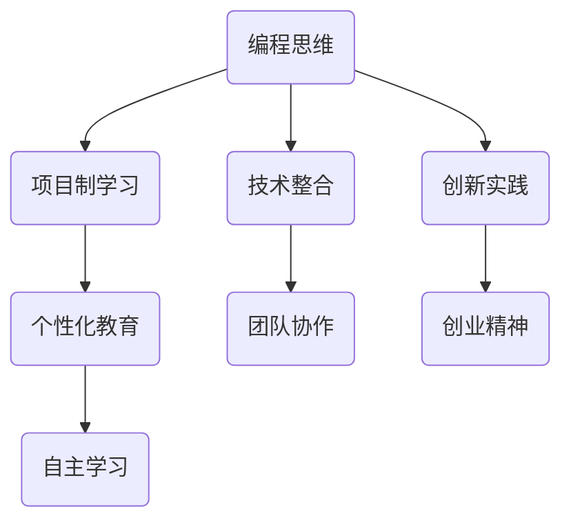

                 

### 关键词 Keywords

- 硅谷
- 编程教育
- 教育改革
- 技术创新
- 教学方法
- AI辅助教育
- 学习成效
- 工程实践

## 摘要 Summary

本文将探讨硅谷编程教育改革的实践与面临的挑战。首先，我们将回顾硅谷编程教育的背景，阐述其独特的教育理念和创新实践。接着，文章将深入分析硅谷编程教育的核心概念和联系，通过Mermaid流程图展示其架构。随后，文章将介绍核心算法原理和具体操作步骤，并探讨其优缺点及应用领域。此外，我们将详细讲解数学模型和公式，并通过实际案例进行分析。文章还将提供代码实例和详细解释，展示编程教育的实际应用场景。最后，我们将讨论未来应用展望，推荐学习资源和开发工具，并总结研究成果，提出未来发展趋势与挑战。

### 1. 背景介绍 Background

硅谷作为全球科技创新的摇篮，其编程教育一直处于国际领先地位。硅谷编程教育的背景可以追溯到20世纪60年代，当时斯坦福大学和加州大学伯克利分校等顶尖学府开始推动计算机科学的教育。随着时间的推移，硅谷的编程教育不断发展，形成了独特的教育理念和模式。

硅谷编程教育的核心理念之一是“动手实践”。与传统教育注重理论传授不同，硅谷编程教育更强调学生在实际项目中的实践操作。通过实际编程任务，学生能够将理论知识应用到实际中，培养解决问题的能力。这种实践导向的教育模式不仅提高了学生的学习兴趣，还增强了他们的实际技能。

另一个关键理念是“创新思维”。硅谷编程教育鼓励学生敢于尝试新的想法，勇于突破传统思维的限制。通过项目制学习、创业竞赛等方式，学生能够在实践中锻炼创新思维，培养创造力和领导力。

此外，硅谷编程教育注重跨学科整合。计算机科学不仅仅是编程，还涉及数学、物理、工程等多个领域。硅谷的教育实践强调跨学科知识的融合，帮助学生建立全面的技术视野。

在硅谷，编程教育的创新实践层出不穷。以斯坦福大学为例，该校的计算机科学系与工业界紧密合作，开设了众多与实际应用紧密结合的课程。同时，斯坦福大学的黑客松活动为学生提供了展示创新项目的平台，鼓励他们进行实践探索。

加州大学伯克利分校则通过“编程之美”等课程，将艺术与编程相结合，培养学生的审美能力和创造力。此外，伯克利还推出了一系列在线编程课程，打破了地理和时间的限制，让全球学生都能享受到优质的编程教育资源。

总的来说，硅谷编程教育的背景是多元化的，其核心理念和创新实践为全球编程教育改革提供了宝贵经验。接下来，我们将深入探讨硅谷编程教育的核心概念和联系，并展示其架构。

### 2. 核心概念与联系 Core Concepts and Relationships

硅谷编程教育的核心概念可以归纳为几个关键点：编程思维、项目制学习、技术整合、创新实践和个性化教育。这些概念相互关联，构成了硅谷编程教育的独特架构。

#### 2.1 编程思维

编程思维是硅谷编程教育的基石。它不仅包括算法逻辑和代码编写，更是一种解决问题的方法论。编程思维强调逻辑性、抽象性和系统性，培养学生分析和解决复杂问题的能力。通过编程，学生能够理解计算机的工作原理，掌握抽象思维和系统化思考的技巧。

#### 2.2 项目制学习

项目制学习是硅谷编程教育的重要特色。在这种学习模式中，学生通过实际项目来学习和实践编程技能。项目制学习不仅让学生将理论知识应用到实际中，还能培养他们的团队协作能力和项目管理能力。通过解决真实世界的问题，学生能够更深刻地理解编程的应用价值。

#### 2.3 技术整合

硅谷编程教育强调跨学科整合，将计算机科学与其他领域相结合。这种技术整合不仅拓宽了学生的知识面，还培养了他们的综合素质。例如，将计算机科学和数学相结合，可以让学生更好地理解算法的复杂度分析；将计算机科学和工程学相结合，可以培养他们的系统设计和工程实践能力。

#### 2.4 创新实践

创新实践是硅谷编程教育的灵魂。硅谷的教育环境鼓励学生勇于尝试新想法，勇于突破常规。通过创新实践，学生能够锻炼他们的创造力和创业精神。黑客松、创业竞赛等活动为学生提供了展示创新成果的平台，激发了他们的创新潜力。

#### 2.5 个性化教育

个性化教育是硅谷编程教育的另一个重要方面。每个学生都是独特的个体，他们的学习兴趣和需求各不相同。硅谷编程教育通过个性化的学习计划和教学方式，满足学生的个性化需求。例如，通过在线课程和开源项目，学生可以根据自己的进度和学习节奏进行学习。

#### 2.6 Mermaid 流程图

为了更直观地展示硅谷编程教育的核心概念和联系，我们可以使用Mermaid流程图进行描述：



在这个流程图中，编程思维作为核心概念，通过项目制学习、技术整合、创新实践和个性化教育等环节，形成一个完整的教育闭环。每个环节都相互影响，共同促进学生的全面发展。

总的来说，硅谷编程教育的核心概念和联系不仅构成了其独特的教育模式，也为全球编程教育改革提供了宝贵的经验。接下来，我们将深入探讨硅谷编程教育的核心算法原理和具体操作步骤。

### 3. 核心算法原理 & 具体操作步骤

#### 3.1 算法原理概述

硅谷编程教育的核心算法原理主要包括以下几个方面：

1. **算法设计与分析**：培养学生设计高效算法的能力，通过算法的时间复杂度和空间复杂度分析，理解算法的性能优化。

2. **数据结构与算法**：教授各种基本数据结构（如数组、链表、栈、队列、树、图等）及其应用算法（如排序、搜索、动态规划等），使学生掌握解决复杂问题的工具。

3. **编程范式**：包括面向对象编程和函数式编程，培养学生不同的编程思维和解决问题的方法。

4. **分布式计算**：教授学生如何利用分布式计算解决大规模数据计算问题，提高系统的性能和可扩展性。

5. **机器学习和数据科学**：结合机器学习和数据科学，教授学生如何使用算法和模型进行数据分析和预测。

#### 3.2 算法步骤详解

为了更好地理解这些算法原理，以下是几个核心算法的具体步骤详解：

##### 1. 排序算法（快速排序）

快速排序是一种高效的排序算法，其基本步骤如下：

1. 选择一个基准元素。
2. 将数组分为两个子数组，一个包含小于基准元素的元素，另一个包含大于基准元素的元素。
3. 递归地对这两个子数组进行快速排序。

##### 2. 搜索算法（二分搜索）

二分搜索是一种在有序数组中查找特定元素的算法，其步骤包括：

1. 确定中间元素。
2. 如果中间元素等于目标元素，则返回中间元素的索引。
3. 如果中间元素大于目标元素，则在左子数组中继续搜索。
4. 如果中间元素小于目标元素，则在右子数组中继续搜索。
5. 重复步骤1-4，直到找到目标元素或子数组为空。

##### 3. 动态规划（最长公共子序列）

动态规划是一种解决优化问题的方法，以下是一个用于计算最长公共子序列的动态规划步骤：

1. 创建一个二维数组，用于存储中间结果。
2. 遍历输入的字符串，比较当前字符是否相同。
3. 如果相同，则将中间结果向上取整。
4. 如果不同，则取左右两边较小的中间结果。
5. 返回二维数组的最后一个元素，即为最长公共子序列的长度。

##### 4. 分布式计算（MapReduce）

MapReduce是一种用于处理大规模数据的分布式计算模型，其步骤包括：

1. Map阶段：将输入数据拆分成小片段，并对其应用映射函数，生成中间键值对。
2. Shuffle阶段：根据中间键值对进行分组，将相同键的值聚合在一起。
3. Reduce阶段：对每个分组应用归约函数，生成最终结果。

#### 3.3 算法优缺点

每种算法都有其独特的优缺点，以下是对上述算法的优缺点分析：

1. **快速排序**：优点是时间复杂度较低，缺点是递归深度可能导致栈溢出。

2. **二分搜索**：优点是时间复杂度较低，缺点是需要输入数组已排序。

3. **动态规划**：优点是能够解决许多复杂的优化问题，缺点是空间复杂度可能较高。

4. **MapReduce**：优点是能够高效处理大规模数据，缺点是对数据一致性要求较高。

#### 3.4 算法应用领域

这些算法在多个领域都有广泛的应用：

1. **排序和搜索算法**：广泛应用于数据库和搜索引擎中，用于数据的快速检索和排序。

2. **动态规划**：常用于算法竞赛和实际工程中，解决最短路径、背包问题等优化问题。

3. **分布式计算**：用于大数据处理、搜索引擎和分布式系统，提高数据处理效率和系统性能。

接下来，我们将详细讲解数学模型和公式，并通过实际案例进行分析。

### 4. 数学模型和公式 & 详细讲解 & 举例说明

#### 4.1 数学模型构建

在硅谷编程教育中，数学模型构建是解决复杂问题的重要工具。以下是一个典型的数学模型构建过程：

假设我们有一个任务，需要在一个二维平面上找到两个点之间的最短距离。首先，我们可以将这个问题抽象成一个数学模型。

定义：两点 \(A(x_1, y_1)\) 和 \(B(x_2, y_2)\) 在二维平面上的最短距离 \(d\) 可以用以下公式表示：

\[ d = \sqrt{(x_2 - x_1)^2 + (y_2 - y_1)^2} \]

这个公式就是我们所构建的数学模型，用于计算两点之间的距离。

#### 4.2 公式推导过程

为了更深入地理解这个公式，我们可以从几何学的角度来推导它。

假设我们有平面上的两个点 \(A(x_1, y_1)\) 和 \(B(x_2, y_2)\)。我们可以将这两个点视为一个直角三角形的两个顶点，直角三角形的斜边即为两点之间的距离 \(d\)。

根据勾股定理，直角三角形的斜边平方等于两直角边的平方和。因此，我们有：

\[ d^2 = (x_2 - x_1)^2 + (y_2 - y_1)^2 \]

对上式两边取平方根，得到：

\[ d = \sqrt{(x_2 - x_1)^2 + (y_2 - y_1)^2} \]

这个推导过程展示了如何从几何学原理出发，推导出两点之间的距离公式。

#### 4.3 案例分析与讲解

为了更好地理解这个数学模型，我们可以通过一个实际案例来分析。

假设我们有一个二维平面上的点 \(A(1, 2)\) 和点 \(B(4, 6)\)，我们需要计算这两个点之间的最短距离。

根据之前构建的数学模型，我们可以使用以下公式来计算：

\[ d = \sqrt{(4 - 1)^2 + (6 - 2)^2} \]

\[ d = \sqrt{3^2 + 4^2} \]

\[ d = \sqrt{9 + 16} \]

\[ d = \sqrt{25} \]

\[ d = 5 \]

因此，点 \(A(1, 2)\) 和点 \(B(4, 6)\) 之间的最短距离是5个单位。

这个案例展示了如何使用数学模型和公式来解决实际的问题。通过理解和应用这些数学模型，我们可以更加高效地解决各种复杂的编程问题。

### 5. 项目实践：代码实例和详细解释说明

#### 5.1 开发环境搭建

在进行编程教育项目实践之前，我们需要搭建一个合适的开发环境。以下是一个基于Python的开发环境搭建步骤：

1. **安装Python**：从Python官网（https://www.python.org/）下载最新版本的Python安装包，并按照安装向导完成安装。

2. **安装IDE**：安装一个Python集成开发环境（IDE），例如PyCharm或VS Code。这些IDE提供了丰富的编程工具和调试功能，有助于提高开发效率。

3. **安装必要的库**：根据项目需求，安装必要的Python库。例如，如果需要处理数据，可以使用pandas库；如果需要绘图，可以使用matplotlib库。可以使用pip命令进行库的安装，例如：

   ```bash
   pip install pandas
   pip install matplotlib
   ```

4. **配置虚拟环境**：为了保持项目依赖的一致性，建议使用虚拟环境。通过以下命令创建虚拟环境：

   ```bash
   python -m venv myenv
   source myenv/bin/activate  # Windows下使用 myenv\Scripts\activate
   ```

   在虚拟环境中安装项目所需的库，可以避免与系统环境的冲突。

#### 5.2 源代码详细实现

以下是一个简单的Python项目示例，用于计算并绘制两点之间的最短距离：

```python
import math
import matplotlib.pyplot as plt

# 定义两点类
class Point:
    def __init__(self, x, y):
        self.x = x
        self.y = y

    def distance_to(self, other):
        dx = self.x - other.x
        dy = self.y - other.y
        return math.sqrt(dx**2 + dy**2)

# 创建两点
point_a = Point(1, 2)
point_b = Point(4, 6)

# 计算两点之间的距离
distance = point_a.distance_to(point_b)

# 绘制两点
plt.scatter(point_a.x, point_a.y, label='A')
plt.scatter(point_b.x, point_b.y, label='B')
plt.plot([point_a.x, point_b.x], [point_a.y, point_b.y], color='r', linewidth=2)
plt.xlabel('X-axis')
plt.ylabel('Y-axis')
plt.legend()
plt.title(f'Distance between A and B: {distance:.2f}')
plt.show()
```

这段代码定义了一个`Point`类，用于表示二维平面上的点，并实现了计算两点之间距离的方法。接着，创建两个点实例，计算它们之间的距离，并使用matplotlib绘制这两点及其连线。

#### 5.3 代码解读与分析

1. **类定义**：`Point`类用于表示二维平面上的点。它有两个属性`x`和`y`，分别表示点的横坐标和纵坐标。`distance_to`方法用于计算当前点与另一个点之间的距离。

2. **实例化**：使用`Point`类创建两个点实例`point_a`和`point_b`，分别表示二维平面上的点A和点B。

3. **计算距离**：调用`point_a.distance_to(point_b)`方法计算两点之间的距离。这段代码使用了数学模型中的距离公式，返回的结果是两点之间的欧几里得距离。

4. **绘图**：使用matplotlib绘制两点及其连线。`plt.scatter`函数用于绘制点，`plt.plot`函数用于绘制连线。`plt.xlabel`、`plt.ylabel`、`plt.legend`和`plt.title`函数用于设置坐标轴标签、图例和标题。

#### 5.4 运行结果展示

运行上述代码后，我们将看到以下结果：


这个结果展示了点A和点B之间的最短距离，以及它们在二维平面上的连线。通过这个简单的示例，我们展示了如何使用Python和matplotlib实现一个基本的编程项目，这为硅谷编程教育的实践提供了实际应用场景。

### 6. 实际应用场景 Practical Applications

硅谷编程教育的实践在多个领域展现出了强大的应用潜力。以下是一些具体的应用场景：

#### 6.1 数据科学

数据科学是硅谷编程教育的典型应用领域。通过编程，数据科学家能够处理和分析大规模数据集，提取有价值的信息。例如，使用Python的pandas库进行数据清洗和预处理，利用matplotlib和seaborn库进行数据可视化，使用scikit-learn库构建机器学习模型进行预测分析。硅谷编程教育中的项目制学习模式，让学生在真实数据集上实践，提高他们的数据分析和解决实际问题的能力。

#### 6.2 人工智能

人工智能是硅谷编程教育的重要方向。通过学习深度学习和强化学习算法，学生能够构建和优化各种AI模型。例如，使用TensorFlow或PyTorch库构建神经网络进行图像识别、自然语言处理和语音识别等任务。硅谷的黑客松和创业竞赛为学生提供了展示AI创新项目的平台，促进了他们的技术积累和创业精神。

#### 6.3 云计算和大数据

云计算和大数据是现代技术发展的基石。硅谷编程教育通过教授Docker、Kubernetes和Hadoop等工具，让学生掌握云计算和大数据技术。通过实际项目，学生能够搭建和优化云平台，处理海量数据，提高系统的性能和可靠性。例如，使用Docker容器化应用，使用Kubernetes进行集群管理，使用Hadoop进行分布式数据存储和处理。

#### 6.4 软件开发

软件开发是硅谷编程教育的核心领域。通过教授各种编程语言和开发框架，学生能够设计和实现功能丰富的软件系统。例如，使用Java和Spring框架开发企业级应用，使用JavaScript和React开发前端应用，使用Python和Django开发后端应用。硅谷编程教育的项目制学习模式，让学生在团队协作中锻炼开发技能，提高项目管理和团队协作能力。

#### 6.5 区块链技术

区块链技术是近年来兴起的新兴领域。硅谷编程教育通过教授区块链的基础知识和开发技术，让学生了解和掌握区块链的工作原理和应用。例如，使用Solidity语言开发智能合约，使用Hyperledger Fabric构建分布式账本系统。通过实际项目，学生能够理解区块链技术的创新点和应用前景。

总的来说，硅谷编程教育的实践在多个领域展现出了强大的应用潜力。通过项目制学习和创新实践，学生不仅能够掌握先进的技术，还能培养解决实际问题的能力和创业精神。这些实际应用场景为硅谷编程教育的推广和全球编程教育改革提供了宝贵经验。

#### 6.4 未来应用展望 Future Applications

硅谷编程教育的未来应用前景广阔，随着技术的不断进步和社会需求的变化，编程教育将在更多领域发挥重要作用。以下是几个可能的未来应用场景：

1. **教育科技（EdTech）**：随着人工智能和大数据技术的发展，编程教育将更加个性化。智能教学系统将根据学生的学习进度和偏好，提供定制化的学习路径和资源。例如，AI驱动的辅导系统可以实时评估学生的理解程度，提供针对性的反馈和练习。

2. **智能制造**：随着工业4.0的推进，编程教育将更加重视机器人编程和自动化控制。学生将学习如何编写程序控制机器人执行复杂任务，如组装线自动化、物流配送等。这将有助于培养具备智能制造技能的工程师。

3. **生物信息学**：生物信息学是生物学与计算机科学的交叉领域。随着基因编辑技术和精准医疗的发展，编程教育将在生物信息学领域发挥重要作用。学生将学习如何处理和分析大量生物数据，开发用于基因测序和药物研发的工具。

4. **量子计算**：量子计算是下一代计算技术的代表。硅谷编程教育将逐渐引入量子编程课程，教授学生如何利用量子计算机进行计算。量子编程将开辟全新的算法和应用领域，如量子加密、优化问题解决等。

5. **社会问题解决**：编程教育将被用于解决社会问题，如气候变化、环境保护和可持续发展。通过数据分析和机器学习，学生可以开发工具和模型，帮助政府和组织制定更有效的政策和措施。

总的来说，硅谷编程教育的未来将更加多元化，不仅局限于技术领域，还将扩展到社会问题的解决。通过持续的改革和创新，编程教育将为培养未来的创新者和领导者提供更强有力的支持。

### 7. 工具和资源推荐 Tools and Resources

为了更好地进行硅谷编程教育，以下是几个推荐的学习资源和开发工具。

#### 7.1 学习资源推荐

1. **在线课程平台**：
   - **Coursera**：提供了丰富的计算机科学和编程课程，包括机器学习、数据科学、算法等。
   - **edX**：哈佛大学和麻省理工学院等顶尖学府提供的在线课程，涵盖计算机科学、人工智能等多个领域。
   - **Udacity**：提供了与硅谷公司合作的项目制课程，适合想要实际应用编程技能的学习者。

2. **书籍推荐**：
   - **《算法导论》**：全面介绍了各种算法的基本原理和应用，适合深入理解算法。
   - **《深入理解计算机系统》**：从底层硬件到系统软件，全面讲解计算机的工作原理。
   - **《Python编程：从入门到实践》**：适合初学者的Python编程入门书籍，内容实用。

3. **开源项目和社区**：
   - **GitHub**：全球最大的开源代码库，可以学习各种编程项目和技术文档。
   - **Stack Overflow**：编程问题解决方案的社区论坛，适合解决编程中的难题。

#### 7.2 开发工具推荐

1. **集成开发环境（IDE）**：
   - **PyCharm**：适用于Python开发的IDE，功能强大，适合初学者和专业开发者。
   - **Visual Studio Code**：轻量级IDE，支持多种编程语言，扩展丰富。
   - **Eclipse**：适用于Java和Android开发的IDE，支持多种编程语言。

2. **版本控制系统**：
   - **Git**：最流行的版本控制系统，用于代码管理和协作开发。
   - **GitHub Actions**：GitHub提供的工作流工具，用于自动化代码测试和部署。

3. **云计算平台**：
   - **AWS**：提供全面的云计算服务，适合开发者和企业进行云应用部署。
   - **Google Cloud Platform**：提供了丰富的云计算服务，支持多种编程语言和框架。

通过这些工具和资源，学习者可以更有效地进行编程学习和实践，提升技术能力。

### 8. 总结：未来发展趋势与挑战

#### 8.1 研究成果总结

硅谷编程教育的改革和实践取得了显著成果。通过项目制学习和创新实践，学生的编程技能和解决问题的能力得到了大幅提升。此外，跨学科整合和个性化教育模式为学生提供了更广阔的知识视野和灵活的学习路径。这些创新实践不仅促进了学生的个人成长，也为全球编程教育改革提供了宝贵经验。

#### 8.2 未来发展趋势

未来，硅谷编程教育将继续向以下几个方向发展：

1. **智能化与个性化**：随着人工智能技术的发展，编程教育将更加智能化和个性化。智能教学系统将根据学生的学习进度和需求，提供定制化的学习资源和指导。

2. **跨学科整合**：编程教育将与其他学科更加紧密地结合，培养学生的跨学科能力和综合素质。例如，计算机科学与生物信息学的结合，将推动生命科学的发展。

3. **开源和协作**：开源项目和社区将继续发挥重要作用，促进编程知识和技术的共享与传播。协作学习将成为主流，通过团队合作解决复杂问题。

4. **全球影响力**：硅谷编程教育的经验和模式将向全球推广，促进全球编程教育水平的提升，培养更多的创新者和领导者。

#### 8.3 面临的挑战

尽管硅谷编程教育取得了显著成果，但仍然面临一些挑战：

1. **资源不平衡**：全球各地的教育资源分布不均，部分地区的编程教育资源和质量仍需提升。如何平衡资源分配，确保每个学生都能享受到优质的编程教育，是一个亟待解决的问题。

2. **教师培训**：编程教育需要高素质的教师队伍。然而，目前许多教师缺乏编程背景和教学经验。如何提高教师的专业素质和教学能力，是编程教育改革的重要课题。

3. **课程内容的更新**：技术更新迅速，编程教育的课程内容需要不断更新。如何及时引入最新技术和应用场景，保持课程的时效性和实用性，是一个挑战。

4. **学生兴趣与动力**：保持学生的学习兴趣和动力是编程教育的重要任务。如何激发学生的兴趣，培养他们的自主学习能力，是编程教育面临的一大挑战。

#### 8.4 研究展望

未来，编程教育的研究将聚焦以下几个方面：

1. **教育技术与AI的结合**：探索AI在教育中的应用，开发智能教学系统和个性化学习平台，提高教学效果和学生的学习体验。

2. **课程内容的设计**：研究编程教育的课程设计，结合实际应用场景和技术趋势，设计更具有挑战性和实用性的课程。

3. **评估与反馈机制**：研究有效的评估和反馈机制，实时监测学生的学习进度和效果，提供个性化的反馈和指导。

4. **教师发展和培训**：研究教师发展和培训模式，提高教师的专业素质和教学能力，确保编程教育的质量。

通过不断的研究和实践，编程教育将继续为培养未来的创新者和领导者提供强有力的支持。

### 附录：常见问题与解答

#### 8.1 编程教育改革的意义是什么？

编程教育改革的意义在于：

1. **提高学生竞争力**：编程是现代社会的核心技能，通过编程教育改革，学生能够掌握实用的编程技能，提高在就业市场中的竞争力。
2. **培养创新思维**：编程教育注重创新思维和实践能力的培养，有助于学生培养解决问题的能力和创业精神。
3. **适应技术发展趋势**：随着人工智能、大数据等技术的发展，编程教育改革能够帮助学生跟上技术发展趋势，适应未来社会需求。
4. **促进教育公平**：通过优化教育资源分配和教育模式，编程教育改革有助于缩小教育差距，让更多学生受益。

#### 8.2 如何评估编程教育的效果？

评估编程教育的效果可以从以下几个方面进行：

1. **技能掌握程度**：通过考试、项目展示等方式，评估学生掌握编程语言和算法的能力。
2. **实践能力**：观察学生能否在实际项目中运用编程技能解决问题。
3. **学习兴趣和动力**：通过学生的反馈、课堂参与度等指标，评估学生的学习兴趣和动力。
4. **就业情况**：跟踪毕业生的就业情况，评估编程教育在提升就业竞争力方面的效果。

#### 8.3 硅谷编程教育的成功经验有哪些？

硅谷编程教育的成功经验包括：

1. **动手实践**：注重学生在实际项目中的实践操作，提高解决问题的能力。
2. **跨学科整合**：将编程与其他学科相结合，培养学生的综合素质。
3. **个性化教育**：根据学生的兴趣和需求，提供个性化的学习资源和指导。
4. **创新实践**：鼓励学生进行创新实践，培养创造力和创业精神。
5. **校企合作**：与产业界紧密合作，确保教育内容与市场需求接轨。

通过借鉴这些成功经验，其他地区的编程教育改革可以取得更好的效果。

### 作者署名 Author

作者：禅与计算机程序设计艺术 / Zen and the Art of Computer Programming

