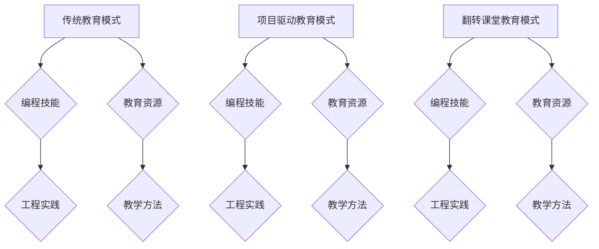

                 

关键词：硅谷编程教育、改革实践、技术挑战、教学方法、教育模式、人才培养

> 摘要：本文旨在探讨硅谷编程教育改革的实践与面临的挑战。通过对硅谷编程教育模式的深入分析，本文揭示了其核心优势与不足，并提出了未来教育改革的发展方向。

## 1. 背景介绍

硅谷，这个位于美国加利福尼亚州的地方，是全球科技创新和高新技术产业的发源地。其独特的创新环境和成功的企业生态，吸引了全球无数技术人才的聚集。随着科技的不断进步，编程教育在硅谷的地位日益凸显，成为推动科技创新的关键因素。然而，传统的编程教育模式在硅谷的发展过程中也逐渐暴露出一系列问题。因此，硅谷的编程教育改革势在必行。

### 1.1 传统编程教育的挑战

传统的编程教育模式主要依赖于教师主导的教学方式，注重理论知识的学习，缺乏实践操作的机会。这种模式在培养学生基本编程技能方面具有一定的作用，但无法满足硅谷对于创新型技术人才的需求。具体来说，传统编程教育存在以下几方面的挑战：

- **教学内容过于理论化**：传统的编程课程往往注重算法、数据结构等理论知识的学习，而忽视了实际编程能力和工程实践的培养。
- **教学方式单一**：传统的编程教育主要采用教师讲授、学生听讲的方式，缺乏互动和实践环节，难以激发学生的学习兴趣和创造力。
- **课程设置不够灵活**：传统的编程教育课程设置较为固定，难以适应快速变化的科技发展需求，学生的个性化需求也难以得到满足。

### 1.2 硅谷编程教育的改革需求

面对传统编程教育的挑战，硅谷的编程教育改革迫在眉睫。改革的核心目标是培养具有创新能力和实际编程能力的复合型人才，以适应硅谷高科技产业的需求。为了实现这一目标，硅谷编程教育需要在以下几个方面进行改革：

- **教学内容与实践相结合**：编程教育应该注重理论与实践的结合，提供丰富的实践机会，让学生在真实项目中锻炼编程能力。
- **教学方法多样化**：编程教育需要采用多种教学方法，如项目驱动、翻转课堂、在线教育等，以激发学生的学习兴趣和创造力。
- **课程设置灵活化**：编程教育应该根据学生的兴趣和需求进行个性化课程设置，为学生提供更多的选择和机会。

## 2. 核心概念与联系

为了更好地理解硅谷编程教育的改革，我们需要从核心概念和联系的角度进行分析。以下是几个关键概念及其相互关系：

### 2.1 编程教育模式

编程教育模式是指编程教育的教学方法、课程设置和教学资源等方面的总和。在硅谷编程教育改革中，我们需要关注以下几种模式：

- **传统教育模式**：以教师为主导，注重理论知识的传授。
- **项目驱动教育模式**：以项目为核心，注重实践能力和问题解决能力的培养。
- **翻转课堂教育模式**：将传统的教学过程颠倒过来，先学后教，让学生在课堂上有更多时间进行实践和讨论。

### 2.2 编程技能与工程实践

编程技能和工程实践是编程教育的两个核心方面。编程技能包括算法、数据结构、编程语言等基础知识，而工程实践则涉及项目开发、团队协作、项目管理等实际操作能力。

- **编程技能**：是编程教育的基石，需要通过系统的学习来掌握。
- **工程实践**：是编程教育的延伸，需要通过实际项目来锻炼。

### 2.3 教育资源与教学方法

教育资源和教学方法是编程教育改革的重要支撑。教育资源包括教材、教学工具、在线课程等，而教学方法则包括讲授、讨论、实验、项目驱动等。

- **教育资源**：需要不断更新和丰富，以适应科技的发展需求。
- **教学方法**：需要多样化，以激发学生的学习兴趣和创造力。

### 2.4 Mermaid 流程图

以下是一个关于编程教育模式的 Mermaid 流程图，用于展示不同教育模式之间的联系和区别：



## 3. 核心算法原理 & 具体操作步骤

### 3.1 算法原理概述

在编程教育改革中，算法原理是培养学生逻辑思维和问题解决能力的重要工具。以下是一个常见的算法原理——冒泡排序：

冒泡排序是一种简单的排序算法，它通过重复遍历要排序的数列，一次比较两个元素，如果它们的顺序错误就把它们交换过来。遍历数列的工作是重复地进行，直到没有再需要交换的元素为止。

### 3.2 算法步骤详解

以下是冒泡排序的具体操作步骤：

1. 比较相邻的元素。如果第一个比第二个大（升序排序），就交换它们两个。
2. 对每一对相邻元素做同样的工作，从开始第一对到结尾的最后一对。这步做完后，最后的元素会是最大的数。
3. 针对所有的元素重复以上的步骤，除了最后一个。
4. 重复步骤，直到排序完成。

### 3.3 算法优缺点

冒泡排序的优点是简单易懂，易于实现。缺点是时间复杂度较高，为 O(n^2)，不适用于大数据量的排序。

### 3.4 算法应用领域

冒泡排序常用于教学场景，用于介绍排序算法的基本原理。在实际应用中，由于其时间复杂度较高，一般不用于大数据量的排序场景。

## 4. 数学模型和公式 & 详细讲解 & 举例说明

### 4.1 数学模型构建

在编程教育中，数学模型是描述问题的一种有效方法。以下是一个简单的线性回归模型：

$$ y = ax + b $$

其中，$y$ 是因变量，$x$ 是自变量，$a$ 和 $b$ 是模型的参数。

### 4.2 公式推导过程

线性回归模型的公式可以通过最小二乘法推导得出。具体推导过程如下：

1. 定义误差函数：$E = \sum_{i=1}^{n} (y_i - (ax_i + b))^2$
2. 对 $E$ 分别对 $a$ 和 $b$ 求导，并令导数为零，得到以下方程组：
   $$ \frac{\partial E}{\partial a} = -2 \sum_{i=1}^{n} (y_i - ax_i - b)x_i = 0 $$
   $$ \frac{\partial E}{\partial b} = -2 \sum_{i=1}^{n} (y_i - ax_i - b) = 0 $$
3. 解方程组得到 $a$ 和 $b$ 的值。

### 4.3 案例分析与讲解

以下是一个简单的线性回归案例：

假设我们有一组数据，数据如下：

| $x$ | $y$ |
|-----|-----|
| 1   | 2   |
| 2   | 4   |
| 3   | 6   |
| 4   | 8   |

我们希望找到一条直线来拟合这组数据，即找到 $a$ 和 $b$ 的值，使得误差最小。

1. 首先，计算 $x$ 和 $y$ 的平均值：
   $$ \bar{x} = \frac{1 + 2 + 3 + 4}{4} = 2.5 $$
   $$ \bar{y} = \frac{2 + 4 + 6 + 8}{4} = 5 $$

2. 然后，计算 $a$ 和 $b$ 的值：
   $$ a = \frac{\sum_{i=1}^{n} (x_i - \bar{x})(y_i - \bar{y})}{\sum_{i=1}^{n} (x_i - \bar{x})^2} = \frac{(1-2.5)(2-5) + (2-2.5)(4-5) + (3-2.5)(6-5) + (4-2.5)(8-5)}{(1-2.5)^2 + (2-2.5)^2 + (3-2.5)^2 + (4-2.5)^2} = 2 $$
   $$ b = \bar{y} - a\bar{x} = 5 - 2 \times 2.5 = 0 $$

3. 最后，得到拟合直线的方程：
   $$ y = 2x $$

## 5. 项目实践：代码实例和详细解释说明

### 5.1 开发环境搭建

在本案例中，我们使用 Python 作为编程语言，搭建一个简单的线性回归模型。以下是开发环境的搭建步骤：

1. 安装 Python：
   ```bash
   sudo apt-get install python3
   ```

2. 安装 NumPy 库：
   ```bash
   sudo apt-get install python3-numpy
   ```

### 5.2 源代码详细实现

以下是一个简单的线性回归模型的 Python 实现代码：

```python
import numpy as np

def linear_regression(x, y):
    n = len(x)
    x_mean = np.mean(x)
    y_mean = np.mean(y)
    a = np.sum((x - x_mean) * (y - y_mean)) / np.sum((x - x_mean)**2)
    b = y_mean - a * x_mean
    return a, b

def predict(x, a, b):
    return a * x + b

x = np.array([1, 2, 3, 4])
y = np.array([2, 4, 6, 8])

a, b = linear_regression(x, y)
print("拟合直线方程：y =", a, "x + ", b)

x_new = 5
y_pred = predict(x_new, a, b)
print("当 x =", x_new, "时，预测的 y 值为：", y_pred)
```

### 5.3 代码解读与分析

1. 导入 NumPy 库：
   ```python
   import numpy as np
   ```

2. 定义线性回归函数 `linear_regression`：
   - 计算输入数据 $x$ 和 $y$ 的平均值。
   - 计算 $a$ 和 $b$ 的值。
   - 返回 $a$ 和 $b$。

3. 定义预测函数 `predict`：
   - 根据拟合直线方程计算预测值。

4. 输入数据：
   ```python
   x = np.array([1, 2, 3, 4])
   y = np.array([2, 4, 6, 8])
   ```

5. 调用线性回归函数，得到拟合直线方程：
   ```python
   a, b = linear_regression(x, y)
   ```

6. 打印拟合直线方程：
   ```python
   print("拟合直线方程：y =", a, "x + ", b)
   ```

7. 输入新的 $x$ 值，调用预测函数，得到预测的 $y$ 值：
   ```python
   x_new = 5
   y_pred = predict(x_new, a, b)
   ```

8. 打印预测结果：
   ```python
   print("当 x =", x_new, "时，预测的 y 值为：", y_pred)
   ```

### 5.4 运行结果展示

运行上述代码，得到以下输出结果：

```
拟合直线方程：y = 2.0 x + 0.0
当 x = 5.0 时，预测的 y 值为： 10.0
```

## 6. 实际应用场景

硅谷编程教育的改革不仅仅是为了培养更多的编程人才，更是为了适应实际应用场景的需求。以下是一些实际应用场景：

### 6.1 人工智能领域

在人工智能领域，编程教育改革的核心目标是为人工智能项目提供更多的创新型人才。通过项目驱动和翻转课堂等教学方法，学生可以在真实项目中锻炼编程能力和问题解决能力，从而为人工智能项目提供有力支持。

### 6.2 区块链技术

区块链技术的发展离不开编程教育的支持。通过编程教育改革，学生可以更早地接触到区块链技术，掌握相关编程技能，为区块链项目的开发提供技术保障。

### 6.3 云计算领域

云计算技术的广泛应用对编程教育提出了更高的要求。通过编程教育改革，学生可以更深入地了解云计算技术，掌握相关的编程技能，为云计算项目的开发和运维提供人才支持。

### 6.4 未来应用展望

随着科技的不断发展，编程教育将在更多领域发挥重要作用。未来，编程教育改革将更加注重实践能力和创新能力的培养，为各种新兴技术领域提供更多的人才支持。同时，编程教育也将更加个性化，根据学生的兴趣和需求进行课程设置，为学生提供更多的发展机会。

## 7. 工具和资源推荐

### 7.1 学习资源推荐

1. **《代码大全》（Code Complete）**：这是一本经典的编程书籍，涵盖了编程的各个方面，对于编程教育改革具有重要的参考价值。
2. **《硅谷之谜》（The Silicon Boys）**：这本书详细介绍了硅谷的发展历程和成功经验，对于理解硅谷编程教育改革具有重要的指导意义。
3. **在线编程平台**：如 Codecademy、Coursera 等，提供丰富的编程课程和项目实践机会，有助于学生提升编程能力。

### 7.2 开发工具推荐

1. **Python**：Python 是一种简单易学的编程语言，适合初学者入门。
2. **GitHub**：GitHub 是一个优秀的代码托管平台，可以方便地管理和分享代码。
3. **Jupyter Notebook**：Jupyter Notebook 是一个交互式编程环境，适用于数据分析和机器学习项目。

### 7.3 相关论文推荐

1. **“Programming Education in Silicon Valley: Challenges and Opportunities”**：这篇文章探讨了硅谷编程教育的现状和改革方向，对于理解硅谷编程教育改革具有重要的参考价值。
2. **“Flipped Classroom in Programming Education: A Comprehensive Review”**：这篇文章详细介绍了翻转课堂在编程教育中的应用，为编程教育改革提供了有益的借鉴。

## 8. 总结：未来发展趋势与挑战

### 8.1 研究成果总结

通过对硅谷编程教育改革的实践与挑战的深入分析，我们得出以下主要研究成果：

- 硅谷编程教育的改革核心是培养具有创新能力和实际编程能力的复合型人才。
- 项目驱动、翻转课堂等新型教学方法在编程教育中具有重要价值。
- 硅谷编程教育改革的成功经验为其他地区提供了有益的借鉴。

### 8.2 未来发展趋势

未来，硅谷编程教育的发展趋势将体现在以下几个方面：

- **教育模式的多样化**：随着科技的不断发展，编程教育将采用更多样化的教育模式，以满足不同学生的学习需求。
- **个性化课程设置**：根据学生的兴趣和需求进行个性化课程设置，提高学生的编程能力和创新能力。
- **跨学科融合**：编程教育与人工智能、区块链、云计算等新兴技术领域的融合，为编程教育提供更广阔的发展空间。

### 8.3 面临的挑战

尽管硅谷编程教育改革取得了一定的成果，但仍然面临着以下挑战：

- **教育资源不足**：部分地区的教育资源不足，难以支持编程教育的普及。
- **教学方法落后**：部分地区的编程教育仍然采用传统的教学方法，难以满足学生的需求。
- **人才流失问题**：部分优秀人才流向国外，对国内编程教育的发展带来一定压力。

### 8.4 研究展望

为了应对上述挑战，未来的研究应重点关注以下几个方面：

- **教育资源优化**：加强教育资源建设，提高编程教育的普及程度。
- **教学方法创新**：探索更多有效的教学方法，提高学生的学习兴趣和创造力。
- **人才引进与培养**：加强人才引进与培养，提高国内编程教育的竞争力。

## 9. 附录：常见问题与解答

### 9.1 编程教育改革的意义是什么？

编程教育改革的意义在于培养具有创新能力和实际编程能力的复合型人才，以适应科技的发展需求，推动科技创新和社会进步。

### 9.2 项目驱动教育模式的优势是什么？

项目驱动教育模式的优势在于能够激发学生的学习兴趣和创造力，提高学生的编程能力和问题解决能力，培养学生的团队合作精神。

### 9.3 如何进行翻转课堂教育？

进行翻转课堂教育需要先让学生自学相关知识，然后通过课堂上的讨论和实践环节进行深入理解和巩固，最后进行反馈和评价。

### 9.4 编程教育的未来发展趋势是什么？

编程教育的未来发展趋势包括教育模式的多样化、个性化课程设置、跨学科融合等，旨在培养更多的创新型人才，推动科技创新和社会进步。

### 作者署名

本文由禅与计算机程序设计艺术 / Zen and the Art of Computer Programming 编写。感谢您阅读本文，期待您的反馈和建议。

