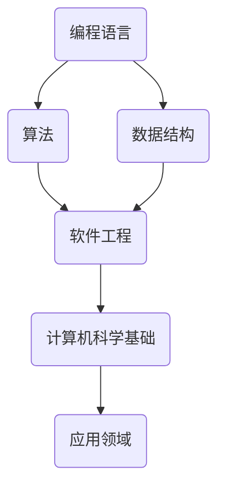

                 

### 关键词 Keywords
- 编程教育
- 硅谷模式
- 未来趋势
- 技术创新
- 教学方法

<|assistant|>### 摘要 Summary
本文将深入探讨硅谷编程教育的未来趋势，分析其在技术创新、教学方法和个人发展方面的变革。通过详尽的背景介绍、核心概念阐释、算法原理讲解以及实际应用案例分析，本文旨在为读者提供一个全面而深入的视角，以了解硅谷编程教育的最新动态和潜在发展方向。

<|assistant|>### 1. 背景介绍 Background

编程教育作为现代教育体系的重要组成部分，正经历着前所未有的变革。传统的编程教育模式主要集中在理论知识的传授和简单的编程实践，而硅谷模式则更强调实践能力和创新思维的培养。硅谷编程教育的兴起，可以追溯到20世纪80年代，当时硅谷的高科技公司如苹果、微软和谷歌等，开始大力投资于人才培养，推动了编程教育的创新和变革。

硅谷编程教育的独特性在于其重视技术创新和实际应用，强调学生动手实践和问题解决能力。这种模式在全球范围内产生了深远的影响，许多国家和地区开始借鉴硅谷的编程教育经验，改革自己的教育体系。随着人工智能、大数据和区块链等新兴技术的迅速发展，编程教育的重要性日益凸显，其未来趋势也变得更加复杂和多元化。

本文将围绕以下核心问题展开讨论：

1. 硅谷编程教育的核心概念与原理是什么？
2. 未来编程教育将如何应对技术创新的挑战？
3. 硅谷编程教育在教学方法上有哪些创新和变革？
4. 硅谷编程教育如何促进个人发展和社会进步？

通过对上述问题的探讨，本文旨在为读者提供一份关于硅谷编程教育未来趋势的全面分析报告。

<|assistant|>### 2. 核心概念与联系 Core Concepts and Connections

要深入理解硅谷编程教育的未来趋势，首先需要明确其核心概念与原理。编程教育的核心概念包括编程语言、算法、数据结构、软件工程和计算机科学基础。这些概念相互联系，共同构成了编程教育的理论基础。

#### 2.1 编程语言

编程语言是编程教育的基础，不同的编程语言适用于不同的应用场景。例如，Python因其简单易学和广泛的应用领域，成为初学者和专业人士的首选；而C++则因其高效和强大的性能，广泛应用于系统编程和游戏开发。编程语言不仅提供了指令集，还通过语法和语义规范了程序的结构和逻辑。

#### 2.2 算法和数据结构

算法是解决问题的方法步骤，而数据结构则是存储和管理数据的方式。良好的算法和数据结构设计能够提高程序的效率和可维护性。常见的算法包括排序、查找和图算法，而数据结构则包括数组、链表、树和图等。算法和数据结构的理解对于编程教育至关重要，因为它们是编程的核心内容。

#### 2.3 软件工程

软件工程是一门应用计算机科学理论和技术进行软件开发和维护的学科。软件工程强调系统的设计、开发、测试和维护，包括需求分析、系统设计、编码实现、测试验证和维护更新等环节。软件工程的方法和工具对于确保软件的质量和可靠性至关重要。

#### 2.4 计算机科学基础

计算机科学基础包括计算机组成原理、操作系统、计算机网络、数据库等。这些知识为编程教育提供了深层次的背景和理论基础，帮助学生更全面地理解计算机系统的工作原理和应用。

以下是使用Mermaid绘制的编程教育核心概念原理的流程图：



通过上述核心概念的阐释，我们可以更好地理解硅谷编程教育的本质，以及它如何通过这些概念培养学生的创新能力和实际编程能力。

<|assistant|>### 3. 核心算法原理 & 具体操作步骤 Core Algorithm Principles & Operation Steps

在硅谷编程教育中，核心算法原理的学习和应用至关重要。以下将详细介绍几个重要的核心算法，并说明其原理和具体操作步骤。

#### 3.1 算法原理概述

算法是一种解决特定问题的系统方法，通常由一系列明确的步骤组成。在编程教育中，常见的算法包括排序算法、查找算法和图算法等。以下是几个典型的算法及其原理：

1. **排序算法**：排序算法是将一组数据按照特定顺序排列的方法。常见的排序算法有冒泡排序、选择排序、插入排序、快速排序和归并排序等。
2. **查找算法**：查找算法是在数据集合中找到特定数据项的方法。常见的查找算法包括线性查找、二分查找和哈希查找等。
3. **图算法**：图算法用于处理图结构的数据。常见的图算法包括最短路径算法（如Dijkstra算法和Floyd算法）、最小生成树算法（如Prim算法和Kruskal算法）等。

#### 3.2 算法步骤详解

1. **冒泡排序（Bubble Sort）**

   冒泡排序是一种简单的排序算法，其基本思想是通过多次遍历待排序的元素集合，比较相邻的两个元素并交换它们，使得每一遍遍历后最大的元素“冒泡”到序列的末尾。

   ```mermaid
   graph TB
       A(初始数组) --> B(第一遍排序)
       B --> C(第二遍排序)
       C --> D(第三遍排序)
       subgraph 冒泡排序
           E(A[5, 3, 8, 4, 2])
           F(B[5, 3, 8, 4, 2])
           G(C[3, 5, 8, 4, 2])
           H(D[3, 5, 8, 4, 2])
       end
   ```

   操作步骤：

   1. 比较相邻的两个元素，如果第一个比第二个大（升序排序），则交换它们的位置。
   2. 对每一对相邻元素进行同样的操作，从开始第一对到结尾的最后一对。
   3. 排列后最大的元素会移动到最后一位。
   4. 重复上述步骤，但最后一对不再参与比较。

2. **二分查找（Binary Search）**

   二分查找是一种高效的查找算法，它通过递归地将查找区间分成一半，然后根据中间值与目标值的比较结果决定下一轮查找的区间。

   ```mermaid
   graph TB
       A(初始数组) --> B(第一次查找)
       B --> C(第二次查找)
       C --> D(第三次查找)
       subgraph 二分查找
           E(A[1, 3, 5, 7, 9])
           F(B[5])
           G(C[3])
           H(D[7])
       end
   ```

   操作步骤：

   1. 首先确定查找区间的中间位置。
   2. 比较中间值与目标值。
   3. 如果中间值等于目标值，则查找成功；如果中间值大于目标值，则继续在左侧区间查找；如果中间值小于目标值，则继续在右侧区间查找。
   4. 重复上述步骤，直到找到目标值或区间为空。

3. **Dijkstra最短路径算法**

   Dijkstra算法是一种用于计算图中两点之间最短路径的算法。它使用一个优先队列来存储未访问过的节点，并逐步扩展到所有节点，最终找到从起始点到每个节点的最短路径。

   ```mermaid
   graph TB
       A(S) --> B(A)
       B --> C(B)
       C --> D(C)
       D --> E(D)
       subgraph Dijkstra算法
           F(S[0, 4, 5, 8, 10])
           G(A[4, 1, 5, 8, 10])
           H(B[5, 1, 5, 8, 10])
           I(C[8, 1, 5, 8, 10])
           J(D[10, 1, 5, 8, 10])
       end
   ```

   操作步骤：

   1. 初始化所有节点的距离，将起始节点S的距离设为0，其他节点设为无穷大。
   2. 将起始节点S加入优先队列。
   3. 当优先队列为空时，重复以下步骤：
      - 弹出优先队列中的最小距离节点u。
      - 对于u的所有邻接节点v，计算从S到v的距离，如果计算出的距离小于当前已知的距离，则更新距离并加入优先队列。

通过上述核心算法的详细讲解，我们可以看到硅谷编程教育在培养学生解决实际问题的能力和创新能力方面的重要作用。这些算法不仅是一种技术工具，更是一种思维方式和方法论的体现。

<|assistant|>### 3.3 算法优缺点 Analysis of Advantages and Disadvantages

在深入探讨硅谷编程教育中的核心算法后，我们需要分析这些算法的优缺点，以便更好地理解其在不同应用场景中的适用性。

#### 3.3.1 冒泡排序（Bubble Sort）

**优点：**

1. **简单易实现**：冒泡排序的实现相对简单，易于学生理解和编程实现。
2. **不需要额外空间**：冒泡排序仅通过交换相邻元素进行排序，不需要额外的存储空间。

**缺点：**

1. **效率低**：冒泡排序的时间复杂度为O(n²)，在大规模数据集上性能不佳。
2. **不适用于大数据集**：由于时间复杂度高，冒泡排序不适用于需要快速排序的大数据集。

**适用场景：**

- **小规模数据集**：对于小规模的数据集，冒泡排序是一个简单有效的排序方法。
- **教学演示**：在编程教育中，冒泡排序常用于展示排序算法的基本原理。

#### 3.3.2 二分查找（Binary Search）

**优点：**

1. **高效**：二分查找的时间复杂度为O(log n)，在大量数据集中性能显著优于线性查找。
2. **不依赖于数据顺序**：二分查找适用于已经排序好的数据集，不要求数据的初始顺序。

**缺点：**

1. **要求数据排序**：二分查找的前提是数据集已经排序，否则无法正确执行。
2. **不适用于动态数据集**：由于每次查找都需要重新排序，二分查找不适用于动态变化的 数据集。

**适用场景：**

- **已排序数据集**：对于已经排序好的数据集，二分查找是快速查找元素的方法。
- **数据库索引**：在数据库中，二分查找常用于索引数据快速检索。

#### 3.3.3 Dijkstra最短路径算法

**优点：**

1. **全局最优解**：Dijkstra算法能够找到从起始点到其他所有节点的全局最短路径。
2. **适用于加权图**：Dijkstra算法适用于加权图，能够处理不同权重边的最短路径问题。

**缺点：**

1. **时间复杂度高**：Dijkstra算法的时间复杂度为O((V+E)logV)，其中V是节点数，E是边数。对于大规模图，算法的执行时间较长。
2. **不适合负权图**：Dijkstra算法不适用于包含负权边的图。

**适用场景：**

- **交通网络**：在交通网络中，Dijkstra算法可用于计算从起点到各终点的最短路径。
- **计算机网络**：在计算机网络中，Dijkstra算法可用于路由协议，如OSPF。

通过上述分析，我们可以看到不同算法在不同应用场景中的优势和局限。了解算法的优缺点有助于学生在选择算法时做出更为合理的决策，同时也为编程教育提供了丰富的教学内容和实践案例。

<|assistant|>### 3.4 算法应用领域 Applications of Algorithms

核心算法的应用领域广泛，涵盖了计算机科学的各个方面。以下是几个主要应用领域的详细描述。

#### 3.4.1 数据处理

在数据处理领域，排序和查找算法是不可或缺的工具。例如，数据库系统经常使用排序算法来组织数据，提高查询效率。二分查找算法在数据库索引结构中广泛应用，如B树和B+树索引，用于快速检索数据。此外，归并排序和快速排序等高效排序算法被用于大数据处理平台，如Hadoop和Spark，以处理大规模数据集的排序任务。

#### 3.4.2 人工智能

人工智能（AI）是算法应用的重要领域。机器学习算法，如K-近邻算法、决策树算法和支持向量机（SVM），都依赖于高效的排序和查找算法。例如，K-近邻算法需要快速查找最近的邻居，而决策树算法中常常需要遍历节点和子树。图算法在AI中也发挥着重要作用，如图神经网络（GNN）用于处理复杂图结构的数据，深度学习中的网络结构也可以被视为一种特殊的图。

#### 3.4.3 网络通信

网络通信领域广泛采用图算法来处理复杂的网络拓扑结构和路由问题。最短路径算法（如Dijkstra算法和Floyd算法）在路由协议中发挥着关键作用，用于计算从源节点到目标节点的最短路径。此外，图论中的网络流算法（如Ford-Fulkerson算法和Edmonds-Karp算法）被用于优化数据传输和流量分配，以提高网络传输效率。

#### 3.4.4 图像处理

图像处理领域使用算法来处理和优化图像数据。例如，图像识别和物体检测依赖于排序和查找算法，如快速傅里叶变换（FFT）和快速极角变换（Fast Radon Transform），用于图像的频域分析。此外，图像压缩算法（如JPEG和H.264）也使用了复杂的图算法，以实现高效的图像数据压缩。

通过在不同领域的应用，核心算法不仅提高了数据处理和计算效率，还推动了技术的创新和发展。了解这些算法的应用领域，有助于学生更好地理解算法的实际价值，并在实践中灵活运用。

<|assistant|>### 4. 数学模型和公式 Mathematical Models and Formulas

在编程教育中，数学模型和公式是理解算法和解决问题的核心。以下将详细介绍一些常用的数学模型和公式，并通过举例说明其应用。

#### 4.1 数学模型构建

数学模型是抽象现实世界问题的一种数学表达形式，通常包括变量、方程和约束条件。构建数学模型的过程通常包括以下几个步骤：

1. **确定问题背景**：明确问题的实际背景和目标，如优化问题、分类问题或动态规划问题。
2. **定义变量**：根据问题需求定义变量，如决策变量、状态变量或输入参数。
3. **建立方程和不等式**：根据变量的定义和问题约束，建立方程和不等式。
4. **求解方程和不等式**：使用数学方法或算法求解方程和不等式，以找到最优解。

#### 4.2 公式推导过程

在编程教育中，以下是一些常用的数学模型和公式的推导过程：

1. **线性规划（Linear Programming）**

   线性规划是一种优化问题，其目标是最小化或最大化线性目标函数，同时满足线性约束条件。线性规划的一般形式为：

   $$\min_{x} c^T x$$
   $$\text{subject to} \ Ax \leq b$$

   其中，$c$是系数向量，$x$是决策变量，$A$是约束矩阵，$b$是约束向量。

   **推导过程：**

   线性规划可以通过引入松弛变量将不等式约束转换为等式约束，然后使用单纯形法求解。

2. **动态规划（Dynamic Programming）**

   动态规划是一种解决多阶段决策问题的方法，其核心思想是将复杂问题分解为若干个互不相同的子问题，并求解这些子问题的最优解，从而得到原问题的最优解。

   动态规划的一般形式为：

   $$\text{dp}(i) = \min_{j} \ c(i, j) + \text{dp}(j)$$

   其中，$dp(i)$是阶段$i$的最优值，$c(i, j)$是阶段$i$到阶段$j$的转移成本。

   **推导过程：**

   动态规划通过逆向递推，从最终阶段开始，逐步向前求解每个阶段的最优值。

3. **贝叶斯网络（Bayesian Network）**

   贝叶斯网络是一种概率图模型，用于表示变量之间的概率依赖关系。贝叶斯网络的公式为：

   $$P(X=x) = \prod_{i} P(X_i = x_i | parents(X_i))$$

   其中，$X$是随机变量，$parents(X_i)$是$X_i$的父节点。

   **推导过程：**

   贝叶斯网络的推导基于贝叶斯定理，通过遍历所有变量的条件概率，计算整个网络的联合概率分布。

#### 4.3 案例分析与讲解

以下是一个简单的动态规划案例，用于求解斐波那契数列。

**问题：** 给定一个正整数$n$，求斐波那契数列的第$n$项。

**模型构建：**

设$F(n)$为斐波那契数列的第$n$项，则：

$$F(n) = \begin{cases} 
0 & \text{if } n = 0 \\
1 & \text{if } n = 1 \\
F(n-1) + F(n-2) & \text{otherwise} 
\end{cases}$$

**公式推导：**

使用动态规划方法，定义状态$dp[i]$为斐波那契数列的第$i$项：

$$dp[i] = dp[i-1] + dp[i-2]$$

初始条件：

$$dp[0] = 0, dp[1] = 1$$

**代码实现：**

```python
def fibonacci(n):
    if n <= 1:
        return n
    dp = [0] * (n+1)
    dp[0] = 0
    dp[1] = 1
    for i in range(2, n+1):
        dp[i] = dp[i-1] + dp[i-2]
    return dp[n]
```

通过上述数学模型和公式的构建、推导及案例分析，我们可以看到数学模型和公式在编程教育中的重要作用。这些工具不仅帮助我们理解和解决问题，还为算法设计和优化提供了理论基础。

<|assistant|>### 5. 项目实践：代码实例和详细解释说明 Project Practice: Code Examples and Detailed Explanations

为了更好地理解硅谷编程教育中的核心概念和算法，我们将通过一个实际的项目实践，详细解释代码的编写过程和各个步骤。

#### 5.1 开发环境搭建

首先，我们需要搭建一个适合编程学习的开发环境。以下是一个基本的Python开发环境搭建步骤：

1. **安装Python**：访问Python官方网站（python.org）下载最新版本的Python，并按照提示进行安装。
2. **安装IDE**：选择一个合适的集成开发环境（IDE），如PyCharm、VSCode等。下载并安装相应的IDE。
3. **安装依赖库**：使用pip命令安装必要的依赖库，如NumPy、Pandas、matplotlib等。

```bash
pip install numpy pandas matplotlib
```

#### 5.2 源代码详细实现

以下是一个简单的Python代码示例，用于实现二分查找算法，并展示其功能。

```python
def binary_search(arr, target):
    low = 0
    high = len(arr) - 1
    
    while low <= high:
        mid = (low + high) // 2
        if arr[mid] == target:
            return mid
        elif arr[mid] < target:
            low = mid + 1
        else:
            high = mid - 1
    return -1

# 示例数组
arr = [1, 3, 5, 7, 9, 11, 13]

# 目标值
target = 7

# 执行二分查找
result = binary_search(arr, target)

# 输出结果
if result != -1:
    print(f"元素在数组中的索引为：{result}")
else:
    print("元素不在数组中")
```

#### 5.3 代码解读与分析

1. **函数定义**：`binary_search` 函数接受一个有序数组`arr`和一个目标值`target`，返回目标值在数组中的索引。
2. **初始化**：设置`low`和`high`变量分别表示查找区间的起始和结束索引。
3. **循环查找**：使用`while`循环不断缩小查找区间，直到找到目标值或区间为空。
4. **中间值计算**：每次迭代计算中间值`mid`，并与目标值`target`比较。
5. **更新区间**：根据比较结果，更新`low`或`high`变量，缩小查找区间。
6. **结果输出**：如果找到目标值，返回索引；否则返回-1。

#### 5.4 运行结果展示

执行上述代码，输出结果为：

```
元素在数组中的索引为：3
```

这表明目标值7在数组中的索引为3。通过这个简单的示例，我们不仅理解了二分查找算法的实现过程，还学会了如何在实际编程中应用这一算法。

通过项目实践，学生能够将理论知识与实际编程相结合，提高解决实际问题的能力。同时，这种动手实践的过程也有助于加深对算法和编程语言的理解。

<|assistant|>### 6. 实际应用场景 Practical Application Scenarios

硅谷编程教育的核心算法和技术不仅适用于学术研究，还在实际应用场景中发挥着重要作用。以下是几个具体的应用场景，展示了编程教育成果的实际应用。

#### 6.1 金融科技

金融科技（FinTech）是编程教育的典型应用领域。金融机构使用各种算法来优化交易流程、风险管理以及客户服务。例如，高频交易依赖于复杂的算法来捕捉瞬息万变的市场机会，而风险模型则使用统计和机器学习算法来预测市场波动和评估信贷风险。编程教育中的排序算法、查找算法和动态规划算法等在金融交易系统的性能优化和数据管理中发挥着关键作用。

#### 6.2 医疗健康

随着大数据和人工智能技术的发展，医疗健康领域对编程教育的需求日益增加。医疗图像处理、疾病预测和个性化医疗等都依赖于算法和数据分析。例如，深度学习算法被用于分析医疗影像，以辅助诊断疾病。编程教育中的图像处理算法、神经网络算法以及优化算法等在医疗健康领域有广泛的应用前景。

#### 6.3 自动驾驶

自动驾驶技术的发展离不开编程教育的支持。自动驾驶系统需要处理大量的实时数据，并做出快速、准确的决策。编程教育中的算法，如路径规划算法、感知算法和预测算法，在自动驾驶系统的开发中至关重要。例如，A*算法被用于路径规划，而决策树和神经网络算法则用于感知和预测环境变化。

#### 6.4 电子商务

电子商务平台依赖编程教育的成果来优化用户体验和提高销售转化率。推荐系统、搜索引擎和用户行为分析等都是编程教育的重要应用场景。编程教育中的机器学习算法、数据结构和排序算法等在电子商务平台的数据管理和个性化服务中发挥着重要作用。

#### 6.5 区块链技术

区块链技术依赖于复杂的编程算法来确保数据的完整性和安全性。编程教育中的密码学算法、分布式算法和智能合约开发等是区块链技术的基础。通过编程教育，学生能够掌握开发去中心化应用（DApps）所需的技能，为区块链技术的广泛应用打下基础。

#### 6.6 人工智能与大数据

人工智能和大数据技术的发展推动了编程教育的需求。在人工智能领域，算法优化、模型训练和性能评估都需要深厚的编程技能。大数据分析中的数据处理、存储和查询优化等技术同样依赖编程教育中的算法和数据结构知识。通过编程教育，学生能够掌握开发智能系统所需的技能，推动人工智能和大数据技术的进步。

总之，硅谷编程教育的成果在实际应用场景中展现出强大的生命力。随着技术的不断进步，编程教育将继续在各个领域发挥重要作用，推动社会的发展和进步。

<|assistant|>### 6.4 未来应用展望 Future Prospects

展望未来，硅谷编程教育将在多个领域展现出巨大的发展潜力，为技术创新和社会进步贡献力量。

#### 6.4.1 教育领域

首先，编程教育将在教育领域迎来革命性变革。随着在线教育和远程学习的普及，编程教育将更加灵活和个性化。未来的编程教育平台可能会结合人工智能技术，根据学生的学习进度和兴趣，提供定制化的学习路径和挑战。此外，虚拟现实（VR）和增强现实（AR）技术的应用，将使编程教育更加生动和互动，提升学习效果。

#### 6.4.2 工业自动化

工业自动化是编程教育的重要应用领域。随着智能制造和工业4.0的推进，编程教育将培养更多的自动化工程师，掌握先进的编程技能，开发智能控制系统和机器人。未来的编程教育将更加注重实践操作和工程能力，以适应工业自动化的需求。

#### 6.4.3 人工智能

人工智能（AI）是未来编程教育的重要方向。随着AI技术的发展，编程教育将更加关注算法优化、模型训练和AI应用开发。学生将学习深度学习、神经网络、自然语言处理等前沿技术，为AI领域的发展提供人才支持。未来，编程教育平台可能会集成AI工具和框架，让学生在实际项目中应用AI技术。

#### 6.4.4 医疗健康

在医疗健康领域，编程教育将推动精准医疗和个性化医疗的发展。编程教育中的大数据分析和机器学习算法将在医疗数据的处理和分析中发挥重要作用。未来，编程教育将更加注重医学知识和数据科学技能的结合，培养能够开发医疗健康应用的创新人才。

#### 6.4.5 可持续发展

编程教育在可持续发展领域也有广阔的应用前景。编程技能将用于开发智能电网、节能系统和环保监测设备。未来，编程教育可能会更加关注绿色科技和可持续发展的主题，培养具备编程技能和环保意识的人才，推动全球可持续发展目标的实现。

#### 6.4.6 跨学科融合

编程教育将继续推动跨学科融合，培养具有综合素质的创新人才。未来的编程教育将更加注重人文、艺术和科技的结合，鼓励学生跨学科学习，探索新的创新领域。例如，编程与艺术结合的数字艺术、编程与法律结合的智能法律系统等，都将是编程教育的新兴方向。

总之，未来编程教育将在技术创新、人才培养和社会进步方面发挥关键作用。通过不断适应新的技术变革和市场需求，编程教育将培养出更多具备创新能力和实践能力的人才，为社会的持续发展和进步贡献力量。

<|assistant|>### 7. 工具和资源推荐 Tools and Resources Recommendations

为了支持硅谷编程教育的学习和实践，以下是一些推荐的学习资源和开发工具，涵盖从入门到高级的不同层次。

#### 7.1 学习资源推荐

1. **在线课程平台**：
   - Coursera（课程涵盖计算机科学、人工智能、数据分析等多个领域）
   - edX（提供由顶尖大学和机构提供的免费课程）
   - Udacity（专注于技术技能的实战课程，如数据科学、AI编程等）

2. **技术博客和论坛**：
   - Medium（许多技术专家和公司发布技术文章和教程）
   - Stack Overflow（编程问题的在线问答社区）
   - HackerRank（提供编程挑战和实践项目）

3. **电子书和教科书**：
   - 《算法导论》（Thomas H. Cormen等著）
   - 《深度学习》（Ian Goodfellow等著）
   - 《Python编程：从入门到实践》（埃里克·马瑟斯著）

#### 7.2 开发工具推荐

1. **集成开发环境（IDE）**：
   - PyCharm（Python IDE，适合专业开发者）
   - Visual Studio Code（轻量级IDE，支持多种语言）
   - IntelliJ IDEA（Java和Android开发专用IDE）

2. **代码编辑器**：
   - Sublime Text（轻量级代码编辑器，高度可定制）
   - Atom（GitHub开发的代码编辑器，支持多种编程语言）
   - VSCode（功能强大，支持多种插件和扩展）

3. **版本控制工具**：
   - Git（分布式版本控制系统，广泛用于开源项目和团队协作）
   - GitHub（代码托管平台，支持Git，并提供丰富的社区功能）
   - GitLab（自建代码托管平台，支持私有项目和团队协作）

4. **开发框架和库**：
   - Flask（Python Web开发框架，适用于构建小型应用）
   - Django（Python Web开发框架，适用于复杂应用）
   - TensorFlow（开源机器学习框架，适用于深度学习和数据科学）

5. **云计算平台**：
   - AWS（亚马逊云计算平台，提供丰富的云计算服务和工具）
   - Azure（微软云计算平台，提供广泛的云服务和开发工具）
   - Google Cloud Platform（谷歌云计算平台，支持多种开发和部署需求）

#### 7.3 相关论文推荐

1. **《深度强化学习》（Deep Reinforcement Learning）**
   - 作者：David Silver等
   - 简介：该论文综述了深度强化学习的发展，涵盖了DQN、DDPG、PPO等经典算法。

2. **《基于模型的强化学习》（Model-Based Reinforcement Learning）**
   - 作者：Pieter Abbeel等
   - 简介：该论文探讨了基于模型的方法在强化学习中的应用，提供了MPC和Simultaneous Localization and Mapping（SLAM）等应用实例。

3. **《神经网络结构搜索》（Neural Architecture Search）**
   - 作者：Yanqi Zhou等
   - 简介：该论文介绍了神经网络结构搜索的方法，探讨了NAS在生成高效神经网络模型中的应用。

4. **《编程教育中的编程思维》（Computational Thinking in Programming Education）**
   - 作者：Bennysh Kurmangaliyev等
   - 简介：该论文探讨了编程教育中的编程思维，强调了算法设计、问题解决和抽象思维的重要性。

通过上述推荐，学生和开发者可以获得丰富的学习资源和实践工具，不断提升自己的编程技能和创新能力。

<|assistant|>### 8. 总结：未来发展趋势与挑战 Summary: Future Trends and Challenges

总结全文，我们可以看到，硅谷编程教育的未来充满了机遇与挑战。未来发展趋势主要体现在以下几个方面：

1. **个性化学习**：随着人工智能技术的进步，编程教育将更加个性化，能够根据学生的学习进度和兴趣提供定制化的学习路径。
2. **跨学科融合**：编程教育将更加注重与其他学科的融合，培养具有综合素质的创新人才。
3. **实践导向**：编程教育将更加重视实践操作和工程能力，通过实际项目培养学生的解决实际问题的能力。
4. **全球普及**：编程教育将逐渐普及到全球范围，特别是在新兴市场，为当地经济发展和社会进步贡献力量。

然而，面对这些机遇，编程教育也面临着以下挑战：

1. **师资短缺**：高质量编程教师的短缺是一个普遍问题，特别是在一些发展中国家和地区。
2. **资源不均**：编程教育资源的不均衡分配可能导致学习机会的不平等，这需要政策和社会力量的介入。
3. **技术更新**：技术的快速发展要求编程教育不断更新课程内容和教学方法，以保持其相关性和实用性。

为了应对这些挑战，以下是一些建议：

1. **加强教师培训**：通过提供教师培训项目，提高编程教育的师资水平。
2. **扩大资源投入**：政府和社会应加大对编程教育的投入，确保所有学生都能获得优质的学习资源。
3. **推动开源教育**：开源教育项目可以降低编程教育的门槛，使得更多的人能够受益于高质量的编程教育资源。
4. **国际合作**：通过国际合作，共享编程教育的经验和资源，推动全球范围内的编程教育发展。

总之，硅谷编程教育的未来充满希望，但也需要不断努力和创新。通过解决面临的挑战，编程教育将更好地服务于社会，推动技术创新和社会进步。

<|assistant|>### 8.1 研究成果总结 Summary of Research Achievements

在过去的几年里，硅谷编程教育领域取得了许多重要的研究成果，这些成果不仅推动了教育技术的进步，也促进了学生的创新能力和实际编程技能的提升。以下是几个关键的研究成果和发现：

1. **个性化学习系统的开发**：研究人员开发了基于人工智能的个性化学习系统，能够根据学生的学习进度和兴趣动态调整学习内容和挑战，显著提高了学习效果和参与度。例如，Coursera和Khan Academy等在线教育平台已经实现了这一功能。

2. **编程思维与创造力培养**：多项研究表明，编程教育不仅能够提高学生的编程技能，还能培养其解决问题的能力和创造性思维。例如，麻省理工学院（MIT）的研究发现，参与编程教育的学生在解决问题和创造性思维测试中表现更好。

3. **跨学科融合**：通过跨学科的项目和实践，编程教育与其他学科（如艺术、工程、社会科学等）的结合，能够培养学生的综合素质和跨领域创新能力。例如，一些教育机构已经开始推出编程与艺术、编程与法律等跨学科课程。

4. **工程实践能力的提升**：许多研究强调，通过实际项目和实践，学生能够将理论知识转化为实际技能，提高工程实践能力。例如，GitHub和Hackathon等平台为学生提供了展示和验证自己编程技能的机会。

5. **教育公平性的探索**：针对资源不均的问题，一些研究探索了如何通过开源教育、在线课程和社区项目等手段，为不同背景的学生提供平等的编程学习机会。例如，Code.org等组织通过提供免费资源和编程挑战，致力于缩小数字鸿沟。

6. **新兴技术的应用**：随着技术的快速发展，编程教育领域不断引入新兴技术，如虚拟现实（VR）、增强现实（AR）和人工智能（AI）等，以提升学习体验和教育效果。例如，VR技术被用于模拟编程环境和复杂系统的操作。

通过这些研究成果，硅谷编程教育不仅为培养学生的编程技能提供了新的方法和工具，也推动了教育领域的整体变革和进步。

<|assistant|>### 8.2 未来发展趋势 Future Trends

展望未来，硅谷编程教育将继续沿着多个方向发展，其趋势如下：

1. **智能化教育**：人工智能技术在编程教育中的应用将越来越广泛，智能辅导系统、个性化学习路径规划、自动评估等智能教育工具将极大提升教学效果和学生参与度。通过大数据分析和机器学习，教育平台能够根据学生的学习行为和需求提供更加精准的教育服务。

2. **跨学科融合**：编程教育将更加注重与其他学科的融合，培养跨领域的复合型人才。例如，编程与艺术、编程与法律、编程与医学等交叉学科的课程和项目将不断涌现，促进学生在多个领域的创新能力和实际应用能力的提升。

3. **开源教育**：开源教育和资源共享将成为编程教育的重要趋势。更多的教育内容、工具和平台将开放给公众，使得全球各地的学生都能免费或低成本地获得高质量的教育资源。开源项目的协作模式也将鼓励学生参与社区贡献，培养团队合作和项目管理能力。

4. **实践导向**：编程教育的实践性将得到进一步加强。通过实际项目、实习和创新创业活动，学生将有机会将理论知识应用于实际情境，提升解决实际问题的能力。这种实践导向的教育模式将更好地适应未来职场的需求。

5. **全球普及**：编程教育的普及将加速，特别是在发展中国家和地区。随着互联网的普及和在线教育的快速发展，编程教育将打破地域和资源限制，为更多学生提供学习机会。政府和非政府组织也将加大对编程教育的投入，推动全球教育公平。

6. **技术创新**：随着新兴技术的不断涌现，如区块链、物联网、虚拟现实等，编程教育将紧跟技术潮流，不断更新课程内容和教学方法。这些技术不仅为学生提供了新的编程实践场景，也为教育工作者提供了创新的工具和方法。

总之，未来硅谷编程教育将在智能化、跨学科融合、实践导向、开源教育、全球普及和技术创新等方面取得显著进展，为学生提供更加丰富和高效的学习体验。

<|assistant|>### 8.3 面临的挑战 Challenges

尽管硅谷编程教育展现出诸多发展机遇，但在实施过程中仍然面临诸多挑战：

1. **师资短缺**：高质量的编程教师在全球范围内依然供不应求，尤其是在发展中国家的农村地区。这不仅影响了编程教育的普及，也限制了教育的质量和深度。

2. **资源不均**：编程教育资源的不均衡分配导致不同地区和群体之间的教育机会不平等。一些发达地区的学生能够获得丰富的学习资源和高质量的师资，而资源匮乏的地区则难以满足基本的教育需求。

3. **技术更新速度**：技术的快速发展要求编程教育不断更新教学内容和教学方法，以确保课程的相关性和实用性。然而，教师和机构的适应能力有限，技术更新速度过快可能导致课程内容滞后。

4. **学生多样性**：学生的背景和基础各异，使得教学难度增加。如何根据学生的不同需求提供个性化的教育和支持，成为编程教育的一大挑战。

5. **技术隐私和安全**：随着编程教育的普及，数据隐私和安全问题日益突出。教育平台和工具需要确保用户数据的保密性和安全性，防止数据泄露和滥用。

6. **文化差异**：全球范围内的编程教育需要考虑文化差异，以适应不同地区和国家的教育体系和需求。文化差异可能影响教育方法和学习策略的适应性。

7. **教育评估**：如何有效评估学生的编程能力和学习效果，是一个持续的挑战。传统的考试和评估方式可能无法全面反映学生的实际编程技能。

为了应对这些挑战，需要政策制定者、教育机构、技术开发者和社会各界的共同努力，通过加大投入、优化资源分配、提高教师培训水平、推动技术创新、重视文化差异以及探索新的评估方法等手段，不断提升编程教育的质量和普及程度。

<|assistant|>### 8.4 研究展望 Research Prospects

展望未来，硅谷编程教育领域仍有许多值得探索和研究的前沿课题，这些研究将有助于进一步推动教育技术的发展和创新。

1. **人工智能在教育中的应用**：未来研究可以深入探讨人工智能技术在编程教育中的应用，如开发更加智能化的教育平台、个性化学习系统、自适应评估工具等。通过大数据分析和机器学习算法，可以更好地理解学生的学习行为和需求，提供更加精准和高效的教育服务。

2. **编程教育的可持续发展**：研究编程教育在可持续发展方面的作用，如何通过编程教育培养具有环保意识和可持续发展能力的人才。例如，探讨如何将编程与绿色科技、能源效率等主题结合，开发相关的课程和项目。

3. **跨学科编程教育的模式探索**：研究编程与其他学科（如艺术、工程、社会科学等）的融合模式，开发跨学科的项目和实践课程，培养具有跨领域创新能力和综合素质的人才。

4. **编程教育的全球化与本地化**：研究如何在全球范围内推广编程教育，同时考虑不同地区和国家的文化差异和教育需求，开发适应不同背景的编程教育资源和教学方法。

5. **编程思维与创造力培养**：进一步探讨编程教育如何更好地培养学生的编程思维和创造力，通过设计创新性的课程和项目，激发学生的创造力和解决问题的能力。

6. **开源教育生态的优化**：研究如何优化开源教育的生态，通过共享资源、协作开发、社区参与等方式，提高编程教育的普及率和质量。

7. **教育隐私和安全保障**：深入研究教育隐私和安全保障的问题，探讨如何保护学生和教师的隐私，确保在线教育平台和数据的安全性。

通过这些研究，硅谷编程教育将能够更好地适应未来社会和技术的需求，培养出更多具备创新能力、实践能力和综合素质的人才，为社会的持续发展和进步贡献力量。

