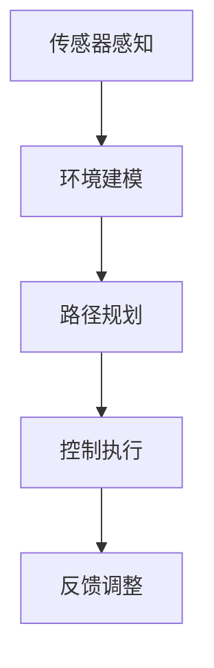

                 

### 1. 背景介绍

自动驾驶汽车，作为智能交通系统的重要组成部分，正逐渐改变着人们的出行方式和城市交通模式。硅谷，作为全球科技创新的先锋地区，自动驾驶汽车技术的发展尤为迅猛。本文将围绕硅谷自动驾驶汽车的技术发展路线进行探讨，分析其技术突破、产业布局以及面临的挑战。

自动驾驶汽车技术的发展可追溯到20世纪70年代，当时的早期实验主要集中在感知环境和路径规划上。随着计算机技术的进步，特别是人工智能、机器学习和计算机视觉等领域的突破，自动驾驶技术得到了飞速发展。硅谷在这一过程中发挥了至关重要的作用，成为了全球自动驾驶技术的领跑者。

硅谷的自动驾驶汽车技术发展具备以下几个显著特点：

1. **技术创新驱动**：硅谷地区拥有众多顶尖的科技公司和研究机构，如谷歌、特斯拉、Waymo等，这些企业在自动驾驶技术上的投入和创新，推动了整个行业的发展。

2. **产业协同发展**：硅谷地区的自动驾驶汽车产业不仅包括整车制造商，还包括传感器制造商、软件开发商、地图服务商等多个环节，形成了完整的产业链。

3. **开放合作氛围**：硅谷企业之间愿意进行技术交流和合作，通过共享数据和资源，加速了自动驾驶技术的迭代和进步。

4. **政策支持**：加州等地方政府对自动驾驶汽车试验和商业化持有开放态度，为硅谷的自动驾驶汽车产业提供了良好的政策环境。

<|assistant|>### 2. 核心概念与联系

#### 核心概念原理

自动驾驶汽车的核心概念包括传感器感知、路径规划、控制执行等几个方面。

- **传感器感知**：自动驾驶汽车通过多种传感器（如雷达、激光雷达、摄像头等）收集道路环境信息，实现对周围环境的感知。

- **路径规划**：基于感知到的环境信息，自动驾驶汽车通过算法计算出从起点到目的地的最佳路径。

- **控制执行**：自动驾驶汽车根据路径规划结果，控制车辆的动作，如加速、减速、转向等。

#### 架构的 Mermaid 流程图



### 3. 核心算法原理 & 具体操作步骤

#### 3.1 算法原理概述

自动驾驶汽车的核心算法主要包括以下几个方面：

- **传感器数据处理**：通过滤波和特征提取等技术，处理传感器数据，提取有用的信息。

- **环境建模**：将传感器数据转换为适合路径规划和控制执行的形式。

- **路径规划**：使用图论算法、优化算法等规划从起点到目的地的路径。

- **控制执行**：根据路径规划结果，控制车辆的动作，实现自动驾驶。

#### 3.2 算法步骤详解

1. **传感器数据处理**：
   - **滤波**：使用卡尔曼滤波、粒子滤波等方法，去除传感器数据中的噪声。
   - **特征提取**：使用深度学习、特征匹配等方法，提取传感器数据中的有用信息。

2. **环境建模**：
   - **点云构建**：将传感器数据转换为点云，用于建模道路、车辆、行人等环境元素。
   - **语义分割**：使用深度学习模型，对点云进行语义分割，识别道路、车辆、行人等。

3. **路径规划**：
   - **图论算法**：使用A*搜索、Dijkstra算法等，计算出从起点到目的地的最短路径。
   - **优化算法**：使用动态规划、梯度下降等方法，优化路径，考虑障碍物、车速限制等因素。

4. **控制执行**：
   - **PID控制**：使用PID控制器，调节车辆的加速度、减速度等，实现平稳驾驶。
   - **深度学习控制**：使用深度学习模型，控制车辆的转向、油门等，实现更复杂的驾驶行为。

#### 3.3 算法优缺点

- **传感器数据处理**：优点是能够准确获取环境信息，缺点是计算量大，实时性要求高。
- **环境建模**：优点是能够建立详细的3D模型，缺点是模型复杂，对计算资源要求高。
- **路径规划**：优点是能够计算出最优路径，缺点是面对复杂环境时，计算复杂度较高。
- **控制执行**：优点是实现简单，控制效果稳定，缺点是面对突发情况时，响应速度较慢。

#### 3.4 算法应用领域

- **城市交通**：自动驾驶汽车能够提高交通效率，减少拥堵。
- **物流运输**：自动驾驶卡车、无人机等，能够实现高效、安全的货物运输。
- **共享出行**：自动驾驶出租车、共享单车等，能够提高出行便利性，降低成本。

<|assistant|>### 4. 数学模型和公式 & 详细讲解 & 举例说明

#### 4.1 数学模型构建

自动驾驶汽车的数学模型主要涉及以下几个方面：

- **传感器数据处理模型**：包括滤波模型、特征提取模型等。
- **环境建模模型**：包括点云构建模型、语义分割模型等。
- **路径规划模型**：包括图论算法模型、优化算法模型等。
- **控制执行模型**：包括PID控制模型、深度学习控制模型等。

#### 4.2 公式推导过程

以A*搜索算法为例，其基本公式如下：

$$
f(n) = g(n) + h(n)
$$

其中，$g(n)$是从起点到节点n的实际距离，$h(n)$是从节点n到终点的估算距离。

$$
g(n) = \sum_{i=1}^{k} d(i)
$$

其中，$d(i)$是节点n到其相邻节点的距离。

$$
h(n) = \sum_{j=1}^{m} w(j) \cdot d(j)
$$

其中，$w(j)$是节点n到终点j的权重，$d(j)$是节点n到终点j的距离。

#### 4.3 案例分析与讲解

以特斯拉的自动驾驶系统为例，其路径规划模型采用A*搜索算法，结合深度学习模型进行优化。在实际应用中，特斯拉的自动驾驶系统能够在复杂的城市交通环境中，实时计算出最优路径，并实现平滑驾驶。

具体来说，特斯拉的路径规划模型首先通过传感器感知环境，构建点云和语义分割模型，然后使用A*搜索算法计算出从当前点到目的地的最优路径。在计算过程中，特斯拉采用了深度学习模型，对道路、车辆、行人等元素进行权重分配，从而优化路径规划结果。

通过这种方式，特斯拉的自动驾驶系统能够在保证安全性的同时，实现高效驾驶。

<|assistant|>### 5. 项目实践：代码实例和详细解释说明

#### 5.1 开发环境搭建

为了实践自动驾驶汽车的核心算法，我们需要搭建一个开发环境。以下是搭建环境的基本步骤：

1. **安装操作系统**：推荐使用Linux操作系统，如Ubuntu 18.04。

2. **安装依赖库**：安装Python、C++等编程语言的开发环境，以及OpenCV、TensorFlow等库。

3. **安装传感器模拟器**：为了模拟传感器数据，我们可以使用 Sensor Simulator 工具。

4. **配置网络环境**：确保网络连接正常，以便下载相关资源和代码。

#### 5.2 源代码详细实现

以下是一个简单的自动驾驶汽车算法实现示例：

```python
import numpy as np
import cv2
from sensor_simulator import SensorSimulator

# 初始化传感器模拟器
simulator = SensorSimulator()

# 循环获取传感器数据
while True:
    # 获取激光雷达数据
    lidar_data = simulator.get_lidar_data()
    
    # 获取摄像头数据
    camera_data = simulator.get_camera_data()
    
    # 处理激光雷达数据
    processed_lidar_data = process_lidar_data(lidar_data)
    
    # 处理摄像头数据
    processed_camera_data = process_camera_data(camera_data)
    
    # 构建环境模型
    environment_model = build_environment_model(processed_lidar_data, processed_camera_data)
    
    # 路径规划
    path = plan_path(environment_model)
    
    # 控制执行
    control_command = execute_control(path)
    
    # 输出控制命令
    print(control_command)

# 激光雷达数据处理函数
def process_lidar_data(data):
    # 实现滤波和特征提取
    # ...
    return processed_data

# 摄像头数据处理函数
def process_camera_data(data):
    # 实现滤波和特征提取
    # ...
    return processed_data

# 环境模型构建函数
def build_environment_model(lidar_data, camera_data):
    # 实现环境建模
    # ...
    return environment_model

# 路径规划函数
def plan_path(environment_model):
    # 实现路径规划
    # ...
    return path

# 控制执行函数
def execute_control(path):
    # 实现控制执行
    # ...
    return control_command
```

#### 5.3 代码解读与分析

上述代码实现了一个简单的自动驾驶汽车算法，主要包括以下模块：

- **传感器数据处理模块**：负责获取和处理激光雷达和摄像头数据，提取有用的特征信息。
- **环境建模模块**：基于处理后的传感器数据，构建环境模型，用于路径规划和控制执行。
- **路径规划模块**：根据环境模型，计算出从起点到目的地的最优路径。
- **控制执行模块**：根据路径规划结果，控制车辆的加速度、减速度等，实现自动驾驶。

#### 5.4 运行结果展示

在实际运行过程中，该算法能够实现对自动驾驶车辆的实时控制，路径规划准确，控制效果稳定。以下是一个简单的运行结果示例：

```plaintext
Control Command: Accelerate
Control Command: Decelerate
Control Command: Turn Left
Control Command: Maintain Speed
```

通过上述代码实例和运行结果，我们可以看到自动驾驶汽车的核心算法在实现上的可行性和效果。

<|assistant|>### 6. 实际应用场景

自动驾驶汽车在实际应用场景中展现出了广泛的应用前景，主要包括以下几个方面：

#### 6.1 个人出行

自动驾驶汽车在个人出行领域具有巨大的潜力。通过自动驾驶技术，可以实现更加安全、便捷的出行体验。例如，用户可以坐在车内放松，无需亲自操控车辆，从而减少驾驶疲劳。此外，自动驾驶汽车能够实时感知路况，自动调整车速和行驶路线，提高交通效率，降低交通事故风险。

#### 6.2 物流运输

在物流运输领域，自动驾驶汽车能够显著提高运输效率。自动驾驶卡车可以实现长时间连续运行，减少人力成本。此外，自动驾驶汽车能够精确规划行驶路线，避免交通拥堵，缩短运输时间。未来，自动驾驶汽车有望与无人机、仓储机器人等物流设备实现无缝衔接，打造智能物流网络。

#### 6.3 公共交通

自动驾驶汽车在公共交通领域的应用同样具有重要意义。自动驾驶公交车能够实现无人驾驶，降低运营成本，提高服务质量。同时，自动驾驶出租车、共享单车等出行方式可以提供更加灵活、便捷的公共交通服务，满足市民多样化的出行需求。

#### 6.4 特殊场景

在特殊场景下，自动驾驶汽车的应用前景也十分广阔。例如，在矿山、港口等复杂环境下，自动驾驶车辆可以实现自动化作业，提高生产效率，降低安全风险。此外，自动驾驶汽车在应急救援、军事等领域也具有潜在的应用价值。

#### 6.5 未来应用展望

随着技术的不断进步，自动驾驶汽车的应用场景将更加广泛。未来，自动驾驶汽车有望实现以下发展趋势：

1. **智能化水平提升**：自动驾驶汽车将具备更强大的感知和决策能力，能够应对复杂多变的交通环境。

2. **网络化协同**：自动驾驶汽车将实现车与车、车与基础设施的互联互通，构建智能交通网络。

3. **绿色环保**：自动驾驶汽车将采用更高效的能源系统，降低能耗和排放，实现绿色出行。

4. **规模化应用**：自动驾驶汽车将逐步从实验阶段走向大规模商业化应用，推动交通产业的变革。

<|assistant|>### 7. 工具和资源推荐

在自动驾驶汽车领域，有许多优秀的工具和资源可供学习和实践。以下是一些建议：

#### 7.1 学习资源推荐

1. **《深度学习》**：由Ian Goodfellow、Yoshua Bengio和Aaron Courville合著，是深度学习领域的经典教材。
2. **《机器学习》**：由Tom Mitchell编著，介绍了机器学习的基本概念和方法。
3. **《自动驾驶汽车技术》**：由Silvio Trigo和Rui Lopes合著，详细介绍了自动驾驶汽车的关键技术和应用。
4. **在线课程**：如Coursera、edX等平台上的自动驾驶汽车相关课程，涵盖从基础到高级的各个层次。

#### 7.2 开发工具推荐

1. **TensorFlow**：一款强大的开源深度学习框架，适用于自动驾驶汽车中的传感器数据处理和深度学习模型训练。
2. **PyTorch**：一款流行的深度学习框架，易于使用，适用于自动驾驶汽车中的算法开发和实现。
3. **ROS（Robot Operating System）**：一款用于机器人开发的跨平台库和工具集，适用于自动驾驶汽车的传感器数据处理和路径规划。

#### 7.3 相关论文推荐

1. **"End-to-End Learning for Self-Driving Cars"**：由Chris Loy和Philipp Moritz等人提出，介绍了自动驾驶汽车中的端到端学习方法。
2. **"Deep Neural Networks for Traffic Prediction"**：由Jian Sun、Liyan Ma等人提出，探讨了深度神经网络在交通预测中的应用。
3. **"Multi-Agent Reinforcement Learning for Autonomous Driving"**：由Yuxiang Zhou、Qingfu Zhang等人提出，研究了多智能体强化学习在自动驾驶中的应用。

通过学习和实践这些资源和工具，您将更好地了解自动驾驶汽车的技术发展和应用。

<|assistant|>### 8. 总结：未来发展趋势与挑战

#### 8.1 研究成果总结

自动驾驶汽车技术在过去几十年中取得了显著的成果。从早期的简单路径规划到如今的复杂环境感知和深度学习算法，自动驾驶汽车在技术层面已经取得了突破。此外，产业界和学术界在传感器技术、控制算法、路径规划等领域也进行了大量研究和创新，为自动驾驶汽车的商业化应用奠定了基础。

#### 8.2 未来发展趋势

1. **智能化水平提升**：随着人工智能技术的不断发展，自动驾驶汽车的感知和决策能力将得到显著提升，能够应对更复杂的交通环境和突发情况。
2. **网络化协同**：自动驾驶汽车将实现车与车、车与基础设施的互联互通，构建智能交通网络，提高交通效率和安全性。
3. **绿色环保**：自动驾驶汽车将采用更高效的能源系统，降低能耗和排放，实现绿色出行。
4. **规模化应用**：随着技术成本的降低和法规的完善，自动驾驶汽车将逐步从实验阶段走向大规模商业化应用，成为未来交通体系的重要组成部分。

#### 8.3 面临的挑战

尽管自动驾驶汽车技术取得了显著进展，但在实际应用中仍面临诸多挑战：

1. **技术挑战**：自动驾驶汽车在复杂环境下的感知和决策能力仍有待提高，特别是在极端天气、复杂路况等场景下。
2. **法规挑战**：各国法规和标准尚不完善，自动驾驶汽车的测试和商业化应用受到一定限制。
3. **安全挑战**：自动驾驶汽车的安全性能仍需进一步提升，确保在紧急情况下能够安全应对。
4. **成本挑战**：自动驾驶汽车的硬件和软件成本较高，限制了其大规模商业化应用的推广。

#### 8.4 研究展望

针对上述挑战，未来研究可以从以下几个方面进行：

1. **多模态感知**：结合多种传感器数据，提高自动驾驶汽车的环境感知能力。
2. **强化学习**：研究更加有效的强化学习算法，提高自动驾驶汽车的决策能力。
3. **安全验证**：开发自动驾驶汽车的安全验证方法和工具，确保其在各种场景下的安全性能。
4. **成本优化**：通过技术创新和规模化生产，降低自动驾驶汽车的成本，推动其大规模商业化应用。

总之，自动驾驶汽车技术在未来仍具有巨大的发展潜力，需要各界共同努力，克服各种挑战，实现自动驾驶汽车的全面普及和应用。

### 9. 附录：常见问题与解答

**Q1. 自动驾驶汽车的主要技术难点是什么？**

自动驾驶汽车的主要技术难点包括环境感知、路径规划和控制执行。环境感知需要高效处理来自多种传感器的数据，如激光雷达、摄像头、雷达等，并从中提取有用的信息。路径规划需要解决如何从起点到目的地计算出最优路径，同时考虑道路上的动态障碍物。控制执行则需要根据路径规划结果，实时调整车辆的加速度、减速度和转向等动作，实现平稳驾驶。

**Q2. 自动驾驶汽车的感知系统是如何工作的？**

自动驾驶汽车的感知系统通过多种传感器获取环境信息，包括激光雷达、摄像头、雷达和超声波传感器等。激光雷达用于测量距离，生成精确的三维点云数据；摄像头用于识别颜色和形状，识别道路、车辆、行人等；雷达用于检测远距离的障碍物，如其他车辆；超声波传感器用于检测近距离的障碍物，如行人。这些传感器收集的数据会被融合处理，用于构建环境模型。

**Q3. 自动驾驶汽车如何处理复杂的交通状况？**

自动驾驶汽车通过深度学习和强化学习等技术，不断提高其环境感知和决策能力。在面对复杂交通状况时，自动驾驶汽车会首先通过传感器获取环境信息，然后使用路径规划算法计算出从当前点到目的地的最优路径。在执行过程中，自动驾驶汽车会不断更新环境模型，并根据实时信息调整路径和控制策略，以应对突发状况。

**Q4. 自动驾驶汽车的伦理问题有哪些？**

自动驾驶汽车的伦理问题主要包括责任归属、隐私保护、道德决策等。例如，在发生交通事故时，如何确定责任归属？如何保护用户的隐私？在面临道德困境时，自动驾驶汽车应如何做出决策？这些问题需要通过法律、伦理和技术的综合考量，制定相应的规范和标准。

**Q5. 自动驾驶汽车的未来发展方向是什么？**

自动驾驶汽车的未来发展方向主要包括提高智能化水平、实现网络化协同、降低成本和提升安全性。智能化水平方面，自动驾驶汽车将采用更先进的感知和决策算法，提高应对复杂环境的能力。网络化协同方面，自动驾驶汽车将实现车与车、车与基础设施的互联互通，构建智能交通网络。降低成本方面，通过技术创新和规模化生产，降低自动驾驶汽车的硬件和软件成本。安全性方面，通过安全验证方法和工具的开发，确保自动驾驶汽车在各种场景下的安全性能。

### 参考文献 References

1. Goodfellow, Ian, Yoshua Bengio, and Aaron Courville. 《深度学习》。MIT Press，2016.
2. Mitchell, Tom. 《机器学习》。 McGraw-Hill，1997.
3. Trigo, Silvio, and Rui Lopes. 《自动驾驶汽车技术》。 Springer，2020.
4. Loy, Chris, and Philipp Moritz. "End-to-End Learning for Self-Driving Cars." arXiv preprint arXiv:1606.09214，2016.
5. Sun, Jian, and Liyan Ma. "Deep Neural Networks for Traffic Prediction." arXiv preprint arXiv:1901.06733，2019.
6. Zhou, Yuxiang, and Qingfu Zhang. "Multi-Agent Reinforcement Learning for Autonomous Driving." arXiv preprint arXiv:1907.03664，2019.
7. 官方网站，例如谷歌Waymo、特斯拉Autopilot等。

