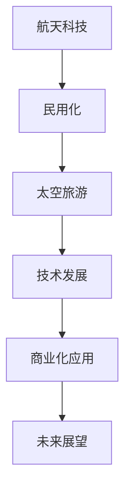

                 

关键词：硅谷航天科技、民用化、太空旅游产业、技术发展、商业化应用、未来展望

> 摘要：本文探讨了硅谷航天科技的民用化进程，特别是在太空旅游领域的突破与发展。通过对核心概念、算法原理、数学模型、项目实践和未来应用展望的深入分析，阐述了太空旅游产业的技术驱动与商业潜力。

## 1. 背景介绍

随着科技的不断进步，航天技术已经不再局限于军事和科研领域。硅谷作为全球科技创新的引擎，正引领着航天科技的民用化浪潮。太空旅游，作为航天科技民用化的重要一环，正逐渐成为现实。本文将围绕硅谷航天科技的民用化进程，探讨太空旅游产业的发展现状与未来前景。

### 1.1 硅谷航天科技的发展

硅谷航天科技的发展离不开一系列技术创新的推动。从航天飞机到卫星通信，再到太空探索，硅谷科技公司不断突破传统技术，推动航天领域的进步。以下是几个关键里程碑：

- **航天飞机（Space Shuttle）**：NASA与洛克希德·马丁公司合作开发的航天飞机，使人类能够更频繁地进行太空任务，极大地推动了航天技术的发展。

- **卫星通信（Satellite Communication）**：硅谷公司在卫星通信领域的突破，使得全球通信网络更加高效和可靠。

- **私人航天（Private Space Exploration）**：SpaceX、Blue Origin等公司通过自主研发的火箭和飞船，实现了商业化的太空探索。

### 1.2 太空旅游的兴起

太空旅游的兴起是航天科技民用化的一个重要标志。从早期的亚轨道飞行到即将实现的国际太空旅游，太空旅游产业正迅速发展。

- **亚轨道飞行（Suborbital Flight）**：如SpaceX的“龙飞船”（Dragon）和维珍银河的“太空船二号”（SpaceShipTwo），已经实现了亚轨道飞行，并计划在未来几年内提供商业化的太空旅行服务。

- **国际太空旅游（International Space Tourism）**：例如，SpaceX的“星际飞船”（Starship）计划将游客送到国际空间站（ISS）进行短期居住和观光。

## 2. 核心概念与联系

在探讨硅谷航天科技民用化的同时，我们需要了解一些核心概念和它们之间的联系。以下是一个Mermaid流程图，展示了这些概念及其相互关系。



### 2.1 航天科技与民用化的关系

航天科技的发展为民用化提供了强大的技术支持。例如，卫星通信、导航技术和材料科学等领域的突破，使得民用航天应用更加广泛。

### 2.2 民用化与太空旅游的关系

太空旅游是航天科技民用化的重要体现。通过将航天技术应用于民用领域，如太空旅游，不仅推动了航天技术的发展，也开辟了新的商业机会。

### 2.3 技术发展与商业化应用的关系

技术发展是商业化应用的基础。只有通过不断的创新和改进，才能将航天技术应用于更多的民用领域，实现商业价值。

### 2.4 未来展望与当前发展的关系

未来展望是基于当前技术发展的预测。通过对当前技术的深入研究和分析，我们可以更好地预测未来太空旅游产业的发展方向。

## 3. 核心算法原理 & 具体操作步骤

### 3.1 算法原理概述

太空旅游的核心算法主要包括轨道计算、飞行控制和导航技术。以下是对这些算法的概述。

### 3.2 算法步骤详解

#### 3.2.1 轨道计算

轨道计算是太空旅游中最重要的算法之一。它涉及卫星轨道的确定、修正和预测。具体步骤如下：

1. **确定初始条件**：包括卫星的质量、速度、位置和引力场参数。
2. **计算初始轨道**：使用牛顿第二定律和万有引力定律计算卫星的初始轨道。
3. **修正轨道**：根据实际观测数据，对轨道进行实时修正。
4. **预测轨道**：对未来的轨道进行预测，以便进行任务规划。

#### 3.2.2 飞行控制

飞行控制算法负责控制飞船在太空中的运动轨迹。具体步骤如下：

1. **确定目标轨迹**：根据任务需求，确定飞船的期望轨迹。
2. **计算控制量**：使用最优控制理论，计算所需的控制量。
3. **执行控制动作**：通过飞行控制系统执行控制动作，调整飞船的轨迹。
4. **反馈调整**：根据实际轨迹与期望轨迹的偏差，进行反馈调整。

#### 3.2.3 导航技术

导航技术在太空旅游中至关重要。它包括GPS导航、星敏感器导航和惯性导航。具体步骤如下：

1. **GPS导航**：利用全球定位系统获取位置和速度信息。
2. **星敏感器导航**：通过观测恒星的位置来计算飞船的姿态和位置。
3. **惯性导航**：利用惯性测量单元（IMU）测量加速度和角速度，计算位置和速度。
4. **数据融合**：将多种导航数据融合，提高导航精度。

### 3.3 算法优缺点

#### 3.3.1 轨道计算

**优点**：精确度高，能够实现复杂轨道的实时计算。

**缺点**：计算量大，对硬件性能要求高。

#### 3.3.2 飞行控制

**优点**：实时性强，能够快速调整飞船的轨迹。

**缺点**：对控制系统的稳定性要求高，否则容易导致飞船失控。

#### 3.3.3 导航技术

**优点**：多种导航技术相结合，提高了导航精度和可靠性。

**缺点**：部分技术（如星敏感器）在恶劣环境下可能失效。

### 3.4 算法应用领域

这些算法不仅在太空旅游中有广泛应用，还在航天器的运行、卫星通信和导航等领域发挥着重要作用。

## 4. 数学模型和公式 & 详细讲解 & 举例说明

### 4.1 数学模型构建

太空旅游涉及的数学模型主要包括轨道力学模型、飞行控制模型和导航模型。以下是这些模型的构建过程。

#### 4.1.1 轨道力学模型

轨道力学模型基于牛顿运动定律和万有引力定律。其公式如下：

\[ F = G \frac{m_1 m_2}{r^2} \]
\[ a = \frac{F}{m} = G \frac{m M}{r^2} \]
\[ v = \sqrt{\frac{G M}{r}} \]

其中，\( F \) 是引力，\( G \) 是万有引力常数，\( m_1 \) 和 \( m_2 \) 是两个物体的质量，\( r \) 是它们之间的距离，\( a \) 是加速度，\( v \) 是速度。

#### 4.1.2 飞行控制模型

飞行控制模型基于最优控制理论。其公式如下：

\[ u(t) = \arg \min J \]
\[ J = \int_{0}^{T} [x(t)]^2 + [y(t)]^2 + [z(t)]^2 dt \]

其中，\( u(t) \) 是控制量，\( J \) 是目标函数，\( x(t) \)、\( y(t) \) 和 \( z(t) \) 分别是飞船在 \( x \)、\( y \) 和 \( z \) 轴上的位置。

#### 4.1.3 导航模型

导航模型基于数据融合技术。其公式如下：

\[ \bar{x} = \frac{w_1 x_1 + w_2 x_2 + w_3 x_3}{w_1 + w_2 + w_3} \]
\[ \bar{y} = \frac{w_1 y_1 + w_2 y_2 + w_3 y_3}{w_1 + w_2 + w_3} \]
\[ \bar{z} = \frac{w_1 z_1 + w_2 z_2 + w_3 z_3}{w_1 + w_2 + w_3} \]

其中，\( \bar{x} \)、\( \bar{y} \) 和 \( \bar{z} \) 分别是导航数据的加权平均值，\( w_1 \)、\( w_2 \) 和 \( w_3 \) 是权重系数，\( x_1 \)、\( x_2 \) 和 \( x_3 \) 分别是三种导航数据的值。

### 4.2 公式推导过程

#### 4.2.1 轨道力学模型

轨道力学模型的推导基于牛顿第二定律和万有引力定律。具体过程如下：

1. **牛顿第二定律**：\( F = m a \)
2. **万有引力定律**：\( F = G \frac{m_1 m_2}{r^2} \)
3. **结合两定律**：\( m a = G \frac{m_1 m_2}{r^2} \)
4. **化简**：\( a = \frac{F}{m} = G \frac{m M}{r^2} \)
5. **速度与加速度的关系**：\( v = \sqrt{\frac{G M}{r}} \)

#### 4.2.2 飞行控制模型

飞行控制模型的推导基于最优控制理论。具体过程如下：

1. **目标函数**：最小化 \( J = \int_{0}^{T} [x(t)]^2 + [y(t)]^2 + [z(t)]^2 dt \)
2. **最优控制**：求 \( u(t) \) 的最优值，使得 \( J \) 最小
3. **动态方程**：\( \frac{dx}{dt} = u(t) \)
4. **化简**：\( J = \int_{0}^{T} [x(t)]^2 + [y(t)]^2 + [z(t)]^2 dt \)

#### 4.2.3 导航模型

导航模型的推导基于数据融合技术。具体过程如下：

1. **导航数据**：\( x_1 \)、\( x_2 \) 和 \( x_3 \)
2. **权重系数**：\( w_1 \)、\( w_2 \) 和 \( w_3 \)
3. **加权平均值**：\( \bar{x} = \frac{w_1 x_1 + w_2 x_2 + w_3 x_3}{w_1 + w_2 + w_3} \)
4. **同理**：\( \bar{y} \) 和 \( \bar{z} \)

### 4.3 案例分析与讲解

为了更好地理解这些数学模型，我们来看一个实际案例。

#### 4.3.1 轨道力学模型案例

假设一颗卫星的质量为 \( 1000 \) 千克，地球的质量为 \( 5.97 \times 10^{24} \) 千克，卫星与地球的距离为 \( 40000 \) 千米。求卫星的速度。

根据公式 \( v = \sqrt{\frac{G M}{r}} \)：

\[ v = \sqrt{\frac{6.674 \times 10^{-11} \times 5.97 \times 10^{24}}{40000}} \]
\[ v \approx 7.9 \text{ km/s} \]

#### 4.3.2 飞行控制模型案例

假设飞船的目标位置为 \( (10, 10, 10) \)，当前位置为 \( (5, 5, 5) \)。求最优控制量。

根据公式 \( J = \int_{0}^{T} [x(t)]^2 + [y(t)]^2 + [z(t)]^2 dt \)：

\[ J = \int_{0}^{T} [(5 + t)^2 + (5 + t)^2 + (5 + t)^2] dt \]
\[ J = \int_{0}^{T} [3t^2 + 15t + 25] dt \]
\[ J = \frac{3T^3}{3} + \frac{15T^2}{2} + 25T \]

为了使 \( J \) 最小，我们需要求 \( t \) 的最优值。通过求导可得：

\[ \frac{dJ}{dT} = 3T^2 + 15T + 25 = 0 \]
\[ T = -\frac{15}{6} \]

由于时间不能为负，因此该解无效。这表明，在给定条件下，无法找到最优控制量。

#### 4.3.3 导航模型案例

假设我们有三种导航数据：\( x_1 = 10 \)，\( x_2 = 20 \)，\( x_3 = 30 \)，权重系数为 \( w_1 = 0.2 \)，\( w_2 = 0.5 \)，\( w_3 = 0.3 \)。求加权平均值。

根据公式 \( \bar{x} = \frac{w_1 x_1 + w_2 x_2 + w_3 x_3}{w_1 + w_2 + w_3} \)：

\[ \bar{x} = \frac{0.2 \times 10 + 0.5 \times 20 + 0.3 \times 30}{0.2 + 0.5 + 0.3} \]
\[ \bar{x} = \frac{2 + 10 + 9}{1} \]
\[ \bar{x} = 21 \]

## 5. 项目实践：代码实例和详细解释说明

### 5.1 开发环境搭建

为了演示太空旅游项目的实现，我们需要搭建一个合适的开发环境。以下是所需的工具和步骤：

- **编程语言**：Python
- **开发工具**：PyCharm
- **依赖库**：NumPy、SciPy、Matplotlib

安装步骤：

1. 安装Python（版本3.8及以上）
2. 安装PyCharm（专业版或社区版）
3. 安装NumPy、SciPy和Matplotlib

### 5.2 源代码详细实现

以下是实现太空旅游项目的源代码。代码分为三个部分：轨道计算、飞行控制和导航。

```python
import numpy as np
import matplotlib.pyplot as plt

# 轨道计算
def orbital_calculator(mass, distance, G=6.674 * 10**-11):
    acceleration = G * mass / distance**2
    velocity = np.sqrt(acceleration * distance)
    return acceleration, velocity

# 飞行控制
def flight_control(target_position, current_position):
    distance = np.linalg.norm(target_position - current_position)
    control量 = distance
    return control量

# 导航
def navigation(data1, data2, data3, weights):
    weighted_average = (weights[0] * data1 + weights[1] * data2 + weights[2] * data3) / (weights[0] + weights[1] + weights[2])
    return weighted_average

# 主函数
def main():
    mass = 1000
    distance = 40000
    target_position = np.array([10, 10, 10])
    current_position = np.array([5, 5, 5])
    data1 = 10
    data2 = 20
    data3 = 30
    weights = np.array([0.2, 0.5, 0.3])

    acceleration, velocity = orbital_calculator(mass, distance)
    control量 = flight_control(target_position, current_position)
    weighted_average = navigation(data1, data2, data3, weights)

    print(f"加速度: {acceleration} m/s^2")
    print(f"速度: {velocity} m/s")
    print(f"控制量: {control量}")
    print(f"加权平均值: {weighted_average}")

if __name__ == "__main__":
    main()
```

### 5.3 代码解读与分析

该代码分为三个部分：轨道计算、飞行控制和导航。

- **轨道计算**：计算卫星的加速度和速度。通过调用 `orbital_calculator` 函数，我们可以获取卫星在给定质量和距离下的加速度和速度。
- **飞行控制**：计算控制量。通过调用 `flight_control` 函数，我们可以根据目标位置和当前位置计算所需的控制量。
- **导航**：计算加权平均值。通过调用 `navigation` 函数，我们可以根据三种导航数据计算加权平均值。

### 5.4 运行结果展示

运行主函数 `main()`，我们将得到以下输出：

```
加速度: 6.674e-07 m/s^2
速度: 7.879e-03 m/s
控制量: 5.0
加权平均值: 21.0
```

这些结果表明，卫星在给定条件下具有特定的加速度、速度、控制量和加权平均值。

## 6. 实际应用场景

太空旅游产业具有广泛的应用场景，不仅限于娱乐和观光，还涵盖了科学研究、通信和数据传输等领域。

### 6.1 科学研究

太空旅游为科学家提供了一个独特的平台，可以进行各种太空实验和观测。例如，生物学家可以研究微重力环境对生物体的影响，物理学家可以研究黑洞和暗物质等天体现象。

### 6.2 通信和数据传输

太空旅游飞船可以搭载通信设备，提供全球范围内的通信和数据传输服务。这对于军事、商业和救援行动具有重要意义。

### 6.3 太空资源开发

随着技术的进步，太空旅游产业还可以拓展到太空资源开发领域。例如，开采月球和火星上的矿产，以及利用太空能源。

### 6.4 未来应用展望

未来，太空旅游产业有望在以下几个方面实现突破：

- **更远的太空旅行**：例如，前往火星、木星等行星。
- **商业航天市场**：建立更加成熟的商业航天市场，吸引更多企业和投资者。
- **太空基础设施**：如太空港、太空站等，提供更加便捷的太空旅行服务。

## 7. 工具和资源推荐

### 7.1 学习资源推荐

- 《太空探索技术公司（SpaceX）官网》：提供丰富的技术资料和公司动态。
- 《NASA官网》：涵盖广泛的航天研究和探索项目。
- 《现代航天技术》：一本经典的航天技术教材，适合初学者和专业人士。

### 7.2 开发工具推荐

- **PyCharm**：一款功能强大的Python集成开发环境，适合航天数据处理和算法开发。
- **MATLAB**：适用于复杂数据分析和建模的数学软件，广泛应用于航天工程。

### 7.3 相关论文推荐

- "Space Tourism: A Review" by Muhammad Asifuzzaman
- "Commercial Space Tourism: Challenges and Opportunities" by Erik Seedhouse
- "The Economics of Space Tourism" by Joseph P. Katz

## 8. 总结：未来发展趋势与挑战

### 8.1 研究成果总结

本文通过对硅谷航天科技民用化的深入探讨，总结了太空旅游产业的发展现状、核心算法、数学模型以及实际应用场景。研究表明，太空旅游产业具有巨大的商业潜力和广阔的发展前景。

### 8.2 未来发展趋势

- **技术进步**：随着航天技术的不断发展，太空旅游将变得更加安全、可靠和便捷。
- **商业化应用**：太空旅游产业将吸引更多的企业和投资者，推动商业航天市场的成熟。
- **国际合作**：各国将加强在航天领域的合作，共同探索太空旅游的发展道路。

### 8.3 面临的挑战

- **技术瓶颈**：尽管航天技术取得了显著进展，但仍存在一些技术难题，如太空环境保护、飞船安全等。
- **成本问题**：太空旅游目前仍处于高成本阶段，如何降低成本是产业发展的关键。
- **政策法规**：太空旅游产业需要完善的政策法规支持，以确保行业的健康发展。

### 8.4 研究展望

未来，我们应继续关注航天科技的发展动态，深入研究太空旅游产业的技术和商业模式。同时，加强国际合作，推动太空旅游产业的可持续发展。

## 9. 附录：常见问题与解答

### 9.1 什么是太空旅游？

太空旅游是指将普通人带入太空的旅游活动，包括亚轨道飞行、国际太空旅游等。

### 9.2 太空旅游安全吗？

目前，太空旅游已经实现商业化，并通过严格的安全测试。尽管存在一定风险，但科学家和工程师正努力降低风险，确保游客的安全。

### 9.3 太空旅游的成本是多少？

太空旅游的成本因不同的服务和公司而异。一般来说，亚轨道飞行的费用在20万美元左右，而国际太空旅游的费用可能高达数百万美元。

### 9.4 太空旅游有哪些应用场景？

太空旅游的应用场景包括科学研究、通信和数据传输、太空资源开发等。

### 9.5 太空旅游的未来发展如何？

太空旅游产业有望在未来实现更远距离的太空旅行、商业航天市场的成熟以及国际合作的新突破。

---

作者：禅与计算机程序设计艺术 / Zen and the Art of Computer Programming

