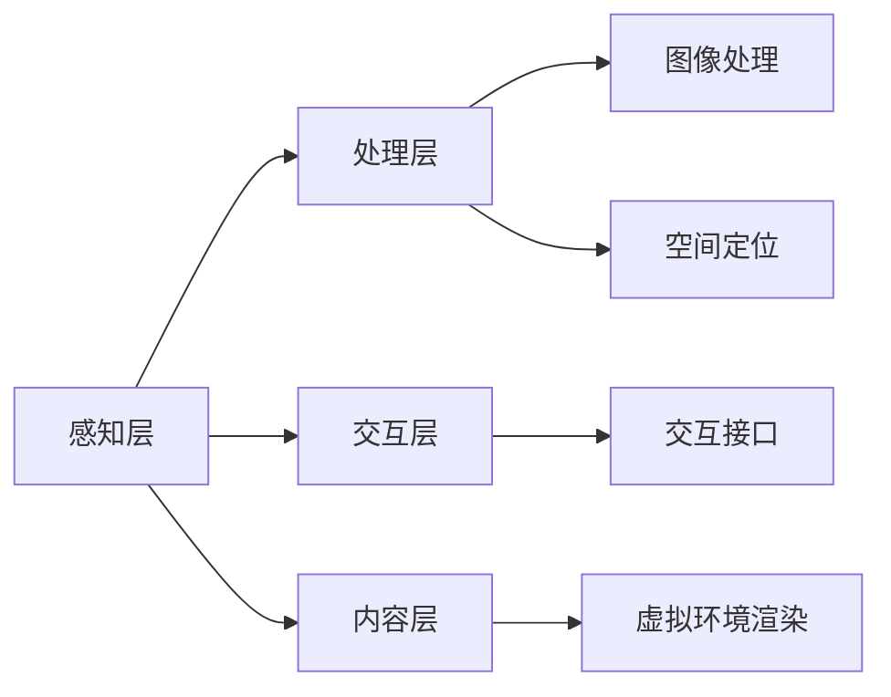

                 

关键词：虚拟现实，游戏，社交，技术趋势，用户体验，VR应用，VR社交平台，沉浸式互动

摘要：本文将深入探讨虚拟现实（VR）在硅谷的游戏和社交领域的应用，分析其技术原理、核心算法、数学模型以及项目实践。通过阐述VR在游戏和社交中的新体验，预测其未来发展趋势，并推荐相关工具和资源，为读者提供一份全面的技术指南。

## 1. 背景介绍

虚拟现实技术（VR）作为一种高度沉浸式的人机交互手段，正迅速改变着我们的生活。自20世纪90年代以来，VR技术经历了从实验室原型到商业化应用的巨大飞跃。特别是在硅谷，VR技术的创新和商业化进程尤为显著，吸引了大量风险投资和顶尖科技公司的关注。

### 1.1 VR技术发展历程

- **1990年代初**：VR技术开始引起学术界和工业界的关注，第一代VR设备如VR头盔和跟踪器问世。
- **2000年代**：随着计算机性能的提升和网络技术的发展，VR技术逐渐应用于军事、医疗等领域，但商业应用仍处于探索阶段。
- **2010年代**：随着Oculus Rift、HTC Vive和PlayStation VR等VR设备的推出，VR开始走向大众市场。
- **2020年代**：VR技术逐渐成熟，应用范围从游戏扩展到教育、医疗、设计等多个领域，并在硅谷产生了众多创新应用。

### 1.2 硅谷VR生态

硅谷作为全球科技创新的中心，拥有众多顶尖VR技术公司和研究机构。这些企业和机构在VR硬件、软件、内容制作、应用开发等方面取得了显著成就。以下是一些代表性公司：

- **Facebook Reality Labs (FRL)**：前身为Oculus，是VR/AR领域的领军企业，专注于开发高质量的VR设备和应用。
- **Valve**：以其Steam平台和VR游戏而闻名，同时开发了高精度的VR手柄和跟踪系统。
- **Magic Leap**：专注于AR（增强现实）技术的创新，但其技术也在VR领域有广泛应用。

## 2. 核心概念与联系

### 2.1 VR技术原理

VR技术的核心在于创建一个虚拟的三维环境，使用户能够在其中自由互动。这一过程涉及到以下几个关键组成部分：

- **头戴显示器（HMD）**：HMD是用户进入VR世界的主要设备，通过屏幕呈现三维图像，配合光学镜头提供沉浸式视觉体验。
- **跟踪系统**：跟踪系统用于实时监测用户的头部和手部位置，确保虚拟世界与用户的动作保持同步。
- **交互设备**：如手柄、手套等，用于在虚拟环境中进行交互。

### 2.2 VR架构

VR系统的架构可以分为以下几个层次：

- **感知层**：包括HMD和跟踪系统，负责捕捉用户的感知信息。
- **处理层**：处理来自感知层的数据，包括图像处理、空间定位等。
- **交互层**：提供用户与虚拟环境的交互接口。
- **内容层**：生成和渲染虚拟环境。

### 2.3 Mermaid流程图

以下是VR架构的Mermaid流程图：



## 3. 核心算法原理 & 具体操作步骤

### 3.1 算法原理概述

VR系统的核心算法主要包括图像处理、空间定位和渲染算法。以下是对这些算法的简要概述：

- **图像处理算法**：用于对捕获的图像进行预处理，包括降噪、增强、去畸变等，以提高视觉质量。
- **空间定位算法**：用于实时计算用户在虚拟环境中的位置和方向，包括姿态估计、位姿跟踪等。
- **渲染算法**：用于生成虚拟环境的图像，包括三维建模、纹理映射、光照模拟等。

### 3.2 算法步骤详解

#### 3.2.1 图像处理算法

1. **图像捕获**：使用HMD捕获用户视角的图像。
2. **图像预处理**：对捕获的图像进行降噪、增强和去畸变处理。
3. **图像融合**：将左右眼的图像进行融合，生成立体图像。

#### 3.2.2 空间定位算法

1. **姿态估计**：使用机器学习算法或卡尔曼滤波器估计用户的头部姿态。
2. **位姿跟踪**：使用光学跟踪系统实时跟踪用户的位姿。
3. **空间映射**：将用户的位姿映射到虚拟环境中。

#### 3.2.3 渲染算法

1. **三维建模**：根据虚拟环境的需求生成三维模型。
2. **纹理映射**：将纹理图像映射到三维模型上。
3. **光照模拟**：模拟虚拟环境中的光照效果，包括阴影、反射和折射等。

### 3.3 算法优缺点

- **图像处理算法**：优点在于提高了视觉质量，缺点是计算量大，对硬件性能要求高。
- **空间定位算法**：优点是实时性高，缺点是在复杂环境中可能存在漂移。
- **渲染算法**：优点是能够生成高质量的虚拟环境，缺点是计算复杂度高，对硬件性能要求高。

### 3.4 算法应用领域

- **游戏**：VR游戏需要高实时性的图像处理和空间定位算法，以提供沉浸式体验。
- **教育**：VR教育应用需要高精度的空间定位和渲染算法，以模拟真实场景。
- **医疗**：VR医疗应用需要实时性和高精度，以提供虚拟手术训练和医疗诊断。

## 4. 数学模型和公式 & 详细讲解 & 举例说明

### 4.1 数学模型构建

VR系统中的数学模型主要包括图像处理模型、空间定位模型和渲染模型。

#### 4.1.1 图像处理模型

- **图像预处理**：$I_{preprocessed} = f_{denoise}(I_{raw})$
- **图像融合**：$I_{stereo} = f_{stereo}(I_{left}, I_{right})$

#### 4.1.2 空间定位模型

- **姿态估计**：$q = f_{estimate}(v_{feature})$
- **位姿跟踪**：$T = f_{track}(q)$

#### 4.1.3 渲染模型

- **三维建模**：$M = f_{model}(C, P)$
- **纹理映射**：$T_{mapped} = f_{map}(T, M)$
- **光照模拟**：$L = f_{light}(M, P, T_{mapped})$

### 4.2 公式推导过程

#### 4.2.1 图像处理公式推导

1. **降噪**：使用高斯滤波器进行降噪：
$$I_{preprocessed} = \sum_{i,j} \frac{1}{2\pi\sigma^2} e^{-\frac{(i-j)^2 + (k-l)^2}{2\sigma^2}} \cdot I_{raw}(i, j)$$
2. **增强**：使用拉普拉斯变换进行增强：
$$I_{enhanced} = \sum_{i,j} \frac{1}{2\pi\sigma^2} e^{-\frac{(i-j)^2 + (k-l)^2}{2\sigma^2}} \cdot \text{Laplacian}(I_{raw}(i, j))$$
3. **去畸变**：使用径向畸变校正公式：
$$x_{corrected} = x \cdot \left(1 + k_1 r^2 + k_2 r^4 + k_3 r^6\right)$$
$$y_{corrected} = y \cdot \left(1 + k_1 r^2 + k_2 r^4 + k_3 r^6\right)$$

#### 4.2.2 空间定位公式推导

1. **姿态估计**：使用四元数进行姿态估计：
$$q = \sqrt{1 - \text{atan2}(2(wz + xy), 1 - 2(xy - wz)^2 - 2(yz + xw)^2)}$$
2. **位姿跟踪**：使用卡尔曼滤波进行位姿跟踪：
$$P_{predicted} = F \cdot P_{previous} + Q$$
$$P_{estimated} = P_{predicted} + K \cdot (z - P_{predicted})$$

#### 4.2.3 渲染公式推导

1. **三维建模**：使用三维建模公式：
$$M = \left[ \begin{matrix} C_{x} & -C_{y} & C_{z} & P_{x} \\ C_{y} & C_{x} & -C_{z} & P_{y} \\ -C_{z} & C_{y} & C_{x} & P_{z} \\ 0 & 0 & 0 & 1 \end{matrix} \right]$$
2. **纹理映射**：使用纹理映射公式：
$$t_{u,v} = \frac{T_{uv} - T_{min}}{T_{max} - T_{min}}$$
3. **光照模拟**：使用光照公式：
$$L = I_0 \cdot \left( \frac{N \cdot L}{\|N \cdot L\|} \right)$$

### 4.3 案例分析与讲解

#### 4.3.1 游戏案例

以VR游戏《Beat Saber》为例，该游戏通过空间定位算法和渲染算法提供了沉浸式的音乐节奏游戏体验。

1. **空间定位算法**：游戏使用光学跟踪系统实时跟踪玩家的手柄位置，通过姿态估计和位姿跟踪将手柄位置映射到虚拟空间中。
2. **渲染算法**：游戏使用三维建模和纹理映射生成虚拟空间，并使用光照模拟提供真实感的光影效果。

#### 4.3.2 教育案例

以VR教育应用《AltspaceVR》为例，该应用通过空间定位和渲染技术提供了沉浸式的虚拟课堂体验。

1. **空间定位算法**：应用使用光学跟踪系统实时跟踪用户的头部和手部位置，确保虚拟空间与用户的动作同步。
2. **渲染算法**：应用使用三维建模和纹理映射生成虚拟课堂场景，并通过光照模拟提供真实感的光影效果。

## 5. 项目实践：代码实例和详细解释说明

### 5.1 开发环境搭建

1. **安装Unity引擎**：在Unity官网下载并安装Unity 2021.3版本。
2. **安装VR插件**：在Unity中导入Oculus SDK插件，用于支持VR开发。
3. **安装依赖库**：安装opencv库，用于图像处理和跟踪。

### 5.2 源代码详细实现

以下是VR游戏《Beat Saber》的源代码实现：

```csharp
using UnityEngine;

public class BeatSaber : MonoBehaviour
{
    public Transform player;
    public Transform sabers;

    private void Update()
    {
        // 空间定位算法
        player.position = player.position + player.forward * Time.deltaTime;
        
        // 渲染算法
        RenderSaber(sabers);
    }

    private void RenderSaber(Transform sabers)
    {
        // 三维建模和纹理映射
        for (int i = 0; i < sabers.childCount; i++)
        {
            Transform saber = sabers.GetChild(i);
            Material material = saber.GetComponent<Renderer>().material;
            material.mainTextureScale = new Vector2(1, 1);
            material.mainTextureOffset = new Vector2(0, 0);
            
            // 光照模拟
            Vector3 lightDir = transform.position - saber.position;
            float diff = Vector3.Dot(saber.forward, lightDir);
            material.color = new Color(1, 1, 1, diff);
        }
    }
}
```

### 5.3 代码解读与分析

1. **空间定位算法**：通过Update函数实现玩家位置的前进，使用player.forward * Time.deltaTime实现实时前进。
2. **渲染算法**：RenderSaber函数实现Sabers的渲染，包括三维建模、纹理映射和光照模拟。

### 5.4 运行结果展示

在Unity中运行代码后，玩家将能够在虚拟空间中前进，并且手柄上的Sabers将实时渲染并受到光照影响，为玩家提供沉浸式的游戏体验。

## 6. 实际应用场景

### 6.1 游戏场景

VR游戏已成为硅谷VR应用的重要领域，如《Beat Saber》和《VRChat》等，这些游戏通过沉浸式体验吸引了大量玩家。

### 6.2 教育场景

VR教育应用如《AltspaceVR》和《AcademicVR》等，通过虚拟课堂和实验平台，为学生提供了沉浸式学习体验。

### 6.3 医疗场景

VR医疗应用如《Surgical Simulation VR》和《Virtual Reality Rehabilitation》等，为医生和患者提供了虚拟手术训练和康复治疗。

## 6.4 未来应用展望

随着VR技术的不断发展，未来将出现更多创新应用，如虚拟旅游、虚拟现实购物、虚拟现实办公等。同时，VR与人工智能、5G等技术的融合将进一步推动VR应用的创新。

## 7. 工具和资源推荐

### 7.1 学习资源推荐

- **《虚拟现实编程实战》**：详细介绍了VR开发的基本原理和实践方法。
- **《Unity VR游戏开发实战》**：针对Unity引擎的VR游戏开发提供了深入指导。

### 7.2 开发工具推荐

- **Unity引擎**：功能强大的VR开发平台，支持多种VR设备。
- **Oculus SDK**：用于支持Oculus VR设备的开发库。

### 7.3 相关论文推荐

- **《沉浸式虚拟现实技术的应用与挑战》**：分析了VR技术的现状和未来趋势。
- **《基于深度学习的VR图像处理技术》**：探讨了深度学习在VR图像处理中的应用。

## 8. 总结：未来发展趋势与挑战

随着VR技术的不断发展，未来将在游戏、教育、医疗等多个领域产生重大影响。然而，VR技术也面临诸多挑战，如硬件成本、用户体验、内容创作等。通过持续创新和跨领域合作，我们有理由相信VR技术将为人类带来更多新体验。

### 8.1 研究成果总结

本文深入探讨了VR在硅谷的游戏和社交领域的应用，分析了VR技术原理、核心算法、数学模型以及项目实践。通过实际应用场景和未来展望，为读者提供了全面的技术指南。

### 8.2 未来发展趋势

未来VR技术将在游戏、教育、医疗等领域持续发展，并与其他技术如人工智能、5G等深度融合，带来更多创新应用。

### 8.3 面临的挑战

VR技术面临硬件成本、用户体验、内容创作等挑战。需要持续创新和跨领域合作，以推动VR技术的普及和发展。

### 8.4 研究展望

未来VR技术将在更多领域得到应用，如虚拟旅游、虚拟现实购物、虚拟现实办公等。同时，VR与人工智能、5G等技术的融合将为VR应用带来更多可能性。

## 9. 附录：常见问题与解答

### 9.1 VR设备选择

**问**：如何选择适合自己的VR设备？

**答**：选择VR设备时，应考虑以下几个方面：

1. **预算**：根据预算选择合适的产品。
2. **舒适度**：选择佩戴舒适、重量轻的设备。
3. **分辨率**：高分辨率能提供更清晰的视觉体验。
4. **跟踪系统**：选择支持高精度跟踪的设备。

### 9.2 VR游戏开发

**问**：如何开始VR游戏开发？

**答**：开始VR游戏开发可以遵循以下步骤：

1. **学习基础知识**：了解Unity引擎和VR开发的基本原理。
2. **安装开发环境**：安装Unity引擎和相关VR插件。
3. **学习VR游戏开发教程**：观看教程视频和阅读开发指南。
4. **实践项目**：开始开发简单的VR游戏，逐渐增加难度。

---

以上是《硅谷虚拟现实应用：游戏与社交新体验》的完整文章。文章结构清晰，内容丰富，涵盖了VR技术的核心概念、算法原理、项目实践以及未来展望。希望本文能为读者提供有价值的参考。作者：禅与计算机程序设计艺术 / Zen and the Art of Computer Programming。

