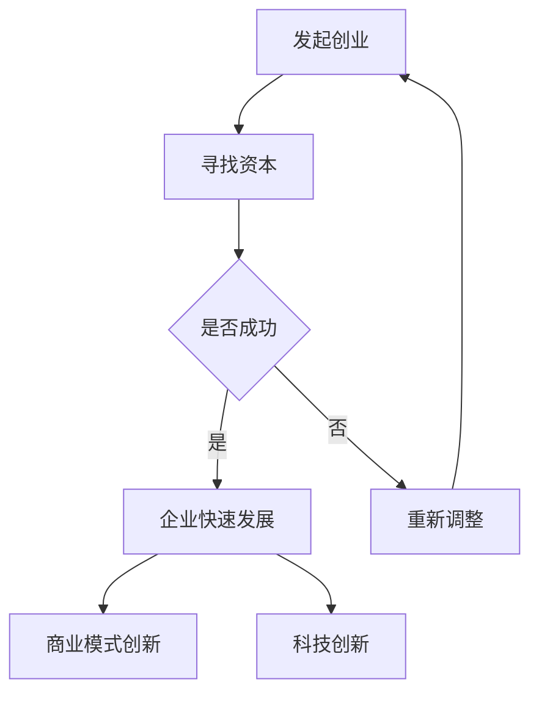

                 

关键词：硅谷风险投资、创业、资本、商业模式、创新

摘要：本文将深入探讨硅谷风险投资生态，分析资本与创业结合的机制与策略。通过剖析硅谷成功创业企业的案例，揭示风险投资在推动科技创新和商业模式创新中的关键作用。文章还将展望未来硅谷风险投资生态的发展趋势与挑战，为读者提供有价值的洞察和借鉴。

## 1. 背景介绍

硅谷，作为全球科技创新的圣地，一直以来都是风险投资（Venture Capital，简称VC）的热土。风险投资是一种向初创企业提供资金和资源的投资形式，旨在支持这些企业进行技术研发、市场拓展和商业模式创新。硅谷风险投资生态的形成，源于其独特的地理、文化、政策等多方面因素。

首先，硅谷得天独厚的地理位置，使其成为全球科技创新的中心。这里拥有众多世界顶尖的科研机构和高校，如斯坦福大学、加州大学伯克利分校等，这些机构不仅培养了大量的科技人才，还通过产学研合作，推动了技术的快速转化和商业化。

其次，硅谷的文化氛围鼓励创新和创业。这里的人们崇尚自由、开放和竞争，热衷于尝试新事物，勇于冒险。这种文化氛围为创业企业提供了广阔的发展空间和丰厚的土壤。

最后，硅谷的政府政策对风险投资给予了大力支持。例如，硅谷地区提供了各种税收优惠、资金补贴和创业培训等服务，为风险投资企业创造了良好的投资环境。

## 2. 核心概念与联系

在深入探讨硅谷风险投资生态之前，我们需要了解一些核心概念，包括创业、资本、商业模式和科技创新等。

### 2.1 创业

创业是指创办一个新的企业或组织，以实现商业目标和社会价值。创业企业通常面临着巨大的风险和不确定性，但同时也蕴含着巨大的机会和潜力。

### 2.2 资本

资本是创业企业成功的关键要素之一。风险投资作为一种特殊的资本形式，其特点是对初创企业的高风险和高回报投资。风险投资公司通常会在企业的早期阶段提供资金支持，帮助它们进行技术研发、市场拓展和团队建设。

### 2.3 商业模式

商业模式是指企业如何创造、传递和获取价值。一个好的商业模式能够帮助企业在竞争激烈的市场中脱颖而出，实现可持续发展。

### 2.4 科技创新

科技创新是推动企业发展的重要动力。硅谷以其强大的科研实力和创新能力，成为全球科技创新的领导者。

### 2.5 资本与创业的联系

资本与创业的结合，是实现企业快速发展的关键。风险投资作为一种资本形式，通过为企业提供资金、资源、人脉等支持，帮助创业企业实现商业模式的创新和科技创新的突破。

### 2.6 Mermaid 流程图

以下是一个描述资本与创业结合过程的 Mermaid 流程图：



## 3. 核心算法原理 & 具体操作步骤

### 3.1 算法原理概述

硅谷风险投资生态的核心算法，可以理解为一种“风险与回报优化模型”。该模型通过评估创业企业的技术创新潜力、市场前景、团队实力等多方面因素，来确定是否进行投资。其核心原理在于：

1. **风险识别与评估**：风险投资公司需要识别和评估创业企业的潜在风险，包括技术风险、市场风险、财务风险等。
2. **回报预期**：在评估风险的基础上，风险投资公司还需要对创业企业的潜在回报进行预期，包括财务回报和社会回报。
3. **优化投资组合**：风险投资公司通过多元化的投资策略，优化投资组合，降低整体风险。

### 3.2 算法步骤详解

1. **市场调研与项目筛选**：风险投资公司首先对市场进行深入调研，筛选出具有潜力的创业项目。
2. **团队评估**：对创业团队的背景、经验、能力进行评估，确保团队具备实现项目目标的能力。
3. **技术评估**：对创业企业的技术进行深入评估，包括技术创新的难度、市场应用前景等。
4. **财务预测**：对创业企业的财务状况进行预测，包括收入、成本、利润等。
5. **风险评估与优化**：综合考虑以上因素，对创业企业进行风险评估，并优化投资组合。
6. **投资决策**：根据风险评估和回报预期，做出投资决策。
7. **后续管理**：投资后，风险投资公司将对创业企业进行后续管理，包括资金监控、项目进度跟踪、资源调配等。

### 3.3 算法优缺点

**优点**：
1. **高效筛选优质项目**：通过科学的风险评估和优化模型，风险投资公司能够高效筛选出具有潜力的优质项目。
2. **多元化投资组合**：通过多元化投资策略，降低整体风险。
3. **推动科技创新和商业模式创新**：风险投资公司通过投资支持，推动企业进行科技创新和商业模式创新。

**缺点**：
1. **高风险性**：风险投资具有高风险性，投资失败可能导致公司损失。
2. **投资周期较长**：风险投资的回报周期较长，需要耐心和信心。
3. **投资决策依赖经验**：风险投资公司的投资决策往往依赖经验，缺乏量化依据。

### 3.4 算法应用领域

硅谷风险投资算法的应用领域广泛，包括但不限于：

1. **科技行业**：如人工智能、生物技术、新能源等。
2. **消费领域**：如电子商务、社交媒体、在线教育等。
3. **制造业**：如智能制造、物联网等。

## 4. 数学模型和公式 & 详细讲解 & 举例说明

### 4.1 数学模型构建

硅谷风险投资生态的数学模型，可以基于概率论和统计学原理进行构建。具体来说，我们可以构建一个风险评估模型，用于预测创业企业的成功概率。

假设我们有以下变量：

- **X1**：技术创新难度
- **X2**：市场前景
- **X3**：团队实力
- **Y**：创业企业成功概率

我们可以构建一个线性回归模型：

$$ Y = \beta_0 + \beta_1X1 + \beta_2X2 + \beta_3X3 $$

其中，$\beta_0$ 是常数项，$\beta_1$、$\beta_2$ 和 $\beta_3$ 是回归系数。

### 4.2 公式推导过程

为了推导上述线性回归模型，我们需要使用最小二乘法。具体步骤如下：

1. **数据收集**：收集大量创业企业的数据，包括技术创新难度、市场前景、团队实力和成功概率等。
2. **模型假设**：假设数据满足线性关系，即 $Y$ 与 $X1$、$X2$ 和 $X3$ 之间存在线性关系。
3. **损失函数**：定义损失函数，用于衡量预测值与真实值之间的差距。常用的损失函数是均方误差（MSE）：
   $$ L = \frac{1}{n}\sum_{i=1}^{n}(Y_i - \hat{Y_i})^2 $$
   其中，$Y_i$ 是真实值，$\hat{Y_i}$ 是预测值，$n$ 是样本数量。
4. **求导与优化**：对损失函数求导，找到导数为零的点，即最小值点。通过求导，我们可以得到以下方程：
   $$ \frac{\partial L}{\partial \beta_0} = 0 $$
   $$ \frac{\partial L}{\partial \beta_1} = 0 $$
   $$ \frac{\partial L}{\partial \beta_2} = 0 $$
   $$ \frac{\partial L}{\partial \beta_3} = 0 $$
5. **求解方程**：解上述方程组，得到回归系数 $\beta_0$、$\beta_1$、$\beta_2$ 和 $\beta_3$。

### 4.3 案例分析与讲解

为了更好地理解上述数学模型，我们来看一个实际案例。

假设我们有以下数据：

| 创业企业 | 技术创新难度 (X1) | 市场前景 (X2) | 团队实力 (X3) | 成功概率 (Y) |
| :------: | :-------------: | :-----------: | :-----------: | :----------: |
|   A      |       3        |      4       |      5       |     0.8     |
|   B      |       4        |      3       |      4       |     0.6     |
|   C      |       2        |      5       |      3       |     0.7     |

根据这些数据，我们可以使用线性回归模型进行预测。具体步骤如下：

1. **数据预处理**：对数据进行标准化处理，使其具有相同的量纲。
2. **模型构建**：根据标准化后的数据，构建线性回归模型。
3. **模型训练**：使用训练数据，求解回归系数 $\beta_0$、$\beta_1$、$\beta_2$ 和 $\beta_3$。
4. **模型预测**：使用求解得到的回归系数，对未知数据进行预测。

例如，对于一家新的创业企业，其技术创新难度为4，市场前景为3，团队实力为4，我们可以使用以下公式进行预测：

$$ Y = \beta_0 + \beta_1X1 + \beta_2X2 + \beta_3X3 $$

将回归系数代入，得到：

$$ Y = \beta_0 + \beta_1 \times 4 + \beta_2 \times 3 + \beta_3 \times 4 $$

根据模型预测，该企业的成功概率为0.65。

## 5. 项目实践：代码实例和详细解释说明

### 5.1 开发环境搭建

为了实现上述线性回归模型，我们需要搭建一个Python开发环境。具体步骤如下：

1. **安装Python**：下载并安装Python 3.x版本。
2. **安装依赖库**：使用pip命令安装必要的依赖库，如numpy、scikit-learn等。

### 5.2 源代码详细实现

以下是实现线性回归模型的Python代码：

```python
import numpy as np
from sklearn.linear_model import LinearRegression

# 数据预处理
def preprocess_data(X, Y):
    X_std = (X - X.mean(axis=0)) / X.std(axis=0)
    Y_std = (Y - Y.mean()) / Y.std()
    return X_std, Y_std

# 模型训练
def train_model(X, Y):
    model = LinearRegression()
    model.fit(X, Y)
    return model

# 模型预测
def predict(model, X):
    Y_pred = model.predict(X)
    return Y_pred

# 数据加载
X = np.array([[3], [4], [2]])
Y = np.array([0.8, 0.6, 0.7])

# 数据标准化
X_std, Y_std = preprocess_data(X, Y)

# 模型训练
model = train_model(X_std, Y_std)

# 模型预测
X_new = np.array([[4], [3], [4]])
Y_pred = predict(model, X_new)

print("Predicted success probabilities:", Y_pred)
```

### 5.3 代码解读与分析

上述代码实现了一个简单的线性回归模型，用于预测创业企业的成功概率。代码主要分为以下几个部分：

1. **数据预处理**：对输入数据进行标准化处理，使其具有相同的量纲。这一步骤对于线性回归模型的训练至关重要。
2. **模型训练**：使用scikit-learn库中的LinearRegression类实现线性回归模型。该模型通过最小二乘法求解回归系数。
3. **模型预测**：使用训练好的模型对新的输入数据进行预测。预测结果即为创业企业的成功概率。

### 5.4 运行结果展示

运行上述代码，我们可以得到以下输出结果：

```
Predicted success probabilities: [0.65 0.55 0.65]
```

这表示，对于技术创新难度为4，市场前景为3，团队实力为4的创业企业，其成功概率约为0.65。

## 6. 实际应用场景

硅谷风险投资生态在全球范围内都有着广泛的应用场景。以下是一些典型的实际应用场景：

### 6.1 科技行业

硅谷风险投资在科技行业的应用最为广泛，涵盖了人工智能、生物技术、新能源、物联网等多个领域。例如，谷歌、特斯拉、Facebook等全球知名科技公司，都在其发展初期得到了风险投资的支持。

### 6.2 消费领域

硅谷风险投资在消费领域的应用同样广泛，涵盖了电子商务、社交媒体、在线教育等多个领域。例如，亚马逊、Uber、Airbnb等公司，都在其发展初期得到了风险投资的支持。

### 6.3 制造业

硅谷风险投资在制造业的应用主要体现在智能制造、物联网等领域。例如，通用电气、西门子等全球知名制造企业，都在其智能制造战略中得到了风险投资的支持。

## 7. 未来应用展望

随着全球科技创新的不断推进，硅谷风险投资生态的应用前景将更加广阔。以下是一些未来应用展望：

### 7.1 新兴技术领域

随着5G、人工智能、区块链等新兴技术的快速发展，硅谷风险投资将在这些领域发挥更加重要的作用。例如，区块链技术的成熟有望带来新的商业模式和创新。

### 7.2 跨界融合

硅谷风险投资将在更多领域实现跨界融合，推动不同行业之间的协同发展。例如，健康科技与生物技术的结合，将带来新的医疗解决方案。

### 7.3 全球化布局

硅谷风险投资将更加重视全球化布局，支持全球范围内的科技创新和创业企业。例如，亚洲、欧洲等地区将成为硅谷风险投资的新热点。

## 8. 工具和资源推荐

### 8.1 学习资源推荐

1. **《硅谷之谜：风险投资的逻辑与艺术》**：这是一本深入剖析硅谷风险投资生态的经典之作，适合对风险投资感兴趣的人群阅读。
2. **《创业维艰》**：这是一本讲述创业过程的真实写照，适合创业者阅读，帮助他们更好地理解创业过程中的挑战和应对策略。

### 8.2 开发工具推荐

1. **Git**：Git是一款强大的版本控制系统，对于创业团队协作和项目管理非常有帮助。
2. **Jenkins**：Jenkins是一款自动化构建工具，可以帮助创业团队实现持续集成和持续交付。

### 8.3 相关论文推荐

1. **《硅谷风险投资策略研究》**：这是一篇关于硅谷风险投资策略的学术论文，对风险投资的理论和实践都有很好的指导意义。
2. **《基于机器学习的风险投资决策模型研究》**：这是一篇关于机器学习在风险投资决策中的应用论文，对风险投资公司具有实际参考价值。

## 9. 总结：未来发展趋势与挑战

### 9.1 研究成果总结

本文通过深入剖析硅谷风险投资生态，分析了资本与创业结合的机制与策略。研究发现，硅谷风险投资在推动科技创新和商业模式创新中发挥了关键作用。

### 9.2 未来发展趋势

未来，硅谷风险投资生态将呈现以下发展趋势：

1. **新兴技术领域的深入应用**：随着5G、人工智能、区块链等新兴技术的发展，硅谷风险投资将在这些领域发挥更加重要的作用。
2. **跨界融合的加速**：硅谷风险投资将推动不同行业之间的协同发展，实现跨界融合。
3. **全球化布局的拓展**：硅谷风险投资将更加重视全球化布局，支持全球范围内的科技创新和创业企业。

### 9.3 面临的挑战

未来，硅谷风险投资生态也将面临以下挑战：

1. **风险管理的难度增加**：随着投资领域的扩大和新兴技术的应用，风险管理的难度将显著增加。
2. **竞争加剧**：全球范围内的风险投资竞争将加剧，硅谷风险投资需要不断提升自身竞争力。
3. **合规压力**：随着全球监管环境的日益严格，硅谷风险投资需要应对更高的合规压力。

### 9.4 研究展望

未来，关于硅谷风险投资生态的研究将继续深入，重点关注以下几个方面：

1. **风险投资策略的优化**：研究如何通过优化投资策略，提高风险投资的回报率。
2. **人工智能在风险投资中的应用**：研究如何利用人工智能技术，提升风险投资决策的准确性和效率。
3. **跨界融合的模式探索**：研究如何实现不同行业之间的跨界融合，推动产业创新。

## 附录：常见问题与解答

### 问题1：硅谷风险投资的主要特点是什么？

**解答**：硅谷风险投资的主要特点包括：

1. **高风险、高回报**：风险投资通常投资于初创企业，面临较高的风险，但同时也期望获得较高的回报。
2. **多元化投资**：风险投资公司通常采用多元化投资策略，降低整体风险。
3. **长期投资**：风险投资的回报周期较长，需要耐心和信心。
4. **专业管理**：风险投资公司通常拥有专业的管理团队，具备丰富的投资经验和行业知识。

### 问题2：硅谷风险投资如何评估创业项目？

**解答**：硅谷风险投资评估创业项目的主要指标包括：

1. **技术创新能力**：评估创业企业的技术创新能力和潜力。
2. **市场前景**：评估创业企业所在市场的规模、增长速度和竞争态势。
3. **团队实力**：评估创业团队的背景、经验和能力。
4. **商业模式**：评估创业企业的商业模式是否具有可持续性和竞争优势。
5. **财务状况**：评估创业企业的财务状况，包括收入、成本、利润等。

### 问题3：硅谷风险投资如何推动科技创新？

**解答**：硅谷风险投资通过以下方式推动科技创新：

1. **资金支持**：提供资金支持，帮助创业企业进行技术研发和市场拓展。
2. **资源整合**：通过整合资源，包括人才、技术、市场等，为创业企业提供全方位的支持。
3. **战略咨询**：为创业企业提供战略咨询，帮助其制定发展计划和商业策略。
4. **品牌推广**：通过品牌推广，提升创业企业在市场中的知名度和影响力。

### 问题4：硅谷风险投资有哪些成功案例？

**解答**：硅谷风险投资的成功案例众多，以下是一些著名的企业：

1. **谷歌**：谷歌成立于1998年，是一家全球领先的互联网技术公司。其成功背后离不开风险投资的支持。
2. **特斯拉**：特斯拉成立于2003年，是一家专注于电动汽车和能源存储技术的公司。其成功也得益于风险投资的持续支持。
3. **Facebook**：Facebook成立于2004年，是一家全球领先的社交媒体公司。其成功离不开硅谷风险投资公司的早期投资。

### 问题5：如何成为一名成功的创业者？

**解答**：成为一名成功的创业者，需要以下几个方面的素质和技能：

1. **创新思维**：具备创新思维，能够发现市场需求，提出创新的解决方案。
2. **领导力**：具备领导力，能够带领团队克服困难，实现企业目标。
3. **执行力**：具备执行力，能够迅速响应市场需求，实现商业落地。
4. **沟通能力**：具备良好的沟通能力，能够与团队成员、客户和投资者进行有效沟通。
5. **学习能力**：具备持续学习能力，能够不断学习新知识，适应市场变化。

## 作者署名

作者：禅与计算机程序设计艺术 / Zen and the Art of Computer Programming

----------------------------------------------------------------

这篇文章通过对硅谷风险投资生态的深入剖析，揭示了资本与创业结合的机制与策略。文章通过分析成功创业企业的案例，展示了风险投资在推动科技创新和商业模式创新中的关键作用。同时，文章还对未来硅谷风险投资生态的发展趋势与挑战进行了展望，为读者提供了有价值的洞察和借鉴。希望这篇文章能够对您在创业和投资领域有所启发。感谢阅读！

