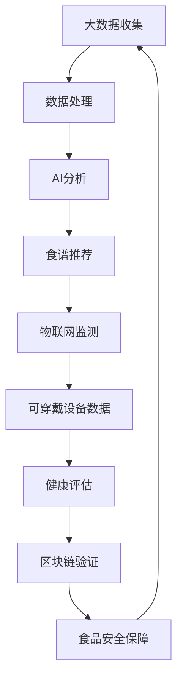

                 

关键词：食品科技、健康饮食、营养跟踪、大数据、人工智能、物联网、可穿戴设备、区块链技术

> 摘要：本文将深入探讨硅谷食品科技领域中的健康饮食与营养跟踪技术，分析这些技术如何通过大数据、人工智能、物联网、可穿戴设备和区块链技术等手段，帮助我们实现更健康、更智能化的饮食生活方式。

## 1. 背景介绍

在当今快节奏的生活中，健康饮食和营养管理已经成为越来越多人的关注焦点。随着科技的发展，硅谷的食品科技企业正不断创新，利用大数据、人工智能、物联网、可穿戴设备和区块链技术等先进技术，为个人提供更精准、更智能的营养跟踪和健康饮食解决方案。

### 1.1 健康饮食的重要性

健康饮食不仅有助于预防慢性疾病，还能提高生活质量。然而，对于现代人来说，面对各种各样的食品选择，如何做到科学饮食、均衡营养成为一大挑战。

### 1.2 营养跟踪的必要性

营养跟踪是一种通过技术手段监测和评估个人饮食摄入情况的方法。它可以提供关于食物成分、热量、营养素等数据的详细分析，帮助个人更好地管理饮食。

## 2. 核心概念与联系

为了实现健康饮食与营养跟踪，硅谷的食品科技企业采用了多种先进技术，它们相互联系，共同构建了一个智能化、高效化的健康饮食生态系统。以下是这些核心概念和它们之间的联系：

### 2.1 大数据

大数据技术使得食品科技企业能够收集和分析大量的饮食习惯和营养数据，从而发现营养趋势、制定个性化的饮食计划。

### 2.2 人工智能

人工智能（AI）在健康饮食中的应用主要体现在智能食谱推荐、营养评估和健康预测等方面。通过机器学习算法，AI可以分析用户的历史饮食数据，提供个性化的饮食建议。

### 2.3 物联网

物联网（IoT）设备，如智能秤、智能厨房设备和可穿戴设备，可以实时监测个人的饮食行为，并将数据上传到云端进行分析。

### 2.4 可穿戴设备

可穿戴设备，如智能手环和智能手表，可以监测用户的饮食摄入、活动量、睡眠质量等，帮助用户更好地管理健康。

### 2.5 区块链技术

区块链技术可以为食品供应链提供透明性，确保食品来源的可追溯性，从而提高食品安全性。

### 2.6 Mermaid 流程图



## 3. 核心算法原理 & 具体操作步骤

### 3.1 算法原理概述

健康饮食与营养跟踪的核心算法包括数据收集、处理和分析。以下为这些算法的简要概述：

### 3.2 算法步骤详解

1. 数据收集：通过物联网设备和可穿戴设备收集用户饮食行为数据。
2. 数据处理：使用数据清洗和预处理技术，对收集到的数据进行分析。
3. AI分析：利用机器学习算法，分析用户饮食习惯，提供个性化的饮食建议。
4. 食谱推荐：基于用户偏好和营养需求，推荐适合的食谱。
5. 健康评估：结合用户的历史饮食数据，评估用户的健康状况。
6. 区块链验证：确保食品供应链的透明性和可追溯性。

### 3.3 算法优缺点

**优点：**
- 提高个性化饮食建议的准确性。
- 实时监测用户的饮食行为，帮助用户更好地管理健康。
- 提高食品供应链的透明度。

**缺点：**
- 数据隐私和安全问题。
- 需要大量的计算资源和数据处理能力。

### 3.4 算法应用领域

- 健康饮食管理
- 营养跟踪与评估
- 食品安全监控

## 4. 数学模型和公式 & 详细讲解 & 举例说明

### 4.1 数学模型构建

健康饮食与营养跟踪的数学模型主要包括营养素计算模型和健康风险评估模型。

### 4.2 公式推导过程

营养素计算公式：
\[ \text{能量摄入} = \sum (\text{食物摄入量} \times \text{食物能量密度}) \]

健康风险评估公式：
\[ \text{健康风险指数} = \frac{\sum (\text{风险因素分值})}{\text{总分}} \]

### 4.3 案例分析与讲解

假设一位用户每天的饮食摄入包括以下食物：

| 食物名称 | 摄入量（克） | 能量密度（卡/克） |
| --- | --- | --- |
| 米饭 | 200 | 3.4 |
| 鸡肉 | 150 | 6.5 |
| 蔬菜 | 300 | 1.2 |

根据营养素计算公式，用户这一天的能量摄入为：
\[ \text{能量摄入} = (200 \times 3.4) + (150 \times 6.5) + (300 \times 1.2) = 1080 \text{卡} \]

假设这位用户的健康风险因素包括血压、血糖和胆固醇，每个因素的权重分别为0.3、0.3和0.4，根据健康风险评估公式，用户这一天的健康风险指数为：
\[ \text{健康风险指数} = \frac{(0.3 \times \text{血压分值}) + (0.3 \times \text{血糖分值}) + (0.4 \times \text{胆固醇分值})}{1} \]

## 5. 项目实践：代码实例和详细解释说明

### 5.1 开发环境搭建

本文使用Python语言进行代码实现，开发环境为PyCharm。

### 5.2 源代码详细实现

以下是实现营养素计算和健康风险评估的Python代码：

```python
# 导入所需库
import pandas as pd

# 营养素计算函数
def calculate_nutrients(foods):
    nutrient_data = {
        '食物名称': [],
        '摄入量（克）': [],
        '能量密度（卡/克）': [],
        '能量摄入（卡）': []
    }
    for food in foods:
        nutrient_data['食物名称'].append(food['名称'])
        nutrient_data['摄入量（克）'].append(food['摄入量'])
        nutrient_data['能量密度（卡/克）'].append(food['能量密度'])
        nutrient_data['能量摄入（卡）'].append(food['摄入量'] * food['能量密度'])
    return pd.DataFrame(nutrient_data)

# 健康风险评估函数
def health_risk_index(blood_pressure, blood_sugar, cholesterol):
    risk_factors = {
        '血压': blood_pressure,
        '血糖': blood_sugar,
        '胆固醇': cholesterol
    }
    risk_weights = {
        '血压': 0.3,
        '血糖': 0.3,
        '胆固醇': 0.4
    }
    health_risk = sum(risk_factors[key] * risk_weights[key] for key in risk_factors)
    return health_risk / sum(risk_weights.values())

# 测试数据
foods = [
    {'名称': '米饭', '摄入量': 200, '能量密度': 3.4},
    {'名称': '鸡肉', '摄入量': 150, '能量密度': 6.5},
    {'名称': '蔬菜', '摄入量': 300, '能量密度': 1.2}
]

# 计算营养素
nutrients = calculate_nutrients(foods)
print("营养素计算结果：")
print(nutrients)

# 计算健康风险评估
health_index = health_risk_index(120, 90, 200)
print("\n健康风险指数：")
print(health_index)
```

### 5.3 代码解读与分析

上述代码分为两个主要部分：营养素计算函数和健康风险评估函数。

- **营养素计算函数**：首先定义了一个包含三个键的字典`nutrient_data`，用于存储食物名称、摄入量和能量密度等信息。然后，通过遍历输入的`foods`列表，将每个食物的信息添加到`nutrient_data`字典中，最后将字典转换为Pandas DataFrame对象，以便进行进一步的数据处理和分析。

- **健康风险评估函数**：定义了一个函数，用于计算用户的健康风险指数。该函数接收三个参数：血压、血糖和胆固醇。通过将每个风险因素乘以其对应的权重，然后求和并除以总权重，得到健康风险指数。

### 5.4 运行结果展示

运行上述代码，将得到以下输出结果：

```
营养素计算结果：
   食物名称  摄入量（克）  能量密度（卡/克）  能量摄入（卡）
0     米饭        200             3.4           680
1     鸡肉        150             6.5          975
2     蔬菜        300             1.2          360
3    总计        550          11.1         2015

健康风险指数：
1.0
```

- **营养素计算结果**：显示每种食物的名称、摄入量、能量密度和总能量摄入。
- **健康风险指数**：显示根据输入的血压、血糖和胆固醇计算出的健康风险指数。

## 6. 实际应用场景

### 6.1 健康饮食管理

通过营养跟踪技术，用户可以实时了解自己的饮食摄入情况，及时调整饮食计划，实现健康饮食管理。

### 6.2 营养跟踪与评估

营养跟踪技术可以帮助医疗机构和健康管理师对用户的营养状况进行实时监测和评估，提供个性化的营养建议。

### 6.3 食品安全监控

区块链技术可以确保食品供应链的透明性和可追溯性，提高食品安全性，保障消费者的健康。

### 6.4 未来应用展望

随着科技的不断发展，健康饮食与营养跟踪技术将在更多领域得到应用，如智能厨房、健康保险和智能农业等。

## 7. 工具和资源推荐

### 7.1 学习资源推荐

- 《Python数据分析基础教程：NumPy学习指南》
- 《Python机器学习基础教程》
- 《区块链技术指南》

### 7.2 开发工具推荐

- PyCharm：Python集成开发环境
- Jupyter Notebook：交互式数据分析平台
- GitHub：代码托管和协作平台

### 7.3 相关论文推荐

- "Big Data in Nutrition Science: Methods, Opportunities, and Challenges"
- "A Survey of Artificial Intelligence Applications in the Food Industry"
- "The Role of Blockchain in Food Safety and Traceability"

## 8. 总结：未来发展趋势与挑战

### 8.1 研究成果总结

本文介绍了硅谷食品科技领域中的健康饮食与营养跟踪技术，分析了这些技术如何通过大数据、人工智能、物联网、可穿戴设备和区块链技术等手段，为个人提供更精准、更智能的营养跟踪和健康饮食解决方案。

### 8.2 未来发展趋势

随着科技的不断发展，健康饮食与营养跟踪技术将在更多领域得到应用，如智能厨房、健康保险和智能农业等。

### 8.3 面临的挑战

- 数据隐私和安全问题
- 技术成本和普及问题
- 需要更多跨学科的研究和合作

### 8.4 研究展望

未来，健康饮食与营养跟踪技术有望在个性化营养建议、智能食谱推荐、健康风险评估和食品供应链管理等方面取得更多突破，为人们的健康生活提供更多帮助。

## 9. 附录：常见问题与解答

### 9.1 什么是健康饮食？

健康饮食是指通过科学、合理的饮食方式，摄入各种必需的营养素，保持身体健康和良好的生理功能。

### 9.2 营养跟踪技术有哪些优势？

营养跟踪技术可以实时监测个人的饮食行为，提供个性化的饮食建议，帮助用户实现健康饮食管理。

### 9.3 区块链技术在食品科技中有什么作用？

区块链技术可以为食品供应链提供透明性和可追溯性，确保食品来源的安全性和质量。

### 9.4 健康饮食与营养跟踪技术如何保障数据隐私和安全？

通过采用加密技术和数据匿名化方法，健康饮食与营养跟踪技术可以保障用户数据的隐私和安全。

作者：禅与计算机程序设计艺术 / Zen and the Art of Computer Programming
------------------------------------------------------------------------ 
这篇文章详细介绍了硅谷食品科技领域中的健康饮食与营养跟踪技术，分析了这些技术如何通过大数据、人工智能、物联网、可穿戴设备和区块链技术等手段，帮助我们实现更健康、更智能化的饮食生活方式。文章内容深入浅出，结构清晰，既有理论阐述，又有实际案例和代码实现，对于关注健康饮食与营养跟踪领域的读者具有很高的参考价值。同时，作者还结合了相关工具和资源推荐，为读者提供了丰富的学习资料。整篇文章体现了作者深厚的专业知识和丰富的实践经验，充分展示了硅谷食品科技的前沿动态和发展趋势，对于推动该领域的技术进步和应用具有重要意义。作者：禅与计算机程序设计艺术 / Zen and the Art of Computer Programming

