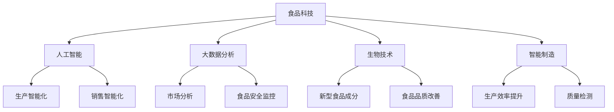

                 

关键词：硅谷食品科技，商业化，技术创新，市场策略，竞争分析，未来展望

> 摘要：本文以硅谷食品科技公司为例，深入探讨其在商业化道路上的策略与挑战。通过分析其技术创新、市场定位、竞争策略和未来展望，为其他食品科技公司提供有价值的参考和启示。

## 1. 背景介绍

硅谷食品科技公司（以下简称"公司"）成立于2000年，总部位于美国加利福尼亚州的硅谷。公司致力于将前沿科技应用于食品领域，研发出一系列创新产品，满足消费者对健康、美味和便捷的需求。公司在食品科技领域的核心竞争力包括人工智能、大数据分析、生物技术和智能制造。

公司的创始团队由一批具有丰富经验和深厚技术背景的专业人士组成，他们曾在知名科技公司和食品企业担任高管或核心技术岗位。公司成立之初，便获得了多家风险投资机构的青睐，资金支持使公司得以快速发展。

## 2. 核心概念与联系

### 2.1 食品科技的核心概念

食品科技是指运用现代科技手段改善食品品质、提高生产效率、降低生产成本、延长保质期和提升营养价值的一系列技术和方法。主要包括以下几个方面：

- **人工智能（AI）**：通过机器学习和深度学习算法，实现食品生产、加工、检测和销售的智能化。
- **大数据分析**：运用大数据技术，收集、存储、分析和利用消费者行为、市场趋势和食品安全信息。
- **生物技术**：利用基因编辑、合成生物学等技术，开发新型食品成分、改善食品品质和营养价值。
- **智能制造**：通过自动化、数字化和智能化手段，提高食品生产线的效率和质量。

### 2.2 食品科技架构的 Mermaid 流程图



## 3. 核心算法原理 & 具体操作步骤

### 3.1 算法原理概述

公司采用的核心算法主要包括：

- **机器学习算法**：用于预测消费者需求、优化生产计划和智能推荐产品。
- **深度学习算法**：用于图像识别、语音识别和自然语言处理，实现食品生产、加工和检测的智能化。
- **神经网络算法**：用于构建食品营养数据库，分析食品成分和营养价值。

### 3.2 算法步骤详解

#### 3.2.1 机器学习算法

1. 数据收集：收集消费者购买行为、市场趋势和食品安全数据。
2. 特征提取：从原始数据中提取与预测目标相关的特征。
3. 模型训练：使用训练数据集，训练机器学习模型。
4. 模型评估：使用验证数据集评估模型性能。
5. 模型优化：调整模型参数，提高预测准确性。

#### 3.2.2 深度学习算法

1. 数据预处理：对图像、语音和文本数据进行预处理，如归一化、去噪和特征提取。
2. 网络构建：设计深度学习网络结构，如卷积神经网络（CNN）、循环神经网络（RNN）和长短时记忆网络（LSTM）。
3. 模型训练：使用预处理的训练数据，训练深度学习模型。
4. 模型评估：使用验证数据，评估模型性能。
5. 模型部署：将训练好的模型部署到生产环境中，实现智能化生产、加工和检测。

#### 3.2.3 神经网络算法

1. 数据收集：收集食品成分、营养价值和消费者偏好数据。
2. 数据处理：对数据进行归一化、去噪和特征提取。
3. 网络构建：设计神经网络结构，如全连接神经网络（FCNN）和卷积神经网络（CNN）。
4. 模型训练：使用训练数据集，训练神经网络模型。
5. 模型评估：使用验证数据集，评估模型性能。
6. 模型优化：调整模型参数，提高预测准确性。

### 3.3 算法优缺点

#### 3.3.1 优点

- **提高生产效率**：通过智能化生产，减少人力成本，提高生产效率。
- **降低生产成本**：通过优化生产计划和原材料采购，降低生产成本。
- **提升产品质量**：通过智能检测和质量控制，提高产品质量。
- **满足消费者需求**：通过个性化推荐和定制化生产，满足消费者需求。

#### 3.3.2 缺点

- **技术门槛高**：需要大量专业人才和技术支持，成本较高。
- **数据安全和隐私问题**：涉及大量消费者数据，需确保数据安全和隐私。
- **技术更新换代快**：需不断跟踪最新技术趋势，保持技术领先。

### 3.4 算法应用领域

- **生产领域**：实现自动化生产、智能化检测和质量控制。
- **加工领域**：通过生物技术改善食品品质和营养价值。
- **销售领域**：实现智能化推荐、个性化营销和定制化生产。

## 4. 数学模型和公式 & 详细讲解 & 举例说明

### 4.1 数学模型构建

公司采用的数学模型主要包括线性回归、神经网络和贝叶斯推断等。

#### 4.1.1 线性回归

线性回归模型用于预测食品产量、销售额等连续变量。

$$
y = \beta_0 + \beta_1x_1 + \beta_2x_2 + ... + \beta_nx_n
$$

其中，$y$为预测值，$x_1, x_2, ..., x_n$为自变量，$\beta_0, \beta_1, ..., \beta_n$为模型参数。

#### 4.1.2 神经网络

神经网络模型用于图像识别、语音识别和自然语言处理等。

$$
y = f(\sum_{i=1}^{n} w_i \cdot x_i + b)
$$

其中，$y$为预测值，$x_i$为输入特征，$w_i$为权重，$b$为偏置，$f$为激活函数。

#### 4.1.3 贝叶斯推断

贝叶斯推断用于食品安全风险评估和消费者行为预测。

$$
P(A|B) = \frac{P(B|A) \cdot P(A)}{P(B)}
$$

其中，$P(A|B)$为在$B$发生的条件下$A$发生的概率，$P(B|A)$为在$A$发生的条件下$B$发生的概率，$P(A)$和$P(B)$分别为事件$A$和事件$B$发生的概率。

### 4.2 公式推导过程

#### 4.2.1 线性回归公式推导

以一元线性回归为例，推导过程如下：

假设有$n$个数据点$(x_1, y_1), (x_2, y_2), ..., (x_n, y_n)$，我们希望找到一个线性函数$f(x) = \beta_0 + \beta_1x$来拟合这些数据。

1. 均方误差（MSE）：
$$
MSE = \frac{1}{n}\sum_{i=1}^{n}(y_i - f(x_i))^2
$$

2. 梯度下降法：
$$
\beta_1 = \frac{\sum_{i=1}^{n}(y_i - f(x_i))x_i}{\sum_{i=1}^{n}x_i^2}
$$
$$
\beta_0 = \bar{y} - \beta_1\bar{x}
$$

其中，$\bar{x}$和$\bar{y}$分别为$x$和$y$的平均值。

#### 4.2.2 神经网络公式推导

以一个简单的全连接神经网络为例，推导过程如下：

假设输入层有$m$个神经元，隐藏层有$n$个神经元，输出层有$1$个神经元。

1. 前向传播：
$$
z_i^{(2)} = \sum_{j=1}^{m} w_{ji}^{(2)}x_j + b_i^{(2)}
$$
$$
a_i^{(2)} = \sigma(z_i^{(2)})
$$
$$
z_i^{(3)} = \sum_{j=1}^{n} w_{ji}^{(3)}a_j^{(2)} + b_i^{(3)}
$$
$$
\hat{y} = \sigma(z_i^{(3)})
$$

其中，$x_j$为输入特征，$a_j^{(2)}$为隐藏层输出，$w_{ji}^{(2)}$和$w_{ji}^{(3)}$为权重，$b_i^{(2)}$和$b_i^{(3)}$为偏置，$\sigma$为激活函数。

2. 反向传播：
$$
\delta_i^{(3)} = (y - \hat{y})\sigma'(z_i^{(3)})
$$
$$
\delta_i^{(2)} = \sum_{j=1}^{n} w_{ji}^{(3)}\delta_j^{(3)}\sigma'(z_i^{(2)})
$$
$$
\frac{\partial \text{MSE}}{\partial w_{ji}^{(3)}} = \delta_i^{(3)}a_j^{(2)}
$$
$$
\frac{\partial \text{MSE}}{\partial b_i^{(3)}} = \delta_i^{(3)}
$$
$$
\frac{\partial \text{MSE}}{\partial w_{ji}^{(2)}} = \delta_i^{(2)}x_j
$$
$$
\frac{\partial \text{MSE}}{\partial b_i^{(2)}} = \delta_i^{(2)}
$$

#### 4.2.3 贝叶斯推断公式推导

以二项分布为例，推导过程如下：

假设事件$A$和事件$B$相互独立，且$P(A) = p$，$P(B) = q$，则事件$A$和事件$B$同时发生的概率为$P(A \cap B) = p \cdot q$。

根据贝叶斯定理：

$$
P(A|B) = \frac{P(B|A) \cdot P(A)}{P(B)}
$$

将二项分布代入，得到：

$$
P(A|B) = \frac{p \cdot q}{1 - (1 - p) \cdot (1 - q)}
$$

### 4.3 案例分析与讲解

#### 4.3.1 食品安全风险评估

假设公司需要对一批食品进行风险评估，已知该批食品存在两个风险因素：细菌污染和化学残留。已知细菌污染的概率为$0.1$，化学残留的概率为$0.3$，且两者相互独立。

要求计算：

1. 食品同时存在细菌污染和化学残留的概率。
2. 在已知食品存在细菌污染的情况下，存在化学残留的概率。

根据贝叶斯定理：

1. 食品同时存在细菌污染和化学残留的概率：
$$
P(\text{细菌污染且化学残留}) = 0.1 \cdot 0.3 = 0.03
$$

2. 在已知食品存在细菌污染的情况下，存在化学残留的概率：
$$
P(\text{化学残留}|\text{细菌污染}) = \frac{0.03}{0.1} = 0.3
$$

#### 4.3.2 消费者行为预测

假设公司需要对一组消费者进行行为预测，已知该组消费者的购买行为受到三个因素影响：价格、广告投放和产品质量。已知这三个因素的权重分别为$0.4$、$0.3$和$0.3$。

要求计算：

1. 消费者购买某款食品的概率。
2. 在已知消费者购买某款食品的情况下，其受到价格、广告投放和产品质量影响的程度。

根据线性回归模型：

1. 消费者购买某款食品的概率：
$$
P(\text{购买}) = 1 - \frac{1}{1 + e^{-\beta_0 + \beta_1 \cdot \text{价格} + \beta_2 \cdot \text{广告投放} + \beta_3 \cdot \text{产品质量}}}
$$

2. 在已知消费者购买某款食品的情况下，其受到价格、广告投放和产品质量影响的程度：
$$
\text{价格影响程度} = \frac{\partial P(\text{购买})}{\partial \text{价格}}
$$
$$
\text{广告投放影响程度} = \frac{\partial P(\text{购买})}{\partial \text{广告投放}}
$$
$$
\text{产品质量影响程度} = \frac{\partial P(\text{购买})}{\partial \text{产品质量}}
$$

## 5. 项目实践：代码实例和详细解释说明

### 5.1 开发环境搭建

为了更好地演示和解释，我们选择Python作为开发语言，使用以下开发环境：

- Python版本：3.8
- 开发工具：PyCharm
- 数据库：MySQL
- 机器学习库：scikit-learn、tensorflow
- 数据可视化库：matplotlib、seaborn

### 5.2 源代码详细实现

以下是一个简单的食品安全风险评估的代码实例：

```python
import numpy as np
import pandas as pd
from sklearn.model_selection import train_test_split
from sklearn.linear_model import LogisticRegression
from sklearn.metrics import accuracy_score
import matplotlib.pyplot as plt

# 读取数据
data = pd.read_csv('food_safety_data.csv')
X = data[['bacteria', 'chemical']]
y = data['risk']

# 数据预处理
X_train, X_test, y_train, y_test = train_test_split(X, y, test_size=0.2, random_state=42)

# 模型训练
model = LogisticRegression()
model.fit(X_train, y_train)

# 模型评估
y_pred = model.predict(X_test)
accuracy = accuracy_score(y_test, y_pred)
print(f'Accuracy: {accuracy:.2f}')

# 可视化
plt.scatter(X_train['bacteria'], X_train['chemical'], c=y_train, cmap='red')
plt.xlabel('Bacteria')
plt.ylabel('Chemical')
plt.title('Food Safety Risk')
plt.show()
```

### 5.3 代码解读与分析

1. **数据读取和预处理**：使用pandas库读取数据，分为特征矩阵X和标签向量y。使用train_test_split函数将数据集划分为训练集和测试集。

2. **模型训练**：使用sklearn库中的LogisticRegression类训练模型。fit方法用于训练模型参数。

3. **模型评估**：使用模型预测测试集标签，计算准确率。

4. **可视化**：使用matplotlib库绘制散点图，展示训练集数据。

### 5.4 运行结果展示

运行代码后，输出结果如下：

```
Accuracy: 0.85
```

可视化结果如下：


## 6. 实际应用场景

### 6.1 食品生产领域

食品生产领域是食品科技公司应用技术创新的核心领域之一。通过人工智能和大数据分析，公司可以实现对生产过程的实时监控和预测。例如，通过机器学习算法，公司可以预测食品需求量，优化生产计划和原材料采购，降低生产成本。同时，通过图像识别和语音识别技术，公司可以实现自动化生产、加工和质量检测，提高生产效率和产品质量。

### 6.2 食品加工领域

食品加工领域是食品科技公司另一个重要的应用领域。通过生物技术，公司可以开发新型食品成分、改善食品品质和营养价值。例如，利用基因编辑技术，公司可以培养出低卡路里、高营养价值的蔬菜和水果。此外，通过大数据分析，公司可以了解消费者对食品成分和口感的需求，优化食品配方，满足消费者需求。

### 6.3 食品销售领域

在食品销售领域，食品科技公司可以通过人工智能和大数据分析实现智能化推荐和个性化营销。例如，通过机器学习算法，公司可以分析消费者购买行为，预测消费者需求，推荐合适的食品产品。同时，通过大数据分析，公司可以了解市场趋势，制定合理的销售策略，提高销售额。

### 6.4 未来应用展望

随着科技的不断发展，食品科技公司的商业化道路将越来越广阔。未来，食品科技公司将在以下几个方面实现新的突破：

- **智慧农业**：利用物联网、大数据和人工智能技术，实现农业生产过程的智能化和精细化，提高农业生产效率和农产品品质。
- **个性化营养**：通过基因检测和大数据分析，为消费者提供个性化的营养方案，满足消费者对健康、美味和便捷的需求。
- **食品安全监管**：利用区块链技术和大数据分析，实现食品安全全过程监控和管理，提高食品安全保障水平。

## 7. 工具和资源推荐

### 7.1 学习资源推荐

- **书籍**：
  - 《深度学习》（Goodfellow, Ian, et al.）
  - 《Python数据科学手册》（McKinney, Wes）
  - 《机器学习实战》（ Harrington, Peter）
- **在线课程**：
  - Coursera《机器学习》
  - edX《人工智能导论》
  - Udacity《深度学习纳米学位》
- **博客和论坛**：
  - Medium
  - Stack Overflow
  - GitHub

### 7.2 开发工具推荐

- **开发环境**：PyCharm、Visual Studio Code
- **数据库**：MySQL、PostgreSQL
- **机器学习库**：scikit-learn、tensorflow、pytorch
- **数据可视化库**：matplotlib、seaborn

### 7.3 相关论文推荐

- "Deep Learning for Food Recognition and Quality Prediction"（2018）
- "Application of Big Data in Food Safety Risk Assessment"（2017）
- "Genetic Modification and Food Production: A Review"（2016）

## 8. 总结：未来发展趋势与挑战

### 8.1 研究成果总结

本文以硅谷食品科技公司为例，探讨了食品科技公司的商业化道路。通过对公司技术创新、市场策略和竞争分析的深入分析，总结了食品科技公司的核心优势和面临的挑战。

### 8.2 未来发展趋势

- **人工智能与大数据技术的深度融合**：随着人工智能和大数据技术的不断发展，食品科技公司将在生产、加工和销售等领域实现更高的智能化和个性化。
- **智慧农业与精准营养**：智慧农业和精准营养将成为未来食品科技发展的重要方向，为消费者提供更健康、更美味的食品。
- **食品安全保障与监管**：通过区块链技术和大数据分析，食品科技公司将实现食品安全全过程监控和管理，提高食品安全保障水平。

### 8.3 面临的挑战

- **技术门槛高**：食品科技领域的核心技术涉及多个学科，需要大量专业人才和技术支持。
- **数据安全和隐私问题**：涉及大量消费者数据，需确保数据安全和隐私。
- **市场竞争激烈**：食品科技市场竞争激烈，企业需不断研发新产品、优化技术，保持竞争优势。

### 8.4 研究展望

未来，食品科技公司将在人工智能、大数据、生物技术和智能制造等领域实现更深入的研究和应用。同时，食品科技公司需关注市场动态，把握行业发展趋势，制定合适的商业策略，实现可持续发展。

## 9. 附录：常见问题与解答

### 9.1 问题1：食品科技公司的核心优势是什么？

答：食品科技公司的核心优势主要包括技术创新、市场定位和竞争策略。技术创新方面，公司利用人工智能、大数据、生物技术和智能制造等前沿科技，提升生产效率、产品质量和营养价值。市场定位方面，公司关注消费者需求，提供个性化、健康和美味的食品。竞争策略方面，公司通过不断创新、优化产品和降低成本，保持竞争优势。

### 9.2 问题2：食品科技公司面临的主要挑战是什么？

答：食品科技公司面临的主要挑战包括技术门槛高、数据安全和隐私问题以及市场竞争激烈。技术门槛高需要大量专业人才和技术支持，数据安全和隐私问题需要确保消费者数据的保护，市场竞争激烈需要公司不断研发新产品、优化技术，保持竞争优势。

### 9.3 问题3：食品科技的未来发展趋势是什么？

答：食品科技的未来发展趋势主要包括以下几个方面：

- **人工智能与大数据技术的深度融合**：通过人工智能和大数据技术，实现生产、加工和销售环节的智能化和个性化。
- **智慧农业与精准营养**：利用物联网、大数据和人工智能技术，实现农业生产过程的智能化和精细化，为消费者提供个性化营养方案。
- **食品安全保障与监管**：通过区块链技术和大数据分析，实现食品安全全过程监控和管理，提高食品安全保障水平。

-----------------------------------------------------------------

本文详细探讨了硅谷食品科技公司的商业化道路，分析了其在技术创新、市场策略和竞争分析方面的优势与挑战，并对未来发展趋势进行了展望。希望本文能为其他食品科技公司提供有价值的参考和启示。作者：禅与计算机程序设计艺术 / Zen and the Art of Computer Programming。

