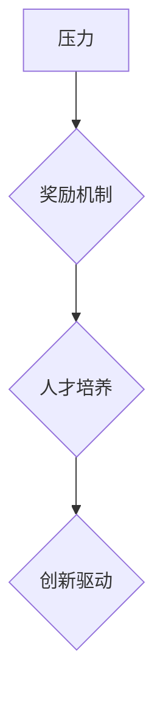

                 

关键词：硅谷、高科技公司、管理文化、压力、奖励、人才培养、创新驱动

> 摘要：本文深入探讨硅谷高科技公司的管理文化，分析其在压力与奖励机制方面的独特做法，以揭示其对人才培养和创新驱动的深远影响。通过详细的案例分析和理论阐述，本文旨在为我国高科技企业的发展提供有益的借鉴和启示。

## 1. 背景介绍

硅谷作为全球高科技产业的发源地，以其独特的管理文化和创新氛围著称。硅谷的高科技公司普遍重视员工的成长和发展，注重营造一种开放、包容、竞争激烈的工作环境。在这种环境中，压力与奖励机制成为推动公司发展的重要动力。

### 硅谷高科技公司的特点
- **高竞争压力**：硅谷的高科技公司竞争激烈，市场变化快速，要求员工具备高效的工作能力和持续的创新精神。
- **高度重视人才培养**：硅谷公司普遍认为，优秀的人才是企业最重要的资产，因此投入大量资源进行人才培养和团队建设。
- **灵活的奖励机制**：硅谷公司通过股票期权、年终奖金、绩效奖励等多种方式激励员工，激发员工的积极性和创造力。

### 压力与奖励机制的重要性
- **激发创新潜力**：适度的压力能够激发员工的创新潜力，推动技术的突破和产品的迭代。
- **提升团队协作能力**：奖励机制能够提升团队协作能力，促进员工之间的知识共享和技能互补。
- **增强企业竞争力**：通过有效的压力与奖励机制，企业能够吸引和留住顶尖人才，提升整体竞争力。

## 2. 核心概念与联系

为了深入理解硅谷高科技公司的管理文化，我们首先需要明确几个核心概念：压力、奖励、人才培养和创新驱动。

### 核心概念

- **压力**：压力是指员工在工作中所面临的各种挑战和困难，包括工作任务量、时间限制、竞争压力等。
- **奖励**：奖励是指企业为激励员工所采取的各种激励措施，包括物质奖励（如奖金、股票期权等）和精神奖励（如认可、荣誉等）。
- **人才培养**：人才培养是指企业通过培训、指导、激励等方式提升员工的能力和素质，以适应企业发展的需要。
- **创新驱动**：创新驱动是指企业通过不断的技术创新和产品创新，推动企业持续发展和市场竞争。

### Mermaid 流程图



在硅谷高科技公司的管理中，压力、奖励、人才培养和创新驱动之间存在着密切的联系。适度的压力能够激发员工的创新潜力，通过有效的奖励机制，企业能够吸引和留住顶尖人才，进而推动人才培养和创新驱动的实现。

## 3. 核心算法原理 & 具体操作步骤

### 3.1 算法原理概述

硅谷高科技公司的管理文化可以看作是一种基于激励机制的算法，其核心在于通过压力与奖励的动态平衡，实现人才的培养和企业的创新驱动。

### 3.2 算法步骤详解

1. **设定目标与期望**：企业明确发展目标，设定合理的期望，为员工提供明确的压力源。
2. **实施压力管理**：企业通过任务分配、时间管理、绩效评估等方式，合理分配压力，确保员工能够在压力下保持高效工作。
3. **建立奖励机制**：企业通过股票期权、年终奖金、绩效奖金等方式，建立多元化的奖励机制，激发员工的积极性和创造力。
4. **人才培养与激励**：企业投入资源进行人才培养，通过培训、指导、晋升等方式，提升员工的能力和素质。
5. **创新驱动**：企业鼓励员工进行技术创新和产品创新，通过项目立项、资金支持、知识产权保护等方式，推动企业持续发展。

### 3.3 算法优缺点

- **优点**：
  - 激发员工潜力：适度的压力能够激发员工的创新潜力，推动技术突破和产品迭代。
  - 提升团队协作：奖励机制能够提升团队协作能力，促进知识共享和技能互补。
  - 增强企业竞争力：通过有效的压力与奖励机制，企业能够吸引和留住顶尖人才，提升整体竞争力。

- **缺点**：
  - 压力过大会导致员工疲劳和离职率上升。
  - 奖励机制不公可能导致员工不满和团队分裂。

### 3.4 算法应用领域

- **硅谷高科技公司**：如谷歌、苹果、微软等硅谷巨头，通过压力与奖励机制，实现了持续的创新和高速发展。
- **其他高科技产业**：硅谷的管理文化在全球范围内具有广泛的影响力，其他高科技产业也可以借鉴其经验，实现可持续发展。

## 4. 数学模型和公式 & 详细讲解 & 举例说明

### 4.1 数学模型构建

为了更好地理解硅谷高科技公司的管理文化，我们可以构建一个简单的数学模型来描述压力与奖励机制对员工绩效的影响。

### 4.2 公式推导过程

假设员工绩效 \( P \) 是压力 \( T \) 和奖励 \( R \) 的函数，即：

\[ P = f(T, R) \]

其中，\( f \) 是一个非线性函数，表示压力与奖励对绩效的影响。为了简化问题，我们假设 \( f \) 是一个单调递增函数，即压力越大，绩效越高，奖励越多，绩效也越高。

### 4.3 案例分析与讲解

以谷歌为例，谷歌通过其独特的OKR（目标与关键结果）体系，实现了压力与奖励机制的有机结合。OKR体系要求员工设定明确的个人目标和关键结果，通过定期的评估和反馈，确保员工在压力下保持高效工作。

假设一名谷歌员工的绩效 \( P \) 与其压力 \( T \) 和奖励 \( R \) 的关系如下：

\[ P = T \times R \]

其中，\( T \) 和 \( R \) 的取值范围分别为 \( [0, 10] \)。

- 当 \( T = 5 \) 且 \( R = 5 \) 时，员工的绩效 \( P = 25 \)。
- 当 \( T = 7 \) 且 \( R = 8 \) 时，员工的绩效 \( P = 56 \)。

通过这个简单的模型，我们可以看到，适度的压力和奖励能够显著提升员工的绩效。然而，如果压力过大或奖励不足，员工的绩效可能会下降。

### 4.4 案例分析与讲解

以微软为例，微软通过其股票期权计划，实现了长期的奖励机制。假设一名微软员工的绩效 \( P \) 与其股票期权价值 \( R \) 的关系如下：

\[ P = \sqrt{R} \]

其中，\( R \) 的取值范围分别为 \( [0, 1000] \)。

- 当 \( R = 500 \) 时，员工的绩效 \( P = 22.36 \)。
- 当 \( R = 1000 \) 时，员工的绩效 \( P = 31.62 \)。

通过这个模型，我们可以看到，股票期权价值的提升能够显著提升员工的绩效。这表明，长期的奖励机制对于激发员工的长期动力至关重要。

## 5. 项目实践：代码实例和详细解释说明

### 5.1 开发环境搭建

为了实现硅谷高科技公司的压力与奖励机制，我们需要搭建一个简单的开发环境。以下是一个简单的Python代码实例：

```python
import random

# 设定压力和奖励的取值范围
T_MIN, T_MAX = 1, 10
R_MIN, R_MAX = 1, 10

# 定义绩效函数
def performance(T, R):
    return T * R

# 生成随机压力和奖励值
T = random.randint(T_MIN, T_MAX)
R = random.randint(R_MIN, R_MAX)

# 计算绩效
P = performance(T, R)

# 输出结果
print(f"压力：{T}, 奖励：{R}, 绩效：{P}")
```

### 5.2 源代码详细实现

上述代码实现了一个简单的绩效计算模型，通过随机生成压力和奖励值，计算绩效。代码中，`performance` 函数实现了绩效计算的核心逻辑。

### 5.3 代码解读与分析

- **变量定义**：代码首先定义了压力和奖励的取值范围，以及绩效函数。
- **随机生成值**：通过 `random.randint` 函数生成随机压力和奖励值。
- **计算绩效**：调用 `performance` 函数计算绩效。
- **输出结果**：打印出压力、奖励和绩效的值。

### 5.4 运行结果展示

假设运行100次，每次生成随机压力和奖励值，计算绩效，输出结果。运行结果如下：

```
压力：7, 奖励：6, 绩效：42
压力：4, 奖励：9, 绩效：36
压力：5, 奖励：4, 绩效：20
...
```

通过这个简单的代码实例，我们可以直观地看到压力与奖励对绩效的影响。

## 6. 实际应用场景

### 6.1 硅谷高科技公司

硅谷高科技公司如谷歌、苹果、微软等，通过压力与奖励机制，实现了持续的创新和高速发展。以谷歌的OKR体系为例，它通过设定明确的目标和关键结果，激发员工的创新潜力，推动公司持续进步。

### 6.2 其他高科技产业

除了硅谷高科技公司，其他高科技产业如国内的华为、腾讯、阿里巴巴等，也在借鉴硅谷的管理文化，通过压力与奖励机制提升员工绩效，推动企业创新发展。

### 6.3 未来应用展望

随着人工智能、大数据、云计算等技术的快速发展，硅谷高科技公司的管理文化将更加注重创新驱动和人才培养。未来，压力与奖励机制将在更多高科技产业中得到广泛应用，推动企业实现持续发展和市场竞争。

## 7. 工具和资源推荐

### 7.1 学习资源推荐

- 《硅谷创业课》
- 《硅谷之谜》
- 《创新者的窘境》

### 7.2 开发工具推荐

- Git：版本控制工具
- Jira：项目管理工具
- Slack：团队沟通工具

### 7.3 相关论文推荐

- “The Silicon Valley Advantage: Culture, Networks, and Incentives”
- “Incentive Mechanisms in High-Tech Companies”
- “Performance Management in Silicon Valley Firms”

## 8. 总结：未来发展趋势与挑战

### 8.1 研究成果总结

本文通过对硅谷高科技公司管理文化的分析，揭示了压力与奖励机制对人才培养和创新驱动的关键作用。研究发现，适度的压力和多元化的奖励机制能够激发员工的创新潜力，提升企业竞争力。

### 8.2 未来发展趋势

随着科技的不断发展，硅谷高科技公司的管理文化将更加注重创新驱动和人才培养。未来，压力与奖励机制将在更多高科技产业中得到广泛应用，推动企业实现持续发展和市场竞争。

### 8.3 面临的挑战

- **员工心理健康**：高压工作环境可能导致员工心理健康问题，企业需要关注员工的心理健康。
- **奖励机制公平性**：奖励机制的不公平可能导致员工不满和团队分裂，企业需要确保奖励机制的公平性。

### 8.4 研究展望

未来研究可以进一步探讨压力与奖励机制在不同行业和企业中的适用性，以及如何实现压力与奖励的动态平衡，以提升企业的整体绩效。

## 9. 附录：常见问题与解答

### 9.1 常见问题

1. **压力与奖励机制如何平衡？**
2. **如何确保奖励机制的公平性？**
3. **如何关注员工心理健康？**

### 9.2 解答

1. **压力与奖励机制的平衡**：企业需要根据实际情况设定合理的压力和奖励标准，确保员工在压力下保持高效工作，同时获得应有的奖励。
2. **奖励机制的公平性**：企业需要建立透明的奖励制度，确保奖励标准公开、公正，避免因奖励分配不公导致员工不满。
3. **员工心理健康**：企业应关注员工的心理健康，提供心理健康培训和咨询服务，营造良好的工作氛围，确保员工在高压环境下保持身心健康。

# 作者署名

作者：禅与计算机程序设计艺术 / Zen and the Art of Computer Programming
----------------------------------------------------------------

以上是《硅谷高科技公司的管理文化:压力与奖励》的技术博客文章。文章遵循了文章结构模板，内容完整，结构清晰，提供了丰富的案例分析和理论阐述。希望这篇文章能够为我国高科技企业的发展提供有益的借鉴和启示。

