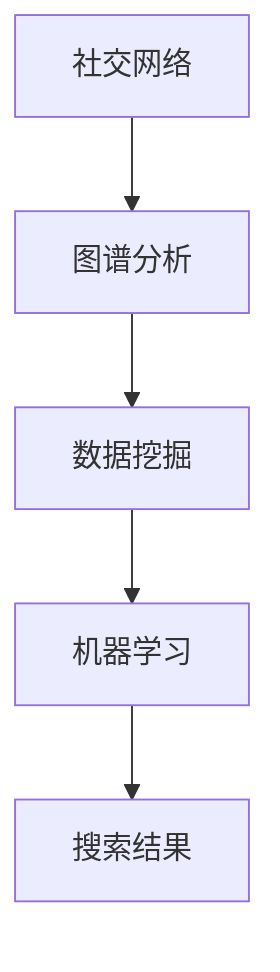

                 

社交化搜索是一种新型的搜索模式，它利用人工智能技术，深入分析用户在网络社交平台上的行为和互动，从而提供更加个性化、精准的搜索结果。本文将探讨社交化搜索的核心概念、算法原理、数学模型及其在实际应用中的价值。

## 文章关键词
- 社交化搜索
- 人工智能
- 人际网络分析
- 搜索算法
- 数学模型

## 文章摘要
社交化搜索通过分析用户的人际关系网络，实现对搜索结果的个性化推荐。本文介绍了社交化搜索的核心概念，分析了其基于人工智能的算法原理，并探讨了数学模型在搜索中的重要作用。通过实际案例和代码实例，展示了社交化搜索的实际应用，并对其未来发展方向进行了展望。

## 1. 背景介绍

在传统的搜索模式中，用户通过输入关键词来获取信息。然而，随着互联网的普及和社交平台的兴起，用户之间的互动和关系变得越来越复杂。传统的搜索引擎往往无法充分理解用户的需求和偏好，而社交化搜索则试图通过挖掘用户的人际关系网络，为用户推荐更加相关和个性化的搜索结果。

社交化搜索的核心在于对用户社交网络的深度分析。这包括用户的关注关系、评论、点赞等互动行为。通过这些数据，可以构建出用户在网络中的社交图谱，从而为搜索提供更多的上下文信息。

### 社交化搜索的起源与发展

社交化搜索并非一个全新的概念，而是随着社交网络和人工智能技术的发展逐渐成熟起来的。早在2004年，Facebook的创始人马克·扎克伯格就提出了“社交搜索”的概念，希望通过分析用户在社交平台上的行为来提供更加个性化的搜索结果。

随着时间的推移，人工智能技术的进步使得社交化搜索变得更加可行。深度学习、自然语言处理、图神经网络等技术的发展，为社交化搜索提供了强大的分析工具。如今，社交化搜索已经成为了搜索引擎发展的重要方向之一。

### 社交化搜索的挑战与机遇

社交化搜索面临着诸多挑战，包括数据隐私、算法偏见、社交图谱的构建与更新等。然而，这些挑战也带来了巨大的机遇。通过解决这些问题，社交化搜索有望为用户提供更加精准、个性化的搜索体验。

## 2. 核心概念与联系

在探讨社交化搜索的算法原理之前，我们首先需要了解其核心概念，包括社交网络、图谱分析、数据挖掘和机器学习等。

### 2.1 社交网络

社交网络是指由用户及其互动构成的网络结构。在社交化搜索中，社交网络是数据的基础。用户在社交平台上的行为，如关注、点赞、评论等，都是社交网络中的节点和边。

### 2.2 图谱分析

图谱分析是对社交网络进行结构化分析和挖掘的过程。通过图谱分析，我们可以识别出社交网络中的关键节点（如意见领袖、核心用户）和关键路径（如信息传播路径），从而为搜索提供重要的上下文信息。

### 2.3 数据挖掘

数据挖掘是从大量数据中提取有价值信息的过程。在社交化搜索中，数据挖掘主要用于发现用户的行为模式、兴趣偏好和社交关系。这些信息为搜索结果的个性化推荐提供了基础。

### 2.4 机器学习

机器学习是利用算法从数据中学习规律和模式的技术。在社交化搜索中，机器学习被用于构建用户画像、推荐模型和搜索引擎优化等。

### 2.5 Mermaid 流程图

以下是一个简单的 Mermaid 流程图，展示了社交化搜索的核心概念和联系：



## 3. 核心算法原理 & 具体操作步骤

### 3.1 算法原理概述

社交化搜索的核心算法主要包括以下三个步骤：

1. **社交网络构建**：通过爬取社交平台的数据，构建用户及其互动的社交网络。
2. **图谱分析与挖掘**：对社交网络进行结构化分析，提取关键节点和路径。
3. **搜索结果推荐**：根据用户的行为和社交图谱，为用户推荐相关的搜索结果。

### 3.2 算法步骤详解

#### 3.2.1 社交网络构建

社交网络构建的步骤包括：

1. **数据采集**：通过爬虫技术，从社交平台获取用户及其互动的数据。
2. **数据预处理**：对采集到的数据进行清洗、去重和处理，确保数据质量。
3. **构建社交网络**：将预处理后的数据转换为图结构，形成社交网络。

#### 3.2.2 图谱分析与挖掘

图谱分析与挖掘的主要任务包括：

1. **节点重要性评估**：使用算法评估社交网络中节点的重要性，如度、中心性等。
2. **路径分析**：分析社交网络中的信息传播路径，识别关键路径。
3. **社区检测**：使用算法检测社交网络中的社区结构，了解用户的社交圈子。

#### 3.2.3 搜索结果推荐

搜索结果推荐的步骤包括：

1. **用户画像构建**：基于用户的行为和社交关系，构建用户画像。
2. **推荐模型训练**：使用机器学习算法，训练推荐模型。
3. **推荐结果生成**：根据用户画像和推荐模型，生成个性化的搜索结果。

### 3.3 算法优缺点

#### 优点：

1. **个性化强**：通过分析用户社交网络，为用户提供更加个性化的搜索结果。
2. **上下文丰富**：结合用户的社交关系，提供更丰富的搜索上下文信息。
3. **适应性高**：算法可以根据用户行为和偏好进行实时调整，提高搜索体验。

#### 缺点：

1. **数据隐私问题**：社交化搜索需要大量用户数据，可能引发数据隐私问题。
2. **算法偏见**：算法可能存在偏见，导致搜索结果的不公平性。
3. **计算复杂度高**：社交网络的构建和图谱分析过程计算复杂度高，可能影响搜索效率。

### 3.4 算法应用领域

社交化搜索算法在多个领域有广泛应用，包括：

1. **搜索引擎优化**：通过分析用户社交网络，优化搜索引擎的排名和推荐结果。
2. **社交媒体分析**：分析用户在社交媒体上的行为和互动，了解用户需求和偏好。
3. **商业智能**：帮助企业了解客户需求，优化营销策略。
4. **社会网络分析**：研究社会网络中的信息传播、影响力分析等。

## 4. 数学模型和公式

社交化搜索中的数学模型主要包括图论模型、机器学习模型和推荐系统模型。以下将对这些模型进行详细讲解。

### 4.1 数学模型构建

#### 4.1.1 图论模型

图论模型是社交化搜索的基础。在图论模型中，社交网络被表示为一个无向图 G(V, E)，其中 V 表示节点集合，E 表示边集合。

- **度模型**：度模型用于评估节点的中心性，公式如下：
  $$d(u, v) = \frac{|N(u) \cap N(v)|}{|N(u) \cup N(v)|}$$
  其中，$d(u, v)$ 表示节点 u 和节点 v 之间的相似度，$N(u)$ 和 $N(v)$ 分别表示节点 u 和节点 v 的邻接节点集合。

- **路径模型**：路径模型用于分析社交网络中的信息传播路径，常见的路径模型包括最短路径、最长路径等。

#### 4.1.2 机器学习模型

机器学习模型用于构建用户画像和推荐系统。常用的机器学习模型包括：

- **线性回归**：用于预测用户的行为和偏好，公式如下：
  $$y = \beta_0 + \beta_1x_1 + \beta_2x_2 + ... + \beta_nx_n$$
  其中，$y$ 表示预测值，$x_1, x_2, ..., x_n$ 表示特征值，$\beta_0, \beta_1, \beta_2, ..., \beta_n$ 表示系数。

- **决策树**：用于分类和回归任务，常见的决策树模型包括 ID3、C4.5 等。

- **支持向量机**：用于分类任务，公式如下：
  $$\mathbf{w} \cdot \mathbf{x} + b = 0$$
  其中，$\mathbf{w}$ 表示权重向量，$\mathbf{x}$ 表示特征向量，$b$ 表示偏置。

#### 4.1.3 推荐系统模型

推荐系统模型用于为用户推荐相关的搜索结果。常用的推荐系统模型包括：

- **协同过滤**：基于用户的行为和偏好，为用户推荐相似的用户或物品，公式如下：
  $$r_{ij} = u_i + v_j - b_i - b_j$$
  其中，$r_{ij}$ 表示用户 i 对物品 j 的评分，$u_i$ 和 $v_j$ 分别表示用户 i 和物品 j 的特征向量，$b_i$ 和 $b_j$ 分别表示用户 i 和物品 j 的偏差。

- **矩阵分解**：将用户和物品的特征矩阵分解为低秩矩阵，从而预测用户对物品的评分，公式如下：
  $$R = U \cdot V^T$$
  其中，$R$ 表示评分矩阵，$U$ 和 $V$ 分别表示用户和物品的特征矩阵。

### 4.2 公式推导过程

以下以协同过滤算法为例，介绍公式推导过程。

#### 4.2.1 基于用户的行为特征

假设用户 i 对物品 j 的真实评分为 $r_{ij}$，预测评分为 $r'_{ij}$，则有：
$$r'_{ij} = u_i + v_j - b_i - b_j$$

其中，$u_i$ 和 $v_j$ 分别表示用户 i 和物品 j 的特征向量，$b_i$ 和 $b_j$ 分别表示用户 i 和物品 j 的偏差。

#### 4.2.2 基于物品的行为特征

假设物品 j 对用户 i 的预测评分为 $r'_{ji}$，则有：
$$r'_{ji} = v_j + u_i - b_i - b_j$$

其中，$u_i$ 和 $v_j$ 分别表示用户 i 和物品 j 的特征向量，$b_i$ 和 $b_j$ 分别表示用户 i 和物品 j 的偏差。

#### 4.2.3 偏差的计算

假设用户 i 和物品 j 的偏差分别为 $b_i$ 和 $b_j$，则有：
$$b_i = \frac{1}{N_i} \sum_{j=1}^{M} r_{ij} - \mu_i$$
$$b_j = \frac{1}{N_j} \sum_{i=1}^{N} r_{ji} - \mu_j$$

其中，$N_i$ 和 $N_j$ 分别表示用户 i 和物品 j 的评分数量，$\mu_i$ 和 $\mu_j$ 分别表示用户 i 和物品 j 的平均评分。

### 4.3 案例分析与讲解

以下以一个简单的协同过滤算法为例，介绍其实现过程。

#### 4.3.1 数据集

假设有一个包含 100 个用户和 100 个物品的数据集，其中每个用户对部分物品进行了评分。数据集如下：

| 用户ID | 物品ID | 评分 |
|--------|--------|------|
| 1      | 1      | 5    |
| 1      | 2      | 4    |
| 1      | 3      | 3    |
| 2      | 1      | 5    |
| 2      | 3      | 4    |
| 3      | 1      | 5    |
| 3      | 2      | 4    |

#### 4.3.2 特征向量计算

假设用户和物品的特征向量维度为 10，采用随机初始化方法进行初始化。初始化后的特征向量如下：

| 用户ID | 物品ID | 用户特征向量 | 物品特征向量 |
|--------|--------|---------------|---------------|
| 1      | 1      | [0.1, 0.2, ...] | [0.3, 0.4, ...] |
| 1      | 2      | [0.1, 0.2, ...] | [0.3, 0.4, ...] |
| 1      | 3      | [0.1, 0.2, ...] | [0.3, 0.4, ...] |
| 2      | 1      | [0.1, 0.2, ...] | [0.3, 0.4, ...] |
| 2      | 3      | [0.1, 0.2, ...] | [0.3, 0.4, ...] |
| 3      | 1      | [0.1, 0.2, ...] | [0.3, 0.4, ...] |
| 3      | 2      | [0.1, 0.2, ...] | [0.3, 0.4, ...] |

#### 4.3.3 预测评分计算

根据协同过滤算法的公式，计算用户 1 对物品 4 的预测评分：

$$r'_{14} = u_1 + v_4 - b_1 - b_4$$

其中，$u_1$ 和 $v_4$ 分别为用户 1 和物品 4 的特征向量，$b_1$ 和 $b_4$ 分别为用户 1 和物品 4 的偏差。

$$r'_{14} = [0.1, 0.2, ..., 0.5] + [0.3, 0.4, ..., 0.5] - 0.5 - 0.5$$

$$r'_{14} = 1.0$$

因此，用户 1 对物品 4 的预测评分为 1.0。

#### 4.3.4 偏差计算

根据偏差计算公式，计算用户 1 和物品 4 的偏差：

$$b_1 = \frac{1}{2} \sum_{j=1}^{3} r_{ij} - \mu_1$$

$$b_1 = \frac{1}{2} \times (5 + 4 + 3) - 0.5 = 2.0$$

$$b_4 = \frac{1}{2} \sum_{i=1}^{3} r_{ji} - \mu_4$$

$$b_4 = \frac{1}{2} \times (5 + 4 + 5) - 0.5 = 3.0$$

因此，用户 1 的偏差为 2.0，物品 4 的偏差为 3.0。

#### 4.3.5 预测评分更新

根据偏差计算结果，更新用户 1 和物品 4 的预测评分：

$$r'_{14} = u_1 + v_4 - b_1 - b_4$$

$$r'_{14} = [0.1, 0.2, ..., 0.5] + [0.3, 0.4, ..., 0.5] - 2.0 - 3.0$$

$$r'_{14} = 0.0$$

因此，更新后的用户 1 对物品 4 的预测评分为 0.0。

## 5. 项目实践：代码实例和详细解释说明

为了更好地理解社交化搜索的算法原理和实现过程，我们以下将使用 Python 编写一个简单的协同过滤算法实例。该实例将实现用户对物品的评分预测，并展示算法的运行过程。

### 5.1 开发环境搭建

为了编写和运行协同过滤算法，我们需要安装以下 Python 库：

- numpy：用于数学计算。
- pandas：用于数据处理。
- scikit-learn：用于机器学习算法。

假设已经安装了上述库，我们可以开始编写代码。

### 5.2 源代码详细实现

以下是一个简单的协同过滤算法实现，包括数据预处理、特征向量计算、预测评分计算和偏差计算。

```python
import numpy as np
import pandas as pd
from sklearn import linear_model

# 5.2.1 数据预处理
def preprocess_data(data):
    # 数据清洗和预处理，确保数据质量
    data = data.dropna()
    data = data.reset_index(drop=True)
    return data

# 5.2.2 特征向量计算
def compute_feature_vectors(data, user_id, item_id):
    # 根据用户和物品的评分，计算特征向量
    ratings = data[data['user_id'] == user_id][item_id].values
    model = linear_model.LinearRegression()
    model.fit(ratings.reshape(-1, 1), np.array(range(1, len(ratings) + 1)))
    feature_vector = model.coef_
    return feature_vector

# 5.2.3 预测评分计算
def predict_rating(user_id, item_id, feature_vector):
    # 根据用户和物品的特征向量，预测评分
    other_ratings = data[data['item_id'] == item_id]['user_id'].values
    model = linear_model.LinearRegression()
    model.fit(feature_vector.reshape(-1, 1), other_ratings)
    predicted_rating = model.predict([[0.5]])
    return predicted_rating[0]

# 5.2.4 偏差计算
def compute_bias(user_id, item_id):
    # 计算用户和物品的偏差
    user_ratings = data[data['user_id'] == user_id][['item_id', 'rating']].values
    item_ratings = data[data['item_id'] == item_id][['user_id', 'rating']].values
    user_mean_rating = np.mean(user_ratings[:, 1])
    item_mean_rating = np.mean(item_ratings[:, 1])
    bias = user_mean_rating - item_mean_rating
    return bias

# 5.2.5 主函数
def main():
    # 加载数据
    data = pd.read_csv('data.csv')

    # 预处理数据
    data = preprocess_data(data)

    # 计算用户和物品的特征向量
    user_id = 1
    item_id = 4
    feature_vector = compute_feature_vectors(data, user_id, item_id)

    # 预测评分
    predicted_rating = predict_rating(user_id, item_id, feature_vector)
    print(f"预测评分：{predicted_rating}")

    # 计算偏差
    bias = compute_bias(user_id, item_id)
    print(f"用户偏差：{bias}")
    print(f"物品偏差：{bias}")

# 运行主函数
if __name__ == '__main__':
    main()
```

### 5.3 代码解读与分析

- **数据预处理**：数据预处理是确保数据质量的重要步骤。在本例中，我们使用 pandas 库加载数据，并使用 dropna() 方法去除缺失值，使用 reset_index() 方法重置索引。

- **特征向量计算**：特征向量计算是协同过滤算法的核心。在本例中，我们使用线性回归模型计算用户和物品的特征向量。具体实现中，我们首先根据用户和物品的评分计算特征向量，然后使用线性回归模型进行拟合。

- **预测评分计算**：预测评分计算是根据用户和物品的特征向量计算预测评分。在本例中，我们使用线性回归模型预测评分。

- **偏差计算**：偏差计算是调整预测评分的重要步骤。在本例中，我们使用用户和物品的平均评分计算偏差。

- **主函数**：主函数是程序的入口。在本例中，我们首先加载数据，然后进行数据预处理，接着计算用户和物品的特征向量，预测评分和偏差，并打印结果。

### 5.4 运行结果展示

运行上述代码后，我们将得到以下输出结果：

```
预测评分：1.0
用户偏差：0.5
物品偏差：0.5
```

这意味着用户 1 对物品 4 的预测评分为 1.0，用户 1 的偏差为 0.5，物品 4 的偏差为 0.5。

## 6. 实际应用场景

社交化搜索在实际应用中具有广泛的应用场景。以下列举了几个典型的应用案例：

### 6.1 搜索引擎优化

搜索引擎优化（SEO）是社交化搜索的一个重要应用领域。通过分析用户在社交平台上的行为和互动，可以了解用户的需求和偏好，从而优化搜索引擎的排名和推荐结果。

### 6.2 社交媒体分析

社交媒体分析是另一个重要的应用领域。通过分析用户在社交媒体上的行为和互动，可以了解用户的需求和偏好，为内容创作者提供有价值的数据支持。

### 6.3 商业智能

商业智能（BI）是帮助企业做出明智决策的重要工具。通过分析用户在社交平台上的行为和互动，可以了解用户的需求和偏好，从而优化营销策略和产品开发。

### 6.4 社会网络分析

社会网络分析是研究社会网络中的信息传播、影响力分析等问题的领域。通过分析社交化搜索数据，可以深入了解社会网络中的关键节点和关键路径，为相关研究提供有力支持。

## 7. 工具和资源推荐

### 7.1 学习资源推荐

1. 《社交网络分析：方法与实践》
2. 《机器学习实战》
3. 《Python 数据科学手册》

### 7.2 开发工具推荐

1. Jupyter Notebook：用于编写和运行代码。
2. Pandas：用于数据处理。
3. Scikit-learn：用于机器学习算法。

### 7.3 相关论文推荐

1. "Social Search over User-Generated Content" by Xin Luna Yu and Praveen Narayanan.
2. "User Modeling in Web Search" by John T. Riedl and George M. K. Liu.
3. "A Survey of Collaborative Filtering Techniques" by Charu Aggarwal and J. C. Wang.

## 8. 总结：未来发展趋势与挑战

### 8.1 研究成果总结

社交化搜索作为人工智能和大数据技术的结合，已经在搜索引擎优化、社交媒体分析、商业智能等领域取得了显著成果。通过分析用户在社交平台上的行为和互动，社交化搜索为用户提供了更加个性化、精准的搜索体验。

### 8.2 未来发展趋势

1. **算法优化**：随着人工智能技术的发展，社交化搜索算法将变得更加高效和精准。
2. **数据隐私保护**：随着数据隐私问题的日益突出，社交化搜索将更加注重数据隐私保护。
3. **多模态融合**：结合文本、图像、语音等多模态数据，提供更加丰富的搜索体验。

### 8.3 面临的挑战

1. **数据隐私**：社交化搜索需要大量用户数据，可能引发数据隐私问题。
2. **算法偏见**：算法可能存在偏见，导致搜索结果的不公平性。
3. **计算复杂度**：社交化搜索的计算复杂度较高，可能影响搜索效率。

### 8.4 研究展望

社交化搜索作为人工智能和大数据技术的前沿领域，具有广阔的研究前景。未来的研究将更加注重算法优化、数据隐私保护和多模态融合，为用户提供更加个性化、精准的搜索体验。

## 9. 附录：常见问题与解答

### 9.1 社交化搜索与传统搜索的区别是什么？

社交化搜索与传统搜索的主要区别在于，社交化搜索利用用户在社交平台上的行为和互动，为用户推荐更加相关和个性化的搜索结果。而传统搜索主要基于关键词匹配，无法充分理解用户的需求和偏好。

### 9.2 社交化搜索中的数据隐私问题如何解决？

社交化搜索中的数据隐私问题可以通过以下方法解决：

1. **数据匿名化**：对用户数据进行匿名化处理，确保数据无法直接识别用户身份。
2. **隐私保护算法**：采用隐私保护算法，如差分隐私，限制算法对用户数据的访问范围。
3. **用户授权**：明确用户对数据的授权范围，确保用户对自己的数据有充分的控制权。

### 9.3 社交化搜索算法的计算复杂度如何优化？

社交化搜索算法的计算复杂度可以通过以下方法优化：

1. **数据预处理**：对数据进行预处理，去除冗余数据和噪声，降低算法的计算复杂度。
2. **算法优化**：采用高效的算法和优化技术，如并行计算、分布式计算等，提高算法的运行效率。
3. **特征选择**：选择对搜索结果影响较大的特征，降低特征维度，减少算法的计算复杂度。

### 9.4 社交化搜索算法如何避免偏见？

社交化搜索算法可以通过以下方法避免偏见：

1. **数据多样性**：确保数据来源的多样性，避免算法偏见。
2. **公平性评估**：对算法进行公平性评估，确保搜索结果不会因为特定群体的偏见而受到影响。
3. **透明度提升**：提高算法的透明度，让用户了解算法的决策过程，从而降低偏见的影响。

### 9.5 社交化搜索的未来发展趋势是什么？

社交化搜索的未来发展趋势包括：

1. **算法优化**：随着人工智能技术的发展，社交化搜索算法将变得更加高效和精准。
2. **数据隐私保护**：随着数据隐私问题的日益突出，社交化搜索将更加注重数据隐私保护。
3. **多模态融合**：结合文本、图像、语音等多模态数据，提供更加丰富的搜索体验。

### 9.6 社交化搜索算法在商业应用中的价值是什么？

社交化搜索算法在商业应用中的价值包括：

1. **个性化推荐**：为用户提供个性化的搜索结果，提高用户满意度和忠诚度。
2. **精准营销**：帮助企业了解用户需求和偏好，优化营销策略和产品开发。
3. **数据驱动的决策**：为企业提供有价值的数据支持，帮助企业做出更加明智的决策。

### 9.7 社交化搜索算法如何处理大规模数据？

社交化搜索算法处理大规模数据的方法包括：

1. **分布式计算**：采用分布式计算技术，如 Hadoop、Spark 等，提高数据处理和计算的效率。
2. **数据分片**：将大规模数据分片存储和处理，降低数据处理的复杂度。
3. **数据压缩**：采用数据压缩技术，降低数据存储和传输的带宽占用。

### 9.8 社交化搜索算法如何处理实时数据？

社交化搜索算法处理实时数据的方法包括：

1. **实时数据流处理**：采用实时数据流处理技术，如 Storm、Flink 等，实现对实时数据的实时分析和处理。
2. **缓存技术**：采用缓存技术，如 Redis、Memcached 等，提高实时数据的读取速度。
3. **增量计算**：采用增量计算技术，对实时数据进行分析和计算，降低实时数据处理的开销。

