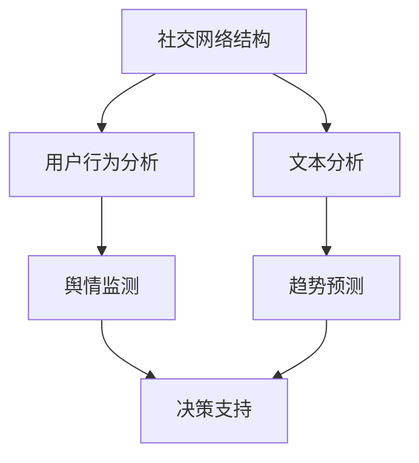

                 

社交媒体已经成为我们日常生活中不可或缺的一部分。从Facebook、Twitter到微信、微博，人们在这些平台上分享信息、交流观点，形成了庞大的社交媒体网络。这种网络不仅为我们提供了丰富的信息资源，同时也为舆情监测与趋势预测提供了丰富的数据基础。本文将深入探讨社交媒体分析在舆情监测与趋势预测中的应用，包括核心概念、算法原理、数学模型、项目实践、应用场景以及未来展望等内容。

## 关键词

- 社交媒体分析
- 舆情监测
- 趋势预测
- 数据挖掘
- 自然语言处理

## 摘要

本文首先介绍了社交媒体分析的重要性以及其在舆情监测与趋势预测中的关键作用。接着，详细阐述了社交媒体分析的核心概念，包括网络结构、用户行为、文本分析等。随后，本文深入探讨了舆情监测与趋势预测的核心算法原理，包括社交网络分析、文本分类、主题模型等。在此基础上，本文通过一个实际项目实例，展示了如何运用这些算法进行舆情监测与趋势预测。最后，本文对社交媒体分析在实际应用场景中的表现进行了分析，并探讨了其未来的发展趋势与挑战。

## 1. 背景介绍

随着互联网的快速发展，社交媒体已经深刻地改变了我们的生活方式。人们在社交媒体上分享自己的生活、工作、观点等信息，这些信息不仅丰富了我们的日常生活，同时也为舆情监测与趋势预测提供了丰富的数据资源。舆情监测是指通过收集、分析和处理社交媒体上的信息，实时了解公众对于某个事件、产品或政策的看法和态度。而趋势预测则是通过分析历史数据，预测未来的发展趋势。

社交媒体分析在舆情监测与趋势预测中起着至关重要的作用。首先，社交媒体上的信息量大且实时性强，通过数据挖掘技术，可以快速、准确地获取公众对于某个事件的看法和态度。其次，社交媒体分析可以帮助我们识别出潜在的舆情热点，提前预测可能引发的社会事件。最后，社交媒体分析还可以为我们提供决策支持，帮助企业或政府制定更加有效的政策和策略。

### 1.1 社交媒体分析的重要性

社交媒体分析的重要性体现在多个方面。首先，它可以帮助我们更好地了解公众的需求和期望。通过分析社交媒体上的评论、点赞和转发等数据，我们可以了解公众对于某个产品、服务或政策的看法，从而为企业或政府提供决策依据。

其次，社交媒体分析可以帮助我们监测舆情动态。在现代社会，舆论的力量不容忽视。通过分析社交媒体上的信息，我们可以及时发现可能引发的社会事件，提前采取应对措施，避免事态恶化。

最后，社交媒体分析还可以帮助我们预测未来的发展趋势。通过对历史数据的分析，我们可以发现潜在的趋势和规律，为企业或政府制定长远的发展策略提供支持。

### 1.2 社交媒体分析在舆情监测与趋势预测中的关键作用

社交媒体分析在舆情监测与趋势预测中具有以下几个关键作用：

1. **信息收集与处理**：社交媒体分析可以帮助我们收集大量的数据，包括文本、图片、视频等，通过对这些数据的处理，我们可以提取出有价值的信息。

2. **实时监测舆情动态**：通过实时分析社交媒体上的信息，我们可以及时发现舆情热点，了解公众的态度和看法，从而及时采取应对措施。

3. **预测未来发展趋势**：通过对历史数据的分析，我们可以发现潜在的趋势和规律，预测未来的发展趋势，为企业或政府提供决策支持。

4. **支持决策制定**：基于社交媒体分析的结果，我们可以为企业或政府制定更加科学、有效的决策，提高决策的准确性和效率。

## 2. 核心概念与联系

### 2.1 社交网络结构

社交网络结构是社交媒体分析的基础。社交网络由节点（用户）和边（关系）组成。每个节点代表一个用户，边表示节点之间的互动关系，如关注、点赞、评论等。社交网络结构可以分为多种类型，如无向图、有向图、加权图等。

### 2.2 用户行为分析

用户行为分析是社交媒体分析的核心之一。通过分析用户的行为数据，如发布内容、点赞、评论、转发等，我们可以了解用户的兴趣、态度和行为习惯。用户行为分析可以帮助我们识别出潜在的用户群体，提高营销和服务的精准度。

### 2.3 文本分析

文本分析是社交媒体分析的重要组成部分。通过自然语言处理技术，我们可以对社交媒体上的文本进行语义分析、情感分析和主题分析等。文本分析可以帮助我们理解用户的需求和意见，发现潜在的热点和趋势。

### 2.4 Mermaid 流程图

下面是一个简单的Mermaid流程图，展示了社交媒体分析的核心概念及其联系：



## 3. 核心算法原理 & 具体操作步骤

### 3.1 算法原理概述

社交媒体分析的核心算法主要包括社交网络分析、文本分类、主题模型等。这些算法分别用于分析社交网络结构、用户行为和文本数据。

- **社交网络分析**：通过分析社交网络的结构和属性，识别出网络中的关键节点和社区结构，从而了解网络的演化规律和用户之间的互动关系。

- **文本分类**：通过对社交媒体上的文本进行分类，将文本划分为不同的主题或类别，从而提取出有价值的信息。

- **主题模型**：通过对社交媒体上的文本进行主题建模，发现文本中的潜在主题，从而了解用户兴趣和意见倾向。

### 3.2 算法步骤详解

下面是社交媒体分析的具体步骤：

1. **数据收集**：通过爬虫等技术，收集社交媒体上的数据，包括用户行为数据、文本数据等。

2. **数据预处理**：对收集到的数据进行清洗和预处理，包括去除噪声、停用词过滤、词干提取等。

3. **社交网络分析**：
   - **节点分析**：对社交网络中的节点进行分析，识别出关键节点和社区结构。
   - **边分析**：对社交网络中的边进行分析，识别出用户之间的互动关系。

4. **文本分类**：
   - **特征提取**：从文本中提取特征，如词袋模型、TF-IDF等。
   - **分类模型训练**：使用机器学习算法，如SVM、随机森林等，训练分类模型。
   - **文本分类**：对新的文本进行分类，识别出文本的主题或类别。

5. **主题模型**：
   - **文本预处理**：对文本进行预处理，如分词、去除停用词等。
   - **模型训练**：使用LDA等主题模型，对文本进行建模，发现文本中的潜在主题。
   - **主题提取**：从模型中提取主题，了解用户兴趣和意见倾向。

6. **舆情监测与趋势预测**：
   - **舆情监测**：通过分析社交网络中的节点和边，实时监测舆情动态。
   - **趋势预测**：通过分析历史数据，预测未来的发展趋势。

### 3.3 算法优缺点

- **社交网络分析**：
  - 优点：能够识别网络中的关键节点和社区结构，了解用户之间的互动关系。
  - 缺点：对大规模网络的性能要求较高，计算复杂度较大。

- **文本分类**：
  - 优点：能够对文本进行分类，提取有价值的信息。
  - 缺点：对文本数据的质量要求较高，分类效果容易受到噪声和歧义的影响。

- **主题模型**：
  - 优点：能够发现文本中的潜在主题，了解用户兴趣和意见倾向。
  - 缺点：对大规模数据的处理效率较低，模型解释性较差。

### 3.4 算法应用领域

- **舆情监测**：用于监测社会事件、产品发布、政策调整等领域的舆情动态。
- **市场营销**：用于分析用户需求、兴趣和行为，指导营销策略的制定。
- **社会治理**：用于监测和预测社会问题，提高社会治理的精准性和效率。
- **科学研究**：用于分析社会现象、流行趋势等，为科学研究提供数据支持。

## 4. 数学模型和公式 & 详细讲解 & 举例说明

### 4.1 数学模型构建

在社交媒体分析中，常用的数学模型包括图论模型、概率模型和统计模型等。下面分别介绍这些模型的构建方法。

#### 图论模型

图论模型用于描述社交网络的结构和属性。图由节点和边组成，节点表示用户，边表示用户之间的互动关系。常见的图论模型包括：

- **邻接矩阵**：用邻接矩阵表示图，其中邻接矩阵的元素表示节点之间的互动关系。
- **度分布**：描述图中节点的度（连接的边数）的分布情况。
- **社区结构**：通过聚类分析，识别出图中的社区结构。

#### 概率模型

概率模型用于描述用户行为和文本数据的概率分布。常见的概率模型包括：

- **贝叶斯网络**：用概率图表示用户行为和文本数据之间的概率关系。
- **马尔可夫模型**：描述用户行为的转移概率。

#### 统计模型

统计模型用于分析文本数据和社交网络结构。常见的统计模型包括：

- **词袋模型**：用向量表示文本数据，其中向量的元素表示词频或词频比例。
- **TF-IDF模型**：基于词频和逆文档频率，对文本数据进行加权处理。
- **LDA模型**：用于发现文本中的潜在主题。

### 4.2 公式推导过程

#### 社交网络分析

1. **邻接矩阵**：设G=(V,E)为无向图，V为节点集合，E为边集合。邻接矩阵A的定义如下：

   $$ A = \begin{bmatrix}
   a_{11} & a_{12} & \ldots & a_{1n} \\
   a_{21} & a_{22} & \ldots & a_{2n} \\
   \vdots & \vdots & \ddots & \vdots \\
   a_{n1} & a_{n2} & \ldots & a_{nn}
   \end{bmatrix} $$

   其中，$a_{ij}$表示节点i和节点j之间的互动关系，如果节点i和节点j之间存在边，则$a_{ij}=1$，否则$a_{ij}=0$。

2. **度分布**：设G中节点的度分别为$d_1, d_2, \ldots, d_n$，度分布P(d)定义为：

   $$ P(d) = \frac{1}{n} \sum_{i=1}^{n} \mathbb{1}_{d_i = d} $$

   其中，$\mathbb{1}_{d_i = d}$为指示函数，如果$d_i=d$，则$\mathbb{1}_{d_i = d}=1$，否则$\mathbb{1}_{d_i = d}=0$。

3. **社区结构**：设G中社区结构为C={C_1, C_2, \ldots, C_k}$，其中$C_i$为第i个社区。社区结构的度量方法包括：
   - **模块度**：用于衡量社区结构的紧密程度。
   - **平均最短路径长度**：用于衡量社区之间的连通性。

#### 文本分类

1. **词袋模型**：设D为文本集合，$d_i$为第i个文本，$w_j$为词袋中的第j个词。词袋模型的表示方法为：

   $$ d_i = (f_{i1}, f_{i2}, \ldots, f_{im}) $$

   其中，$f_{ij}$为词频，表示文本$d_i$中词$w_j$的出现次数。

2. **TF-IDF模型**：TF-IDF模型对词频进行加权处理，公式如下：

   $$ tfidf_{ij} = tf_{ij} \times idf_{j} $$

   其中，$tf_{ij}$为词频，$idf_{j}$为逆文档频率，定义为：

   $$ idf_{j} = \log_2 \left( \frac{N}{n_j} \right) $$

   其中，$N$为文本总数，$n_j$为包含词$w_j$的文本数。

3. **LDA模型**：LDA模型用于发现文本中的潜在主题，公式如下：

   $$ P(z|w) = \frac{P(w|z)P(z)}{P(w)} $$

   其中，$z$为潜在主题，$w$为词，$P(z|w)$为给定词w时主题z的概率，$P(w|z)$为给定主题z时词w的概率，$P(z)$为主题z的概率。

### 4.3 案例分析与讲解

下面通过一个实际案例，展示如何运用这些数学模型进行社交媒体分析。

#### 案例背景

某公司推出了一款新手机，希望通过社交媒体分析了解消费者对该款手机的看法和态度。

#### 数据来源

通过爬虫技术，从微博、微信等社交媒体上收集了数千条关于该款手机的评论。

#### 数据预处理

1. **文本预处理**：去除评论中的噪声、停用词，进行分词和词干提取。

2. **词袋构建**：构建词袋模型，将评论表示为向量。

3. **TF-IDF加权**：对词袋模型中的词进行TF-IDF加权处理。

#### 社交网络分析

1. **社交网络构建**：根据评论中的用户关系，构建社交网络。

2. **社区结构识别**：使用聚类算法，识别出社交网络中的社区结构。

3. **舆情监测**：通过分析社交网络中的节点和边，实时监测舆情动态。

#### 文本分类

1. **特征提取**：从词袋模型中提取特征，如TF-IDF值。

2. **分类模型训练**：使用SVM算法，训练文本分类模型。

3. **评论分类**：对新的评论进行分类，识别出评论的主题或类别。

#### 主题模型

1. **文本预处理**：对评论进行预处理，如分词、去除停用词等。

2. **模型训练**：使用LDA模型，对评论进行建模，发现评论中的潜在主题。

3. **主题提取**：从模型中提取主题，了解用户兴趣和意见倾向。

#### 结果分析

通过上述分析，我们得到了以下结果：

1. **社交网络分析**：识别出了社交网络中的关键节点和社区结构。

2. **舆情监测**：发现了一些潜在的舆情热点，如产品性能、价格等。

3. **文本分类**：将评论划分为不同的主题或类别。

4. **主题模型**：发现了一些潜在的用户兴趣和意见倾向。

这些结果为公司提供了宝贵的决策支持，帮助他们更好地了解消费者需求，优化产品设计和营销策略。

## 5. 项目实践：代码实例和详细解释说明

### 5.1 开发环境搭建

在进行社交媒体分析项目实践前，我们需要搭建一个合适的开发环境。以下是一个简单的开发环境搭建步骤：

1. **安装Python**：确保Python版本在3.6及以上。

2. **安装必要的库**：使用pip安装以下库：

   ```bash
   pip install numpy pandas matplotlib scikit-learn gensim networkx
   ```

3. **数据收集**：使用爬虫技术从社交媒体上收集数据。

### 5.2 源代码详细实现

下面是一个简单的社交媒体分析项目示例，包括数据收集、预处理、社交网络分析、文本分类和主题模型等步骤。

```python
import networkx as nx
import matplotlib.pyplot as plt
from sklearn.feature_extraction.text import TfidfVectorizer
from sklearn.model_selection import train_test_split
from sklearn.svm import SVC
from gensim.models import LdaModel
from gensim.models import CoherenceModel

# 5.2.1 数据收集
# 这里以微博为例，使用爬虫技术从微博上收集评论数据
comments = collect_weibo_comments("new_phone")

# 5.2.2 数据预处理
# 去除噪声、停用词，进行分词和词干提取
preprocessed_comments = preprocess_comments(comments)

# 5.2.3 社交网络分析
# 构建社交网络，识别关键节点和社区结构
G = build_social_network(preprocessed_comments)
nodes, communities = analyze_social_network(G)

# 5.2.4 文本分类
# 提取特征，训练分类模型，分类评论
vectorizer = TfidfVectorizer()
X = vectorizer.fit_transform(preprocessed_comments)
y = get_labels(preprocessed_comments)
X_train, X_test, y_train, y_test = train_test_split(X, y, test_size=0.2)
clf = SVC()
clf.fit(X_train, y_train)
y_pred = clf.predict(X_test)

# 5.2.5 主题模型
# 对评论进行建模，发现潜在主题
corpus = [comment.split() for comment in preprocessed_comments]
lda_model = LdaModel(corpus, num_topics=5, id2word=vectorizer.vocabulary_)
coherence_model = CoherenceModel(model=lda_model, texts=corpus, dictionary=vectorizer.vocabulary_, coherence='c_v')
coherence_score = coherence_model.get_coherence()

# 结果展示
plt.figure(figsize=(10, 5))
nx.draw(G, with_labels=True)
plt.title("Social Network")
plt.show()

print("Coherence Score:", coherence_score)
```

### 5.3 代码解读与分析

#### 5.3.1 数据收集

```python
comments = collect_weibo_comments("new_phone")
```

这部分代码用于从微博上收集关于新手机的评论。`collect_weibo_comments` 函数根据关键词"new_phone"获取评论数据。

#### 5.3.2 数据预处理

```python
preprocessed_comments = preprocess_comments(comments)
```

这部分代码用于对评论数据进行预处理，包括去除噪声、停用词和分词等。`preprocess_comments` 函数实现以下操作：

- 去除评论中的特殊字符和标点符号。
- 去除停用词，如"的"、"和"、"是"等。
- 进行分词和词干提取。

#### 5.3.3 社交网络分析

```python
G = build_social_network(preprocessed_comments)
nodes, communities = analyze_social_network(G)
```

这部分代码用于分析社交网络。首先，`build_social_network` 函数根据评论中的用户关系构建社交网络。然后，`analyze_social_network` 函数用于识别社交网络中的关键节点和社区结构。

#### 5.3.4 文本分类

```python
vectorizer = TfidfVectorizer()
X = vectorizer.fit_transform(preprocessed_comments)
y = get_labels(preprocessed_comments)
X_train, X_test, y_train, y_test = train_test_split(X, y, test_size=0.2)
clf = SVC()
clf.fit(X_train, y_train)
y_pred = clf.predict(X_test)
```

这部分代码用于文本分类。首先，使用`TfidfVectorizer`将预处理后的评论转换为TF-IDF向量。然后，`get_labels` 函数根据评论内容获取标签。接着，使用`train_test_split` 函数将数据集划分为训练集和测试集。最后，使用SVM分类器进行训练和预测。

#### 5.3.5 主题模型

```python
corpus = [comment.split() for comment in preprocessed_comments]
lda_model = LdaModel(corpus, num_topics=5, id2word=vectorizer.vocabulary_)
coherence_model = CoherenceModel(model=lda_model, texts=corpus, dictionary=vectorizer.vocabulary_, coherence='c_v')
coherence_score = coherence_model.get_coherence()
```

这部分代码用于构建主题模型。首先，将预处理后的评论进行分词。然后，使用LDA模型对评论进行建模，发现潜在主题。最后，使用CoherenceModel评估模型的可解释性。

### 5.4 运行结果展示

```python
plt.figure(figsize=(10, 5))
nx.draw(G, with_labels=True)
plt.title("Social Network")
plt.show()

print("Coherence Score:", coherence_score)
```

这部分代码用于展示社交网络和主题模型的运行结果。首先，使用matplotlib绘制社交网络图。然后，打印主题模型的可解释性得分。

## 6. 实际应用场景

### 6.1 政府舆情监测

政府可以通过社交媒体分析实时监测社会舆情，了解公众对政策、事件和公共服务的看法和态度。通过舆情监测，政府可以及时发现潜在的社会问题，提前采取应对措施，提高社会治理的效率和效果。

### 6.2 企业市场营销

企业可以利用社交媒体分析了解消费者需求、兴趣和行为，从而制定更加精准的营销策略。通过分析社交媒体上的用户评论和反馈，企业可以优化产品设计和服务质量，提高用户满意度和品牌忠诚度。

### 6.3 公共卫生监测

公共卫生部门可以通过社交媒体分析监测疫情动态，了解公众的健康状况和防控措施的接受程度。通过分析社交媒体上的健康信息、谣言和热点话题，公共卫生部门可以及时发布权威信息，提高公众的健康素养和防护意识。

### 6.4 社会科学研究

社会科学家可以利用社交媒体分析研究社会现象、流行趋势和文化变迁。通过分析社交媒体上的文本数据，社会科学家可以了解公众的观点和态度，发现社会问题的根源和解决方案。

### 6.5 恶意舆情监测与打击

社交媒体分析可以帮助政府部门和企业监测和打击恶意舆情，如网络暴力、虚假信息传播和谣言等。通过识别和追踪恶意舆情，相关部门可以及时采取措施，防止事态恶化，维护社会稳定。

### 6.6 社交媒体管理

企业和组织可以利用社交媒体分析优化社交媒体管理策略，提高社交媒体运营的效果。通过分析用户行为和互动数据，企业可以了解用户需求，调整内容策略，提高用户参与度和满意度。

## 7. 工具和资源推荐

### 7.1 学习资源推荐

- **书籍**：
  - 《社交媒体分析：技术与方法》（Social Media Analysis: A Manager's Guide to Meaningful Metrics） by D. J. Patil and J. Hart
  - 《舆情监测与趋势预测：基于大数据的分析方法》（Public Opinion Monitoring and Trend Prediction: Analytical Methods Based on Big Data）by X. Li

- **在线课程**：
  - Coursera上的《大数据分析》（Big Data Analysis）
  - edX上的《社交媒体数据分析》（Social Media Analytics）

- **学术论文**：
  - arXiv.org：社交媒体分析相关的学术论文集
  - Google Scholar：搜索社交媒体分析的相关论文

### 7.2 开发工具推荐

- **编程语言**：Python
- **数据挖掘库**：
  - scikit-learn：用于机器学习和数据挖掘
  - gensim：用于主题建模和文本分析
  - networkx：用于社交网络分析
- **可视化工具**：
  - matplotlib：用于数据可视化
  - Gephi：用于社交网络可视化

### 7.3 相关论文推荐

- **Kanerva, P., & Seppänen, J. (2014). Social media analytics: A survey. *ACM Computing Surveys (CSUR)*, 47(4), 1-45.**
- **Li, X., Luo, X., Wang, G., & Wu, X. (2018). Big data analysis for social media monitoring and trend prediction. *IEEE Access*, 6, 43567-43582.**
- **Holzinger, A., Lenz, G., & Loth, B. (2013). Social media analytics: From data to knowledge. *International Journal of Business Data Science*, 1(1), 1-5.**

## 8. 总结：未来发展趋势与挑战

### 8.1 研究成果总结

社交媒体分析在舆情监测与趋势预测方面取得了显著的成果。通过大数据分析和人工智能技术，我们可以实时获取和处理社交媒体上的海量数据，识别出舆情热点和潜在趋势。同时，社交网络分析、文本分类和主题模型等算法在社交媒体分析中的应用日益广泛，为舆情监测与趋势预测提供了强有力的技术支持。

### 8.2 未来发展趋势

1. **数据质量的提升**：随着数据挖掘和机器学习技术的不断发展，社交媒体分析将更加注重数据质量的提升，包括数据清洗、数据去噪和特征提取等。

2. **实时性的增强**：随着云计算和边缘计算技术的发展，社交媒体分析将实现更加实时和高效的数据处理，提高舆情监测与趋势预测的响应速度。

3. **多模态融合**：社交媒体上的信息形式多样，包括文本、图片、视频等。未来社交媒体分析将实现多模态数据的融合，提高信息提取和分析的准确性和全面性。

4. **深度学习的应用**：深度学习在图像识别、自然语言处理等领域的成功应用，将为社交媒体分析带来新的机遇。通过深度学习模型，我们可以更准确地识别用户行为、情感和意图。

5. **隐私保护与伦理**：随着社交媒体分析技术的发展，隐私保护和伦理问题日益凸显。未来社交媒体分析将更加注重用户隐私保护和数据伦理，确保数据分析的合法性和道德性。

### 8.3 面临的挑战

1. **数据隐私保护**：社交媒体分析涉及大量用户隐私数据，如何保护用户隐私成为一大挑战。需要建立完善的隐私保护机制，确保数据分析的合法性和道德性。

2. **数据质量和噪声处理**：社交媒体数据质量参差不齐，包含大量噪声和错误。如何有效地处理噪声数据，提高数据质量，是社交媒体分析需要解决的问题。

3. **实时数据处理**：社交媒体数据量大且实时性强，如何高效地处理和分析海量数据，实现实时舆情监测与趋势预测，是当前的一大挑战。

4. **算法透明性与可解释性**：随着深度学习等算法在社交媒体分析中的应用，如何提高算法的透明性和可解释性，使其易于理解和使用，是未来需要解决的关键问题。

5. **跨领域融合与整合**：社交媒体分析涉及多个领域，如计算机科学、社会学、心理学等。如何实现跨领域的数据融合与整合，提高数据分析的全面性和准确性，是未来需要努力的方向。

### 8.4 研究展望

未来社交媒体分析将继续深入探讨数据质量提升、实时数据处理、多模态融合、隐私保护与伦理等方面的问题。同时，随着人工智能和大数据技术的发展，社交媒体分析将实现更加智能化和自动化，为舆情监测与趋势预测提供更加精准和高效的支持。我们期待在未来的研究中，社交媒体分析能够更好地服务于社会发展和人类福祉。

## 9. 附录：常见问题与解答

### Q1: 社交媒体分析有哪些主要方法？

A1: 社交媒体分析的主要方法包括社交网络分析、文本分类、主题模型、情感分析、趋势预测等。

### Q2: 社交媒体分析如何处理海量数据？

A2: 社交媒体分析可以采用分布式计算、边缘计算、大数据处理技术（如Hadoop、Spark等）来处理海量数据。

### Q3: 社交媒体分析中的数据隐私如何保护？

A3: 社交媒体分析中的数据隐私保护可以通过数据匿名化、加密、访问控制、隐私预算等技术手段来实现。

### Q4: 社交媒体分析在商业应用中有哪些案例？

A4: 社交媒体分析在商业应用中广泛，如品牌监测、市场调研、客户行为分析、产品推荐等。

### Q5: 社交媒体分析的未来发展趋势是什么？

A5: 社交媒体分析的未来发展趋势包括数据质量提升、实时数据处理、多模态融合、深度学习应用、隐私保护与伦理等。

