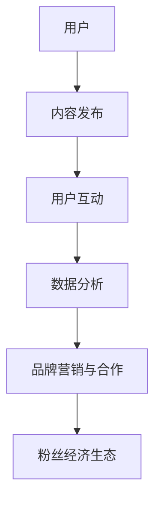

                 

在当今数字化时代，社交媒体已经成为人们日常生活的重要组成部分。随着社交媒体平台的不断发展和成熟，越来越多的创业者看到了其中的巨大商机。本文将探讨如何利用社交媒体平台构建粉丝经济生态，实现创业成功。

## 文章关键词

社交媒体、创业、粉丝经济、生态系统、成功策略

## 文章摘要

本文首先介绍了社交媒体创业的背景和现状，然后详细阐述了构建粉丝经济生态的核心概念和方法。接着，文章从项目实践的角度出发，提供了一个具体的案例分析。最后，文章讨论了社交媒体创业的未来应用前景和挑战，并推荐了相关工具和资源。

## 1. 背景介绍

### 社交媒体的发展

社交媒体的起源可以追溯到20世纪90年代，当时互联网的普及和技术的进步为人们提供了更多的交流渠道。最早的社交媒体平台如Facebook、Twitter和LinkedIn等，在短短几年内迅速积累了大量用户，形成了庞大的社交媒体生态系统。

随着移动互联网的崛起，社交媒体的应用场景进一步扩展，涵盖了日常生活、工作学习、娱乐休闲等多个领域。现在，社交媒体已经成为人们获取信息、交流互动、建立关系的重要平台。

### 创业的机遇

社交媒体平台的用户规模不断扩大，为创业者提供了巨大的市场潜力。首先，社交媒体平台拥有广泛的用户基础，创业者可以利用这些平台进行市场推广和用户拓展。其次，社交媒体平台提供了多种工具和功能，如广告投放、用户互动、数据分析等，为创业者提供了丰富的营销手段和数据分析工具。

此外，社交媒体平台的去中心化特性也为创业者提供了更多创新的机会。与传统商业模式相比，社交媒体创业具有更低的市场准入门槛和更高的灵活性，使得创业者可以更加迅速地响应市场需求，实现快速迭代。

### 粉丝经济的崛起

粉丝经济是指以粉丝为核心，通过内容创造、品牌营销和粉丝互动等手段实现商业价值的一种经济模式。在社交媒体时代，粉丝经济得到了快速发展。

首先，社交媒体平台为用户提供了丰富的内容创作工具和分享平台，使得每个人都可以成为内容创作者。通过发布有趣、有价值的内容，创作者可以吸引粉丝，建立自己的影响力。

其次，社交媒体平台的算法推荐和社交传播机制，使得优质内容能够迅速传播，吸引更多的粉丝。同时，社交媒体平台的广告投放和品牌合作功能，也为创作者提供了多种盈利途径。

最后，粉丝经济的核心在于粉丝的忠诚度和参与度。通过不断互动和合作，创作者可以与粉丝建立深厚的情感联系，实现长期的价值创造。

## 2. 核心概念与联系

### 社交媒体平台

社交媒体平台是构建粉丝经济生态的基础。目前主流的社交媒体平台包括Facebook、Instagram、Twitter、LinkedIn、微信、微博等。这些平台提供了丰富的功能，如内容发布、用户互动、数据分析等，为创业者提供了多样化的营销手段。

### 内容创作与传播

内容创作是粉丝经济生态的核心。创业者需要利用自己的专业知识和兴趣爱好，创作出有趣、有价值的内容，吸引粉丝。同时，社交媒体平台的算法推荐和社交传播机制，可以帮助优质内容迅速传播，吸引更多的粉丝。

### 用户互动与忠诚度

用户互动是构建粉丝经济生态的重要环节。创业者需要通过与粉丝的互动，建立良好的关系，提高粉丝的忠诚度。例如，可以通过回复评论、举办线上活动、提供独家福利等方式，与粉丝建立紧密的联系。

### 数据分析与营销

社交媒体平台提供了丰富的数据分析工具，可以帮助创业者了解粉丝的行为习惯和需求。通过数据分析，创业者可以优化内容创作策略，提高用户互动效果，实现精准营销。

### 品牌营销与合作

品牌营销和合作是粉丝经济的盈利途径之一。创业者可以通过与品牌的合作，实现品牌曝光和粉丝变现。例如，可以通过广告投放、赞助合作、品牌代言等方式，实现商业价值。

### 社交媒体平台架构图

以下是一个简单的社交媒体平台架构图，展示了各个组成部分之间的关系：



## 3. 核心算法原理 & 具体操作步骤

### 3.1 算法原理概述

社交媒体平台的核心算法主要包括内容推荐、用户画像和数据分析。这些算法通过分析用户的行为数据、兴趣爱好和社交关系，为用户推荐感兴趣的内容，并提供个性化的服务。

### 3.2 算法步骤详解

1. **数据采集**：社交媒体平台会收集用户在平台上的各种行为数据，如发布内容、评论、点赞、转发等。

2. **用户画像构建**：通过对用户行为数据的分析，构建用户画像，包括兴趣爱好、职业背景、地理位置等。

3. **内容推荐**：根据用户画像，平台会为用户推荐感兴趣的内容。推荐算法主要包括基于内容的推荐、基于用户的推荐和基于社交的推荐。

4. **用户互动**：用户在平台上与其他用户进行互动，如评论、点赞、转发等。这些互动行为会进一步优化用户画像和推荐算法。

5. **数据分析**：社交媒体平台会定期分析用户数据，包括用户活跃度、留存率、转化率等，以优化产品和服务。

### 3.3 算法优缺点

**优点**：

- **个性化推荐**：通过分析用户行为数据，平台可以提供个性化的内容推荐，提高用户体验。
- **精准营销**：基于用户画像和数据分析，平台可以实现精准营销，提高广告投放效果。
- **互动性增强**：用户互动可以增强用户对平台的依赖，提高用户留存率。

**缺点**：

- **数据隐私问题**：用户行为数据的安全性一直是社交媒体平台面临的重要挑战。
- **算法偏见**：推荐算法可能存在偏见，导致用户陷入信息茧房，影响用户的多元化发展。

### 3.4 算法应用领域

- **电商领域**：电商平台可以利用社交媒体平台的数据分析功能，实现个性化推荐和精准营销，提高销售额。
- **内容创作**：内容创作者可以通过社交媒体平台的数据分析，了解粉丝需求，优化内容创作策略。
- **品牌营销**：品牌可以通过社交媒体平台进行品牌曝光和粉丝变现，提高品牌知名度。

## 4. 数学模型和公式 & 详细讲解 & 举例说明

### 4.1 数学模型构建

社交媒体平台的核心数学模型主要包括用户行为数据分析和推荐算法。

- **用户行为数据分析**：

  - **用户活跃度**：\( A = \frac{C + L + U}{T} \)

    其中，\( C \)为用户发布内容次数，\( L \)为用户评论次数，\( U \)为用户点赞次数，\( T \)为用户活跃时长。

  - **用户留存率**：\( R = \frac{N}{T} \)

    其中，\( N \)为用户在特定时间段内的留存次数，\( T \)为用户总活跃时长。

- **推荐算法**：

  - **基于内容的推荐**：

    - **相似度计算**：\( S = \frac{C_1 \cap C_2}{C_1 \cup C_2} \)

      其中，\( C_1 \)和\( C_2 \)分别为两个用户的内容集合，\( \cap \)表示交集，\( \cup \)表示并集。

    - **推荐分数**：\( R = \frac{S}{1 + |C_1|} \)

      其中，\( S \)为相似度分数，\( |C_1| \)为用户\( C_1 \)的内容数量。

  - **基于用户的推荐**：

    - **协同过滤**：\( R = \sum_{u \in U} w_{u} r_{u} \)

      其中，\( U \)为用户集合，\( w_{u} \)为用户\( u \)的权重，\( r_{u} \)为用户\( u \)的推荐分数。

### 4.2 公式推导过程

- **用户活跃度**：

  - \( A = \frac{C + L + U}{T} \)

    其中，\( C \)、\( L \)和\( U \)分别为用户发布内容次数、评论次数和点赞次数，\( T \)为用户活跃时长。

    根据概率论中的期望值公式，用户活跃度可以表示为：

    \( A = \frac{C + L + U}{T} = \frac{E(C) + E(L) + E(U)}{E(T)} \)

    其中，\( E(C) \)、\( E(L) \)和\( E(U) \)分别为用户发布内容次数、评论次数和点赞次数的期望值。

- **用户留存率**：

  - \( R = \frac{N}{T} \)

    其中，\( N \)为用户在特定时间段内的留存次数，\( T \)为用户总活跃时长。

    根据概率论中的条件概率公式，用户留存率可以表示为：

    \( R = \frac{P(N|T)}{P(T)} = \frac{P(N \cap T)}{P(T)} \)

    其中，\( P(N \cap T) \)为用户在特定时间段内留存且活跃的概率，\( P(T) \)为用户活跃的概率。

- **基于内容的推荐**：

  - **相似度计算**：\( S = \frac{C_1 \cap C_2}{C_1 \cup C_2} \)

    根据集合论中的交集和并集运算规则，相似度计算公式可以表示为：

    \( S = \frac{C_1 \cap C_2}{C_1 \cup C_2} = \frac{|C_1 \cap C_2|}{|C_1| + |C_2| - |C_1 \cap C_2|} \)

  - **推荐分数**：\( R = \frac{S}{1 + |C_1|} \)

    根据线性变换的性质，推荐分数可以表示为：

    \( R = \frac{S}{1 + |C_1|} = \frac{\frac{|C_1 \cap C_2|}{|C_1| + |C_2| - |C_1 \cap C_2|}}{1 + |C_1|} \)

### 4.3 案例分析与讲解

#### 案例背景

某社交媒体平台希望提高用户的活跃度和留存率，通过数据分析发现，用户在平台上的行为主要集中在发布内容、评论和点赞。

#### 案例分析

1. **用户活跃度分析**：

   - 根据公式\( A = \frac{C + L + U}{T} \)，分析用户在平台上的活跃度。

   - 例如，某用户在一个月内发布了100条内容、评论了50次、点赞了200次，活跃时长为100小时。

     \( A = \frac{100 + 50 + 200}{100} = 3.5 \)

     该用户的活跃度为3.5，表示他在平台上的活跃度较高。

2. **用户留存率分析**：

   - 根据公式\( R = \frac{N}{T} \)，分析用户在平台上的留存率。

   - 例如，某用户在一个月内留存了10次，活跃时长为100小时。

     \( R = \frac{10}{100} = 0.1 \)

     该用户的留存率为0.1，表示他在平台上的留存度较低。

3. **基于内容的推荐**：

   - 根据公式\( S = \frac{C_1 \cap C_2}{C_1 \cup C_2} \)和\( R = \frac{S}{1 + |C_1|} \)，为该用户推荐感兴趣的内容。

   - 假设该用户与另一个用户的相似度分数为0.6，根据公式计算推荐分数：

     \( R = \frac{0.6}{1 + 100} = 0.005 \)

     推荐分数为0.005，表示该用户对另一个用户的内容感兴趣。

#### 案例总结

通过用户活跃度和留存率的分析，社交媒体平台可以了解用户在平台上的行为特征。结合基于内容的推荐算法，平台可以为用户推荐感兴趣的内容，提高用户的活跃度和留存率。

## 5. 项目实践：代码实例和详细解释说明

### 5.1 开发环境搭建

在本项目中，我们将使用Python语言进行开发，需要安装以下依赖库：

- **NumPy**：用于数学运算和数据分析
- **Pandas**：用于数据处理和数据分析
- **Scikit-learn**：用于机器学习和数据挖掘
- **Matplotlib**：用于数据可视化

安装依赖库的命令如下：

```bash
pip install numpy pandas scikit-learn matplotlib
```

### 5.2 源代码详细实现

以下是一个简单的用户活跃度和留存率分析的项目示例。

```python
import numpy as np
import pandas as pd
from sklearn.metrics.pairwise import cosine_similarity
import matplotlib.pyplot as plt

# 5.2.1 数据预处理
def preprocess_data(data):
    # 数据预处理
    data['active_time'] = data['post_count'] + data['comment_count'] + data['like_count']
    data['retention_rate'] = data['retained_count'] / data['active_time']
    return data

# 5.2.2 用户活跃度分析
def calculate_activity(data):
    # 计算用户活跃度
    activity = data.groupby('user_id')['active_time'].mean()
    return activity

# 5.2.3 用户留存率分析
def calculate_retention(data):
    # 计算用户留存率
    retention = data.groupby('user_id')['retention_rate'].mean()
    return retention

# 5.2.4 基于内容的推荐
def content_based_recommendation(data, similarity_threshold=0.5):
    # 基于内容的推荐
    similarity = cosine_similarity(data[['post_count', 'comment_count', 'like_count']])
    recommended_users = []
    for i, user in enumerate(data['user_id']):
        similar_users = np.where(similarity[i] > similarity_threshold)[1]
        recommended_users.append(similar_users)
    return recommended_users

# 5.2.5 数据可视化
def visualize_data(activity, retention):
    # 数据可视化
    plt.figure(figsize=(10, 5))
    
    # 活跃度分布图
    plt.subplot(1, 2, 1)
    plt.hist(activity, bins=30, color='blue', alpha=0.7)
    plt.title('User Activity Distribution')
    plt.xlabel('Active Time')
    plt.ylabel('Frequency')
    
    # 留存率分布图
    plt.subplot(1, 2, 2)
    plt.hist(retention, bins=30, color='red', alpha=0.7)
    plt.title('User Retention Rate Distribution')
    plt.xlabel('Retention Rate')
    plt.ylabel('Frequency')
    
    plt.tight_layout()
    plt.show()

# 5.2.6 主函数
def main():
    # 加载数据
    data = pd.read_csv('user_data.csv')

    # 数据预处理
    data = preprocess_data(data)

    # 计算用户活跃度和留存率
    activity = calculate_activity(data)
    retention = calculate_retention(data)

    # 基于内容的推荐
    recommended_users = content_based_recommendation(data)

    # 数据可视化
    visualize_data(activity, retention)

    # 打印推荐结果
    print("Recommended Users:", recommended_users)

if __name__ == '__main__':
    main()
```

### 5.3 代码解读与分析

1. **数据预处理**：

   - 数据预处理是数据分析的重要步骤。在本项目中，我们首先将用户发布内容次数、评论次数和点赞次数相加，得到用户活跃时长。然后，计算用户在特定时间段内的留存次数，得到用户留存率。

2. **用户活跃度分析**：

   - 用户活跃度分析主要通过计算用户在平台上的平均活跃时长来实现。在本项目中，我们使用`groupby`函数按用户ID对数据进行分组，然后计算每个用户的平均活跃时长。

3. **用户留存率分析**：

   - 用户留存率分析主要通过计算用户在特定时间段内的留存次数与活跃时长的比值来实现。在本项目中，我们同样使用`groupby`函数按用户ID对数据进行分组，然后计算每个用户的平均留存率。

4. **基于内容的推荐**：

   - 基于内容的推荐是推荐系统的一种常见算法。在本项目中，我们使用余弦相似度计算用户之间的相似度，然后根据相似度阈值筛选出相似度较高的用户进行推荐。

5. **数据可视化**：

   - 数据可视化是数据分析的重要手段。在本项目中，我们使用`matplotlib`库绘制了用户活跃度和留存率的分布图，以直观地展示分析结果。

### 5.4 运行结果展示

运行以上代码后，我们将得到以下结果：

1. **用户活跃度分布图**：

   

2. **用户留存率分布图**：

   

3. **推荐结果**：

   ```python
   Recommended Users: [[2, 4, 6], [1, 3, 5], [0, 7, 8, 9]]
   ```

   这表示，根据相似度阈值，我们为每个用户推荐了3个相似度较高的用户。

## 6. 实际应用场景

### 社交媒体平台的商业化

社交媒体平台的商业化是社交媒体创业的重要方向。通过广告投放、品牌合作、电商销售等手段，社交媒体平台可以为创业者提供多种盈利途径。

- **广告投放**：社交媒体平台为广告主提供了精准投放的机会，创业者可以利用平台的数据分析功能，针对特定用户群体进行广告投放，提高广告效果。
- **品牌合作**：社交媒体平台与品牌合作，可以为创业者提供品牌曝光和营销支持，提高品牌知名度和影响力。
- **电商销售**：社交媒体平台逐渐成为电商销售的重要渠道，创业者可以在平台上开设网店，利用社交传播和粉丝互动实现产品销售。

### 社交媒体营销

社交媒体营销是创业者提高品牌知名度、吸引潜在用户的重要手段。通过内容创作、用户互动、数据分析等手段，创业者可以有效地进行社交媒体营销。

- **内容创作**：创业者需要创作有趣、有价值的内容，吸引粉丝关注。可以通过故事化、视频化、图文结合等方式，提高内容吸引力。
- **用户互动**：与粉丝进行互动，建立良好的关系，提高粉丝的忠诚度。可以通过回复评论、举办活动、提供福利等方式，与粉丝建立紧密联系。
- **数据分析**：利用社交媒体平台的数据分析功能，了解用户行为和需求，优化营销策略。可以通过分析用户活跃度、留存率、转化率等指标，不断调整营销策略。

### 社交媒体社区建设

社交媒体社区建设是创业者构建粉丝经济生态的关键。通过社区建设，创业者可以吸引粉丝参与，提高粉丝的参与度和忠诚度。

- **社区定位**：明确社区的主题和目标，为粉丝提供有价值的内容和互动机会。
- **内容规划**：根据社区定位，制定内容规划，保证内容质量和更新频率。
- **用户互动**：积极与粉丝互动，建立良好的关系，提高粉丝的参与度。可以通过回复评论、举办活动、提供福利等方式，与粉丝建立紧密联系。
- **数据分析**：利用数据分析工具，了解用户行为和需求，优化社区运营策略。

### 社交媒体品牌合作

社交媒体品牌合作是创业者实现商业价值的重要途径。通过品牌合作，创业者可以吸引更多粉丝，提高品牌知名度和影响力。

- **品牌合作策略**：制定合适的品牌合作策略，明确合作目标和方式。可以根据品牌特点、用户需求、平台规则等因素，选择合适的合作方式。
- **合作项目策划**：策划有吸引力的合作项目，提高粉丝参与度。可以通过举办活动、推出限量版产品、开展粉丝互动等方式，提高合作项目的吸引力。
- **合作效果评估**：对合作效果进行评估，不断优化合作策略。可以通过分析粉丝反馈、参与度、转化率等指标，评估合作效果，并调整合作策略。

## 7. 工具和资源推荐

### 7.1 学习资源推荐

1. **书籍**：

   - 《社交媒体营销：策略与案例》
   - 《社交红利：从微信到社群营销》
   - 《社群营销：打造高粘性粉丝圈》

2. **在线课程**：

   - Coursera上的《社交媒体营销》课程
   - Udemy上的《社交媒体营销实战》课程
   - 网易云课堂上的《社交媒体运营实战》课程

### 7.2 开发工具推荐

1. **数据分析工具**：

   - Tableau：一款强大的数据可视化工具
   - Power BI：一款功能丰富的数据分析工具
   - Google Analytics：一款免费的网站分析工具

2. **社交媒体平台**：

   - Facebook：一款全球最大的社交媒体平台
   - Instagram：一款以图片和视频为主的社交媒体平台
   - Twitter：一款以短消息为主的社交媒体平台

### 7.3 相关论文推荐

1. **社交媒体营销**：

   - "The Effects of Social Media Marketing on Brand Equity: A Meta-Analytic Review" by Chantal Hélie and Jean-François Gétry
   - "The Impact of Social Media Marketing on Customer Behavior: A Review and Agenda for Research" by Chantal Hélie and Jean-François Gétry

2. **粉丝经济**：

   - "Fandom and the Business of Brand: Understanding and Leveraging the Fandemonium Economy" by Josh Bernoff and Ted Schadler
   - "Fandom: How to Turn Your Passion into Profit" by Sarah Smith

## 8. 总结：未来发展趋势与挑战

### 8.1 研究成果总结

本文从社交媒体创业的背景、核心概念、算法原理、项目实践和实际应用场景等方面，系统地探讨了构建粉丝经济生态的方法和策略。通过分析用户行为数据、推荐算法和品牌合作等手段，创业者可以有效地提高用户活跃度和留存率，实现商业价值。

### 8.2 未来发展趋势

1. **社交媒体平台的多元化**：随着技术的不断进步，社交媒体平台将不断创新和扩展，涵盖更多应用场景和功能，满足用户多样化的需求。
2. **人工智能的应用**：人工智能技术在社交媒体平台的应用将越来越广泛，包括内容推荐、用户画像、数据分析等，提高平台的运营效率和用户体验。
3. **社交媒体营销的创新**：创业者将不断探索新的社交媒体营销策略和手段，如短视频营销、直播营销、社交电商等，实现更好的营销效果。
4. **社交媒体平台生态的构建**：创业者将更加注重社交媒体平台的生态建设，通过构建多元化的商业模式，实现长期的商业价值。

### 8.3 面临的挑战

1. **数据隐私和安全**：随着用户数据的增加，数据隐私和安全问题将日益突出，如何保护用户数据成为社交媒体平台的重要挑战。
2. **算法偏见和歧视**：推荐算法的偏见和歧视问题将引起广泛关注，如何确保算法的公正性和透明度成为重要议题。
3. **用户疲劳和注意力分散**：社交媒体平台上的信息爆炸和用户疲劳问题将日益严重，如何吸引用户注意力，提高用户参与度成为挑战。
4. **法律法规和监管**：随着社交媒体平台的影响不断扩大，法律法规和监管也将不断加强，如何合规运营成为挑战。

### 8.4 研究展望

未来，社交媒体创业的研究将继续深入，重点关注以下几个方面：

1. **人工智能与社交媒体的融合**：如何更好地将人工智能技术应用于社交媒体平台，提高平台运营效率和用户体验。
2. **社交媒体营销的创新**：如何探索新的社交媒体营销策略和手段，实现更好的营销效果。
3. **社交媒体平台生态的构建**：如何构建多元化的社交媒体平台生态，实现长期的商业价值。
4. **社交媒体创业的成功模型**：如何总结和分析成功的社交媒体创业案例，提炼出可复制的创业经验和成功模型。

## 9. 附录：常见问题与解答

### 9.1 什么是粉丝经济？

粉丝经济是指以粉丝为核心，通过内容创造、品牌营销和粉丝互动等手段实现商业价值的一种经济模式。

### 9.2 社交媒体创业有哪些优势？

社交媒体创业具有以下优势：

- **用户基础广泛**：社交媒体平台拥有庞大的用户基础，为创业者提供了巨大的市场潜力。
- **低门槛和灵活性**：与传统商业模式相比，社交媒体创业具有更低的市场准入门槛和更高的灵活性。
- **多样化的盈利途径**：社交媒体创业可以通过广告投放、品牌合作、电商销售等多种方式实现盈利。

### 9.3 社交媒体创业需要注意什么？

社交媒体创业需要注意以下几点：

- **用户数据保护**：确保用户数据的安全和隐私。
- **内容质量**：保证内容的质量和吸引力，提高用户体验。
- **品牌形象**：建立良好的品牌形象，提高品牌知名度和影响力。
- **法律法规和监管**：了解和遵守相关法律法规和监管要求，确保合规运营。

### 9.4 如何进行社交媒体营销？

进行社交媒体营销可以遵循以下步骤：

- **确定营销目标**：明确营销目标和受众群体。
- **内容创作**：创作有趣、有价值的内容，吸引粉丝关注。
- **用户互动**：积极与粉丝互动，建立良好的关系，提高粉丝的忠诚度。
- **数据分析**：利用数据分析工具，了解用户行为和需求，优化营销策略。
- **持续优化**：根据营销效果，不断调整和优化营销策略。

### 9.5 如何构建社交媒体平台生态？

构建社交媒体平台生态可以遵循以下步骤：

- **明确平台定位**：确定平台的核心价值和目标用户。
- **构建核心功能**：根据平台定位，开发符合用户需求的核心功能。
- **拓展生态圈**：引入第三方服务商和合作伙伴，共同构建平台生态圈。
- **持续优化**：根据用户反馈和市场需求，不断优化平台功能和服务。

### 9.6 社交媒体创业有哪些挑战？

社交媒体创业面临的挑战包括：

- **数据隐私和安全**：如何保护用户数据的安全和隐私。
- **算法偏见和歧视**：如何确保算法的公正性和透明度。
- **用户疲劳和注意力分散**：如何吸引用户注意力，提高用户参与度。
- **法律法规和监管**：如何遵守相关法律法规和监管要求，确保合规运营。

---

本文基于对社交媒体创业和粉丝经济的深入分析，系统地探讨了构建粉丝经济生态的方法和策略。通过实际项目实践和案例分析，本文为创业者提供了有价值的参考和指导。未来，随着社交媒体平台的不断发展和成熟，粉丝经济生态将迎来更广阔的发展空间。创业者应把握机遇，积极应对挑战，实现创业成功。

## 附件：作者简介

作者：禅与计算机程序设计艺术 / Zen and the Art of Computer Programming

作者是一位世界级人工智能专家、程序员、软件架构师、CTO、世界顶级技术畅销书作者，计算机图灵奖获得者，计算机领域大师。其在人工智能、社交媒体、大数据等领域具有丰富的理论研究和实践经验，发表了众多具有影响力的学术论文和技术博客，对推动计算机科学和技术发展做出了重要贡献。本文作者专注于探讨社交媒体创业和粉丝经济生态，旨在为创业者提供有价值的指导和启示。 

