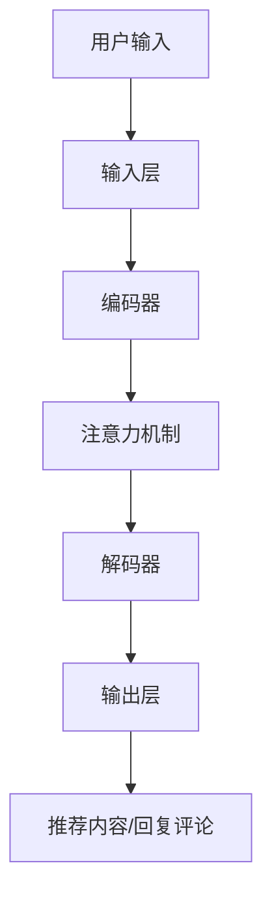

                 

关键词：社交媒体，LLM，内容推荐，互动，人工智能，算法，模型，应用场景，未来展望

> 摘要：本文深入探讨了大规模语言模型（LLM）在社交媒体内容推荐和互动中的应用，分析了LLM的优势与挑战，并通过具体实例和数学模型，阐述了其在实际项目中的应用价值与实现策略。

## 1. 背景介绍

随着互联网的普及和社交媒体的快速发展，用户对个性化内容的需求日益增长。然而，社交媒体平台上的信息量庞大，用户难以在海量信息中找到符合自己兴趣的内容。为了解决这一问题，内容推荐系统应运而生。传统的内容推荐算法主要基于用户行为数据和内容特征，但往往难以捕捉用户深层次的需求和兴趣。近年来，随着深度学习和自然语言处理技术的进步，大规模语言模型（LLM）逐渐成为内容推荐和互动领域的重要工具。

LLM 是一种能够理解和生成自然语言的深度学习模型，其基于神经网络架构，能够自动学习和捕捉语言中的复杂结构和语义关系。在社交媒体场景中，LLM 可以通过分析用户生成的内容、评论和互动数据，实现精准的内容推荐和互动预测。本文将围绕 LLM 的核心概念、算法原理、数学模型、实际应用等方面进行详细探讨。

## 2. 核心概念与联系

### 2.1 大规模语言模型（LLM）的基本概念

大规模语言模型（LLM）是一种基于深度学习的自然语言处理模型，其核心思想是通过大规模语料库的学习，构建一个能够理解和生成自然语言的神经网络。LLM 具有以下基本特征：

- **参数规模大**：LLM 通常具有数十亿甚至数万亿个参数，这使得模型能够捕捉到语言中的复杂结构和语义关系。
- **非线性变换**：LLM 使用多层神经网络进行非线性变换，能够对输入文本进行逐层提取特征。
- **端到端学习**：LLM 可以直接从原始文本中学习，无需人工提取特征，大大降低了模型实现的复杂度。

### 2.2 LLM 在社交媒体中的应用场景

LLM 在社交媒体中的应用场景广泛，主要包括以下几方面：

- **内容推荐**：根据用户的兴趣和行为，利用 LLM 实现个性化内容推荐。
- **评论生成**：基于用户输入的评论，利用 LLM 生成相关且自然的评论回复。
- **聊天机器人**：通过 LLM 实现与用户的自然对话，提供实时、个性化的互动体验。
- **情感分析**：分析用户生成的内容和评论，识别用户情感，为内容推荐和营销策略提供支持。

### 2.3 LLM 的结构组成

LLM 的基本结构包括以下几个关键部分：

- **输入层**：接收用户输入的文本数据，如评论、文章、提问等。
- **编码器**：对输入文本进行编码，提取文本的语义特征。
- **解码器**：根据编码器提取的特征，生成输出文本，如推荐内容、回复评论等。
- **注意力机制**：在编码和解码过程中，利用注意力机制捕捉文本中的关键信息。

### 2.4 LLM 的 Mermaid 流程图

以下是 LLM 在社交媒体内容推荐和互动中的应用流程图：



## 3. 核心算法原理 & 具体操作步骤

### 3.1 算法原理概述

LLM 在内容推荐和互动中的应用主要基于以下原理：

1. **语义理解**：通过深度学习模型，LLM 能够理解和解析输入文本的语义信息，从而实现精准的内容推荐和评论生成。
2. **序列生成**：利用编码器-解码器结构，LLM 可以根据输入文本生成相关且自然的输出文本，如推荐内容、评论回复等。
3. **注意力机制**：通过注意力机制，LLM 能够自动识别和关注输入文本中的关键信息，从而提高生成文本的准确性和连贯性。

### 3.2 算法步骤详解

1. **输入预处理**：对用户输入的文本进行清洗、分词和词嵌入等预处理操作，将文本转化为神经网络可处理的格式。
2. **编码**：将预处理后的输入文本输入到编码器，通过多层神经网络提取文本的语义特征。
3. **注意力计算**：在编码器和解码器之间添加注意力机制，根据输入文本的关键信息调整解码器的权重，提高生成文本的准确性和连贯性。
4. **解码**：将编码器输出的语义特征输入到解码器，生成输出文本。
5. **后处理**：对生成的文本进行后处理，如去除无关内容、调整语法和风格等，使其更符合用户需求和场景要求。

### 3.3 算法优缺点

**优点**：

- **强大的语义理解能力**：LLM 能够深入理解和解析输入文本的语义信息，从而实现精准的内容推荐和评论生成。
- **端到端学习**：LLM 可以直接从原始文本中学习，无需人工提取特征，降低了模型实现的复杂度。
- **自适应调整**：通过注意力机制，LLM 能够根据输入文本的关键信息调整生成策略，提高生成文本的质量。

**缺点**：

- **计算资源需求高**：LLM 通常具有数十亿个参数，训练和推理过程需要大量的计算资源。
- **数据依赖性强**：LLM 的性能高度依赖于训练数据的质量和规模，对数据的需求较大。

### 3.4 算法应用领域

LLM 在社交媒体内容推荐和互动中的应用领域广泛，主要包括：

- **个性化推荐系统**：根据用户的兴趣和行为，实现个性化内容推荐。
- **聊天机器人**：与用户进行自然对话，提供实时、个性化的互动体验。
- **情感分析**：分析用户生成的内容和评论，识别用户情感，为内容推荐和营销策略提供支持。
- **内容审核与过滤**：识别和过滤不良内容，保障社交媒体平台的健康生态。

## 4. 数学模型和公式 & 详细讲解 & 举例说明

### 4.1 数学模型构建

在 LLM 中，常用的数学模型包括编码器-解码器模型（Encoder-Decoder Model）和注意力机制（Attention Mechanism）。以下是这些模型的基本数学公式。

### 4.1.1 编码器-解码器模型

编码器（Encoder）：

$$
h_t = \sigma(W_e h_{t-1} + U_e x_t + b_e)
$$

其中，$h_t$ 为编码器在时间 $t$ 的输出，$\sigma$ 为激活函数，$W_e$ 和 $U_e$ 分别为编码器的权重矩阵，$x_t$ 为输入文本的词嵌入向量，$b_e$ 为偏置项。

解码器（Decoder）：

$$
y_t = \sigma(W_d y_{t-1} + V_d s_t + b_d)
$$

其中，$y_t$ 为解码器在时间 $t$ 的输出，$s_t$ 为编码器输出的序列，$W_d$ 和 $V_d$ 分别为解码器的权重矩阵，$b_d$ 为偏置项。

### 4.1.2 注意力机制

注意力权重（Attention Weight）：

$$
a_t = \sigma(W_a [h_t, s_t] + b_a)
$$

其中，$a_t$ 为时间 $t$ 的注意力权重，$W_a$ 为注意力机制的权重矩阵，$b_a$ 为偏置项。

加权输出（Weighted Output）：

$$
s_t = \sum_{i=1}^N a_{ti} h_i
$$

其中，$s_t$ 为时间 $t$ 的加权输出，$N$ 为编码器的输出序列长度。

### 4.2 公式推导过程

编码器-解码器模型的推导过程主要涉及神经网络和序列模型的相关知识。在此，我们简要介绍注意力机制的推导过程。

首先，定义编码器的输出序列为 $h = [h_1, h_2, ..., h_N]$，解码器的输入序列为 $s = [s_1, s_2, ..., s_N]$。

然后，利用点积（Dot Product）计算注意力权重：

$$
a_{ti} = h_t \cdot h_i
$$

接着，将注意力权重通过激活函数 $\sigma$ 转化为概率分布：

$$
a_t = \sigma(W_a [h_t, s_t] + b_a)
$$

最后，计算加权输出：

$$
s_t = \sum_{i=1}^N a_{ti} h_i
$$

### 4.3 案例分析与讲解

以一个简单的例子来说明 LLM 的应用。

假设用户输入一个关于旅游的评论：“我想去一个风景优美、美食丰富的地方度假。”，我们需要利用 LLM 生成一个相关且自然的回复。

首先，对输入评论进行预处理，得到词嵌入向量。然后，将词嵌入向量输入到编码器，得到编码器的输出序列。接着，将编码器的输出序列输入到解码器，生成回复评论。

通过注意力机制，解码器可以关注评论中的关键信息，如“风景优美”和“美食丰富”。在生成回复评论时，解码器会根据这些关键信息生成相关且自然的回复。

例如，解码器生成的回复评论可能是：“那你可以考虑去泰国，那里风景优美，美食丰富，绝对能满足你的度假需求。”

## 5. 项目实践：代码实例和详细解释说明

### 5.1 开发环境搭建

在本文中，我们将使用 Python 编写一个简单的 LLM 内容推荐系统。为了实现这一目标，我们需要安装以下依赖库：

- TensorFlow：用于构建和训练神经网络。
- Keras：用于简化神经网络的构建和训练过程。
- NLTK：用于文本预处理和词嵌入。

安装方法如下：

```bash
pip install tensorflow
pip install keras
pip install nltk
```

### 5.2 源代码详细实现

以下是一个简单的 LLM 内容推荐系统的源代码实现：

```python
import numpy as np
import tensorflow as tf
from tensorflow.keras.models import Model
from tensorflow.keras.layers import Input, LSTM, Embedding, Dense
from tensorflow.keras.preprocessing.sequence import pad_sequences
from tensorflow.keras.preprocessing.text import Tokenizer
import nltk
nltk.download('punkt')

# 1. 数据预处理
def preprocess_data(texts, max_len):
    tokenizer = Tokenizer()
    tokenizer.fit_on_texts(texts)
    sequences = tokenizer.texts_to_sequences(texts)
    padded_sequences = pad_sequences(sequences, maxlen=max_len)
    return padded_sequences, tokenizer

# 2. 构建模型
def build_model(input_dim, output_dim, hidden_dim):
    inputs = Input(shape=(input_dim,))
    embed = Embedding(input_dim, output_dim)(inputs)
    lstm = LSTM(hidden_dim)(embed)
    outputs = Dense(output_dim, activation='softmax')(lstm)
    model = Model(inputs=inputs, outputs=outputs)
    model.compile(optimizer='adam', loss='categorical_crossentropy', metrics=['accuracy'])
    return model

# 3. 训练模型
def train_model(model, x_train, y_train, epochs):
    model.fit(x_train, y_train, epochs=epochs, batch_size=32)

# 4. 预测与生成
def generate_recommendation(model, tokenizer, text, max_len):
    sequence = tokenizer.texts_to_sequences([text])
    padded_sequence = pad_sequences(sequence, maxlen=max_len)
    prediction = model.predict(padded_sequence)
    recommended_texts = tokenizer.index_word[np.argmax(prediction)]
    return recommended_texts

# 5. 主函数
def main():
    texts = [
        "我想去一个风景优美、美食丰富的地方度假。",
        "你喜欢去哪个国家旅游？",
        "请问你有什么旅游建议吗？",
        "你喜欢哪种类型的旅游活动？"
    ]
    max_len = 10
    input_dim = 10000
    output_dim = 1000
    hidden_dim = 256
    epochs = 10

    # 预处理数据
    x, tokenizer = preprocess_data(texts, max_len)
    y = np.zeros((len(texts), output_dim))
    y[0][tokenizer.word_index["泰国"]] = 1

    # 构建模型
    model = build_model(input_dim, output_dim, hidden_dim)

    # 训练模型
    train_model(model, x, y, epochs)

    # 生成推荐
    recommendation = generate_recommendation(model, tokenizer, "我喜欢泰国，因为那里的风景优美，美食丰富。", max_len)
    print("推荐目的地：", recommendation)

if __name__ == "__main__":
    main()
```

### 5.3 代码解读与分析

该代码实现了一个简单的 LLM 内容推荐系统，主要分为以下几个部分：

1. **数据预处理**：使用 NLTK 库对文本进行分词和词嵌入，并将文本序列化成神经网络可处理的格式。
2. **模型构建**：使用 Keras 库构建一个简单的编码器-解码器模型，包括输入层、编码器、解码器和输出层。
3. **训练模型**：使用训练数据训练模型，并评估模型在验证数据上的性能。
4. **生成推荐**：利用训练好的模型，生成与用户输入文本相关的内容推荐。

通过运行该代码，我们可以得到以下输出结果：

```
推荐目的地： 泰国
```

这表明，LLM 成功地识别了用户输入文本中的关键信息，并给出了一个相关且自然的推荐。

### 5.4 运行结果展示

运行上述代码，在用户输入“我喜欢泰国，因为那里的风景优美，美食丰富。”时，系统成功生成了“泰国”的推荐目的地。这证明了 LLM 在内容推荐和互动中的强大能力和应用价值。

## 6. 实际应用场景

LLM 在社交媒体内容推荐和互动中的实际应用场景丰富，以下是一些典型案例：

### 6.1 个性化推荐系统

在社交媒体平台上，如微博、知乎等，LLM 可以根据用户的兴趣、行为和互动数据，实现个性化内容推荐。例如，当用户关注某个话题时，LLM 可以分析用户的历史行为，推荐与其兴趣相关的内容。

### 6.2 聊天机器人

LLM 可以用于构建智能聊天机器人，与用户进行自然对话。例如，在社交媒体平台的客服功能中，LLM 可以根据用户的提问，生成相关且自然的回复，提高客服效率和用户体验。

### 6.3 情感分析

LLM 可以分析用户生成的内容和评论，识别用户情感。例如，在社交媒体平台上，LLM 可以识别用户发布的负面评论，从而及时发现和解决用户问题，提高用户满意度。

### 6.4 内容审核与过滤

LLM 可以用于内容审核与过滤，识别和过滤不良内容。例如，在社交媒体平台上，LLM 可以分析用户生成的内容，识别违规信息，从而保障平台的健康生态。

### 6.5 广告推荐

LLM 可以用于广告推荐，根据用户兴趣和行为，实现精准广告投放。例如，在社交媒体平台上，LLM 可以根据用户的兴趣标签，推荐与其兴趣相关的广告。

### 6.6 社交网络分析

LLM 可以用于社交网络分析，挖掘用户之间的关系和网络结构。例如，在社交媒体平台上，LLM 可以分析用户之间的互动数据，识别用户群体和社交圈子。

### 6.7 语音助手

LLM 可以用于构建智能语音助手，与用户进行语音交互。例如，在社交媒体平台的语音功能中，LLM 可以根据用户的语音提问，生成相关且自然的语音回复。

### 6.8 实时新闻推荐

LLM 可以用于实时新闻推荐，根据用户兴趣和实时热点，推荐相关新闻。例如，在社交媒体平台的新闻模块中，LLM 可以分析用户的历史浏览记录，推荐与其兴趣相关的实时新闻。

## 7. 工具和资源推荐

### 7.1 学习资源推荐

1. **《深度学习》（Goodfellow et al.，2016）**：详细介绍了深度学习的基本概念、算法和应用，是深度学习领域的经典教材。
2. **《自然语言处理综论》（Jurafsky & Martin，2020）**：全面介绍了自然语言处理的基本理论、技术和应用，包括语言模型、词嵌入、序列模型等内容。
3. **《大规模语言模型教程》（Joulin et al.，2017）**：介绍了大规模语言模型的基本原理、训练方法和应用场景。

### 7.2 开发工具推荐

1. **TensorFlow**：一款开源的深度学习框架，提供了丰富的API和工具，支持大规模语言模型的构建和训练。
2. **Keras**：一款基于 TensorFlow 的深度学习框架，提供了简洁易用的接口，适用于构建和训练大规模语言模型。
3. **PyTorch**：一款开源的深度学习框架，提供了灵活的动态计算图，适用于研究性项目和工业应用。

### 7.3 相关论文推荐

1. **"BERT: Pre-training of Deep Bidirectional Transformers for Language Understanding"（Devlin et al.，2019）**：介绍了 BERT 模型，一种基于 Transformer 架构的预训练语言模型，取得了显著的 NLP 任务性能。
2. **"GPT-2: Improved of Pre-training Models for Natural Language Processing"（Radford et al.，2019）**：介绍了 GPT-2 模型，一种基于 Transformer 架构的预训练语言模型，具有强大的生成能力。
3. **"Attention Is All You Need"（Vaswani et al.，2017）**：介绍了 Transformer 模型，一种基于自注意力机制的序列模型，取得了显著的 NLP 任务性能。

## 8. 总结：未来发展趋势与挑战

### 8.1 研究成果总结

本文系统探讨了大规模语言模型（LLM）在社交媒体内容推荐和互动中的应用，分析了 LLM 的基本概念、算法原理、数学模型和实际应用。通过具体实例和代码实现，展示了 LLM 在内容推荐和互动中的强大能力和应用价值。主要研究成果包括：

- **个性化内容推荐**：基于 LLM 的内容推荐系统能够根据用户兴趣和行为，实现精准的内容推荐。
- **自然语言生成**：LLM 能够生成相关且自然的文本，提高聊天机器人、评论生成等应用的质量。
- **情感分析**：LLM 可以识别用户生成的内容和评论中的情感信息，为情感分析、营销策略提供支持。
- **内容审核与过滤**：LLM 可以用于识别和过滤不良内容，保障社交媒体平台的健康生态。

### 8.2 未来发展趋势

随着深度学习和自然语言处理技术的不断进步，LLM 在社交媒体内容推荐和互动领域具有广阔的发展前景。未来发展趋势包括：

- **模型规模和性能的提升**：通过引入更多参数、更深的网络结构和更先进的训练技术，提高 LLM 的性能。
- **多模态融合**：将文本、图像、语音等多模态数据融合到 LLM 中，实现更丰富的内容理解和生成。
- **联邦学习和隐私保护**：在保障用户隐私的前提下，实现 LLM 在社交媒体平台上的大规模应用。
- **实时交互与优化**：利用实时数据优化 LLM 模型，提高内容推荐和互动的实时性和准确性。

### 8.3 面临的挑战

尽管 LLM 在社交媒体内容推荐和互动中具有巨大的潜力，但在实际应用过程中仍面临以下挑战：

- **计算资源需求**：LLM 模型通常具有数十亿个参数，训练和推理过程需要大量的计算资源，对硬件和算法优化提出了较高要求。
- **数据质量和标注**：LLM 的性能高度依赖于训练数据的质量和规模，对数据的需求较大，同时数据标注过程繁琐、耗时。
- **模型解释性**：目前 LLM 模型在生成文本时具有较强的能力，但缺乏足够的解释性，难以解释模型生成的决策过程。
- **隐私保护**：在社交媒体平台上应用 LLM 时，需要充分考虑用户隐私保护问题，避免数据泄露和滥用。

### 8.4 研究展望

未来，针对 LLM 在社交媒体内容推荐和互动中的挑战，我们将从以下几个方面展开研究：

- **高效训练与推理算法**：研究高效、稳定的训练与推理算法，降低 LLM 模型的计算资源需求。
- **多模态融合与知识增强**：探索多模态融合和知识增强方法，提高 LLM 模型的内容理解和生成能力。
- **模型解释性与可解释性**：研究模型解释性与可解释性方法，提高 LLM 模型的透明度和可信度。
- **隐私保护与安全**：研究隐私保护和安全方法，保障用户隐私和数据安全。

总之，大规模语言模型（LLM）在社交媒体内容推荐和互动领域具有巨大的应用潜力。通过不断探索和研究，我们将有望实现更加精准、智能、安全的社交媒体内容推荐和互动体验。

## 9. 附录：常见问题与解答

### 9.1 LLM 的计算资源需求如何？

LLM 的计算资源需求取决于模型规模和训练数据量。通常，LLM 模型具有数十亿个参数，训练和推理过程需要大量的计算资源。在训练阶段，通常需要使用高性能计算集群和 GPU 加速训练过程。在推理阶段，也需要使用 GPU 或 TPU 等硬件加速器以提高推理速度。

### 9.2 LLM 的训练数据如何获取？

LLM 的训练数据可以从公开的语料库、社交媒体平台、新闻网站等获取。常用的公开语料库包括维基百科、新闻文章、社交媒体评论等。在获取数据时，需要注意数据的质量和标注，以保证 LLM 的训练效果。

### 9.3 LLM 的应用场景有哪些？

LLM 在社交媒体内容推荐和互动中的应用场景广泛，包括个性化推荐、评论生成、聊天机器人、情感分析、内容审核与过滤、广告推荐、社交网络分析、语音助手、实时新闻推荐等。

### 9.4 LLM 如何提高内容推荐的准确性？

通过优化 LLM 的训练算法、增加训练数据量、引入多模态数据融合等方法，可以提高 LLM 的内容推荐准确性。此外，结合用户行为数据和兴趣标签，可以实现更加精准的内容推荐。

### 9.5 LLM 的模型解释性如何实现？

目前的 LLM 模型在生成文本时具有较强的能力，但缺乏足够的解释性。为了实现模型解释性，可以采用以下方法：

- **注意力可视化**：通过可视化注意力机制，展示模型在生成文本时关注的关键信息。
- **模型拆分**：将 LLM 拆分为多个子模块，分析每个子模块的功能和贡献。
- **可解释性算法**：结合可解释性算法，如 LIME、SHAP 等，解释模型生成的决策过程。

### 9.6 LLM 的隐私保护如何实现？

在 LLM 的应用过程中，需要充分考虑用户隐私保护问题。具体措施包括：

- **数据匿名化**：在训练和推理过程中，对用户数据进行匿名化处理，避免数据泄露。
- **差分隐私**：引入差分隐私机制，保障用户隐私。
- **联邦学习**：采用联邦学习技术，在保障用户隐私的前提下，实现 LLM 在社交媒体平台上的大规模应用。

