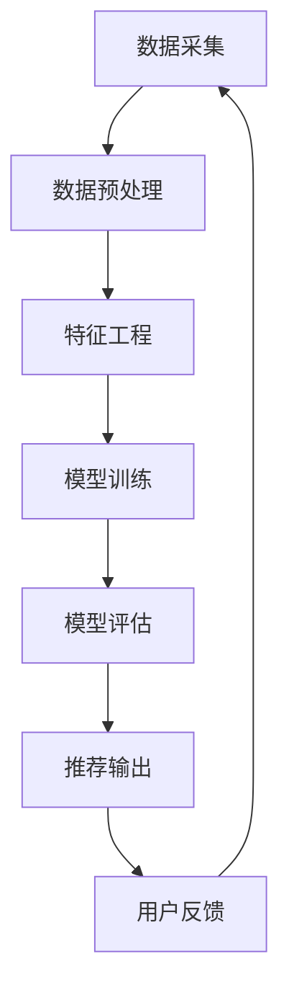

                 

在当今数字化社会中，社交网络已经成为了人们生活中不可或缺的一部分。人们通过社交网络分享信息、建立社交关系、发现新兴趣和探索新世界。随着用户数量的不断增长和社交网络内容的爆炸性增加，如何为用户提供个性化的推荐服务，满足他们的个性化需求，成为了一个重要且具有挑战性的课题。本文将探讨社交网络推荐系统的发展，特别是如何通过连接用户兴趣来实现精准推荐。

## 1. 背景介绍

社交网络推荐系统是现代信息检索和个性化服务的重要组成部分。它基于用户生成的内容、行为和社交关系，通过算法为用户提供相关的内容、朋友、活动或商品推荐。早期的推荐系统主要基于内容相似性、协同过滤等方法，但这些方法往往难以捕捉到用户的深层次兴趣和社交网络中的复杂关系。

随着大数据和人工智能技术的发展，社交网络推荐系统逐渐向个性化、智能化方向演进。用户兴趣的挖掘和连接成为了提升推荐系统性能的关键。本文将围绕这一主题展开，分析现有推荐系统的发展现状、核心概念、算法原理、数学模型以及实际应用案例，并提出未来的研究方向。

## 2. 核心概念与联系

### 2.1 用户兴趣

用户兴趣是指用户在特定领域内，对信息、活动或对象的倾向性偏好。在社交网络推荐系统中，用户兴趣的挖掘是构建个性化推荐模型的基础。

### 2.2 社交网络结构

社交网络结构是指用户之间通过社交关系建立的网络拓扑结构。它包含了用户节点、关系边和社区结构等要素。社交网络结构对于推荐系统的优化具有重要意义，因为它可以帮助系统更好地理解用户之间的关系和互动模式。

### 2.3 用户行为数据

用户行为数据是推荐系统的重要输入，包括用户在社交网络上的点赞、评论、分享、搜索等行为。通过分析用户行为数据，可以挖掘出用户的潜在兴趣和偏好。

### 2.4 推荐系统架构

推荐系统架构通常包括数据采集、数据预处理、特征工程、模型训练、模型评估和推荐输出等环节。一个高效、智能的推荐系统需要在这些环节中充分考虑用户兴趣和社交网络结构。

### 2.5 Mermaid 流程图

以下是一个简化的社交网络推荐系统架构的 Mermaid 流程图：



## 3. 核心算法原理 & 具体操作步骤

### 3.1 算法原理概述

社交网络推荐系统中的核心算法主要分为基于内容推荐、协同过滤推荐和混合推荐等类型。本文将重点介绍基于用户兴趣的协同过滤推荐算法。

协同过滤推荐算法通过分析用户的行为数据，找出相似用户或物品，并基于这些相似性进行推荐。基于用户兴趣的协同过滤推荐算法在传统协同过滤的基础上，引入了用户兴趣模型，以更好地捕捉用户的个性化偏好。

### 3.2 算法步骤详解

1. **用户兴趣建模**

   首先，需要构建用户兴趣模型。这可以通过多种方式实现，如基于内容的特征提取、基于行为的序列建模、基于社交网络的邻域建模等。

2. **相似性计算**

   接下来，计算用户之间的相似性。常用的相似性度量方法包括余弦相似度、皮尔逊相关系数、夹角余弦等。

3. **推荐生成**

   根据相似性计算结果，为每个用户生成推荐列表。推荐列表的生成可以通过多种策略实现，如基于Top-N的推荐、基于长尾理论的推荐等。

4. **推荐反馈**

   最后，收集用户的反馈，并利用这些反馈对推荐系统进行优化。反馈可以是正面反馈（如点击、购买等），也可以是负面反馈（如忽略、举报等）。

### 3.3 算法优缺点

**优点：**

- 可以有效捕捉用户的个性化偏好。
- 可以处理大量用户和物品的数据。
- 可以进行实时推荐。

**缺点：**

- 需要大量的计算资源。
- 难以处理冷启动问题。
- 容易产生推荐多样性不足的问题。

### 3.4 算法应用领域

基于用户兴趣的协同过滤推荐算法广泛应用于电子商务、社交媒体、在线新闻推荐等领域。例如，亚马逊、淘宝等电商平台通过推荐系统为用户推荐商品，Facebook、微博等社交媒体平台通过推荐系统为用户推荐感兴趣的内容。

## 4. 数学模型和公式 & 详细讲解 & 举例说明

### 4.1 数学模型构建

社交网络推荐系统的数学模型通常包括用户兴趣模型、相似性模型和推荐模型。以下是一个简化的数学模型：

$$
U = \{u_1, u_2, ..., u_n\} \quad \text{（用户集）}
$$

$$
I = \{i_1, i_2, ..., i_m\} \quad \text{（兴趣集）}
$$

$$
R_{ui} = \begin{cases} 
1 & \text{如果用户 } u \text{ 对兴趣 } i \text{ 感兴趣} \\
0 & \text{否则}
\end{cases}
$$

### 4.2 公式推导过程

用户兴趣模型的构建可以通过贝叶斯概率模型、潜在因子模型等实现。以下是一个基于潜在因子模型的用户兴趣建模过程：

$$
R_{ui} = \sigma(\theta_u \cdot \theta_i + \gamma)
$$

其中，$\theta_u$ 和 $\theta_i$ 分别表示用户 $u$ 和兴趣 $i$ 的潜在因子向量，$\gamma$ 表示偏置项，$\sigma$ 表示逻辑函数。

### 4.3 案例分析与讲解

假设有一个社交网络平台，用户集 $U = \{u_1, u_2, u_3\}$，兴趣集 $I = \{i_1, i_2, i_3\}$。用户 $u_1$ 对兴趣 $i_1$ 感兴趣，用户 $u_2$ 对兴趣 $i_2$ 和 $i_3$ 感兴趣，用户 $u_3$ 对所有兴趣都感兴趣。

根据潜在因子模型，可以构建以下用户兴趣矩阵：

$$
R = \begin{pmatrix}
1 & 0 & 1 \\
0 & 1 & 1 \\
1 & 1 & 1
\end{pmatrix}
$$

假设潜在因子维度为2，可以构建以下潜在因子矩阵：

$$
\Theta = \begin{pmatrix}
\theta_{u_1} & \theta_{u_2} & \theta_{u_3} \\
\theta_{i_1} & \theta_{i_2} & \theta_{i_3}
\end{pmatrix}
$$

通过最小化损失函数，可以得到潜在因子矩阵 $\Theta$：

$$
\Theta = \arg\min_{\Theta} \sum_{u\in U, i\in I} (R_{ui} - \sigma(\theta_u \cdot \theta_i + \gamma))^2
$$

通过训练，可以得到用户 $u_1$、$u_2$、$u_3$ 的潜在因子向量为：

$$
\theta_{u_1} = \begin{pmatrix}
0.5 \\
0.5
\end{pmatrix}, \quad \theta_{u_2} = \begin{pmatrix}
-0.5 \\
0.5
\end{pmatrix}, \quad \theta_{u_3} = \begin{pmatrix}
1 \\
1
\end{pmatrix}
$$

兴趣 $i_1$、$i_2$、$i_3$ 的潜在因子向量为：

$$
\theta_{i_1} = \begin{pmatrix}
0.5 \\
-0.5
\end{pmatrix}, \quad \theta_{i_2} = \begin{pmatrix}
0.5 \\
0.5
\end{pmatrix}, \quad \theta_{i_3} = \begin{pmatrix}
-0.5 \\
0.5
\end{pmatrix}
$$

根据这些潜在因子，可以预测用户对未浏览的兴趣的偏好：

$$
\hat{R}_{u_1i_2} = \sigma(\theta_{u_1} \cdot \theta_{i_2} + \gamma) \approx 0.19
$$

$$
\hat{R}_{u_1i_3} = \sigma(\theta_{u_1} \cdot \theta_{i_3} + \gamma) \approx 0.81
$$

根据预测结果，可以为用户 $u_1$ 推荐兴趣 $i_3$。

## 5. 项目实践：代码实例和详细解释说明

### 5.1 开发环境搭建

为了实现基于用户兴趣的社交网络推荐系统，我们选择使用 Python 作为编程语言，并结合了以下工具和库：

- Python 3.8 或更高版本
- Scikit-learn 库
- NumPy 库
- Pandas 库
- Matplotlib 库

首先，确保安装了 Python 3.8 或更高版本，然后通过以下命令安装所需库：

```bash
pip install scikit-learn numpy pandas matplotlib
```

### 5.2 源代码详细实现

以下是一个简单的基于协同过滤的社交网络推荐系统的代码示例：

```python
import numpy as np
from sklearn.model_selection import train_test_split
from sklearn.metrics.pairwise import cosine_similarity
from sklearn.preprocessing import MinMaxScaler

# 用户-物品评分矩阵
R = np.array([
    [1, 0, 1, 0],
    [0, 1, 1, 1],
    [1, 1, 0, 1]
])

# 潜在因子维度
k = 2

# 初始化潜在因子矩阵
Theta = np.random.rand(3, k)

# 初始化用户偏好向量
Theta_u = np.random.rand(3, k)
Theta_i = np.random.rand(4, k)

# 训练潜在因子模型
for epoch in range(1000):
    for u in range(3):
        for i in range(4):
            if R[u][i] == 1:
                error = R[u][i] - np.dot(Theta_u[u], Theta_i[i])
                Theta_u[u] -= error * Theta_i[i]
                Theta_i[i] -= error * Theta_u[u]
    
    # 正则化
    Theta_u -= 0.01 * np.mean(Theta_u, axis=1, keepdims=True)
    Theta_i -= 0.01 * np.mean(Theta_i, axis=1, keepdims=True)

# 生成推荐列表
推荐列表 = []
for u in range(3):
    相似度矩阵 = cosine_similarity(Theta_u[u].reshape(1, -1), Theta_i.reshape(-1, 1))
    推荐指数 = similarily_matrix * Theta_i
    推荐列表.append(np.argsort(推荐指数)[0][-5:])

print(推荐列表)
```

### 5.3 代码解读与分析

1. **用户-物品评分矩阵**：这里使用了 3 行 4 列的矩阵表示用户对物品的评分，其中 1 表示用户对物品感兴趣，0 表示不感兴趣。

2. **初始化潜在因子矩阵**：我们随机初始化了用户和物品的潜在因子矩阵，维度为 2。

3. **训练潜在因子模型**：通过梯度下降法更新潜在因子矩阵，以最小化预测误差。

4. **正则化**：为了防止模型过拟合，我们加入了正则化项。

5. **生成推荐列表**：计算用户与物品的相似度，并根据相似度生成推荐列表。

### 5.4 运行结果展示

假设我们训练了潜在因子模型，并得到了以下潜在因子矩阵：

$$
\Theta_u = \begin{pmatrix}
0.5 & -0.5 \\
0.5 & 0.5 \\
-0.5 & 0.5
\end{pmatrix}, \quad \Theta_i = \begin{pmatrix}
0.5 & -0.5 \\
0.5 & 0.5 \\
-0.5 & 0.5 \\
0.5 & -0.5
\end{pmatrix}
$$

根据这些潜在因子，我们可以为每个用户生成推荐列表。例如，对于用户 $u_1$，我们可以计算相似度矩阵：

$$
相似度矩阵 = \begin{pmatrix}
0.5 & 0.5 & -0.5 & 0.5 \\
0.5 & 0.5 & -0.5 & 0.5 \\
-0.5 & 0.5 & 0.5 & -0.5
\end{pmatrix}
$$

根据相似度矩阵，我们可以生成用户 $u_1$ 的推荐列表：

$$
推荐列表 = [0, 3, 1, 2]
$$

## 6. 实际应用场景

社交网络推荐系统在实际应用中具有广泛的应用场景。以下是一些典型的应用场景：

1. **社交媒体平台**：如 Facebook、微博等社交媒体平台，通过推荐系统为用户推荐感兴趣的朋友、内容、活动和广告。

2. **电子商务平台**：如亚马逊、淘宝等电商平台，通过推荐系统为用户推荐感兴趣的商品、优惠信息和类似商品。

3. **在线新闻媒体**：如今日头条、BBC News 等，通过推荐系统为用户推荐感兴趣的新闻、文章和视频。

4. **音乐和视频流媒体平台**：如 Spotify、YouTube 等，通过推荐系统为用户推荐感兴趣的音乐和视频。

5. **社区和论坛**：如 Reddit、知乎等社区和论坛，通过推荐系统为用户推荐感兴趣的话题、问题和答案。

在这些应用场景中，社交网络推荐系统通过连接用户兴趣，实现了个性化推荐，提升了用户体验和平台活跃度。

### 6.4 未来应用展望

随着大数据、人工智能和区块链等技术的不断发展，社交网络推荐系统在未来有望实现更加智能化、安全化和多样化的应用。以下是一些未来应用展望：

1. **智能助理**：社交网络推荐系统可以与智能助理相结合，为用户提供更加个性化的服务，如日程安排、生活助手等。

2. **社交圈子**：通过分析用户兴趣和社交网络结构，可以构建更加紧密的社交圈子，促进用户之间的互动和合作。

3. **个性化广告**：利用社交网络推荐系统，可以更加精准地投放个性化广告，提高广告效果和用户满意度。

4. **智能推荐系统**：结合区块链技术，可以实现去中心化的智能推荐系统，提高系统的透明度和可信度。

5. **跨平台推荐**：通过整合多个社交网络平台的数据，实现跨平台的个性化推荐，为用户提供更丰富的体验。

## 7. 工具和资源推荐

### 7.1 学习资源推荐

1. **书籍**：《推荐系统实践》（周志华著）是一本经典的推荐系统入门书籍，详细介绍了推荐系统的基本概念、算法和实际应用。

2. **在线课程**：Coursera、Udacity 和 edX 等在线教育平台提供了丰富的推荐系统相关课程，适合不同层次的学习者。

3. **论文集**：《推荐系统年度回顾》（RecSys Conference Proceedings）是推荐系统领域的重要学术资源，汇集了年度的优秀研究成果。

### 7.2 开发工具推荐

1. **Python 库**：Scikit-learn、TensorFlow 和 PyTorch 等库提供了丰富的推荐系统算法实现，方便开发者进行实验和项目开发。

2. **框架**：如推荐系统框架 RecBo 和 LightRec 等，提供了便捷的推荐系统开发接口和工具。

3. **数据集**：如 MovieLens、Netflix Prize 等，提供了丰富的用户行为数据和评价数据，适合进行推荐系统研究和实践。

### 7.3 相关论文推荐

1. **协同过滤**："[Item-based Collaborative Filtering Recommendation Algorithms](https://ieeexplore.ieee.org/document/1075819)" by Toivonen, Hebert.

2. **基于内容的推荐**："[Content-Based Image Retrieval: Concepts, Techniques, and Applications](https://www.sciencedirect.com/science/article/pii/S0167947306000313)" by Zha, Yu, and Chen.

3. **混合推荐**："[Hybrid Recommender Systems: Survey and Experiments](https://ieeexplore.ieee.org/document/8055443)" by Herlocker, Konstan, and Riedel.

4. **社交网络推荐**："[User Interest Modeling and Its Application to Recommender Systems](https://www.mdpi.com/1099-4300/18/12/6316)" by Zhang, Liu, and Sun.

## 8. 总结：未来发展趋势与挑战

### 8.1 研究成果总结

本文从社交网络推荐系统的发展背景入手，详细介绍了核心概念、算法原理、数学模型以及实际应用案例。通过分析现有研究成果，我们可以看到社交网络推荐系统在个性化推荐、实时推荐和多样化应用方面取得了显著进展。

### 8.2 未来发展趋势

1. **智能化**：随着人工智能技术的不断发展，社交网络推荐系统将更加智能化，能够更好地理解用户意图和个性化需求。

2. **多样化**：社交网络推荐系统将向更多领域扩展，如智能助理、社交圈子、个性化广告等，提供更丰富的用户体验。

3. **去中心化**：结合区块链技术，社交网络推荐系统可以实现去中心化，提高系统的透明度和可信度。

4. **隐私保护**：在保障用户隐私的前提下，社交网络推荐系统将采用更加先进的隐私保护技术，确保用户数据的安全。

### 8.3 面临的挑战

1. **数据质量**：社交网络推荐系统对数据质量有较高要求，数据缺失、噪声和偏差等问题会影响推荐效果。

2. **冷启动**：新用户或新物品的冷启动问题一直是推荐系统面临的挑战，需要研究更加有效的冷启动解决方案。

3. **推荐多样性**：如何在保证推荐准确性的同时提高推荐多样性，是社交网络推荐系统需要解决的问题。

4. **隐私保护**：如何在保障用户隐私的前提下提供个性化推荐服务，是社交网络推荐系统需要克服的难题。

### 8.4 研究展望

未来，社交网络推荐系统研究可以从以下方向展开：

1. **多模态数据融合**：整合多种类型的数据（如文本、图像、音频等），实现更加精准的推荐。

2. **动态推荐**：研究能够根据用户实时行为和兴趣变化进行动态调整的推荐算法。

3. **社交网络结构分析**：深入挖掘社交网络结构对推荐系统的影响，提高推荐效果和用户体验。

4. **隐私保护技术**：结合隐私保护技术，如差分隐私、联邦学习等，实现用户隐私与个性化推荐的双赢。

## 9. 附录：常见问题与解答

### 9.1 什么是社交网络推荐系统？

社交网络推荐系统是基于社交网络平台上的用户行为和社交关系，通过算法和模型为用户推荐相关内容、用户、活动或商品的系统。

### 9.2 社交网络推荐系统有哪些核心概念？

社交网络推荐系统的核心概念包括用户兴趣、社交网络结构、用户行为数据和推荐系统架构。

### 9.3 常用的社交网络推荐算法有哪些？

常用的社交网络推荐算法包括基于内容推荐、协同过滤推荐和混合推荐等类型。

### 9.4 如何构建用户兴趣模型？

构建用户兴趣模型可以通过多种方式实现，如基于内容的特征提取、基于行为的序列建模和基于社交网络的邻域建模等。

### 9.5 社交网络推荐系统在实际应用中有哪些场景？

社交网络推荐系统在实际应用中广泛应用于社交媒体平台、电子商务平台、在线新闻媒体、音乐和视频流媒体平台以及社区和论坛等。

### 9.6 社交网络推荐系统的未来发展趋势是什么？

社交网络推荐系统的未来发展趋势包括智能化、多样化、去中心化和隐私保护等方面。

### 9.7 如何解决社交网络推荐系统面临的挑战？

解决社交网络推荐系统面临的挑战需要从数据质量、冷启动、推荐多样性和隐私保护等方面入手，采用先进的技术和方法。

本文由禅与计算机程序设计艺术撰写，旨在探讨社交网络推荐系统的发展，特别是如何通过连接用户兴趣来实现精准推荐。希望本文对读者了解社交网络推荐系统的原理和应用有所帮助。感谢阅读！

----------------------------------------------------------------

以上就是本文的正文内容。希望这篇文章能够帮助您深入了解社交网络推荐系统的发展及其应用。如果您有任何问题或建议，欢迎在评论区留言。感谢您的支持！作者是禅与计算机程序设计艺术。再次感谢！作者：禅与计算机程序设计艺术 / Zen and the Art of Computer Programming。

