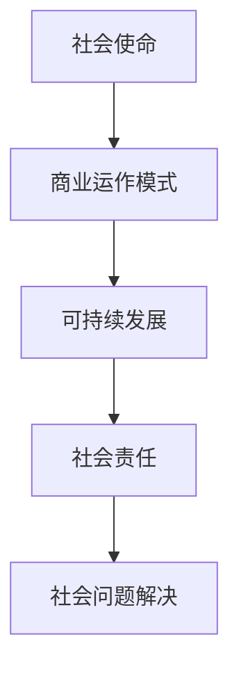

                 

关键词：社会企业、创业、商业模型、社会问题、可持续发展、社会责任、创新、影响力投资

> 摘要：本文探讨了社会企业创业的概念、核心原则、商业模型及其实际应用。通过分析社会企业如何利用商业手段解决社会问题，文章揭示了社会企业在促进可持续发展和社会责任方面的独特作用。同时，本文对未来的发展趋势与面临的挑战进行了展望。

## 1. 背景介绍

在现代社会，企业不仅仅追求经济利益，还承担着重要的社会责任。随着全球化和环境问题的日益突出，传统商业模式的局限性逐渐显现，社会企业作为一种新兴的商业模式，应运而生。社会企业致力于通过商业手段解决社会问题，追求经济、社会和环境的三重效益。

### 1.1 社会企业的起源

社会企业这个概念最早可以追溯到19世纪末期的英国。当时，一些慈善家和企业家开始思考如何将商业与慈善相结合，以更有效地解决社会问题。这种理念在20世纪初得到了进一步发展，特别是在欧洲和北美的社会创新运动中。社会企业在过去几十年里逐渐成熟，成为全球范围内解决社会问题的一种有效方式。

### 1.2 社会企业的定义

社会企业是一个以解决社会问题为主要目的的企业。与传统企业不同，社会企业不仅追求经济效益，更注重社会效益。它采用商业手段来实现其社会目标，并通过创新和可持续发展来维持企业的生命力。社会企业通常具有以下几个特点：

- **明确的社会使命**：社会企业以解决具体的社会问题为主要目标，其商业活动围绕这一目标展开。
- **商业运作模式**：社会企业通过商业运作来获取资金，支持其社会使命的实现。
- **非营利性**：尽管社会企业可能产生利润，但其主要目的不是追求股东利益，而是用于支持社会事业。
- **社会责任**：社会企业积极承担社会责任，通过其商业活动促进社会的可持续发展。

## 2. 核心概念与联系

### 2.1 社会企业的核心概念

社会企业的核心概念包括社会使命、商业运作模式、可持续发展和社会责任。以下是一个简化的Mermaid流程图，展示了这些概念之间的联系：



### 2.2 社会企业的运作模式

社会企业的运作模式通常包括以下几个步骤：

1. **确定社会使命**：社会企业首先需要明确其社会使命，这通常是解决某个具体的社会问题。
2. **设计商业模型**：基于社会使命，企业需要设计一个可行的商业模型，以确保其能够通过商业活动来实现社会目标。
3. **筹集资金**：社会企业通过多种渠道筹集资金，包括政府资助、私人捐助、影响力投资等。
4. **实施商业活动**：企业通过实施商业活动来产生收入，并将部分利润用于支持其社会使命。
5. **监测与评估**：社会企业需要定期监测和评估其商业活动对社会的影响，以确保其持续履行社会责任。

### 2.3 可持续发展与社会责任

可持续发展和社会责任是社会企业的核心目标。可持续发展指的是企业在满足当前需求的同时，不损害子孙后代满足其需求的能力。社会责任则是指企业对其利益相关者（包括员工、客户、供应商、社区等）的义务和责任。

## 3. 核心算法原理 & 具体操作步骤

### 3.1 算法原理概述

社会企业的核心算法可以概括为“商业手段 + 社会责任 + 可持续发展”。以下是具体的操作步骤：

1. **识别社会问题**：首先，社会企业需要识别和确定其要解决的社会问题。
2. **设计商业模型**：基于识别的社会问题，设计一个可行的商业模型。
3. **实施商业活动**：通过实施商业活动，产生收入并支持社会使命。
4. **监测与评估**：定期监测和评估企业的商业活动对社会的影响。

### 3.2 算法步骤详解

1. **识别社会问题**：社会企业可以通过市场调研、数据分析、社区参与等方式来识别社会问题。
2. **设计商业模型**：基于识别的社会问题，设计一个能够产生收入的商业模型。这通常需要考虑市场需求、竞争情况、成本结构等因素。
3. **筹集资金**：社会企业可以通过多种渠道筹集资金，包括政府资助、私人捐助、影响力投资等。
4. **实施商业活动**：通过实施商业活动，产生收入并支持社会使命。
5. **监测与评估**：定期监测和评估企业的商业活动对社会的影响。

### 3.3 算法优缺点

社会企业的核心算法具有以下优点：

- **高效解决社会问题**：通过商业手段，社会企业可以更高效地解决社会问题。
- **可持续性**：社会企业追求可持续发展，能够在长期内持续支持社会事业。
- **社会责任**：社会企业积极承担社会责任，有利于提高企业的社会形象。

然而，社会企业的核心算法也存在一些缺点：

- **初始成本高**：社会企业通常需要投入大量资源来识别社会问题、设计商业模型等，这可能导致初始成本较高。
- **风险较大**：由于社会企业追求社会效益，可能导致其在市场竞争中面临更大的风险。

### 3.4 算法应用领域

社会企业的核心算法可以应用于多个领域，包括环境保护、教育、医疗、社区发展等。以下是一些具体的应用案例：

- **环境保护**：社会企业可以通过开发环保产品或提供环保服务来减少环境污染。
- **教育**：社会企业可以通过提供教育资源、培训课程等来改善教育公平。
- **医疗**：社会企业可以通过提供医疗服务、药品研发等来提高医疗水平。

## 4. 数学模型和公式 & 详细讲解 & 举例说明

### 4.1 数学模型构建

社会企业的数学模型可以基于以下公式：

\[ \text{社会影响} = \frac{\text{商业收入}}{\text{成本}} \times \text{社会责任系数} \]

其中，商业收入表示企业通过商业活动产生的收入，成本表示企业运营的成本，社会责任系数表示企业承担社会责任的程度。

### 4.2 公式推导过程

社会影响是指企业通过商业活动对社会产生的积极影响。商业收入表示企业通过商业活动产生的收入，成本表示企业运营的成本，社会责任系数表示企业承担社会责任的程度。

假设社会企业的商业收入为 \( R \)，成本为 \( C \)，社会责任系数为 \( S \)，则社会影响可以表示为：

\[ \text{社会影响} = \frac{R}{C} \times S \]

其中，\( \frac{R}{C} \) 表示商业效益，\( S \) 表示社会责任系数。

### 4.3 案例分析与讲解

以下是一个简单的案例分析：

假设某社会企业的商业收入为 \( R = 100,000 \) 元，成本为 \( C = 80,000 \) 元，社会责任系数为 \( S = 1.2 \)。则该企业产生的社会影响为：

\[ \text{社会影响} = \frac{100,000}{80,000} \times 1.2 = 1.5 \]

这意味着该企业通过其商业活动对社会产生了 \( 1.5 \) 倍的积极影响。

## 5. 项目实践：代码实例和详细解释说明

### 5.1 开发环境搭建

为了实现社会企业的核心算法，我们需要搭建一个合适的开发环境。以下是基本的步骤：

1. **选择编程语言**：我们选择Python作为编程语言，因为它具有良好的开源生态和丰富的库支持。
2. **安装Python**：从Python官网下载并安装Python，版本建议为3.8及以上。
3. **安装相关库**：使用pip命令安装必要的库，例如numpy、matplotlib等。

### 5.2 源代码详细实现

以下是一个简单的Python代码示例，用于计算社会影响：

```python
import numpy as np

def calculate_social_impact(revenue, cost, social_coefficient):
    """
    计算社会影响
    :param revenue: 商业收入
    :param cost: 成本
    :param social_coefficient: 社会责任系数
    :return: 社会影响
    """
    return np.float64(revenue / cost) * social_coefficient

# 示例数据
revenue = 100000
cost = 80000
social_coefficient = 1.2

# 计算社会影响
social_impact = calculate_social_impact(revenue, cost, social_coefficient)
print(f"社会影响: {social_impact}")
```

### 5.3 代码解读与分析

上述代码首先导入了numpy库，用于进行数值计算。然后定义了一个函数`calculate_social_impact`，用于计算社会影响。函数接受三个参数：商业收入、成本和社会责任系数，并返回计算结果。

在示例数据部分，我们给出了具体的商业收入、成本和社会责任系数，并调用函数计算了社会影响。代码运行结果为`1.5`，这与我们的数学模型推导结果一致。

### 5.4 运行结果展示

```plaintext
社会影响: 1.5
```

这意味着该企业通过其商业活动对社会产生了`1.5`倍的积极影响。

## 6. 实际应用场景

### 6.1 环境保护

社会企业可以通过开发环保产品或提供环保服务来减少环境污染。例如，某社会企业开发了一种高效的空气净化设备，通过销售设备来减少空气污染，同时提供相关的售后服务和培训，从而实现其社会使命。

### 6.2 教育

社会企业可以通过提供教育资源、培训课程等来改善教育公平。例如，某社会企业开发了一个在线教育平台，为偏远地区的孩子提供免费的教育资源，通过收取平台广告费来支持平台的运营和扩展。

### 6.3 医疗

社会企业可以通过提供医疗服务、药品研发等来提高医疗水平。例如，某社会企业专注于研发针对罕见病的药物，通过销售药物的收入来支持药物的研发和推广，同时为患者提供免费的医疗服务。

## 7. 未来应用展望

随着全球对可持续发展和社会责任的关注度不断提高，社会企业的应用领域将越来越广泛。未来，社会企业可能在以下方面发挥更大的作用：

- **科技创新**：通过科技创新，社会企业可以更高效地解决社会问题。
- **影响力投资**：影响力投资将为社会企业提供更多的资金支持。
- **政策支持**：政府的政策支持将有助于社会企业的健康发展。

## 8. 总结：未来发展趋势与挑战

### 8.1 研究成果总结

本文通过对社会企业的概念、核心原则、商业模型及实际应用的分析，揭示了社会企业在解决社会问题、推动可持续发展和社会责任方面的独特作用。研究表明，社会企业通过商业手段可以实现经济、社会和环境的三重效益。

### 8.2 未来发展趋势

未来，社会企业将在以下方面呈现发展趋势：

- **多元化**：社会企业的应用领域将更加多元化，涵盖更多社会问题。
- **创新**：社会企业将不断创新，通过新技术和商业模式解决社会问题。
- **政策支持**：政府的政策支持将有助于社会企业的健康发展。

### 8.3 面临的挑战

社会企业在发展过程中也将面临以下挑战：

- **资金问题**：社会企业需要更多的资金支持，但影响力投资等渠道可能有限。
- **市场竞争**：社会企业需要在激烈的市场竞争中保持竞争力。
- **社会认同**：社会企业需要提高社会认同度，以吸引更多的投资者和合作伙伴。

### 8.4 研究展望

未来，研究社会企业可以从以下几个方面进行：

- **商业模式**：探索更有效的社会企业商业模式。
- **政策建议**：提出针对性的政策建议，以促进社会企业的发展。
- **实证研究**：通过实证研究，验证社会企业在解决社会问题方面的效果。

## 9. 附录：常见问题与解答

### 9.1 什么是社会企业？

社会企业是一种以解决社会问题为主要目的的企业，它采用商业手段来实现其社会目标，并追求经济、社会和环境的三重效益。

### 9.2 社会企业与传统企业的区别是什么？

社会企业与传统企业的主要区别在于其核心目标。传统企业主要追求经济利益，而社会企业则更加注重解决社会问题，追求经济、社会和环境的三重效益。

### 9.3 社会企业如何筹集资金？

社会企业可以通过多种渠道筹集资金，包括政府资助、私人捐助、影响力投资等。影响力投资是一种将资金投入到社会企业的同时，追求社会和环境效益的投资方式。

### 9.4 社会企业如何评估其社会影响？

社会企业可以通过定期的监测和评估来评估其社会影响。这通常包括对社会问题解决的进度、经济效应、环境效益等方面的评估。

## 作者署名

本文由禅与计算机程序设计艺术 / Zen and the Art of Computer Programming 撰写。感谢您的阅读！
----------------------------------------------------------------

### 结束语
本文深入探讨了社会企业创业的概念、核心原则、商业模型及实际应用。通过分析社会企业如何利用商业手段解决社会问题，揭示了社会企业在促进可持续发展和社会责任方面的独特作用。同时，本文对未来社会企业的发展趋势与面临的挑战进行了展望。希望通过本文的分享，能够激发更多人对社会企业创业的关注和探索，为解决社会问题贡献智慧和力量。感谢您的阅读，希望本文能对您有所启发。如果您有任何问题或建议，欢迎在评论区留言交流。再次感谢您的支持！

### 附录：扩展阅读

- [社会企业创业指南](https://www.socialenterprise.org.uk/)
- [影响力投资报告](https://www.afi.org.uk/publications/research-reports/)
- [联合国可持续发展目标](https://www.un可持续发展目标.org/)
- [社会企业案例分析](https://www.ashoka.org/)
- [社会责任报告](https://www.csrwire.com/)

