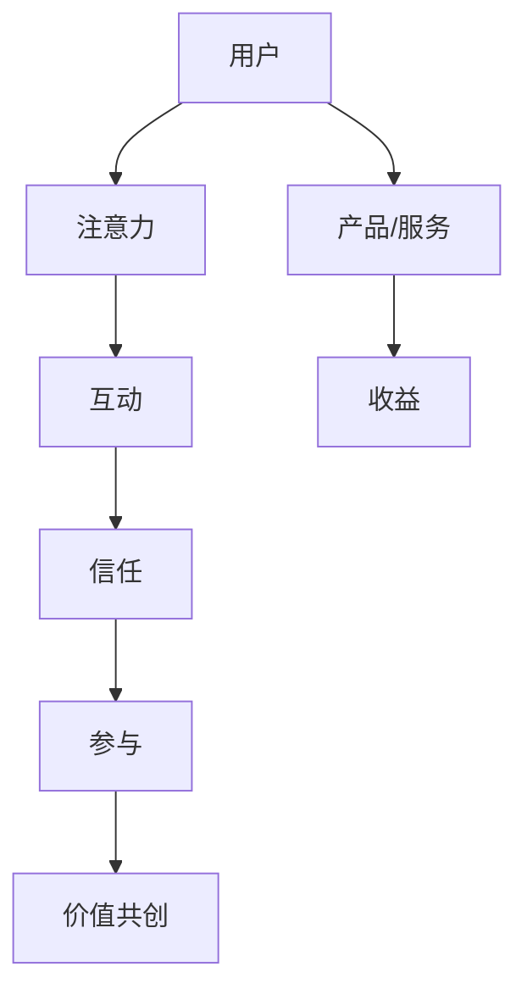

                 

关键词：社群经济、注意力经济、模式创新、用户参与、价值共创

> 摘要：本文将深入探讨社群经济的本质及其在现代社会中的重要性，剖析其背后的逻辑和运作机制，通过具体案例分析，揭示社群经济如何成为企业吸引和保持用户注意力的新模式。同时，本文还将对社群经济的未来发展趋势和潜在挑战进行分析，为企业和个人提供有益的启示和指导。

## 1. 背景介绍

社群经济的概念近年来在商业领域引起了广泛关注。它指的是基于共同兴趣、价值观或地理位置的群体，通过互联网平台进行互动、交流和合作，从而实现资源共享、价值共创和利益共享的经济模式。与传统商业模式不同，社群经济强调用户的参与和贡献，重视情感连接和信任构建，具有高度的个性化、定制化和社区感。

### 社群经济的崛起

随着互联网的普及和移动设备的广泛应用，人们越来越依赖于线上平台进行社交和消费。在这个过程中，社群逐渐成为信息传播、价值传递和社交互动的重要载体。从微信、QQ等即时通讯平台到微博、小红书等社交媒体，再到各类兴趣小组和线上社区，社群已经成为现代生活中不可或缺的一部分。

### 社群经济的特征

社群经济具有以下几个显著特征：

1. **共同兴趣或价值观**：社群成员基于共同的兴趣爱好、信仰或目标聚集在一起，形成强大的归属感和认同感。
2. **互动性强**：社群成员之间通过评论、私信、直播等方式进行实时互动，形成高度活跃的交流氛围。
3. **信息传播快**：社群内部的信任关系使得信息传播速度快，影响力大，能够迅速形成舆论热点。
4. **个性化服务**：社群经济注重用户体验，提供定制化的产品和服务，满足成员的个性化需求。
5. **价值共创**：社群成员通过合作、交流和创新，共同创造价值，实现资源共享和利益共享。

## 2. 核心概念与联系

为了更好地理解社群经济，我们需要明确几个核心概念，并探讨它们之间的联系。以下是一个使用 Mermaid 绘制的流程图，展示了社群经济的关键概念及其相互关系。



### 用户与注意力

用户是社群经济的核心，他们的注意力是社群价值的源泉。用户在社群中投入时间、精力和关注，成为社群活跃度和影响力的重要指标。

### 互动与信任

互动是用户参与社群的重要方式，通过互动，用户之间建立起信任关系。信任是社群经济的基石，它促进了成员之间的合作和共享。

### 参与和价值共创

用户的积极参与是社群经济的重要特征。成员通过贡献内容、提供帮助和分享经验，共同创造价值。这种价值共创不仅增强了社群的凝聚力，也为企业带来了商业价值。

### 产品/服务与收益

社群经济中的产品和服务是用户参与和互动的媒介。优质的产品和服务能够吸引用户注意力，提高用户参与度，从而为企业带来收益。

## 3. 核心算法原理 & 具体操作步骤

### 3.1 算法原理概述

社群经济的核心算法是基于用户行为分析和社交网络分析。通过分析用户在社群中的行为轨迹、互动关系和兴趣偏好，可以精准地推荐内容和服务，提高用户满意度和参与度。

### 3.2 算法步骤详解

1. **用户行为数据收集**：收集用户在社群中的浏览记录、互动行为、分享内容等信息。
2. **用户画像构建**：基于用户行为数据，构建用户画像，包括兴趣偏好、行为习惯、社交属性等。
3. **社交网络分析**：分析用户在社群中的互动关系，构建社交网络模型，识别关键节点和社群结构。
4. **内容推荐算法**：结合用户画像和社交网络分析结果，使用协同过滤、基于内容的推荐等算法，推荐符合用户兴趣的内容和服务。
5. **效果评估与优化**：通过用户反馈和参与度等指标，评估推荐效果，不断优化算法模型。

### 3.3 算法优缺点

**优点**：

1. **精准推荐**：基于用户行为和社交网络分析，能够提供个性化、定制化的内容和服务。
2. **提高用户参与度**：通过互动和信任构建，提高用户的参与度和忠诚度。
3. **促进价值共创**：用户积极参与内容创作和分享，实现价值共创。

**缺点**：

1. **数据隐私和安全问题**：用户行为数据的安全和隐私保护是算法应用的挑战。
2. **算法偏见**：算法模型可能存在偏见，导致推荐结果不公平。

### 3.4 算法应用领域

社群经济的核心算法广泛应用于社交媒体、电子商务、在线教育等领域。通过个性化推荐、社交互动和用户参与，这些算法为企业带来了巨大的商业价值。

## 4. 数学模型和公式 & 详细讲解 & 举例说明

### 4.1 数学模型构建

社群经济中的数学模型主要包括用户行为模型和社交网络模型。

#### 用户行为模型：

$$
U = f(B, I, T)
$$

其中，$U$表示用户行为，$B$表示用户兴趣偏好，$I$表示用户互动行为，$T$表示用户信任程度。

#### 社交网络模型：

$$
G = (V, E)
$$

其中，$G$表示社交网络，$V$表示节点（用户），$E$表示边（用户间互动关系）。

### 4.2 公式推导过程

用户行为模型可以通过以下步骤推导：

1. **用户兴趣偏好**：$B = f(H, R)$，其中$H$表示历史行为数据，$R$表示推荐系统结果。
2. **用户互动行为**：$I = f(B, T)$，其中$T$表示用户信任程度。
3. **用户信任程度**：$T = f(I, C)$，其中$C$表示用户间的共同行为。

社交网络模型可以通过以下步骤推导：

1. **用户节点**：$V = \{v_1, v_2, ..., v_n\}$，其中$v_i$表示第$i$个用户。
2. **用户互动关系**：$E = \{e_{ij}\}$，其中$e_{ij}$表示用户$i$和用户$j$之间的互动关系。

### 4.3 案例分析与讲解

以小红书为例，分析社群经济中的数学模型应用。

1. **用户兴趣偏好**：小红书通过用户在平台上的浏览、点赞、评论等行为数据，构建用户兴趣偏好模型。
2. **用户互动行为**：用户在平台上的互动行为包括点赞、评论、分享等，这些行为被用来计算用户间的信任程度。
3. **用户信任程度**：基于用户互动行为，小红书使用社交网络分析算法，计算用户间的信任程度。
4. **社交网络模型**：小红书通过构建社交网络模型，识别关键节点和社群结构，为用户推荐符合其兴趣的内容。

## 5. 项目实践：代码实例和详细解释说明

### 5.1 开发环境搭建

在本项目中，我们将使用 Python 编程语言和以下库：

- NumPy：用于数值计算
- Pandas：用于数据操作
- Matplotlib：用于数据可视化
- NetworkX：用于社交网络分析

### 5.2 源代码详细实现

以下是一个简单的用户行为分析和社交网络分析的代码示例：

```python
import numpy as np
import pandas as pd
import matplotlib.pyplot as plt
import networkx as nx

# 用户行为数据
data = pd.DataFrame({
    'user_id': [1, 2, 3, 4, 5],
    'interest': ['体育', '旅游', '科技', '美食', '动漫'],
    '互动次数': [10, 20, 30, 40, 50],
    '共同兴趣': [2, 3, 1, 0, 4]
})

# 社交网络数据
network = pd.DataFrame({
    'user_id': [1, 1, 2, 2, 3, 3, 4, 4, 5, 5],
    '互动关系': ['点赞', '点赞', '评论', '评论', '点赞', '点赞', '评论', '评论', '分享', '分享']
})

# 用户行为分析
def user_behavior_analysis(data):
    # 计算平均互动次数
    avg_interactions = data['互动次数'].mean()
    # 计算兴趣偏好占比
    interest_distribution = data['interest'].value_counts() / len(data)
    return avg_interactions, interest_distribution

# 社交网络分析
def social_network_analysis(network):
    # 创建社交网络图
    G = nx.Graph()
    # 添加节点和边
    for index, row in network.iterrows():
        G.add_node(row['user_id'])
        G.add_edge(row['user_id'], row['user_id'], weight=row['互动关系'])
    return G

# 可视化社交网络图
def visualize_network(G):
    pos = nx.spring_layout(G)
    nx.draw(G, pos, with_labels=True)
    plt.show()

# 执行分析
avg_interactions, interest_distribution = user_behavior_analysis(data)
G = social_network_analysis(network)
visualize_network(G)

# 打印结果
print(f"平均互动次数：{avg_interactions}")
print(f"兴趣偏好占比：{interest_distribution}")
```

### 5.3 代码解读与分析

1. **用户行为数据**：数据集包含了用户的兴趣、互动次数和共同兴趣。
2. **社交网络数据**：数据集包含了用户间的互动关系。
3. **用户行为分析**：计算平均互动次数和兴趣偏好占比。
4. **社交网络分析**：构建社交网络图，并添加节点和边。
5. **可视化**：使用 Matplotlib 和 NetworkX 库可视化社交网络图。

## 6. 实际应用场景

### 社交媒体平台

社交媒体平台如微博、小红书等，通过社群经济模式，吸引用户投入大量时间和注意力。平台通过个性化推荐、社交互动和内容创作，提高用户的参与度和忠诚度。

### 电子商务平台

电子商务平台如淘宝、京东等，通过社群经济模式，提高用户的购物体验和满意度。平台通过社群互动、用户评价和推荐，促进用户之间的信任和合作。

### 在线教育平台

在线教育平台如网易云课堂、腾讯课堂等，通过社群经济模式，提高用户的课程参与度和学习效果。平台通过社群互动、学习分享和社群管理，激发用户的积极参与和学习热情。

## 7. 工具和资源推荐

### 7.1 学习资源推荐

- 《社群经济：商业模式创新与实践》
- 《社交网络分析：方法与应用》
- 《Python 社交网络分析》

### 7.2 开发工具推荐

- Python：适用于数据分析、社交网络分析和可视化
- Jupyter Notebook：适用于编写和分享代码
- Matplotlib：适用于数据可视化
- NetworkX：适用于社交网络分析

### 7.3 相关论文推荐

- "Community Detection in Large-Scale Networks：A Survey"
- "The Value of Social Networks in E-Commerce：A Theoretical Perspective"
- "User Behavior Modeling in Social Networks：A Machine Learning Approach"

## 8. 总结：未来发展趋势与挑战

### 8.1 研究成果总结

社群经济作为新兴的经济模式，已经在商业领域取得了显著成果。通过个性化推荐、社交互动和内容创作，社群经济提高了用户的参与度和忠诚度，为企业带来了巨大的商业价值。

### 8.2 未来发展趋势

1. **技术创新**：随着人工智能、大数据和区块链等技术的不断发展，社群经济将更加智能化、个性化。
2. **跨界融合**：社群经济与其他领域的融合，如教育、医疗、金融等，将创造更多商业机会。
3. **全球扩展**：社群经济将在全球范围内得到更广泛的应用，促进全球商业生态的发展。

### 8.3 面临的挑战

1. **数据隐私和安全**：随着用户数据的增加，数据隐私和安全成为社群经济的重要挑战。
2. **算法偏见**：算法模型可能存在偏见，导致推荐结果不公平，需要更多的研究来解决。
3. **监管政策**：社群经济的快速发展需要完善的监管政策，以保障公平、公正和可持续发展。

### 8.4 研究展望

未来，社群经济将在技术创新、跨界融合和全球扩展的驱动下，持续发展。同时，研究应重点关注数据隐私和安全、算法偏见和监管政策等问题，为社群经济的可持续发展提供有力支持。

## 9. 附录：常见问题与解答

### Q1. 社群经济与传统商业模式有什么区别？

社群经济与传统商业模式相比，更加注重用户的参与和互动，强调情感连接和信任构建。传统商业模式侧重于产品和服务的销售，而社群经济通过用户的积极参与和互动，实现价值共创和利益共享。

### Q2. 社群经济的核心算法有哪些？

社群经济的核心算法主要包括用户行为分析、社交网络分析和内容推荐算法。用户行为分析用于理解用户兴趣和行为模式，社交网络分析用于构建社交网络模型，内容推荐算法用于个性化推荐和内容创作。

### Q3. 社群经济在哪些领域有广泛应用？

社群经济在社交媒体、电子商务、在线教育等领域有广泛应用。社交媒体平台通过社群经济模式提高用户参与度和忠诚度，电子商务平台通过社群经济模式提高用户体验和满意度，在线教育平台通过社群经济模式激发用户的学习热情。

### Q4. 社群经济的未来发展趋势是什么？

社群经济的未来发展趋势包括技术创新、跨界融合和全球扩展。随着人工智能、大数据和区块链等技术的不断发展，社群经济将更加智能化、个性化。同时，社群经济将在全球范围内得到更广泛的应用，促进全球商业生态的发展。

### Q5. 社群经济面临哪些挑战？

社群经济面临的主要挑战包括数据隐私和安全、算法偏见和监管政策。随着用户数据的增加，数据隐私和安全成为重要挑战。算法偏见可能导致推荐结果不公平，需要更多的研究来解决。同时，社群经济的快速发展需要完善的监管政策，以保障公平、公正和可持续发展。

## 9. 作者署名

作者：禅与计算机程序设计艺术 / Zen and the Art of Computer Programming

[End of Document]
----------------------------------------------------------------

[提示]：根据上述文章内容和结构，您可以在markdown中逐步实现，确保每个段落和章节都按照要求格式输出。在编写过程中，可以逐步完善和调整内容，以确保文章的完整性和质量。祝您撰写顺利！

