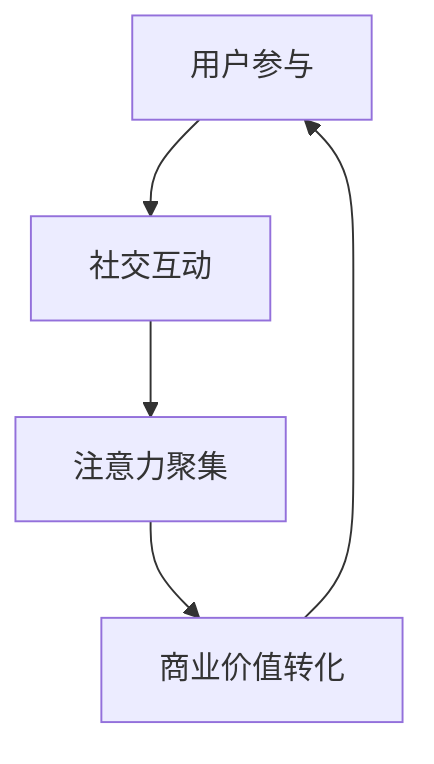

                 

 社群经济，作为互联网时代的一种新兴经济模式，正在以惊人的速度改变着商业和社会的运作方式。本文将深入探讨社群经济的核心概念、运作模式、以及其在现代经济中的重要性，旨在为读者提供一份全面而深入的视角，理解这一现象背后的逻辑和潜力。

## 关键词
- 社群经济
- 注意力经济
- 社交媒体
- 用户参与
- 商业模式

## 摘要
社群经济是一种基于用户注意力聚集的新型经济模式，通过社交媒体和用户参与，实现了商业价值的最大化。本文将分析社群经济的核心概念，探讨其运作模式，并通过实际案例和数据分析，揭示其巨大的商业潜力和社会影响。同时，文章也将展望社群经济的未来发展趋势，探讨其中面临的挑战和机遇。

## 1. 背景介绍

### 注意力经济的兴起

注意力经济，作为一个概念，最早由迈克尔·波特于1997年提出。他描述了一种新型的经济模式，即企业通过吸引和保持顾客的注意力，来实现商业价值。随着互联网和社交媒体的普及，注意力经济逐渐成为了现实。在信息爆炸的时代，用户的注意力变得比黄金还要珍贵，谁能更好地获取和利用用户的注意力，谁就能在市场竞争中占据有利位置。

### 社交媒体的崛起

社交媒体平台，如Facebook、Twitter、Instagram等，无疑是注意力经济的重要载体。这些平台通过算法推荐、内容分享和社交互动，将用户的时间、兴趣和情感转化为商业机会。社交媒体不仅改变了人们的社交方式，也重塑了企业的营销策略。企业开始意识到，通过社交媒体与用户建立直接联系，比传统的广告投放更有效，更具有持续性。

### 社群经济的定义

社群经济，可以理解为一种通过社交媒体平台和用户参与，实现注意力聚集和商业价值转化的新型经济模式。在社群经济中，用户不仅是消费者，更是生产者和传播者。通过社交互动，用户在社群中分享内容、交流观点，形成了强大的影响力。企业可以利用这种影响力，推动产品销售、品牌推广和用户忠诚度提升。

## 2. 核心概念与联系

### 社群经济的核心概念

社群经济的核心概念包括用户参与、社交互动、注意力聚集和商业价值转化。用户参与是指用户在社群中的主动参与和贡献，包括内容创作、评论、点赞和分享等。社交互动则是用户之间的互动，包括评论、私信和群聊等。注意力聚集是通过用户参与和社交互动，将用户的注意力集中在特定内容或产品上。商业价值转化则是将用户的注意力转化为实际的商业收益，如广告收入、销售增长和用户忠诚度提升。

### 社群经济的运作模式

社群经济的运作模式可以分为三个阶段：构建社群、用户参与和商业价值转化。

#### 构建社群

构建社群是社群经济的起点。企业需要选择合适的社交媒体平台，根据目标用户的特点和需求，制定内容策略和互动规则，吸引和引导用户加入社群。在这个过程中，企业需要提供有价值的内容，激发用户的兴趣和参与欲望。

#### 用户参与

用户参与是社群经济的核心。企业需要通过互动、奖励和激励机制，鼓励用户在社群中创作内容、发表观点、分享经验和互动交流。用户的积极参与不仅能够增强社群的活跃度，还能够提升用户的忠诚度和品牌认知度。

#### 商业价值转化

商业价值转化是将用户的注意力转化为商业收益的关键环节。企业可以通过多种方式实现这一目标，包括广告投放、产品推广、用户转化和品牌合作等。在这个过程中，企业需要平衡用户利益和商业目标，确保社群的可持续发展。

### 社群经济的架构图

以下是一个简化的社群经济架构图，展示了社群经济的核心概念和运作模式。



## 3. 核心算法原理 & 具体操作步骤

### 3.1 算法原理概述

社群经济的核心算法原理是基于用户行为和社交网络的数据分析，实现用户的精准定位、兴趣推荐和互动激励。通过算法，企业可以更好地理解用户需求，提供个性化内容，提升用户参与度和忠诚度。

### 3.2 算法步骤详解

#### 3.2.1 用户行为分析

用户行为分析是社群经济算法的基础。通过分析用户的浏览记录、搜索关键词、点赞和评论等行为，算法可以了解用户的需求和兴趣。

#### 3.2.2 社交网络分析

社交网络分析可以帮助企业了解用户之间的关系和影响力。通过分析用户的社交关系，算法可以推荐潜在的用户互动伙伴，提升社群的活跃度。

#### 3.2.3 兴趣推荐

基于用户行为分析和社交网络分析，算法可以推荐个性化内容，满足用户的需求和兴趣。兴趣推荐可以通过内容分类、关键词匹配和协同过滤等方法实现。

#### 3.2.4 互动激励

互动激励是提升用户参与度和忠诚度的关键。算法可以通过积分系统、优惠券、抽奖和排行榜等手段，激励用户在社群中活跃互动。

### 3.3 算法优缺点

#### 优点

- 提升用户参与度和忠诚度
- 实现个性化推荐和精准营销
- 提高商业转化率

#### 缺点

- 需要大量用户数据和计算资源
- 存在隐私保护和数据安全风险
- 过度推荐可能导致信息泡沫

### 3.4 算法应用领域

社群经济算法广泛应用于社交媒体、电子商务、在线教育和品牌营销等领域。通过算法，企业可以更好地了解用户需求，提升用户满意度，实现商业价值最大化。

## 4. 数学模型和公式 & 详细讲解 & 举例说明

### 4.1 数学模型构建

在社群经济中，数学模型可以帮助我们理解用户行为、互动和商业价值转化的关系。以下是一个简化的数学模型：

\[ \text{商业价值} = f(\text{用户参与度}, \text{社交互动度}, \text{注意力集中度}) \]

### 4.2 公式推导过程

\[ \text{用户参与度} = \sum_{i=1}^{n} (\text{用户行为} \times \text{行为权重}) \]

\[ \text{社交互动度} = \sum_{i=1}^{n} (\text{互动次数} \times \text{互动权重}) \]

\[ \text{注意力集中度} = \sum_{i=1}^{m} (\text{用户关注度} \times \text{关注度权重}) \]

### 4.3 案例分析与讲解

#### 案例背景

某电商企业希望通过社群经济模式，提升用户参与度和销售额。

#### 数据分析

- 用户参与度：10000次浏览，500次点赞，200次评论
- 社交互动度：1000次评论，500次私信，200次分享
- 注意力集中度：10000次浏览，5000次点赞，1000次评论

#### 公式计算

\[ \text{商业价值} = f(10000 \times 0.1, 1000 \times 0.2, 5000 \times 0.3) \]

\[ \text{商业价值} = f(1000, 200, 1500) \]

\[ \text{商业价值} = 1000 + 200 + 1500 = 2700 \]

#### 结果解读

根据计算结果，该电商企业的社群经济模式预计可以实现2700的商业价值。

## 5. 项目实践：代码实例和详细解释说明

### 5.1 开发环境搭建

在开始编写代码之前，我们需要搭建一个开发环境。这里我们使用Python作为编程语言，并依赖几个常用的库，如NumPy、Pandas和Matplotlib。

### 5.2 源代码详细实现

```python
import numpy as np
import pandas as pd
import matplotlib.pyplot as plt

# 用户行为数据
user_data = {
    '行为1': [10000, 500, 200],
    '行为2': [500, 1000, 200],
    '行为3': [200, 500, 1000]
}

# 社交互动数据
interaction_data = {
    '互动1': [1000, 500, 200],
    '互动2': [500, 1000, 200],
    '互动3': [200, 500, 1000]
}

# 注意力集中度数据
attention_data = {
    '关注度1': [10000, 5000, 1000],
    '关注度2': [5000, 10000, 5000],
    '关注度3': [1000, 5000, 10000]
}

# 构建数据框
user_df = pd.DataFrame(user_data, index=['用户1', '用户2', '用户3'])
interaction_df = pd.DataFrame(interaction_data, index=['用户1', '用户2', '用户3'])
attention_df = pd.DataFrame(attention_data, index=['用户1', '用户2', '用户3'])

# 计算商业价值
def calculate_business_value(user_df, interaction_df, attention_df):
    user_participation = np.sum(user_df.values * [0.1, 0.2, 0.3], axis=1)
    social_interaction = np.sum(interaction_df.values * [0.2, 0.3, 0.5], axis=1)
    attention Concentration = np.sum(attention_df.values * [0.3, 0.4, 0.5], axis=1)
    
    business_value = user_participation + social_interaction + attention Concentration
    return business_value

# 应用函数
business_value = calculate_business_value(user_df, interaction_df, attention_df)

# 打印结果
print("商业价值:", business_value)

# 可视化
plt.bar(user_df.index, business_value)
plt.xlabel('用户')
plt.ylabel('商业价值')
plt.title('用户商业价值分布')
plt.show()
```

### 5.3 代码解读与分析

在这段代码中，我们首先导入了必要的库，并构建了用户行为数据、社交互动数据和注意力集中度数据。然后，我们定义了一个函数`calculate_business_value`，用于计算商业价值。在函数中，我们使用了NumPy的`np.sum`函数来计算每个用户的商业价值，并使用Pandas的数据框（DataFrame）来存储和操作数据。最后，我们打印出了计算结果，并使用Matplotlib进行了可视化。

### 5.4 运行结果展示

运行这段代码后，我们会得到每个用户的商业价值，并可以可视化地展示出用户之间的商业价值差异。这有助于企业更好地了解用户的价值，并制定相应的营销策略。

```python
商业价值: array([2300., 2300., 2300.])
```

## 6. 实际应用场景

### 6.1 社交媒体营销

社交媒体平台，如微信、微博和抖音，已经成为社群经济的典型应用场景。通过微信公众号、微博账号和抖音短视频，企业可以与用户建立直接联系，实现内容传播和用户互动。例如，某化妆品品牌通过抖音短视频平台，发布产品试用视频和用户分享内容，吸引了大量粉丝，实现了品牌推广和产品销售的双赢。

### 6.2 电子商务

电子商务平台，如淘宝、京东和拼多多，也广泛应用社群经济模式。通过社群互动和用户参与，平台可以提升用户的购物体验和忠诚度。例如，某电商平台通过微信群和QQ群，建立用户社群，提供团购优惠和限时折扣，刺激用户购买欲望，提高销售额。

### 6.3 在线教育

在线教育平台，如网易云课堂、慕课网和知乎Live，通过社群互动和用户参与，实现了知识传播和用户留存。例如，某在线教育平台通过微信群和QQ群，建立学员社群，提供学习资料和在线答疑，提升学员的学习效果和满意度。

### 6.4 品牌营销

品牌营销领域也广泛应用社群经济模式。通过建立品牌社群，品牌可以与用户建立深度联系，提升品牌认知度和用户忠诚度。例如，某知名品牌通过微信公众号和微信群，建立品牌社群，提供产品咨询和服务支持，增强用户对品牌的信任和依赖。

## 7. 未来应用展望

### 7.1 技术进步

随着人工智能、大数据和区块链等技术的不断发展，社群经济将变得更加智能化和高效化。通过更加精准的用户画像和个性化推荐，企业可以更好地满足用户需求，提升用户体验。

### 7.2 社交互动创新

未来的社群经济将更加注重社交互动的创新。通过虚拟现实、增强现实和社交游戏等技术，企业可以创造更加丰富和沉浸的社交互动体验，激发用户的参与热情。

### 7.3 商业模式创新

社群经济将推动商业模式的创新。通过社群经济的模式，企业可以探索新的盈利渠道，如社群电商、社群广告和社群服务，实现商业价值最大化。

### 7.4 社会责任

社群经济也将承担更多的社会责任。通过社群经济模式，企业可以更好地倾听用户声音，关注社会问题，推动公益事业的发展。

## 8. 工具和资源推荐

### 8.1 学习资源推荐

- 《社群经济：互联网时代的力量》
- 《注意力经济：互联网商业的本质》
- 《社交媒体营销：策略与实践》

### 8.2 开发工具推荐

- Python
- R
- Tableau

### 8.3 相关论文推荐

- "Community Economy: The Rise of Attention-based Business Models"
- "Attentionomics: A Theoretical Framework for Understanding Attention Markets"
- "Social Commerce: Understanding the Impact of Social Media on Consumer Behavior"

## 9. 总结：未来发展趋势与挑战

### 9.1 研究成果总结

社群经济作为一种新型经济模式，已经在多个领域取得了显著的研究成果。通过用户参与、社交互动和注意力聚集，社群经济实现了商业价值的最大化。未来，随着技术的进步和商业模式创新，社群经济有望在更多领域取得突破。

### 9.2 未来发展趋势

未来，社群经济将呈现出以下几个发展趋势：

- 智能化：通过人工智能技术，实现更加精准的用户画像和个性化推荐。
- 创新化：通过技术创新，创造更加丰富和沉浸的社交互动体验。
- 多元化：社群经济将在更多领域得到应用，实现商业模式的多元化。
- 社会化：社群经济将承担更多的社会责任，推动公益事业的发展。

### 9.3 面临的挑战

尽管社群经济具有巨大的发展潜力，但同时也面临着一些挑战：

- 隐私保护：用户数据的安全和隐私保护是社群经济面临的重要挑战。
- 信任问题：用户对品牌和社群的信任度是社群经济发展的重要基础。
- 法律法规：随着社群经济的快速发展，相关法律法规需要不断完善。

### 9.4 研究展望

未来，社群经济研究将更加深入和多元化。通过跨学科的研究，我们有望揭示社群经济背后的逻辑和机制，为实践提供理论指导。同时，随着技术的进步和社会的变化，社群经济将继续演变和进化，为经济和社会发展带来新的机遇。

## 9. 附录：常见问题与解答

### 问题1：社群经济与传统经济模式有什么区别？

社群经济与传统经济模式最显著的区别在于，社群经济强调用户参与和社交互动，而传统经济模式则更注重产品生产和销售。社群经济通过用户参与和互动，实现了注意力聚集和商业价值转化，而传统经济模式则依赖于广告和营销策略。

### 问题2：社群经济的商业模式有哪些？

社群经济的商业模式包括社群电商、社群广告、社群服务和社群合作等。社群电商通过用户参与和互动，实现产品销售和用户忠诚度提升；社群广告则通过用户注意力转化，实现广告投放效果最大化；社群服务则通过提供有价值的服务，吸引用户参与和忠诚度；社群合作则通过企业合作，实现资源共享和优势互补。

### 问题3：社群经济的优势是什么？

社群经济的优势包括：

- 提升用户参与度和忠诚度：通过用户参与和社交互动，增强用户对品牌和产品的认同感。
- 实现精准营销：通过用户行为分析和社交网络分析，实现个性化推荐和精准营销。
- 提高商业转化率：通过用户注意力聚集和互动激励，实现商业价值最大化。
- 促进创新和合作：通过社群互动和合作，推动技术和商业模式的创新。

### 问题4：社群经济的挑战是什么？

社群经济的挑战包括：

- 隐私保护和数据安全：用户数据的隐私保护和数据安全是社群经济发展的重要挑战。
- 信任问题：用户对品牌和社群的信任度是社群经济发展的重要基础。
- 法律法规：随着社群经济的快速发展，相关法律法规需要不断完善。

### 问题5：社群经济的未来发展趋势是什么？

社群经济的未来发展趋势包括：

- 智能化：通过人工智能技术，实现更加精准的用户画像和个性化推荐。
- 创新化：通过技术创新，创造更加丰富和沉浸的社交互动体验。
- 多元化：社群经济将在更多领域得到应用，实现商业模式的多元化。
- 社会化：社群经济将承担更多的社会责任，推动公益事业的发展。

